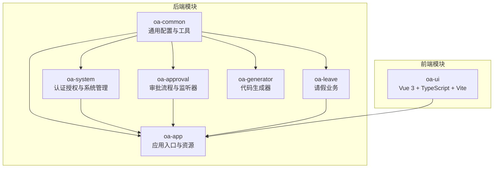
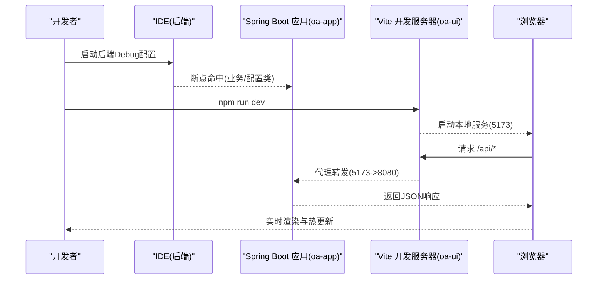
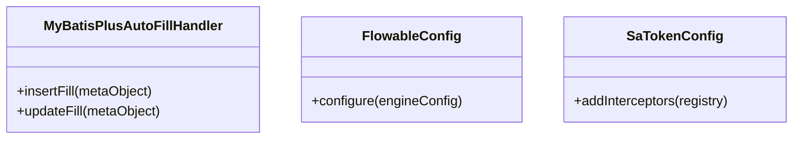
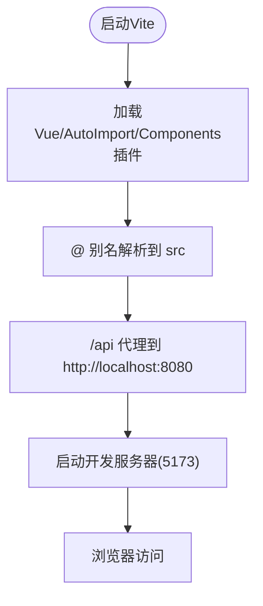
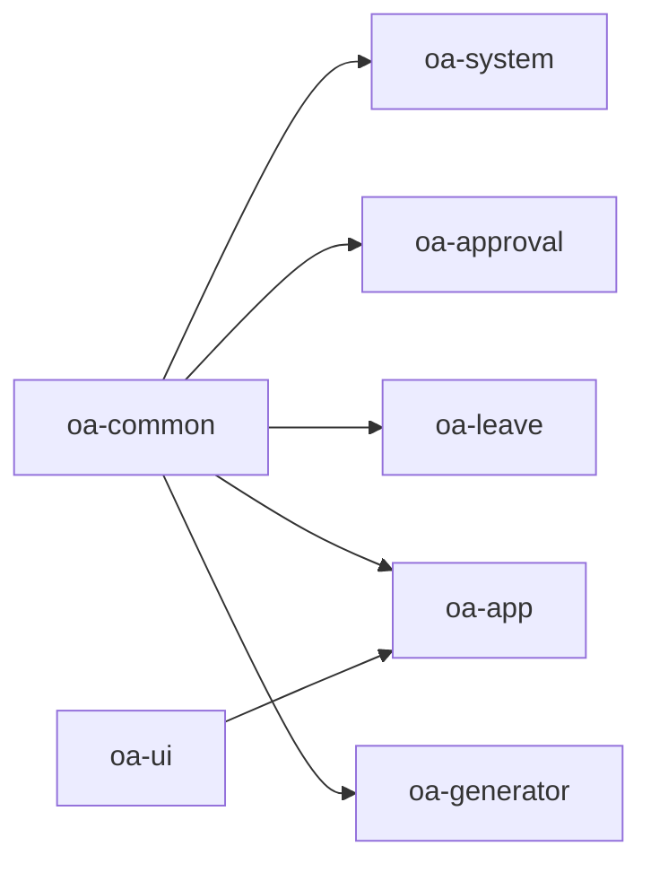

# IDE配置指南

<cite>
**本文档引用的文件**
- [pom.xml](file://pom.xml)
- [application.yml](file://oa-app/src/main/resources/application.yml)
- [MyBatisPlusAutoFillHandler.java](file://oa-common/src/main/java/com/oa/admin/common/config/MyBatisPlusAutoFillHandler.java)
- [FlowableConfig.java](file://oa-approval/src/main/java/com/oa/admin/approval/config/FlowableConfig.java)
- [SaTokenConfig.java](file://oa-system/src/main/java/com/oa/admin/system/config/SaTokenConfig.java)
- [package.json](file://oa-ui/package.json)
- [vite.config.ts](file://oa-ui/vite.config.ts)
- [tsconfig.json](file://oa-ui/tsconfig.json)
- [tsconfig.node.json](file://oa-ui/tsconfig.node.json)
- [vitest.config.ts](file://oa-ui/vitest.config.ts)
- [main.ts](file://oa-ui/src/main.ts)
- [index.ts](file://oa-ui/src/router/index.ts)
</cite>

## 目录
1. [简介](#简介)
2. [项目结构概览](#项目结构概览)
3. [核心配置组件](#核心配置组件)
4. [架构总览](#架构总览)
5. [详细组件配置分析](#详细组件配置分析)
6. [依赖关系分析](#依赖关系分析)
7. [性能与开发效率考虑](#性能与开发效率考虑)
8. [故障排除指南](#故障排除指南)
9. [结论](#结论)
10. [附录：IDE配置清单](#附录ide配置清单)

## 简介
本指南面向OA审批管理系统的开发者，提供IntelliJ IDEA与VS Code的完整IDE配置建议，涵盖插件安装、代码格式化、自动导入、断点调试、Maven多模块导入、前端TypeScript/Vite/ESLint配置、代码模板与Live Templates、Git集成与提交钩子等。文档基于仓库中的实际配置文件进行分析，并给出可操作的步骤与最佳实践。

## 项目结构概览
该系统采用前后端分离的多模块Maven工程：
- 后端（Spring Boot 3.5 + Java 17）：包含通用模块、系统管理、审批流程、请假模块、应用入口与代码生成器。
- 前端（Vue 3 + TypeScript + Vite）：使用Element Plus、Pinia、Vue Router，通过Vite开发服务器代理后端接口。

图表来源
- [pom.xml:21-28](file://pom.xml#L21-L28)
- [application.yml:1-59](file://oa-app/src/main/resources/application.yml#L1-L59)

章节来源
- [pom.xml:1-131](file://pom.xml#L1-L131)
- [application.yml:1-59](file://oa-app/src/main/resources/application.yml#L1-L59)

## 核心配置组件
- 后端JDK与编码：统一使用Java 17，源/目标版本与项目构建编码均为UTF-8。
- 数据库连接：MySQL 8，Hikari连接池参数可由环境变量覆盖。
- ORM与自动填充：MyBatis-Plus自动填充（创建/更新时间），Flyway数据库迁移启用。
- 认证授权：Sa-Token拦截器保护后端API。
- 流程引擎：Flowable Spring Boot Starter，事件监听器注册。
- 前端TypeScript：严格模式、ES2022目标、bundler模块解析、路径别名@/*。
- Vite开发服务器：本地5173端口，代理/api到后端8080端口。

章节来源
- [pom.xml:30-42](file://pom.xml#L30-L42)
- [application.yml:4-59](file://oa-app/src/main/resources/application.yml#L4-L59)
- [MyBatisPlusAutoFillHandler.java:11-24](file://oa-common/src/main/java/com/oa/admin/common/config/MyBatisPlusAutoFillHandler.java#L11-L24)
- [SaTokenConfig.java:12-24](file://oa-system/src/main/java/com/oa/admin/system/config/SaTokenConfig.java#L12-L24)
- [FlowableConfig.java:15-30](file://oa-approval/src/main/java/com/oa/admin/approval/config/FlowableConfig.java#L15-L30)
- [tsconfig.json:1-24](file://oa-ui/tsconfig.json#L1-L24)
- [vite.config.ts:12-39](file://oa-ui/vite.config.ts#L12-L39)

## 架构总览
下图展示IDE中后端与前端的典型开发与调试流程，包括断点调试、热重载与API代理。

图表来源
- [application.yml:1-59](file://oa-app/src/main/resources/application.yml#L1-L59)
- [vite.config.ts:30-37](file://oa-ui/vite.config.ts#L30-L37)
- [main.ts:1-14](file://oa-ui/src/main.ts#L1-L14)

## 详细组件配置分析

### IntelliJ IDEA 配置要点
- 插件推荐
  - Lombok：简化实体与配置类字段/构造器生成。
  - MyBatis Log：查看SQL执行日志，便于调试数据层问题。
  - Vue Language Features：支持Vue单文件组件语法高亮与智能提示。
  - Alibaba Java Coding Guidelines：遵循阿里巴巴代码规范。
  - CheckStyle-IDEA：统一团队代码风格。
- 代码格式化与自动导入
  - 使用CheckStyle或IDE内置格式化器，保持缩进、空行、换行一致。
  - 设置“优化导入”快捷键，自动移除未使用包，排序导入。
- 断点调试配置
  - 新建“Spring Boot”运行配置，主类指向应用入口。
  - 在关键配置类（如FlowableConfig、SaTokenConfig）设置条件断点。
  - 后端端口默认8080，前端默认5173，确保代理配置正确。
- Maven项目导入
  - 导入根pom.xml，勾选“Use plugin execution roots”，启用Maven生命周期。
  - 模块依赖：common为系统基础，system/approval/leave依赖common；app聚合所有模块；ui独立。
  - JDK版本：确保全局JDK 17，模块属性中也设置为17。
  - 编码：在Maven配置中设置UTF-8，避免中文注释与SQL异常。
- Git与提交钩子
  - 在IDE中启用“Commit by Chang”或“Git ToolBox”，在提交前自动运行检查。
  - 可结合pre-commit脚本（如ESLint、单元测试）在IDE中配置“Before Commit”。

章节来源
- [pom.xml:21-28](file://pom.xml#L21-L28)
- [pom.xml:30-42](file://pom.xml#L30-L42)
- [FlowableConfig.java:15-30](file://oa-approval/src/main/java/com/oa/admin/approval/config/FlowableConfig.java#L15-L30)
- [SaTokenConfig.java:12-24](file://oa-system/src/main/java/com/oa/admin/system/config/SaTokenConfig.java#L12-L24)
- [application.yml:1-59](file://oa-app/src/main/resources/application.yml#L1-L59)

### VS Code 配置要点
- 插件推荐
  - Vue Language Features & Extension Pack
  - ESLint（仓库提供lint脚本，可在VS Code中集成）
  - Debugger for Chrome/Firefox（配合Vite调试）
  - Bracket Pair Colorizer、Path Intellisense
- 代码格式化与自动导入
  - 使用Prettier或ESLint格式化，保存时自动修复。
  - TypeScript自动导入：启用“autoImport”相关功能（Vite插件已生成类型声明文件）。
- 断点调试配置
  - 前端：添加Chrome调试配置，启动Vite dev server。
  - 后端：使用Java调试器连接Spring Boot应用（端口8080）。
- 前端项目配置
  - TypeScript：严格模式、ES2022目标、bundler解析、路径别名@/*。
  - Vite：5173端口，/api代理至后端8080。
  - 路由与状态：Pinia、Vue Router按现有配置工作。
- Git与提交钩子
  - 在VS Code中启用“Git: Commit”前运行ESLint与测试。
  - 使用husky+lint-staged在本地提交前自动格式化与校验。

章节来源
- [package.json:6-14](file://oa-ui/package.json#L6-L14)
- [vite.config.ts:12-39](file://oa-ui/vite.config.ts#L12-L39)
- [tsconfig.json:1-24](file://oa-ui/tsconfig.json#L1-L24)
- [tsconfig.node.json:1-19](file://oa-ui/tsconfig.node.json#L1-L19)
- [vitest.config.ts:9-21](file://oa-ui/vitest.config.ts#L9-L21)
- [main.ts:1-14](file://oa-ui/src/main.ts#L1-L14)
- [index.ts:1-134](file://oa-ui/src/router/index.ts#L1-L134)

### 后端关键配置类分析
- MyBatis-Plus自动填充
  - 自动填充创建与更新时间字段，减少重复代码。
- Flowable配置
  - 注册流程结束事件监听器，扩展流程完成后处理逻辑。
- Sa-Token拦截器
  - 对/api/v1/**路径进行登录校验，开放登录/注册接口。

图表来源
- [MyBatisPlusAutoFillHandler.java:11-24](file://oa-common/src/main/java/com/oa/admin/common/config/MyBatisPlusAutoFillHandler.java#L11-L24)
- [FlowableConfig.java:15-30](file://oa-approval/src/main/java/com/oa/admin/approval/config/FlowableConfig.java#L15-L30)
- [SaTokenConfig.java:12-24](file://oa-system/src/main/java/com/oa/admin/system/config/SaTokenConfig.java#L12-L24)

章节来源
- [MyBatisPlusAutoFillHandler.java:11-24](file://oa-common/src/main/java/com/oa/admin/common/config/MyBatisPlusAutoFillHandler.java#L11-L24)
- [FlowableConfig.java:15-30](file://oa-approval/src/main/java/com/oa/admin/approval/config/FlowableConfig.java#L15-L30)
- [SaTokenConfig.java:12-24](file://oa-system/src/main/java/com/oa/admin/system/config/SaTokenConfig.java#L12-L24)

### 前端关键配置分析
- Vite配置
  - 插件：Vue、AutoImport、Components（Element Plus解析器）。
  - 别名：@ 指向src目录。
  - 代理：/api -> http://localhost:8080。
- TypeScript配置
  - 目标/模块：ES2022/ESNext。
  - 解析策略：bundler，允许TS扩展导入。
  - 路径映射：@/* -> src/*。
- 路由与状态
  - Vue Router按模块划分页面，包含系统管理、审批、仪表盘、请假等。
  - Pinia用于状态管理，Element Plus提供UI组件库。

图表来源
- [vite.config.ts:12-39](file://oa-ui/vite.config.ts#L12-L39)
- [tsconfig.json:18-20](file://oa-ui/tsconfig.json#L18-L20)
- [index.ts:1-134](file://oa-ui/src/router/index.ts#L1-L134)

章节来源
- [vite.config.ts:12-39](file://oa-ui/vite.config.ts#L12-L39)
- [tsconfig.json:1-24](file://oa-ui/tsconfig.json#L1-L24)
- [tsconfig.node.json:1-19](file://oa-ui/tsconfig.node.json#L1-L19)
- [vitest.config.ts:9-21](file://oa-ui/vitest.config.ts#L9-L21)
- [main.ts:1-14](file://oa-ui/src/main.ts#L1-L14)
- [index.ts:1-134](file://oa-ui/src/router/index.ts#L1-L134)

## 依赖关系分析
- 后端依赖层次
  - common为基础设施，被system、approval、leave复用。
  - app作为聚合模块，整合各子模块并提供资源与配置。
  - generator独立，用于代码生成。
- 前后端交互
  - 前端通过Vite代理访问后端API，路由与状态管理清晰。

图表来源
- [pom.xml:21-28](file://pom.xml#L21-L28)

章节来源
- [pom.xml:21-28](file://pom.xml#L21-L28)

## 性能与开发效率考虑
- 后端
  - 使用Hikari连接池参数可调，建议根据并发与数据库性能调整最大池大小与超时。
  - Flyway启用迁移，确保数据库结构一致性。
- 前端
  - Vite热重载与按需加载提升开发体验。
  - TypeScript严格模式降低运行时错误风险。
  - Vitest用于单元测试，建议在提交前运行覆盖率检查。

## 故障排除指南
- 后端无法连接数据库
  - 检查环境变量与application.yml中的数据源配置，确认MySQL服务可用。
- 前端代理无效
  - 确认Vite代理配置与后端端口一致，浏览器控制台无跨域错误。
- Java编译报错
  - 确保IDE与Maven均使用Java 17，清理并重新导入Maven项目。
- TypeScript路径解析失败
  - 确认tsconfig.json中的路径映射与实际目录一致，重启语言服务。

章节来源
- [application.yml:4-18](file://oa-app/src/main/resources/application.yml#L4-L18)
- [vite.config.ts:30-37](file://oa-ui/vite.config.ts#L30-L37)
- [pom.xml:30-33](file://pom.xml#L30-L33)
- [tsconfig.json:18-20](file://oa-ui/tsconfig.json#L18-L20)

## 结论
通过上述IDE配置与项目配置的协同，开发者可以在IntelliJ IDEA与VS Code中获得一致且高效的开发体验。后端强调配置类与ORM自动填充的调试便利性，前端强调TypeScript/Vite生态的开发效率。建议团队统一代码风格与提交流程，持续提升协作效率与代码质量。

## 附录：IDE配置清单
- IntelliJ IDEA
  - 插件：Lombok、MyBatis Log、Vue Language Features、Alibaba Java Coding Guidelines、CheckStyle-IDEA
  - 代码格式化：统一缩进与换行，开启保存时优化导入
  - 运行配置：Spring Boot（8080端口）、Vue Dev（5173端口）
  - Maven：导入根pom.xml，JDK 17，UTF-8编码
- VS Code
  - 插件：Vue Language Features、ESLint、Debugger for Chrome、Bracket Pair Colorizer
  - TypeScript：严格模式、bundler解析、路径别名@/*
  - Vite：5173端口、/api代理至8080
  - Git：提交前运行ESLint与测试，可选husky+lint-staged