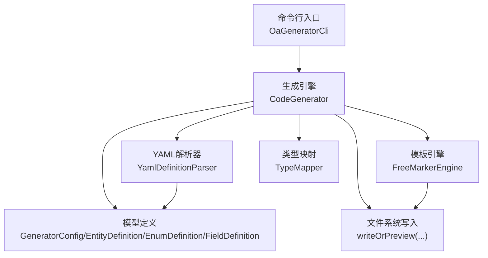
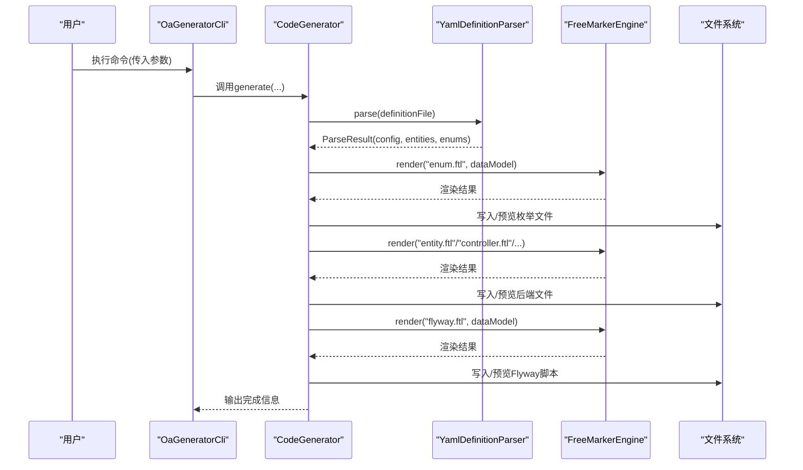
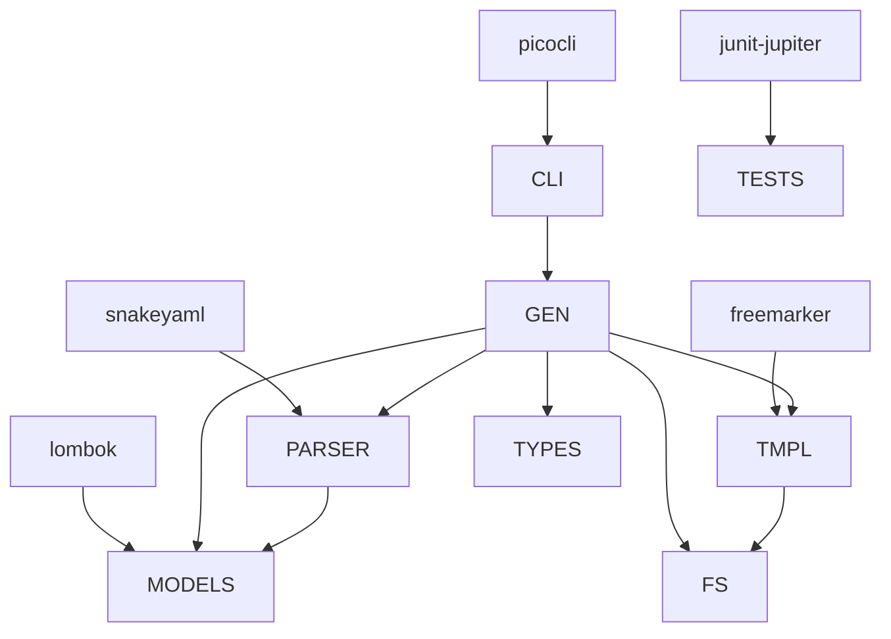

# 代码生成器使用

<cite>
**本文引用的文件**
- [OaGeneratorCli.java](file://oa-generator/src/main/java/com/oa/admin/generator/OaGeneratorCli.java)
- [CodeGenerator.java](file://oa-generator/src/main/java/com/oa/admin/generator/engine/CodeGenerator.java)
- [FreeMarkerEngine.java](file://oa-generator/src/main/java/com/oa/admin/generator/engine/FreeMarkerEngine.java)
- [YamlDefinitionParser.java](file://oa-generator/src/main/java/com/oa/admin/generator/parser/YamlDefinitionParser.java)
- [TypeMapper.java](file://oa-generator/src/main/java/com/oa/admin/generator/parser/TypeMapper.java)
- [GeneratorConfig.java](file://oa-generator/src/main/java/com/oa/admin/generator/config/GeneratorConfig.java)
- [NamingUtils.java](file://oa-generator/src/main/java/com/oa/admin/generator/util/NamingUtils.java)
- [EntityDefinition.java](file://oa-generator/src/main/java/com/oa/admin/generator/model/EntityDefinition.java)
- [EnumDefinition.java](file://oa-generator/src/main/java/com/oa/admin/generator/model/EnumDefinition.java)
- [FieldDefinition.java](file://oa-generator/src/main/java/com/oa/admin/generator/model/FieldDefinition.java)
- [leave-request.yaml](file://generators/leave-request.yaml)
- [entity.ftl](file://oa-generator/src/main/resources/templates/entity.ftl)
- [controller.ftl](file://oa-generator/src/main/resources/templates/controller.ftl)
- [flyway.ftl](file://oa-generator/src/main/resources/templates/flyway.ftl)
- [list.vue.ftl](file://oa-generator/src/main/resources/templates/vue/list.vue.ftl)
- [CodeGeneratorCrudStackTest.java](file://oa-generator/src/test/java/com/oa/admin/generator/engine/CodeGeneratorCrudStackTest.java)
- [pom.xml](file://oa-generator/pom.xml)
</cite>

## 目录
1. [简介](#简介)
2. [项目结构](#项目结构)
3. [核心组件](#核心组件)
4. [架构总览](#架构总览)
5. [详细组件分析](#详细组件分析)
6. [依赖分析](#依赖分析)
7. [性能考虑](#性能考虑)
8. [故障排查指南](#故障排查指南)
9. [结论](#结论)
10. [附录](#附录)

## 简介
本指南面向OA审批管理系统中的代码生成器，帮助你从零开始掌握YAML DSL定义语法、命令行使用方法、模板引擎（FreeMarker）用法、生成流程与验证方法，并提供自定义模板开发的最佳实践。生成器支持后端（实体、DTO、VO、Mapper、Service、ServiceImpl、Controller）、数据库迁移脚本（Flyway）以及前端（Vue 3页面与路由片段）的一体化生成。

## 项目结构
- 命令行入口：OaGeneratorCli
- 生成引擎：CodeGenerator
- 模板引擎：FreeMarkerEngine（基于FreeMarker）
- 解析器：YamlDefinitionParser（解析YAML DSL）
- 类型映射：TypeMapper（YAML类型到Java类型的映射）
- 配置模型：GeneratorConfig、EntityDefinition、EnumDefinition、FieldDefinition
- 工具类：NamingUtils（命名转换）
- 示例DSL：generators/leave-request.yaml
- 模板资源：oa-generator/src/main/resources/templates 下的各类ftl模板

图表来源
- [OaGeneratorCli.java:12-76](file://oa-generator/src/main/java/com/oa/admin/generator/OaGeneratorCli.java#L12-L76)
- [CodeGenerator.java:22-63](file://oa-generator/src/main/java/com/oa/admin/generator/engine/CodeGenerator.java#L22-L63)
- [YamlDefinitionParser.java:23-49](file://oa-generator/src/main/java/com/oa/admin/generator/parser/YamlDefinitionParser.java#L23-L49)
- [FreeMarkerEngine.java:17-37](file://oa-generator/src/main/java/com/oa/admin/generator/engine/FreeMarkerEngine.java#L17-L37)
- [TypeMapper.java:9-66](file://oa-generator/src/main/java/com/oa/admin/generator/parser/TypeMapper.java#L9-L66)
- [GeneratorConfig.java:8-19](file://oa-generator/src/main/java/com/oa/admin/generator/config/GeneratorConfig.java#L8-L19)
- [EntityDefinition.java:12-66](file://oa-generator/src/main/java/com/oa/admin/generator/model/EntityDefinition.java#L12-L66)
- [EnumDefinition.java:10-24](file://oa-generator/src/main/java/com/oa/admin/generator/model/EnumDefinition.java#L10-L24)
- [FieldDefinition.java:9-30](file://oa-generator/src/main/java/com/oa/admin/generator/model/FieldDefinition.java#L9-L30)

章节来源
- [OaGeneratorCli.java:12-76](file://oa-generator/src/main/java/com/oa/admin/generator/OaGeneratorCli.java#L12-L76)
- [CodeGenerator.java:22-63](file://oa-generator/src/main/java/com/oa/admin/generator/engine/CodeGenerator.java#L22-L63)
- [YamlDefinitionParser.java:23-49](file://oa-generator/src/main/java/com/oa/admin/generator/parser/YamlDefinitionParser.java#L23-L49)
- [FreeMarkerEngine.java:17-37](file://oa-generator/src/main/java/com/oa/admin/generator/engine/FreeMarkerEngine.java#L17-L37)
- [TypeMapper.java:9-66](file://oa-generator/src/main/java/com/oa/admin/generator/parser/TypeMapper.java#L9-L66)
- [GeneratorConfig.java:8-19](file://oa-generator/src/main/java/com/oa/admin/generator/config/GeneratorConfig.java#L8-L19)
- [EntityDefinition.java:12-66](file://oa-generator/src/main/java/com/oa/admin/generator/model/EntityDefinition.java#L12-L66)
- [EnumDefinition.java:10-24](file://oa-generator/src/main/java/com/oa/admin/generator/model/EnumDefinition.java#L10-L24)
- [FieldDefinition.java:9-30](file://oa-generator/src/main/java/com/oa/admin/generator/model/FieldDefinition.java#L9-L30)

## 核心组件
- 命令行工具：提供参数解析与调用生成引擎，支持预览、仅生成Flyway脚本、同时生成前端页面等。
- 生成引擎：负责解析DSL、构建数据模型、渲染模板、写入文件或预览输出。
- 模板引擎：加载classpath下的模板资源，按数据模型渲染文本内容。
- YAML解析器：将DSL转换为内部模型（全局配置、枚举、实体、字段、索引）。
- 类型映射：确保YAML类型与Java类型一致，提供导入与简单类型名。
- 模型定义：封装生成所需的数据结构，如包名、表名、字段、索引、枚举值等。
- 工具类：命名转换（驼峰/蛇形），用于表名、列名、文件路径等推导。

章节来源
- [OaGeneratorCli.java:12-76](file://oa-generator/src/main/java/com/oa/admin/generator/OaGeneratorCli.java#L12-L76)
- [CodeGenerator.java:22-63](file://oa-generator/src/main/java/com/oa/admin/generator/engine/CodeGenerator.java#L22-L63)
- [FreeMarkerEngine.java:17-37](file://oa-generator/src/main/java/com/oa/admin/generator/engine/FreeMarkerEngine.java#L17-L37)
- [YamlDefinitionParser.java:23-49](file://oa-generator/src/main/java/com/oa/admin/generator/parser/YamlDefinitionParser.java#L23-L49)
- [TypeMapper.java:9-66](file://oa-generator/src/main/java/com/oa/admin/generator/parser/TypeMapper.java#L9-L66)
- [GeneratorConfig.java:8-19](file://oa-generator/src/main/java/com/oa/admin/generator/config/GeneratorConfig.java#L8-L19)
- [EntityDefinition.java:12-66](file://oa-generator/src/main/java/com/oa/admin/generator/model/EntityDefinition.java#L12-L66)
- [EnumDefinition.java:10-24](file://oa-generator/src/main/java/com/oa/admin/generator/model/EnumDefinition.java#L10-L24)
- [FieldDefinition.java:9-30](file://oa-generator/src/main/java/com/oa/admin/generator/model/FieldDefinition.java#L9-L30)
- [NamingUtils.java:6-62](file://oa-generator/src/main/java/com/oa/admin/generator/util/NamingUtils.java#L6-L62)

## 架构总览
下图展示了从命令行到文件生成的整体流程，包括YAML解析、模板渲染与文件落盘。

图表来源
- [OaGeneratorCli.java:51-70](file://oa-generator/src/main/java/com/oa/admin/generator/OaGeneratorCli.java#L51-L70)
- [CodeGenerator.java:27-63](file://oa-generator/src/main/java/com/oa/admin/generator/engine/CodeGenerator.java#L27-L63)
- [YamlDefinitionParser.java:34-48](file://oa-generator/src/main/java/com/oa/admin/generator/parser/YamlDefinitionParser.java#L34-L48)
- [FreeMarkerEngine.java:30-35](file://oa-generator/src/main/java/com/oa/admin/generator/engine/FreeMarkerEngine.java#L30-L35)

## 详细组件分析

### 命令行使用指南
- 入口类：OaGeneratorCli
- 主要参数
  - 定义文件：位置参数，指定YAML定义文件路径
  - --project/-p：项目根目录，默认当前目录
  - --target-module/-m：目标Maven模块，默认oa-app
  - --dry-run：预览模式，不写文件
  - --flyway-only：仅生成Flyway迁移脚本
  - --frontend：同时生成Vue 3前端页面
  - --entity：仅生成指定实体（逗号分隔）
- 运行方式
  - 可直接运行主函数或打包后使用java -jar执行
  - 生成完成后会打印后续步骤提示（MapperScan、权限种子数据、前端路由与菜单）

章节来源
- [OaGeneratorCli.java:21-49](file://oa-generator/src/main/java/com/oa/admin/generator/OaGeneratorCli.java#L21-L49)
- [OaGeneratorCli.java:51-74](file://oa-generator/src/main/java/com/oa/admin/generator/OaGeneratorCli.java#L51-L74)
- [pom.xml:52-91](file://oa-generator/pom.xml#L52-L91)

### YAML DSL定义语法
- 全局配置（global）
  - module：模块名，决定包名与前端模块目录
  - tablePrefix：表前缀，用于推导表名
  - author：作者，用于生成注释
  - basePackage：基础包名，默认com.oa.admin
- 枚举定义（enums）
  - 键为枚举名称；每个枚举含type与values
  - type默认int；values为键值对或对象，对象可包含code与label
- 实体定义（entities）
  - 列表形式，每个元素为“实体名: 属性”
  - 支持属性：tableName（显式表名）、comment（注释）、fields（字段列表）、indexes（索引列表）
- 字段定义（fields）
  - name/type/column/sqlType/nullable/defaultValue/comment/searchable/enum/jsonFormat
  - column未指定时自动由字段名转蛇形
- 索引定义（indexes）
  - name/columns/unique

章节来源
- [YamlDefinitionParser.java:52-62](file://oa-generator/src/main/java/com/oa/admin/generator/parser/YamlDefinitionParser.java#L52-L62)
- [YamlDefinitionParser.java:66-97](file://oa-generator/src/main/java/com/oa/admin/generator/parser/YamlDefinitionParser.java#L66-L97)
- [YamlDefinitionParser.java:100-125](file://oa-generator/src/main/java/com/oa/admin/generator/parser/YamlDefinitionParser.java#L100-L125)
- [YamlDefinitionParser.java:136-159](file://oa-generator/src/main/java/com/oa/admin/generator/parser/YamlDefinitionParser.java#L136-L159)
- [YamlDefinitionParser.java:177-190](file://oa-generator/src/main/java/com/oa/admin/generator/parser/YamlDefinitionParser.java#L177-L190)
- [YamlDefinitionParser.java:168-174](file://oa-generator/src/main/java/com/oa/admin/generator/parser/YamlDefinitionParser.java#L168-L174)
- [YamlDefinitionParser.java:127-133](file://oa-generator/src/main/java/com/oa/admin/generator/parser/YamlDefinitionParser.java#L127-L133)
- [YamlDefinitionParser.java:161-166](file://oa-generator/src/main/java/com/oa/admin/generator/parser/YamlDefinitionParser.java#L161-L166)
- [GeneratorConfig.java:8-19](file://oa-generator/src/main/java/com/oa/admin/generator/config/GeneratorConfig.java#L8-L19)
- [EntityDefinition.java:12-66](file://oa-generator/src/main/java/com/oa/admin/generator/model/EntityDefinition.java#L12-L66)
- [EnumDefinition.java:10-24](file://oa-generator/src/main/java/com/oa/admin/generator/model/EnumDefinition.java#L10-L24)
- [FieldDefinition.java:9-30](file://oa-generator/src/main/java/com/oa/admin/generator/model/FieldDefinition.java#L9-L30)

### 模板引擎与内置对象
- 模板加载：FreeMarkerEngine从classpath:/templates加载模板
- 数据模型（ctx）
  - config：全局配置
  - entity：当前实体
  - enums：所有枚举
  - packageName：完整包名
  - allEntities：全部实体（Flyway脚本）
  - flywayVersion/flywayDescription：Flyway版本与描述
- 内置方法（TypeMapperStaticMethods）
  - getSimpleJavaType(yamlType)：返回简单Java类型名
  - getImport(yamlType)：返回需要导入的全限定类型
- FreeMarker语法要点
  - 变量：${...}
  - 列表遍历：<#list ... as ...>
  - 条件判断：<#if ...>
  - 宏与函数：<#macro>/<#function>
  - 注释：<#-- ... -->

章节来源
- [FreeMarkerEngine.java:21-28](file://oa-generator/src/main/java/com/oa/admin/generator/engine/FreeMarkerEngine.java#L21-L28)
- [CodeGenerator.java:135-144](file://oa-generator/src/main/java/com/oa/admin/generator/engine/CodeGenerator.java#L135-L144)
- [CodeGenerator.java:216-224](file://oa-generator/src/main/java/com/oa/admin/generator/engine/CodeGenerator.java#L216-L224)
- [entity.ftl:1-63](file://oa-generator/src/main/resources/templates/entity.ftl#L1-L63)
- [list.vue.ftl:117-144](file://oa-generator/src/main/resources/templates/vue/list.vue.ftl#L117-L144)

### 生成流程与产物
- 后端生成
  - 枚举：templates/enum.ftl
  - 实体：templates/entity.ftl
  - DTO/VO：templates/createDTO.ftl、templates/updateDTO.ftl、templates/queryDTO.ftl、templates/vo.ftl
  - Mapper/Service/ServiceImpl/Controller：templates/mapper.ftl、templates/service.ftl、templates/serviceImpl.ftl、templates/controller.ftl
- 数据库迁移（Flyway）
  - templates/flyway.ftl，生成建表与索引SQL
- 前端（Vue 3）
  - 列表页、表单对话框、API封装、路由片段
  - templates/vue/list.vue.ftl、templates/vue/form-dialog.vue.ftl、templates/vue/api.ts.ftl、templates/vue/route-snippet.ts.ftl

章节来源
- [CodeGenerator.java:65-114](file://oa-generator/src/main/java/com/oa/admin/generator/engine/CodeGenerator.java#L65-L114)
- [CodeGenerator.java:116-133](file://oa-generator/src/main/java/com/oa/admin/generator/engine/CodeGenerator.java#L116-L133)
- [CodeGenerator.java:158-203](file://oa-generator/src/main/java/com/oa/admin/generator/engine/CodeGenerator.java#L158-L203)
- [flyway.ftl:1-21](file://oa-generator/src/main/resources/templates/flyway.ftl#L1-L21)
- [entity.ftl:1-63](file://oa-generator/src/main/resources/templates/entity.ftl#L1-L63)
- [controller.ftl:1-56](file://oa-generator/src/main/resources/templates/controller.ftl#L1-L56)
- [list.vue.ftl:1-144](file://oa-generator/src/main/resources/templates/vue/list.vue.ftl#L1-L144)

### 使用示例
- 示例DSL：generators/leave-request.yaml
  - 定义了模块、表前缀、作者
  - 定义了两个枚举（LeaveType、LeaveStatus）
  - 定义了一个实体LeaveRequest，包含字段与索引
- 生成步骤
  - 在仓库根目录执行命令，指向该YAML文件
  - 生成后可在对应模块的包结构下看到生成的文件
  - Flyway脚本位于db/migration目录
  - 如启用--frontend，会在oa-ui中生成前端页面与API

章节来源
- [leave-request.yaml:1-74](file://generators/leave-request.yaml#L1-L74)
- [CodeGenerator.java:27-63](file://oa-generator/src/main/java/com/oa/admin/generator/engine/CodeGenerator.java#L27-L63)

### 生成结果验证
- 编译检查：在目标模块执行编译，确保生成的Java文件无语法错误
- 单元测试：参考测试用例，验证DTO/VO/Service实现是否包含枚举转换逻辑
- 代码风格：结合项目统一的checkstyle/spotless配置进行检查
- 前端验证：在oa-ui中核对路由片段与菜单项是否正确添加

章节来源
- [CodeGeneratorCrudStackTest.java:20-73](file://oa-generator/src/test/java/com/oa/admin/generator/engine/CodeGeneratorCrudStackTest.java#L20-L73)

### 自定义模板开发指南
- 模板位置：oa-generator/src/main/resources/templates
- 推荐命名
  - 后端：entity.ftl、mapper.ftl、service.ftl、serviceImpl.ftl、controller.ftl、enum.ftl
  - DTO/VO：createDTO.ftl、updateDTO.ftl、queryDTO.ftl、vo.ftl
  - Flyway：flyway.ftl
  - 前端：vue/list.vue.ftl、vue/form-dialog.vue.ftl、vue/api.ts.ftl、vue/route-snippet.ts.ftl
- 最佳实践
  - 复用TypeMapper提供的方法，避免硬编码类型映射
  - 使用宏/函数抽象重复逻辑（如搜索控件、宽度计算）
  - 保持数据模型ctx的清晰性，减少模板内复杂逻辑
  - 为每类产物准备独立模板，便于维护与扩展

章节来源
- [FreeMarkerEngine.java:21-28](file://oa-generator/src/main/java/com/oa/admin/generator/engine/FreeMarkerEngine.java#L21-L28)
- [CodeGenerator.java:135-144](file://oa-generator/src/main/java/com/oa/admin/generator/engine/CodeGenerator.java#L135-L144)
- [entity.ftl:1-63](file://oa-generator/src/main/resources/templates/entity.ftl#L1-L63)
- [list.vue.ftl:117-144](file://oa-generator/src/main/resources/templates/vue/list.vue.ftl#L117-L144)

## 依赖分析
- 外部依赖
  - snakeyaml：解析YAML
  - freemarker：模板渲染
  - picocli：命令行参数解析
  - lombok：简化Java代码
  - junit-jupiter：测试框架
- 内部模块耦合
  - CLI依赖生成引擎
  - 生成引擎依赖解析器、模板引擎、类型映射与模型
  - 模板依赖数据模型与类型映射

图表来源
- [pom.xml:16-49](file://oa-generator/pom.xml#L16-L49)
- [OaGeneratorCli.java:3-6](file://oa-generator/src/main/java/com/oa/admin/generator/OaGeneratorCli.java#L3-L6)
- [CodeGenerator.java:3-9](file://oa-generator/src/main/java/com/oa/admin/generator/engine/CodeGenerator.java#L3-L9)
- [FreeMarkerEngine.java:3-6](file://oa-generator/src/main/java/com/oa/admin/generator/engine/FreeMarkerEngine.java#L3-L6)
- [YamlDefinitionParser.java:9](file://oa-generator/src/main/java/com/oa/admin/generator/parser/YamlDefinitionParser.java#L9)
- [EntityDefinition.java:3](file://oa-generator/src/main/java/com/oa/admin/generator/model/EntityDefinition.java#L3)
- [EnumDefinition.java:3](file://oa-generator/src/main/java/com/oa/admin/generator/model/EnumDefinition.java#L3)
- [FieldDefinition.java:3](file://oa-generator/src/main/java/com/oa/admin/generator/model/FieldDefinition.java#L3)
- [CodeGeneratorCrudStackTest.java:3-10](file://oa-generator/src/test/java/com/oa/admin/generator/engine/CodeGeneratorCrudStackTest.java#L3-L10)

章节来源
- [pom.xml:16-49](file://oa-generator/pom.xml#L16-L49)

## 性能考虑
- 模板渲染：尽量复用数据模型，避免在模板中做重型计算
- 文件写入：批量生成时注意I/O开销，Dry Run有助于快速迭代
- 类型映射：通过静态方法缓存常用映射，减少重复解析
- 前端生成：模板中避免不必要的嵌套与重复逻辑，提升渲染效率

## 故障排查指南
- 参数错误
  - 确认定义文件路径存在且可读
  - 检查--project与--target-module是否指向正确的Maven模块
- YAML语法错误
  - 枚举引用未定义：检查字段的enum引用是否存在于enums中
  - 字段类型非法：确保type在TypeMapper支持集合内
- 模板渲染异常
  - 检查模板中变量是否存在（如ctx.entity、ctx.enums）
  - 确保宏/函数调用正确
- 生成结果验证
  - 若编译失败，优先检查类型映射与导入
  - 若前端无法运行，核对路由片段与API文件是否正确生成

章节来源
- [YamlDefinitionParser.java:192-202](file://oa-generator/src/main/java/com/oa/admin/generator/parser/YamlDefinitionParser.java#L192-L202)
- [YamlDefinitionParser.java:168-174](file://oa-generator/src/main/java/com/oa/admin/generator/parser/YamlDefinitionParser.java#L168-L174)
- [CodeGenerator.java:146-156](file://oa-generator/src/main/java/com/oa/admin/generator/engine/CodeGenerator.java#L146-L156)
- [CodeGeneratorCrudStackTest.java:20-73](file://oa-generator/src/test/java/com/oa/admin/generator/engine/CodeGeneratorCrudStackTest.java#L20-L73)

## 结论
本代码生成器以YAML DSL为核心，结合FreeMarker模板，实现了从实体到前后端的全栈代码生成。通过合理的DSL设计与模板组织，开发者可以快速搭建业务模块骨架，显著提升开发效率。建议在团队内统一DSL规范与模板约定，配合CI进行编译与测试校验，确保生成质量。

## 附录
- 常用命令
  - 预览生成：java -cp ... com.oa.admin.generator.OaGeneratorCli path/to/your.yaml --dry-run
  - 仅生成Flyway：java -cp ... com.oa.admin.generator.OaGeneratorCli path/to/your.yaml --flyway-only
  - 生成前端：java -cp ... com.oa.admin.generator.OaGeneratorCli path/to/your.yaml --frontend
  - 指定模块：java -cp ... com.oa.admin.generator.OaGeneratorCli path/to/your.yaml -m your-module
- 后续步骤
  - 在应用类中添加MapperScan扫描路径
  - 在sys_permission表中添加权限种子数据
  - 将路由片段添加至前端路由文件
  - 在侧边栏菜单中增加入口