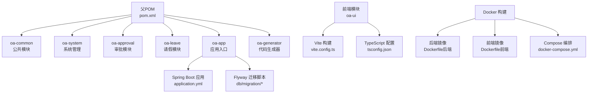
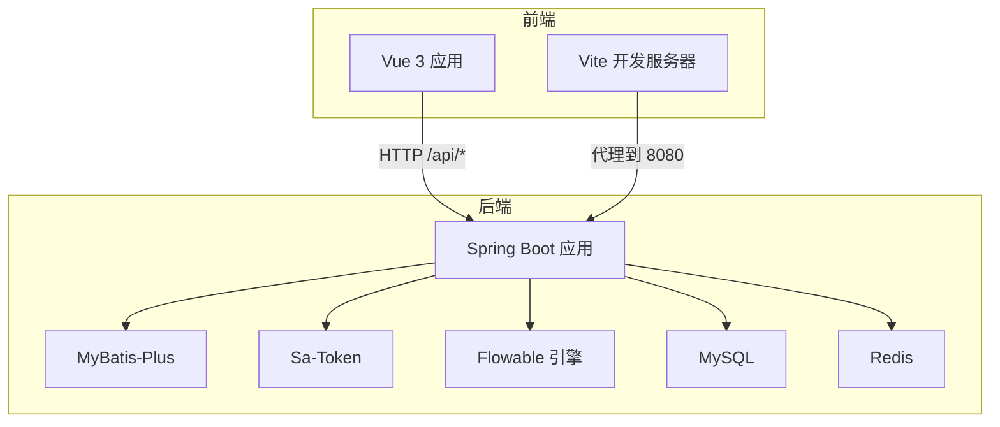
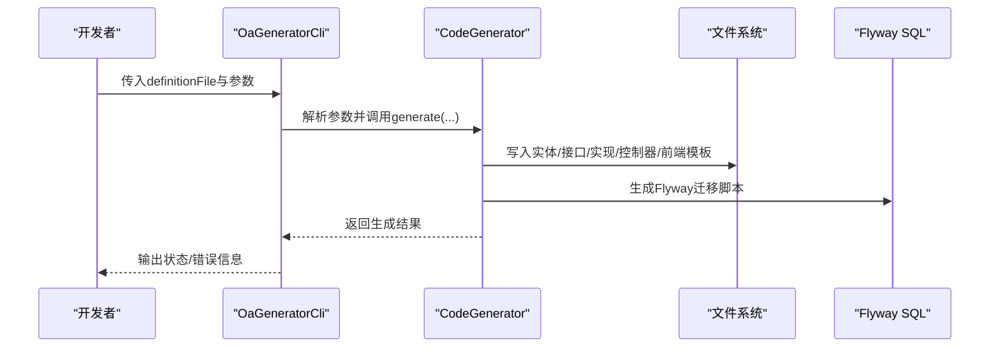
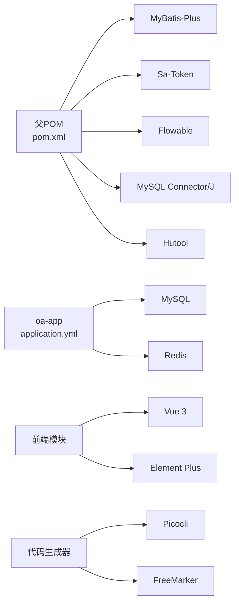

# 开发工具

<cite>
**本文引用的文件**
- [pom.xml](file://pom.xml)
- [Dockerfile（后端）](file://Dockerfile)
- [docker-compose.yml](file://docker-compose.yml)
- [init.sh](file://init.sh)
- [application.yml](file://oa-app/src/main/resources/application.yml)
- [vite.config.ts](file://oa-ui/vite.config.ts)
- [tsconfig.json](file://oa-ui/tsconfig.json)
- [package.json（前端）](file://oa-ui/package.json)
- [Dockerfile（前端）](file://oa-ui/Dockerfile)
- [OaGeneratorCli.java](file://oa-generator/src/main/java/com/oa/admin/generator/OaGeneratorCli.java)
- [GeneratorConfig.java](file://oa-generator/src/main/java/com/oa/admin/generator/config/GeneratorConfig.java)
- [leave-request.yaml](file://generators/leave-request.yaml)
- [README.md](file://README.md)
</cite>

## 目录
1. [简介](#简介)
2. [项目结构](#项目结构)
3. [核心组件](#核心组件)
4. [架构总览](#架构总览)
5. [详细组件分析](#详细组件分析)
6. [依赖关系分析](#依赖关系分析)
7. [性能考虑](#性能考虑)
8. [故障排查指南](#故障排查指南)
9. [结论](#结论)
10. [附录](#附录)

## 简介
本指南面向OA审批管理系统的开发者，围绕开发环境配置、IDE推荐设置、构建与打包、代码生成器使用、调试与性能分析、以及常用开发辅助工具进行系统化说明。文档以仓库中的实际配置文件为依据，确保可操作性与准确性。

## 项目结构
该工程采用多模块Maven结构，包含后端公共模块、系统管理模块、审批模块、应用入口模块、前端模块与代码生成器模块，并通过Docker与Compose实现一键部署。

图表来源
- [pom.xml:1-131](file://pom.xml#L1-L131)
- [application.yml:1-59](file://oa-app/src/main/resources/application.yml#L1-L59)
- [vite.config.ts:1-40](file://oa-ui/vite.config.ts#L1-L40)
- [tsconfig.json:1-24](file://oa-ui/tsconfig.json#L1-L24)
- [Dockerfile（后端）:1-22](file://Dockerfile#L1-L22)
- [Dockerfile（前端）:1-15](file://oa-ui/Dockerfile#L1-L15)
- [docker-compose.yml:1-66](file://docker-compose.yml#L1-L66)

章节来源
- [pom.xml:1-131](file://pom.xml#L1-L131)
- [README.md:48-61](file://README.md#L48-L61)

## 核心组件
- 多模块Maven工程：统一版本与依赖管理，便于团队协作与发布。
- Spring Boot + MyBatis-Plus + Sa-Token + Flowable：后端技术栈，提供权限控制与审批流程能力。
- Vue 3 + Vite + Element Plus：前端技术栈，提供可视化界面与交互。
- Docker + docker-compose：容器化部署，简化本地与CI环境一致性。
- 代码生成器：基于YAML定义快速生成后端CRUD与Flyway迁移脚本。

章节来源
- [pom.xml:30-113](file://pom.xml#L30-L113)
- [application.yml:45-59](file://oa-app/src/main/resources/application.yml#L45-L59)
- [package.json（前端）:1-38](file://oa-ui/package.json#L1-L38)
- [README.md:5-19](file://README.md#L5-L19)

## 架构总览
系统由后端Spring Boot应用、MySQL数据库、Redis缓存、前端Vue应用组成；通过docker-compose编排，后端依赖MySQL与Redis，前端依赖后端API。

图表来源
- [docker-compose.yml:1-66](file://docker-compose.yml#L1-L66)
- [application.yml:4-59](file://oa-app/src/main/resources/application.yml#L4-L59)
- [vite.config.ts:30-38](file://oa-ui/vite.config.ts#L30-L38)

## 详细组件分析

### 开发环境配置
- JDK 17+：父POM显式声明Java版本为17，编译插件也对齐至17。
- Node.js：前端使用Vite 6与TypeScript 5.8，建议使用Node 18+。
- MySQL：默认使用8.0，Compose中暴露端口13306映射至容器3306。
- Redis：默认使用7.x，Compose中暴露端口16379映射至容器6379。

章节来源
- [pom.xml:30-34](file://pom.xml#L30-L34)
- [package.json（前端）:1-38](file://oa-ui/package.json#L1-L38)
- [docker-compose.yml:2-20](file://docker-compose.yml#L2-L20)
- [docker-compose.yml:22-29](file://docker-compose.yml#L22-L29)

### IDE推荐配置
- IntelliJ IDEA
  - 插件：Lombok、MyBatis Log、Rainbow Brackets、String Manipulation、Key Promoter X。
  - 代码格式化：启用Google Java Format或Checkstyle，统一缩进与换行。
  - 调试：为Spring Boot主类设置断点，使用Run/Debug配置启动模块。
- VS Code
  - 插件：ESLint、Prettier、Vue Language Features (Volar)、TypeScript Importer、Bracket Pair Colorizer。
  - 代码格式化：ESLint + Prettier，配合tsconfig.json严格模式。
  - 调试：为后端设置Java调试配置，前端使用Vite内置调试。

章节来源
- [tsconfig.json:1-24](file://oa-ui/tsconfig.json#L1-L24)
- [vite.config.ts:1-40](file://oa-ui/vite.config.ts#L1-L40)

### 构建工具使用
- Maven多模块构建
  - 父POM集中管理版本与依赖，子模块按需引入。
  - 构建命令示例：mvn clean install -DskipTests。
- Vite前端构建
  - 开发：npm run dev（默认端口5173，代理到后端8080）。
  - 生产：npm run build（输出dist目录）。
  - 测试：npm run test / test:watch / test:coverage。
- Docker镜像构建
  - 后端镜像：基于maven:3.9-eclipse-temurin-17，多模块打包oa-app。
  - 前端镜像：基于node:22-alpine，构建后使用nginx静态托管。
  - Compose编排：docker compose up -d，自动拉起MySQL、Redis、后端、前端。

章节来源
- [pom.xml:21-28](file://pom.xml#L21-L28)
- [package.json（前端）:6-14](file://oa-ui/package.json#L6-L14)
- [Dockerfile（后端）:1-22](file://Dockerfile#L1-L22)
- [Dockerfile（前端）:1-15](file://oa-ui/Dockerfile#L1-L15)
- [docker-compose.yml:1-66](file://docker-compose.yml#L1-L66)

### 代码生成器使用
- 生成器入口
  - CLI类提供命令行参数解析与执行流程。
- 命令行参数
  - 必选：definitionFile（YAML定义文件路径）
  - 可选：
    - -p/--project：项目根目录，默认当前目录
    - -m/--target-module：目标Maven模块，默认oa-app
    - --dry-run：仅预览，不写文件
    - --flyway-only：只生成Flyway SQL
    - --frontend：同时生成Vue前端页面
    - --entity：仅生成指定实体（逗号分隔）
- 模板与定义
  - YAML DSL示例位于generators/leave-request.yaml，包含全局配置、枚举与实体定义。
  - 生成内容：实体、Mapper、Service、ServiceImpl、Controller、Flyway SQL。
- 生成结果验证
  - 后端：检查目标模块是否新增对应源文件与SQL脚本。
  - 前端：如启用--frontend，检查Vue页面与路由片段是否生成。
  - 手动步骤：在应用入口类的MapperScan中添加新包路径；在sys_permission表中插入菜单与按钮权限；补充前端页面与路由。

图表来源
- [OaGeneratorCli.java:21-75](file://oa-generator/src/main/java/com/oa/admin/generator/OaGeneratorCli.java#L21-L75)
- [GeneratorConfig.java:8-18](file://oa-generator/src/main/java/com/oa/admin/generator/config/GeneratorConfig.java#L8-L18)
- [leave-request.yaml:1-74](file://generators/leave-request.yaml#L1-L74)

章节来源
- [README.md:137-222](file://README.md#L137-L222)
- [OaGeneratorCli.java:21-75](file://oa-generator/src/main/java/com/oa/admin/generator/OaGeneratorCli.java#L21-L75)
- [GeneratorConfig.java:8-18](file://oa-generator/src/main/java/com/oa/admin/generator/config/GeneratorConfig.java#L8-L18)
- [leave-request.yaml:1-74](file://generators/leave-request.yaml#L1-L74)

### 调试技巧与性能分析
- 后端调试
  - 使用IDE断点定位问题，结合日志与异常处理器定位业务异常。
  - Sa-Token会话与权限注解（如@SaCheckPermission）有助于快速定位鉴权问题。
  - Flowable引擎异步执行可关闭，便于调试。
- 前端调试
  - Vite开发服务器默认端口5173，代理到后端8080，便于前后端联调。
  - 使用浏览器开发者工具检查网络请求与状态码。
- 性能分析
  - 后端：结合Hikari连接池参数与慢查询日志定位瓶颈。
  - 前端：使用Vite构建分析与浏览器性能面板定位渲染与网络问题。

章节来源
- [application.yml:10-24](file://oa-app/src/main/resources/application.yml#L10-L24)
- [application.yml:45-59](file://oa-app/src/main/resources/application.yml#L45-L59)
- [vite.config.ts:30-38](file://oa-ui/vite.config.ts#L30-L38)

### 常用开发辅助工具与效率提升
- 初始化脚本：init.sh用于替换包名、端口、数据库名等，支持--force重初始化。
- 一键部署：docker compose up -d，自动拉起MySQL、Redis、后端、前端。
- 代码生成器：从YAML定义快速生成后端CRUD与Flyway脚本，减少重复劳动。
- ESLint + Prettier：前端代码格式化与质量保障。
- Lombok：减少样板代码，提高开发效率。

章节来源
- [init.sh:22-35](file://init.sh#L22-L35)
- [init.sh:43-94](file://init.sh#L43-L94)
- [docker-compose.yml:1-66](file://docker-compose.yml#L1-L66)
- [package.json（前端）:24-36](file://oa-ui/package.json#L24-L36)

## 依赖关系分析
- 后端依赖
  - MyBatis-Plus、Sa-Token、Flowable、MySQL驱动、Hutool等版本在父POM中统一管理。
  - Hikari连接池参数可由环境变量覆盖，便于容器化部署。
- 前端依赖
  - Vue 3、Element Plus、Pinia、Axios、bpmn-js等，构建工具链完整。
- 生成器依赖
  - 基于Picocli解析命令行，FreeMarker模板引擎生成代码与SQL。

图表来源
- [pom.xml:44-113](file://pom.xml#L44-L113)
- [application.yml:4-59](file://oa-app/src/main/resources/application.yml#L4-L59)
- [package.json（前端）:15-36](file://oa-ui/package.json#L15-L36)
- [OaGeneratorCli.java:3-10](file://oa-generator/src/main/java/com/oa/admin/generator/OaGeneratorCli.java#L3-L10)

章节来源
- [pom.xml:44-113](file://pom.xml#L44-L113)
- [application.yml:4-59](file://oa-app/src/main/resources/application.yml#L4-L59)
- [package.json（前端）:15-36](file://oa-ui/package.json#L15-L36)

## 性能考虑
- 数据库连接池：合理配置最大连接数、空闲超时与泄漏检测阈值，避免连接池耗尽。
- 缓存策略：结合Redis与Sa-Token，减少重复认证开销。
- 前端构建：生产构建开启压缩与Tree-shaking，减少包体积。
- 审批流程：Flowable异步执行可关闭，便于调试；生产环境根据需要开启。

章节来源
- [application.yml:10-24](file://oa-app/src/main/resources/application.yml#L10-L24)
- [application.yml:56-59](file://oa-app/src/main/resources/application.yml#L56-L59)
- [package.json（前端）:8](file://oa-ui/package.json#L8)

## 故障排查指南
- 启动失败
  - 检查MySQL与Redis健康状态，确认Compose日志与端口映射。
  - 核对application.yml中的数据库连接与Redis地址。
- 代码生成失败
  - 确认YAML定义语法正确，枚举与实体字段类型匹配。
  - 使用--dry-run预览生成内容，再执行正式生成。
- 前端无法访问后端API
  - 检查Vite代理配置是否指向后端8080端口。
- 权限与登录问题
  - 检查Sa-Token配置与登录接口返回的token头。
  - 确认sys_permission中已插入相关菜单与按钮权限。

章节来源
- [docker-compose.yml:16-20](file://docker-compose.yml#L16-L20)
- [docker-compose.yml:37-41](file://docker-compose.yml#L37-L41)
- [application.yml:4-59](file://oa-app/src/main/resources/application.yml#L4-L59)
- [vite.config.ts:30-38](file://oa-ui/vite.config.ts#L30-L38)
- [README.md:118-129](file://README.md#L118-L129)

## 结论
本指南基于仓库现有配置，提供了从环境准备、IDE设置、构建与打包、代码生成器使用到调试与性能优化的完整开发工具链说明。建议在团队内统一IDE插件与代码规范，结合Docker与Compose实现一致的开发与部署体验。

## 附录
- 快速开始
  - 运行初始化脚本，配置包名、端口、数据库名等。
  - 使用docker compose up -d一键启动所有服务。
  - 访问前端与后端默认端口，使用admin/admin123登录。
- 常用命令
  - Maven：mvn clean install -DskipTests
  - 前端：npm run dev / build / test
  - Docker：docker compose up -d / down

章节来源
- [README.md:20-46](file://README.md#L20-L46)
- [init.sh:220-238](file://init.sh#L220-L238)
- [package.json（前端）:6-14](file://oa-ui/package.json#L6-L14)