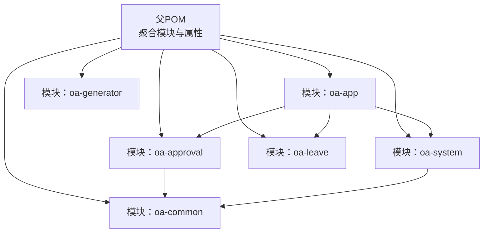
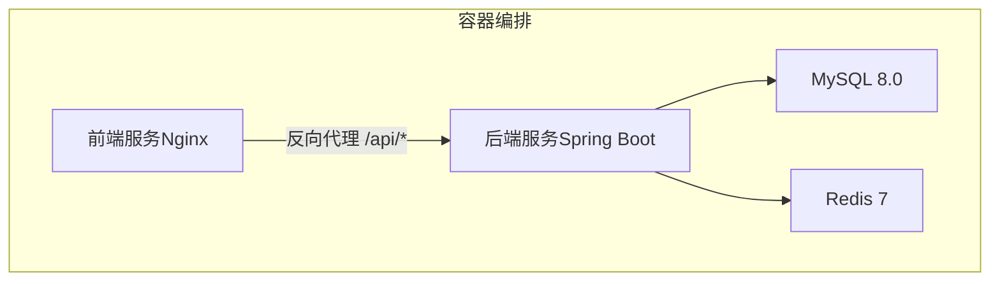
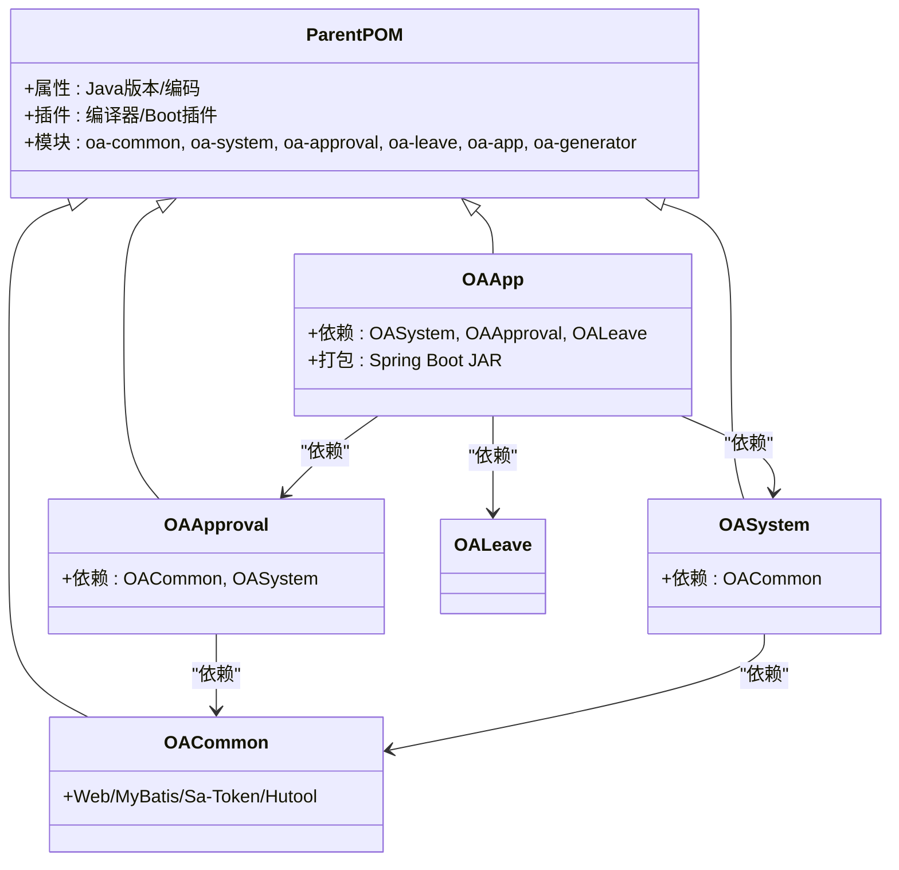
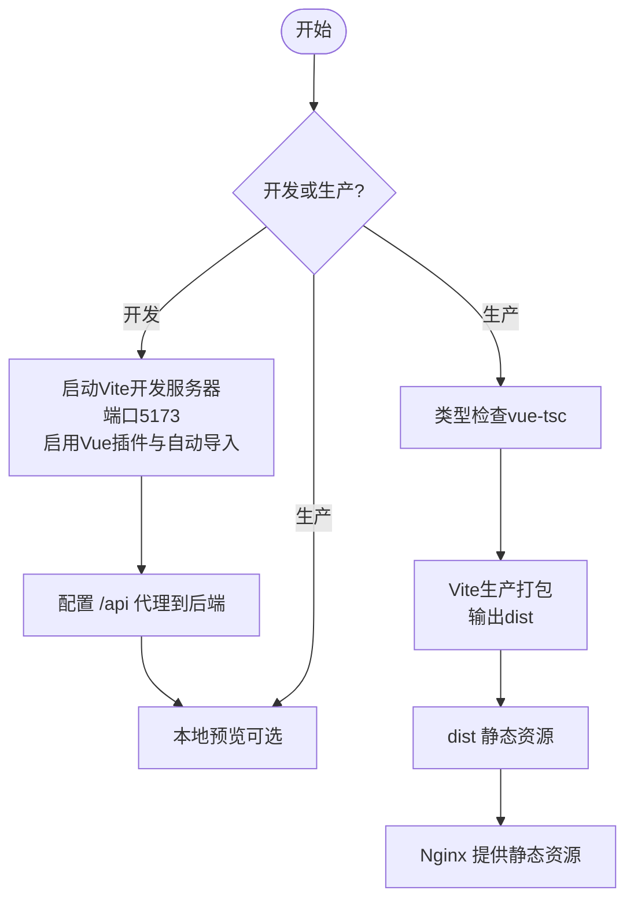
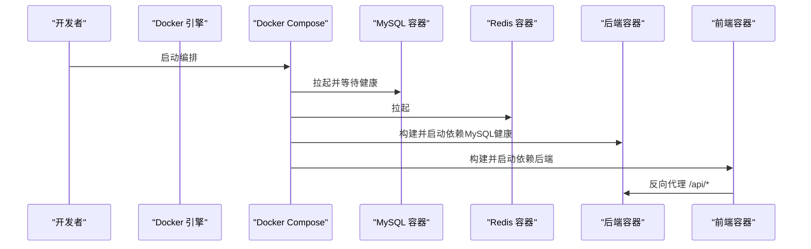
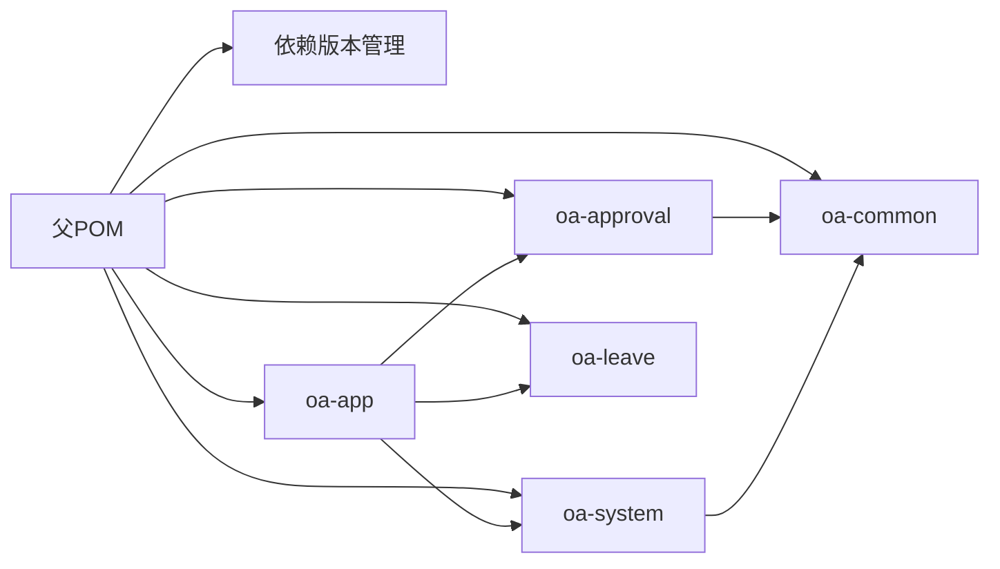

# 构建工具使用

<cite>
**本文引用的文件**
- [根POM（父POM）](file://pom.xml)
- [模块：oa-common](file://oa-common/pom.xml)
- [模块：oa-system](file://oa-system/pom.xml)
- [模块：oa-approval](file://oa-approval/pom.xml)
- [模块：oa-app](file://oa-app/pom.xml)
- [模块：oa-generator](file://oa-generator/pom.xml)
- [模块：oa-leave](file://oa-leave/pom.xml)
- [后端应用配置（application.yml）](file://oa-app/src/main/resources/application.yml)
- [根Dockerfile（多阶段后端构建）](file://Dockerfile)
- [前端Dockerfile（多阶段前端构建）](file://oa-ui/Dockerfile)
- [Docker Compose 编排](file://docker-compose.yml)
- [前端Vite配置](file://oa-ui/vite.config.ts)
- [前端包管理与脚本（package.json）](file://oa-ui/package.json)
- [前端Nginx配置](file://oa-ui/nginx.conf)
- [初始化脚本（项目重命名与端口替换）](file://init.sh)
</cite>

## 目录
1. [简介](#简介)
2. [项目结构](#项目结构)
3. [核心组件](#核心组件)
4. [架构总览](#架构总览)
5. [详细组件分析](#详细组件分析)
6. [依赖分析](#依赖分析)
7. [性能考虑](#性能考虑)
8. [故障排查指南](#故障排查指南)
9. [结论](#结论)
10. [附录](#附录)

## 简介
本指南面向OA审批管理系统的构建与发布流程，覆盖以下主题：
- Maven多模块构建：父子POM关系、模块依赖管理、构建顺序与打包策略
- Vite前端构建：开发与生产配置、资源打包、代理与路由
- Docker容器化：多阶段构建、镜像标签、Compose编排
- 构建脚本与CI/CD：常用命令、脚本参数、流水线集成建议
- 常见问题排查与解决方案

## 项目结构
系统采用Maven多模块聚合工程，父POM统一版本与插件配置；后端各业务模块按职责拆分，前端独立容器化部署。

图表来源
- [根POM（父POM）:21-28](file://pom.xml#L21-L28)
- [模块：oa-app:14-27](file://oa-app/pom.xml#L14-L27)
- [模块：oa-approval:14-22](file://oa-approval/pom.xml#L14-L22)
- [模块：oa-system:14-18](file://oa-system/pom.xml#L14-L18)
- [模块：oa-common:17-33](file://oa-common/pom.xml#L17-L33)

章节来源
- [根POM（父POM）:1-131](file://pom.xml#L1-L131)
- [模块：oa-common:1-54](file://oa-common/pom.xml#L1-L54)
- [模块：oa-system:1-39](file://oa-system/pom.xml#L1-L39)
- [模块：oa-approval:1-49](file://oa-approval/pom.xml#L1-L49)
- [模块：oa-app:1-76](file://oa-app/pom.xml#L1-L76)
- [模块：oa-generator](file://oa-generator/pom.xml)
- [模块：oa-leave](file://oa-leave/pom.xml)

## 核心组件
- 父POM负责统一Java版本、编码、插件与依赖版本锁定，并声明所有子模块。
- 各业务模块通过依赖声明实现解耦与复用，最终由应用模块聚合打包。
- 前端独立构建，通过Nginx在容器内提供静态资源服务，并代理后端API。

章节来源
- [根POM（父POM）:30-129](file://pom.xml#L30-L129)
- [模块：oa-common:17-52](file://oa-common/pom.xml#L17-L52)
- [模块：oa-system:14-37](file://oa-system/pom.xml#L14-L37)
- [模块：oa-approval:14-47](file://oa-approval/pom.xml#L14-L47)
- [模块：oa-app:14-75](file://oa-app/pom.xml#L14-L75)

## 架构总览
整体构建与运行由Docker Compose编排：MySQL、Redis、后端、前端四类服务协同工作。

图表来源
- [Docker Compose 编排:1-66](file://docker-compose.yml#L1-L66)
- [前端Nginx配置:11-16](file://oa-ui/nginx.conf#L11-L16)
- [后端应用配置（application.yml）:4-35](file://oa-app/src/main/resources/application.yml#L4-L35)

章节来源
- [Docker Compose 编排:1-66](file://docker-compose.yml#L1-L66)
- [前端Nginx配置:1-18](file://oa-ui/nginx.conf#L1-L18)
- [后端应用配置（application.yml）:1-59](file://oa-app/src/main/resources/application.yml#L1-L59)

## 详细组件分析

### Maven多模块构建
- 父POM定义统一属性与插件，子模块继承并声明各自依赖。
- 模块间依赖关系清晰：应用模块聚合系统、审批、请假模块；审批模块依赖公共模块；系统模块也依赖公共模块。
- 打包策略：应用模块使用Spring Boot插件生成可执行JAR；公共与业务模块以jar形式供其他模块依赖。

图表来源
- [根POM（父POM）:7-28](file://pom.xml#L7-L28)
- [模块：oa-common:17-52](file://oa-common/pom.xml#L17-L52)
- [模块：oa-system:14-18](file://oa-system/pom.xml#L14-L18)
- [模块：oa-approval:14-22](file://oa-approval/pom.xml#L14-L22)
- [模块：oa-app:14-27](file://oa-app/pom.xml#L14-L27)

章节来源
- [根POM（父POM）:1-131](file://pom.xml#L1-L131)
- [模块：oa-common:1-54](file://oa-common/pom.xml#L1-L54)
- [模块：oa-system:1-39](file://oa-system/pom.xml#L1-L39)
- [模块：oa-approval:1-49](file://oa-approval/pom.xml#L1-L49)
- [模块：oa-app:1-76](file://oa-app/pom.xml#L1-L76)

### 构建顺序与打包策略
- 构建顺序：父POM声明模块列表，Maven默认按拓扑排序构建；由于应用模块聚合多个子模块，实际构建时会先构建被依赖模块再构建应用模块。
- 打包策略：
  - 应用模块：使用Spring Boot Maven插件生成可执行JAR，便于容器直接运行。
  - 公共与业务模块：以jar形式发布，供其他模块依赖。
  - 前端模块：独立构建产物dist目录，由Nginx提供静态资源。

章节来源
- [模块：oa-app:59-75](file://oa-app/pom.xml#L59-L75)
- [模块：oa-common:17-52](file://oa-common/pom.xml#L17-L52)
- [模块：oa-system:14-37](file://oa-system/pom.xml#L14-L37)
- [模块：oa-approval:14-47](file://oa-approval/pom.xml#L14-L47)

### Vite前端构建配置
- 开发环境：本地Vite开发服务器，端口默认5173，开启Vue插件与自动导入组件解析器。
- 生产构建：先类型检查，再进行打包，输出静态资源到dist目录。
- 资源打包策略：按需加载、组件自动注册、别名@指向src目录。
- 代理配置：将/api前缀代理至后端服务，便于开发联调。

图表来源
- [前端Vite配置:12-39](file://oa-ui/vite.config.ts#L12-L39)
- [前端包管理与脚本（package.json）:6-14](file://oa-ui/package.json#L6-L14)
- [前端Nginx配置:1-18](file://oa-ui/nginx.conf#L1-L18)

章节来源
- [前端Vite配置:1-40](file://oa-ui/vite.config.ts#L1-L40)
- [前端包管理与脚本（package.json）:1-38](file://oa-ui/package.json#L1-L38)
- [前端Nginx配置:1-18](file://oa-ui/nginx.conf#L1-L18)

### Docker容器化构建
- 后端多阶段构建：
  - 构建阶段：基于Maven镜像，缓存Maven仓库，仅对应用模块执行打包，跳过测试。
  - 运行阶段：基于JRE镜像，复制JAR至运行时目录，暴露8080端口。
- 前端多阶段构建：
  - 构建阶段：基于Node镜像安装依赖并构建。
  - 运行阶段：基于Nginx镜像，复制dist与Nginx配置，暴露80端口。
- Compose编排：定义MySQL、Redis、后端、前端服务，设置健康检查与端口映射，前后端服务依赖关系明确。

图表来源
- [根Dockerfile（多阶段后端构建）:1-22](file://Dockerfile#L1-L22)
- [前端Dockerfile（多阶段前端构建）:1-15](file://oa-ui/Dockerfile#L1-L15)
- [Docker Compose 编排:1-66](file://docker-compose.yml#L1-L66)

章节来源
- [根Dockerfile（多阶段后端构建）:1-22](file://Dockerfile#L1-L22)
- [前端Dockerfile（多阶段前端构建）:1-15](file://oa-ui/Dockerfile#L1-L15)
- [Docker Compose 编排:1-66](file://docker-compose.yml#L1-L66)

### 构建脚本与CI/CD集成
- 初始化脚本：支持交互式重命名包名、修改端口、数据库名与密码、更新POM与配置文件，并重命名模块目录与父POM中的模块引用。
- CI/CD建议：
  - Maven：使用多模块构建，指定只构建应用模块并跳过测试以加速流水线。
  - 前端：在CI中缓存Node依赖，减少重复安装时间。
  - Docker：使用多阶段构建，确保镜像最小化；为镜像打上语义化标签并推送至私有仓库。
  - Compose：在CI中使用环境变量注入敏感配置，避免硬编码。

章节来源
- [初始化脚本（项目重命名与端口替换）:1-238](file://init.sh#L1-L238)
- [根Dockerfile（多阶段后端构建）:14-14](file://Dockerfile#L14-L14)
- [前端Dockerfile（多阶段前端构建）:4-7](file://oa-ui/Dockerfile#L4-L7)

## 依赖分析
- 版本统一：父POM集中管理MyBatis-Plus、Sa-Token、Flowable、Hutool、MySQL等依赖版本。
- 模块依赖：系统模块与审批模块均依赖公共模块；应用模块聚合三者并引入数据库驱动与Flyway。
- 运行时依赖：应用模块引入Redis Starter与Flyway，用于缓存与数据库迁移。

图表来源
- [根POM（父POM）:44-113](file://pom.xml#L44-L113)
- [模块：oa-app:14-31](file://oa-app/pom.xml#L14-L31)
- [模块：oa-approval:14-22](file://oa-approval/pom.xml#L14-L22)
- [模块：oa-system:14-18](file://oa-system/pom.xml#L14-L18)
- [模块：oa-common:17-33](file://oa-common/pom.xml#L17-L33)

章节来源
- [根POM（父POM）:30-129](file://pom.xml#L30-L129)
- [模块：oa-app:14-58](file://oa-app/pom.xml#L14-L58)
- [模块：oa-approval:14-41](file://oa-approval/pom.xml#L14-L41)
- [模块：oa-system:14-26](file://oa-system/pom.xml#L14-L26)
- [模块：oa-common:17-46](file://oa-common/pom.xml#L17-L46)

## 性能考虑
- Maven构建：
  - 使用Maven缓存（Compose中已启用），避免重复下载依赖。
  - 在CI中仅构建应用模块并跳过测试，缩短构建时间。
- 前端构建：
  - 复用Node依赖缓存，减少安装耗时。
  - 生产构建开启代码压缩与Tree-shaking（Vite默认行为）。
- 容器镜像：
  - 多阶段构建减少镜像体积。
  - 运行时使用精简JRE与Alpine Linux基础镜像。

章节来源
- [根Dockerfile（多阶段后端构建）:4-14](file://Dockerfile#L4-L14)
- [前端Dockerfile（多阶段前端构建）:2-7](file://oa-ui/Dockerfile#L2-L7)
- [前端包管理与脚本（package.json）:6-14](file://oa-ui/package.json#L6-L14)

## 故障排查指南
- 后端无法连接数据库
  - 检查环境变量是否正确注入（数据库URL、用户名、密码）。
  - 确认MySQL容器健康状态与端口映射。
- 前端请求404或跨域
  - 检查Nginx代理配置是否指向后端容器与端口。
  - 确认Vite开发代理是否正确代理/api前缀。
- 数据库迁移未执行
  - 检查Flyway配置与迁移脚本路径。
- 容器启动失败
  - 查看容器日志，确认依赖服务（MySQL、Redis）已就绪。
- 初始化脚本执行异常
  - 确认脚本权限与交互输入是否符合预期；必要时使用--force重新初始化。

章节来源
- [后端应用配置（application.yml）:4-35](file://oa-app/src/main/resources/application.yml#L4-L35)
- [Docker Compose 编排:37-50](file://docker-compose.yml#L37-L50)
- [前端Nginx配置:11-16](file://oa-ui/nginx.conf#L11-L16)
- [前端Vite配置:30-38](file://oa-ui/vite.config.ts#L30-L38)
- [初始化脚本（项目重命名与端口替换）:38-94](file://init.sh#L38-L94)

## 结论
本项目通过Maven多模块聚合、Vite前端构建与Docker多阶段容器化，实现了前后端分离、依赖统一与快速交付。遵循本文的构建流程与最佳实践，可在本地与CI环境中稳定地完成构建、测试与发布。

## 附录
- 常用命令速查
  - Maven：在项目根目录执行多模块构建，或仅构建应用模块并跳过测试。
  - 前端：安装依赖后执行开发、构建与预览脚本。
  - Docker：使用Compose一键拉起全部服务，或单独构建前后端镜像。
- CI/CD流水线建议
  - 分阶段执行：依赖安装、编译、测试、构建镜像、推送镜像、部署。
  - 使用缓存：Maven与Node依赖缓存，提升流水线效率。
  - 安全性：敏感信息通过环境变量注入，避免硬编码。