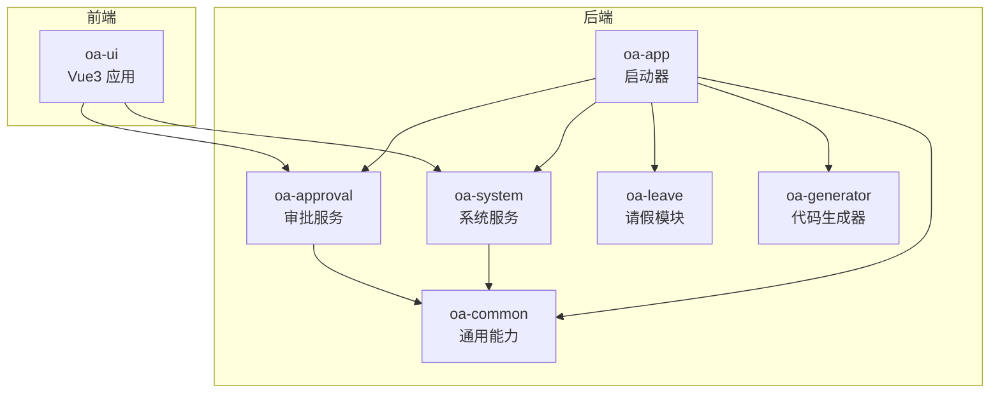
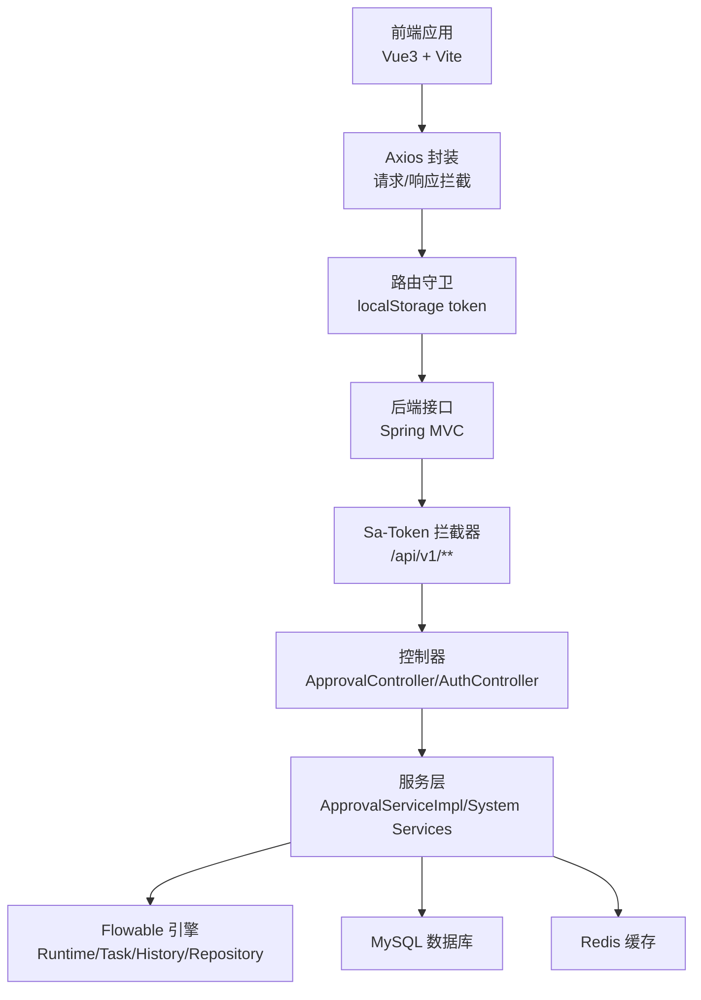
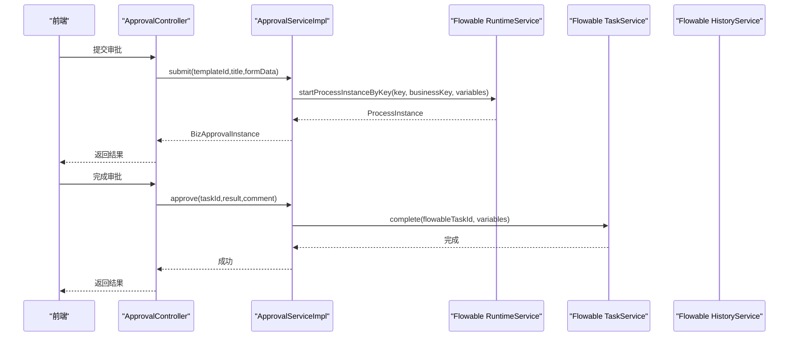
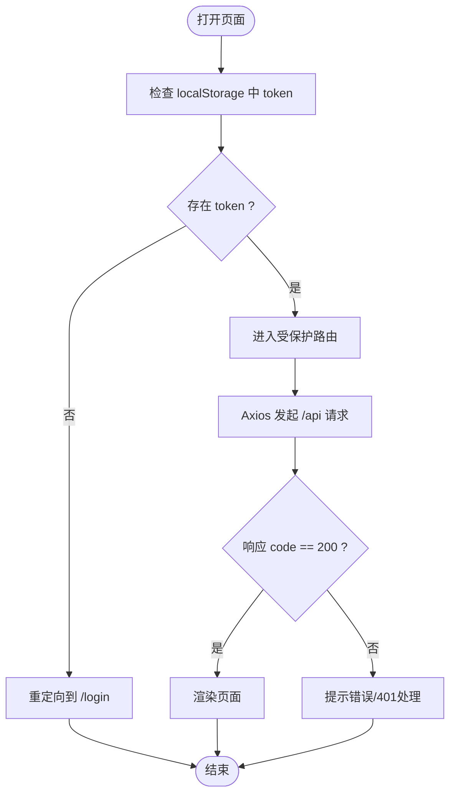
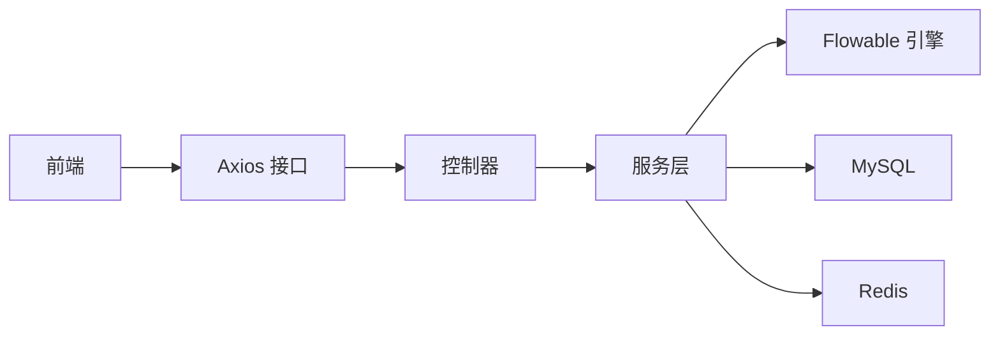

# 调试与性能分析

<cite>
**本文引用的文件**
- [application.yml](file://oa-app/src/main/resources/application.yml)
- [FlowableConfig.java](file://oa-approval/src/main/java/com/oa/admin/approval/config/FlowableConfig.java)
- [MyBatisPlusAutoFillHandler.java](file://oa-common/src/main/java/com/oa/admin/common/config/MyBatisPlusAutoFillHandler.java)
- [SaTokenConfig.java](file://oa-system/src/main/java/com/oa/admin/system/config/SaTokenConfig.java)
- [GlobalExceptionHandler.java](file://oa-common/src/main/java/com/oa/admin/common/exception/GlobalExceptionHandler.java)
- [ApprovalController.java](file://oa-approval/src/main/java/com/oa/admin/approval/controller/ApprovalController.java)
- [ApprovalServiceImpl.java](file://oa-approval/src/main/java/com/oa/admin/approval/service/impl/ApprovalServiceImpl.java)
- [AuthController.java](file://oa-system/src/main/java/com/oa/admin/system/controller/AuthController.java)
- [request.ts](file://oa-ui/src/utils/request.ts)
- [vite.config.ts](file://oa-ui/vite.config.ts)
- [index.ts（前端路由）](file://oa-ui/src/router/index.ts)
- [user.ts（Pinia 用户状态）](file://oa-ui/src/stores/user.ts)
- [package.json（前端依赖）](file://oa-ui/package.json)
</cite>

## 目录
1. [简介](#简介)
2. [项目结构](#项目结构)
3. [核心组件](#核心组件)
4. [架构总览](#架构总览)
5. [详细组件分析](#详细组件分析)
6. [依赖分析](#依赖分析)
7. [性能考虑](#性能考虑)
8. [故障排查指南](#故障排查指南)
9. [结论](#结论)
10. [附录](#附录)

## 简介
本指南面向OA审批管理系统，提供后端与前端的系统化调试与性能分析方法。内容覆盖：
- 后端：Spring Boot断点调试、Flowable工作流调试、数据库查询性能分析、Redis缓存调试、全局异常与日志分析。
- 前端：Vue DevTools使用、网络请求调试、组件状态检查、路由调试。
- 性能分析：JProfiler/VisualVM/Chrome DevTools等工具的配置与使用建议。
- 常见问题：审批流程卡死、API接口异常、前端页面渲染问题的调试流程。
- 最佳实践：日志级别配置、关键日志追踪、错误堆栈分析、性能优化技巧。

## 项目结构
系统采用多模块分层设计：
- 后端：oa-app（启动器）、oa-approval（审批域）、oa-system（系统域）、oa-common（通用能力）、oa-leave（业务扩展）、oa-generator（代码生成器）。
- 前端：oa-ui（Vue3 + Vite + Pinia + Vue Router）。
- 配置：Spring Boot配置、Flowable集成、MyBatis-Plus自动填充、Sa-Token鉴权拦截、Vite代理与别名。

**图表来源**
- [application.yml:1-59](file://oa-app/src/main/resources/application.yml#L1-L59)
- [package.json:1-38](file://oa-ui/package.json#L1-L38)

**章节来源**
- [application.yml:1-59](file://oa-app/src/main/resources/application.yml#L1-L59)
- [package.json:1-38](file://oa-ui/package.json#L1-L38)

## 核心组件
- Spring Boot配置与连接池：数据源、Flyway迁移、MyBatis-Plus逻辑删除、Sa-Token会话与拦截器、Flowable数据库策略。
- 审批服务：提交、审批、转办、撤回、终止、仪表盘统计、流程图展示、管理员操作、抄送触发。
- 系统服务：认证登录、登出、当前用户信息。
- 前端：Axios封装请求拦截、路由守卫、Pinia状态管理、Vite开发服务器与代理。

**章节来源**
- [application.yml:1-59](file://oa-app/src/main/resources/application.yml#L1-L59)
- [ApprovalController.java:1-252](file://oa-approval/src/main/java/com/oa/admin/approval/controller/ApprovalController.java#L1-L252)
- [ApprovalServiceImpl.java:1-792](file://oa-approval/src/main/java/com/oa/admin/approval/service/impl/ApprovalServiceImpl.java#L1-L792)
- [AuthController.java:1-38](file://oa-system/src/main/java/com/oa/admin/system/controller/AuthController.java#L1-L38)
- [request.ts:1-42](file://oa-ui/src/utils/request.ts#L1-L42)
- [index.ts（前端路由）:1-134](file://oa-ui/src/router/index.ts#L1-L134)
- [user.ts（Pinia 用户状态）:1-32](file://oa-ui/src/stores/user.ts#L1-L32)

## 架构总览
后端通过Spring MVC接收请求，经Sa-Token鉴权拦截，调用审批/系统服务，服务层整合Flowable引擎与数据库访问；前端通过Axios统一请求，Vite代理转发到后端，路由守卫控制登录态。

**图表来源**
- [request.ts:1-42](file://oa-ui/src/utils/request.ts#L1-L42)
- [index.ts（前端路由）:124-131](file://oa-ui/src/router/index.ts#L124-L131)
- [SaTokenConfig.java:1-25](file://oa-system/src/main/java/com/oa/admin/system/config/SaTokenConfig.java#L1-L25)
- [ApprovalController.java:1-252](file://oa-approval/src/main/java/com/oa/admin/approval/controller/ApprovalController.java#L1-L252)
- [ApprovalServiceImpl.java:1-792](file://oa-approval/src/main/java/com/oa/admin/approval/service/impl/ApprovalServiceImpl.java#L1-L792)
- [application.yml:4-59](file://oa-app/src/main/resources/application.yml#L4-L59)

## 详细组件分析

### 后端调试：Spring Boot断点调试
- 入口与配置
  - 启动类位于oa-app模块，配置文件集中于application.yml，包含数据源、Flyway、Redis、MyBatis-Plus、Sa-Token、Flowable等关键配置。
  - 断点建议：在控制器入口（如ApprovalController、AuthController）设置断点，观察参数解析与权限校验；在服务层（ApprovalServiceImpl）关键分支（提交、审批、转办、撤回、终止）设置断点。
- 日志与异常
  - 全局异常处理器统一捕获未处理异常，并记录错误日志，便于定位问题根因。
  - 关键日志点：审批流程变量写入、Flowable任务完成、流程实例删除、审计日志记录、通知发送。
- Redis与数据库
  - Redis用于会话存储，可结合本地或Docker环境进行调试；数据库连接池参数可在配置中调整，关注连接泄漏检测阈值。

**章节来源**
- [application.yml:1-59](file://oa-app/src/main/resources/application.yml#L1-L59)
- [GlobalExceptionHandler.java:1-74](file://oa-common/src/main/java/com/oa/admin/common/exception/GlobalExceptionHandler.java#L1-L74)
- [ApprovalController.java:1-252](file://oa-approval/src/main/java/com/oa/admin/approval/controller/ApprovalController.java#L1-L252)
- [ApprovalServiceImpl.java:1-792](file://oa-approval/src/main/java/com/oa/admin/approval/service/impl/ApprovalServiceImpl.java#L1-L792)

### Flowable工作流调试
- 集成配置
  - FlowableConfig注册事件监听器，便于在流程结束时执行自定义逻辑。
- 调试要点
  - 在提交流程时断点，确认流程实例ID与变量是否正确注入；在审批完成处断点，确认Flowable任务完成与变量传递；在终止/撤回处断点，确认流程实例删除与未完成任务清理。
  - 使用流程图接口查看已完成节点与当前活动节点，辅助定位卡点。
- BPMN资源
  - 流程XML资源由Flowable仓库服务读取，若流程图显示异常，检查XML命名空间与BPMNDiagram片段拼接逻辑。

**图表来源**
- [ApprovalController.java:37-53](file://oa-approval/src/main/java/com/oa/admin/approval/controller/ApprovalController.java#L37-L53)
- [ApprovalServiceImpl.java:122-168](file://oa-approval/src/main/java/com/oa/admin/approval/service/impl/ApprovalServiceImpl.java#L122-L168)
- [ApprovalServiceImpl.java:170-240](file://oa-approval/src/main/java/com/oa/admin/approval/service/impl/ApprovalServiceImpl.java#L170-L240)

**章节来源**
- [FlowableConfig.java:1-31](file://oa-approval/src/main/java/com/oa/admin/approval/config/FlowableConfig.java#L1-L31)
- [ApprovalServiceImpl.java:346-398](file://oa-approval/src/main/java/com/oa/admin/approval/service/impl/ApprovalServiceImpl.java#L346-L398)

### 数据库查询性能分析
- 连接池与SQL优化
  - HikariCP连接池参数可在配置中调整，关注最大池大小、空闲超时、最大生命周期与泄漏检测阈值。
  - MyBatis-Plus自动填充处理器统一维护createdAt/updatedAt，减少重复字段处理。
- 分页与索引
  - 控制器与服务层广泛使用分页查询，确保相关字段建立索引；对复杂条件查询（标题模糊、时间范围、状态过滤）进行EXPLAIN分析。
- 事务与锁
  - 审批关键路径使用事务，注意避免长事务与跨表大事务，必要时拆分更新。

**章节来源**
- [application.yml:10-24](file://oa-app/src/main/resources/application.yml#L10-L24)
- [MyBatisPlusAutoFillHandler.java:1-25](file://oa-common/src/main/java/com/oa/admin/common/config/MyBatisPlusAutoFillHandler.java#L1-L25)
- [ApprovalController.java:67-83](file://oa-approval/src/main/java/com/oa/admin/approval/controller/ApprovalController.java#L67-L83)
- [ApprovalServiceImpl.java:318-335](file://oa-approval/src/main/java/com/oa/admin/approval/service/impl/ApprovalServiceImpl.java#L318-L335)

### Redis缓存调试
- 配置与用途
  - Sa-Token会话存储依赖Redis，可通过本地或Docker部署的Redis进行调试；关注连接地址、端口与超时配置。
- 调试建议
  - 登录成功后检查Redis中的token键是否存在；退出登录后确认键被清理；若出现401跳转登录，检查本地存储token与后端会话一致性。

**章节来源**
- [application.yml:32-35](file://oa-app/src/main/resources/application.yml#L32-L35)
- [request.ts:10-16](file://oa-ui/src/utils/request.ts#L10-L16)
- [user.ts（Pinia 用户状态）:22-28](file://oa-ui/src/stores/user.ts#L22-L28)

### 前端调试：Vue DevTools、网络请求、组件状态、路由
- Vue DevTools
  - 打开组件树、组件状态、事件与生命周期钩子，检查Pinia状态（token、userInfo）与路由元信息（meta.title）。
- 网络请求
  - 使用浏览器开发者工具Network面板，观察Axios拦截器添加的satoken头、后端返回的code/msg/data结构、401自动跳转登录。
- 路由调试
  - 在路由守卫中检查localStorage中的token，未登录重定向至/login；进入受保护路由后检查meta.title与面包屑。
- Vite代理
  - 开发环境下，/api前缀代理到后端8080端口，确保跨域问题不干扰调试。

**图表来源**
- [index.ts（前端路由）:124-131](file://oa-ui/src/router/index.ts#L124-L131)
- [request.ts:18-39](file://oa-ui/src/utils/request.ts#L18-L39)
- [vite.config.ts:30-38](file://oa-ui/vite.config.ts#L30-L38)

**章节来源**
- [request.ts:1-42](file://oa-ui/src/utils/request.ts#L1-L42)
- [index.ts（前端路由）:1-134](file://oa-ui/src/router/index.ts#L1-L134)
- [vite.config.ts:1-40](file://oa-ui/vite.config.ts#L1-L40)
- [user.ts（Pinia 用户状态）:1-32](file://oa-ui/src/stores/user.ts#L1-L32)
- [package.json:1-38](file://oa-ui/package.json#L1-L38)

### 性能分析工具使用
- JProfiler/VisualVM（后端）
  - 连接本地或远程JVM进程，监控线程、堆内存、GC、CPU热点方法；重点关注审批服务的事务方法、Flowable引擎调用、数据库连接池使用率。
- Chrome DevTools（前端）
  - Network面板分析请求耗时与重试；Performance面板捕捉UI卡顿；Memory面板检测内存泄漏；Vue DevTools检查组件重渲染次数。
- 建议
  - 对高频接口（分页列表、流程图、仪表盘）进行采样分析；对数据库慢查询与Redis热点键进行专项优化。

[本节为通用指导，无需列出具体文件来源]

## 依赖分析
- 组件耦合
  - 控制器依赖服务层；服务层依赖Flowable引擎与数据库；前端通过Axios与后端交互；路由守卫依赖Pinia状态与localStorage。
- 外部依赖
  - Spring Boot、Flowable、MyBatis-Plus、Sa-Token、Axios、Vue生态（Vue3、Pinia、Vue Router、Element Plus）。

**图表来源**
- [ApprovalController.java:1-252](file://oa-approval/src/main/java/com/oa/admin/approval/controller/ApprovalController.java#L1-L252)
- [ApprovalServiceImpl.java:1-792](file://oa-approval/src/main/java/com/oa/admin/approval/service/impl/ApprovalServiceImpl.java#L1-L792)
- [request.ts:1-42](file://oa-ui/src/utils/request.ts#L1-L42)

**章节来源**
- [ApprovalController.java:1-252](file://oa-approval/src/main/java/com/oa/admin/approval/controller/ApprovalController.java#L1-L252)
- [ApprovalServiceImpl.java:1-792](file://oa-approval/src/main/java/com/oa/admin/approval/service/impl/ApprovalServiceImpl.java#L1-L792)
- [request.ts:1-42](file://oa-ui/src/utils/request.ts#L1-L42)

## 性能考虑
- 连接池与SQL
  - 合理设置HikariCP参数，开启泄漏检测；对高频查询建立索引，避免SELECT *；分页查询限制每页数量。
- 事务与锁
  - 避免长事务，减少跨表大事务；对并发高的审批操作使用乐观锁或短事务。
- 缓存与会话
  - 利用Redis缓存热点数据；合理设置Sa-Token会话过期与主动超时；避免频繁刷新token。
- 前端渲染
  - 减少不必要的响应式数据；对列表使用虚拟滚动；避免在渲染阶段做重型计算。
- 工作流
  - 合理设计流程节点与并行网关；避免过多嵌套与循环；对长耗时节点异步化或外部化。

[本节为通用指导，无需列出具体文件来源]

## 故障排查指南

### 审批流程卡死
- 症状：流程无法推进、任务无法完成、流程图无变化。
- 排查步骤
  - 在服务层“完成审批”断点，确认Flowable任务ID与变量；检查流程图接口返回的当前节点集合；查看历史活动实例确认已完成节点。
  - 若流程实例被终止或删除，检查管理员操作与审计日志。
- 关键日志与断点
  - 审批完成、流程实例删除、审计日志记录、通知发送。

**章节来源**
- [ApprovalServiceImpl.java:170-240](file://oa-approval/src/main/java/com/oa/admin/approval/service/impl/ApprovalServiceImpl.java#L170-L240)
- [ApprovalServiceImpl.java:346-398](file://oa-approval/src/main/java/com/oa/admin/approval/service/impl/ApprovalServiceImpl.java#L346-L398)
- [ApprovalServiceImpl.java:664-705](file://oa-approval/src/main/java/com/oa/admin/approval/service/impl/ApprovalServiceImpl.java#L664-L705)

### API接口异常
- 症状：返回非200、401、403、500。
- 排查步骤
  - 查看全局异常处理器返回的错误码与消息；检查参数校验异常与业务异常；确认权限注解与拦截器生效。
- 关键日志
  - 未处理异常的日志输出，便于快速定位。

**章节来源**
- [GlobalExceptionHandler.java:1-74](file://oa-common/src/main/java/com/oa/admin/common/exception/GlobalExceptionHandler.java#L1-L74)
- [SaTokenConfig.java:1-25](file://oa-system/src/main/java/com/oa/admin/system/config/SaTokenConfig.java#L1-L25)
- [ApprovalController.java:37-53](file://oa-approval/src/main/java/com/oa/admin/approval/controller/ApprovalController.java#L37-L53)

### 前端页面渲染问题
- 症状：空白页、白屏、路由不跳转、状态不同步。
- 排查步骤
  - 检查路由守卫是否正确读取localStorage中的token；确认Axios拦截器是否携带satoken头；使用Vue DevTools检查Pinia状态与组件props。
- 代理与跨域
  - 确认Vite代理将/api前缀转发到后端8080端口。

**章节来源**
- [index.ts（前端路由）:124-131](file://oa-ui/src/router/index.ts#L124-L131)
- [request.ts:10-16](file://oa-ui/src/utils/request.ts#L10-L16)
- [vite.config.ts:30-38](file://oa-ui/vite.config.ts#L30-L38)
- [user.ts（Pinia 用户状态）:1-32](file://oa-ui/src/stores/user.ts#L1-L32)

### 认证与会话问题
- 症状：登录成功但跳转登录、401频繁。
- 排查步骤
  - 检查登录接口返回token与本地存储；确认Axios拦截器是否附加satoken头；检查Sa-Token拦截器是否拦截/api/v1/**。
- Redis
  - 确认Redis可用且会话键存在；退出登录后键被清理。

**章节来源**
- [AuthController.java:1-38](file://oa-system/src/main/java/com/oa/admin/system/controller/AuthController.java#L1-L38)
- [request.ts:10-16](file://oa-ui/src/utils/request.ts#L10-L16)
- [SaTokenConfig.java:1-25](file://oa-system/src/main/java/com/oa/admin/system/config/SaTokenConfig.java#L1-L25)
- [application.yml:32-35](file://oa-app/src/main/resources/application.yml#L32-L35)

## 结论
通过在关键入口设置断点、利用全局异常与审计日志、结合Flowable流程图与前后端代理机制，可以高效定位并解决OA审批系统中的各类问题。配合连接池与SQL优化、缓存与会话治理、前端渲染与网络分析，可显著提升系统稳定性与用户体验。

[本节为总结性内容，无需列出具体文件来源]

## 附录

### 日志分析方法
- 日志级别
  - 开发环境可临时提高审批与Flowable相关包的日志级别，以便观察流程变量与任务流转细节。
- 关键日志追踪
  - 审批提交、审批完成、流程实例删除、审计日志、通知发送、异常捕获与错误码返回。
- 错误堆栈
  - 全局异常处理器统一记录未处理异常堆栈，便于快速定位根因。

**章节来源**
- [GlobalExceptionHandler.java:67-72](file://oa-common/src/main/java/com/oa/admin/common/exception/GlobalExceptionHandler.java#L67-L72)
- [ApprovalServiceImpl.java:144-145](file://oa-approval/src/main/java/com/oa/admin/approval/service/impl/ApprovalServiceImpl.java#L144-L145)
- [ApprovalServiceImpl.java:211-212](file://oa-approval/src/main/java/com/oa/admin/approval/service/impl/ApprovalServiceImpl.java#L211-L212)
- [ApprovalServiceImpl.java:389-391](file://oa-approval/src/main/java/com/oa/admin/approval/service/impl/ApprovalServiceImpl.java#L389-L391)
- [ApprovalServiceImpl.java:681-682](file://oa-approval/src/main/java/com/oa/admin/approval/service/impl/ApprovalServiceImpl.java#L681-L682)