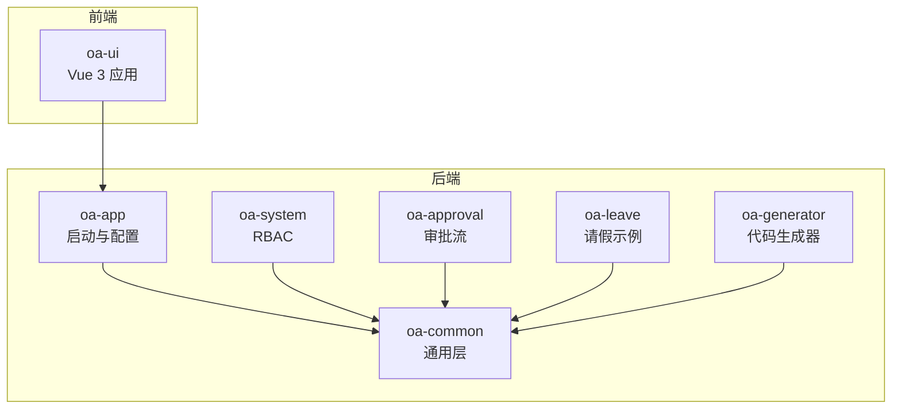
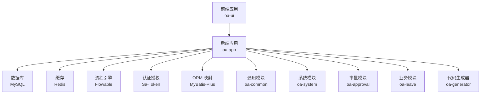
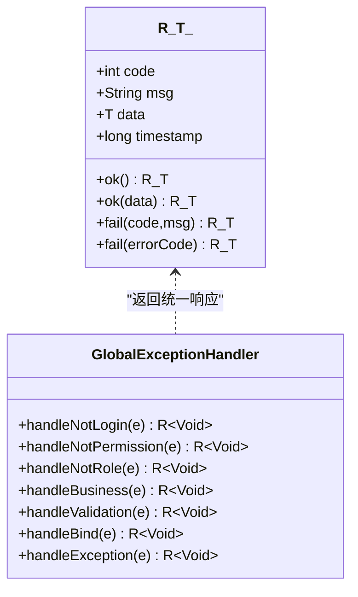
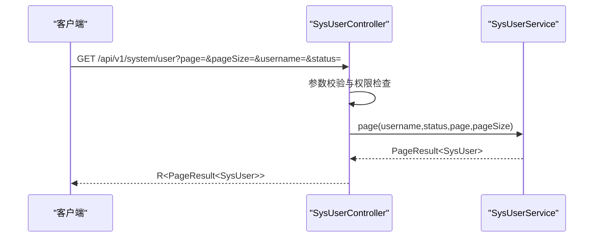
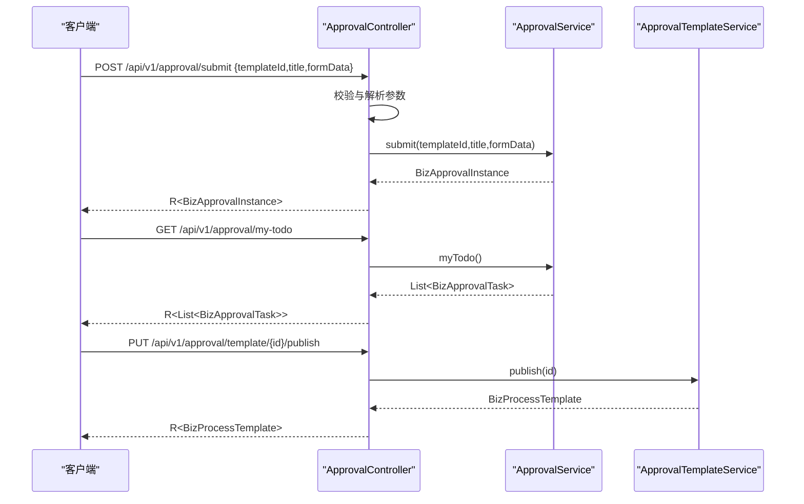
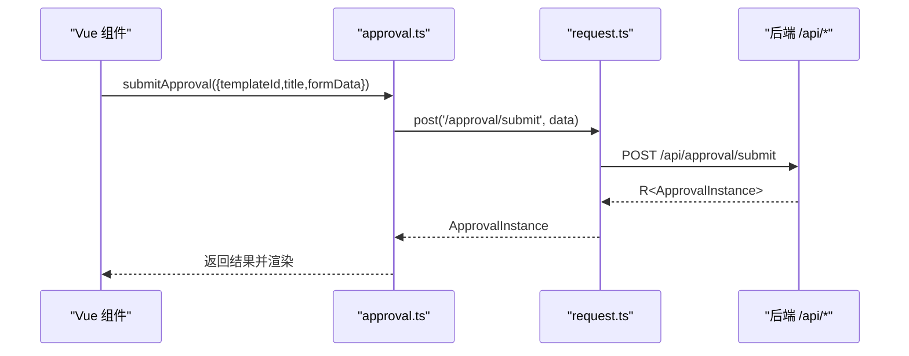
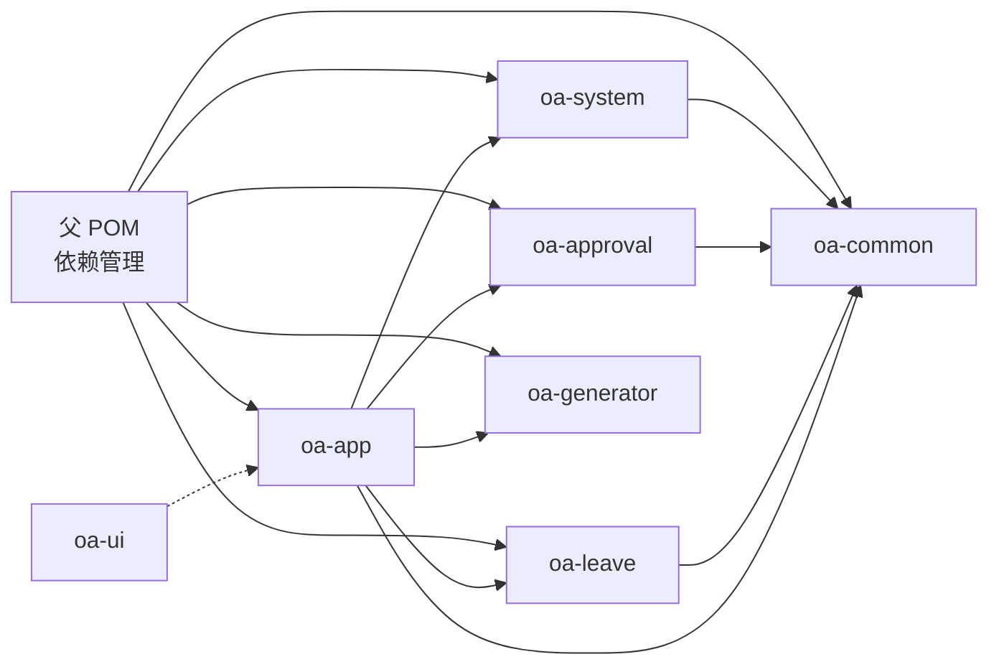

# 开发指南

<cite>
**本文引用的文件**
- [pom.xml](file://pom.xml)
- [README.md](file://README.md)
- [application.yml](file://oa-app/src/main/resources/application.yml)
- [R.java](file://oa-common/src/main/java/com/oa/admin/common/result/R.java)
- [GlobalExceptionHandler.java](file://oa-common/src/main/java/com/oa/admin/common/exception/GlobalExceptionHandler.java)
- [SysUserController.java](file://oa-system/src/main/java/com/oa/admin/system/controller/SysUserController.java)
- [ApprovalController.java](file://oa-approval/src/main/java/com/oa/admin/approval/controller/ApprovalController.java)
- [main.ts](file://oa-ui/src/main.ts)
- [index.ts](file://oa-ui/src/router/index.ts)
- [approval.ts](file://oa-ui/src/api/approval.ts)
- [approval.ts 类型定义](file://oa-ui/src/types/approval.ts)
- [vite.config.ts](file://oa-ui/vite.config.ts)
- [.gitignore](file://.gitignore)
- [docker-compose.yml](file://docker-compose.yml)
</cite>

## 目录
1. [简介](#简介)
2. [项目结构](#项目结构)
3. [核心组件](#核心组件)
4. [架构总览](#架构总览)
5. [详细组件分析](#详细组件分析)
6. [依赖关系分析](#依赖关系分析)
7. [性能与可维护性](#性能与可维护性)
8. [调试与开发工具](#调试与开发工具)
9. [Git 工作流与分支管理](#git-工作流与分支管理)
10. [代码规范与最佳实践](#代码规范与最佳实践)
11. [新功能开发标准流程](#新功能开发标准流程)
12. [常见问题与排错](#常见问题与排错)
13. [结语](#结语)

## 简介
本指南面向 OA 审批管理系统的新老开发者，系统性阐述后端多模块 Maven 架构、前后端分离开发流程、接口契约、统一响应与异常处理、权限与审计、以及开发工具链与 Git 工作流。目标是帮助团队在一致的规范下高效协作，快速交付高质量功能。

## 项目结构
项目采用 Maven 多模块聚合工程，按领域拆分模块，公共能力下沉至通用模块，前端独立构建与部署。核心模块职责如下：
- oa-common：统一响应、异常、基础实体、事件与工具
- oa-system：RBAC 权限体系（用户/角色/权限/部门）
- oa-approval：审批流模块（Flowable 集成、任务/实例/模板/抄送/审计）
- oa-leave：示例业务模块（请假）
- oa-app：应用入口（配置、Flyway 迁移、启动类）
- oa-ui：前端（Vue 3 + TypeScript + Vite + Element Plus）
- oa-generator：基于 YAML 的代码生成器（后端 CRUD + Flyway）

图表来源
- [pom.xml:21-28](file://pom.xml#L21-L28)
- [README.md:48-61](file://README.md#L48-L61)

章节来源
- [pom.xml:21-28](file://pom.xml#L21-L28)
- [README.md:48-61](file://README.md#L48-L61)

## 核心组件
- 统一响应与异常处理：后端通过统一响应包装与全局异常处理器，保证接口一致性与错误可预期。
- 权限与安全：基于 Sa-Token 的接口级与角色级权限控制，结合 BCrypt 密码策略与审计日志。
- 审批流：以 Flowable 为核心，提供模板发布、实例发起、任务审批、抄送与流程图展示。
- 前后端接口契约：RESTful，统一前缀与响应格式；前端通过 Axios 封装请求并与后端交互。
- 代码生成器：通过 YAML 定义实体与枚举，自动生成后端 CRUD 与 Flyway 脚本。

章节来源
- [R.java:1-44](file://oa-common/src/main/java/com/oa/admin/common/result/R.java#L1-L44)
- [GlobalExceptionHandler.java:1-74](file://oa-common/src/main/java/com/oa/admin/common/exception/GlobalExceptionHandler.java#L1-L74)
- [SysUserController.java:1-85](file://oa-system/src/main/java/com/oa/admin/system/controller/SysUserController.java#L1-L85)
- [ApprovalController.java:1-252](file://oa-approval/src/main/java/com/oa/admin/approval/controller/ApprovalController.java#L1-L252)
- [README.md:87-93](file://README.md#L87-L93)

## 架构总览
系统采用前后端分离架构，后端以 Spring Boot + MyBatis-Plus + Flowable + Sa-Token 为核心，前端以 Vue 3 + TypeScript + Vite + Element Plus 为核心。Docker Compose 提供一键本地部署。

图表来源
- [docker-compose.yml:1-66](file://docker-compose.yml#L1-L66)
- [application.yml:4-59](file://oa-app/src/main/resources/application.yml#L4-L59)
- [README.md:5-19](file://README.md#L5-L19)

章节来源
- [docker-compose.yml:1-66](file://docker-compose.yml#L1-L66)
- [application.yml:4-59](file://oa-app/src/main/resources/application.yml#L4-L59)
- [README.md:5-19](file://README.md#L5-L19)

## 详细组件分析

### 统一响应与异常处理
- 统一响应体：包含状态码、消息、数据与时间戳，成功场景默认 code=200。
- 全局异常处理：对未登录、权限不足、业务异常、参数校验异常、未知异常进行分类处理，并返回对应错误码与消息。
- 使用建议：控制器返回统一包装结果，避免直接抛出原始异常；业务异常通过 BusinessException 自定义错误码与消息。

图表来源
- [R.java:1-44](file://oa-common/src/main/java/com/oa/admin/common/result/R.java#L1-L44)
- [GlobalExceptionHandler.java:1-74](file://oa-common/src/main/java/com/oa/admin/common/exception/GlobalExceptionHandler.java#L1-L74)

章节来源
- [R.java:1-44](file://oa-common/src/main/java/com/oa/admin/common/result/R.java#L1-L44)
- [GlobalExceptionHandler.java:1-74](file://oa-common/src/main/java/com/oa/admin/common/exception/GlobalExceptionHandler.java#L1-L74)

### RBAC 控制器（系统模块）
- 路由前缀：/api/v1/system/user
- 权限注解：@SaCheckPermission 对接菜单/按钮权限
- 分页查询：支持用户名、状态、分页参数
- 安全细节：查询详情时清除敏感信息（如密码哈希）

图表来源
- [SysUserController.java:23-31](file://oa-system/src/main/java/com/oa/admin/system/controller/SysUserController.java#L23-L31)

章节来源
- [SysUserController.java:1-85](file://oa-system/src/main/java/com/oa/admin/system/controller/SysUserController.java#L1-L85)

### 审批控制器（审批模块）
- 路由前缀：/api/v1/approval
- 主要能力：提交审批、审批任务、我的待办/已办、抄送、实例详情与流程图、仪表盘统计、模板 CRUD 与发布、节点配置、转交、撤回等
- 权限粒度：按操作细粒度控制（如 approval:submit、approval:approve、approval:template:*）
- 参数解析：对数值字段进行显式解析与错误处理

图表来源
- [ApprovalController.java:37-44](file://oa-approval/src/main/java/com/oa/admin/approval/controller/ApprovalController.java#L37-L44)
- [ApprovalController.java:55-59](file://oa-approval/src/main/java/com/oa/admin/approval/controller/ApprovalController.java#L55-L59)
- [ApprovalController.java:175-179](file://oa-approval/src/main/java/com/oa/admin/approval/controller/ApprovalController.java#L175-L179)

章节来源
- [ApprovalController.java:1-252](file://oa-approval/src/main/java/com/oa/admin/approval/controller/ApprovalController.java#L1-L252)

### 前端应用与接口契约
- 应用入口：注册 Pinia、路由、Element Plus，挂载根组件
- 路由：采用 history 模式，懒加载页面组件，统一布局
- 请求封装：基于 Axios 的请求工具，统一代理到后端 /api 前缀
- 类型定义：强类型接口契约，涵盖审批实例、任务、模板、节点配置、仪表盘统计等

图表来源
- [main.ts:1-14](file://oa-ui/src/main.ts#L1-L14)
- [index.ts:1-134](file://oa-ui/src/router/index.ts#L1-L134)
- [approval.ts:1-71](file://oa-ui/src/api/approval.ts#L1-L71)
- [vite.config.ts:30-38](file://oa-ui/vite.config.ts#L30-L38)

章节来源
- [main.ts:1-14](file://oa-ui/src/main.ts#L1-L14)
- [index.ts:1-134](file://oa-ui/src/router/index.ts#L1-L134)
- [approval.ts:1-71](file://oa-ui/src/api/approval.ts#L1-L71)
- [approval.ts 类型定义:1-131](file://oa-ui/src/types/approval.ts#L1-L131)
- [vite.config.ts:1-40](file://oa-ui/vite.config.ts#L1-L40)

## 依赖关系分析
- 依赖管理：父 POM 锁定版本，集中声明 MyBatis-Plus、Sa-Token、Flowable、Hutool、MySQL 等依赖。
- 模块间耦合：系统模块与审批模块均依赖通用模块；应用入口依赖通用模块并引入各业务模块；前端仅依赖后端提供的 /api 接口。
- 外部依赖：MySQL、Redis、Flowable、Sa-Token、Element Plus、Axios、Pinia、Vue Router 等。

图表来源
- [pom.xml:44-113](file://pom.xml#L44-L113)
- [pom.xml:21-28](file://pom.xml#L21-L28)

章节来源
- [pom.xml:44-113](file://pom.xml#L44-L113)
- [pom.xml:21-28](file://pom.xml#L21-L28)

## 性能与可维护性
- 数据库连接池：HikariCP 参数可调，建议根据并发与慢查询情况优化最大池大小、空闲超时与泄漏检测阈值。
- ORM 与分页：MyBatis-Plus 分页查询配合 PageResult，避免一次性加载大列表。
- 审批流程：Flowable 异步执行器默认关闭，避免不必要的并发开销；模板发布与 BPMN XML 更新需谨慎，避免频繁变更导致部署压力。
- 前端：组件懒加载与按需引入 Element Plus，减少首屏体积；Vitest 覆盖率与 ESLint 规则保障质量。
- 部署：Docker Compose 提供稳定的一键部署；生产环境建议使用 Nginx 反向代理与 HTTPS。

章节来源
- [application.yml:10-24](file://oa-app/src/main/resources/application.yml#L10-L24)
- [docker-compose.yml:1-66](file://docker-compose.yml#L1-L66)
- [README.md:130-136](file://README.md#L130-L136)

## 调试与开发工具
- 后端：IDE 启动 oa-app 模块，访问 http://localhost:8080；数据库与 Redis 通过 Docker Compose 启动；日志输出到控制台与文件。
- 前端：Vite 开发服务器默认端口 5173，代理到后端 8080；支持热更新与类型提示；ESLint 与 Vitest 用于质量保障。
- 一体化：docker-compose.yml 将前端映射到 80 端口，便于联调；.gitignore 排除构建产物与敏感文件。

章节来源
- [vite.config.ts:30-38](file://oa-ui/vite.config.ts#L30-L38)
- [.gitignore:1-48](file://.gitignore#L1-L48)
- [docker-compose.yml:52-62](file://docker-compose.yml#L52-L62)

## Git 工作流与分支管理
- 分支策略：采用 feature/bugfix/release 分支命名，主干保持稳定；release 分支合并后打标签并回并到 develop。
- 提交规范：遵循约定式提交（feat/fix/docs/chore），附带 Jira/需求链接。
- 合并与审查：Pull Request 必须通过 CI 与代码审查；多人协作时开启“允许维护者编辑”以便审阅者直接修改。
- 依赖与版本：通过父 POM 统一管理依赖版本，避免漂移；升级前先在测试环境验证。

章节来源
- [README.md:130-136](file://README.md#L130-L136)
- [.gitignore:1-48](file://.gitignore#L1-L48)

## 代码规范与最佳实践

### Java 后端规范
- 包命名：按领域划分，如 com.oa.admin.{module}.{feature}，清晰表达职责边界。
- 控制器：统一前缀与权限注解，参数校验前置，异常统一处理。
- 服务层：单一职责，尽量无状态；复杂逻辑抽取为独立服务或工具类。
- Mapper/Service：遵循 MyBatis-Plus 约定；分页使用 IPage 与 PageResult。
- 配置：application.yml 中集中配置数据源、Redis、Flyway、Sa-Token、Flowable 等。

章节来源
- [SysUserController.java:17-20](file://oa-system/src/main/java/com/oa/admin/system/controller/SysUserController.java#L17-L20)
- [ApprovalController.java:29-32](file://oa-approval/src/main/java/com/oa/admin/approval/controller/ApprovalController.java#L29-L32)
- [application.yml:4-59](file://oa-app/src/main/resources/application.yml#L4-L59)

### TypeScript/前端规范
- 组件：函数式组件优先，组合式 API 合理拆分；组件名语义化，目录按功能组织。
- 类型：接口与枚举统一定义于 types 目录，避免 any；API 返回类型与后端 DTO 保持一致。
- 路由：懒加载与 meta.title 统一管理；路由命名与页面路径一一对应。
- 请求：统一使用 request.ts 封装，代理配置在 vite.config.ts；错误处理在拦截器中统一处理。
- 状态：Pinia 状态按模块拆分，避免跨模块滥用；持久化仅保留必要字段。

章节来源
- [approval.ts 类型定义:1-131](file://oa-ui/src/types/approval.ts#L1-L131)
- [index.ts:1-134](file://oa-ui/src/router/index.ts#L1-L134)
- [vite.config.ts:12-39](file://oa-ui/vite.config.ts#L12-L39)

### Vue 组件开发规范
- 结构：单文件组件按 template/script/style 顺序组织；样式作用域化，避免全局污染。
- 交互：事件命名语义化；与后端交互通过 API 层，避免在组件内直接拼接 URL。
- 可维护性：重复逻辑抽取为 Composables；复杂表单使用表单库或自定义校验。

章节来源
- [main.ts:1-14](file://oa-ui/src/main.ts#L1-L14)
- [approval.ts:1-71](file://oa-ui/src/api/approval.ts#L1-L71)

## 新功能开发标准流程
- 需求评审：明确功能范围、接口契约、权限点与数据模型。
- 设计阶段：前端定义类型与路由，后端设计 DTO/Entity/Service/Controller，审批模板与节点配置（如涉及）。
- 开发实施：
  - 后端：在对应模块新增实体、Mapper、Service、Controller，补充权限点与 Flyway 脚本。
  - 前端：新增 API 方法、类型定义、页面组件与路由，确保与后端接口一致。
- 测试：单元测试与集成测试覆盖关键路径；前端 Vitest 覆盖核心逻辑。
- 文档：更新 README 的 API 与页面路由清单；必要时补充 OpenAPI。
- 审查与合并：PR 审查通过 CI，合并到 develop；按计划发布。

章节来源
- [README.md:87-108](file://README.md#L87-L108)
- [README.md:137-222](file://README.md#L137-L222)

## 常见问题与排错
- 启动失败（数据库/Redis 未就绪）：检查 docker-compose 日志与健康检查；确认环境变量与端口映射。
- 登录鉴权失败：确认 Sa-Token 配置与 token 注入方式；检查权限点是否正确配置。
- 审批流程异常：核对模板发布状态与 BPMN XML；查看 Flowable 任务与监听器日志。
- 前后端联调 404/跨域：确认 Vite 代理配置与后端 CORS 设置；检查路由与请求路径。
- 参数校验错误：关注全局异常处理器返回的参数错误信息，定位字段与类型不匹配。

章节来源
- [docker-compose.yml:16-20](file://docker-compose.yml#L16-L20)
- [application.yml:45-54](file://oa-app/src/main/resources/application.yml#L45-L54)
- [GlobalExceptionHandler.java:47-55](file://oa-common/src/main/java/com/oa/admin/common/exception/GlobalExceptionHandler.java#L47-L55)
- [vite.config.ts:30-38](file://oa-ui/vite.config.ts#L30-L38)

## 结语
本指南提供了从架构到开发、测试、部署与运维的完整路径。请严格遵循模块化、统一响应、权限控制与接口契约等规范，持续改进流程与工具，提升团队整体效率与系统稳定性。