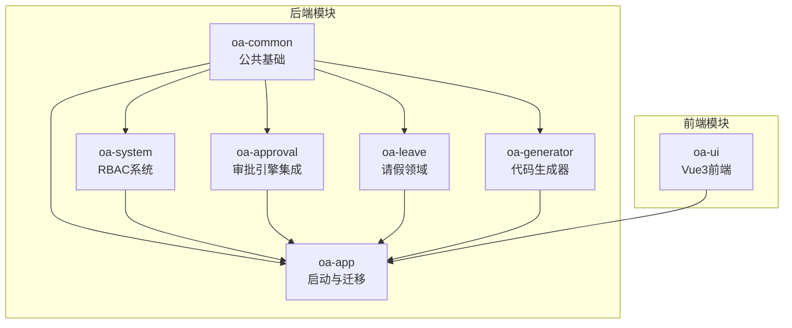
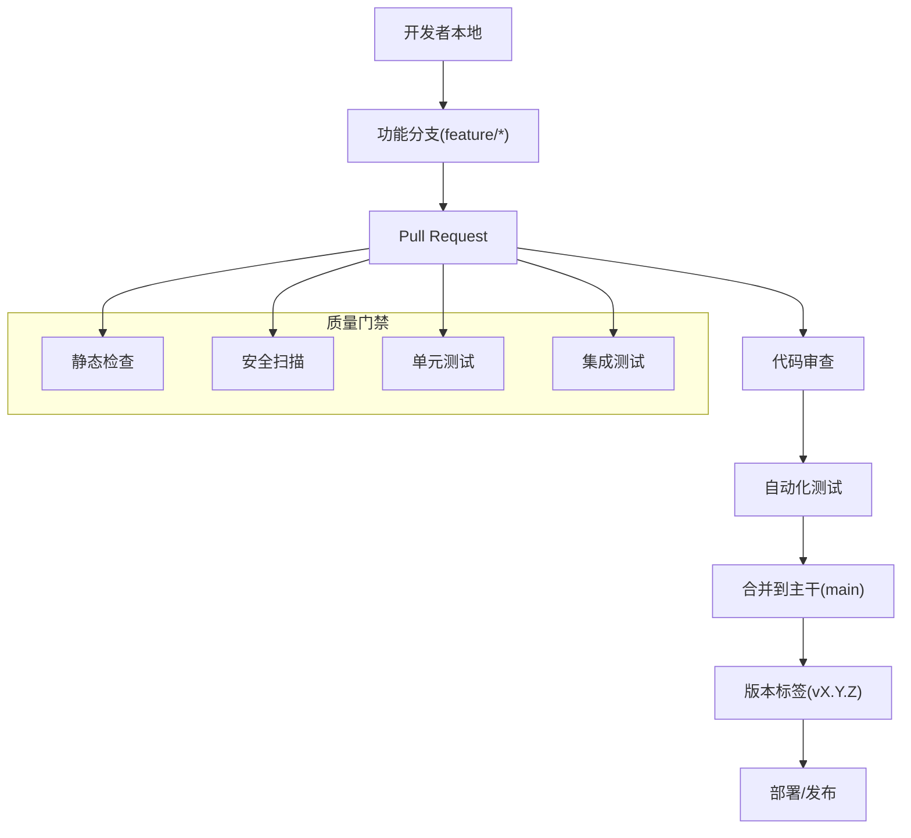
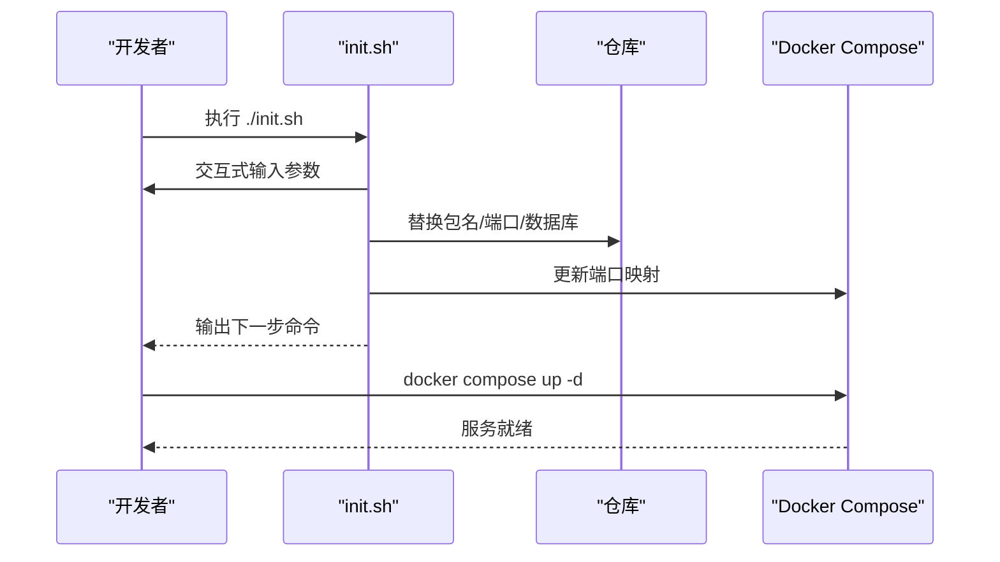
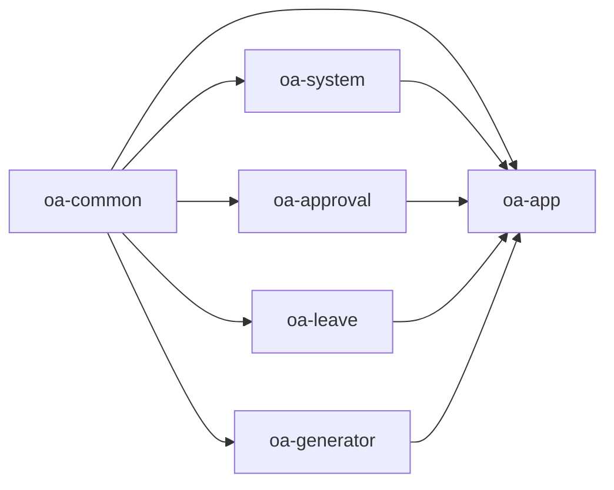

# Git工作流

<cite>
**本文档引用的文件**
- [README.md](file://README.md)
- [init.sh](file://init.sh)
- [.gitignore](file://.gitignore)
- [docker-compose.yml](file://docker-compose.yml)
- [pom.xml](file://pom.xml)
- [application.yml](file://oa-app/src/main/resources/application.yml)
- [openspec/config.yaml](file://openspec/config.yaml)
- [openspec/changes/leave-frontend-approval-integration/design.md](file://openspec/changes/leave-frontend-approval-integration/design.md)
- [openspec/changes/leave-frontend-approval-integration/tasks.md](file://openspec/changes/leave-frontend-approval-integration/tasks.md)
- [oa-generator/src/main/java/com/oa/admin/generator/OaGeneratorCli.java](file://oa-generator/src/main/java/com/oa/admin/generator/OaGeneratorCli.java)
</cite>

## 目录
1. [简介](#简介)
2. [项目结构](#项目结构)
3. [核心组件](#核心组件)
4. [架构总览](#架构总览)
5. [详细组件分析](#详细组件分析)
6. [依赖关系分析](#依赖关系分析)
7. [性能考虑](#性能考虑)
8. [故障排查指南](#故障排查指南)
9. [结论](#结论)
10. [附录](#附录)

## 简介
本文件面向OA审批管理系统团队，提供一套完整的Git工作流指南，涵盖分支管理策略、提交规范、Pull Request流程、代码审查与质量保障、日常开发操作（分支创建、合并、冲突解决、版本标签）以及项目初始化脚本的使用与环境配置流程。该工作流以“功能分支开发 + 主干受保护”的模式为基础，结合OpenSpec变更管理工具链，确保代码演进的可追溯性与可维护性。

## 项目结构
项目采用多模块Maven工程，包含后端模块（公共、系统、审批、请假、应用、代码生成器）与前端模块，配合Docker Compose进行本地一体化开发与测试。初始化脚本负责包名、端口、数据库等参数的交互式替换与环境准备。

图表来源
- [pom.xml:21-27](file://pom.xml#L21-L27)
- [README.md:48-61](file://README.md#L48-L61)

章节来源
- [README.md:48-61](file://README.md#L48-L61)
- [pom.xml:21-27](file://pom.xml#L21-L27)

## 核心组件
- 分支与版本管理：以主分支受保护为核心，功能开发在特性分支上进行，通过Pull Request合并至主干。
- 提交与评审：遵循约定式提交规范；每次PR至少一次代码审查与自动化检查通过。
- 变更管理：使用OpenSpec规范驱动的变更工作流，将需求、设计、任务与实现串联起来。
- 初始化与环境：init.sh脚本完成包名、端口、数据库等参数替换与容器编排，确保快速复现。

章节来源
- [openspec/config.yaml:1-20](file://openspec/config.yaml#L1-L20)
- [openspec/changes/leave-frontend-approval-integration/design.md:1-76](file://openspec/changes/leave-frontend-approval-integration/design.md#L1-L76)
- [openspec/changes/leave-frontend-approval-integration/tasks.md:1-53](file://openspec/changes/leave-frontend-approval-integration/tasks.md#L1-L53)
- [init.sh:1-238](file://init.sh#L1-L238)

## 架构总览
下图展示从开发者本地到CI/CD流水线的关键节点，强调分支策略、PR流程与质量门禁。

## 详细组件分析

### 分支管理策略
- 主分支保护
  - main分支禁止直接推送，必须通过PR合并。
  - 强制要求通过代码审查、自动化检查（构建、测试、安全扫描）。
- 功能分支
  - 命名：feature/主题（如feature/leave-approval-integration）
  - 从main派生，完成后删除，避免长期存在
- 预发布分支（可选）
  - release/X.Y用于预发布修复与最终验证
- 热修复分支（可选）
  - hotfix/问题描述，从main切出，修复后同时合并回main与release

章节来源
- [openspec/changes/leave-frontend-approval-integration/design.md:69-76](file://openspec/changes/leave-frontend-approval-integration/design.md#L69-L76)

### 提交消息规范（约定式提交）
- 类型
  - feat：新功能
  - fix：缺陷修复
  - docs：文档更新
  - style：格式调整（不影响逻辑）
  - refactor：重构（既不修复错误也不新增功能）
  - perf：性能优化
  - test：新增或修订测试
  - chore：构建流程、依赖管理等杂项
- 规范
  - 格式：type(scope): subject
  - 举例：feat(approval): 新增审批回调监听器
- 冲突解决与合并
  - 合并前确保rebase到最新main，保持线性历史
  - 合并后清理分支

章节来源
- [openspec/changes/leave-frontend-approval-integration/design.md:22-46](file://openspec/changes/leave-frontend-approval-integration/design.md#L22-L46)

### Pull Request流程
- PR模板
  - 背景与目标：简述需求背景、目标与验收标准
  - 设计要点：关键决策、权衡与风险
  - 变更范围：涉及文件/模块、是否破坏兼容
  - 测试计划：单元/集成/端到端测试清单
- 审查要点
  - 代码可读性、健壮性、安全性
  - 是否满足设计文档与任务清单
  - 是否引入新的技术债
- 合并条件
  - 至少一名审查者批准
  - 自动化检查全部通过
  - 无未解决评论

章节来源
- [openspec/changes/leave-frontend-approval-integration/design.md:7-21](file://openspec/changes/leave-frontend-approval-integration/design.md#L7-L21)
- [openspec/changes/leave-frontend-approval-integration/tasks.md:1-53](file://openspec/changes/leave-frontend-approval-integration/tasks.md#L1-L53)

### 代码审查与质量保证
- 代码审查
  - 优先人工审查，关注业务正确性与架构一致性
  - 对于OpenSpec变更，确保设计与任务清单一致
- 质量门禁
  - 构建：Maven编译通过
  - 单测：覆盖率阈值（如80%），异常路径覆盖
  - 集成测试：关键流程端到端验证
  - 安全扫描：依赖漏洞与敏感信息泄露检查
  - 文档：设计与任务清单同步更新
- OpenSpec变更闭环
  - 从spec到proposal、design、tasks，再到实现与归档
  - 任何实现偏差需更新相应文档

章节来源
- [openspec/config.yaml:1-20](file://openspec/config.yaml#L1-L20)
- [openspec/changes/leave-frontend-approval-integration/design.md:62-67](file://openspec/changes/leave-frontend-approval-integration/design.md#L62-L67)

### 日常开发Git操作指南
- 分支创建与同步
  - 从main创建功能分支：git checkout -b feature/主题
  - 同步上游：git fetch origin && git rebase origin/main
- 提交与推送
  - 小步提交，清晰的提交信息
  - 推送：git push -u origin HEAD
- 冲突解决
  - rebase到最新main，解决冲突后git add并git rebase --continue
  - 若冲突较多，考虑squash后再rebase
- 合并与清理
  - PR合并后删除本地与远程分支
- 版本标签
  - 语义化版本：v0.1.0、v1.2.3-rc.1
  - 标签推送到远端：git push origin vX.Y.Z

章节来源
- [openspec/changes/leave-frontend-approval-integration/design.md:69-76](file://openspec/changes/leave-frontend-approval-integration/design.md#L69-L76)

### 项目初始化脚本使用说明与环境配置
- 脚本能力
  - 交互式替换包名、模块artifactId、前后端端口、数据库名与密码
  - 替换Java源码包路径与声明、更新父POM模块引用
  - 更新后端配置与Docker Compose端口映射
- 使用步骤
  - 运行：./init.sh
  - 按提示输入参数或接受默认值
  - 完成后执行docker compose up -d启动服务
- 环境变量
  - 后端支持通过环境变量覆盖数据库与Redis配置
  - 前端通过Dockerfile与端口映射暴露服务

图表来源
- [init.sh:1-238](file://init.sh#L1-L238)
- [docker-compose.yml:1-66](file://docker-compose.yml#L1-L66)
- [application.yml:1-59](file://oa-app/src/main/resources/application.yml#L1-L59)

章节来源
- [init.sh:1-238](file://init.sh#L1-L238)
- [docker-compose.yml:1-66](file://docker-compose.yml#L1-L66)
- [application.yml:1-59](file://oa-app/src/main/resources/application.yml#L1-L59)
- [README.md:29-46](file://README.md#L29-L46)

## 依赖关系分析
- 模块依赖
  - 公共模块被系统、审批、请假与应用模块依赖
  - 应用模块聚合各子模块并负责Flyway迁移与启动
- 外部依赖
  - Spring Boot、MyBatis-Plus、Sa-Token、Flowable、MySQL、Redis
- 初始化与配置
  - init.sh统一替换包名与端口，docker-compose统一编排数据库与缓存

图表来源
- [pom.xml:21-27](file://pom.xml#L21-L27)

章节来源
- [pom.xml:21-27](file://pom.xml#L21-L27)

## 性能考虑
- 分支粒度
  - 功能分支尽量短小，减少长链rebase与合并复杂度
- 提交频率
  - 小步提交便于定位问题与回滚
- CI效率
  - 并行执行构建、测试与安全扫描，缩短反馈周期
- 代码生成器
  - 通过YAML定义生成CRUD与Flyway脚本，减少重复劳动，提升一致性

## 故障排查指南
- 初始化失败
  - 检查init.sh输出与.DOCKERIGNORE/.env等敏感文件是否被忽略
  - 确认端口未被占用，必要时调整docker-compose端口映射
- 构建失败
  - 确认Java与Node版本满足要求，依赖镜像可用
  - 清理本地Maven缓存后重试
- 数据库连接
  - 校验application.yml与docker-compose中的数据库URL、用户名与密码
- 审批集成问题
  - 确认Flowable模板已发布，审批回调监听器生效
  - 检查请假实体与审批实例外键关联是否正确

章节来源
- [.gitignore:1-48](file://.gitignore#L1-L48)
- [docker-compose.yml:1-66](file://docker-compose.yml#L1-L66)
- [application.yml:1-59](file://oa-app/src/main/resources/application.yml#L1-L59)
- [openspec/changes/leave-frontend-approval-integration/design.md:32-46](file://openspec/changes/leave-frontend-approval-integration/design.md#L32-L46)

## 结论
本Git工作流以“主干受保护 + 功能分支 + OpenSpec变更闭环”为核心，辅以约定式提交与严格的质量门禁，确保代码质量与交付效率。配合init.sh与Docker Compose，团队可以快速完成环境初始化与本地联调。建议在团队内定期回顾与优化流程，持续提升协作效率与系统稳定性。

## 附录
- OpenSpec变更工作流
  - 从spec到proposal、design、tasks，再到实现与归档
  - 通过CLI指令apply/continue/explore管理变更进度
- 代码生成器
  - 通过YAML定义生成后端CRUD与Flyway脚本
  - 可扩展前端模板生成（如Vue页面）

章节来源
- [openspec/config.yaml:1-20](file://openspec/config.yaml#L1-L20)
- [openspec/changes/leave-frontend-approval-integration/design.md:54-58](file://openspec/changes/leave-frontend-approval-integration/design.md#L54-L58)
- [oa-generator/src/main/java/com/oa/admin/generator/OaGeneratorCli.java:12-76](file://oa-generator/src/main/java/com/oa/admin/generator/OaGeneratorCli.java#L12-L76)