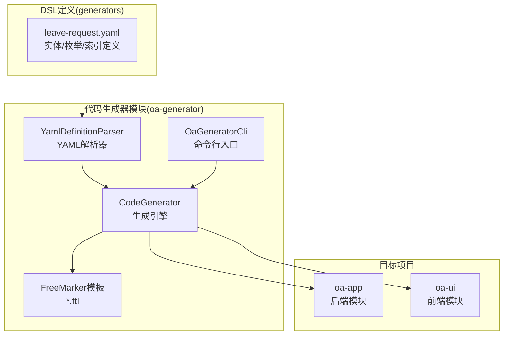
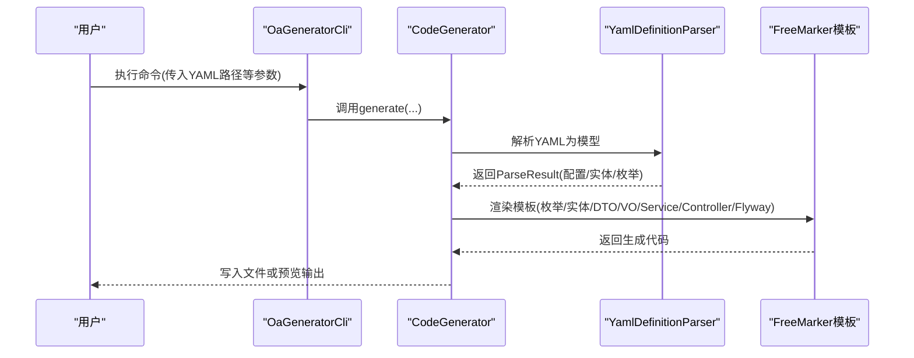
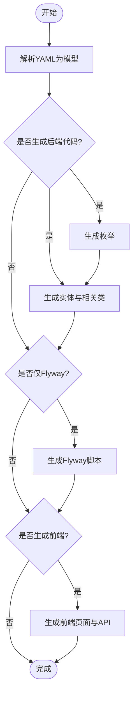
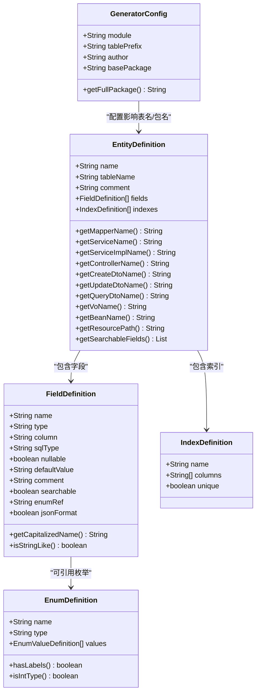
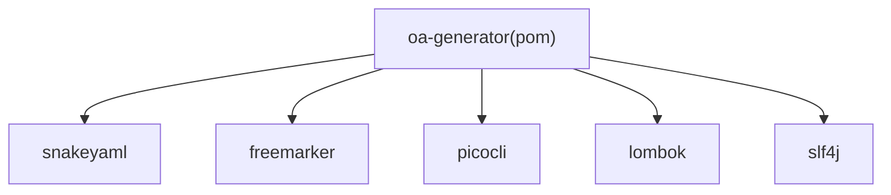

# 代码生成器流程

<cite>
**本文引用的文件**
- [OaGeneratorCli.java](file://oa-generator/src/main/java/com/oa/admin/generator/OaGeneratorCli.java)
- [CodeGenerator.java](file://oa-generator/src/main/java/com/oa/admin/generator/engine/CodeGenerator.java)
- [YamlDefinitionParser.java](file://oa-generator/src/main/java/com/oa/admin/generator/parser/YamlDefinitionParser.java)
- [GeneratorConfig.java](file://oa-generator/src/main/java/com/oa/admin/generator/config/GeneratorConfig.java)
- [EntityDefinition.java](file://oa-generator/src/main/java/com/oa/admin/generator/model/EntityDefinition.java)
- [EnumDefinition.java](file://oa-generator/src/main/java/com/oa/admin/generator/model/EnumDefinition.java)
- [FieldDefinition.java](file://oa-generator/src/main/java/com/oa/admin/generator/model/FieldDefinition.java)
- [IndexDefinition.java](file://oa-generator/src/main/java/com/oa/admin/generator/model/IndexDefinition.java)
- [TypeMapper.java](file://oa-generator/src/main/java/com/oa/admin/generator/parser/TypeMapper.java)
- [NamingUtils.java](file://oa-generator/src/main/java/com/oa/admin/generator/util/NamingUtils.java)
- [entity.ftl](file://oa-generator/src/main/resources/templates/entity.ftl)
- [controller.ftl](file://oa-generator/src/main/resources/templates/controller.ftl)
- [list.vue.ftl](file://oa-generator/src/main/resources/templates/vue/list.vue.ftl)
- [leave-request.yaml](file://generators/leave-request.yaml)
- [pom.xml](file://oa-generator/pom.xml)
</cite>

## 目录
1. [简介](#简介)
2. [项目结构](#项目结构)
3. [核心组件](#核心组件)
4. [架构总览](#架构总览)
5. [详细组件分析](#详细组件分析)
6. [依赖分析](#依赖分析)
7. [性能考虑](#性能考虑)
8. [故障排除指南](#故障排除指南)
9. [结论](#结论)
10. [附录](#附录)

## 简介
本文件面向OA审批管理系统的代码生成器，提供从YAML定义到代码生成再到项目集成的完整使用流程说明。内容涵盖：
- YAML DSL定义语法：实体、字段、枚举、索引等
- CLI命令行工具用法：参数、输出目录、模板选择
- 生成产物：后端CRUD代码、前端页面、数据库迁移脚本
- 命名与结构规范及后续手工调整建议

## 项目结构
代码生成器位于独立模块中，包含解析器、引擎、模板与CLI入口；业务DSL定义位于generators目录。

图表来源
- [OaGeneratorCli.java:1-76](file://oa-generator/src/main/java/com/oa/admin/generator/OaGeneratorCli.java#L1-L76)
- [CodeGenerator.java:1-226](file://oa-generator/src/main/java/com/oa/admin/generator/engine/CodeGenerator.java#L1-L226)
- [YamlDefinitionParser.java:1-204](file://oa-generator/src/main/java/com/oa/admin/generator/parser/YamlDefinitionParser.java#L1-L204)
- [leave-request.yaml:1-74](file://generators/leave-request.yaml#L1-L74)

章节来源
- [OaGeneratorCli.java:1-76](file://oa-generator/src/main/java/com/oa/admin/generator/OaGeneratorCli.java#L1-L76)
- [CodeGenerator.java:1-226](file://oa-generator/src/main/java/com/oa/admin/generator/engine/CodeGenerator.java#L1-L226)
- [YamlDefinitionParser.java:1-204](file://oa-generator/src/main/java/com/oa/admin/generator/parser/YamlDefinitionParser.java#L1-L204)
- [leave-request.yaml:1-74](file://generators/leave-request.yaml#L1-L74)

## 核心组件
- 命令行入口：负责解析CLI参数并调用生成引擎
- 生成引擎：协调解析、模板渲染、文件写入与预览
- YAML解析器：将DSL转换为内部模型（配置、实体、枚举、字段、索引）
- 模型层：EntityDefinition、EnumDefinition、FieldDefinition、IndexDefinition
- 类型映射：YAML类型到Java类型的映射与校验
- 命名工具：驼峰/蛇形互转、首字母大小写处理
- FreeMarker模板：后端实体、控制器、前端列表页等模板

章节来源
- [OaGeneratorCli.java:1-76](file://oa-generator/src/main/java/com/oa/admin/generator/OaGeneratorCli.java#L1-L76)
- [CodeGenerator.java:1-226](file://oa-generator/src/main/java/com/oa/admin/generator/engine/CodeGenerator.java#L1-L226)
- [YamlDefinitionParser.java:1-204](file://oa-generator/src/main/java/com/oa/admin/generator/parser/YamlDefinitionParser.java#L1-L204)
- [EntityDefinition.java:1-66](file://oa-generator/src/main/java/com/oa/admin/generator/model/EntityDefinition.java#L1-L66)
- [EnumDefinition.java:1-24](file://oa-generator/src/main/java/com/oa/admin/generator/model/EnumDefinition.java#L1-L24)
- [FieldDefinition.java:1-30](file://oa-generator/src/main/java/com/oa/admin/generator/model/FieldDefinition.java#L1-L30)
- [IndexDefinition.java:1-16](file://oa-generator/src/main/java/com/oa/admin/generator/model/IndexDefinition.java#L1-L16)
- [TypeMapper.java:1-66](file://oa-generator/src/main/java/com/oa/admin/generator/parser/TypeMapper.java#L1-L66)
- [NamingUtils.java:1-62](file://oa-generator/src/main/java/com/oa/admin/generator/util/NamingUtils.java#L1-L62)

## 架构总览
生成器采用“CLI → 引擎 → 解析器/模板”的分层设计，支持后端CRUD、前端页面与数据库迁移脚本的批量生成。

图表来源
- [OaGeneratorCli.java:51-70](file://oa-generator/src/main/java/com/oa/admin/generator/OaGeneratorCli.java#L51-L70)
- [CodeGenerator.java:27-63](file://oa-generator/src/main/java/com/oa/admin/generator/engine/CodeGenerator.java#L27-L63)
- [YamlDefinitionParser.java:34-49](file://oa-generator/src/main/java/com/oa/admin/generator/parser/YamlDefinitionParser.java#L34-L49)

## 详细组件分析

### YAML DSL定义语法
- 全局配置(global)
  - module：模块名，用于包名与资源路径
  - tablePrefix：表前缀，实体未显式指定表名时自动拼接
  - author：作者信息，注入到生成文件注释
  - basePackage：基础包名，默认值见配置类
- 枚举定义(enums)
  - name：枚举名
  - type：枚举类型，缺省int
  - values：枚举项集合，支持code/label或仅code
- 实体定义(entities)
  - name：实体名
  - tableName：表名，缺省由tablePrefix+实体名蛇形化组成
  - comment：实体注释
  - fields：字段数组
    - name/type/sqlType：字段名、Java类型、SQL类型
    - nullable/defaultValue/comment：可空、默认值、注释
    - searchable：是否参与查询条件
    - enum：引用的枚举名
    - jsonFormat：是否添加JSON格式化注解
  - indexes：索引数组
    - name/columns/unique：索引名、列集合、唯一性

章节来源
- [YamlDefinitionParser.java:52-133](file://oa-generator/src/main/java/com/oa/admin/generator/parser/YamlDefinitionParser.java#L52-L133)
- [YamlDefinitionParser.java:136-166](file://oa-generator/src/main/java/com/oa/admin/generator/parser/YamlDefinitionParser.java#L136-L166)
- [YamlDefinitionParser.java:177-190](file://oa-generator/src/main/java/com/oa/admin/generator/parser/YamlDefinitionParser.java#L177-L190)
- [leave-request.yaml:1-74](file://generators/leave-request.yaml#L1-L74)

### CLI命令行工具
- 主类：com.oa.admin.generator.OaGeneratorCli
- 参数
  - 第一个位置参数：YAML定义文件路径
  - -p/--project：项目根目录，默认当前目录
  - -m/--target-module：目标Maven模块，默认oa-app
  - --dry-run：预览模式，不写文件
  - --flyway-only：仅生成Flyway迁移脚本
  - --frontend：同时生成Vue 3前端页面
  - --entity：仅生成指定实体（逗号分隔）
- 运行方式：打包后以java -jar方式运行，或直接运行主类

章节来源
- [OaGeneratorCli.java:21-49](file://oa-generator/src/main/java/com/oa/admin/generator/OaGeneratorCli.java#L21-L49)
- [pom.xml:52-91](file://oa-generator/pom.xml#L52-L91)

### 生成引擎工作流
- 解析阶段：读取YAML → 解析为配置/实体/枚举
- 生成阶段：
  - 后端：枚举、实体、DTO、VO、Mapper、Service、ServiceImpl、Controller
  - 数据库：Flyway迁移脚本（按版本号生成）
  - 前端：列表页、表单对话框、API封装、路由片段（可选）
- 预览与写入：dry-run模式打印文件内容，否则写入目标模块

图表来源
- [CodeGenerator.java:27-63](file://oa-generator/src/main/java/com/oa/admin/generator/engine/CodeGenerator.java#L27-L63)
- [CodeGenerator.java:65-133](file://oa-generator/src/main/java/com/oa/admin/generator/engine/CodeGenerator.java#L65-L133)
- [CodeGenerator.java:158-203](file://oa-generator/src/main/java/com/oa/admin/generator/engine/CodeGenerator.java#L158-L203)

章节来源
- [CodeGenerator.java:27-63](file://oa-generator/src/main/java/com/oa/admin/generator/engine/CodeGenerator.java#L27-L63)
- [CodeGenerator.java:65-133](file://oa-generator/src/main/java/com/oa/admin/generator/engine/CodeGenerator.java#L65-L133)
- [CodeGenerator.java:158-203](file://oa-generator/src/main/java/com/oa/admin/generator/engine/CodeGenerator.java#L158-L203)

### 模板与命名规范
- 包名：basePackage.module
- 目录结构（后端）：entity/dto/vo/mapper/service/service/impl/controller/enums
- 文件命名（示例）
  - 实体：LeaveRequest.java
  - DTO：LeaveRequestCreateDTO.java、LeaveRequestUpdateDTO.java、LeaveRequestQueryDTO.java
  - VO：LeaveRequestVO.java
  - Mapper：LeaveRequestMapper.java
  - Service：LeaveRequestService.java
  - ServiceImpl：LeaveRequestServiceImpl.java
  - Controller：LeaveRequestController.java
- 前端
  - 列表页：views/leave/index.vue
  - 表单对话框：views/leave/components/LeaveRequestFormDialog.vue
  - API：src/api/leave.ts
  - 路由片段：在控制台输出，需手动加入router/index.ts

章节来源
- [EntityDefinition.java:20-58](file://oa-generator/src/main/java/com/oa/admin/generator/model/EntityDefinition.java#L20-L58)
- [CodeGenerator.java:95-112](file://oa-generator/src/main/java/com/oa/admin/generator/engine/CodeGenerator.java#L95-L112)
- [CodeGenerator.java:179-202](file://oa-generator/src/main/java/com/oa/admin/generator/engine/CodeGenerator.java#L179-L202)

### 类关系图（代码级）

图表来源
- [GeneratorConfig.java:8-18](file://oa-generator/src/main/java/com/oa/admin/generator/config/GeneratorConfig.java#L8-L18)
- [EntityDefinition.java:12-65](file://oa-generator/src/main/java/com/oa/admin/generator/model/EntityDefinition.java#L12-L65)
- [FieldDefinition.java:9-29](file://oa-generator/src/main/java/com/oa/admin/generator/model/FieldDefinition.java#L9-L29)
- [IndexDefinition.java:10-15](file://oa-generator/src/main/java/com/oa/admin/generator/model/IndexDefinition.java#L10-L15)
- [EnumDefinition.java:10-23](file://oa-generator/src/main/java/com/oa/admin/generator/model/EnumDefinition.java#L10-L23)

## 依赖分析
- 外部依赖：snakeyaml（YAML解析）、freemarker（模板）、picocli（命令行）、lombok（简化）、slf4j（日志）
- 生成器模块构建：maven-jar-plugin与maven-assembly-plugin打包为可执行JAR

图表来源
- [pom.xml:16-49](file://oa-generator/pom.xml#L16-L49)

章节来源
- [pom.xml:16-91](file://oa-generator/pom.xml#L16-L91)

## 性能考虑
- 模板渲染：FreeMarker在小规模实体上开销极低，无需额外优化
- IO写入：批量写入文件，建议在本地磁盘执行以避免网络延迟
- 干运行(dry-run)：调试与预览时优先使用，避免误改源码
- 实体过滤(--entity)：大规模DSL时可仅生成部分实体，缩短生成时间

## 故障排除指南
- YAML类型无效
  - 现象：抛出非法参数异常，提示有效类型集合
  - 排查：检查字段type是否在支持集合内
  - 参考：类型映射与校验逻辑
- 枚举引用未定义
  - 现象：实体字段引用了不存在的枚举名
  - 排查：确认enums中是否存在对应名称
- 生成后端但未生成前端
  - 现象：仅生成后端代码
  - 排查：确认是否传入--frontend参数
- 生成失败或中断
  - 现象：控制台输出错误信息并返回非零退出码
  - 排查：查看异常堆栈，修正YAML定义或CLI参数

章节来源
- [YamlDefinitionParser.java:168-174](file://oa-generator/src/main/java/com/oa/admin/generator/parser/YamlDefinitionParser.java#L168-L174)
- [YamlDefinitionParser.java:192-202](file://oa-generator/src/main/java/com/oa/admin/generator/parser/YamlDefinitionParser.java#L192-L202)
- [OaGeneratorCli.java:65-69](file://oa-generator/src/main/java/com/oa/admin/generator/OaGeneratorCli.java#L65-L69)

## 结论
该代码生成器通过简洁的YAML DSL快速产出后端CRUD、前端页面与数据库迁移脚本，配合CLI参数实现灵活的生成策略。遵循本文档的流程与规范，可在多模块项目中高效集成新业务实体，显著提升开发效率。

## 附录

### 使用示例：从YAML到代码集成
- 准备DSL定义
  - 在generators目录下创建或复用DSL文件，如leave-request.yaml
- 生成后端代码
  - 在oa-generator模块执行打包，得到可执行JAR
  - 使用CLI命令传入YAML路径、项目根目录、目标模块等参数
  - 若需要预览，添加--dry-run
- 生成前端页面
  - 在CLI命令中添加--frontend
  - 控制台会输出路由片段，复制到oa-ui/src/router/index.ts
  - API文件生成于oa-ui/src/api/leave.ts
- 生成数据库迁移
  - 默认同时生成Flyway迁移脚本至db/migration
  - 版本号自动生成，描述为模块名
- 后续手工调整与优化
  - 在Application类中补充@MapperScan扫描路径
  - 在sys_permission表中添加权限种子数据
  - 在前端AdminLayout.vue中增加菜单项
  - 根据业务需求完善Service/Controller逻辑与校验规则

章节来源
- [leave-request.yaml:1-74](file://generators/leave-request.yaml#L1-L74)
- [OaGeneratorCli.java:21-49](file://oa-generator/src/main/java/com/oa/admin/generator/OaGeneratorCli.java#L21-L49)
- [CodeGenerator.java:205-214](file://oa-generator/src/main/java/com/oa/admin/generator/engine/CodeGenerator.java#L205-L214)

### 关键模板一览
- 后端模板
  - 实体：entity.ftl
  - 控制器：controller.ftl
  - 前端模板
    - 列表页：vue/list.vue.ftl
    - 表单对话框：vue/form-dialog.vue.ftl
    - API封装：vue/api.ts.ftl
    - 路由片段：vue/route-snippet.ts.ftl

章节来源
- [entity.ftl:1-63](file://oa-generator/src/main/resources/templates/entity.ftl#L1-L63)
- [controller.ftl:1-56](file://oa-generator/src/main/resources/templates/controller.ftl#L1-L56)
- [list.vue.ftl:1-144](file://oa-generator/src/main/resources/templates/vue/list.vue.ftl#L1-L144)