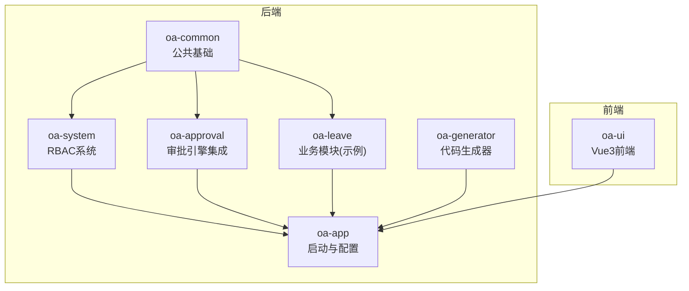
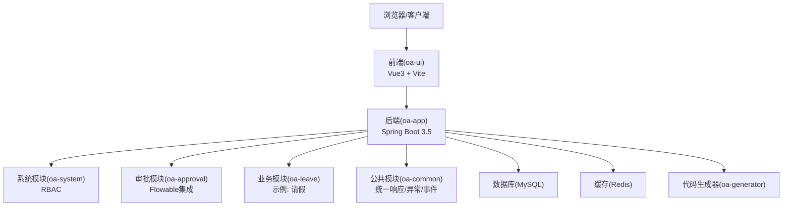
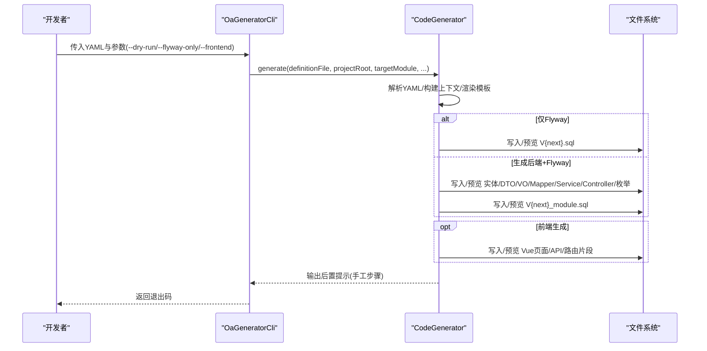
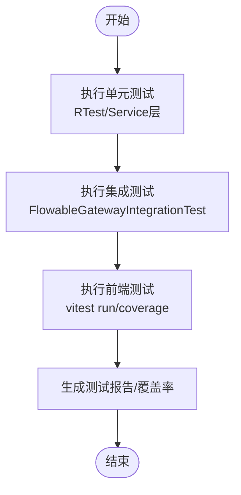
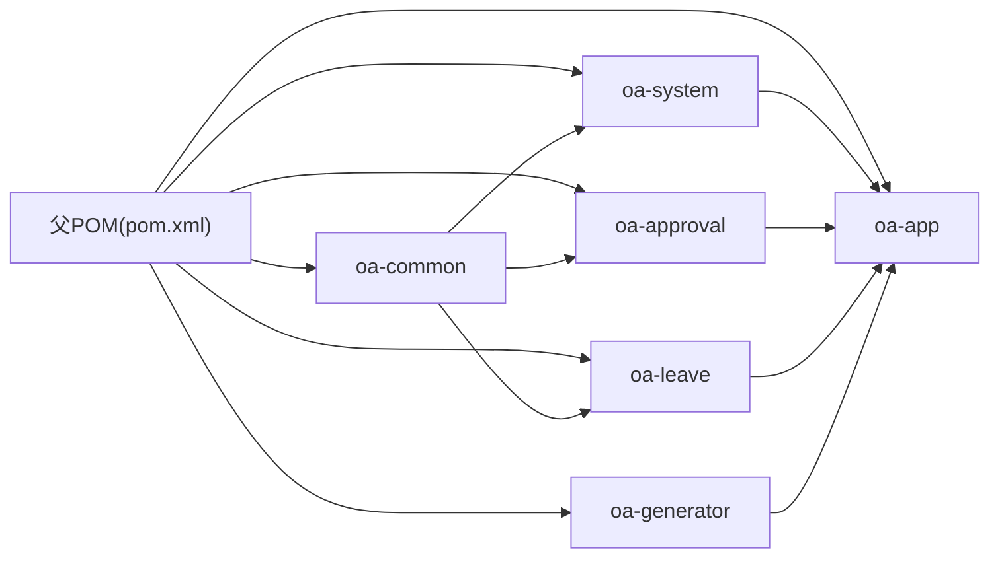

# 开发流程

<cite>
**本文档引用的文件**
- [README.md](file://README.md)
- [pom.xml](file://pom.xml)
- [init.sh](file://init.sh)
- [Dockerfile](file://Dockerfile)
- [docker-compose.yml](file://docker-compose.yml)
- [OaAdminApplication.java](file://oa-app/src/main/java/com/oa/admin/OaAdminApplication.java)
- [leave-request.yaml](file://generators/leave-request.yaml)
- [OaGeneratorCli.java](file://oa-generator/src/main/java/com/oa/admin/generator/OaGeneratorCli.java)
- [CodeGenerator.java](file://oa-generator/src/main/java/com/oa/admin/generator/engine/CodeGenerator.java)
- [FlowableGatewayIntegrationTest.java](file://oa-approval/src/test/java/com/oa/admin/approval/integration/FlowableGatewayIntegrationTest.java)
- [RTest.java](file://oa-common/src/test/java/com/oa/admin/common/result/RTest.java)
- [package.json](file://oa-ui/package.json)
- [config.yaml](file://openspec/config.yaml)
- [design.md](file://openspec/changes/leave-frontend-approval-integration/design.md)
- [tasks.md](file://openspec/changes/leave-frontend-approval-integration/tasks.md)
</cite>

## 目录
1. [引言](#引言)
2. [项目结构](#项目结构)
3. [核心组件](#核心组件)
4. [架构总览](#架构总览)
5. [详细组件分析](#详细组件分析)
6. [依赖关系分析](#依赖关系分析)
7. [性能考虑](#性能考虑)
8. [故障排查指南](#故障排查指南)
9. [结论](#结论)
10. [附录](#附录)

## 引言
本文件面向OA审批管理系统，提供从需求分析到代码上线的标准化开发流程文档。内容涵盖需求评审、技术设计、开发实现、测试验证、代码合并、部署发布等环节；解释Git工作流与分支管理策略（主分支保护、功能分支开发、特性分支合并）；阐述代码生成器的使用流程（从YAML定义到代码生成再到项目集成）；说明本地开发环境搭建、单元测试与集成测试执行标准流程；提供开发任务分解与进度跟踪方法；并包含代码审查流程与质量保证措施。

## 项目结构
项目采用多模块Maven聚合工程，包含公共模块、系统管理、审批流程、业务模块、应用启动与代码生成器等模块。前端采用Vue 3 + TypeScript + Vite，后端基于Spring Boot 3.5 + Flowable 7.2 + MyBatis-Plus，配合Docker Compose一键部署MySQL、Redis与前后端服务。

图表来源
- [pom.xml:21-28](file://pom.xml#L21-L28)
- [README.md:48-61](file://README.md#L48-L61)

章节来源
- [README.md:48-61](file://README.md#L48-L61)
- [pom.xml:21-28](file://pom.xml#L21-L28)

## 核心组件
- 应用入口与扫描：后端通过@SpringBootApplication与@MapperScan在启动类集中扫描各模块Mapper包，确保MyBatis-Plus映射生效。
- 初始化脚本：init.sh负责替换包名、端口、数据库名等配置，支持幂等初始化与强制重置。
- 一键部署：Dockerfile与docker-compose.yml提供构建与运行流水线，后端镜像基于Maven缓存构建，运行阶段仅拷贝最终Jar。
- 代码生成器：基于YAML定义，自动生成实体、Mapper、Service、Controller、DTO、VO、枚举及Flyway迁移脚本，并可扩展生成前端页面与路由片段。
- 测试体系：后端提供通用响应封装单元测试与审批流程集成测试；前端提供Vitest测试脚本与覆盖率命令。

章节来源
- [OaAdminApplication.java:11-18](file://oa-app/src/main/java/com/oa/admin/OaAdminApplication.java#L11-L18)
- [init.sh:96-238](file://init.sh#L96-L238)
- [Dockerfile:1-22](file://Dockerfile#L1-L22)
- [docker-compose.yml:1-66](file://docker-compose.yml#L1-L66)
- [CodeGenerator.java:27-63](file://oa-generator/src/main/java/com/oa/admin/generator/engine/CodeGenerator.java#L27-L63)
- [RTest.java:10-74](file://oa-common/src/test/java/com/oa/admin/common/result/RTest.java#L10-L74)
- [package.json:6-14](file://oa-ui/package.json#L6-L14)

## 架构总览
系统采用“多模块后端 + Vue3前端”的分层架构，审批流程通过Flowable引擎实现，权限控制基于Sa-Token，数据持久化使用MyBatis-Plus与Flyway迁移。Docker Compose统一编排MySQL、Redis、后端与前端服务。

图表来源
- [README.md:5-19](file://README.md#L5-L19)
- [README.md:48-61](file://README.md#L48-L61)
- [docker-compose.yml:22-61](file://docker-compose.yml#L22-L61)

## 详细组件分析

### Git工作流与分支管理策略
- 主分支保护：master/main作为受保护分支，禁止直接推送，必须通过Pull Request合并。
- 功能分支：开发者从主分支切出feature/<issue-id>-short-description，完成后发起PR至主分支。
- 特性分支：针对重大特性可建立release/<version>分支进行预发布收敛，最终合并回主分支并打Tag。
- 合并与审核：PR需至少一名Reviewer批准，CI通过后方可合并；合并前确保分支与上游同步。
- 提交规范：采用约定式提交，结合变更集描述与影响范围，便于生成变更日志与版本发布。

（本节为通用流程说明，不直接分析具体文件）

### 需求评审与技术设计
- OpenSpec驱动：通过openspec/specs与changes目录沉淀需求、设计与任务清单，形成可追溯的设计文档与任务拆分。
- 设计决策：在design.md中明确技术选型、权衡与风险缓解方案；在tasks.md中拆解落地任务并标注完成状态。
- 配置上下文：config.yaml用于声明项目上下文与制品规则，辅助AI生成与评审。

章节来源
- [config.yaml:1-21](file://openspec/config.yaml#L1-L21)
- [design.md:1-76](file://openspec/changes/leave-frontend-approval-integration/design.md#L1-L76)
- [tasks.md:1-53](file://openspec/changes/leave-frontend-approval-integration/tasks.md#L1-L53)

### 开发实现与代码生成器
- YAML定义：在generators目录下编写YAML，定义全局模块、表前缀、作者、枚举与实体字段、索引等。
- 生成器CLI：通过OaGeneratorCli解析参数，调用CodeGenerator执行生成，支持dry-run、仅生成Flyway、过滤实体、同时生成前端等选项。
- 生成内容：自动生成实体、DTO、VO、Mapper、Service、ServiceImpl、Controller、枚举与Flyway迁移脚本；若启用前端生成，则输出Vue页面与API模块、路由片段。
- 后续手工处理：更新启动类的MapperScan包路径、在权限表中插入菜单与按钮权限、在前端路由与侧边栏中注册页面。

图表来源
- [OaGeneratorCli.java:21-70](file://oa-generator/src/main/java/com/oa/admin/generator/OaGeneratorCli.java#L21-L70)
- [CodeGenerator.java:27-63](file://oa-generator/src/main/java/com/oa/admin/generator/engine/CodeGenerator.java#L27-L63)

章节来源
- [leave-request.yaml:1-74](file://generators/leave-request.yaml#L1-L74)
- [OaGeneratorCli.java:21-70](file://oa-generator/src/main/java/com/oa/admin/generator/OaGeneratorCli.java#L21-L70)
- [CodeGenerator.java:27-63](file://oa-generator/src/main/java/com/oa/admin/generator/engine/CodeGenerator.java#L27-L63)

### 单元测试与集成测试
- 后端通用响应：RTest验证统一响应体的结构与行为，确保接口返回格式一致。
- 审批流程集成：FlowableGatewayIntegrationTest使用嵌入式H2与Mock Bean，验证独占网关、并行网关、会签/或签、拒绝流程等关键路径。
- 前端测试：package.json提供test、test:watch、test:coverage等脚本，配合Vitest与Vue Test Utils执行单元测试与覆盖率统计。

图表来源
- [RTest.java:10-74](file://oa-common/src/test/java/com/oa/admin/common/result/RTest.java#L10-L74)
- [FlowableGatewayIntegrationTest.java:19-270](file://oa-approval/src/test/java/com/oa/admin/approval/integration/FlowableGatewayIntegrationTest.java#L19-L270)
- [package.json:6-14](file://oa-ui/package.json#L6-L14)

章节来源
- [RTest.java:10-74](file://oa-common/src/test/java/com/oa/admin/common/result/RTest.java#L10-L74)
- [FlowableGatewayIntegrationTest.java:19-270](file://oa-approval/src/test/java/com/oa/admin/approval/integration/FlowableGatewayIntegrationTest.java#L19-L270)
- [package.json:6-14](file://oa-ui/package.json#L6-L14)

### 本地开发环境搭建
- 前置依赖：macOS/Linux（Windows推荐WSL2），Java 21+，Node.js 18+，Docker与Docker Compose。
- 初始化：运行init.sh进行交互式配置（包名、端口、数据库名/密码、MySQL/Redis端口），支持--force重初始化。
- 启动服务：docker compose up -d，等待MySQL健康检查后访问前端与后端服务。
- 环境变量：后端支持通过环境变量覆盖数据库与Redis配置，便于容器化部署。

章节来源
- [README.md:20-46](file://README.md#L20-L46)
- [init.sh:22-238](file://init.sh#L22-L238)
- [docker-compose.yml:1-66](file://docker-compose.yml#L1-L66)
- [README.md:118-129](file://README.md#L118-L129)

### 代码合并与发布
- 合并策略：主分支受保护，使用PR合并；每次合并前确保分支与上游同步，避免冲突。
- 构建与打包：Dockerfile基于Maven缓存构建oa-app模块，运行阶段仅复制最终Jar，减小镜像体积。
- 发布流程：合并后由CI触发构建与测试，通过后推送镜像并部署至目标环境；生产环境通过docker-compose或Kubernetes编排。

章节来源
- [Dockerfile:1-22](file://Dockerfile#L1-L22)
- [docker-compose.yml:1-66](file://docker-compose.yml#L1-L66)

### 开发任务分解与进度跟踪
- OpenSpec任务清单：在tasks.md中按阶段列出数据库迁移、后端集成、前端页面、路由与菜单、代码生成器扩展、集成测试等任务，并标注完成状态。
- 设计文档：design.md记录背景、目标、决策、权衡与迁移计划，便于跨团队沟通与审计。
- 配置规则：config.yaml可定义制品规则与上下文，辅助AI生成与评审。

章节来源
- [tasks.md:1-53](file://openspec/changes/leave-frontend-approval-integration/tasks.md#L1-L53)
- [design.md:1-76](file://openspec/changes/leave-frontend-approval-integration/design.md#L1-L76)
- [config.yaml:1-21](file://openspec/config.yaml#L1-L21)

### 代码审查流程与质量保证
- 代码审查：PR需至少一名Reviewer批准，关注设计一致性、测试覆盖、命名规范与安全问题。
- 质量工具：后端统一响应与异常处理在公共模块中集中实现，前端使用ESLint与Vitest保障代码质量。
- 测试要求：每个新增模块至少提供单元测试与关键集成测试；审批流程相关测试需覆盖典型网关与分支场景。

章节来源
- [RTest.java:10-74](file://oa-common/src/test/java/com/oa/admin/common/result/RTest.java#L10-L74)
- [FlowableGatewayIntegrationTest.java:19-270](file://oa-approval/src/test/java/com/oa/admin/approval/integration/FlowableGatewayIntegrationTest.java#L19-L270)
- [package.json:24-36](file://oa-ui/package.json#L24-L36)

## 依赖关系分析
多模块Maven工程通过父POM统一管理版本与依赖，子模块间通过内部依赖与公共模块解耦。代码生成器独立于业务模块，通过模板引擎与YAML定义生成代码，再由业务模块集成。

图表来源
- [pom.xml:21-28](file://pom.xml#L21-L28)
- [pom.xml:44-113](file://pom.xml#L44-L113)

章节来源
- [pom.xml:21-28](file://pom.xml#L21-L28)
- [pom.xml:44-113](file://pom.xml#L44-L113)

## 性能考虑
- 启动与构建：Dockerfile利用Maven缓存加速构建，仅复制最终Jar到运行镜像，缩短启动时间。
- 数据库：Flyway迁移脚本按版本顺序执行，建议在生成器中统一管理版本号，避免重复与冲突。
- 前端：Vite提供快速热更新与打包优化，建议开启产物压缩与懒加载以提升首屏性能。
- 审批流程：Flowable流程设计应避免过深分支与过多并行任务，减少运行时开销。

（本节为通用指导，不直接分析具体文件）

## 故障排查指南
- 初始化失败：检查init.sh输入参数与权限，确认环境变量与端口未被占用；必要时使用--force重初始化。
- 容器无法启动：查看docker-compose健康检查与日志，确认MySQL与Redis服务可用；检查环境变量与网络连通性。
- 生成器报错：使用--dry-run预览生成内容，核对YAML语法与字段类型映射；确认目标模块与包路径正确。
- 测试失败：后端测试失败通常与响应格式或权限注解有关；前端测试失败多为组件未正确模拟或路由未注册。

章节来源
- [init.sh:22-238](file://init.sh#L22-L238)
- [docker-compose.yml:16-20](file://docker-compose.yml#L16-L20)
- [OaGeneratorCli.java:52-70](file://oa-generator/src/main/java/com/oa/admin/generator/OaGeneratorCli.java#L52-L70)
- [RTest.java:10-74](file://oa-common/src/test/java/com/oa/admin/common/result/RTest.java#L10-L74)

## 结论
本开发流程文档基于现有代码库提炼出标准化实践：以OpenSpec驱动需求与设计，以代码生成器提升开发效率，以严格的测试与质量保证确保交付质量，以Docker Compose实现一键部署。遵循该流程可显著提升团队协作效率与系统稳定性。

## 附录
- 快速开始：参考README中的技术栈、快速开始与项目结构说明。
- 环境变量：后端支持通过环境变量覆盖数据库与Redis配置。
- API风格：RESTful统一前缀、认证头与响应体格式、分页约定。

章节来源
- [README.md:5-19](file://README.md#L5-L19)
- [README.md:20-46](file://README.md#L20-L46)
- [README.md:87-93](file://README.md#L87-L93)
- [README.md:118-129](file://README.md#L118-L129)