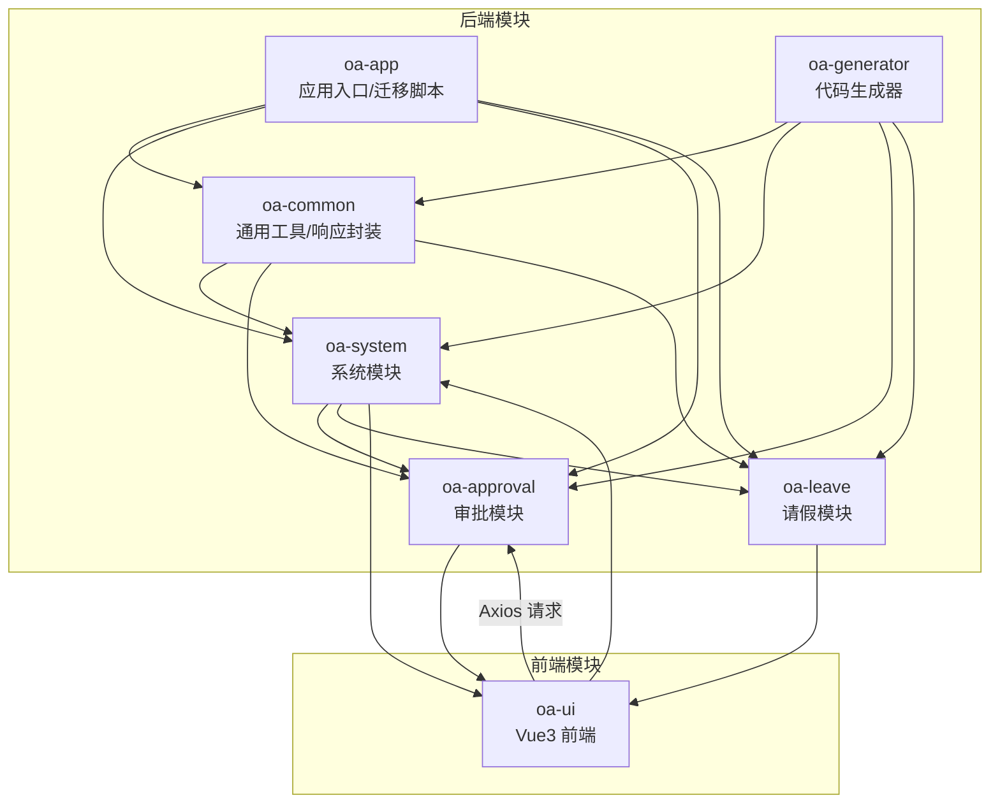
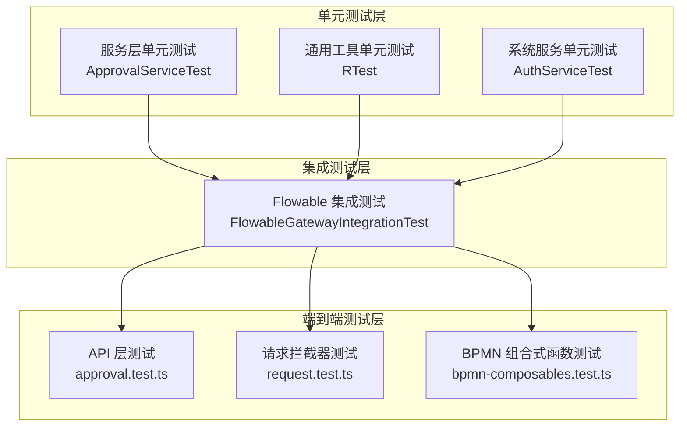
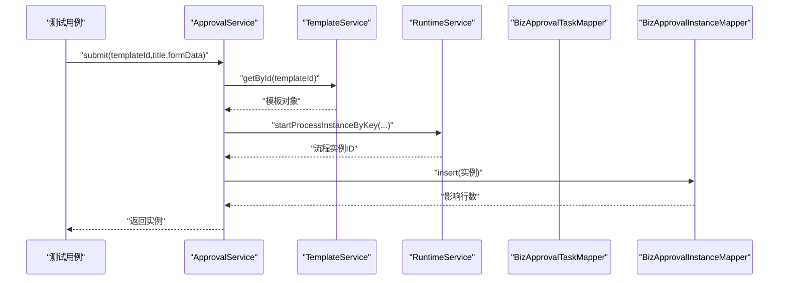
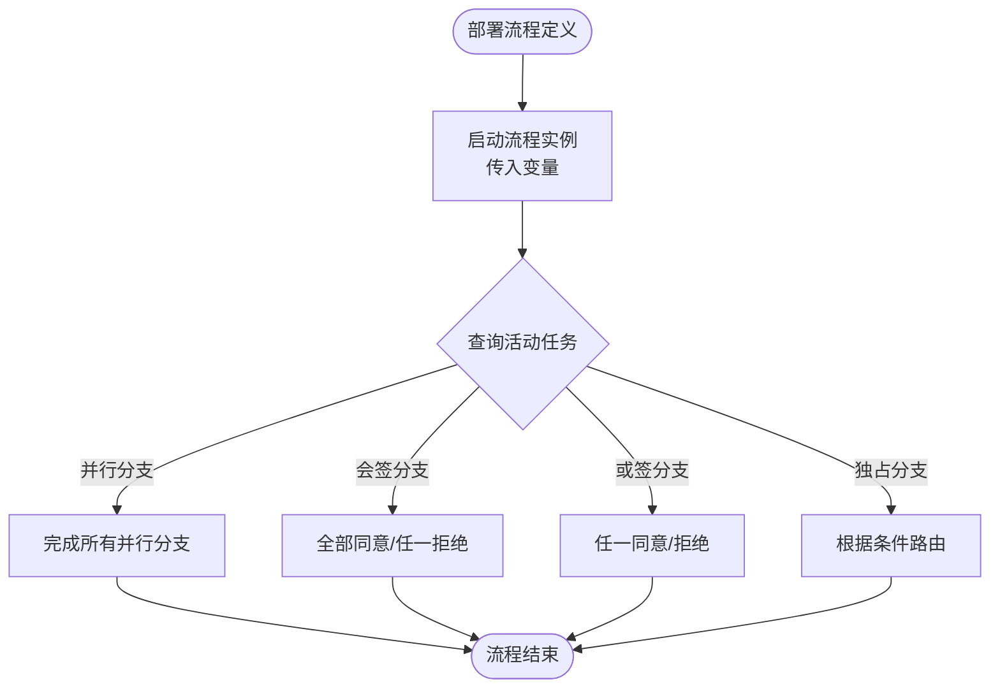
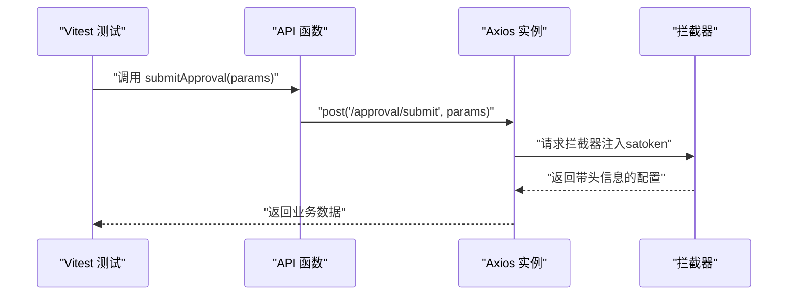
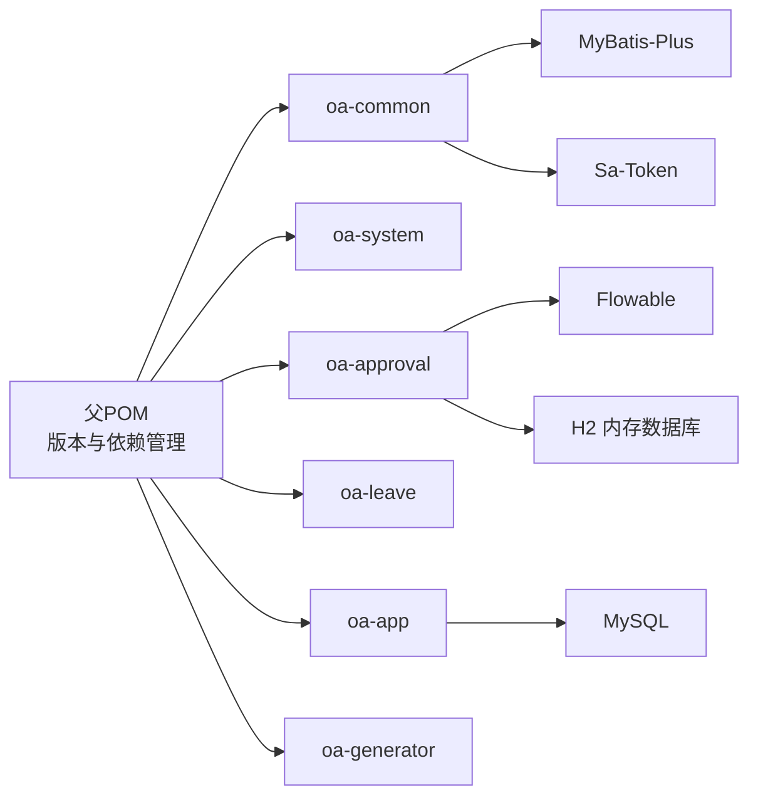

# 测试流程

<cite>
**本文引用的文件**
- [pom.xml](file://pom.xml)
- [oa-approval/pom.xml](file://oa-approval/pom.xml)
- [oa-common/pom.xml](file://oa-common/pom.xml)
- [docker-compose.yml](file://docker-compose.yml)
- [vitest.config.ts](file://oa-ui/vitest.config.ts)
- [package.json](file://oa-ui/package.json)
- [ApprovalServiceTest.java](file://oa-approval/src/test/java/com/oa/admin/approval/service/ApprovalServiceTest.java)
- [FlowableGatewayIntegrationTest.java](file://oa-approval/src/test/java/com/oa/admin/approval/integration/FlowableGatewayIntegrationTest.java)
- [RTest.java](file://oa-common/src/test/java/com/oa/admin/common/result/RTest.java)
- [AuthServiceTest.java](file://oa-system/src/test/java/com/oa/admin/system/service/AuthServiceTest.java)
- [approval.test.ts](file://oa-ui/src/api/approval.test.ts)
- [request.test.ts](file://oa-ui/src/utils/request.test.ts)
- [bpmn-composables.test.ts](file://oa-ui/src/composables/bpmn/bpmn-composables.test.ts)
- [ApprovalPermissionSeedDataTest.java](file://oa-app/src/test/java/com/oa/admin/ApprovalPermissionSeedDataTest.java)
</cite>

## 目录
1. [引言](#引言)
2. [项目结构](#项目结构)
3. [核心组件](#核心组件)
4. [架构总览](#架构总览)
5. [详细组件分析](#详细组件分析)
6. [依赖分析](#依赖分析)
7. [性能考虑](#性能考虑)
8. [故障排查指南](#故障排查指南)
9. [结论](#结论)
10. [附录](#附录)

## 引言
本文件面向OA审批管理系统，提供标准化测试流程文档，覆盖单元测试、集成测试与端到端测试的编写与执行策略；阐述测试金字塔在服务层、控制器层与工作流集成层的应用；明确测试环境搭建（含测试数据库与Mock对象）；给出前端测试执行流程（Vitest配置、组件测试、API测试）；并提出测试覆盖率与持续集成中的测试执行建议。

## 项目结构
该工程采用多模块Maven聚合结构，包含审批、系统、通用、请假、应用与生成器模块；前端位于oa-ui目录，使用Vite+Vue3+Vitest进行开发与测试；后端使用Spring Boot与Flowable工作流引擎。

图表来源
- [pom.xml:21-28](file://pom.xml#L21-L28)
- [docker-compose.yml:1-66](file://docker-compose.yml#L1-L66)

章节来源
- [pom.xml:21-28](file://pom.xml#L21-L28)
- [docker-compose.yml:1-66](file://docker-compose.yml#L1-L66)

## 核心组件
- 审批服务层：包含提交、审批、撤回、转办、待办/已办查询、仪表盘统计、流程图渲染等逻辑，广泛使用Mockito进行依赖注入与行为验证。
- 工作流集成层：基于嵌入式Flowable引擎与H2内存数据库，对网关、并行/会签/或签等流程模式进行集成测试。
- 响应封装与异常：统一返回体与业务异常定义，便于测试断言。
- 前端测试：Vitest配置HappyDOM环境，覆盖API适配层、请求拦截器、BPMN组合式函数等。

章节来源
- [ApprovalServiceTest.java:140-401](file://oa-approval/src/test/java/com/oa/admin/approval/service/ApprovalServiceTest.java#L140-L401)
- [FlowableGatewayIntegrationTest.java:108-134](file://oa-approval/src/test/java/com/oa/admin/approval/integration/FlowableGatewayIntegrationTest.java#L108-L134)
- [RTest.java:12-73](file://oa-common/src/test/java/com/oa/admin/common/result/RTest.java#L12-L73)
- [vitest.config.ts:9-21](file://oa-ui/vitest.config.ts#L9-L21)
- [package.json:6-14](file://oa-ui/package.json#L6-L14)

## 架构总览
测试金字塔在本项目中的体现：
- 底层（单元测试）：服务层与工具类测试，使用Mockito与JUnit5，快速验证业务逻辑与边界条件。
- 中层（集成测试）：工作流集成测试，使用嵌入式Flowable引擎与H2，验证流程网关与任务流转。
- 上层（端到端测试）：前端组件与API测试，使用Vitest与HappyDOM，验证用户交互与接口契约。

图表来源
- [ApprovalServiceTest.java:1-802](file://oa-approval/src/test/java/com/oa/admin/approval/service/ApprovalServiceTest.java#L1-L802)
- [FlowableGatewayIntegrationTest.java:1-270](file://oa-approval/src/test/java/com/oa/admin/approval/integration/FlowableGatewayIntegrationTest.java#L1-L270)
- [RTest.java:1-74](file://oa-common/src/test/java/com/oa/admin/common/result/RTest.java#L1-L74)
- [AuthServiceTest.java:1-103](file://oa-system/src/test/java/com/oa/admin/system/service/AuthServiceTest.java#L1-L103)
- [approval.test.ts:1-154](file://oa-ui/src/api/approval.test.ts#L1-L154)
- [request.test.ts:1-107](file://oa-ui/src/utils/request.test.ts#L1-L107)
- [bpmn-composables.test.ts:1-284](file://oa-ui/src/composables/bpmn/bpmn-composables.test.ts#L1-L284)

## 详细组件分析

### 服务层测试（ApprovalServiceTest）
- 测试范围：提交、审批、撤回、转办、待办/已办、我的申请分页、实例详情、流程图渲染、仪表盘统计、审计日志等。
- 关键技术点：
  - 使用Mockito对模板服务、Mapper、RuntimeService、TaskService、HistoryService、RepositoryService、通知与审计服务进行Mock。
  - 使用静态Mock模拟登录上下文（StpUtil），确保鉴权相关断言。
  - 使用反射注入基类Mapper字段，简化测试初始化。
  - 对复杂参数（如流程变量、任务结果）使用自定义匹配器进行断言。
- 断言策略：对返回值、异常码、调用次数与参数、历史与当前节点集合等进行断言。

图表来源
- [ApprovalServiceTest.java:154-172](file://oa-approval/src/test/java/com/oa/admin/approval/service/ApprovalServiceTest.java#L154-L172)

章节来源
- [ApprovalServiceTest.java:100-172](file://oa-approval/src/test/java/com/oa/admin/approval/service/ApprovalServiceTest.java#L100-L172)

### 工作流集成测试（FlowableGatewayIntegrationTest）
- 测试范围：独占网关、并行网关、会签、或签、拒绝路径等流程模式。
- 环境配置：嵌入式Flowable引擎 + H2内存数据库，注册测试Bean以支持BPMN中的UEL解析。
- 断言策略：启动流程后查询任务数量与状态，完成部分任务后验证流程是否按预期结束或继续。

图表来源
- [FlowableGatewayIntegrationTest.java:95-104](file://oa-approval/src/test/java/com/oa/admin/approval/integration/FlowableGatewayIntegrationTest.java#L95-L104)
- [FlowableGatewayIntegrationTest.java:138-169](file://oa-approval/src/test/java/com/oa/admin/approval/integration/FlowableGatewayIntegrationTest.java#L138-L169)
- [FlowableGatewayIntegrationTest.java:173-211](file://oa-approval/src/test/java/com/oa/admin/approval/integration/FlowableGatewayIntegrationTest.java#L173-L211)
- [FlowableGatewayIntegrationTest.java:215-249](file://oa-approval/src/test/java/com/oa/admin/approval/integration/FlowableGatewayIntegrationTest.java#L215-L249)
- [FlowableGatewayIntegrationTest.java:253-268](file://oa-approval/src/test/java/com/oa/admin/approval/integration/FlowableGatewayIntegrationTest.java#L253-L268)

章节来源
- [FlowableGatewayIntegrationTest.java:26-86](file://oa-approval/src/test/java/com/oa/admin/approval/integration/FlowableGatewayIntegrationTest.java#L26-L86)
- [FlowableGatewayIntegrationTest.java:108-134](file://oa-approval/src/test/java/com/oa/admin/approval/integration/FlowableGatewayIntegrationTest.java#L108-L134)
- [FlowableGatewayIntegrationTest.java:138-169](file://oa-approval/src/test/java/com/oa/admin/approval/integration/FlowableGatewayIntegrationTest.java#L138-L169)
- [FlowableGatewayIntegrationTest.java:173-211](file://oa-approval/src/test/java/com/oa/admin/approval/integration/FlowableGatewayIntegrationTest.java#L173-L211)
- [FlowableGatewayIntegrationTest.java:215-249](file://oa-approval/src/test/java/com/oa/admin/approval/integration/FlowableGatewayIntegrationTest.java#L215-L249)
- [FlowableGatewayIntegrationTest.java:253-268](file://oa-approval/src/test/java/com/oa/admin/approval/integration/FlowableGatewayIntegrationTest.java#L253-L268)

### 响应封装与异常测试（RTest）
- 覆盖统一响应体的构造、消息与状态码、时间戳、分页封装等场景。
- 断言策略：对code/msg/data/timestamp进行精确断言，确保前后端契约一致。

章节来源
- [RTest.java:12-73](file://oa-common/src/test/java/com/oa/admin/common/result/RTest.java#L12-L73)

### 系统服务测试（AuthServiceTest）
- 覆盖登录失败、禁用用户、登出、当前用户查询等场景。
- 关键点：使用静态Mock模拟登录上下文，避免真实数据库依赖。

章节来源
- [AuthServiceTest.java:46-101](file://oa-system/src/test/java/com/oa/admin/system/service/AuthServiceTest.java#L46-L101)

### 前端测试（Vitest）
- Vitest配置：使用HappyDOM作为浏览器环境，启用全局测试API与别名映射。
- API层测试：对审批相关API函数进行调用断言，验证请求路径与参数传递。
- 请求拦截器测试：验证token注入、业务码校验、401跳转等行为。
- 组合式函数测试：对BPMN选择、命令栈、模型器等组合式函数进行事件驱动断言。

图表来源
- [approval.test.ts:18-29](file://oa-ui/src/api/approval.test.ts#L18-L29)
- [request.test.ts:51-59](file://oa-ui/src/utils/request.test.ts#L51-L59)

章节来源
- [vitest.config.ts:9-21](file://oa-ui/vitest.config.ts#L9-L21)
- [package.json:6-14](file://oa-ui/package.json#L6-L14)
- [approval.test.ts:18-29](file://oa-ui/src/api/approval.test.ts#L18-L29)
- [request.test.ts:51-59](file://oa-ui/src/utils/request.test.ts#L51-L59)
- [bpmn-composables.test.ts:12-31](file://oa-ui/src/composables/bpmn/bpmn-composables.test.ts#L12-L31)

## 依赖分析
- 后端依赖管理：父POM集中管理版本与模块聚合；各子模块引入Spring Boot Starter、MyBatis-Plus、Flowable、Sa-Token等。
- 测试依赖：各模块均引入spring-boot-starter-test与h2（用于工作流集成测试）。
- 前端依赖：Vitest、happy-dom、@vue/test-utils、@vitest/coverage-v8等。

图表来源
- [pom.xml:44-113](file://pom.xml#L44-L113)
- [oa-approval/pom.xml:14-47](file://oa-approval/pom.xml#L14-L47)
- [oa-common/pom.xml:17-52](file://oa-common/pom.xml#L17-L52)

章节来源
- [pom.xml:44-113](file://pom.xml#L44-L113)
- [oa-approval/pom.xml:14-47](file://oa-approval/pom.xml#L14-L47)
- [oa-common/pom.xml:17-52](file://oa-common/pom.xml#L17-L52)

## 性能考虑
- 单元测试优先：通过Mock减少IO与外部依赖，提升执行速度。
- 集成测试隔离：工作流测试使用H2内存数据库，避免持久化开销；仅在必要时使用真实数据库。
- 前端测试环境：HappyDOM无需真实浏览器，提高测试并发与稳定性。
- 并行执行：建议在CI中并行运行不同模块的测试，缩短总耗时。

## 故障排查指南
- 工作流测试失败
  - 检查流程部署与版本查询逻辑，确认资源路径与最新版本匹配。
  - 确认测试Bean（如AssigneeResolver、CandidateUserResolver、TaskListener）正确注册。
- 响应断言失败
  - 核对统一响应体字段与业务异常码，确保前后端约定一致。
- 前端拦截器异常
  - 检查localStorage中token存在性与拦截器注册顺序，确认401处理逻辑。
- 权限种子数据不一致
  - 使用权限种子数据测试确保控制器权限与种子SQL一致，并保证管理员授权在权限插入之后执行。

章节来源
- [FlowableGatewayIntegrationTest.java:95-104](file://oa-approval/src/test/java/com/oa/admin/approval/integration/FlowableGatewayIntegrationTest.java#L95-L104)
- [FlowableGatewayIntegrationTest.java:35-40](file://oa-approval/src/test/java/com/oa/admin/approval/integration/FlowableGatewayIntegrationTest.java#L35-L40)
- [RTest.java:44-57](file://oa-common/src/test/java/com/oa/admin/common/result/RTest.java#L44-L57)
- [request.test.ts:87-97](file://oa-ui/src/utils/request.test.ts#L87-L97)
- [ApprovalPermissionSeedDataTest.java:50-71](file://oa-app/src/test/java/com/oa/admin/ApprovalPermissionSeedDataTest.java#L50-L71)

## 结论
本项目已形成完善的测试体系：单元测试保障服务层逻辑正确性，集成测试验证工作流关键路径，前端测试覆盖API与交互。建议在持续集成中分别执行单元测试、集成测试与前端测试，并结合覆盖率报告持续改进。

## 附录

### 测试环境搭建与配置
- 后端测试数据库
  - 集成测试使用H2内存数据库，连接配置在Flowable集成测试类中设置。
  - 可选：本地Docker Compose启动MySQL与Redis，供端到端测试使用。
- 前端测试环境
  - Vitest使用HappyDOM，无需真实浏览器；可通过脚本触发测试与覆盖率生成。

章节来源
- [FlowableGatewayIntegrationTest.java:27-43](file://oa-approval/src/test/java/com/oa/admin/approval/integration/FlowableGatewayIntegrationTest.java#L27-L43)
- [docker-compose.yml:1-66](file://docker-compose.yml#L1-L66)
- [vitest.config.ts:9-21](file://oa-ui/vitest.config.ts#L9-L21)
- [package.json:6-14](file://oa-ui/package.json#L6-L14)

### 测试用例编写指南
- 断言方法
  - 使用JUnit Assert与Mockito Verify/VerifyNoInteractions进行行为断言。
  - 使用Vitest expect进行前端断言。
- 测试数据准备
  - 使用Builder风格构建实体对象，或通过Mock返回期望数据。
  - 对流程变量与任务结果使用自定义ArgumentMatcher进行断言。
- 异步测试处理
  - 前端使用异步函数与Promise断言；后端可使用@Async配合测试线程池或直接验证同步行为。

章节来源
- [ApprovalServiceTest.java:140-172](file://oa-approval/src/test/java/com/oa/admin/approval/service/ApprovalServiceTest.java#L140-L172)
- [approval.test.ts:18-29](file://oa-ui/src/api/approval.test.ts#L18-L29)
- [request.test.ts:70-77](file://oa-ui/src/utils/request.test.ts#L70-L77)

### 前端测试执行流程
- 执行命令
  - 运行测试：npm run test
  - 监听模式：npm run test:watch
  - 生成覆盖率：npm run test:coverage
- 配置要点
  - Vitest配置HappyDOM、全局API、别名映射与测试文件匹配规则。

章节来源
- [package.json:6-14](file://oa-ui/package.json#L6-L14)
- [vitest.config.ts:9-21](file://oa-ui/vitest.config.ts#L9-L21)

### 测试覆盖率与持续集成策略
- 覆盖率要求建议
  - 单元测试：服务层与工具类达到较高覆盖率（如>80%）。
  - 集成测试：工作流关键路径全覆盖。
  - 前端测试：API与拦截器、组合式函数关键逻辑全覆盖。
- CI策略
  - 分阶段执行：先单元测试，再集成测试，最后前端测试。
  - 失败即停：任一阶段失败立即中断，输出报告与日志。
  - 缓存优化：复用依赖缓存，加速构建与测试。

章节来源
- [package.json:13-13](file://oa-ui/package.json#L13-L13)
- [pom.xml:115-129](file://pom.xml#L115-L129)