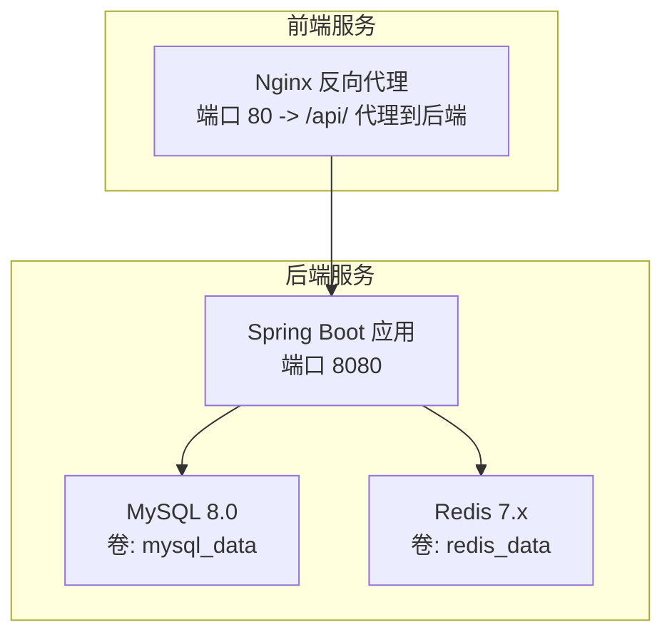
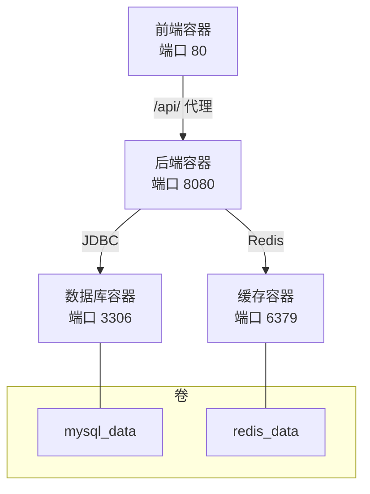
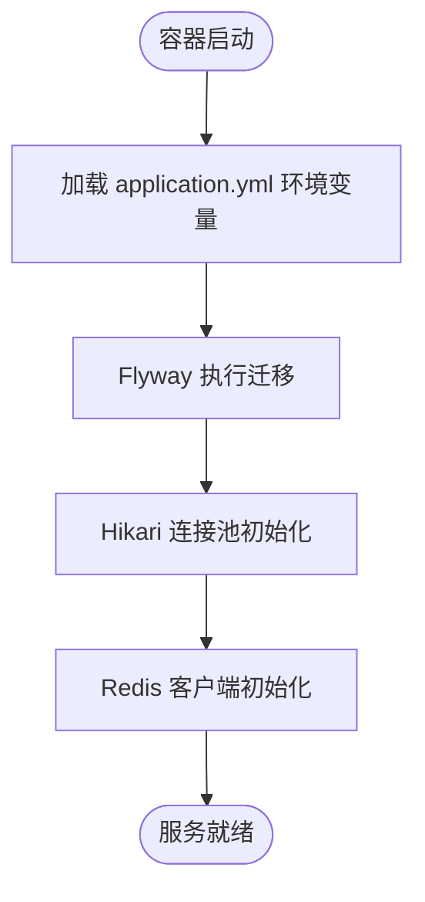
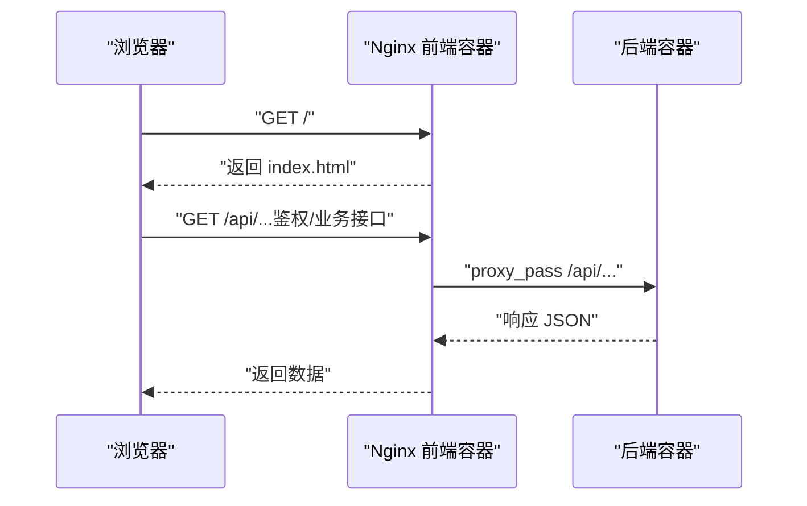
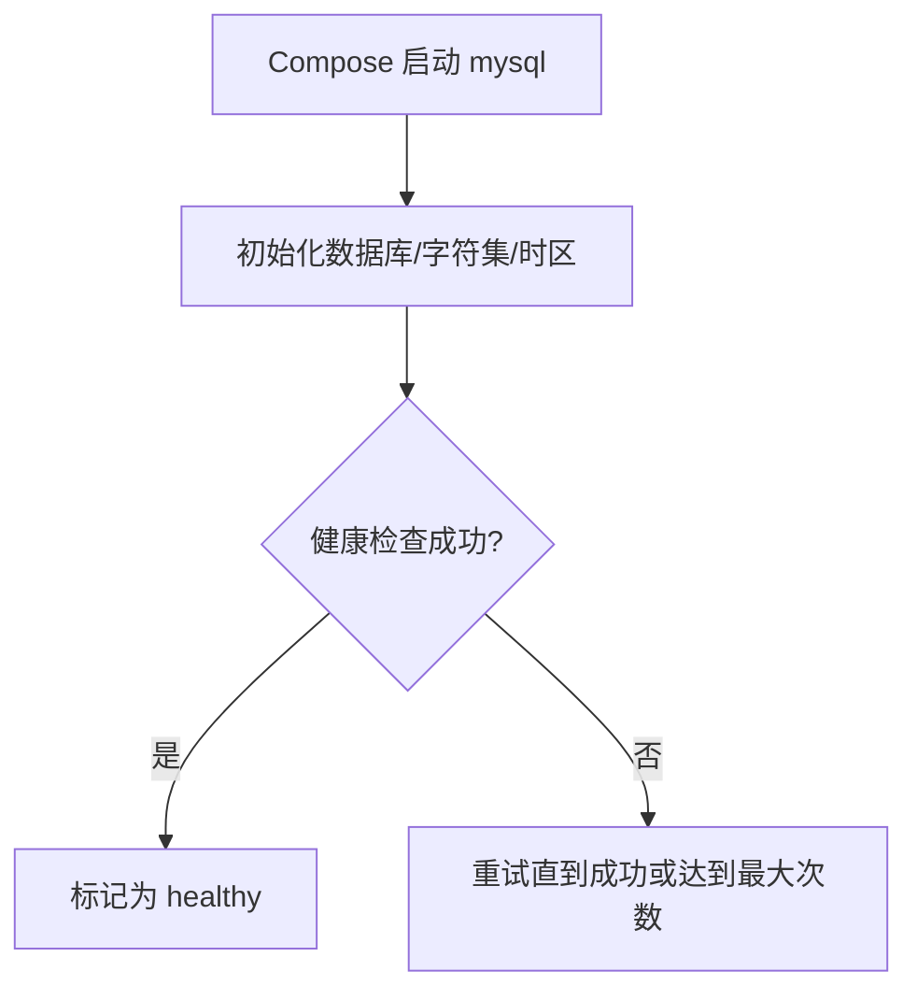
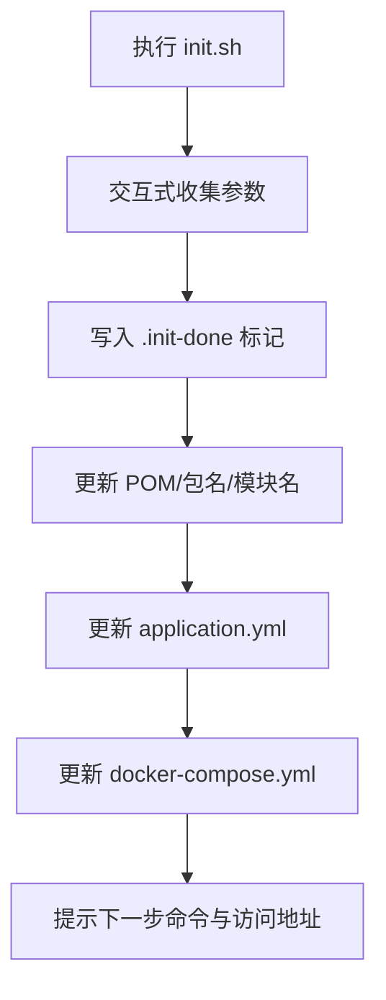
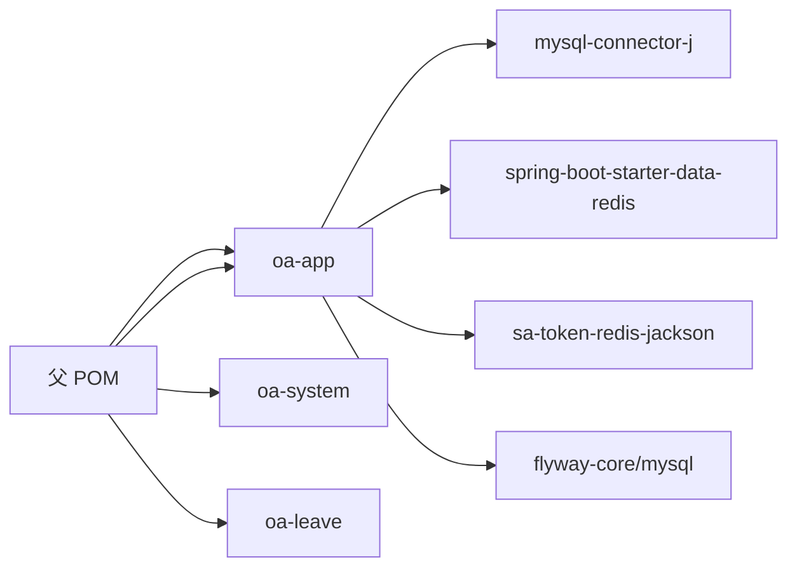

# 部署流程

<cite>
**本文引用的文件**
- [docker-compose.yml](file://docker-compose.yml)
- [Dockerfile（后端）](file://Dockerfile)
- [Dockerfile（前端）](file://oa-ui/Dockerfile)
- [初始化脚本 init.sh](file://init.sh)
- [后端配置 application.yml](file://oa-app/src/main/resources/application.yml)
- [前端 Nginx 配置](file://oa-ui/nginx.conf)
- [父级 POM（Maven）](file://pom.xml)
- [后端模块 POM（oa-app）](file://oa-app/pom.xml)
- [系统模块 POM（oa-system）](file://oa-system/pom.xml)
- [README（快速开始与环境变量说明）](file://README.md)
</cite>

## 目录
1. [简介](#简介)
2. [项目结构](#项目结构)
3. [核心组件](#核心组件)
4. [架构总览](#架构总览)
5. [详细组件分析](#详细组件分析)
6. [依赖关系分析](#依赖关系分析)
7. [性能考量](#性能考量)
8. [故障排查指南](#故障排查指南)
9. [结论](#结论)
10. [附录：CI/CD 与生产最佳实践](#附录cicd-与生产最佳实践)

## 简介
本文件面向 OA 审批管理系统，提供从开发到生产的标准化部署流程，涵盖 Docker 容器化、Compose 服务编排、环境变量配置、生产环境最佳实践（负载均衡、健康检查、日志与监控、告警）、回滚与故障恢复，以及 CI/CD 自动化部署建议。读者无需深入源码即可按步骤完成部署。

## 项目结构
该工程采用多模块 Maven 结构，包含系统管理、审批流程、公共模块、启动模块与前端 UI。后端使用 Spring Boot，前端基于 Vue 3 + Vite，数据库与缓存分别由 MySQL 与 Redis 提供，使用 Docker Compose 将四类服务统一编排。

图表来源
- [docker-compose.yml:1-66](file://docker-compose.yml#L1-L66)
- [Dockerfile（后端）:1-22](file://Dockerfile#L1-L22)
- [Dockerfile（前端）:1-15](file://oa-ui/Dockerfile#L1-L15)
- [后端配置 application.yml:1-59](file://oa-app/src/main/resources/application.yml#L1-L59)
- [前端 Nginx 配置:1-18](file://oa-ui/nginx.conf#L1-L18)

章节来源
- [README（快速开始与环境变量说明）:1-226](file://README.md#L1-L226)
- [docker-compose.yml:1-66](file://docker-compose.yml#L1-L66)
- [Dockerfile（后端）:1-22](file://Dockerfile#L1-L22)
- [Dockerfile（前端）:1-15](file://oa-ui/Dockerfile#L1-L15)
- [后端配置 application.yml:1-59](file://oa-app/src/main/resources/application.yml#L1-L59)
- [前端 Nginx 配置:1-18](file://oa-ui/nginx.conf#L1-L18)

## 核心组件
- MySQL 数据库：提供持久化存储，含健康检查与数据卷挂载，避免重启丢失数据。
- Redis 缓存：为会话与缓存提供支撑，独立容器与数据卷。
- 后端应用：Spring Boot 多模块打包产物，暴露 8080 端口，读取环境变量进行数据库与缓存连接。
- 前端应用：基于 Nginx 的静态站点，反向代理 /api/ 到后端，提供 SPA 路由支持。

章节来源
- [docker-compose.yml:1-66](file://docker-compose.yml#L1-L66)
- [Dockerfile（后端）:1-22](file://Dockerfile#L1-L22)
- [Dockerfile（前端）:1-15](file://oa-ui/Dockerfile#L1-L15)
- [后端配置 application.yml:1-59](file://oa-app/src/main/resources/application.yml#L1-L59)
- [前端 Nginx 配置:1-18](file://oa-ui/nginx.conf#L1-L18)

## 架构总览
下图展示容器间依赖与网络拓扑：前端依赖后端；后端依赖数据库与缓存；数据库与缓存各自独立运行并持久化数据。

图表来源
- [docker-compose.yml:1-66](file://docker-compose.yml#L1-L66)
- [前端 Nginx 配置:11-16](file://oa-ui/nginx.conf#L11-L16)

章节来源
- [docker-compose.yml:1-66](file://docker-compose.yml#L1-L66)

## 详细组件分析

### 后端应用（Spring Boot）
- 构建方式：多阶段 Dockerfile，先在 Maven 基础镜像中构建，再复制到最小化 JRE 运行时。
- 端口：容器内 8080，宿主机映射由 Compose 控制。
- 数据库连接：通过环境变量注入 JDBC URL、用户名、密码；默认指向 Compose 内部网络中的 mysql 服务。
- 缓存连接：通过环境变量注入 Redis 主机与端口，默认指向 redis 服务。
- 连接池：HikariCP 参数可由环境变量覆盖，便于在不同环境调优。
- Flyway：自动执行数据库迁移脚本，位于 classpath:db/migration。
- Sa-Token：会话与权限控制配置。
- Flowable：审批引擎配置。

图表来源
- [后端配置 application.yml:1-59](file://oa-app/src/main/resources/application.yml#L1-L59)
- [Dockerfile（后端）:1-22](file://Dockerfile#L1-L22)

章节来源
- [Dockerfile（后端）:1-22](file://Dockerfile#L1-L22)
- [后端配置 application.yml:1-59](file://oa-app/src/main/resources/application.yml#L1-L59)

### 前端应用（Nginx + Vue）
- 构建方式：Node 基础镜像构建产物，Nginx 镜像运行静态站点。
- 反向代理：将 /api/ 请求转发至后端容器的 8080 端口。
- SPA 路由：Nginx 配置 try_files，确保刷新页面与直接访问路由可用。
- 端口：容器内 80，宿主机映射由 Compose 控制。

图表来源
- [Dockerfile（前端）:1-15](file://oa-ui/Dockerfile#L1-L15)
- [前端 Nginx 配置:1-18](file://oa-ui/nginx.conf#L1-L18)

章节来源
- [Dockerfile（前端）:1-15](file://oa-ui/Dockerfile#L1-L15)
- [前端 Nginx 配置:1-18](file://oa-ui/nginx.conf#L1-L18)

### 数据库（MySQL）
- 镜像：MySQL 8.0，字符集与时区设置。
- 健康检查：使用 mysqladmin ping，失败重试若干次。
- 端口映射：默认宿主机 13306:3306，便于本地调试。
- 卷：持久化 /var/lib/mysql。

图表来源
- [docker-compose.yml:2-20](file://docker-compose.yml#L2-L20)

章节来源
- [docker-compose.yml:2-20](file://docker-compose.yml#L2-L20)

### 缓存（Redis）
- 镜像：Redis 7-alpine。
- 端口映射：默认宿主机 16379:6379。
- 卷：持久化 /data。

章节来源
- [docker-compose.yml:22-29](file://docker-compose.yml#L22-L29)

### 初始化与环境定制（init.sh）
- 交互式输入：包名、模块名、前后端端口、数据库名与密码、MySQL/Redis 端口。
- 自动替换：Java 包结构、POM 模块名、application.yml、docker-compose.yml、前端 package 名称等。
- 标记文件：.init-done，实现幂等性，支持 --force 重新初始化。
- 启动指引：输出下一步 docker compose up -d 与访问地址。

图表来源
- [初始化脚本 init.sh:1-238](file://init.sh#L1-L238)

章节来源
- [初始化脚本 init.sh:1-238](file://init.sh#L1-L238)
- [README（快速开始与环境变量说明）:1-226](file://README.md#L1-L226)

## 依赖关系分析
- 后端依赖：MySQL Connector、Spring Boot Starter Data Redis、Sa-Token、Flyway、MyBatis-Plus 等。
- 父 POM 锁定版本，子模块按需引入。
- 前端依赖：Vue 3、Element Plus、Axios、Pinia、Vue Router 等。

图表来源
- [父级 POM（Maven）:1-131](file://pom.xml#L1-L131)
- [后端模块 POM（oa-app）:1-76](file://oa-app/pom.xml#L1-L76)
- [系统模块 POM（oa-system）:1-39](file://oa-system/pom.xml#L1-L39)

章节来源
- [父级 POM（Maven）:1-131](file://pom.xml#L1-L131)
- [后端模块 POM（oa-app）:1-76](file://oa-app/pom.xml#L1-L76)
- [系统模块 POM（oa-system）:1-39](file://oa-system/pom.xml#L1-L39)

## 性能考量
- 连接池参数：可通过环境变量覆盖 HikariCP 最大池大小、空闲超时、最大生存时间等，以适配生产并发。
- 缓存策略：结合 Redis 缓存热点数据与会话，降低数据库压力。
- 前端静态资源：Nginx 提供 gzip/缓存友好配置，减少带宽与延迟。
- 数据库索引：Flyway 脚本中已包含复合索引示例，建议根据查询模式持续优化。

章节来源
- [后端配置 application.yml:10-24](file://oa-app/src/main/resources/application.yml#L10-L24)
- [后端模块 POM（oa-app）:1-76](file://oa-app/pom.xml#L1-L76)

## 故障排查指南
- 健康检查失败（MySQL）：确认根密码、字符集与时区配置；查看容器日志与重试间隔。
- 后端无法连接数据库：核对 SPRING_DATASOURCE_URL、用户名、密码；确保容器网络可达。
- Redis 连接异常：核对 SPRING_DATA_REDIS_HOST/PORT；确认容器已启动。
- 前端 404 或路由异常：检查 Nginx try_files 与 /api/ 代理配置。
- 初次启动无数据：等待 Flyway 迁移完成；可在后端日志中观察迁移状态。

章节来源
- [docker-compose.yml:16-20](file://docker-compose.yml#L16-L20)
- [后端配置 application.yml:4-8](file://oa-app/src/main/resources/application.yml#L4-L8)
- [前端 Nginx 配置:7-16](file://oa-ui/nginx.conf#L7-L16)

## 结论
本部署方案以 Docker Compose 为核心，将后端、前端、数据库与缓存统一编排，配合 init.sh 实现快速定制与初始化。通过环境变量与配置文件解耦部署细节，满足从开发到生产的多环境需求。建议在生产环境中补充负载均衡、健康检查、日志与监控、告警与回滚策略，并结合 CI/CD 流水线实现自动化交付。

## 附录：CI/CD 与生产最佳实践

### 环境变量与配置管理
- 数据库连接：使用 SPRING_DATASOURCE_URL、USERNAME、PASSWORD。
- 缓存连接：SPRING_DATA_REDIS_HOST、SPRING_DATA_REDIS_PORT。
- 连接池参数：HIKARI_* 系列环境变量用于调优。
- 时区与语言：TZ、MYSQL_CHARSET 等。

章节来源
- [README（环境变量说明）:118-129](file://README.md#L118-L129)
- [后端配置 application.yml:4-18](file://oa-app/src/main/resources/application.yml#L4-L18)

### 生产环境部署最佳实践
- 负载均衡：使用 Nginx 或 Ingress 对前端与后端进行 4 层/7 层负载均衡。
- 健康检查：利用 Compose 健康检查与容器编排平台的探针，确保服务可用。
- 日志收集：集中化日志（如 ELK/Fluentd），采集后端与 Nginx 日志。
- 监控与告警：Prometheus + Grafana 监控关键指标（CPU、内存、连接数、QPS、错误率）。
- 安全加固：限制容器权限、只读根文件系统、最小化镜像、密钥管理（Secrets）。
- 备份与恢复：定期备份 mysql_data 与 redis_data 卷，验证恢复流程。

### 回滚与故障恢复
- 回滚策略：镜像版本化管理，变更前保留上一版本镜像标签；Compose 滚动更新时设置最大不可用与并发数。
- 故障恢复：数据库与缓存使用持久卷；健康检查失败自动重启；必要时回滚到稳定版本。
- 快速止损：熔断与降级策略，限制慢请求与级联故障。

### CI/CD 流水线建议
- 触发条件：push 到主分支或打 Tag。
- 步骤建议：
  - 代码检出与 Lint
  - 构建后端镜像（多阶段 Dockerfile）
  - 构建前端镜像（Nginx 镜像）
  - 单元测试与集成测试
  - 镜像推送至私有仓库
  - 发布到预生产环境（可选）
  - 发布到生产环境（滚动更新/蓝绿发布）
  - 健康检查与告警通知
- 配置管理：使用环境变量文件与密钥管理工具，避免硬编码敏感信息。