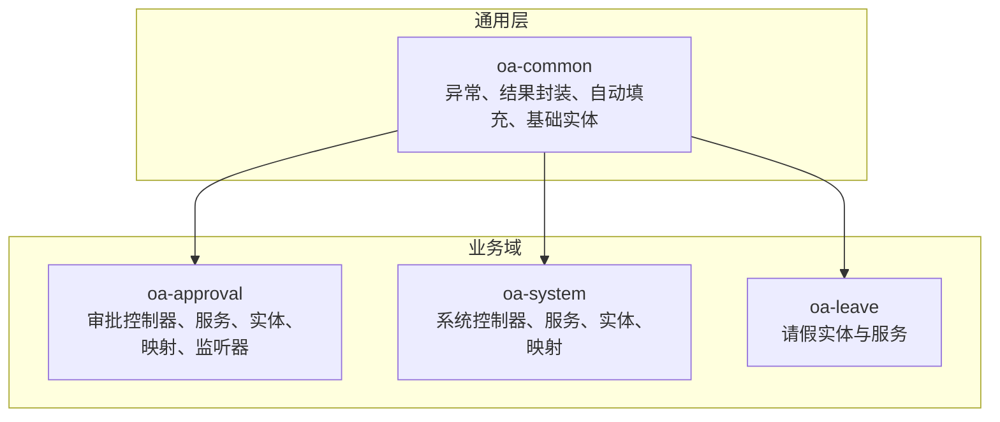
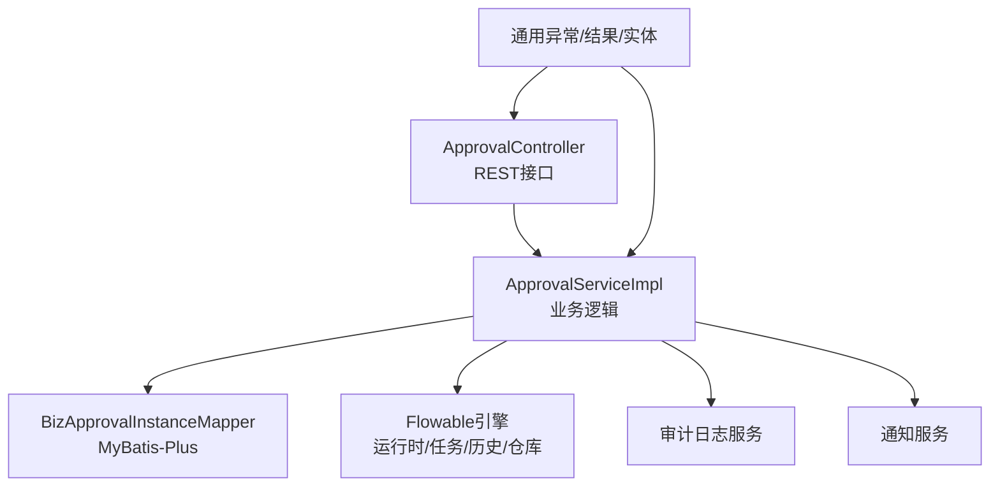
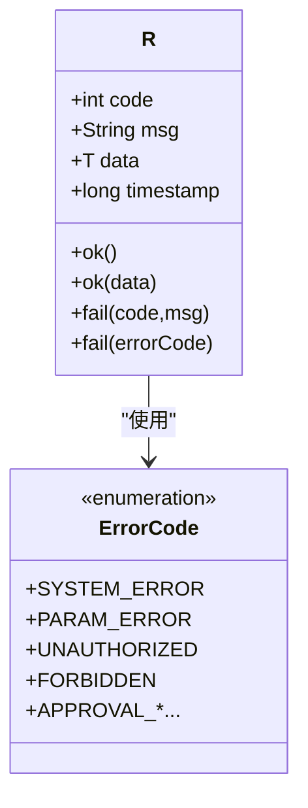
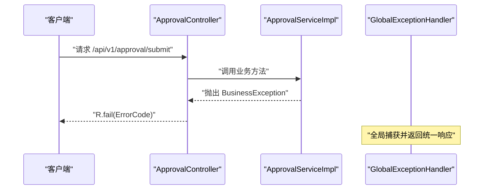
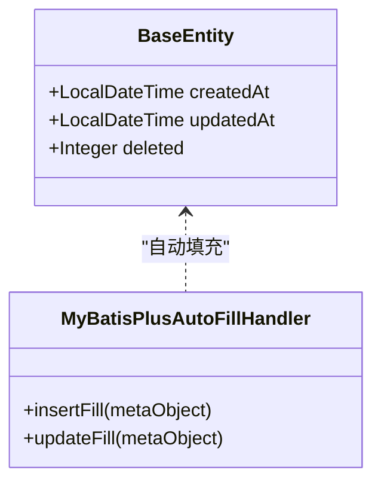
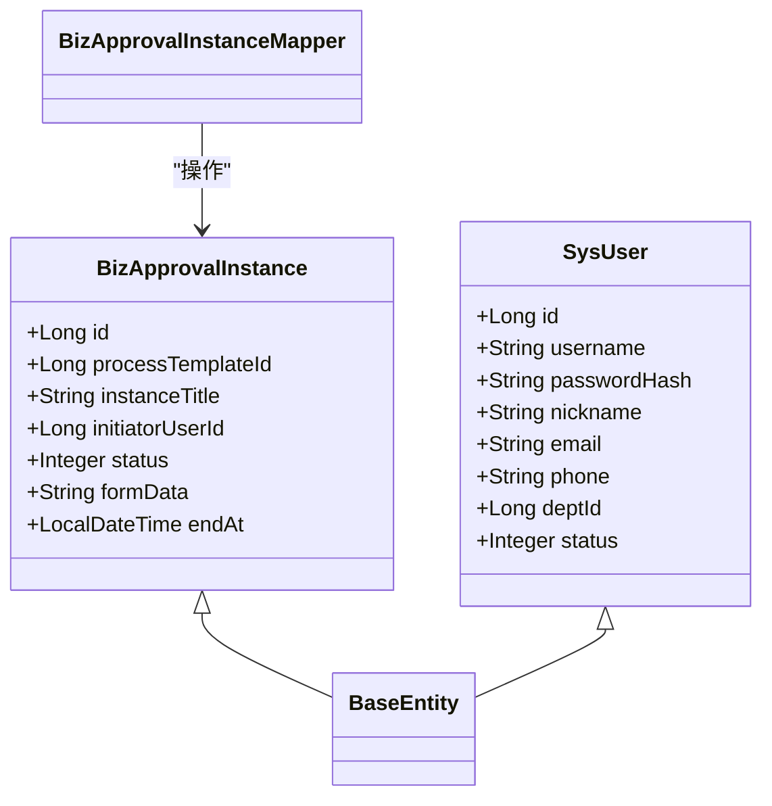
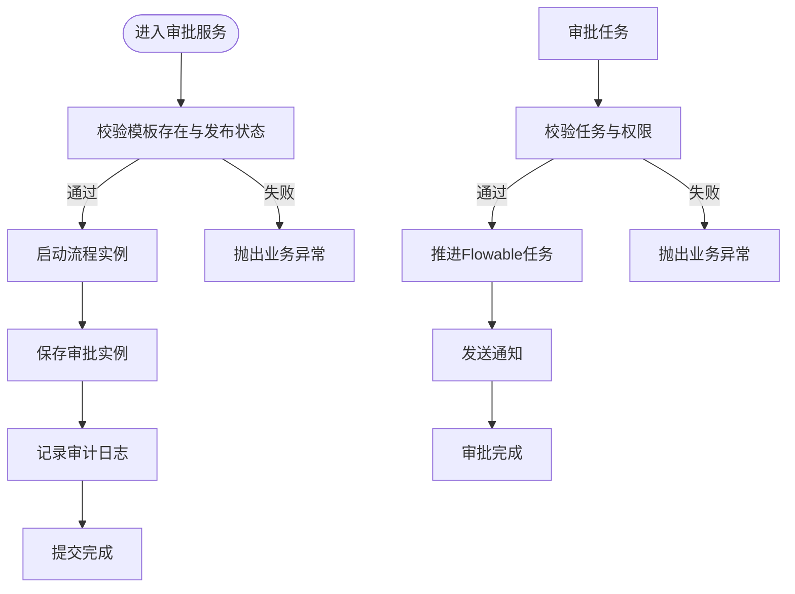
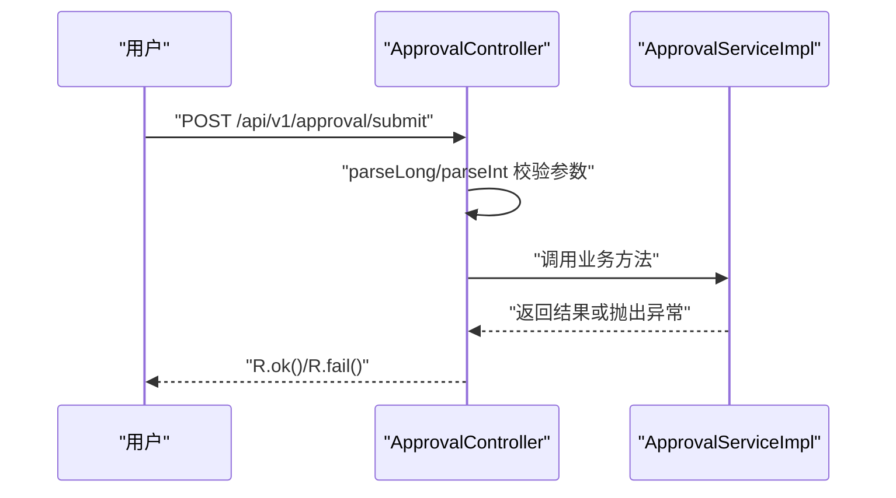
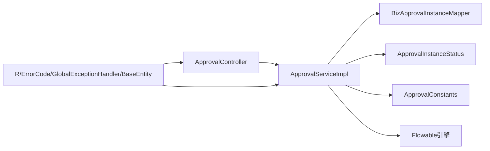

# Java编码规范

<cite>
**本文引用的文件**
- [BusinessException.java](file://oa-common/src/main/java/com/oa/admin/common/exception/BusinessException.java)
- [GlobalExceptionHandler.java](file://oa-common/src/main/java/com/oa/admin/common/exception/GlobalExceptionHandler.java)
- [R.java](file://oa-common/src/main/java/com/oa/admin/common/result/R.java)
- [ErrorCode.java](file://oa-common/src/main/java/com/oa/admin/common/result/ErrorCode.java)
- [BaseEntity.java](file://oa-common/src/main/java/com/oa/admin/common/entity/BaseEntity.java)
- [MyBatisPlusAutoFillHandler.java](file://oa-common/src/main/java/com/oa/admin/common/config/MyBatisPlusAutoFillHandler.java)
- [BizApprovalInstance.java](file://oa-approval/src/main/java/com/oa/admin/approval/entity/BizApprovalInstance.java)
- [BizApprovalInstanceMapper.java](file://oa-approval/src/main/java/com/oa/admin/approval/mapper/BizApprovalInstanceMapper.java)
- [ApprovalServiceImpl.java](file://oa-approval/src/main/java/com/oa/admin/approval/service/impl/ApprovalServiceImpl.java)
- [ApprovalController.java](file://oa-approval/src/main/java/com/oa/admin/approval/controller/ApprovalController.java)
- [ApprovalInstanceStatus.java](file://oa-approval/src/main/java/com/oa/admin/approval/enums/ApprovalInstanceStatus.java)
- [ApprovalConstants.java](file://oa-approval/src/main/java/com/oa/admin/approval/constant/ApprovalConstants.java)
- [SysUser.java](file://oa-system/src/main/java/com/oa/admin/system/entity/SysUser.java)
- [SysUserMapper.java](file://oa-system/src/main/java/com/oa/admin/system/mapper/SysUserMapper.java)
- [LeaveRequest.java](file://oa-leave/src/main/java/com/oa/admin/leave/entity/LeaveRequest.java)
</cite>

## 目录
1. [引言](#引言)
2. [项目结构](#项目结构)
3. [核心组件](#核心组件)
4. [架构总览](#架构总览)
5. [详细组件分析](#详细组件分析)
6. [依赖关系分析](#依赖关系分析)
7. [性能与可维护性建议](#性能与可维护性建议)
8. [故障排查指南](#故障排查指南)
9. [结论](#结论)
10. [附录：命名与注释规范](#附录命名与注释规范)

## 引言
本规范面向OA审批管理系统后端Java代码，基于现有代码库提炼统一的命名、注释、异常与日志、MyBatis-Plus注解使用及代码格式化建议，帮助团队在保持一致性的同时提升可读性与可维护性。

## 项目结构
系统采用多模块划分，审批域、系统域、通用域、生成器等模块职责清晰，便于扩展与维护。

[本图为概念性结构示意，不直接对应具体源码文件，故不提供图表来源]

## 核心组件
- 统一响应体与错误码：通过统一响应体与错误码枚举，保证前后端交互的一致性与可读性。
- 全局异常处理：集中处理认证、授权、参数校验与业务异常，确保错误信息标准化输出。
- 基础实体与自动填充：统一记录创建/更新时间与逻辑删除字段，减少重复代码。
- 审批服务实现：包含提交、审批、转办、撤回、终止等核心流程，体现异常与日志使用范式。

章节来源
- [R.java:1-44](file://oa-common/src/main/java/com/oa/admin/common/result/R.java#L1-L44)
- [ErrorCode.java:1-45](file://oa-common/src/main/java/com/oa/admin/common/result/ErrorCode.java#L1-L45)
- [GlobalExceptionHandler.java:1-74](file://oa-common/src/main/java/com/oa/admin/common/exception/GlobalExceptionHandler.java#L1-L74)
- [BaseEntity.java:1-26](file://oa-common/src/main/java/com/oa/admin/common/entity/BaseEntity.java#L1-L26)
- [MyBatisPlusAutoFillHandler.java:1-25](file://oa-common/src/main/java/com/oa/admin/common/config/MyBatisPlusAutoFillHandler.java#L1-L25)
- [ApprovalServiceImpl.java:1-792](file://oa-approval/src/main/java/com/oa/admin/approval/service/impl/ApprovalServiceImpl.java#L1-L792)

## 架构总览
整体采用“控制器-服务-数据访问”分层，结合Flowable工作流引擎与MyBatis-Plus进行持久化。

图表来源
- [ApprovalController.java:1-252](file://oa-approval/src/main/java/com/oa/admin/approval/controller/ApprovalController.java#L1-L252)
- [ApprovalServiceImpl.java:1-792](file://oa-approval/src/main/java/com/oa/admin/approval/service/impl/ApprovalServiceImpl.java#L1-L792)
- [BizApprovalInstanceMapper.java:1-13](file://oa-approval/src/main/java/com/oa/admin/approval/mapper/BizApprovalInstanceMapper.java#L1-L13)

## 详细组件分析

### 统一响应与错误码
- 统一响应体R提供成功与失败两类静态构造方法，失败时支持传入错误码或自定义code/msg。
- 错误码ErrorCode按模块划分（系统、认证、审批），便于前端识别与国际化。

图表来源
- [R.java:1-44](file://oa-common/src/main/java/com/oa/admin/common/result/R.java#L1-L44)
- [ErrorCode.java:1-45](file://oa-common/src/main/java/com/oa/admin/common/result/ErrorCode.java#L1-L45)

章节来源
- [R.java:1-44](file://oa-common/src/main/java/com/oa/admin/common/result/R.java#L1-L44)
- [ErrorCode.java:1-45](file://oa-common/src/main/java/com/oa/admin/common/result/ErrorCode.java#L1-L45)

### 全局异常处理
- 集中处理未登录、权限不足、参数校验失败、业务异常与未知异常，返回统一响应体。
- 对未捕获异常记录错误日志并返回系统错误。

图表来源
- [ApprovalController.java:1-252](file://oa-approval/src/main/java/com/oa/admin/approval/controller/ApprovalController.java#L1-L252)
- [ApprovalServiceImpl.java:1-792](file://oa-approval/src/main/java/com/oa/admin/approval/service/impl/ApprovalServiceImpl.java#L1-L792)
- [GlobalExceptionHandler.java:1-74](file://oa-common/src/main/java/com/oa/admin/common/exception/GlobalExceptionHandler.java#L1-L74)

章节来源
- [GlobalExceptionHandler.java:1-74](file://oa-common/src/main/java/com/oa/admin/common/exception/GlobalExceptionHandler.java#L1-L74)

### 基础实体与自动填充
- BaseEntity统一提供创建/更新时间与逻辑删除字段，并通过@JsonFormat统一序列化格式。
- MyBatisPlusAutoFillHandler在插入/更新时自动填充时间字段，避免重复逻辑。

图表来源
- [BaseEntity.java:1-26](file://oa-common/src/main/java/com/oa/admin/common/entity/BaseEntity.java#L1-L26)
- [MyBatisPlusAutoFillHandler.java:1-25](file://oa-common/src/main/java/com/oa/admin/common/config/MyBatisPlusAutoFillHandler.java#L1-L25)

章节来源
- [BaseEntity.java:1-26](file://oa-common/src/main/java/com/oa/admin/common/entity/BaseEntity.java#L1-L26)
- [MyBatisPlusAutoFillHandler.java:1-25](file://oa-common/src/main/java/com/oa/admin/common/config/MyBatisPlusAutoFillHandler.java#L1-L25)

### 实体与Mapper示例（审批与系统）
- BizApprovalInstance与SysUser均继承BaseEntity，使用@TableId/@TableName标注主键与表名。
- Mapper通过@Mapper声明，继承BaseMapper以获得通用CRUD能力。

图表来源
- [BizApprovalInstance.java:1-33](file://oa-approval/src/main/java/com/oa/admin/approval/entity/BizApprovalInstance.java#L1-L33)
- [SysUser.java:1-27](file://oa-system/src/main/java/com/oa/admin/system/entity/SysUser.java#L1-L27)
- [BizApprovalInstanceMapper.java:1-13](file://oa-approval/src/main/java/com/oa/admin/approval/mapper/BizApprovalInstanceMapper.java#L1-L13)
- [SysUserMapper.java:1-13](file://oa-system/src/main/java/com/oa/admin/system/mapper/SysUserMapper.java#L1-L13)

章节来源
- [BizApprovalInstance.java:1-33](file://oa-approval/src/main/java/com/oa/admin/approval/entity/BizApprovalInstance.java#L1-L33)
- [SysUser.java:1-27](file://oa-system/src/main/java/com/oa/admin/system/entity/SysUser.java#L1-L27)
- [BizApprovalInstanceMapper.java:1-13](file://oa-approval/src/main/java/com/oa/admin/approval/mapper/BizApprovalInstanceMapper.java#L1-L13)
- [SysUserMapper.java:1-13](file://oa-system/src/main/java/com/oa/admin/system/mapper/SysUserMapper.java#L1-L13)

### 审批服务流程（提交/审批/转办/撤回/终止）
- 提交流程：校验模板与状态、解析表单变量、启动流程实例、保存审批实例并记录审计日志。
- 审批流程：校验任务与权限、设置结果与评论、推进Flowable任务、触发抄送与通知。
- 转办/撤回/终止：严格的状态与权限校验，必要时清理或取消相关任务。

图表来源
- [ApprovalServiceImpl.java:120-168](file://oa-approval/src/main/java/com/oa/admin/approval/service/impl/ApprovalServiceImpl.java#L120-L168)
- [ApprovalServiceImpl.java:170-240](file://oa-approval/src/main/java/com/oa/admin/approval/service/impl/ApprovalServiceImpl.java#L170-L240)
- [ApprovalServiceImpl.java:556-602](file://oa-approval/src/main/java/com/oa/admin/approval/service/impl/ApprovalServiceImpl.java#L556-L602)
- [ApprovalServiceImpl.java:264-307](file://oa-approval/src/main/java/com/oa/admin/approval/service/impl/ApprovalServiceImpl.java#L264-L307)
- [ApprovalServiceImpl.java:663-705](file://oa-approval/src/main/java/com/oa/admin/approval/service/impl/ApprovalServiceImpl.java#L663-L705)

章节来源
- [ApprovalServiceImpl.java:120-168](file://oa-approval/src/main/java/com/oa/admin/approval/service/impl/ApprovalServiceImpl.java#L120-L168)
- [ApprovalServiceImpl.java:170-240](file://oa-approval/src/main/java/com/oa/admin/approval/service/impl/ApprovalServiceImpl.java#L170-L240)
- [ApprovalServiceImpl.java:556-602](file://oa-approval/src/main/java/com/oa/admin/approval/service/impl/ApprovalServiceImpl.java#L556-L602)
- [ApprovalServiceImpl.java:264-307](file://oa-approval/src/main/java/com/oa/admin/approval/service/impl/ApprovalServiceImpl.java#L264-L307)
- [ApprovalServiceImpl.java:663-705](file://oa-approval/src/main/java/com/oa/admin/approval/service/impl/ApprovalServiceImpl.java#L663-L705)

### 控制器参数解析与权限控制
- 使用Sa-Token注解进行权限校验。
- 自定义参数解析方法对Long/Int进行安全转换，非法输入统一抛出业务异常。

图表来源
- [ApprovalController.java:37-44](file://oa-approval/src/main/java/com/oa/admin/approval/controller/ApprovalController.java#L37-L44)
- [ApprovalController.java:230-250](file://oa-approval/src/main/java/com/oa/admin/approval/controller/ApprovalController.java#L230-L250)
- [ApprovalServiceImpl.java:120-168](file://oa-approval/src/main/java/com/oa/admin/approval/service/impl/ApprovalServiceImpl.java#L120-L168)

章节来源
- [ApprovalController.java:37-44](file://oa-approval/src/main/java/com/oa/admin/approval/controller/ApprovalController.java#L37-L44)
- [ApprovalController.java:230-250](file://oa-approval/src/main/java/com/oa/admin/approval/controller/ApprovalController.java#L230-L250)

## 依赖关系分析
- 通用异常与结果封装被各模块广泛复用，形成稳定的基础设施层。
- 审批服务依赖Flowable引擎与通知/审计服务，体现横切关注点分离。
- 实体与Mapper遵循MyBatis-Plus约定，降低样板代码。

图表来源
- [ApprovalController.java:1-252](file://oa-approval/src/main/java/com/oa/admin/approval/controller/ApprovalController.java#L1-L252)
- [ApprovalServiceImpl.java:1-792](file://oa-approval/src/main/java/com/oa/admin/approval/service/impl/ApprovalServiceImpl.java#L1-L792)
- [ApprovalInstanceStatus.java:1-29](file://oa-approval/src/main/java/com/oa/admin/approval/enums/ApprovalInstanceStatus.java#L1-L29)
- [ApprovalConstants.java:1-12](file://oa-approval/src/main/java/com/oa/admin/approval/constant/ApprovalConstants.java#L1-L12)
- [R.java:1-44](file://oa-common/src/main/java/com/oa/admin/common/result/R.java#L1-L44)
- [ErrorCode.java:1-45](file://oa-common/src/main/java/com/oa/admin/common/result/ErrorCode.java#L1-L45)
- [GlobalExceptionHandler.java:1-74](file://oa-common/src/main/java/com/oa/admin/common/exception/GlobalExceptionHandler.java#L1-L74)

章节来源
- [ApprovalController.java:1-252](file://oa-approval/src/main/java/com/oa/admin/approval/controller/ApprovalController.java#L1-L252)
- [ApprovalServiceImpl.java:1-792](file://oa-approval/src/main/java/com/oa/admin/approval/service/impl/ApprovalServiceImpl.java#L1-L792)
- [ApprovalInstanceStatus.java:1-29](file://oa-approval/src/main/java/com/oa/admin/approval/enums/ApprovalInstanceStatus.java#L1-L29)
- [ApprovalConstants.java:1-12](file://oa-approval/src/main/java/com/oa/admin/approval/constant/ApprovalConstants.java#L1-L12)
- [R.java:1-44](file://oa-common/src/main/java/com/oa/admin/common/result/R.java#L1-L44)
- [ErrorCode.java:1-45](file://oa-common/src/main/java/com/oa/admin/common/result/ErrorCode.java#L1-L45)
- [GlobalExceptionHandler.java:1-74](file://oa-common/src/main/java/com/oa/admin/common/exception/GlobalExceptionHandler.java#L1-L74)

## 性能与可维护性建议
- 查询优化：优先使用条件构造器与分页对象，避免一次性加载大结果集；对高频查询建立合适索引。
- 日志分级：仅在必要处记录warn/error，避免过多info日志影响性能；对敏感字段脱敏。
- 异常设计：业务异常尽量语义明确且与错误码一一对应，避免使用通用异常掩盖问题。
- 自动填充：统一使用MetaObjectHandler，避免在业务层重复赋值。

[本节为通用建议，不直接分析具体文件，故不提供章节来源]

## 故障排查指南
- 参数校验失败：检查控制器中的参数解析与错误码映射，确认前端传参是否符合预期。
- 业务异常：根据错误码定位到具体业务分支，核对前置校验与状态判断。
- 未捕获异常：查看全局异常处理器日志，确认异常栈与上下文信息。

章节来源
- [GlobalExceptionHandler.java:47-65](file://oa-common/src/main/java/com/oa/admin/common/exception/GlobalExceptionHandler.java#L47-L65)
- [ApprovalController.java:230-250](file://oa-approval/src/main/java/com/oa/admin/approval/controller/ApprovalController.java#L230-L250)

## 结论
本规范总结了系统在命名、注释、异常与日志、MyBatis-Plus注解使用等方面的既有实践，并给出进一步优化建议。建议在后续开发中严格执行，持续完善测试与文档，保障系统稳定性与可演进性。

[本节为总结性内容，不直接分析具体文件，故不提供章节来源]

## 附录：命名与注释规范

### 类命名规范
- 类名使用PascalCase（每个单词首字母大写），如BizApprovalInstance、SysUser。
- 接口名使用I开头+PascalCase，如ISysUserService（建议在需要时引入）。

章节来源
- [BizApprovalInstance.java:1-33](file://oa-approval/src/main/java/com/oa/admin/approval/entity/BizApprovalInstance.java#L1-L33)
- [SysUser.java:1-27](file://oa-system/src/main/java/com/oa/admin/system/entity/SysUser.java#L1-L27)

### 方法命名规范
- 方法名使用camelCase，如submit、approve、myTodo、enrichTasksWithInstance。
- 命名应准确表达意图，避免缩写。

章节来源
- [ApprovalServiceImpl.java:120-168](file://oa-approval/src/main/java/com/oa/admin/approval/service/impl/ApprovalServiceImpl.java#L120-L168)
- [ApprovalServiceImpl.java:242-251](file://oa-approval/src/main/java/com/oa/admin/approval/service/impl/ApprovalServiceImpl.java#L242-L251)
- [ApprovalServiceImpl.java:519-554](file://oa-approval/src/main/java/com/oa/admin/approval/service/impl/ApprovalServiceImpl.java#L519-L554)

### 变量命名规范
- 变量使用camelCase，如instanceId、taskId、userId。
- 局部变量简洁明了，避免无意义的缩写。

章节来源
- [ApprovalServiceImpl.java:120-168](file://oa-approval/src/main/java/com/oa/admin/approval/service/impl/ApprovalServiceImpl.java#L120-L168)
- [ApprovalController.java:37-44](file://oa-approval/src/main/java/com/oa/admin/approval/controller/ApprovalController.java#L37-L44)

### 常量命名规范
- 常量使用UPPER_SNAKE_CASE，如WITHDRAW_REASON。
- 枚举值使用UPPER_SNAKE_CASE，如PENDING、APPROVED。

章节来源
- [ApprovalConstants.java:1-12](file://oa-approval/src/main/java/com/oa/admin/approval/constant/ApprovalConstants.java#L1-L12)
- [ApprovalInstanceStatus.java:11-16](file://oa-approval/src/main/java/com/oa/admin/approval/enums/ApprovalInstanceStatus.java#L11-L16)

### 注释规范
- 类注释：位于类上方，简述类职责与关键行为，如LeaveRequest类注释说明“请假申请”。
- 字段注释：使用单行注释说明字段含义，如“开始时间”、“请假类型”。
- 方法注释：建议说明方法目的、参数、返回值与异常情况（可参考现有注释风格）。

章节来源
- [LeaveRequest.java:11-47](file://oa-leave/src/main/java/com/oa/admin/leave/entity/LeaveRequest.java#L11-L47)

### 异常处理规范
- 自定义异常：使用BusinessException承载业务错误码与消息。
- 抛出与捕获：业务异常统一由全局异常处理器转换为统一响应体，避免在业务层吞掉异常。
- 最佳实践：对非法参数、越权、状态不符等情况抛出明确的业务异常；对外部调用失败记录warn并返回友好提示。

章节来源
- [BusinessException.java:1-23](file://oa-common/src/main/java/com/oa/admin/common/exception/BusinessException.java#L1-L23)
- [GlobalExceptionHandler.java:41-45](file://oa-common/src/main/java/com/oa/admin/common/exception/GlobalExceptionHandler.java#L41-L45)
- [ApprovalController.java:230-250](file://oa-approval/src/main/java/com/oa/admin/approval/controller/ApprovalController.java#L230-L250)

### 日志使用规范
- 日志级别：错误使用error，警告使用warn，一般信息使用info；避免滥用warn。
- 格式统一：统一时间戳、模块、方法、关键参数与结果；避免拼接敏感信息。
- 脱敏策略：对密码、手机号、邮箱等敏感字段在日志中脱敏显示。

章节来源
- [ApprovalServiceImpl.java:144](file://oa-approval/src/main/java/com/oa/admin/approval/service/impl/ApprovalServiceImpl.java#L144)
- [ApprovalServiceImpl.java:211](file://oa-approval/src/main/java/com/oa/admin/approval/service/impl/ApprovalServiceImpl.java#L211)
- [ApprovalServiceImpl.java:389](file://oa-approval/src/main/java/com/oa/admin/approval/service/impl/ApprovalServiceImpl.java#L389)
- [ApprovalServiceImpl.java:615](file://oa-approval/src/main/java/com/oa/admin/approval/service/impl/ApprovalServiceImpl.java#L615)

### MyBatis-Plus注解使用规范
- @TableName：标注实体对应的数据库表名，如biz_approval_instance、sys_user。
- @TableId：标注主键字段及生成策略，如AUTO。
- @TableField：标注非默认字段，如逻辑删除字段deleted、自动填充字段createdAt/updatedAt。
- 公共字段：统一继承BaseEntity，避免重复定义。

章节来源
- [BizApprovalInstance.java:18-32](file://oa-approval/src/main/java/com/oa/admin/approval/entity/BizApprovalInstance.java#L18-L32)
- [SysUser.java:15-25](file://oa-system/src/main/java/com/oa/admin/system/entity/SysUser.java#L15-L25)
- [BaseEntity.java:14-24](file://oa-common/src/main/java/com/oa/admin/common/entity/BaseEntity.java#L14-L24)

### 代码格式化与IDEA设置建议
- 统一使用项目内现有注释风格与命名规范，避免混用不同风格。
- IDEA建议启用：
  - Lombok插件（支持getter/setter/toString等注解）
  - Alibaba Java Coding Guidelines（或Google Java Style）规则集
  - EditorConfig统一缩进与换行
  - Save Actions：在保存时自动格式化与优化导入
- Maven/Gradle构建时可集成checkstyle或spotless插件，保证提交代码质量一致。

[本节为通用建议，不直接分析具体文件，故不提供章节来源]