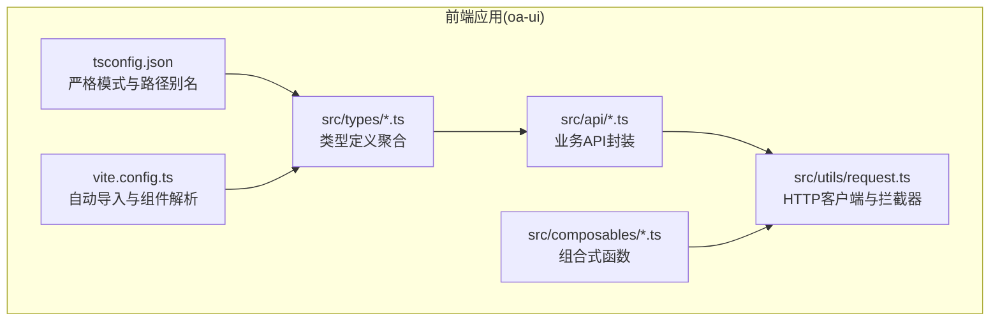
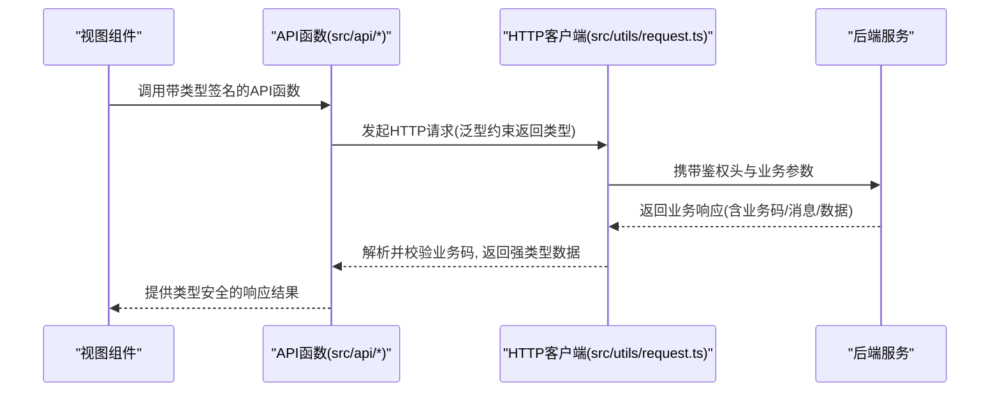
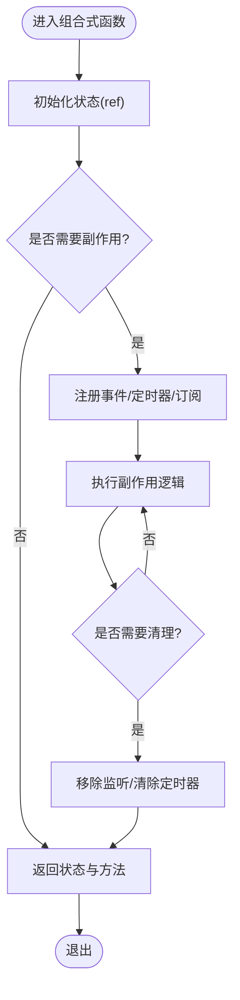
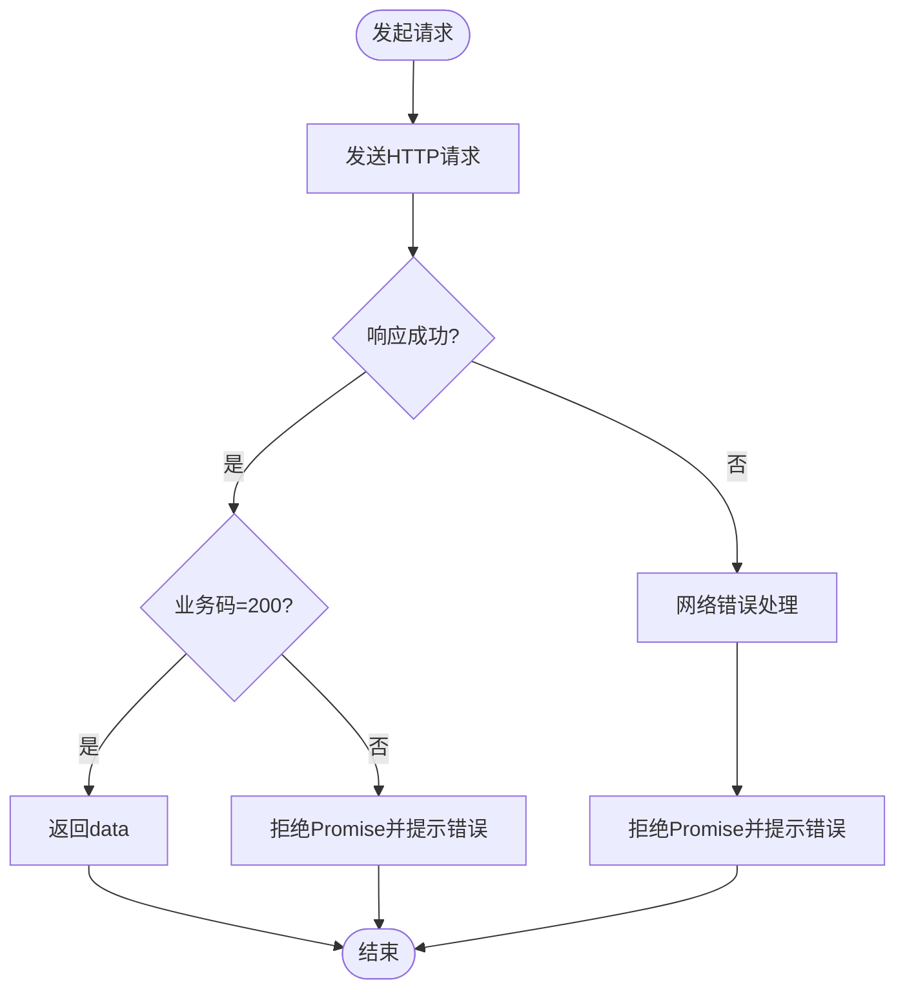
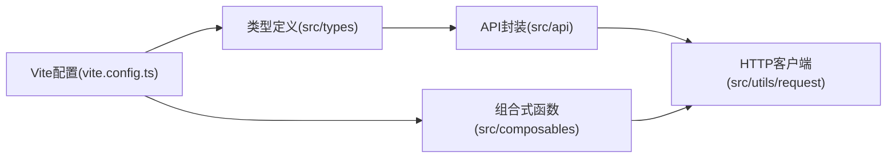

# TypeScript编码规范

<cite>
**本文档引用的文件**
- [tsconfig.json](file://oa-ui/tsconfig.json)
- [tsconfig.node.json](file://oa-ui/tsconfig.node.json)
- [package.json](file://oa-ui/package.json)
- [vite.config.ts](file://oa-ui/vite.config.ts)
- [src/types/index.ts](file://oa-ui/src/types/index.ts)
- [src/types/approval.ts](file://oa-ui/src/types/approval.ts)
- [src/types/api.ts](file://oa-ui/src/types/api.ts)
- [src/types/system.ts](file://oa-ui/src/types/system.ts)
- [src/api/approval.ts](file://oa-ui/src/api/approval.ts)
- [src/api/notification.ts](file://oa-ui/src/api/notification.ts)
- [src/utils/request.ts](file://oa-ui/src/utils/request.ts)
- [src/composables/useNotification.ts](file://oa-ui/src/composables/useNotification.ts)
- [src/composables/bpmn/useBpmnModeler.ts](file://oa-ui/src/composables/bpmn/useBpmnModeler.ts)
- [src/composables/bpmn/bpmn-composables.test.ts](file://oa-ui/src/composables/bpmn/bpmn-composables.test.ts)
- [src/utils/request.test.ts](file://oa-ui/src/utils/request.test.ts)
</cite>

## 目录
1. [简介](#简介)
2. [项目结构](#项目结构)
3. [核心组件](#核心组件)
4. [架构总览](#架构总览)
5. [详细组件分析](#详细组件分析)
6. [依赖关系分析](#依赖关系分析)
7. [性能考虑](#性能考虑)
8. [故障排除指南](#故障排除指南)
9. [结论](#结论)
10. [附录](#附录)

## 简介
本规范面向OA审批管理系统的前端TypeScript开发，围绕接口定义、类型声明、函数组件与组合式函数（Composables）开发、类型安全编程以及TS配置与IDE设置等方面，总结项目中的最佳实践与约定，帮助团队统一风格、提升代码质量与可维护性。

## 项目结构
本项目采用前后端分离架构，前端基于Vue 3 + TypeScript + Vite构建，TypeScript配置采用严格模式，配合自动导入与组件解析插件，形成清晰的类型定义与API封装层。

图表来源
- [tsconfig.json:1-24](file://oa-ui/tsconfig.json#L1-L24)
- [vite.config.ts:1-40](file://oa-ui/vite.config.ts#L1-L40)
- [src/types/index.ts:1-21](file://oa-ui/src/types/index.ts#L1-L21)
- [src/api/approval.ts:1-71](file://oa-ui/src/api/approval.ts#L1-L71)
- [src/utils/request.ts:1-42](file://oa-ui/src/utils/request.ts#L1-L42)
- [src/composables/useNotification.ts:1-31](file://oa-ui/src/composables/useNotification.ts#L1-L31)

章节来源
- [tsconfig.json:1-24](file://oa-ui/tsconfig.json#L1-L24)
- [vite.config.ts:1-40](file://oa-ui/vite.config.ts#L1-L40)
- [src/types/index.ts:1-21](file://oa-ui/src/types/index.ts#L1-L21)

## 核心组件
- 类型系统：通过集中导出的类型模块统一管理审批、系统等领域的数据模型与通用响应结构，便于跨模块复用与约束。
- API封装：以函数形式封装HTTP请求，明确入参与返回类型，结合通用响应包装器实现类型安全的数据流转。
- 组合式函数：使用use前缀命名，封装状态、副作用与业务逻辑，支持在组件中以组合方式复用。
- 工具层：HTTP客户端统一处理鉴权头、业务码校验、错误提示与路由跳转，减少重复代码。

章节来源
- [src/types/approval.ts:1-131](file://oa-ui/src/types/approval.ts#L1-L131)
- [src/types/api.ts:1-14](file://oa-ui/src/types/api.ts#L1-L14)
- [src/types/system.ts:1-57](file://oa-ui/src/types/system.ts#L1-L57)
- [src/api/approval.ts:1-71](file://oa-ui/src/api/approval.ts#L1-L71)
- [src/utils/request.ts:1-42](file://oa-ui/src/utils/request.ts#L1-L42)
- [src/composables/useNotification.ts:1-31](file://oa-ui/src/composables/useNotification.ts#L1-L31)

## 架构总览
下图展示从组件到API再到HTTP客户端的整体调用链路与类型约束关系：

图表来源
- [src/api/approval.ts:1-71](file://oa-ui/src/api/approval.ts#L1-L71)
- [src/utils/request.ts:1-42](file://oa-ui/src/utils/request.ts#L1-L42)

## 详细组件分析

### 接口定义规范
- 命名约定
  - 实体接口使用名词短语，如审批实例、任务、抄送、模板、节点配置等，保持与领域一致。
  - 枚举使用名词+状态或类型后缀，如状态枚举、任务类型枚举等，语义明确。
- 属性定义
  - 必填字段直接声明类型；可选字段使用可选属性标记，避免冗余的null/undefined判断。
  - 对于可能为空的时间戳或数值，使用联合类型表达空值可能性。
- 可选属性处理
  - 在组件渲染或业务逻辑中，优先使用类型守卫或非空断言确保后续访问安全。
  - 对于列表项的可选字段，建议在API层或转换层进行规范化处理，降低下游复杂度。

章节来源
- [src/types/approval.ts:32-131](file://oa-ui/src/types/approval.ts#L32-L131)
- [src/types/system.ts:1-57](file://oa-ui/src/types/system.ts#L1-L57)
- [src/types/api.ts:1-14](file://oa-ui/src/types/api.ts#L1-L14)

### 类型声明规范
- 基本类型
  - 使用number、string、boolean等原生类型，避免使用Object、Any等宽泛类型。
  - 对于时间字段，统一使用字符串格式，必要时在工具层进行解析与格式化。
- 联合类型
  - 对于可能为空的字段，使用联合类型表达可空；对枚举值使用枚举类型而非数字字面量。
- 泛型约束
  - API函数广泛使用泛型约束请求与响应类型，确保编译期类型安全。
- 类型推断
  - 在简单场景下允许编译器推断，但在对外暴露的公共API处显式标注类型，增强可读性与稳定性。

章节来源
- [src/api/approval.ts:4-71](file://oa-ui/src/api/approval.ts#L4-L71)
- [src/types/api.ts:1-14](file://oa-ui/src/types/api.ts#L1-L14)

### 函数组件开发规范
- 函数签名
  - 明确每个参数的类型与是否必填；对可选参数提供合理默认值。
- 参数类型
  - 使用接口或联合类型描述复杂参数对象，避免过长的参数列表。
- 返回值类型
  - 对异步函数明确返回Promise<T>；对无返回值的函数使用void。
- 默认参数
  - 对分页、过滤等常用参数提供默认值，减少调用方负担。

章节来源
- [src/api/approval.ts:24-66](file://oa-ui/src/api/approval.ts#L24-L66)
- [src/api/notification.ts:16-35](file://oa-ui/src/api/notification.ts#L16-L35)

### 组合式函数规范
- 命名约定
  - 统一使用use前缀，如useNotification、useBpmnModeler等，便于识别与自动导入。
- 状态管理
  - 使用ref或reactive管理本地状态，避免在多个组合式函数间共享可变状态。
- 副作用处理
  - 将副作用（如轮询、事件监听）封装在组合式函数内部，并提供启动/停止方法。
- 返回值设计
  - 返回状态与操作方法的聚合对象，便于在组件中解构使用。

图表来源
- [src/composables/useNotification.ts:1-31](file://oa-ui/src/composables/useNotification.ts#L1-L31)
- [src/composables/bpmn/useBpmnModeler.ts:1-98](file://oa-ui/src/composables/bpmn/useBpmnModeler.ts#L1-L98)

章节来源
- [src/composables/useNotification.ts:1-31](file://oa-ui/src/composables/useNotification.ts#L1-L31)
- [src/composables/bpmn/useBpmnModeler.ts:1-98](file://oa-ui/src/composables/bpmn/useBpmnModeler.ts#L1-L98)

### 类型安全编程规范
- 严格模式配置
  - 启用严格模式与未使用局部变量/参数检查，减少潜在问题。
- 类型断言
  - 仅在确定类型安全的前提下使用断言，避免滥用导致运行时风险。
- 类型守卫
  - 对可能为空的值使用类型守卫或条件判断，确保后续访问安全。
- 错误处理
  - 在HTTP客户端中统一处理业务码与网络错误，抛出可理解的错误信息，便于上层捕获与提示。

图表来源
- [src/utils/request.ts:18-42](file://oa-ui/src/utils/request.ts#L18-L42)

章节来源
- [tsconfig.json:13](file://oa-ui/tsconfig.json#L13)
- [src/utils/request.ts:1-42](file://oa-ui/src/utils/request.ts#L1-L42)

### 测试与验证
- 单元测试覆盖
  - 对组合式函数的状态变化、事件触发与清理流程进行充分测试。
  - 对HTTP客户端的拦截器行为、错误分支与路由跳转进行模拟验证。
- 测试策略
  - 使用虚拟时钟与异步断言确保副作用逻辑的正确性。
  - 对API函数的入参与返回类型进行契约测试，保证类型一致性。

章节来源
- [src/composables/bpmn/bpmn-composables.test.ts:1-284](file://oa-ui/src/composables/bpmn/bpmn-composables.test.ts#L1-L284)
- [src/utils/request.test.ts:1-107](file://oa-ui/src/utils/request.test.ts#L1-L107)

## 依赖关系分析
- 类型依赖
  - API模块依赖类型模块提供的接口与泛型，确保请求与响应的类型一致性。
- 运行时依赖
  - 组合式函数依赖HTTP客户端与路由模块，实现状态管理与导航控制。
- 构建依赖
  - Vite配置启用自动导入与组件解析，生成类型声明文件，提升开发体验。

图表来源
- [src/types/index.ts:1-21](file://oa-ui/src/types/index.ts#L1-L21)
- [src/api/approval.ts:1-71](file://oa-ui/src/api/approval.ts#L1-L71)
- [src/utils/request.ts:1-42](file://oa-ui/src/utils/request.ts#L1-L42)
- [vite.config.ts:1-40](file://oa-ui/vite.config.ts#L1-L40)

章节来源
- [src/types/index.ts:1-21](file://oa-ui/src/types/index.ts#L1-L21)
- [vite.config.ts:1-40](file://oa-ui/vite.config.ts#L1-L40)

## 性能考虑
- 类型检查与增量编译
  - 使用严格模式与隔离模块，配合构建工具的增量编译能力，提升开发效率。
- 组件与组合式函数
  - 避免在组合式函数中持有大型不可变对象，减少不必要的响应式开销。
- 请求与缓存
  - 在API层对频繁请求的结果进行缓存或节流，降低网络压力。

## 故障排除指南
- 编译错误
  - 检查严格模式下的未使用变量/参数警告，按需调整类型或删除无用代码。
- 类型不匹配
  - 确认API函数的泛型参数与实际返回类型一致，避免断言滥用。
- 运行时错误
  - 关注HTTP客户端的业务码分支与网络错误处理，确保错误信息可追踪。

章节来源
- [tsconfig.json:13-16](file://oa-ui/tsconfig.json#L13-L16)
- [src/utils/request.ts:18-42](file://oa-ui/src/utils/request.ts#L18-L42)

## 结论
通过统一的类型定义、严格的API签名与组合式函数封装，本项目在前端TypeScript实践中实现了良好的类型安全与可维护性。建议在后续迭代中持续完善类型覆盖率与测试用例，确保变更不会破坏既有契约。

## 附录

### TS配置文件优化建议
- 严格模式
  - 保持严格模式开启，确保类型安全。
- 未使用检查
  - 保留未使用局部变量/参数检查，减少冗余代码。
- 模块解析
  - 使用bundler解析与隔离模块，避免类型污染。
- 路径别名
  - 通过路径映射简化导入路径，提升可读性。

章节来源
- [tsconfig.json:1-24](file://oa-ui/tsconfig.json#L1-L24)
- [tsconfig.node.json:1-19](file://oa-ui/tsconfig.node.json#L1-L19)

### IDE设置指南
- 插件与扩展
  - 安装TypeScript与Vue相关语言插件，启用自动导入与组件解析。
- 自动导入
  - 通过Vite配置生成的类型声明文件，确保智能感知与自动补全。
- ESLint集成
  - 使用ESLint规则与TypeScript检查结合，统一代码风格与类型约束。

章节来源
- [package.json:6-14](file://oa-ui/package.json#L6-L14)
- [vite.config.ts:15-24](file://oa-ui/vite.config.ts#L15-L24)