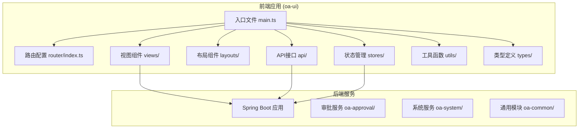
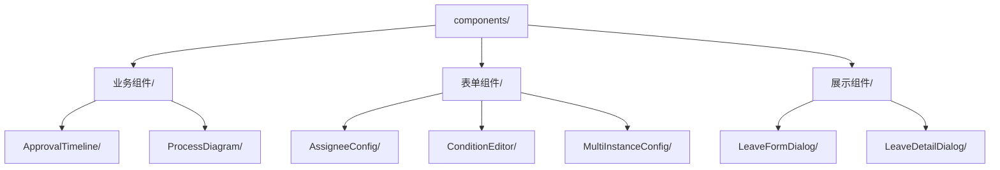
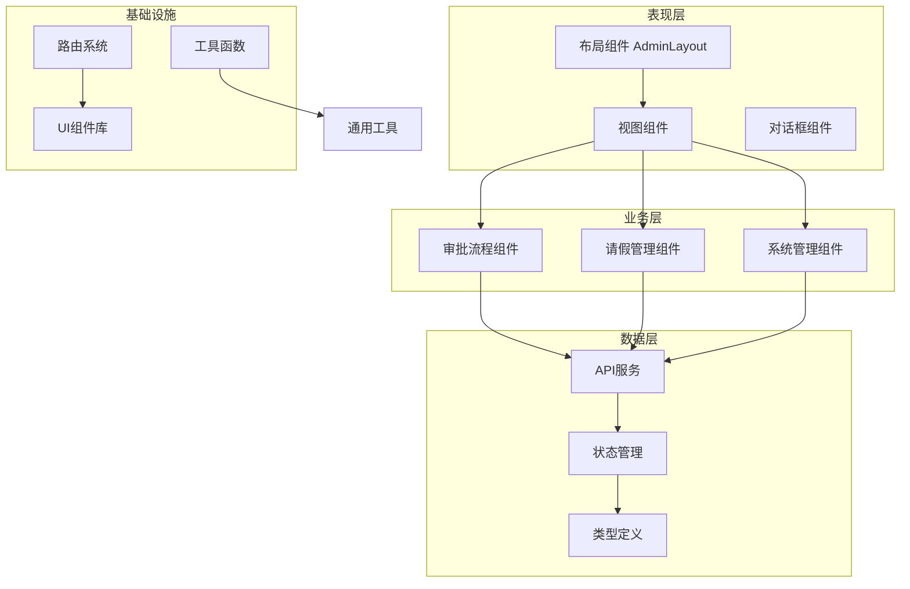
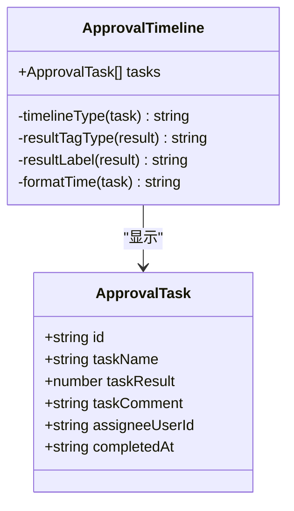
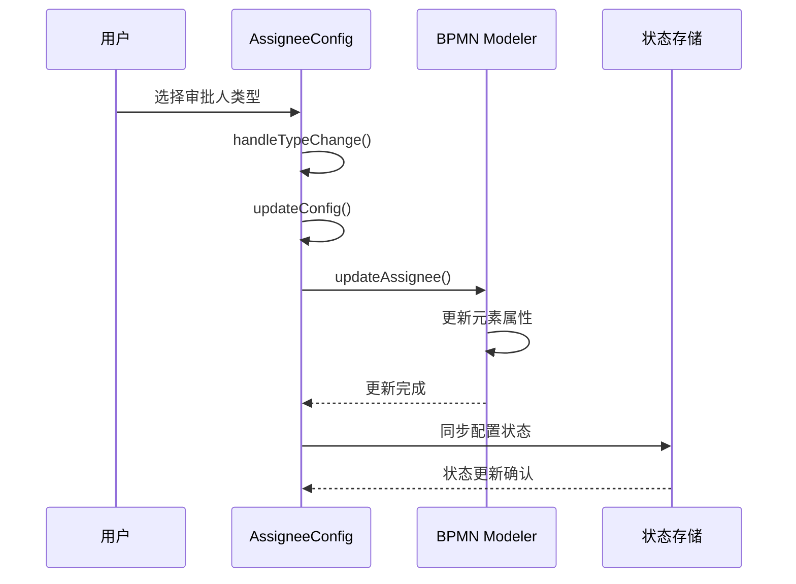
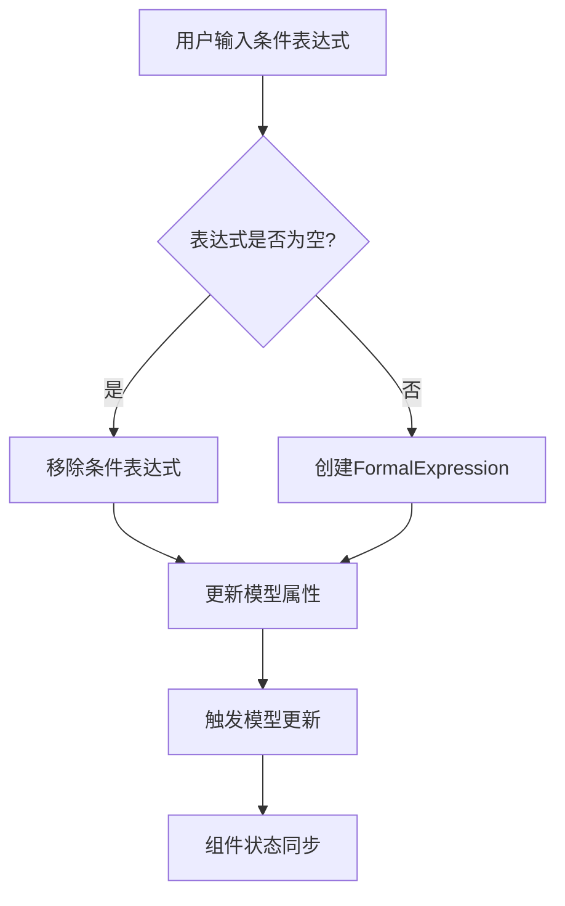
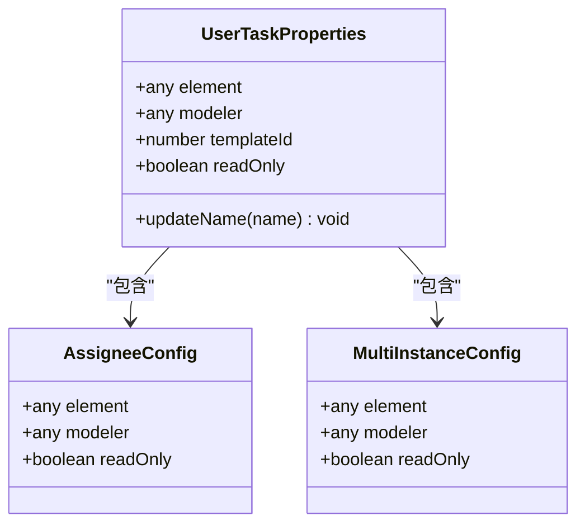
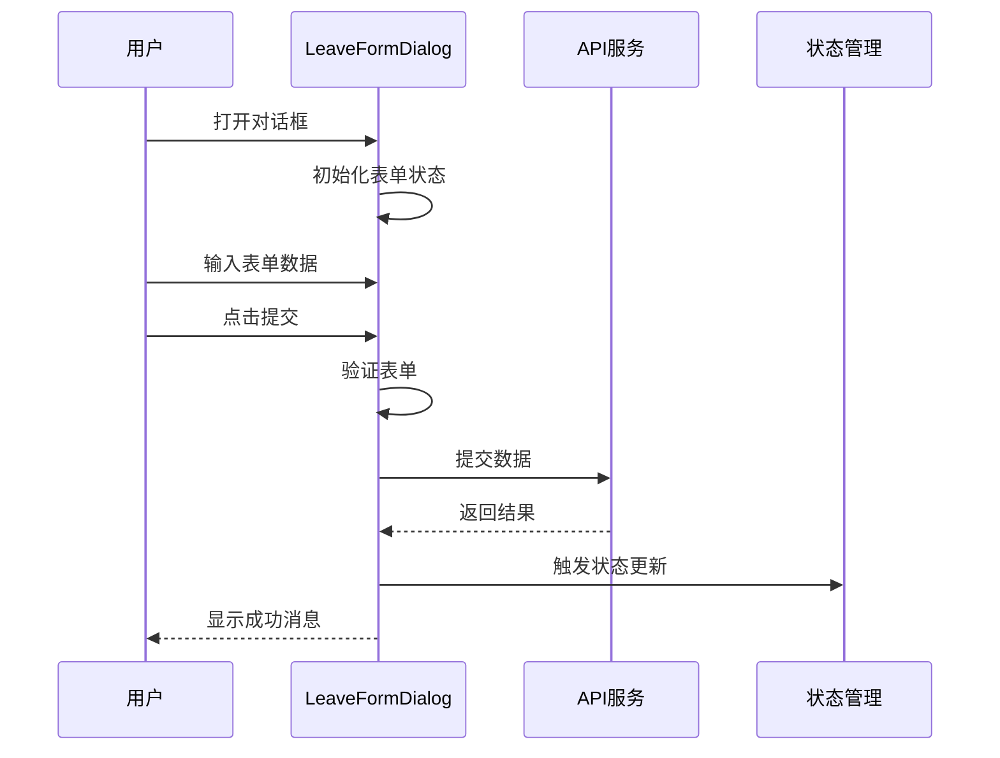
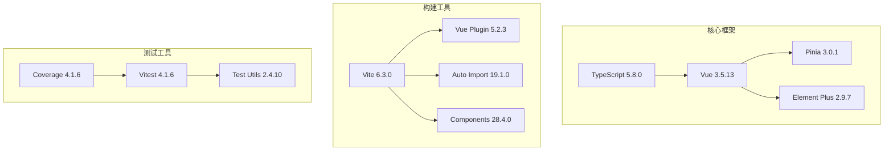
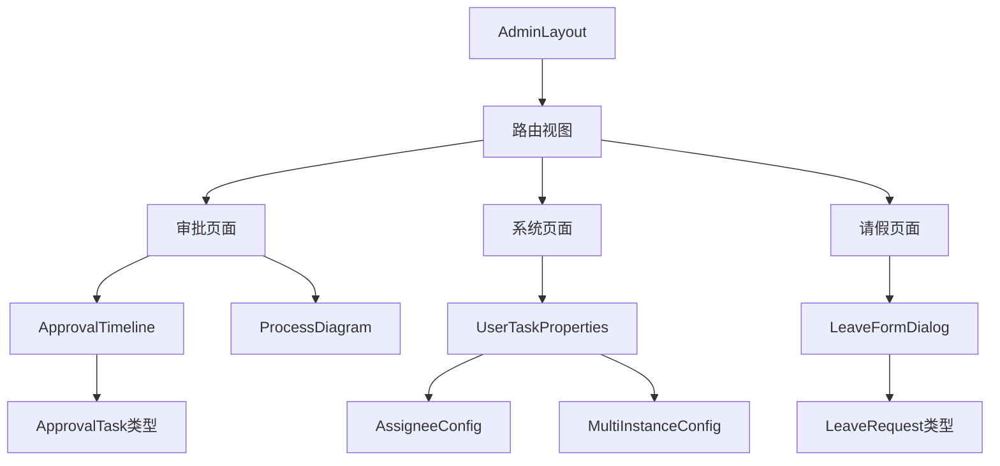

# Vue组件开发规范

<cite>
**本文档引用的文件**
- [package.json](file://oa-ui/package.json)
- [vite.config.ts](file://oa-ui/vite.config.ts)
- [tsconfig.json](file://oa-ui/tsconfig.json)
- [main.ts](file://oa-ui/src/main.ts)
- [router/index.ts](file://oa-ui/src/router/index.ts)
- [stores/user.ts](file://oa-ui/src/stores/user.ts)
- [layouts/AdminLayout.vue](file://oa-ui/src/layouts/AdminLayout.vue)
- [views/approval/instance/components/ApprovalTimeline.vue](file://oa-ui/src/views/approval/instance/components/ApprovalTimeline.vue)
- [views/approval/template/designer/components/panels/AssigneeConfig.vue](file://oa-ui/src/views/approval/template/designer/components/panels/AssigneeConfig.vue)
- [views/approval/template/designer/components/panels/ConditionEditor.vue](file://oa-ui/src/views/approval/template/designer/components/panels/ConditionEditor.vue)
- [views/approval/template/designer/components/panels/UserTaskProperties.vue](file://oa-ui/src/views/approval/template/designer/components/panels/UserTaskProperties.vue)
- [views/leave/components/LeaveFormDialog.vue](file://oa-ui/src/views/leave/components/LeaveFormDialog.vue)
</cite>

## 目录
1. [引言](#引言)
2. [项目结构](#项目结构)
3. [核心组件规范](#核心组件规范)
4. [架构概览](#架构概览)
5. [详细组件分析](#详细组件分析)
6. [依赖关系分析](#依赖关系分析)
7. [性能考虑](#性能考虑)
8. [故障排除指南](#故障排除指南)
9. [结论](#结论)

## 引言

本规范旨在为OA审批管理系统提供一套完整的Vue组件开发标准，涵盖组件命名、属性定义、事件处理、生命周期管理、状态管理、组件通信以及性能优化等方面。该规范基于项目现有的Vue 3 + TypeScript + Pinia + Element Plus技术栈实现，确保代码的一致性、可维护性和可扩展性。

## 项目结构

OA审批管理系统采用前后端分离架构，前端使用Vue 3构建，后端使用Spring Boot。项目结构清晰，模块化程度高，便于组件的组织和管理。



**图表来源**
- [main.ts:1-14](file://oa-ui/src/main.ts#L1-L14)
- [router/index.ts:1-134](file://oa-ui/src/router/index.ts#L1-L134)

**章节来源**
- [package.json:1-38](file://oa-ui/package.json#L1-L38)
- [vite.config.ts:1-40](file://oa-ui/vite.config.ts#L1-L40)
- [tsconfig.json:1-24](file://oa-ui/tsconfig.json#L1-L24)

## 核心组件规范

### 组件命名规范

#### PascalCase 命名
所有Vue组件类名必须使用PascalCase命名法，确保组件名称的统一性和可读性：

- ✅ 正确：`ApprovalTimeline.vue`、`AssigneeConfig.vue`、`UserTaskProperties.vue`
- ❌ 错误：`approval-timeline.vue`、`assignee-config.vue`

#### 文件命名约定
- 组件文件使用PascalCase命名，扩展名为`.vue`
- 模板文件使用PascalCase命名，扩展名为`.vue`
- 视图文件使用PascalCase命名，扩展名为`.vue`

#### 目录结构
组件按照功能域进行组织，形成清晰的层次结构：



**章节来源**
- [views/approval/instance/components/ApprovalTimeline.vue:1-100](file://oa-ui/src/views/approval/instance/components/ApprovalTimeline.vue#L1-L100)
- [views/approval/template/designer/components/panels/AssigneeConfig.vue:1-172](file://oa-ui/src/views/approval/template/designer/components/panels/AssigneeConfig.vue#L1-L172)

### Props定义规范

#### 类型声明
所有props必须明确指定类型，使用TypeScript接口或类型注解：

```typescript
// 正确的类型声明方式
const props = defineProps<{
  element: any
  modeler: any
  readOnly: boolean
}>()

// 使用接口定义复杂类型
interface FormField {
  name: string
  label: string
  type: string
}
```

#### 默认值设置
对于可选的props，应提供合理的默认值：

```typescript
const props = defineProps<{
  visible?: boolean
  leaveData?: LeaveRequest | null
}>()

// 在组件内部使用默认值
const isVisible = props.visible ?? false
```

#### 验证规则
使用`defineProps`的类型系统进行运行时验证：

```typescript
// 复杂类型的验证
const props = defineProps<{
  tasks: ApprovalTask[]
  onTaskComplete?: (taskId: string) => void
}>()
```

#### 事件触发
组件间通信通过props和events实现，遵循单向数据流原则：

**章节来源**
- [views/approval/instance/components/ApprovalTimeline.vue:34-36](file://oa-ui/src/views/approval/instance/components/ApprovalTimeline.vue#L34-L36)
- [views/approval/template/designer/components/panels/AssigneeConfig.vue:74-78](file://oa-ui/src/views/approval/template/designer/components/panels/AssigneeConfig.vue#L74-L78)

### 事件处理规范

#### 事件命名
- 使用`on`前缀表示事件处理器：`onClick`、`onChange`
- 使用`handle`前缀表示用户交互：`handleClick`、`handleChange`
- 使用`update`前缀表示双向绑定：`update:modelValue`

#### 参数传递
事件参数应包含必要的上下文信息：

```typescript
// 正确的事件参数传递
function handleTypeChange(type: string) {
  emit('type-changed', {
    type,
    timestamp: Date.now(),
    element: this.element
  })
}

// 双向绑定的标准写法
function updateConfig(data: Record<string, unknown>) {
  emit('update:modelValue', data)
}
```

#### 事件冒泡控制
在需要阻止事件冒泡时，使用适当的修饰符：

```vue
<el-button @click.stop="handleClick">点击</el-button>
<el-input @focus.native.stop />
```

**章节来源**
- [views/leave/components/LeaveFormDialog.vue:70-73](file://oa-ui/src/views/leave/components/LeaveFormDialog.vue#L70-L73)
- [views/approval/template/designer/components/panels/AssigneeConfig.vue:136-140](file://oa-ui/src/views/approval/template/designer/components/panels/AssigneeConfig.vue#L136-L140)

### 生命周期管理规范

#### 生命周期钩子使用
- 使用`<script setup>`语法糖简化生命周期管理
- 在`setup`中执行初始化逻辑
- 使用`onMounted`处理DOM操作
- 使用`onUnmounted`清理资源

#### 异步操作处理
- 使用`async/await`处理异步操作
- 在组件卸载时取消未完成的请求
- 使用`AbortController`管理请求生命周期

#### 内存泄漏防范
- 清理定时器和事件监听器
- 取消订阅的响应式数据
- 释放大对象的内存

**章节来源**
- [views/approval/template/designer/components/panels/AssigneeConfig.vue:92-134](file://oa-ui/src/views/approval/template/designer/components/panels/AssigneeConfig.vue#L92-L134)
- [views/approval/template/designer/components/panels/ConditionEditor.vue:59-75](file://oa-ui/src/views/approval/template/designer/components/panels/ConditionEditor.vue#L59-L75)

### 组件状态管理规范

#### data定义
使用`ref`和`reactive`管理组件本地状态：

```typescript
const assigneeType = ref('deptLeader')
const configData = ref<Record<string, unknown>>({})
const conditionExpression = ref('')
```

#### computed计算
使用`computed`创建派生状态，避免重复计算：

```typescript
const currentOption = computed(() =>
  ASSIGNEE_TYPE_OPTIONS.find((o) => o.value === assigneeType.value)
)

const uelExpression = computed(() => {
  if (!currentOption.value) return ''
  return currentOption.value.uelTemplate(configData.value)
})
```

#### watch监听
使用`watch`和`watchEffect`响应状态变化：

```typescript
watch(
  () => props.element,
  (el) => {
    // 处理元素变化
  },
  { immediate: true }
)

watchEffect(() => {
  // 响应多个依赖的变化
})
```

**章节来源**
- [views/approval/template/designer/components/panels/AssigneeConfig.vue:80-90](file://oa-ui/src/views/approval/template/designer/components/panels/AssigneeConfig.vue#L80-L90)
- [views/approval/template/designer/components/panels/ConditionEditor.vue:53-57](file://oa-ui/src/views/approval/template/designer/components/panels/ConditionEditor.vue#L53-L57)

## 架构概览

OA审批管理系统的前端架构采用分层设计，确保各层职责清晰，便于维护和扩展。



**图表来源**
- [layouts/AdminLayout.vue:1-130](file://oa-ui/src/layouts/AdminLayout.vue#L1-L130)
- [router/index.ts:1-134](file://oa-ui/src/router/index.ts#L1-L134)

## 详细组件分析

### 审批时间线组件 (ApprovalTimeline)

该组件负责展示审批流程的时间线信息，体现了良好的组件设计原则。



**图表来源**
- [views/approval/instance/components/ApprovalTimeline.vue:34-36](file://oa-ui/src/views/approval/instance/components/ApprovalTimeline.vue#L34-L36)
- [views/approval/instance/components/ApprovalTimeline.vue:31-32](file://oa-ui/src/views/approval/instance/components/ApprovalTimeline.vue#L31-L32)

#### 组件特点
- **单一职责**：专注于审批时间线的展示
- **类型安全**：完整的TypeScript类型定义
- **条件渲染**：根据任务状态动态渲染
- **样式隔离**：使用scoped样式防止样式污染

**章节来源**
- [views/approval/instance/components/ApprovalTimeline.vue:1-100](file://oa-ui/src/views/approval/instance/components/ApprovalTimeline.vue#L1-L100)

### 审批人配置组件 (AssigneeConfig)

该组件实现了复杂的审批人配置功能，展示了高级Vue组件开发技巧。



**图表来源**
- [views/approval/template/designer/components/panels/AssigneeConfig.vue:136-160](file://oa-ui/src/views/approval/template/designer/components/panels/AssigneeConfig.vue#L136-L160)

#### 核心功能
- **动态配置**：支持多种审批人类型配置
- **实时预览**：自动计算并显示生成的表达式
- **双向绑定**：与BPMN模型器实时同步
- **类型推断**：从现有配置自动推断类型

**章节来源**
- [views/approval/template/designer/components/panels/AssigneeConfig.vue:1-172](file://oa-ui/src/views/approval/template/designer/components/panels/AssigneeConfig.vue#L1-L172)

### 条件编辑器组件 (ConditionEditor)

该组件提供了流程条件表达式的编辑功能，是流程设计器的重要组成部分。



**图表来源**
- [views/approval/template/designer/components/panels/ConditionEditor.vue:77-107](file://oa-ui/src/views/approval/template/designer/components/panels/ConditionEditor.vue#L77-L107)

#### 实现要点
- **表达式解析**：支持UEL表达式语法
- **字段插入**：提供表单字段快速插入功能
- **实时验证**：即时显示表达式有效性
- **错误处理**：优雅处理解析错误

**章节来源**
- [views/approval/template/designer/components/panels/ConditionEditor.vue:1-143](file://oa-ui/src/views/approval/template/designer/components/panels/ConditionEditor.vue#L1-L143)

### 用户任务属性面板 (UserTaskProperties)

该组件作为复合组件，整合了多个配置面板的功能。



**图表来源**
- [views/approval/template/designer/components/panels/UserTaskProperties.vue:33-42](file://oa-ui/src/views/approval/template/designer/components/panels/UserTaskProperties.vue#L33-L42)

#### 设计模式
- **组合模式**：通过组合多个子组件实现复杂功能
- **属性透传**：将父组件属性传递给子组件
- **事件冒泡**：合理处理子组件事件
- **样式继承**：保持一致的视觉风格

**章节来源**
- [views/approval/template/designer/components/panels/UserTaskProperties.vue:1-50](file://oa-ui/src/views/approval/template/designer/components/panels/UserTaskProperties.vue#L1-L50)

### 请假表单对话框 (LeaveFormDialog)

该组件展示了完整的表单处理流程，包括验证、提交和状态管理。



**图表来源**
- [views/leave/components/LeaveFormDialog.vue:138-158](file://oa-ui/src/views/leave/components/LeaveFormDialog.vue#L138-L158)

#### 表单处理最佳实践
- **完整验证**：使用Element Plus表单验证
- **状态管理**：合理使用响应式数据
- **错误处理**：统一的错误处理机制
- **用户体验**：友好的用户反馈

**章节来源**
- [views/leave/components/LeaveFormDialog.vue:1-160](file://oa-ui/src/views/leave/components/LeaveFormDialog.vue#L1-L160)

## 依赖关系分析

### 技术栈依赖



**图表来源**
- [package.json:15-36](file://oa-ui/package.json#L15-L36)

### 组件依赖关系



**图表来源**
- [layouts/AdminLayout.vue:1-130](file://oa-ui/src/layouts/AdminLayout.vue#L1-L130)
- [views/approval/instance/components/ApprovalTimeline.vue:31-32](file://oa-ui/src/views/approval/instance/components/ApprovalTimeline.vue#L31-L32)
- [views/approval/template/designer/components/panels/UserTaskProperties.vue:34-35](file://oa-ui/src/views/approval/template/designer/components/panels/UserTaskProperties.vue#L34-L35)

**章节来源**
- [package.json:1-38](file://oa-ui/package.json#L1-L38)
- [vite.config.ts:12-24](file://oa-ui/vite.config.ts#L12-L24)

## 性能考虑

### 组件性能优化

#### 渲染优化
- 使用`v-memo`缓存昂贵的计算结果
- 合理使用`key`属性优化列表渲染
- 避免不必要的响应式依赖

#### 内存管理
- 在组件卸载时清理定时器和事件监听器
- 使用`WeakMap`和`WeakSet`避免内存泄漏
- 及时释放大对象的引用

#### 网络优化
- 实施请求去重和缓存策略
- 使用懒加载减少初始包体积
- 优化图片和静态资源加载

### 状态管理优化

#### Pinia最佳实践
- 将组件本地状态与全局状态分离
- 使用`storeToRefs`优化状态访问
- 合理拆分store模块

#### 数据流优化
- 单向数据流原则
- 避免深层嵌套的状态结构
- 使用计算属性替代重复计算

## 故障排除指南

### 常见问题及解决方案

#### 组件无法接收props
**问题症状**：子组件无法接收到父组件传递的数据
**解决方法**：
1. 检查props类型定义是否正确
2. 确认父组件传递的属性名与子组件定义一致
3. 验证`defineProps`的使用方式

#### 事件无法正常触发
**问题症状**：子组件发出的事件父组件无法接收
**解决方法**：
1. 检查`defineEmits`的声明格式
2. 确认事件名称的大小写一致性
3. 验证事件参数的传递方式

#### 状态更新不生效
**问题症状**：修改响应式数据后视图没有更新
**解决方法**：
1. 确保使用`ref`或`reactive`创建响应式数据
2. 检查是否在正确的响应式上下文中使用
3. 验证数据修改的方式是否符合响应式要求

#### 内存泄漏问题
**问题症状**：组件切换时出现内存占用持续增长
**解决方法**：
1. 在`onUnmounted`中清理定时器和事件监听器
2. 取消所有订阅的响应式数据
3. 检查是否存在循环引用

**章节来源**
- [views/approval/template/designer/components/panels/AssigneeConfig.vue:92-134](file://oa-ui/src/views/approval/template/designer/components/panels/AssigneeConfig.vue#L92-L134)
- [views/leave/components/LeaveFormDialog.vue:133-136](file://oa-ui/src/views/leave/components/LeaveFormDialog.vue#L133-L136)

## 结论

本规范为OA审批管理系统的Vue组件开发提供了全面的指导原则。通过遵循这些规范，可以确保：

1. **代码质量**：统一的编码风格和类型安全
2. **可维护性**：清晰的组件结构和职责分离
3. **可扩展性**：灵活的设计模式和架构原则
4. **性能优化**：合理的状态管理和渲染优化
5. **团队协作**：标准化的开发流程和最佳实践

建议在实际开发中定期回顾和更新这些规范，以适应项目的演进和技术的发展。同时，鼓励团队成员积极参与规范的制定和完善，共同提升项目的整体质量。