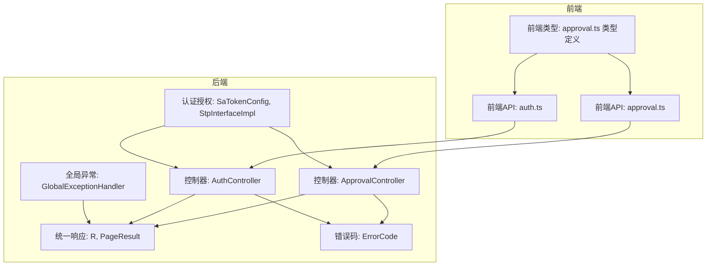
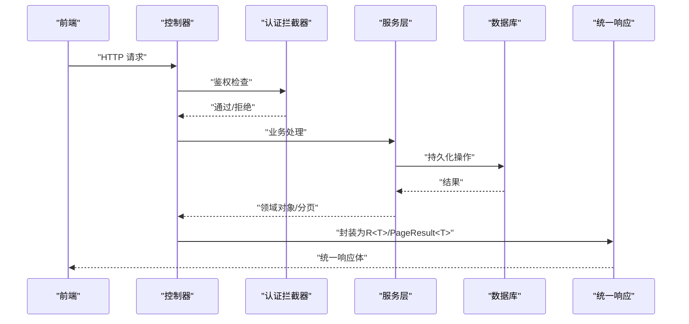
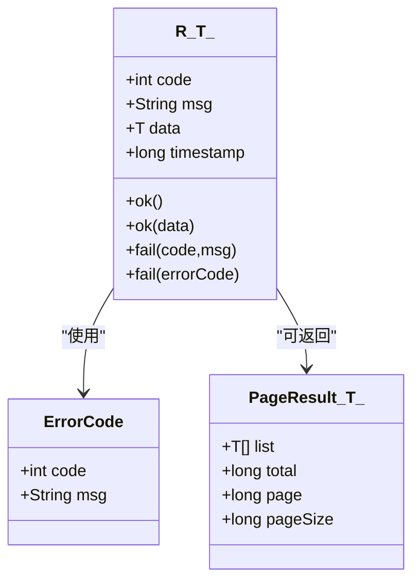
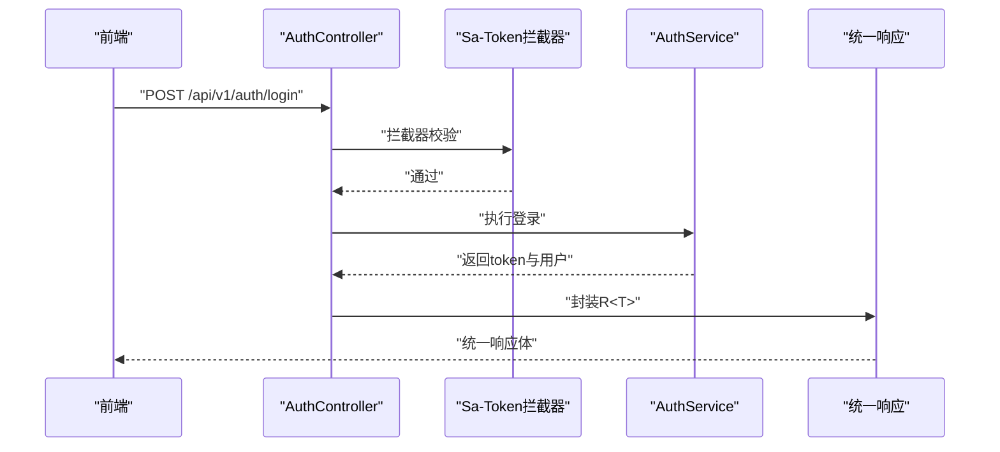
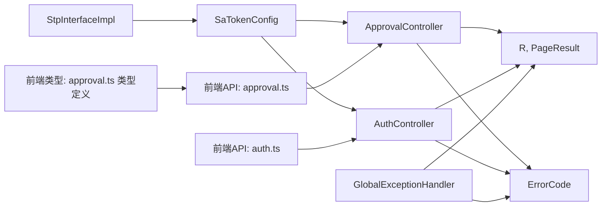

# 接口契约规范

<cite>
**本文引用的文件**
- [R.java](file://oa-common/src/main/java/com/oa/admin/common/result/R.java)
- [ErrorCode.java](file://oa-common/src/main/java/com/oa/admin/common/result/ErrorCode.java)
- [GlobalExceptionHandler.java](file://oa-common/src/main/java/com/oa/admin/common/exception/GlobalExceptionHandler.java)
- [BusinessException.java](file://oa-common/src/main/java/com/oa/admin/common/exception/BusinessException.java)
- [PageResult.java](file://oa-common/src/main/java/com/oa/admin/common/result/PageResult.java)
- [ApprovalController.java](file://oa-approval/src/main/java/com/oa/admin/approval/controller/ApprovalController.java)
- [AuthController.java](file://oa-system/src/main/java/com/oa/admin/system/controller/AuthController.java)
- [SaTokenConfig.java](file://oa-system/src/main/java/com/oa/admin/system/config/SaTokenConfig.java)
- [StpInterfaceImpl.java](file://oa-system/src/main/java/com/oa/admin/system/config/StpInterfaceImpl.java)
- [approval.ts](file://oa-ui/src/api/approval.ts)
- [auth.ts](file://oa-ui/src/api/auth.ts)
- [approval.ts（类型定义）](file://oa-ui/src/types/approval.ts)
- [BizApprovalInstance.java](file://oa-approval/src/main/java/com/oa/admin/approval/entity/BizApprovalInstance.java)
- [SysUser.java](file://oa-system/src/main/java/com/oa/admin/system/entity/SysUser.java)
</cite>

## 目录
1. [简介](#简介)
2. [项目结构](#项目结构)
3. [核心组件](#核心组件)
4. [架构总览](#架构总览)
5. [详细组件分析](#详细组件分析)
6. [依赖分析](#依赖分析)
7. [性能考虑](#性能考虑)
8. [故障排查指南](#故障排查指南)
9. [结论](#结论)
10. [附录](#附录)

## 简介
本规范面向OA审批管理系统，旨在建立统一、清晰、可演进的接口契约标准。内容涵盖RESTful风格与命名约定、参数传递规则、统一响应格式、认证授权机制、数据传输对象（DTO/VO）规范、接口版本管理策略，以及接口测试与文档生成标准。通过本规范，确保后端服务、前端调用与第三方集成在一致的契约下协同工作。

## 项目结构
系统采用多模块分层架构：公共能力（oa-common）、审批域（oa-approval）、系统域（oa-system）、前端（oa-ui）。接口契约主要由后端控制器与公共响应封装共同定义，并通过前端API模块与类型系统进行约束与校验。

图表来源
- [ApprovalController.java:29-251](file://oa-approval/src/main/java/com/oa/admin/approval/controller/ApprovalController.java#L29-L251)
- [AuthController.java:14-37](file://oa-system/src/main/java/com/oa/admin/system/controller/AuthController.java#L14-L37)
- [R.java:9-43](file://oa-common/src/main/java/com/oa/admin/common/result/R.java#L9-L43)
- [PageResult.java:9-22](file://oa-common/src/main/java/com/oa/admin/common/result/PageResult.java#L9-L22)
- [ErrorCode.java:11-44](file://oa-common/src/main/java/com/oa/admin/common/result/ErrorCode.java#L11-L44)
- [GlobalExceptionHandler.java:19-73](file://oa-common/src/main/java/com/oa/admin/common/exception/GlobalExceptionHandler.java#L19-L73)
- [SaTokenConfig.java:12-24](file://oa-system/src/main/java/com/oa/admin/system/config/SaTokenConfig.java#L12-L24)
- [StpInterfaceImpl.java:24-74](file://oa-system/src/main/java/com/oa/admin/system/config/StpInterfaceImpl.java#L24-L74)
- [approval.ts:1-71](file://oa-ui/src/api/approval.ts#L1-L71)
- [auth.ts:1-14](file://oa-ui/src/api/auth.ts#L1-L14)
- [approval.ts（类型定义）:1-131](file://oa-ui/src/types/approval.ts#L1-L131)

章节来源
- [ApprovalController.java:29-251](file://oa-approval/src/main/java/com/oa/admin/approval/controller/ApprovalController.java#L29-L251)
- [AuthController.java:14-37](file://oa-system/src/main/java/com/oa/admin/system/controller/AuthController.java#L14-L37)
- [R.java:9-43](file://oa-common/src/main/java/com/oa/admin/common/result/R.java#L9-L43)
- [PageResult.java:9-22](file://oa-common/src/main/java/com/oa/admin/common/result/PageResult.java#L9-L22)
- [ErrorCode.java:11-44](file://oa-common/src/main/java/com/oa/admin/common/result/ErrorCode.java#L11-L44)
- [GlobalExceptionHandler.java:19-73](file://oa-common/src/main/java/com/oa/admin/common/exception/GlobalExceptionHandler.java#L19-L73)
- [SaTokenConfig.java:12-24](file://oa-system/src/main/java/com/oa/admin/system/config/SaTokenConfig.java#L12-L24)
- [StpInterfaceImpl.java:24-74](file://oa-system/src/main/java/com/oa/admin/system/config/StpInterfaceImpl.java#L24-L74)
- [approval.ts:1-71](file://oa-ui/src/api/approval.ts#L1-L71)
- [auth.ts:1-14](file://oa-ui/src/api/auth.ts#L1-L14)
- [approval.ts（类型定义）:1-131](file://oa-ui/src/types/approval.ts#L1-L131)

## 核心组件
- 统一响应包装类 R<T>：所有接口返回统一结构，包含状态码、消息、数据与时间戳；提供成功与失败工厂方法。
- 错误码体系 ErrorCode：按系统、认证、审批三大域划分，便于前后端一致识别与提示。
- 全局异常处理器 GlobalExceptionHandler：将业务异常、参数校验异常、鉴权异常映射为统一响应与合适HTTP状态码。
- 分页结果 PageResult<T>：列表接口统一分页载体，包含数据列表、总数、页码、页大小。
- 控制器层：遵循RESTful命名与路径规范，结合权限注解进行接口保护。
- 认证授权：基于Sa-Token的拦截器与权限接口实现，支持路径级登录校验与权限校验。

章节来源
- [R.java:9-43](file://oa-common/src/main/java/com/oa/admin/common/result/R.java#L9-L43)
- [ErrorCode.java:11-44](file://oa-common/src/main/java/com/oa/admin/common/result/ErrorCode.java#L11-L44)
- [GlobalExceptionHandler.java:19-73](file://oa-common/src/main/java/com/oa/admin/common/exception/GlobalExceptionHandler.java#L19-L73)
- [PageResult.java:9-22](file://oa-common/src/main/java/com/oa/admin/common/result/PageResult.java#L9-L22)
- [ApprovalController.java:29-251](file://oa-approval/src/main/java/com/oa/admin/approval/controller/ApprovalController.java#L29-L251)
- [SaTokenConfig.java:12-24](file://oa-system/src/main/java/com/oa/admin/system/config/SaTokenConfig.java#L12-L24)
- [StpInterfaceImpl.java:24-74](file://oa-system/src/main/java/com/oa/admin/system/config/StpInterfaceImpl.java#L24-L74)

## 架构总览
接口契约贯穿“前端调用 → 控制器 → 服务层 → 数据层”，统一通过R<T>返回，异常通过GlobalExceptionHandler归一化处理。认证授权在MVC拦截器层面生效，控制器方法上通过注解声明权限。

图表来源
- [ApprovalController.java:29-251](file://oa-approval/src/main/java/com/oa/admin/approval/controller/ApprovalController.java#L29-L251)
- [AuthController.java:14-37](file://oa-system/src/main/java/com/oa/admin/system/controller/AuthController.java#L14-L37)
- [SaTokenConfig.java:12-24](file://oa-system/src/main/java/com/oa/admin/system/config/SaTokenConfig.java#L12-L24)
- [R.java:9-43](file://oa-common/src/main/java/com/oa/admin/common/result/R.java#L9-L43)
- [PageResult.java:9-22](file://oa-common/src/main/java/com/oa/admin/common/result/PageResult.java#L9-L22)

## 详细组件分析

### 1) 命名约定与RESTful规范
- 版本前缀：所有接口均以“/api/v1”作为版本前缀，便于未来演进与向后兼容。
- 资源命名：采用名词复数形式表达资源集合，如“/api/v1/approval/template”。
- 动作语义：使用HTTP动词表达动作，GET用于查询，POST用于提交/创建，PUT用于更新，DELETE用于删除。
- 路径参数：使用“{id}”占位符，如“/api/v1/approval/template/{id}”。
- 查询参数：使用键值对形式，如?page=1&pageSize=10&status=1。
- 权限标识：控制器方法上的权限注解使用“域:动作”格式，如“approval:template:list”。

章节来源
- [ApprovalController.java:29-251](file://oa-approval/src/main/java/com/oa/admin/approval/controller/ApprovalController.java#L29-L251)
- [AuthController.java:14-37](file://oa-system/src/main/java/com/oa/admin/system/controller/AuthController.java#L14-L37)

### 2) 参数传递规则
- 路径参数：强类型解析，控制器内部进行空值与格式校验，非法时抛出业务异常。
- 查询参数：可选参数需提供默认值或明确标注必填；分页参数建议默认值保证可用性。
- 请求体参数：JSON对象传参，字段需与前端类型定义保持一致；后端可通过Map或具体对象接收，必要时进行显式校验。

章节来源
- [ApprovalController.java:37-250](file://oa-approval/src/main/java/com/oa/admin/approval/controller/ApprovalController.java#L37-L250)
- [approval.ts（类型定义）:32-130](file://oa-ui/src/types/approval.ts#L32-L130)

### 3) 响应格式统一规范
- 统一响应体结构：包含code、msg、data、timestamp；成功场景code=200，失败场景使用ErrorCode中的code与msg。
- 成功响应：R.ok(data)或R.ok()；分页场景使用PageResult<T>包裹列表与统计信息。
- 失败响应：R.fail(code, msg)或R.fail(ErrorCode)；全局异常处理器将各类异常映射为统一响应与合适HTTP状态码。

图表来源
- [R.java:9-43](file://oa-common/src/main/java/com/oa/admin/common/result/R.java#L9-L43)
- [PageResult.java:9-22](file://oa-common/src/main/java/com/oa/admin/common/result/PageResult.java#L9-L22)
- [ErrorCode.java:11-44](file://oa-common/src/main/java/com/oa/admin/common/result/ErrorCode.java#L11-L44)

章节来源
- [R.java:9-43](file://oa-common/src/main/java/com/oa/admin/common/result/R.java#L9-L43)
- [PageResult.java:9-22](file://oa-common/src/main/java/com/oa/admin/common/result/PageResult.java#L9-L22)
- [ErrorCode.java:11-44](file://oa-common/src/main/java/com/oa/admin/common/result/ErrorCode.java#L11-L44)
- [GlobalExceptionHandler.java:19-73](file://oa-common/src/main/java/com/oa/admin/common/exception/GlobalExceptionHandler.java#L19-L73)

### 4) 认证授权规范
- 登录态校验：通过Sa-Token拦截器对/api/v1/**路径进行登录态校验，默认排除“/api/v1/auth/login”等公开接口。
- 权限校验：控制器方法使用注解声明所需权限，权限字符串由域与动作组成，如“approval:submit”。
- 用户信息：登录成功返回token与当前用户信息；退出登录清空会话；查询当前用户信息需登录态。

图表来源
- [AuthController.java:14-37](file://oa-system/src/main/java/com/oa/admin/system/controller/AuthController.java#L14-L37)
- [SaTokenConfig.java:12-24](file://oa-system/src/main/java/com/oa/admin/system/config/SaTokenConfig.java#L12-L24)
- [StpInterfaceImpl.java:24-74](file://oa-system/src/main/java/com/oa/admin/system/config/StpInterfaceImpl.java#L24-L74)

章节来源
- [SaTokenConfig.java:12-24](file://oa-system/src/main/java/com/oa/admin/system/config/SaTokenConfig.java#L12-L24)
- [StpInterfaceImpl.java:24-74](file://oa-system/src/main/java/com/oa/admin/system/config/StpInterfaceImpl.java#L24-L74)
- [AuthController.java:14-37](file://oa-system/src/main/java/com/oa/admin/system/controller/AuthController.java#L14-L37)

### 5) 数据传输对象（DTO/VO）规范
- VO/DTO：用于对外暴露的数据结构，字段命名采用驼峰，与前端类型定义保持一致。
- 实体类：后端领域模型，如BizApprovalInstance、SysUser，包含表映射注解与通用基类字段。
- 字段映射：前端类型定义与后端实体/VO字段一一对应，避免跨模块不一致。
- 校验策略：控制器层对路径/请求体参数进行显式校验，必要时结合Bean Validation。

章节来源
- [BizApprovalInstance.java:16-32](file://oa-approval/src/main/java/com/oa/admin/approval/entity/BizApprovalInstance.java#L16-L32)
- [SysUser.java:13-26](file://oa-system/src/main/java/com/oa/admin/system/entity/SysUser.java#L13-L26)
- [approval.ts（类型定义）:32-130](file://oa-ui/src/types/approval.ts#L32-L130)

### 6) 接口版本管理策略
- 版本号规范：统一使用“/api/v1”作为版本前缀，后续升级采用新版本号（如v2），旧版本保持不变。
- 向后兼容：新增字段采用非必填，变更字段保持语义一致；禁止破坏性变更。
- 废弃接口：通过文档标注废弃时间与替代方案，逐步迁移；在拦截器或网关层可做降级处理。

章节来源
- [ApprovalController.java:29-251](file://oa-approval/src/main/java/com/oa/admin/approval/controller/ApprovalController.java#L29-L251)
- [AuthController.java:14-37](file://oa-system/src/main/java/com/oa/admin/system/controller/AuthController.java#L14-L37)

### 7) 接口测试规范与文档生成
- 单元测试：针对控制器方法与服务逻辑编写测试用例，覆盖正常路径与异常路径。
- 集成测试：通过MockMvc或Postman集合验证端到端流程，确保统一响应与权限控制生效。
- 文档生成：基于OpenAPI/Swagger（如引入相关依赖）自动生成接口文档，保持契约与实现一致。
- 前端对接：前端API模块与类型定义同步更新，确保编译期类型安全。

章节来源
- [approval.ts:1-71](file://oa-ui/src/api/approval.ts#L1-L71)
- [auth.ts:1-14](file://oa-ui/src/api/auth.ts#L1-L14)
- [approval.ts（类型定义）:1-131](file://oa-ui/src/types/approval.ts#L1-L131)

## 依赖分析
- 控制器依赖统一响应与错误码；异常处理器依赖统一响应与错误码，形成闭环。
- 认证拦截器与权限接口实现共同保障接口安全；控制器方法通过注解声明权限。
- 前端API模块与类型定义与后端控制器严格对齐，减少契约偏差。

图表来源
- [ApprovalController.java:29-251](file://oa-approval/src/main/java/com/oa/admin/approval/controller/ApprovalController.java#L29-L251)
- [AuthController.java:14-37](file://oa-system/src/main/java/com/oa/admin/system/controller/AuthController.java#L14-L37)
- [R.java:9-43](file://oa-common/src/main/java/com/oa/admin/common/result/R.java#L9-L43)
- [PageResult.java:9-22](file://oa-common/src/main/java/com/oa/admin/common/result/PageResult.java#L9-L22)
- [ErrorCode.java:11-44](file://oa-common/src/main/java/com/oa/admin/common/result/ErrorCode.java#L11-L44)
- [GlobalExceptionHandler.java:19-73](file://oa-common/src/main/java/com/oa/admin/common/exception/GlobalExceptionHandler.java#L19-L73)
- [SaTokenConfig.java:12-24](file://oa-system/src/main/java/com/oa/admin/system/config/SaTokenConfig.java#L12-L24)
- [StpInterfaceImpl.java:24-74](file://oa-system/src/main/java/com/oa/admin/system/config/StpInterfaceImpl.java#L24-L74)
- [approval.ts:1-71](file://oa-ui/src/api/approval.ts#L1-L71)
- [auth.ts:1-14](file://oa-ui/src/api/auth.ts#L1-L14)
- [approval.ts（类型定义）:1-131](file://oa-ui/src/types/approval.ts#L1-L131)

## 性能考虑
- 统一响应与异常处理：减少重复封装与异常分支判断，提升可维护性与一致性。
- 分页查询：列表接口统一使用PageResult<T>，避免一次性加载大量数据。
- 权限校验：在拦截器层进行基础登录校验，在控制器层进行细粒度权限校验，降低无效请求开销。
- DTO/VO分离：对外暴露的VO与内部实体分离，避免不必要的字段序列化与网络传输。

## 故障排查指南
- 未登录/登录过期：全局异常将映射为统一错误码与HTTP 401，前端需引导重新登录。
- 无权限访问：映射为统一错误码与HTTP 403，检查用户角色与权限字符串是否正确。
- 参数校验失败：HTTP 400，检查请求体字段与类型是否符合前端类型定义。
- 业务异常：根据业务抛出的错误码定位问题，查看控制器中抛出的业务异常来源。

章节来源
- [GlobalExceptionHandler.java:19-73](file://oa-common/src/main/java/com/oa/admin/common/exception/GlobalExceptionHandler.java#L19-L73)
- [BusinessException.java:9-22](file://oa-common/src/main/java/com/oa/admin/common/exception/BusinessException.java#L9-L22)
- [ErrorCode.java:11-44](file://oa-common/src/main/java/com/oa/admin/common/result/ErrorCode.java#L11-L44)

## 结论
本规范通过统一的RESTful命名、参数传递规则、响应格式、认证授权与错误码体系，确保OA审批管理系统在多模块协作下的接口一致性与可演进性。配合前端类型定义与测试规范，可有效降低契约偏差与集成成本，提升整体开发效率与系统稳定性。

## 附录
- 常用HTTP状态码映射参考
  - 成功：200
  - 参数错误：400
  - 未登录/登录过期：401
  - 无权限：403
  - 服务器异常：500
- 建议的接口文档生成步骤
  - 在控制器上添加OpenAPI注解（如引入相关依赖）
  - 使用工具生成静态文档并与版本管理集成
  - 将前端类型定义纳入文档生成流程，保持契约一致性