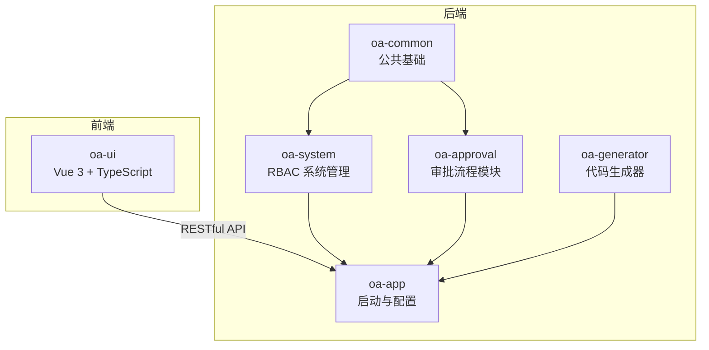
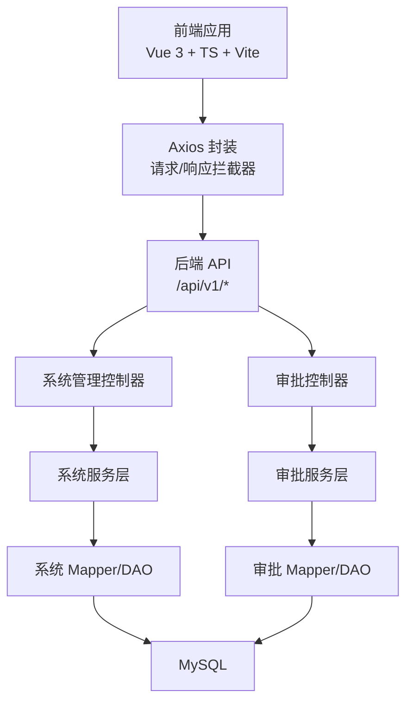
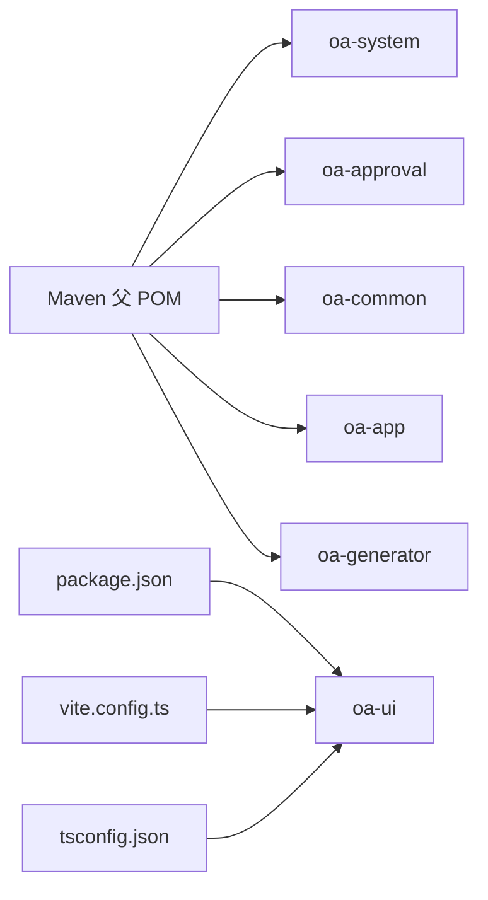

# 编码规范

<cite>
**本文引用的文件**
- [README.md](file://README.md)
- [pom.xml](file://pom.xml)
- [package.json](file://oa-ui/package.json)
- [tsconfig.json](file://oa-ui/tsconfig.json)
- [vite.config.ts](file://oa-ui/vite.config.ts)
- [R.java](file://oa-common/src/main/java/com/oa/admin/common/result/R.java)
- [GlobalExceptionHandler.java](file://oa-common/src/main/java/com/oa/admin/common/exception/GlobalExceptionHandler.java)
- [BaseEntity.java](file://oa-common/src/main/java/com/oa/admin/common/entity/BaseEntity.java)
- [SysUserController.java](file://oa-system/src/main/java/com/oa/admin/system/controller/SysUserController.java)
- [ApprovalController.java](file://oa-approval/src/main/java/com/oa/admin/approval/controller/ApprovalController.java)
- [index.ts 类型聚合导出](file://oa-ui/src/types/index.ts)
- [approval.ts API 定义](file://oa-ui/src/api/approval.ts)
- [request.ts 请求封装](file://oa-ui/src/utils/request.ts)
- [router/index.ts 路由定义](file://oa-ui/src/router/index.ts)
- [stores/user.ts 状态管理](file://oa-ui/src/stores/user.ts)
</cite>

## 目录
1. [引言](#引言)
2. [项目结构](#项目结构)
3. [核心组件](#核心组件)
4. [架构总览](#架构总览)
5. [详细组件分析](#详细组件分析)
6. [依赖分析](#依赖分析)
7. [性能考虑](#性能考虑)
8. [故障排查指南](#故障排查指南)
9. [结论](#结论)
10. [附录](#附录)

## 引言
本文件为 OA 审批管理系统制定统一的编码规范，覆盖后端 Java（Spring Boot）、前端 TypeScript/Vue 开发规范，以及前后端接口契约与质量保障要求。目标是提升代码一致性、可读性、可维护性与协作效率。

## 项目结构
项目采用多模块 Maven 结构，后端按领域拆分模块，前端独立工程，统一通过统一 API 前缀与响应格式进行交互。

图表来源
- [pom.xml:1-131](file://pom.xml#L1-L131)
- [README.md:48-61](file://README.md#L48-L61)

章节来源
- [README.md:48-61](file://README.md#L48-L61)
- [pom.xml:21-28](file://pom.xml#L21-L28)

## 核心组件
- 统一响应体：后端通过统一响应包装类返回数据，前端基于响应体进行交互与错误处理。
- 全局异常处理：集中处理鉴权、参数校验、业务异常与未知异常，保证一致的错误语义。
- 基础实体：统一时间戳与软删除字段，减少重复代码。
- 控制器层：统一 RESTful 路由前缀与权限注解，确保接口规范与安全控制一致。
- 前端请求封装：统一 baseURL、拦截器、鉴权头与错误提示逻辑。
- 路由与状态：统一路由命名与守卫，Pinia 状态管理规范化。

章节来源
- [R.java:1-44](file://oa-common/src/main/java/com/oa/admin/common/result/R.java#L1-L44)
- [GlobalExceptionHandler.java:1-74](file://oa-common/src/main/java/com/oa/admin/common/exception/GlobalExceptionHandler.java#L1-L74)
- [BaseEntity.java:1-26](file://oa-common/src/main/java/com/oa/admin/common/entity/BaseEntity.java#L1-L26)
- [SysUserController.java:1-85](file://oa-system/src/main/java/com/oa/admin/system/controller/SysUserController.java#L1-L85)
- [ApprovalController.java:1-252](file://oa-approval/src/main/java/com/oa/admin/approval/controller/ApprovalController.java#L1-L252)
- [request.ts:1-42](file://oa-ui/src/utils/request.ts#L1-L42)
- [router/index.ts:1-134](file://oa-ui/src/router/index.ts#L1-L134)
- [stores/user.ts:1-32](file://oa-ui/src/stores/user.ts#L1-L32)

## 架构总览
后端以 Spring Boot 为核心，采用 MyBatis-Plus、Sa-Token、Flowable 等技术栈；前端基于 Vue 3 + TypeScript + Vite，通过 Axios 封装统一请求与拦截器，路由采用 Vue Router，状态管理使用 Pinia。

图表来源
- [README.md:87-93](file://README.md#L87-L93)
- [vite.config.ts:12-39](file://oa-ui/vite.config.ts#L12-L39)
- [request.ts:5-8](file://oa-ui/src/utils/request.ts#L5-L8)
- [SysUserController.java:17-20](file://oa-system/src/main/java/com/oa/admin/system/controller/SysUserController.java#L17-L20)
- [ApprovalController.java:29-32](file://oa-approval/src/main/java/com/oa/admin/approval/controller/ApprovalController.java#L29-L32)

## 详细组件分析

### Java 编码规范（后端）
- 类命名
  - 使用帕斯卡命名法，模块内类名清晰表达职责，如控制器以“...Controller”结尾，服务以“...Service”结尾，实体以“Biz...”或“Sys...”前缀区分业务域。
  - 示例：[SysUserController.java:17-20](file://oa-system/src/main/java/com/oa/admin/system/controller/SysUserController.java#L17-L20)，[ApprovalController.java:29-32](file://oa-approval/src/main/java/com/oa/admin/approval/controller/ApprovalController.java#L29-L32)

- 方法命名
  - 动词短语命名，体现动作与结果，如“create”、“update”、“delete”、“submit”、“approve”等。
  - 示例：[SysUserController.java:41-57](file://oa-system/src/main/java/com/oa/admin/system/controller/SysUserController.java#L41-L57)，[ApprovalController.java:38-53](file://oa-approval/src/main/java/com/oa/admin/approval/controller/ApprovalController.java#L38-L53)

- 变量命名
  - 使用小驼峰，避免缩写，必要时使用领域内通用术语。
  - 示例：[ApprovalController.java:39-43](file://oa-approval/src/main/java/com/oa/admin/approval/controller/ApprovalController.java#L39-L43)

- 注释规范
  - 类与方法使用简洁注释说明用途与关键行为，避免显而易见的注释。
  - 示例：[R.java:5-7](file://oa-common/src/main/java/com/oa/admin/common/result/R.java#L5-L7)

- 异常处理
  - 使用统一响应包装类返回错误码与消息；全局异常处理器集中处理鉴权、参数校验、业务异常与未知异常。
  - 示例：[GlobalExceptionHandler.java:23-72](file://oa-common/src/main/java/com/oa/admin/common/exception/GlobalExceptionHandler.java#L23-L72)

- 日志使用
  - 使用 SLF4J 注解简化日志注入，对未捕获异常记录错误日志。
  - 示例：[GlobalExceptionHandler.java:19](file://oa-common/src/main/java/com/oa/admin/common/exception/GlobalExceptionHandler.java#L19)

- 统一响应体
  - 所有接口返回统一结构，包含状态码、消息、数据与时间戳。
  - 示例：[R.java:11-15](file://oa-common/src/main/java/com/oa/admin/common/result/R.java#L11-L15)

- 基础实体
  - 统一 createdAt、updatedAt、deleted 字段，便于审计与软删除。
  - 示例：[BaseEntity.java:14-25](file://oa-common/src/main/java/com/oa/admin/common/entity/BaseEntity.java#L14-L25)

- 控制器与权限
  - 统一 RESTful 路由前缀与权限注解，确保接口安全与可追溯。
  - 示例：[SysUserController.java:18](file://oa-system/src/main/java/com/oa/admin/system/controller/SysUserController.java#L18)，[ApprovalController.java:30](file://oa-approval/src/main/java/com/oa/admin/approval/controller/ApprovalController.java#L30)

章节来源
- [SysUserController.java:1-85](file://oa-system/src/main/java/com/oa/admin/system/controller/SysUserController.java#L1-L85)
- [ApprovalController.java:1-252](file://oa-approval/src/main/java/com/oa/admin/approval/controller/ApprovalController.java#L1-L252)
- [R.java:1-44](file://oa-common/src/main/java/com/oa/admin/common/result/R.java#L1-L44)
- [GlobalExceptionHandler.java:1-74](file://oa-common/src/main/java/com/oa/admin/common/exception/GlobalExceptionHandler.java#L1-L74)
- [BaseEntity.java:1-26](file://oa-common/src/main/java/com/oa/admin/common/entity/BaseEntity.java#L1-L26)

### TypeScript/Vue 编码规范（前端）
- 类型与接口
  - 使用 TypeScript 接口与类型描述 API 返回与参数，避免 any。
  - 示例：[approval.ts:1-71](file://oa-ui/src/api/approval.ts#L1-L71)，[index.ts 类型聚合导出:1-21](file://oa-ui/src/types/index.ts#L1-L21)

- 函数组件与组合式函数
  - 使用组合式 API（setup、ref、defineStore）组织逻辑，保持单一职责。
  - 示例：[stores/user.ts:6-31](file://oa-ui/src/stores/user.ts#L6-L31)

- 组件命名
  - 组件文件与导出名称采用帕斯卡命名，首字母大写，如“ApprovalTimeline.vue”。
  - 示例：[ApprovalController.java:103-105](file://oa-approval/src/main/java/com/oa/admin/approval/controller/ApprovalController.java#L103-L105)

- Props 定义与默认值
  - 明确 props 类型与默认值，避免运行时类型错误。
  - 示例：[request.ts:5-8](file://oa-ui/src/utils/request.ts#L5-L8)

- 事件处理
  - 事件回调使用箭头函数绑定上下文，避免 this 指向问题。
  - 示例：[stores/user.ts:10-28](file://oa-ui/src/stores/user.ts#L10-L28)

- 生命周期管理
  - 在 onMounted/onUnmounted 中进行资源注册与清理，避免内存泄漏。
  - 示例：[router/index.ts:124-131](file://oa-ui/src/router/index.ts#L124-L131)

- 路由与导航
  - 使用 Vue Router 定义命名路由与元信息，配合前置守卫实现鉴权。
  - 示例：[router/index.ts:6-121](file://oa-ui/src/router/index.ts#L6-L121)

- 请求封装与拦截器
  - Axios 实例统一 baseURL、超时与拦截器，自动注入鉴权头并处理错误。
  - 示例：[request.ts:5-39](file://oa-ui/src/utils/request.ts#L5-L39)

- 状态管理
  - 使用 Pinia 定义 Store，集中管理用户 token 与用户信息。
  - 示例：[stores/user.ts:6-31](file://oa-ui/src/stores/user.ts#L6-L31)

章节来源
- [approval.ts:1-71](file://oa-ui/src/api/approval.ts#L1-L71)
- [index.ts 类型聚合导出:1-21](file://oa-ui/src/types/index.ts#L1-L21)
- [stores/user.ts:1-32](file://oa-ui/src/stores/user.ts#L1-L32)
- [router/index.ts:1-134](file://oa-ui/src/router/index.ts#L1-L134)
- [request.ts:1-42](file://oa-ui/src/utils/request.ts#L1-L42)

### Vue 组件开发规范
- 组件命名与导出
  - 文件名与导出名称采用帕斯卡命名，便于 IDE 识别与导入。
  - 示例：[ApprovalController.java:103-105](file://oa-approval/src/main/java/com/oa/admin/approval/controller/ApprovalController.java#L103-L105)

- Props 与事件
  - 明确 props 类型与默认值，事件命名使用 kebab-case，回调参数语义明确。
  - 示例：[request.ts:10-16](file://oa-ui/src/utils/request.ts#L10-L16)

- 生命周期钩子
  - 在合适的生命周期钩子中执行副作用，避免在模板中直接操作 DOM。
  - 示例：[router/index.ts:124-131](file://oa-ui/src/router/index.ts#L124-L131)

- 插槽与作用域插槽
  - 合理使用具名插槽与作用域插槽，提升组件复用性。
  - 示例：[router/index.ts:124-131](file://oa-ui/src/router/index.ts#L124-L131)

章节来源
- [request.ts:1-42](file://oa-ui/src/utils/request.ts#L1-L42)
- [router/index.ts:1-134](file://oa-ui/src/router/index.ts#L1-L134)

### 前后端接口契约规范
- API 命名约定
  - 后端统一 RESTful 路由前缀“/api/v1”，资源名词复数化，动词使用 HTTP 方法表达。
  - 示例：[SysUserController.java:18](file://oa-system/src/main/java/com/oa/admin/system/controller/SysUserController.java#L18)，[ApprovalController.java:30](file://oa-approval/src/main/java/com/oa/admin/approval/controller/ApprovalController.java#L30)

- 参数传递规则
  - 查询参数使用@RequestParam，路径参数使用@PathVariable，请求体使用@RequestBody。
  - 示例：[SysUserController.java:25-30](file://oa-system/src/main/java/com/oa/admin/system/controller/SysUserController.java#L25-L30)，[ApprovalController.java:68-74](file://oa-approval/src/main/java/com/oa/admin/approval/controller/ApprovalController.java#L68-L74)

- 响应格式统一
  - 统一响应体包含 code、msg、data、timestamp，前端根据 code 判断成功与否。
  - 示例：[R.java:11-15](file://oa-common/src/main/java/com/oa/admin/common/result/R.java#L11-L15)，[request.ts:20-29](file://oa-ui/src/utils/request.ts#L20-L29)

- 鉴权头
  - 前端在请求头注入 satoken，后端通过 Sa-Token 进行权限校验。
  - 示例：[request.ts:11-14](file://oa-ui/src/utils/request.ts#L11-L14)，[SysUserController.java:24](file://oa-system/src/main/java/com/oa/admin/system/controller/SysUserController.java#L24)

- 错误码与消息
  - 使用统一错误码枚举与消息，便于前端展示与国际化。
  - 示例：[GlobalExceptionHandler.java:23-72](file://oa-common/src/main/java/com/oa/admin/common/exception/GlobalExceptionHandler.java#L23-L72)

章节来源
- [SysUserController.java:1-85](file://oa-system/src/main/java/com/oa/admin/system/controller/SysUserController.java#L1-L85)
- [ApprovalController.java:1-252](file://oa-approval/src/main/java/com/oa/admin/approval/controller/ApprovalController.java#L1-L252)
- [R.java:1-44](file://oa-common/src/main/java/com/oa/admin/common/result/R.java#L1-L44)
- [request.ts:1-42](file://oa-ui/src/utils/request.ts#L1-L42)
- [GlobalExceptionHandler.java:1-74](file://oa-common/src/main/java/com/oa/admin/common/exception/GlobalExceptionHandler.java#L1-L74)

## 依赖分析
- 后端依赖版本集中管理，确保模块间一致性。
- 前端使用 Vite 插件自动导入与组件解析，提升开发体验。

图表来源
- [pom.xml:44-113](file://pom.xml#L44-L113)
- [package.json:1-38](file://oa-ui/package.json#L1-L38)
- [vite.config.ts:12-39](file://oa-ui/vite.config.ts#L12-L39)
- [tsconfig.json:1-24](file://oa-ui/tsconfig.json#L1-L24)

章节来源
- [pom.xml:1-131](file://pom.xml#L1-L131)
- [package.json:1-38](file://oa-ui/package.json#L1-L38)
- [vite.config.ts:1-40](file://oa-ui/vite.config.ts#L1-L40)
- [tsconfig.json:1-24](file://oa-ui/tsconfig.json#L1-L24)

## 性能考虑
- 后端
  - 使用 MyBatis-Plus 分页查询与条件构造器，避免 N+1 查询。
  - 合理使用缓存与异步任务处理非关键路径。
- 前端
  - 组件懒加载与路由按需引入，减少首屏体积。
  - 使用防抖与节流优化高频交互（如搜索、滚动）。

## 故障排查指南
- 统一响应体与错误处理
  - 前端根据响应 code 判断是否成功，非 200 时弹窗提示并跳转登录。
  - 后端全局异常处理器捕获未处理异常并返回统一错误格式。
  - 示例：[request.ts:20-29](file://oa-ui/src/utils/request.ts#L20-L29)，[GlobalExceptionHandler.java:67-72](file://oa-common/src/main/java/com/oa/admin/common/exception/GlobalExceptionHandler.java#L67-L72)

- 鉴权失败处理
  - 前端收到特定错误码时清除本地 token 并跳转登录页。
  - 示例：[request.ts:25-28](file://oa-ui/src/utils/request.ts#L25-L28)

- 参数校验失败
  - 后端对参数校验异常进行统一处理，返回首个字段的错误信息。
  - 示例：[GlobalExceptionHandler.java:47-55](file://oa-common/src/main/java/com/oa/admin/common/exception/GlobalExceptionHandler.java#L47-L55)

章节来源
- [request.ts:1-42](file://oa-ui/src/utils/request.ts#L1-L42)
- [GlobalExceptionHandler.java:1-74](file://oa-common/src/main/java/com/oa/admin/common/exception/GlobalExceptionHandler.java#L1-L74)

## 结论
通过统一的 Java 与 TypeScript/Vue 编码规范、前后端接口契约与质量保障机制，能够显著提升团队协作效率与系统稳定性。建议在日常开发中严格遵循本文规范，并结合代码审查清单持续改进。

## 附录

### 代码格式化工具与 IDE 设置建议
- Java
  - 使用 Spotless 或 Maven 插件统一格式化与检查。
  - IDE 设置：启用“On Save”格式化、禁止尾随空格、统一换行符。
- TypeScript/Vue
  - 使用 Prettier + ESLint，配置 VS Code 扩展自动保存格式化。
  - TypeScript 严格模式开启，禁用隐式 any，启用 noUnusedLocals/noUnusedParameters。
- 前端构建
  - Vite 已内置自动导入与组件解析，建议统一 ESLint 规则与提交前钩子。

章节来源
- [tsconfig.json:13-16](file://oa-ui/tsconfig.json#L13-L16)
- [package.json:10](file://oa-ui/package.json#L10)

### 代码审查清单与质量检查标准
- Java
  - 命名规范、注释完整性、异常处理一致性、SQL 与事务边界清晰。
- TypeScript/Vue
  - 类型完整、组合式函数职责单一、组件可测试性、路由与权限守卫完备。
- 接口契约
  - 响应体统一、错误码与消息一致、鉴权头规范、分页参数规范。
- 性能与安全
  - 避免 N+1 查询、前端懒加载、鉴权与权限最小化原则。

章节来源
- [README.md:87-93](file://README.md#L87-L93)
- [request.ts:1-42](file://oa-ui/src/utils/request.ts#L1-L42)
- [GlobalExceptionHandler.java:1-74](file://oa-common/src/main/java/com/oa/admin/common/exception/GlobalExceptionHandler.java#L1-L74)