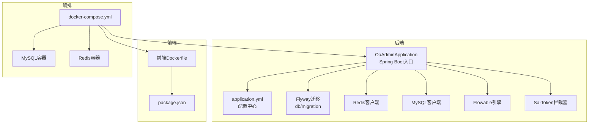
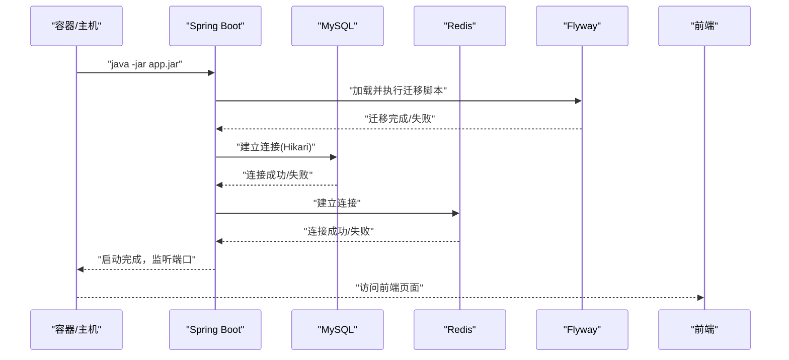
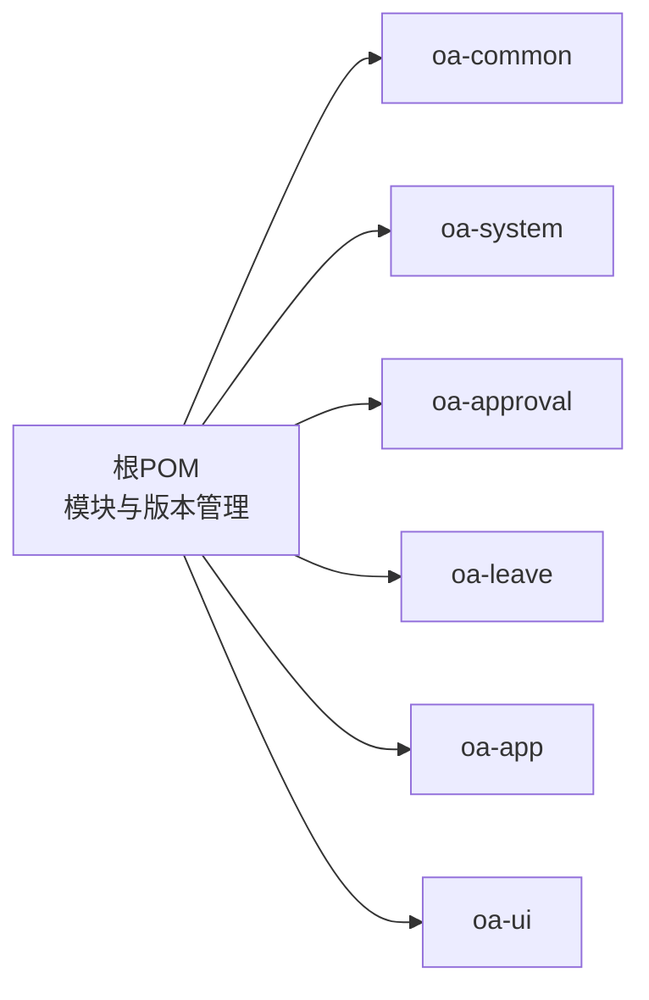
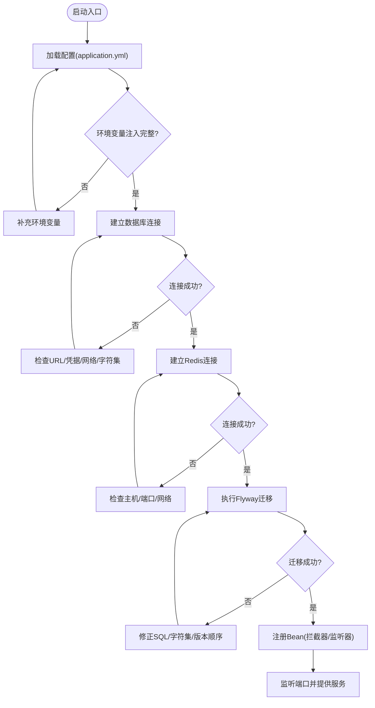

# 启动问题排查

<cite>
**本文引用的文件**
- [OaAdminApplication.java](file://oa-app/src/main/java/com/oa/admin/OaAdminApplication.java)
- [application.yml](file://oa-app/src/main/resources/application.yml)
- [Dockerfile（后端）](file://Dockerfile)
- [docker-compose.yml](file://docker-compose.yml)
- [pom.xml（根工程）](file://pom.xml)
- [FlowableConfig.java](file://oa-approval/src/main/java/com/oa/admin/approval/config/FlowableConfig.java)
- [SaTokenConfig.java](file://oa-system/src/main/java/com/oa/admin/system/config/SaTokenConfig.java)
- [GlobalExceptionHandler.java](file://oa-common/src/main/java/com/oa/admin/common/exception/GlobalExceptionHandler.java)
- [V1__init_sys_tables.sql](file://oa-app/src/main/resources/db/migration/V1__init_sys_tables.sql)
- [V3__seed_data.sql](file://oa-app/src/main/resources/db/migration/V3__seed_data.sql)
- [init.sh](file://init.sh)
- [Dockerfile（前端）](file://oa-ui/Dockerfile)
- [package.json（前端）](file://oa-ui/package.json)
</cite>

## 目录
1. [简介](#简介)
2. [项目结构](#项目结构)
3. [核心组件](#核心组件)
4. [架构总览](#架构总览)
5. [详细组件分析](#详细组件分析)
6. [依赖分析](#依赖分析)
7. [性能考虑](#性能考虑)
8. [故障排查指南](#故障排查指南)
9. [结论](#结论)
10. [附录](#附录)

## 简介
本指南面向OA审批管理系统的启动问题排查，覆盖端口冲突、数据库连接失败、配置文件错误、依赖缺失、Docker容器启动异常、跨环境差异（开发/测试/生产）以及启动性能优化与最佳实践。文档基于实际代码与配置文件进行分析，并提供可操作的诊断步骤与图示。

## 项目结构
系统采用多模块Maven聚合工程，后端主应用位于oa-app，使用Spring Boot启动；数据库迁移脚本由Flyway管理；Redis用于缓存与会话；Flowable用于工作流引擎；前端使用Vue+Vite打包并通过Nginx提供静态资源；通过Docker Compose编排MySQL、Redis、后端、前端服务。

图表来源
- [OaAdminApplication.java:11-18](file://oa-app/src/main/java/com/oa/admin/OaAdminApplication.java#L11-L18)
- [application.yml:1-59](file://oa-app/src/main/resources/application.yml#L1-L59)
- [docker-compose.yml:1-66](file://docker-compose.yml#L1-L66)
- [Dockerfile（后端）:1-22](file://Dockerfile#L1-L22)
- [Dockerfile（前端）:1-15](file://oa-ui/Dockerfile#L1-L15)
- [package.json（前端）:1-38](file://oa-ui/package.json#L1-L38)

章节来源
- [pom.xml（根工程）:21-28](file://pom.xml#L21-L28)
- [docker-compose.yml:1-66](file://docker-compose.yml#L1-L66)

## 核心组件
- Spring Boot启动类：负责扫描组件、启动Web容器与自动配置。
- 配置文件：集中管理端口、数据库、Redis、MyBatis-Plus、Sa-Token、Flowable等。
- Flyway迁移：按版本顺序执行SQL初始化与增量脚本。
- 容器编排：MySQL、Redis、后端、前端四服务协同运行。
- 前端构建：Node构建产物交由Nginx提供静态页面。

章节来源
- [OaAdminApplication.java:11-18](file://oa-app/src/main/java/com/oa/admin/OaAdminApplication.java#L11-L18)
- [application.yml:1-59](file://oa-app/src/main/resources/application.yml#L1-L59)
- [docker-compose.yml:1-66](file://docker-compose.yml#L1-L66)

## 架构总览
后端启动流程概览：容器启动后，Spring Boot读取application.yml，建立数据库与Redis连接，执行Flyway迁移，初始化Flowable与Sa-Token相关Bean，随后监听HTTP端口并对外提供REST API。

图表来源
- [application.yml:4-29](file://oa-app/src/main/resources/application.yml#L4-L29)
- [docker-compose.yml:37-50](file://docker-compose.yml#L37-L50)
- [Dockerfile（后端）:19-21](file://Dockerfile#L19-L21)

## 详细组件分析

### 启动入口与组件扫描
- 入口类启用Spring Boot并开启事务与Mapper扫描，确保系统模块中的Mapper、Service、Controller、配置类被正确注册。
- Mapper扫描路径覆盖系统、审批、请假模块，避免遗漏导致的Bean未注册或SQL映射失败。

章节来源
- [OaAdminApplication.java:11-18](file://oa-app/src/main/java/com/oa/admin/OaAdminApplication.java#L11-L18)

### 配置加载与关键参数
- 服务器端口默认8080，可通过环境变量覆盖。
- 数据源默认指向本地MySQL，支持通过环境变量注入URL、用户名、密码与连接池参数。
- Redis默认本地直连，支持通过环境变量注入主机与端口。
- Flyway启用并指定迁移目录，首次启动会按版本号顺序执行SQL。
- Sa-Token配置了拦截规则与序列化策略，影响登录态与鉴权行为。
- Flowable数据库Schema更新策略与异步执行器开关影响流程引擎初始化。

章节来源
- [application.yml:1-59](file://oa-app/src/main/resources/application.yml#L1-L59)

### 工作流引擎配置
- 自定义Flowable配置类向引擎注册事件监听器，确保流程结束事件能被处理。
- 若监听器缺失或构造失败，可能导致流程回调不生效或启动异常。

章节来源
- [FlowableConfig.java:15-30](file://oa-approval/src/main/java/com/oa/admin/approval/config/FlowableConfig.java#L15-L30)

### 权限拦截器配置
- Sa-Token拦截器对/api/v1/**路径进行统一登录校验，排除登录/注册接口。
- 若拦截器未生效或路径匹配错误，会导致鉴权失败但应用仍可启动。

章节来源
- [SaTokenConfig.java:12-24](file://oa-system/src/main/java/com/oa/admin/system/config/SaTokenConfig.java#L12-L24)

### 全局异常处理
- 统一捕获未登录、权限不足、业务异常、参数校验异常与通用异常，便于定位启动期的Bean装配与配置错误引发的异常。
- 异常处理器在启动阶段不会直接触发，但在请求阶段可帮助定位业务层问题。

章节来源
- [GlobalExceptionHandler.java:19-73](file://oa-common/src/main/java/com/oa/admin/common/exception/GlobalExceptionHandler.java#L19-L73)

### 数据库迁移与初始化
- 迁移脚本包含系统RBAC表、业务表、种子数据等，首次启动必须成功执行。
- 若迁移失败（如字符集不匹配、语法错误、外键约束），应用将无法完成启动。

章节来源
- [V1__init_sys_tables.sql:1-84](file://oa-app/src/main/resources/db/migration/V1__init_sys_tables.sql#L1-L84)
- [application.yml:25-29](file://oa-app/src/main/resources/application.yml#L25-L29)

## 依赖分析
- 根POM声明了模块与依赖版本管理，确保各子模块依赖一致。
- 后端模块引入Spring Boot Starter、MyBatis-Plus、Sa-Token、Flowable、MySQL驱动与Flyway。
- 前端模块使用Vue 3、Element Plus、Axios、Pinia、Vue Router等，构建产物由Nginx提供。

图表来源
- [pom.xml（根工程）:21-28](file://pom.xml#L21-L28)

章节来源
- [pom.xml（根工程）:44-113](file://pom.xml#L44-L113)

## 性能考虑
- 连接池参数：最大池大小、最小空闲、连接超时、空闲超时、最大生命周期、泄漏检测阈值等，需结合并发与数据库性能调优。
- Redis缓存：合理设置过期策略与序列化方式，避免热点Key与序列化开销。
- Flyway迁移：避免大体量脚本一次性执行，拆分迁移版本，减少启动时间。
- JVM参数：在容器中设置合适的堆大小与GC策略，避免频繁Full GC。
- 前端构建：生产模式下启用压缩与Tree-shaking，缩短首屏渲染时间。

## 故障排查指南

### 一、启动失败的常见原因与步骤

1) 端口冲突
- 现象：容器启动后立即退出或日志提示端口占用。
- 排查：
  - 检查容器映射端口是否与宿主冲突（默认8080）。
  - 使用编排文件确认端口映射与暴露端口一致。
  - 在不同环境中调整端口并同步更新前端代理或环境变量。
- 参考
  - [docker-compose.yml:49-50](file://docker-compose.yml#L49-L50)
  - [application.yml:1-2](file://oa-app/src/main/resources/application.yml#L1-L2)

2) 数据库连接失败
- 现象：启动阶段出现数据库连接异常或Flyway迁移失败。
- 排查：
  - 确认MySQL容器健康状态与端口可达性。
  - 检查数据库名、账号、密码与字符集配置是否正确。
  - 校验Flyway迁移脚本是否可执行（字符集、语法、索引长度限制）。
  - 如使用容器网络，确保后端容器能解析数据库主机名。
- 参考
  - [docker-compose.yml:2-20](file://docker-compose.yml#L2-L20)
  - [application.yml:5-29](file://oa-app/src/main/resources/application.yml#L5-L29)
  - [V1__init_sys_tables.sql:1-84](file://oa-app/src/main/resources/db/migration/V1__init_sys_tables.sql#L1-L84)

3) 配置文件错误
- 现象：YAML格式错误、占位符未替换、环境变量未注入。
- 排查：
  - 使用YAML校验工具检查application.yml语法。
  - 确认环境变量已注入（如数据库URL、Redis地址、密码）。
  - 检查mapper扫描包路径与实际包结构一致。
- 参考
  - [application.yml:1-59](file://oa-app/src/main/resources/application.yml#L1-L59)
  - [OaAdminApplication.java:11-18](file://oa-app/src/main/java/com/oa/admin/OaAdminApplication.java#L11-L18)

4) 依赖缺失或版本不兼容
- 现象：启动时报找不到类或反射异常。
- 排查：
  - 确认所有模块均已构建并打入最终Jar。
  - 检查根POM的依赖版本管理与子模块依赖是否匹配。
  - 核对JDK版本与编译参数（如模块开箱参数）。
- 参考
  - [pom.xml（根工程）:30-42](file://pom.xml#L30-L42)
  - [pom.xml（根工程）:115-129](file://pom.xml#L115-L129)

5) 启动日志分析方法
- 关键阶段：
  - 配置加载：关注数据源、Redis、Flyway、Flowable、Sa-Token等配置项是否加载成功。
  - 连接建立：观察数据库与Redis连接建立日志，定位连接超时或认证失败。
  - 迁移执行：确认Flyway版本迁移顺序与结果。
  - Bean注册：检查工作流监听器、拦截器等Bean是否注册成功。
- 错误堆栈定位：
  - 若为配置错误，通常在启动早期抛出异常。
  - 若为Bean装配失败，关注上下文刷新阶段的异常。
  - 若为迁移失败，优先检查SQL语法与字符集。
- 配置加载顺序：
  - 外部环境变量 > application.yml > 默认值。
  - 建议在容器中显式注入关键变量，避免默认值导致的错误。

6) Docker容器启动问题排查
- 镜像构建失败：
  - 检查Maven缓存挂载、网络与依赖仓库可达性。
  - 确认多模块打包命令与插件配置正确。
- 容器健康检查：
  - MySQL健康检查失败：检查root密码、字符集、时区与命令参数。
  - 后端容器启动即退出：检查环境变量注入与端口映射。
- 网络连接问题：
  - 使用容器内DNS解析验证主机名可用性。
  - 使用curl或telnet从后端容器探测数据库与Redis端口。
- 参考
  - [Dockerfile（后端）:1-22](file://Dockerfile#L1-L22)
  - [docker-compose.yml:1-66](file://docker-compose.yml#L1-L66)

7) 不同环境下的差异排查要点
- 开发环境：本地直连MySQL/Redis，端口映射到宿主，便于调试；可临时关闭严格字符集或放宽约束。
- 测试环境：与生产隔离的数据库实例，Flyway仅做增量迁移；注意时区与字符集一致性。
- 生产环境：严格的环境变量注入、只读配置、健康检查与资源限制；关注连接池参数与JVM调优。
- 参考
  - [application.yml:4-59](file://oa-app/src/main/resources/application.yml#L4-L59)
  - [docker-compose.yml:42-48](file://docker-compose.yml#L42-L48)

8) 启动性能优化建议与最佳实践
- 连接池优化：根据QPS与RT调优最大池大小、空闲超时与连接超时。
- 迁移优化：拆分大脚本、预热索引、避免重复DDL。
- 缓存策略：合理设置TTL与序列化方式，避免热点Key。
- JVM参数：设置初始与最大堆、GC策略与线程栈大小。
- 前端优化：生产构建启用压缩与Tree-shaking，CDN与缓存头配置。
- 参考
  - [application.yml:10-24](file://oa-app/src/main/resources/application.yml#L10-L24)

### 二、启动流程可视化（概念）

## 结论
启动问题多源于配置、依赖与外部服务（数据库、Redis）三方面。通过明确的排查步骤、日志分析方法与容器编排检查，可快速定位并修复问题。在不同环境下应遵循差异化配置与安全策略，持续优化启动性能与稳定性。

## 附录

### A. 初始化脚本与端口/数据库映射参考
- 初始化脚本会批量替换包名、端口、数据库名与密码，并更新compose与配置文件。
- 参考
  - [init.sh:159-184](file://init.sh#L159-L184)

### B. 前端构建与运行
- 前端使用Node构建，Nginx提供静态资源，Dockerfile定义构建与运行阶段。
- 参考
  - [Dockerfile（前端）:1-15](file://oa-ui/Dockerfile#L1-L15)
  - [package.json（前端）:1-38](file://oa-ui/package.json#L1-L38)