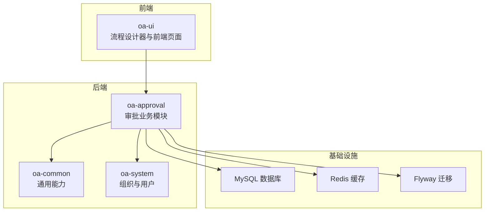
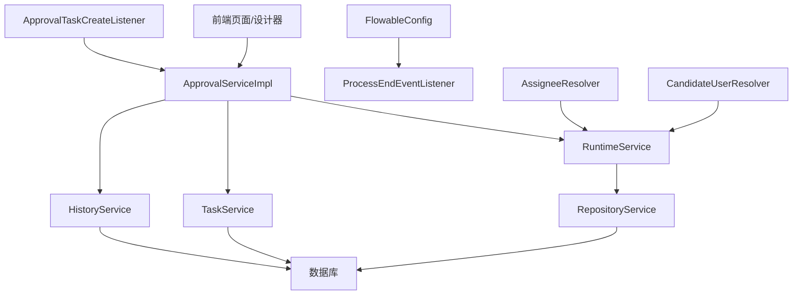
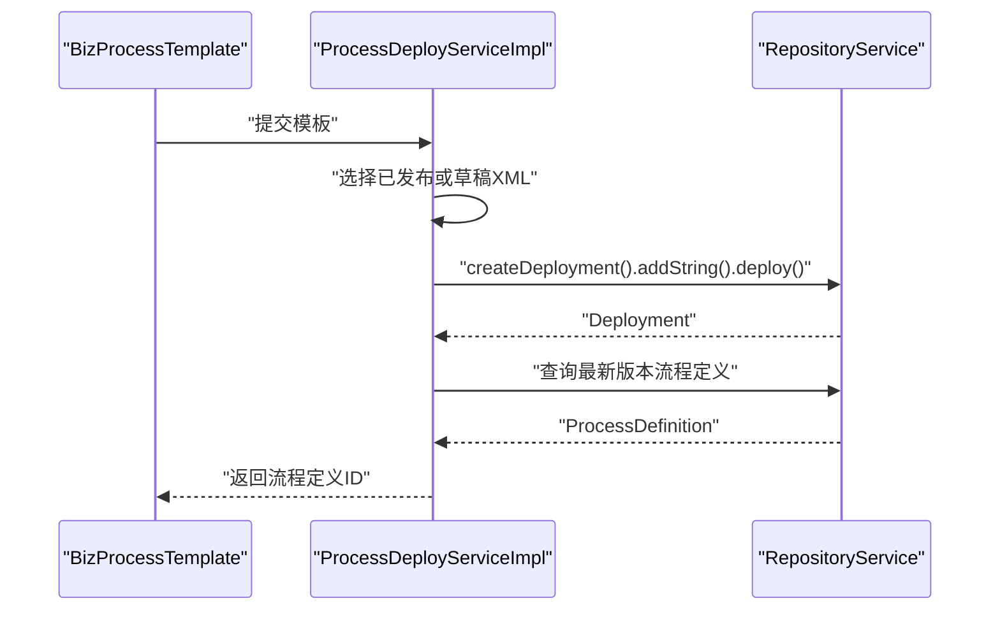
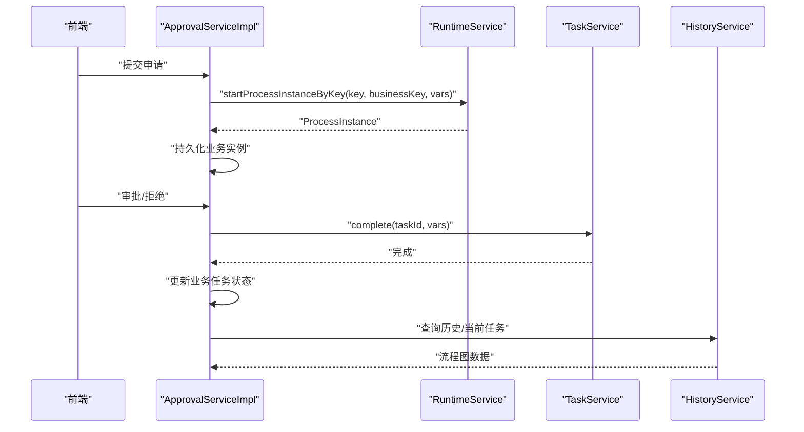
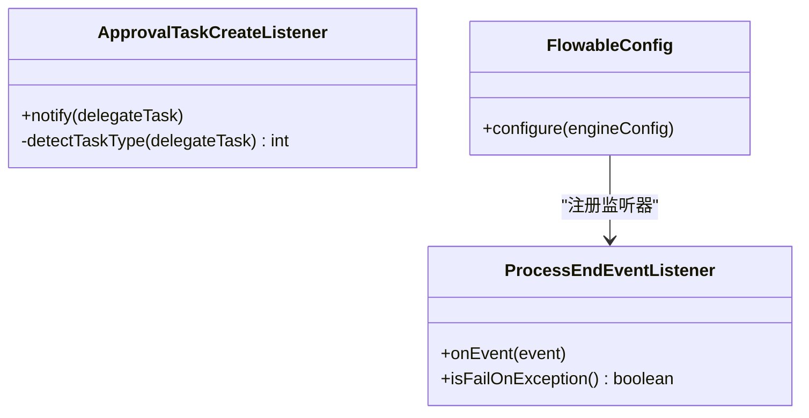
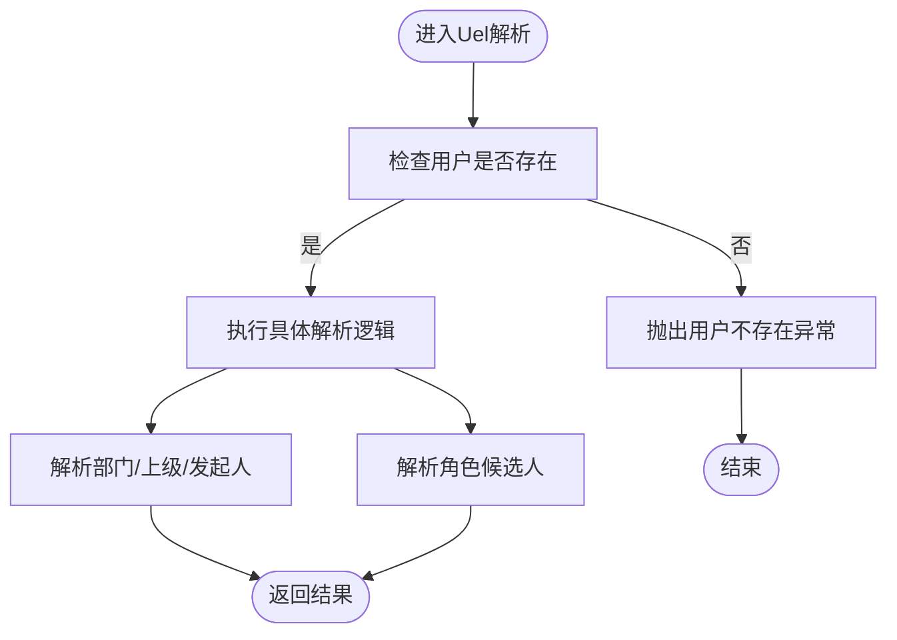
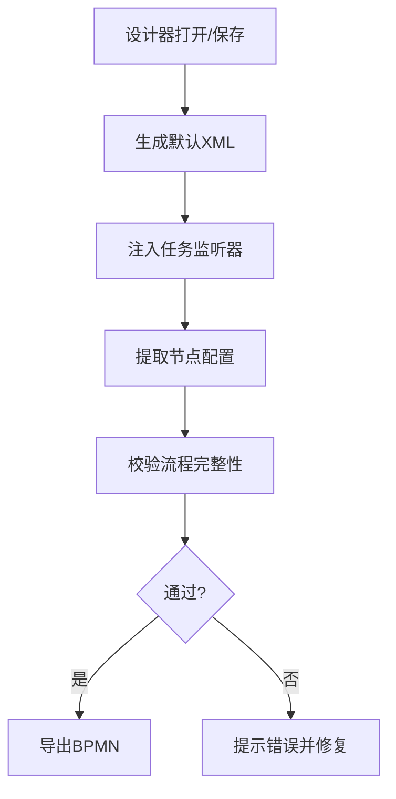
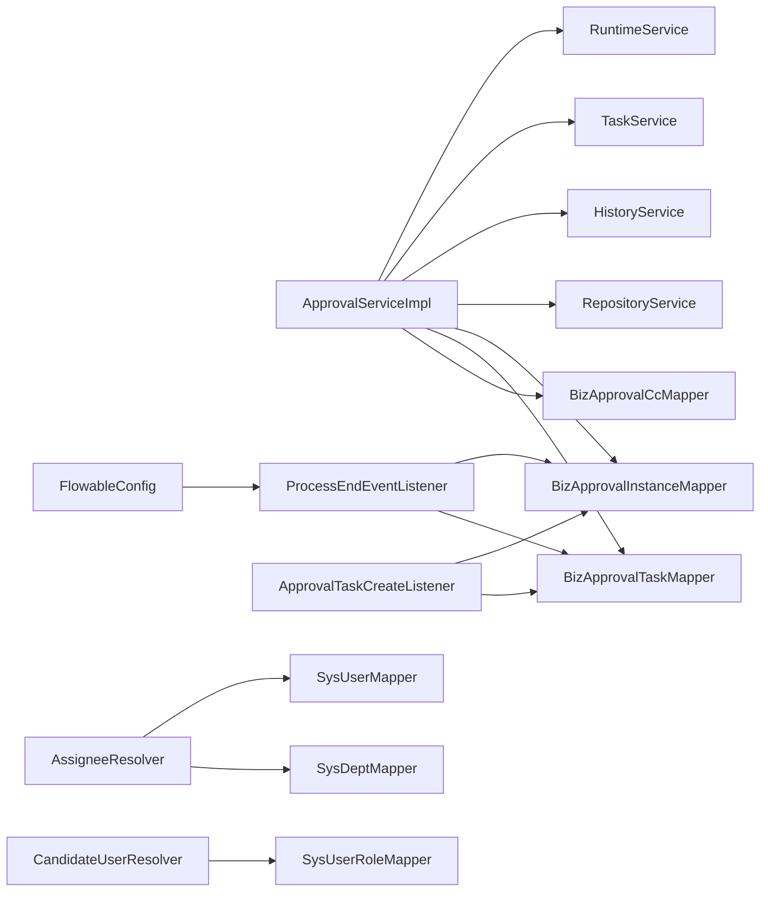

# 工作流问题排查

<cite>
**本文引用的文件**
- [FlowableConfig.java](file://oa-approval/src/main/java/com/oa/admin/approval/config/FlowableConfig.java)
- [ProcessDeployServiceImpl.java](file://oa-approval/src/main/java/com/oa/admin/approval/service/impl/ProcessDeployServiceImpl.java)
- [ApprovalServiceImpl.java](file://oa-approval/src/main/java/com/oa/admin/approval/service/impl/ApprovalServiceImpl.java)
- [ApprovalTaskCreateListener.java](file://oa-approval/src/main/java/com/oa/admin/approval/listener/ApprovalTaskCreateListener.java)
- [ProcessEndEventListener.java](file://oa-approval/src/main/java/com/oa/admin/approval/listener/ProcessEndEventListener.java)
- [AssigneeResolver.java](file://oa-approval/src/main/java/com/oa/admin/approval/resolver/AssigneeResolver.java)
- [CandidateUserResolver.java](file://oa-approval/src/main/java/com/oa/admin/approval/resolver/CandidateUserResolver.java)
- [FlowableConstants.java](file://oa-approval/src/main/java/com/oa/admin/approval/constant/FlowableConstants.java)
- [application.yml](file://oa-app/src/main/resources/application.yml)
- [FlowableGatewayIntegrationTest.java](file://oa-approval/src/test/java/com/oa/admin/approval/integration/FlowableGatewayIntegrationTest.java)
- [ApprovalTaskCreateListenerTest.java](file://oa-approval/src/test/java/com/oa/admin/approval/listener/ApprovalTaskCreateListenerTest.java)
- [AssigneeResolverTest.java](file://oa-approval/src/test/java/com/oa/admin/approval/resolver/AssigneeResolverTest.java)
- [bpmn-utils.test.ts](file://oa-ui/src/bpmn/bpmn-utils.test.ts)
- [bpmn-utils.ts](file://oa-ui/src/bpmn/bpmn-utils.ts)
</cite>

## 目录
1. [简介](#简介)
2. [项目结构](#项目结构)
3. [核心组件](#核心组件)
4. [架构总览](#架构总览)
5. [详细组件分析](#详细组件分析)
6. [依赖分析](#依赖分析)
7. [性能考虑](#性能考虑)
8. [故障排查指南](#故障排查指南)
9. [结论](#结论)
10. [附录](#附录)

## 简介
本指南面向OA审批管理系统的工作流问题排查，聚焦于Flowable引擎相关问题的诊断与修复，涵盖流程定义加载失败、任务分配异常、监听器执行错误、监听器类型（任务创建监听器、流程结束监听器、候选人解析器）调试方法，以及审批流程卡顿、死循环、状态不一致等问题的分析与修复策略。同时提供流程设计器问题排查（BPMN文件导入导出、节点属性配置、条件表达式设置）及工作流性能优化、并发处理、事务管理的排查技巧。

## 项目结构
系统采用多模块分层设计，审批模块与Flowable集成紧密，核心代码集中在oa-approval模块；前端设计器位于oa-ui模块；数据库迁移脚本在oa-app/resources/db/migration中；Flowable运行时配置在application.yml中。

图表来源
- [application.yml:56-59](file://oa-app/src/main/resources/application.yml#L56-L59)

章节来源
- [application.yml:1-59](file://oa-app/src/main/resources/application.yml#L1-L59)

## 核心组件
- Flowable引擎配置：注册流程结束事件监听器，确保流程生命周期关键节点可追踪。
- 流程部署服务：负责将模板中的BPMN XML部署到Flowable，校验资源名称与版本。
- 审批服务：提交、审批、转办、撤销、终止等主流程操作，贯穿RuntimeService、TaskService、HistoryService。
- 监听器：任务创建监听器记录业务任务映射；流程结束监听器计算最终状态并发布事件。
- 解析器：动态Uel解析器，支持部门领导、逐级上级、角色候选人等动态分配。
- 常量：统一Flowable变量名、BPMN文件后缀、UEL条件标识等。

章节来源
- [FlowableConfig.java:15-30](file://oa-approval/src/main/java/com/oa/admin/approval/config/FlowableConfig.java#L15-L30)
- [ProcessDeployServiceImpl.java:24-81](file://oa-approval/src/main/java/com/oa/admin/approval/service/impl/ProcessDeployServiceImpl.java#L24-L81)
- [ApprovalServiceImpl.java:57-792](file://oa-approval/src/main/java/com/oa/admin/approval/service/impl/ApprovalServiceImpl.java#L57-L792)
- [ApprovalTaskCreateListener.java:18-89](file://oa-approval/src/main/java/com/oa/admin/approval/listener/ApprovalTaskCreateListener.java#L18-L89)
- [ProcessEndEventListener.java:26-80](file://oa-approval/src/main/java/com/oa/admin/approval/listener/ProcessEndEventListener.java#L26-L80)
- [AssigneeResolver.java:19-62](file://oa-approval/src/main/java/com/oa/admin/approval/resolver/AssigneeResolver.java#L19-L62)
- [CandidateUserResolver.java:17-31](file://oa-approval/src/main/java/com/oa/admin/approval/resolver/CandidateUserResolver.java#L17-L31)
- [FlowableConstants.java:6-16](file://oa-approval/src/main/java/com/oa/admin/approval/constant/FlowableConstants.java#L6-L16)

## 架构总览
审批服务通过Flowable引擎启动流程实例，业务侧维护业务实例与Flowable任务的映射，并在关键节点触发监听器与事件，最终由流程结束监听器汇总状态并发布应用事件。

图表来源
- [ApprovalServiceImpl.java:114-121](file://oa-approval/src/main/java/com/oa/admin/approval/service/impl/ApprovalServiceImpl.java#L114-L121)
- [FlowableConfig.java:17-29](file://oa-approval/src/main/java/com/oa/admin/approval/config/FlowableConfig.java#L17-L29)
- [ProcessEndEventListener.java:29-63](file://oa-approval/src/main/java/com/oa/admin/approval/listener/ProcessEndEventListener.java#L29-L63)
- [ApprovalTaskCreateListener.java:21-64](file://oa-approval/src/main/java/com/oa/admin/approval/listener/ApprovalTaskCreateListener.java#L21-L64)
- [AssigneeResolver.java:19-62](file://oa-approval/src/main/java/com/oa/admin/approval/resolver/AssigneeResolver.java#L19-L62)
- [CandidateUserResolver.java:17-31](file://oa-approval/src/main/java/com/oa/admin/approval/resolver/CandidateUserResolver.java#L17-L31)

## 详细组件分析

### 组件A：流程部署与定义加载（ProcessDeployServiceImpl）
职责
- 从模板获取BPMN XML，若未发布则回退到草稿XML。
- 使用RepositoryService进行部署，生成部署ID与流程定义。
- 查询最新版本流程定义，校验部署成功并返回流程定义ID。
- 提供从部署中读取BPMN XML的能力，用于展示或审计。

常见问题与排查
- 部署失败：检查模板是否包含有效BPMN XML；确认资源命名以.bpmn20.xml结尾；查看部署日志与异常码。
- 无法查询到流程定义：确认部署ID正确且未被清理；检查数据库中流程定义表是否存在对应记录。
- BPMN XML读取为空：确认部署资源名匹配后缀；捕获读取异常并记录告警。

图表来源
- [ProcessDeployServiceImpl.java:30-58](file://oa-approval/src/main/java/com/oa/admin/approval/service/impl/ProcessDeployServiceImpl.java#L30-L58)

章节来源
- [ProcessDeployServiceImpl.java:24-81](file://oa-approval/src/main/java/com/oa/admin/approval/service/impl/ProcessDeployServiceImpl.java#L24-L81)

### 组件B：审批流程主控制器（ApprovalServiceImpl）
职责
- 提交流程：校验模板状态、构造流程变量（含发起人、表单数据），启动流程实例并持久化业务实例。
- 审批/拒绝：校验任务归属、结果参数合法性，更新业务任务状态，向Flowable提交完成并写入变量。
- 转办/撤销/终止：维护业务状态与Flowable实例状态一致性，清理或终止未完成任务。
- 图形化展示：基于历史活动与当前任务生成流程图节点高亮数据。
- 指标统计：按模板维度统计实例数量与时长等指标。

常见问题与排查
- 提交失败：检查模板状态是否已发布；校验JSON表单字段解析；确认发起人登录态。
- 审批异常：核对任务归属与重复审批；检查变量approved是否正确传递；关注异常码与审计日志。
- 状态不一致：对比业务实例状态与最终流程状态；必要时通过流程结束监听器重算。
- 卡顿/死循环：检查流程图是否存在环路、网关分支条件是否完备；定位长时间挂起的任务。

图表来源
- [ApprovalServiceImpl.java:122-168](file://oa-approval/src/main/java/com/oa/admin/approval/service/impl/ApprovalServiceImpl.java#L122-L168)
- [ApprovalServiceImpl.java:170-240](file://oa-approval/src/main/java/com/oa/admin/approval/service/impl/ApprovalServiceImpl.java#L170-L240)
- [ApprovalServiceImpl.java:346-398](file://oa-approval/src/main/java/com/oa/admin/approval/service/impl/ApprovalServiceImpl.java#L346-L398)

章节来源
- [ApprovalServiceImpl.java:57-792](file://oa-approval/src/main/java/com/oa/admin/approval/service/impl/ApprovalServiceImpl.java#L57-L792)

### 组件C：监听器与事件（ApprovalTaskCreateListener、ProcessEndEventListener）
职责
- 任务创建监听器：在Flowable任务创建时，将Flowable任务映射为业务任务，记录任务类型（普通、会签、或签）。
- 流程结束监听器：在流程结束事件中，根据业务任务结果汇总最终状态，更新业务实例并发布应用事件。

常见问题与排查
- 任务创建监听器未生效：确认监听器已注册到引擎；检查任务是否带指派人；核对业务实例映射。
- 任务类型误判：检查多实例变量nrOfInstances与completionCondition；确认UEL条件字符串。
- 流程结束监听器异常：确认isFailOnException设置；检查业务任务查询与状态计算逻辑。

图表来源
- [ApprovalTaskCreateListener.java:21-89](file://oa-approval/src/main/java/com/oa/admin/approval/listener/ApprovalTaskCreateListener.java#L21-L89)
- [ProcessEndEventListener.java:29-80](file://oa-approval/src/main/java/com/oa/admin/approval/listener/ProcessEndEventListener.java#L29-L80)
- [FlowableConfig.java:17-29](file://oa-approval/src/main/java/com/oa/admin/approval/config/FlowableConfig.java#L17-L29)

章节来源
- [ApprovalTaskCreateListener.java:18-89](file://oa-approval/src/main/java/com/oa/admin/approval/listener/ApprovalTaskCreateListener.java#L18-L89)
- [ProcessEndEventListener.java:26-80](file://oa-approval/src/main/java/com/oa/admin/approval/listener/ProcessEndEventListener.java#L26-L80)
- [FlowableConfig.java:15-30](file://oa-approval/src/main/java/com/oa/admin/approval/config/FlowableConfig.java#L15-L30)

### 组件D：动态候选人与指派解析（AssigneeResolver、CandidateUserResolver）
职责
- 指派解析器：根据用户ID解析部门领导、逐级上级领导、发起人等。
- 候选人解析器：根据角色ID解析候选用户列表，支持多实例（会签/或签）集合。

常见问题与排查
- 解析器抛异常：检查用户/部门/角色是否存在；确认树形结构是否到达根节点；核对异常码。
- 多实例候选人为空：确认角色用户关联是否存在；检查解析器返回值。

图表来源
- [AssigneeResolver.java:26-56](file://oa-approval/src/main/java/com/oa/admin/approval/resolver/AssigneeResolver.java#L26-L56)
- [CandidateUserResolver.java:23-29](file://oa-approval/src/main/java/com/oa/admin/approval/resolver/CandidateUserResolver.java#L23-L29)

章节来源
- [AssigneeResolver.java:19-62](file://oa-approval/src/main/java/com/oa/admin/approval/resolver/AssigneeResolver.java#L19-L62)
- [CandidateUserResolver.java:17-31](file://oa-approval/src/main/java/com/oa/admin/approval/resolver/CandidateUserResolver.java#L17-L31)

### 组件E：流程设计器与校验（前端）
职责
- 生成默认BPMN XML、提取节点配置、注入任务监听器、校验流程完整性（开始/结束事件、连线、网关分支数）。

常见问题与排查
- 导入/导出异常：确认文件后缀与内容格式；校验XML命名空间与executable标记。
- 节点属性缺失：检查flowable扩展属性是否正确写入；验证文档节点与自定义属性映射。
- 条件表达式错误：核对UEL语法与监听器注入；避免空表达式导致分支不可达。

图表来源
- [bpmn-utils.test.ts:28-38](file://oa-ui/src/bpmn/bpmn-utils.test.ts#L28-L38)
- [bpmn-utils.test.ts:144-185](file://oa-ui/src/bpmn/bpmn-utils.test.ts#L144-L185)
- [bpmn-utils.test.ts:247-261](file://oa-ui/src/bpmn/bpmn-utils.test.ts#L247-L261)
- [bpmn-utils.ts:132-153](file://oa-ui/src/bpmn/bpmn-utils.ts#L132-L153)

章节来源
- [bpmn-utils.test.ts:1-261](file://oa-ui/src/bpmn/bpmn-utils.test.ts#L1-L261)
- [bpmn-utils.ts:112-153](file://oa-ui/src/bpmn/bpmn-utils.ts#L112-L153)

## 依赖分析
- 审批服务依赖Flowable四大Service与业务Mapper；流程结束监听器依赖业务Mapper与事件发布器；解析器依赖系统模块Mapper。
- 引擎配置集中注册流程结束监听器，保证全局生效。
- 前端工具链对BPMN文件进行预处理与校验，减少后端部署风险。

图表来源
- [ApprovalServiceImpl.java:114-121](file://oa-approval/src/main/java/com/oa/admin/approval/service/impl/ApprovalServiceImpl.java#L114-L121)
- [FlowableConfig.java:18-28](file://oa-approval/src/main/java/com/oa/admin/approval/config/FlowableConfig.java#L18-L28)
- [ProcessEndEventListener.java:30-32](file://oa-approval/src/main/java/com/oa/admin/approval/listener/ProcessEndEventListener.java#L30-L32)
- [ApprovalTaskCreateListener.java:22-23](file://oa-approval/src/main/java/com/oa/admin/approval/listener/ApprovalTaskCreateListener.java#L22-L23)
- [AssigneeResolver.java:23-24](file://oa-approval/src/main/java/com/oa/admin/approval/resolver/AssigneeResolver.java#L23-L24)
- [CandidateUserResolver.java:21](file://oa-approval/src/main/java/com/oa/admin/approval/resolver/CandidateUserResolver.java#L21)

章节来源
- [FlowableConfig.java:15-30](file://oa-approval/src/main/java/com/oa/admin/approval/config/FlowableConfig.java#L15-L30)
- [ProcessEndEventListener.java:26-80](file://oa-approval/src/main/java/com/oa/admin/approval/listener/ProcessEndEventListener.java#L26-L80)
- [ApprovalTaskCreateListener.java:18-89](file://oa-approval/src/main/java/com/oa/admin/approval/listener/ApprovalTaskCreateListener.java#L18-L89)
- [AssigneeResolver.java:19-62](file://oa-approval/src/main/java/com/oa/admin/approval/resolver/AssigneeResolver.java#L19-L62)
- [CandidateUserResolver.java:17-31](file://oa-approval/src/main/java/com/oa/admin/approval/resolver/CandidateUserResolver.java#L17-L31)

## 性能考虑
- 并发与事务
  - 所有业务操作使用@Transactional，确保流程与业务状态一致性。
  - 注意避免在监听器中执行耗时操作，必要时异步化。
- 数据访问
  - 合理使用MyBatis-Plus分页查询与条件构造器，避免N+1查询。
- 引擎配置
  - application.yml中async-executor-activate关闭，适合中小规模场景；如需高并发可评估开启异步执行器并配合线程池参数调优。
- 历史数据
  - 审计与历史查询较多时，建议定期归档历史数据，控制历史表增长。

章节来源
- [application.yml:56-59](file://oa-app/src/main/resources/application.yml#L56-L59)
- [ApprovalServiceImpl.java:122-168](file://oa-approval/src/main/java/com/oa/admin/approval/service/impl/ApprovalServiceImpl.java#L122-L168)

## 故障排查指南

### 一、流程定义加载失败
症状
- 部署后无法查询到流程定义；提交流程时报“模板未发布”或“流程定义不存在”。

排查步骤
- 确认模板包含有效BPMN XML（优先发布版，否则回退草稿）。
- 校验资源命名后缀为.bpmn20.xml或.bpmn。
- 查看部署日志与异常码，确认RepositoryService部署成功并返回最新版本流程定义。

章节来源
- [ProcessDeployServiceImpl.java:30-58](file://oa-approval/src/main/java/com/oa/admin/approval/service/impl/ProcessDeployServiceImpl.java#L30-L58)

### 二、任务分配异常
症状
- 任务创建但无人指派；或指派ID非数字格式；或候选人解析失败。

排查步骤
- 核查任务创建监听器是否注册并生效；确认任务创建时存在assignee。
- 检查Uel解析器返回值是否为数字ID；核对用户/部门/角色是否存在。
- 对多实例任务，确认nrOfInstances与completionCondition变量是否正确注入。

章节来源
- [ApprovalTaskCreateListener.java:25-64](file://oa-approval/src/main/java/com/oa/admin/approval/listener/ApprovalTaskCreateListener.java#L25-L64)
- [AssigneeResolver.java:26-56](file://oa-approval/src/main/java/com/oa/admin/approval/resolver/AssigneeResolver.java#L26-L56)
- [CandidateUserResolver.java:23-29](file://oa-approval/src/main/java/com/oa/admin/approval/resolver/CandidateUserResolver.java#L23-L29)

### 三、监听器执行错误
症状
- 任务创建后业务任务未入库；流程结束监听器未更新最终状态。

排查步骤
- 确认流程结束监听器已注册到SpringProcessEngineConfiguration。
- 检查监听器isFailOnException设置；核对业务任务查询与状态计算逻辑。
- 使用单元测试验证监听器行为（参考测试用例）。

章节来源
- [FlowableConfig.java:17-29](file://oa-approval/src/main/java/com/oa/admin/approval/config/FlowableConfig.java#L17-L29)
- [ProcessEndEventListener.java:34-63](file://oa-approval/src/main/java/com/oa/admin/approval/listener/ProcessEndEventListener.java#L34-L63)
- [ApprovalTaskCreateListenerTest.java:48-100](file://oa-approval/src/test/java/com/oa/admin/approval/listener/ApprovalTaskCreateListenerTest.java#L48-L100)

### 四、审批流程卡顿、死循环、状态不一致
症状
- 流程长时间挂起；网关分支条件缺失导致死循环；最终状态与业务实例不一致。

排查步骤
- 使用流程图接口获取已完成与当前节点，定位卡顿节点。
- 检查网关分支条件表达式是否完备；确保每个分支都有明确路径。
- 通过流程结束监听器重算最终状态，必要时人工干预终止实例。

章节来源
- [ApprovalServiceImpl.java:346-398](file://oa-approval/src/main/java/com/oa/admin/approval/service/impl/ApprovalServiceImpl.java#L346-L398)
- [ApprovalServiceImpl.java:664-705](file://oa-approval/src/main/java/com/oa/admin/approval/service/impl/ApprovalServiceImpl.java#L664-L705)
- [ProcessEndEventListener.java:44-60](file://oa-approval/src/main/java/com/oa/admin/approval/listener/ProcessEndEventListener.java#L44-L60)

### 五、流程设计器问题排查
症状
- BPMN导入/导出失败；节点属性丢失；条件表达式无效。

排查步骤
- 校验XML命名空间与isExecutable标记；确认元素id/name正确。
- 检查flowable扩展属性是否写入到文档节点或$attrs；核对自定义属性映射。
- 使用前端校验函数validateProcess检查开始/结束事件、连线与网关分支数。

章节来源
- [bpmn-utils.test.ts:144-185](file://oa-ui/src/bpmn/bpmn-utils.test.ts#L144-L185)
- [bpmn-utils.ts:112-153](file://oa-ui/src/bpmn/bpmn-utils.ts#L112-L153)

### 六、并发处理与事务管理
症状
- 高并发下出现重复任务或状态竞争。

排查步骤
- 确保所有业务操作在@Transactional中；在监听器中避免阻塞操作。
- 对高并发场景评估启用异步执行器并调整线程池参数（参考引擎配置）。

章节来源
- [application.yml:56-59](file://oa-app/src/main/resources/application.yml#L56-L59)
- [ApprovalServiceImpl.java:122-168](file://oa-approval/src/main/java/com/oa/admin/approval/service/impl/ApprovalServiceImpl.java#L122-L168)

## 结论
本指南围绕Flowable引擎在OA审批系统中的关键环节提供了系统化的排查思路与修复方法。通过规范流程定义加载、完善监听器与解析器、加强设计器校验与历史数据治理，可显著降低流程卡顿、死循环与状态不一致的风险。同时，结合事务与并发策略，可在保证一致性的同时提升系统整体性能。

## 附录
- 常用变量与后缀
  - 变量名：发起人、审批结果
  - 文件后缀：.bpmn20.xml、.bpmn
  - UEL条件标识：或签条件表达式
- 关键测试参考
  - 监听器行为测试
  - 解析器异常场景测试
  - 集成测试中注册Uel解析器与监听器

章节来源
- [FlowableConstants.java:6-16](file://oa-approval/src/main/java/com/oa/admin/approval/constant/FlowableConstants.java#L6-L16)
- [ApprovalTaskCreateListenerTest.java:48-100](file://oa-approval/src/test/java/com/oa/admin/approval/listener/ApprovalTaskCreateListenerTest.java#L48-L100)
- [AssigneeResolverTest.java:46-98](file://oa-approval/src/test/java/com/oa/admin/approval/resolver/AssigneeResolverTest.java#L46-L98)
- [FlowableGatewayIntegrationTest.java:35-42](file://oa-approval/src/test/java/com/oa/admin/approval/integration/FlowableGatewayIntegrationTest.java#L35-L42)