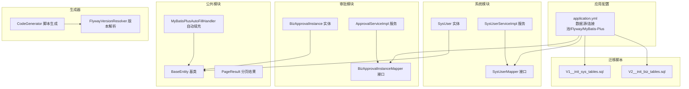
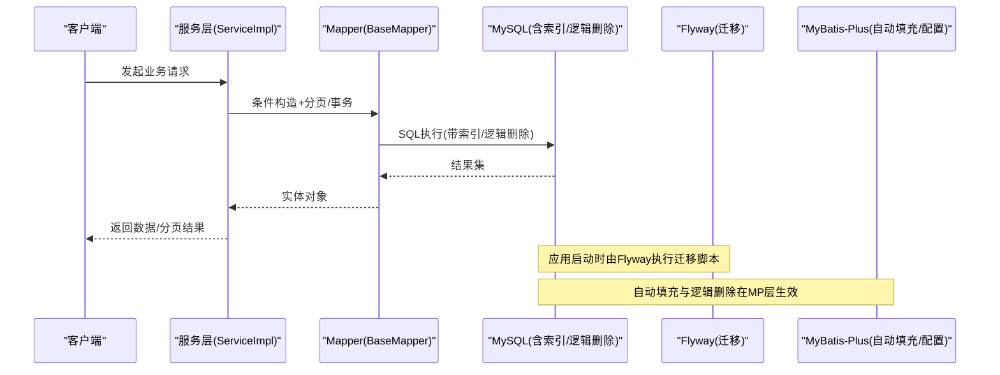
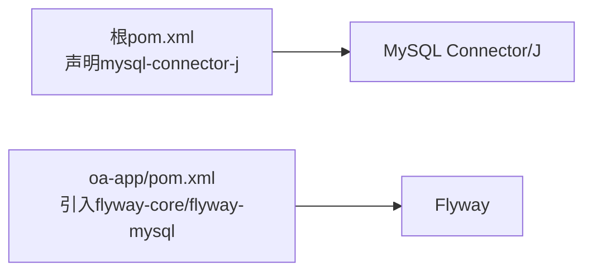

# 数据库问题排查

<cite>
**本文引用的文件**   
- [application.yml](file://oa-app/src/main/resources/application.yml)
- [MyBatisPlusAutoFillHandler.java](file://oa-common/src/main/java/com/oa/admin/common/config/MyBatisPlusAutoFillHandler.java)
- [BaseEntity.java](file://oa-common/src/main/java/com/oa/admin/common/entity/BaseEntity.java)
- [V1__init_sys_tables.sql](file://oa-app/src/main/resources/db/migration/V1__init_sys_tables.sql)
- [V2__init_biz_tables.sql](file://oa-app/src/main/resources/db/migration/V2__init_biz_tables.sql)
- [SysUser.java](file://oa-system/src/main/java/com/oa/admin/system/entity/SysUser.java)
- [BizApprovalInstance.java](file://oa-approval/src/main/java/com/oa/admin/approval/entity/BizApprovalInstance.java)
- [SysUserMapper.java](file://oa-system/src/main/java/com/oa/admin/system/mapper/SysUserMapper.java)
- [BizApprovalInstanceMapper.java](file://oa-approval/src/main/java/com/oa/admin/approval/mapper/BizApprovalInstanceMapper.java)
- [SysUserServiceImpl.java](file://oa-system/src/main/java/com/oa/admin/system/service/impl/SysUserServiceImpl.java)
- [ApprovalServiceImpl.java](file://oa-approval/src/main/java/com/oa/admin/approval/service/impl/ApprovalServiceImpl.java)
- [PageResult.java](file://oa-common/src/main/java/com/oa/admin/common/result/PageResult.java)
- [FlywayVersionResolver.java](file://oa-generator/src/main/java/com/oa/admin/generator/engine/FlywayVersionResolver.java)
- [CodeGenerator.java](file://oa-generator/src/main/java/com/oa/admin/generator/engine/CodeGenerator.java)
- [pom.xml（根）](file://pom.xml)
- [pom.xml（oa-app）](file://oa-app/pom.xml)
</cite>

## 目录
1. [简介](#简介)
2. [项目结构](#项目结构)
3. [核心组件](#核心组件)
4. [架构总览](#架构总览)
5. [详细组件分析](#详细组件分析)
6. [依赖分析](#依赖分析)
7. [性能考虑](#性能考虑)
8. [故障排查指南](#故障排查指南)
9. [结论](#结论)
10. [附录](#附录)

## 简介
本指南面向OA审批管理系统的数据库问题排查与优化，覆盖以下主题：
- 连接问题：连接超时、连接池耗尽、驱动与URL配置
- 迁移问题：Flyway版本冲突、迁移脚本执行失败、数据不一致
- ORM问题：MyBatis-Plus实体映射、自动填充、分页查询
- 性能优化：慢查询定位、索引策略、查询重写
- 高级主题：备份恢复、主从复制、事务处理

## 项目结构
系统采用多模块结构，数据库相关的关键位置如下：
- 数据源与连接池、Flyway迁移、MyBatis-Plus全局配置集中在应用资源文件
- 实体与Mapper位于各自业务模块
- 迁移脚本集中于db/migration目录
- 生成器模块提供Flyway版本解析与脚本生成能力

图表来源
- [application.yml:4-44](file://oa-app/src/main/resources/application.yml#L4-L44)
- [SysUser.java:16-26](file://oa-system/src/main/java/com/oa/admin/system/entity/SysUser.java#L16-L26)
- [BizApprovalInstance.java:19-32](file://oa-approval/src/main/java/com/oa/admin/approval/entity/BizApprovalInstance.java#L19-L32)
- [SysUserMapper.java:11-12](file://oa-system/src/main/java/com/oa/admin/system/mapper/SysUserMapper.java#L11-L12)
- [BizApprovalInstanceMapper.java:11-12](file://oa-approval/src/main/java/com/oa/admin/approval/mapper/BizApprovalInstanceMapper.java#L11-L12)
- [SysUserServiceImpl.java:24-36](file://oa-system/src/main/java/com/oa/admin/system/service/impl/SysUserServiceImpl.java#L24-L36)
- [ApprovalServiceImpl.java:60-61](file://oa-approval/src/main/java/com/oa/admin/approval/service/impl/ApprovalServiceImpl.java#L60-L61)
- [MyBatisPlusAutoFillHandler.java:12-24](file://oa-common/src/main/java/com/oa/admin/common/config/MyBatisPlusAutoFillHandler.java#L12-L24)
- [BaseEntity.java:14-25](file://oa-common/src/main/java/com/oa/admin/common/entity/BaseEntity.java#L14-L25)
- [V1__init_sys_tables.sql:1-84](file://oa-app/src/main/resources/db/migration/V1__init_sys_tables.sql#L1-L84)
- [V2__init_biz_tables.sql:1-74](file://oa-app/src/main/resources/db/migration/V2__init_biz_tables.sql#L1-L74)
- [FlywayVersionResolver.java:13-35](file://oa-generator/src/main/java/com/oa/admin/generator/engine/FlywayVersionResolver.java#L13-L35)
- [CodeGenerator.java:116-133](file://oa-generator/src/main/java/com/oa/admin/generator/engine/CodeGenerator.java#L116-L133)

章节来源
- [application.yml:4-44](file://oa-app/src/main/resources/application.yml#L4-L44)
- [V1__init_sys_tables.sql:1-84](file://oa-app/src/main/resources/db/migration/V1__init_sys_tables.sql#L1-L84)
- [V2__init_biz_tables.sql:1-74](file://oa-app/src/main/resources/db/migration/V2__init_biz_tables.sql#L1-L74)

## 核心组件
- 数据源与连接池：基于HikariCP，默认池大小、超时、空闲生命周期、预编译缓存等参数可调
- Flyway迁移：启用classpath:db/migration，基线迁移开启，占位符替换关闭
- MyBatis-Plus：下划线到驼峰映射、逻辑删除字段与值、全局自动填充处理器
- 实体基类：统一createdAt/updatedAt时间字段与deleted逻辑删除字段
- 业务实体：系统用户与审批实例均继承基类，确保自动填充与逻辑删除生效
- Mapper接口：基于BaseMapper，提供通用CRUD与分页能力
- 服务层：使用分页Page与Lambda条件构造器，结合事务注解保证一致性

章节来源
- [application.yml:4-44](file://oa-app/src/main/resources/application.yml#L4-L44)
- [MyBatisPlusAutoFillHandler.java:12-24](file://oa-common/src/main/java/com/oa/admin/common/config/MyBatisPlusAutoFillHandler.java#L12-L24)
- [BaseEntity.java:14-25](file://oa-common/src/main/java/com/oa/admin/common/entity/BaseEntity.java#L14-L25)
- [SysUser.java:16-26](file://oa-system/src/main/java/com/oa/admin/system/entity/SysUser.java#L16-L26)
- [BizApprovalInstance.java:19-32](file://oa-approval/src/main/java/com/oa/admin/approval/entity/BizApprovalInstance.java#L19-L32)
- [SysUserMapper.java:11-12](file://oa-system/src/main/java/com/oa/admin/system/mapper/SysUserMapper.java#L11-L12)
- [BizApprovalInstanceMapper.java:11-12](file://oa-approval/src/main/java/com/oa/admin/approval/mapper/BizApprovalInstanceMapper.java#L11-L12)
- [SysUserServiceImpl.java:24-36](file://oa-system/src/main/java/com/oa/admin/system/service/impl/SysUserServiceImpl.java#L24-L36)
- [ApprovalServiceImpl.java:60-61](file://oa-approval/src/main/java/com/oa/admin/approval/service/impl/ApprovalServiceImpl.java#L60-L61)

## 架构总览
数据库交互链路概览：

图表来源
- [application.yml:4-44](file://oa-app/src/main/resources/application.yml#L4-L44)
- [SysUserServiceImpl.java:24-36](file://oa-system/src/main/java/com/oa/admin/system/service/impl/SysUserServiceImpl.java#L24-L36)
- [ApprovalServiceImpl.java:60-61](file://oa-approval/src/main/java/com/oa/admin/approval/service/impl/ApprovalServiceImpl.java#L60-L61)
- [MyBatisPlusAutoFillHandler.java:12-24](file://oa-common/src/main/java/com/oa/admin/common/config/MyBatisPlusAutoFillHandler.java#L12-L24)
- [V1__init_sys_tables.sql:1-84](file://oa-app/src/main/resources/db/migration/V1__init_sys_tables.sql#L1-L84)
- [V2__init_biz_tables.sql:1-74](file://oa-app/src/main/resources/db/migration/V2__init_biz_tables.sql#L1-L74)

## 详细组件分析

### 数据库连接与连接池
- 关键配置项
  - JDBC URL、用户名、密码、驱动类名
  - Hikari连接池：最大池大小、最小空闲、连接超时、空闲超时、最大存活时间、连接测试查询、泄漏检测阈值、预编译语句缓存参数
- 常见问题与排查
  - 连接超时：检查连接超时与最大池大小；确认数据库网络连通性与防火墙策略
  - 连接池耗尽：监控活跃连接数与等待队列；优化慢查询与事务时长；调整最大池大小与空闲回收策略
  - 驱动与URL：确保URL包含时区与字符集设置；避免SSL与公钥检索相关警告
- 参考配置路径
  - [application.yml:5-24](file://oa-app/src/main/resources/application.yml#L5-L24)

章节来源
- [application.yml:5-24](file://oa-app/src/main/resources/application.yml#L5-L24)

### Flyway迁移与版本管理
- 启用与位置：classpath:db/migration，启用基线迁移，禁用占位符替换
- 版本解析：生成器使用正则解析现有Vn__描述文件，推导下一个版本号
- 常见问题与排查
  - 版本冲突：检查db/migration中是否存在重复版本或命名冲突；使用版本解析器确认下一个版本
  - 迁移失败：查看具体SQL语法与表/列存在性；确认数据库权限与字符集兼容
  - 数据不一致：核对迁移顺序与依赖；必要时手动清理或回滚并重新执行
- 参考实现路径
  - [application.yml:25-29](file://oa-app/src/main/resources/application.yml#L25-L29)
  - [FlywayVersionResolver.java:13-35](file://oa-generator/src/main/java/com/oa/admin/generator/engine/FlywayVersionResolver.java#L13-L35)
  - [CodeGenerator.java:116-133](file://oa-generator/src/main/java/com/oa/admin/generator/engine/CodeGenerator.java#L116-L133)

章节来源
- [application.yml:25-29](file://oa-app/src/main/resources/application.yml#L25-L29)
- [FlywayVersionResolver.java:13-35](file://oa-generator/src/main/java/com/oa/admin/generator/engine/FlywayVersionResolver.java#L13-L35)
- [CodeGenerator.java:116-133](file://oa-generator/src/main/java/com/oa/admin/generator/engine/CodeGenerator.java#L116-L133)

### MyBatis-Plus实体映射与自动填充
- 实体基类与自动填充
  - BaseEntity统一createdAt/updatedAt与deleted字段
  - MyBatisPlusAutoFillHandler在插入/更新时严格填充时间字段
- 常见问题与排查
  - 映射错误：确认实体类的@TableId/@TableName/@TableField注解与数据库列名一致；启用下划线到驼峰映射
  - 自动填充异常：检查MetaObjectHandler是否注册；确认字段类型与LocalDateTime匹配
  - 逻辑删除：确保deleted字段存在且值配置正确；查询时注意默认过滤逻辑删除数据
- 参考实现路径
  - [BaseEntity.java:14-25](file://oa-common/src/main/java/com/oa/admin/common/entity/BaseEntity.java#L14-L25)
  - [MyBatisPlusAutoFillHandler.java:12-24](file://oa-common/src/main/java/com/oa/admin/common/config/MyBatisPlusAutoFillHandler.java#L12-L24)
  - [application.yml:36-44](file://oa-app/src/main/resources/application.yml#L36-L44)

章节来源
- [BaseEntity.java:14-25](file://oa-common/src/main/java/com/oa/admin/common/entity/BaseEntity.java#L14-L25)
- [MyBatisPlusAutoFillHandler.java:12-24](file://oa-common/src/main/java/com/oa/admin/common/config/MyBatisPlusAutoFillHandler.java#L12-L24)
- [application.yml:36-44](file://oa-app/src/main/resources/application.yml#L36-L44)

### 分页查询与查询条件
- 分页模型：PageResult封装列表、总数、页码、页大小
- 查询模式：服务层广泛使用LambdaQueryWrapper进行条件拼装与排序
- 常见问题与排查
  - 分页不准确：确认总数统计与分页边界；避免在大结果集上进行复杂JOIN导致性能下降
  - 条件遗漏：检查like/eq/in/排序字段是否覆盖所有查询场景
- 参考实现路径
  - [PageResult.java:9-22](file://oa-common/src/main/java/com/oa/admin/common/result/PageResult.java#L9-L22)
  - [SysUserServiceImpl.java:24-36](file://oa-system/src/main/java/com/oa/admin/system/service/impl/SysUserServiceImpl.java#L24-L36)
  - [ApprovalServiceImpl.java:319-335](file://oa-approval/src/main/java/com/oa/admin/approval/service/impl/ApprovalServiceImpl.java#L319-L335)

章节来源
- [PageResult.java:9-22](file://oa-common/src/main/java/com/oa/admin/common/result/PageResult.java#L9-L22)
- [SysUserServiceImpl.java:24-36](file://oa-system/src/main/java/com/oa/admin/system/service/impl/SysUserServiceImpl.java#L24-L36)
- [ApprovalServiceImpl.java:319-335](file://oa-approval/src/main/java/com/oa/admin/approval/service/impl/ApprovalServiceImpl.java#L319-L335)

### 数据模型与索引
- 系统表与业务表：包含部门、用户、角色、权限、审批模板、实例、任务、抄送、审计日志等
- 索引设计：常见复合索引与单列索引用于高频查询字段
- 常见问题与排查
  - 索引失效：检查查询谓词是否命中索引；避免在索引列上使用函数或隐式转换
  - 统计信息：定期更新表统计信息以提升优化器选择性
- 参考实现路径
  - [V1__init_sys_tables.sql:1-84](file://oa-app/src/main/resources/db/migration/V1__init_sys_tables.sql#L1-L84)
  - [V2__init_biz_tables.sql:1-74](file://oa-app/src/main/resources/db/migration/V2__init_biz_tables.sql#L1-L74)

章节来源
- [V1__init_sys_tables.sql:1-84](file://oa-app/src/main/resources/db/migration/V1__init_sys_tables.sql#L1-L84)
- [V2__init_biz_tables.sql:1-74](file://oa-app/src/main/resources/db/migration/V2__init_biz_tables.sql#L1-L74)

## 依赖分析
- 数据库驱动：根pom声明mysql-connector-j
- 迁移工具：oa-app模块引入flyway-core与flyway-mysql
- 运行环境：Spring Boot Starter Data Redis（非数据库但影响整体配置）

图表来源
- [pom.xml（根）:106-112](file://pom.xml#L106-L112)
- [pom.xml（oa-app）:41-47](file://oa-app/pom.xml#L41-L47)

章节来源
- [pom.xml（根）:106-112](file://pom.xml#L106-L112)
- [pom.xml（oa-app）:41-47](file://oa-app/pom.xml#L41-L47)

## 性能考虑
- 慢查询分析
  - 使用数据库慢查询日志与执行计划分析高成本SQL
  - 关注LIKE“%xxx”前缀匹配、隐式转换、全表扫描
- 索引优化
  - 为高频过滤与排序字段建立合适索引；避免冗余索引
  - 定期评估索引使用率与维护成本
- 查询重写
  - 将复杂子查询改写为JOIN或EXISTS
  - 控制SELECT字段数量，避免不必要的TEXT/BLOB读取
- 连接池与事务
  - 缩短事务时长，减少锁竞争
  - 合理设置连接池参数，避免过度并发导致上下文切换开销

## 故障排查指南

### 数据库连接问题
- 连接超时
  - 现象：获取连接超时或SQL执行超时
  - 排查要点：检查连接池最大池大小与连接超时；确认数据库负载与网络延迟
  - 参考路径：[application.yml:10-17](file://oa-app/src/main/resources/application.yml#L10-L17)
- 连接池耗尽
  - 现象：大量等待获取连接
  - 排查要点：监控活跃连接数；检查长时间事务与未释放资源；适当增大池大小或缩短空闲回收时间
  - 参考路径：[application.yml:11-16](file://oa-app/src/main/resources/application.yml#L11-L16)
- SQL语法错误
  - 现象：迁移或运行时报SQL语法错误
  - 排查要点：逐条核对迁移脚本；确认MySQL版本与SQL方言兼容性
  - 参考路径：[V1__init_sys_tables.sql:1-84](file://oa-app/src/main/resources/db/migration/V1__init_sys_tables.sql#L1-L84)、[V2__init_biz_tables.sql:1-74](file://oa-app/src/main/resources/db/migration/V2__init_biz_tables.sql#L1-L74)
- 索引失效
  - 现象：查询变慢、执行计划不走预期索引
  - 排查要点：检查WHERE谓词是否命中索引；避免在索引列上使用函数或隐式转换
  - 参考路径：[V1__init_sys_tables.sql:15-31](file://oa-app/src/main/resources/db/migration/V1__init_sys_tables.sql#L15-L31)、[V2__init_biz_tables.sql:30-58](file://oa-app/src/main/resources/db/migration/V2__init_biz_tables.sql#L30-L58)

### 数据库迁移问题
- 版本冲突
  - 现象：Flyway报告重复版本或无法确定下一个版本
  - 排查要点：检查db/migration命名格式；使用版本解析器确认当前最大版本
  - 参考路径：[FlywayVersionResolver.java:13-35](file://oa-generator/src/main/java/com/oa/admin/generator/engine/FlywayVersionResolver.java#L13-L35)、[CodeGenerator.java:116-133](file://oa-generator/src/main/java/com/oa/admin/generator/engine/CodeGenerator.java#L116-L133)
- 迁移脚本执行失败
  - 现象：迁移阶段报错
  - 排查要点：逐条验证DDL与DML；确认数据库权限与字符集；必要时回滚后修复
  - 参考路径：[application.yml:25-29](file://oa-app/src/main/resources/application.yml#L25-L29)
- 数据不一致
  - 现象：迁移后业务数据异常
  - 排查要点：比对迁移顺序与依赖；核对约束与默认值；必要时进行数据修复

### MyBatis-Plus相关问题
- 实体映射错误
  - 现象：字段名不匹配、空值或类型不一致
  - 排查要点：检查@TableId/@TableName/@TableField注解；确认下划线到驼峰映射已启用
  - 参考路径：[application.yml:36-38](file://oa-app/src/main/resources/application.yml#L36-L38)、[SysUser.java:16-26](file://oa-system/src/main/java/com/oa/admin/system/entity/SysUser.java#L16-L26)、[BizApprovalInstance.java:19-32](file://oa-approval/src/main/java/com/oa/admin/approval/entity/BizApprovalInstance.java#L19-L32)
- 自动填充异常
  - 现象：createdAt/updatedAt缺失或为空
  - 排查要点：确认MetaObjectHandler注册；检查字段类型与LocalDateTime一致性
  - 参考路径：[MyBatisPlusAutoFillHandler.java:12-24](file://oa-common/src/main/java/com/oa/admin/common/config/MyBatisPlusAutoFillHandler.java#L12-L24)、[BaseEntity.java:14-25](file://oa-common/src/main/java/com/oa/admin/common/entity/BaseEntity.java#L14-L25)
- 分页查询问题
  - 现象：分页总数不准或数据错乱
  - 排查要点：确认分页参数与排序字段；避免在大数据量上进行复杂JOIN
  - 参考路径：[PageResult.java:9-22](file://oa-common/src/main/java/com/oa/admin/common/result/PageResult.java#L9-L22)、[SysUserServiceImpl.java:24-36](file://oa-system/src/main/java/com/oa/admin/system/service/impl/SysUserServiceImpl.java#L24-L36)、[ApprovalServiceImpl.java:319-335](file://oa-approval/src/main/java/com/oa/admin/approval/service/impl/ApprovalServiceImpl.java#L319-L335)

### 高级主题
- 备份与恢复
  - 建议：使用逻辑备份（如mysqldump）与物理备份结合；定期校验恢复流程
- 主从复制
  - 建议：配置半同步复制；监控延迟与一致性；读写分离需谨慎处理强一致需求
- 事务处理
  - 建议：缩短事务时长；避免长事务持有锁；合理设置隔离级别；幂等性设计

## 结论
本指南从配置、实体、迁移、ORM与性能五个维度梳理了OA审批管理系统的数据库问题排查路径。建议在生产环境中持续关注连接池健康度、索引有效性与迁移完整性，并结合慢查询分析与分页优化，构建稳定高效的数据库运行环境。

## 附录
- 快速检查清单
  - 连接池：最大池大小、连接超时、空闲回收、泄漏检测阈值
  - 迁移：版本命名规范、脚本语法、执行顺序
  - ORM：注解一致性、自动填充、逻辑删除
  - 性能：索引命中、执行计划、事务时长
  - 高级：备份策略、主从延迟、事务隔离