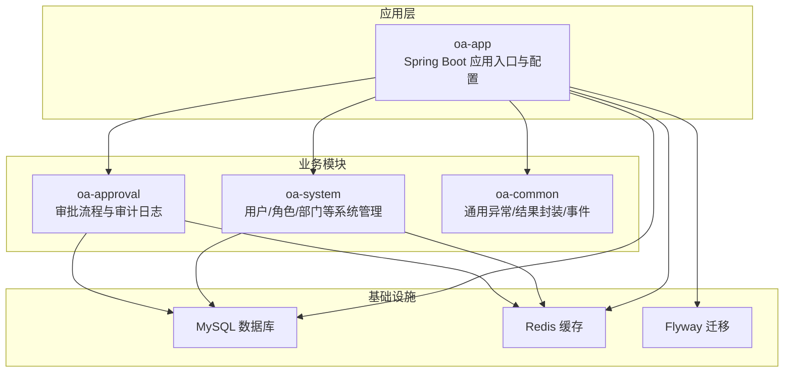
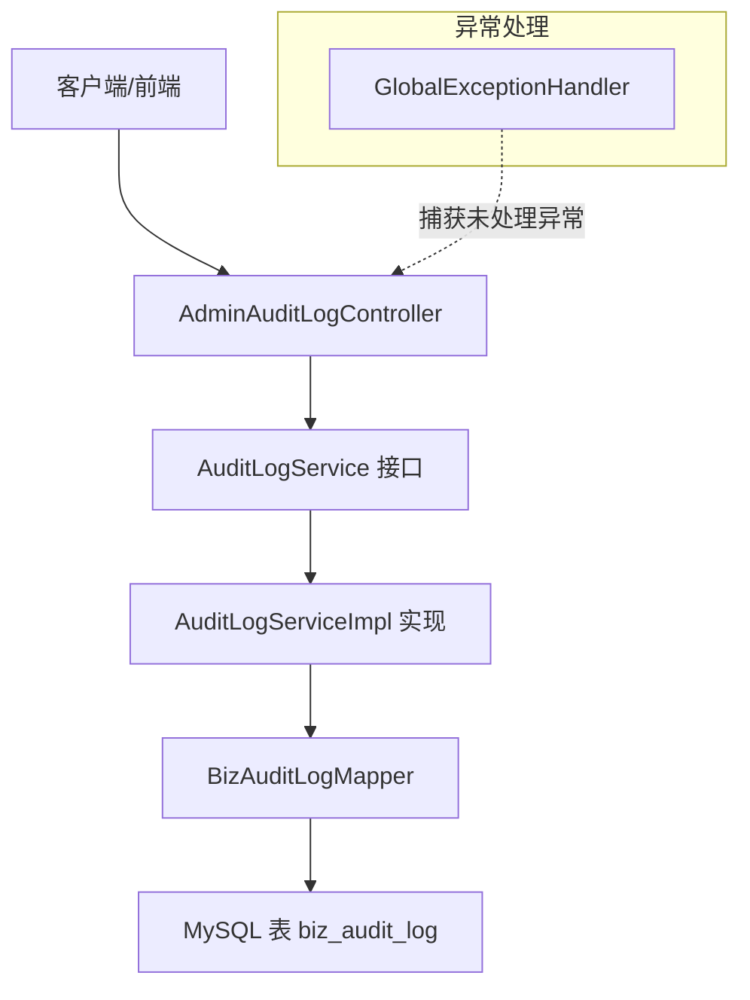
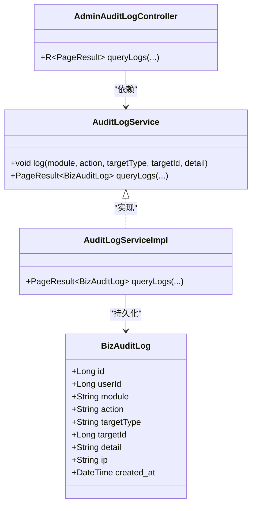
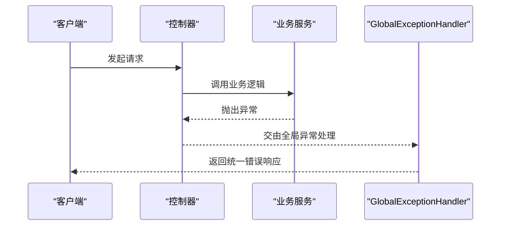
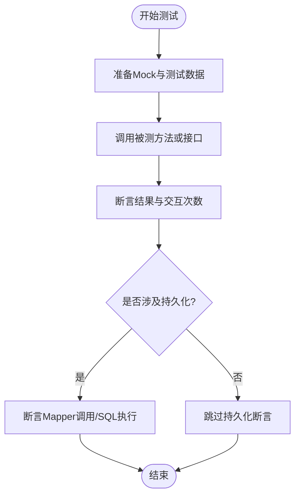
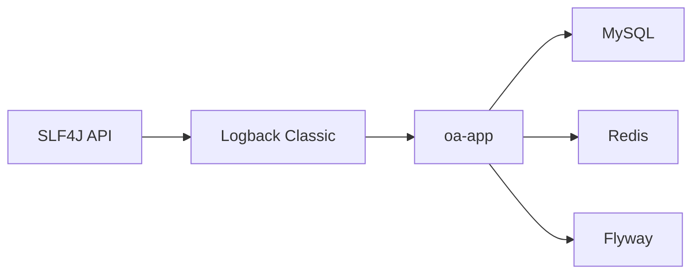

# 日志分析与调试

<cite>
**本文引用的文件**   
- [application.yml](file://oa-app/src/main/resources/application.yml)
- [pom.xml（根工程）](file://pom.xml)
- [GlobalExceptionHandler.java](file://oa-common/src/main/java/com/oa/admin/common/exception/GlobalExceptionHandler.java)
- [BusinessException.java](file://oa-common/src/main/java/com/oa/admin/common/exception/BusinessException.java)
- [BizAuditLog.java](file://oa-approval/src/main/java/com/oa/admin/approval/entity/BizAuditLog.java)
- [AuditLogService.java](file://oa-approval/src/main/java/com/oa/admin/approval/service/AuditLogService.java)
- [AuditLogServiceImpl.java](file://oa-approval/src/main/java/com/oa/admin/approval/service/impl/AuditLogServiceImpl.java)
- [AdminAuditLogController.java](file://oa-approval/src/main/java/com/oa/admin/approval/controller/AdminAuditLogController.java)
- [V2__init_biz_tables.sql](file://oa-app/src/main/resources/db/migration/V2__init_biz_tables.sql)
- [ApprovalServiceTest.java](file://oa-approval/src/test/java/com/oa/admin/approval/service/ApprovalServiceTest.java)
- [AuditLogServiceTest.java](file://oa-approval/src/test/java/com/oa/admin/approval/service/AuditLogServiceTest.java)
- [AuthServiceTest.java](file://oa-system/src/test/java/com/oa/admin/system/service/AuthServiceTest.java)
- [SysDeptServiceTest.java](file://oa-system/src/test/java/com/oa/admin/system/service/SysDeptServiceTest.java)
- [SysUserServiceTest.java](file://oa-system/src/test/java/com/oa/admin/system/service/SysUserServiceTest.java)
</cite>

## 目录
1. [简介](#简介)
2. [项目结构](#项目结构)
3. [核心组件](#核心组件)
4. [架构总览](#架构总览)
5. [详细组件分析](#详细组件分析)
6. [依赖分析](#依赖分析)
7. [性能考虑](#性能考虑)
8. [故障排查指南](#故障排查指南)
9. [结论](#结论)
10. [附录](#附录)

## 简介
本指南面向OA审批管理系统的日志分析与调试，覆盖以下主题：
- 日志级别与配置：开发、测试、生产三类环境的差异化配置建议
- 关键日志定位技巧：异常日志、业务日志、性能日志的分析方法
- 断点调试与远程调试：IDE本地调试、远程调试端口与参数配置
- 单元测试与集成测试调试：Mock对象使用、测试数据准备、测试环境隔离
- 性能分析与内存泄漏检测：结合系统监控与告警的最佳实践

## 项目结构
该工程采用多模块Maven聚合结构，审批模块、系统模块、通用模块、前端UI模块、生成器模块协同工作；审批模块内置审计日志能力，配合全局异常处理统一输出错误信息。

图表来源
- [application.yml:1-59](file://oa-app/src/main/resources/application.yml#L1-L59)
- [pom.xml（根工程）:21-28](file://pom.xml#L21-L28)

章节来源
- [application.yml:1-59](file://oa-app/src/main/resources/application.yml#L1-L59)
- [pom.xml（根工程）:21-28](file://pom.xml#L21-L28)

## 核心组件
- 审计日志实体与服务：用于记录用户在各模块的关键动作，支持按模块、动作、时间范围等条件查询
- 全局异常处理器：集中捕获未处理异常并返回统一响应格式，便于日志与监控
- 测试用例：大量使用Mock与静态桩，验证业务流程与审计日志落库行为

章节来源
- [BizAuditLog.java:1-28](file://oa-approval/src/main/java/com/oa/admin/approval/entity/BizAuditLog.java#L1-L28)
- [AuditLogService.java:1-17](file://oa-approval/src/main/java/com/oa/admin/approval/service/AuditLogService.java#L1-L17)
- [AdminAuditLogController.java:1-35](file://oa-approval/src/main/java/com/oa/admin/approval/controller/AdminAuditLogController.java#L1-L35)
- [GlobalExceptionHandler.java:1-74](file://oa-common/src/main/java/com/oa/admin/common/exception/GlobalExceptionHandler.java#L1-L74)

## 架构总览
审批模块围绕“控制器-服务-持久层”分层设计，审计日志贯穿关键业务节点；系统模块负责认证授权；通用模块提供异常与响应统一封装；应用层通过配置连接数据库与缓存，并执行数据库迁移。

图表来源
- [AdminAuditLogController.java:1-35](file://oa-approval/src/main/java/com/oa/admin/approval/controller/AdminAuditLogController.java#L1-L35)
- [AuditLogService.java:1-17](file://oa-approval/src/main/java/com/oa/admin/approval/service/AuditLogService.java#L1-L17)
- [AuditLogServiceImpl.java:34-66](file://oa-approval/src/main/java/com/oa/admin/approval/service/impl/AuditLogServiceImpl.java#L34-L66)
- [BizAuditLog.java:1-28](file://oa-approval/src/main/java/com/oa/admin/approval/entity/BizAuditLog.java#L1-L28)
- [GlobalExceptionHandler.java:1-74](file://oa-common/src/main/java/com/oa/admin/common/exception/GlobalExceptionHandler.java#L1-L74)

## 详细组件分析

### 审计日志子系统
- 实体字段覆盖用户、模块、动作、目标类型与ID、详情、IP、时间等关键维度
- 控制器提供分页查询接口，支持多维过滤
- 服务实现基于MyBatis-Plus分页与条件构造器，支持时间范围与索引优化

图表来源
- [BizAuditLog.java:1-28](file://oa-approval/src/main/java/com/oa/admin/approval/entity/BizAuditLog.java#L1-L28)
- [AuditLogService.java:1-17](file://oa-approval/src/main/java/com/oa/admin/approval/service/AuditLogService.java#L1-L17)
- [AuditLogServiceImpl.java:34-66](file://oa-approval/src/main/java/com/oa/admin/approval/service/impl/AuditLogServiceImpl.java#L34-L66)
- [AdminAuditLogController.java:1-35](file://oa-approval/src/main/java/com/oa/admin/approval/controller/AdminAuditLogController.java#L1-L35)

章节来源
- [BizAuditLog.java:1-28](file://oa-approval/src/main/java/com/oa/admin/approval/entity/BizAuditLog.java#L1-L28)
- [AuditLogService.java:1-17](file://oa-approval/src/main/java/com/oa/admin/approval/service/AuditLogService.java#L1-L17)
- [AdminAuditLogController.java:1-35](file://oa-approval/src/main/java/com/oa/admin/approval/controller/AdminAuditLogController.java#L1-L35)
- [V2__init_biz_tables.sql:60-73](file://oa-app/src/main/resources/db/migration/V2__init_biz_tables.sql#L60-L73)

### 全局异常处理
- 统一捕获未处理异常并记录日志，返回标准化响应
- 针对鉴权相关异常与业务异常进行分类处理

图表来源
- [GlobalExceptionHandler.java:67-72](file://oa-common/src/main/java/com/oa/admin/common/exception/GlobalExceptionHandler.java#L67-L72)

章节来源
- [GlobalExceptionHandler.java:1-74](file://oa-common/src/main/java/com/oa/admin/common/exception/GlobalExceptionHandler.java#L1-L74)
- [BusinessException.java:1-23](file://oa-common/src/main/java/com/oa/admin/common/exception/BusinessException.java#L1-L23)

### 测试与调试要点
- 审计日志测试：验证提交、审批、撤回等关键流程是否正确落库
- 认证服务测试：验证登录、登出、当前用户读取等场景
- 系统服务测试：部门、用户等基础数据服务的增删改查与权限控制

图表来源
- [ApprovalServiceTest.java:683-706](file://oa-approval/src/test/java/com/oa/admin/approval/service/ApprovalServiceTest.java#L683-L706)
- [AuditLogServiceTest.java:51-76](file://oa-approval/src/test/java/com/oa/admin/approval/service/AuditLogServiceTest.java#L51-L76)
- [AuthServiceTest.java:66-72](file://oa-system/src/test/java/com/oa/admin/system/service/AuthServiceTest.java#L66-L72)

章节来源
- [ApprovalServiceTest.java:680-802](file://oa-approval/src/test/java/com/oa/admin/approval/service/ApprovalServiceTest.java#L680-L802)
- [AuditLogServiceTest.java:1-76](file://oa-approval/src/test/java/com/oa/admin/approval/service/AuditLogServiceTest.java#L1-L76)
- [AuthServiceTest.java:1-103](file://oa-system/src/test/java/com/oa/admin/system/service/AuthServiceTest.java#L1-L103)
- [SysDeptServiceTest.java:1-35](file://oa-system/src/test/java/com/oa/admin/system/service/SysDeptServiceTest.java#L1-L35)
- [SysUserServiceTest.java:1-40](file://oa-system/src/test/java/com/oa/admin/system/service/SysUserServiceTest.java#L1-L40)

## 依赖分析
- Spring Boot Starter Logging 默认使用SLF4J + Logback，无需额外配置即可输出日志
- 应用层配置了数据库、Redis、Flyway等外部依赖
- 审计日志表结构定义清晰，包含常用索引以支撑查询性能

图表来源
- [application.yml:1-59](file://oa-app/src/main/resources/application.yml#L1-L59)

章节来源
- [application.yml:1-59](file://oa-app/src/main/resources/application.yml#L1-L59)

## 性能考虑
- 审计日志查询建议使用模块+动作+时间范围+用户ID等组合索引，避免全表扫描
- 分页查询时限制每页大小，避免一次性拉取过多数据
- 对高频写入的审计日志可考虑异步落库或批量插入策略（需结合实际业务与监控指标评估）

## 故障排查指南

### 日志级别与配置
- 开发环境：建议将业务包与审批模块的日志级别设为DEBUG，便于快速定位问题；全局异常处理器会记录未处理异常，确保异常栈可见
- 测试环境：保持INFO级别，必要时临时提升到DEBUG；测试用例中可通过Mock验证异常路径
- 生产环境：默认INFO级别，仅在紧急排障时临时提升到DEBUG；避免输出敏感信息（如密码、令牌），可使用占位符或脱敏策略

章节来源
- [GlobalExceptionHandler.java:67-72](file://oa-common/src/main/java/com/oa/admin/common/exception/GlobalExceptionHandler.java#L67-L72)

### 关键日志定位技巧
- 异常日志：优先查看全局异常处理器记录的堆栈；结合业务异常类型判断是否为参数校验、权限不足或业务规则触发
- 业务日志：通过审计日志接口查询模块与动作维度，确认关键流程是否按预期执行
- 性能日志：关注慢查询与超时请求，结合数据库索引与分页策略优化

章节来源
- [AdminAuditLogController.java:20-33](file://oa-approval/src/main/java/com/oa/admin/approval/controller/AdminAuditLogController.java#L20-L33)
- [AuditLogServiceImpl.java:34-66](file://oa-approval/src/main/java/com/oa/admin/approval/service/impl/AuditLogServiceImpl.java#L34-L66)
- [V2__init_biz_tables.sql:60-73](file://oa-app/src/main/resources/db/migration/V2__init_biz_tables.sql#L60-L73)

### 断点调试与远程调试
- IDE本地调试：在控制器、服务与审计日志落库处设置断点，逐步跟踪参数、状态与返回值
- 远程调试：启动应用时添加JVM参数开启调试端口，连接远程调试器进行问题复现与变量检查
- 调试参数示例（请根据实际环境调整）：
  - JVM参数：-agentlib:jdwp=transport=dt_socket,server=y,suspend=n,address=*:5005
  - 启动命令：java -jar -agentlib:jdwp=... your-application.jar

### 单元测试与集成测试调试
- Mock对象使用：对DAO、工具类、鉴权上下文等进行Mock，隔离外部依赖
- 测试数据准备：通过构建器模式构造实体对象，确保测试数据稳定且可重复
- 测试环境隔离：使用内存数据库或测试专用Schema，避免污染真实数据
- 常见测试场景：
  - 审计日志：验证提交、审批、撤回等流程是否调用审计日志服务
  - 登录登出：验证鉴权上下文切换与异常分支
  - 权限控制：验证无权限访问时抛出的业务异常码

章节来源
- [ApprovalServiceTest.java:683-706](file://oa-approval/src/test/java/com/oa/admin/approval/service/ApprovalServiceTest.java#L683-L706)
- [AuditLogServiceTest.java:51-76](file://oa-approval/src/test/java/com/oa/admin/approval/service/AuditLogServiceTest.java#L51-L76)
- [AuthServiceTest.java:66-72](file://oa-system/src/test/java/com/oa/admin/system/service/AuthServiceTest.java#L66-L72)

### 性能分析与内存泄漏检测
- 性能分析：结合数据库慢查询日志、接口耗时监控与线程dump，定位瓶颈
- 内存泄漏检测：使用内存分析工具识别长时间存活对象与未释放资源
- 系统监控与告警：建立数据库连接池健康度、Redis命中率、接口P95/P99延迟、异常率等指标告警

## 结论
通过规范的日志级别配置、完善的审计日志体系、严谨的测试与调试流程，以及持续的性能与监控治理，可以有效提升OA审批管理系统的可观测性与稳定性。建议在开发与测试阶段强化日志与断点调试，在生产阶段强化监控与告警，形成闭环的质量保障机制。

## 附录

### 审计日志查询接口（参考）
- GET /api/v1/admin/audit-log
- 查询参数：module、action、targetType、targetId、userId、startTime、endTime、page、pageSize

章节来源
- [AdminAuditLogController.java:20-33](file://oa-approval/src/main/java/com/oa/admin/approval/controller/AdminAuditLogController.java#L20-L33)