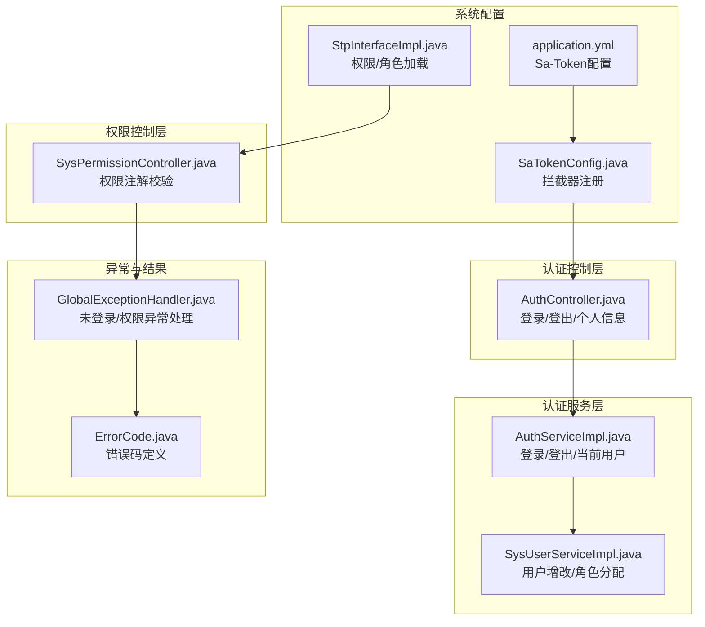
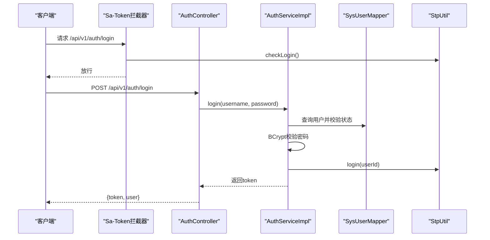
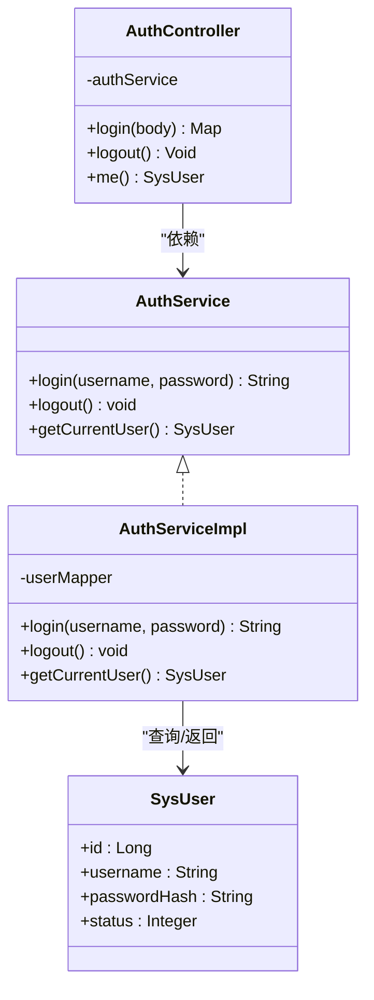
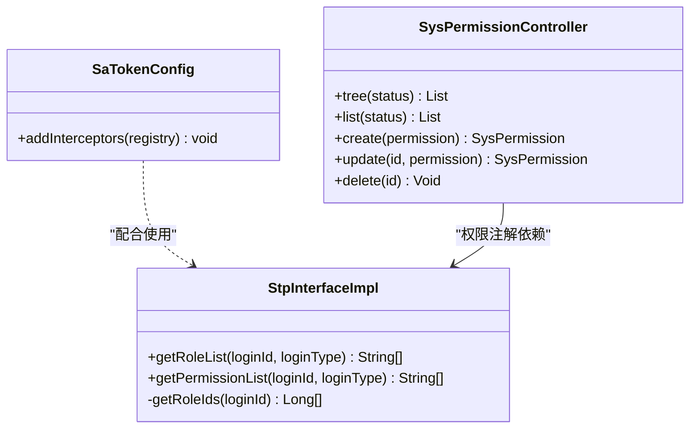
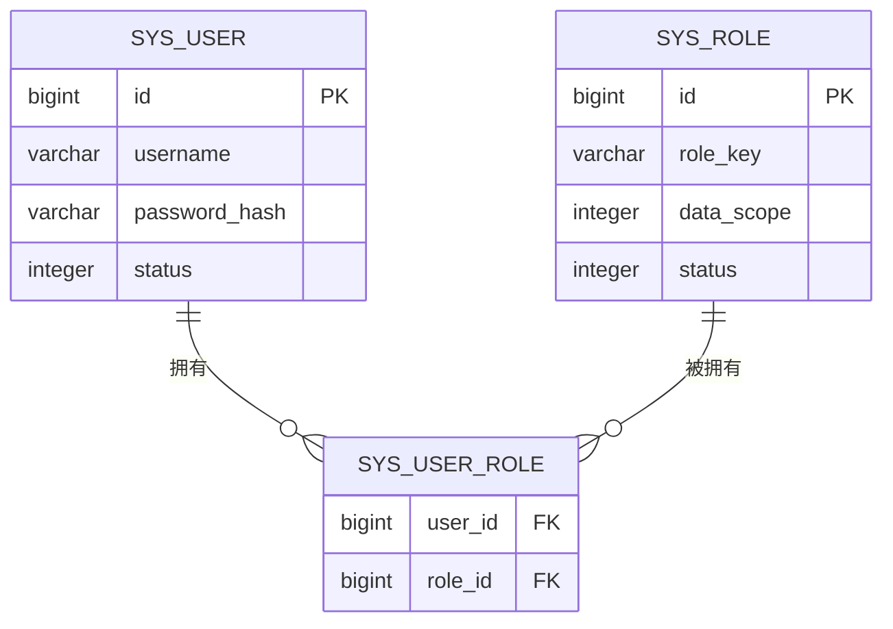
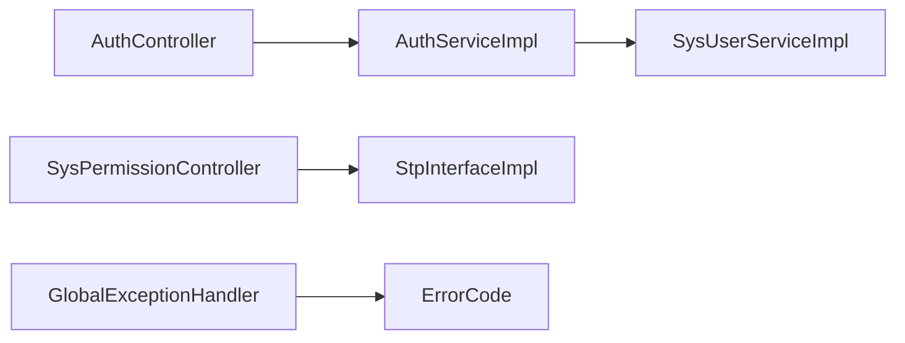

# 认证授权问题排查

<cite>
**本文档引用的文件**
- [oa-system/src/main/java/com/oa/admin/system/config/SaTokenConfig.java](file://oa-system/src/main/java/com/oa/admin/system/config/SaTokenConfig.java)
- [oa-system/src/main/java/com/oa/admin/system/config/StpInterfaceImpl.java](file://oa-system/src/main/java/com/oa/admin/system/config/StpInterfaceImpl.java)
- [oa-system/src/main/java/com/oa/admin/system/controller/AuthController.java](file://oa-system/src/main/java/com/oa/admin/system/controller/AuthController.java)
- [oa-system/src/main/java/com/oa/admin/system/service/impl/AuthServiceImpl.java](file://oa-system/src/main/java/com/oa/admin/system/service/impl/AuthServiceImpl.java)
- [oa-system/src/main/java/com/oa/admin/system/service/impl/SysUserServiceImpl.java](file://oa-system/src/main/java/com/oa/admin/system/service/impl/SysUserServiceImpl.java)
- [oa-system/src/main/java/com/oa/admin/system/controller/SysPermissionController.java](file://oa-system/src/main/java/com/oa/admin/system/controller/SysPermissionController.java)
- [oa-common/src/main/java/com/oa/admin/common/exception/GlobalExceptionHandler.java](file://oa-common/src/main/java/com/oa/admin/common/exception/GlobalExceptionHandler.java)
- [oa-common/src/main/java/com/oa/admin/common/result/ErrorCode.java](file://oa-common/src/main/java/com/oa/admin/common/result/ErrorCode.java)
- [oa-app/src/main/resources/application.yml](file://oa-app/src/main/resources/application.yml)
- [oa-system/src/main/java/com/oa/admin/system/entity/SysUser.java](file://oa-system/src/main/java/com/oa/admin/system/entity/SysUser.java)
- [oa-system/src/main/java/com/oa/admin/system/entity/SysRole.java](file://oa-system/src/main/java/com/oa/admin/system/entity/SysRole.java)
</cite>

## 目录
1. [简介](#简介)
2. [项目结构](#项目结构)
3. [核心组件](#核心组件)
4. [架构总览](#架构总览)
5. [详细组件分析](#详细组件分析)
6. [依赖关系分析](#依赖关系分析)
7. [性能考虑](#性能考虑)
8. [故障排查指南](#故障排查指南)
9. [结论](#结论)

## 简介
本指南面向OA审批管理系统的认证授权问题排查，聚焦以下场景：
- JWT/Token相关：令牌过期、签名验证失败、令牌格式错误
- 权限验证：权限拦截失败、角色权限不匹配、接口访问被拒绝
- Sa-Token配置：登录配置、权限配置、会话管理
- 用户认证：密码错误、账户锁定、多设备登录
- 安全配置优化、权限缓存、会话同步

系统采用Spring MVC + Sa-Token实现认证授权，全局异常处理器对未登录、权限不足进行统一响应。

## 项目结构
围绕认证授权的关键模块如下：
- 配置层：Sa-Token拦截器配置、权限接口实现
- 控制器层：认证控制器、权限控制器
- 服务层：认证服务、用户服务
- 异常与结果：全局异常处理、错误码定义
- 配置文件：应用配置（含Sa-Token配置）

图表来源
- [oa-app/src/main/resources/application.yml:45-54](file://oa-app/src/main/resources/application.yml#L45-L54)
- [oa-system/src/main/java/com/oa/admin/system/config/SaTokenConfig.java:12-24](file://oa-system/src/main/java/com/oa/admin/system/config/SaTokenConfig.java#L12-L24)
- [oa-system/src/main/java/com/oa/admin/system/config/StpInterfaceImpl.java:24-75](file://oa-system/src/main/java/com/oa/admin/system/config/StpInterfaceImpl.java#L24-L75)
- [oa-system/src/main/java/com/oa/admin/system/controller/AuthController.java:14-38](file://oa-system/src/main/java/com/oa/admin/system/controller/AuthController.java#L14-L38)
- [oa-system/src/main/java/com/oa/admin/system/service/impl/AuthServiceImpl.java:18-52](file://oa-system/src/main/java/com/oa/admin/system/service/impl/AuthServiceImpl.java#L18-L52)
- [oa-system/src/main/java/com/oa/admin/system/service/impl/SysUserServiceImpl.java:22-73](file://oa-system/src/main/java/com/oa/admin/system/service/impl/SysUserServiceImpl.java#L22-L73)
- [oa-system/src/main/java/com/oa/admin/system/controller/SysPermissionController.java:15-62](file://oa-system/src/main/java/com/oa/admin/system/controller/SysPermissionController.java#L15-L62)
- [oa-common/src/main/java/com/oa/admin/common/exception/GlobalExceptionHandler.java:19-74](file://oa-common/src/main/java/com/oa/admin/common/exception/GlobalExceptionHandler.java#L19-L74)
- [oa-common/src/main/java/com/oa/admin/common/result/ErrorCode.java:9-45](file://oa-common/src/main/java/com/oa/admin/common/result/ErrorCode.java#L9-L45)

章节来源
- [oa-system/src/main/java/com/oa/admin/system/config/SaTokenConfig.java:12-24](file://oa-system/src/main/java/com/oa/admin/system/config/SaTokenConfig.java#L12-L24)
- [oa-system/src/main/java/com/oa/admin/system/config/StpInterfaceImpl.java:24-75](file://oa-system/src/main/java/com/oa/admin/system/config/StpInterfaceImpl.java#L24-L75)
- [oa-system/src/main/java/com/oa/admin/system/controller/AuthController.java:14-38](file://oa-system/src/main/java/com/oa/admin/system/controller/AuthController.java#L14-L38)
- [oa-system/src/main/java/com/oa/admin/system/service/impl/AuthServiceImpl.java:18-52](file://oa-system/src/main/java/com/oa/admin/system/service/impl/AuthServiceImpl.java#L18-L52)
- [oa-system/src/main/java/com/oa/admin/system/service/impl/SysUserServiceImpl.java:22-73](file://oa-system/src/main/java/com/oa/admin/system/service/impl/SysUserServiceImpl.java#L22-L73)
- [oa-system/src/main/java/com/oa/admin/system/controller/SysPermissionController.java:15-62](file://oa-system/src/main/java/com/oa/admin/system/controller/SysPermissionController.java#L15-L62)
- [oa-common/src/main/java/com/oa/admin/common/exception/GlobalExceptionHandler.java:19-74](file://oa-common/src/main/java/com/oa/admin/common/exception/GlobalExceptionHandler.java#L19-L74)
- [oa-common/src/main/java/com/oa/admin/common/result/ErrorCode.java:9-45](file://oa-common/src/main/java/com/oa/admin/common/result/ErrorCode.java#L9-L45)
- [oa-app/src/main/resources/application.yml:45-54](file://oa-app/src/main/resources/application.yml#L45-L54)

## 核心组件
- 拦截器配置：注册Sa-Token拦截器，保护/api/v1/**路径，排除登录/注册接口
- 权限接口：从数据库加载用户的角色列表与权限列表，过滤启用状态
- 认证控制器：提供登录、登出、获取当前用户信息接口
- 认证服务：执行密码校验、生成令牌、清理上下文
- 全局异常处理：将未登录、权限不足映射为统一错误码
- 错误码：定义认证相关错误码（未登录、无权限、登录失败、令牌过期）

章节来源
- [oa-system/src/main/java/com/oa/admin/system/config/SaTokenConfig.java:12-24](file://oa-system/src/main/java/com/oa/admin/system/config/SaTokenConfig.java#L12-L24)
- [oa-system/src/main/java/com/oa/admin/system/config/StpInterfaceImpl.java:24-75](file://oa-system/src/main/java/com/oa/admin/system/config/StpInterfaceImpl.java#L24-L75)
- [oa-system/src/main/java/com/oa/admin/system/controller/AuthController.java:14-38](file://oa-system/src/main/java/com/oa/admin/system/controller/AuthController.java#L14-L38)
- [oa-system/src/main/java/com/oa/admin/system/service/impl/AuthServiceImpl.java:18-52](file://oa-system/src/main/java/com/oa/admin/system/service/impl/AuthServiceImpl.java#L18-L52)
- [oa-common/src/main/java/com/oa/admin/common/exception/GlobalExceptionHandler.java:19-74](file://oa-common/src/main/java/com/oa/admin/common/exception/GlobalExceptionHandler.java#L19-L74)
- [oa-common/src/main/java/com/oa/admin/common/result/ErrorCode.java:9-45](file://oa-common/src/main/java/com/oa/admin/common/result/ErrorCode.java#L9-L45)

## 架构总览
认证授权整体流程：客户端请求经拦截器校验登录态，控制器调用服务层执行业务逻辑，权限注解在控制器层进行细粒度校验，异常统一由全局处理器转换为标准响应。

图表来源
- [oa-system/src/main/java/com/oa/admin/system/config/SaTokenConfig.java:12-24](file://oa-system/src/main/java/com/oa/admin/system/config/SaTokenConfig.java#L12-L24)
- [oa-system/src/main/java/com/oa/admin/system/controller/AuthController.java:14-38](file://oa-system/src/main/java/com/oa/admin/system/controller/AuthController.java#L14-L38)
- [oa-system/src/main/java/com/oa/admin/system/service/impl/AuthServiceImpl.java:18-52](file://oa-system/src/main/java/com/oa/admin/system/service/impl/AuthServiceImpl.java#L18-L52)

## 详细组件分析

### 组件A：认证与会话管理
- 登录流程：查询激活状态用户，使用BCrypt校验密码，成功后以用户ID登录并返回令牌
- 登出流程：调用会话工具清理当前会话
- 当前用户：从登录上下文中取出用户ID，查询用户信息并清除敏感字段

图表来源
- [oa-system/src/main/java/com/oa/admin/system/service/AuthService.java:8-16](file://oa-system/src/main/java/com/oa/admin/system/service/AuthService.java#L8-L16)
- [oa-system/src/main/java/com/oa/admin/system/service/impl/AuthServiceImpl.java:18-52](file://oa-system/src/main/java/com/oa/admin/system/service/impl/AuthServiceImpl.java#L18-L52)
- [oa-system/src/main/java/com/oa/admin/system/controller/AuthController.java:14-38](file://oa-system/src/main/java/com/oa/admin/system/controller/AuthController.java#L14-L38)
- [oa-system/src/main/java/com/oa/admin/system/entity/SysUser.java:13-27](file://oa-system/src/main/java/com/oa/admin/system/entity/SysUser.java#L13-L27)

章节来源
- [oa-system/src/main/java/com/oa/admin/system/service/impl/AuthServiceImpl.java:18-52](file://oa-system/src/main/java/com/oa/admin/system/service/impl/AuthServiceImpl.java#L18-L52)
- [oa-system/src/main/java/com/oa/admin/system/controller/AuthController.java:14-38](file://oa-system/src/main/java/com/oa/admin/system/controller/AuthController.java#L14-L38)
- [oa-system/src/main/java/com/oa/admin/system/entity/SysUser.java:13-27](file://oa-system/src/main/java/com/oa/admin/system/entity/SysUser.java#L13-L27)

### 组件B：权限接口与拦截器
- 拦截器：注册Sa-Token拦截器，保护/api/v1/**，排除登录/注册
- 权限接口：根据用户ID查询角色列表与权限列表，过滤启用状态
- 权限注解：在控制器方法上使用权限注解进行细粒度校验

图表来源
- [oa-system/src/main/java/com/oa/admin/system/config/SaTokenConfig.java:12-24](file://oa-system/src/main/java/com/oa/admin/system/config/SaTokenConfig.java#L12-L24)
- [oa-system/src/main/java/com/oa/admin/system/config/StpInterfaceImpl.java:24-75](file://oa-system/src/main/java/com/oa/admin/system/config/StpInterfaceImpl.java#L24-L75)
- [oa-system/src/main/java/com/oa/admin/system/controller/SysPermissionController.java:15-62](file://oa-system/src/main/java/com/oa/admin/system/controller/SysPermissionController.java#L15-L62)

章节来源
- [oa-system/src/main/java/com/oa/admin/system/config/SaTokenConfig.java:12-24](file://oa-system/src/main/java/com/oa/admin/system/config/SaTokenConfig.java#L12-L24)
- [oa-system/src/main/java/com/oa/admin/system/config/StpInterfaceImpl.java:24-75](file://oa-system/src/main/java/com/oa/admin/system/config/StpInterfaceImpl.java#L24-L75)
- [oa-system/src/main/java/com/oa/admin/system/controller/SysPermissionController.java:15-62](file://oa-system/src/main/java/com/oa/admin/system/controller/SysPermissionController.java#L15-L62)

### 组件C：用户与角色模型
- 用户实体：包含用户名、密码哈希、状态等字段
- 角色实体：包含角色名、角色键、数据范围、状态等字段

图表来源
- [oa-system/src/main/java/com/oa/admin/system/entity/SysUser.java:13-27](file://oa-system/src/main/java/com/oa/admin/system/entity/SysUser.java#L13-L27)
- [oa-system/src/main/java/com/oa/admin/system/entity/SysRole.java:13-26](file://oa-system/src/main/java/com/oa/admin/system/entity/SysRole.java#L13-L26)

章节来源
- [oa-system/src/main/java/com/oa/admin/system/entity/SysUser.java:13-27](file://oa-system/src/main/java/com/oa/admin/system/entity/SysUser.java#L13-L27)
- [oa-system/src/main/java/com/oa/admin/system/entity/SysRole.java:13-26](file://oa-system/src/main/java/com/oa/admin/system/entity/SysRole.java#L13-L26)

## 依赖关系分析
- 认证控制器依赖认证服务；认证服务依赖用户映射与会话工具
- 权限控制器依赖权限注解，权限注解依赖权限接口实现
- 全局异常处理器捕获未登录/权限异常并转换为统一响应

图表来源
- [oa-system/src/main/java/com/oa/admin/system/controller/AuthController.java:14-38](file://oa-system/src/main/java/com/oa/admin/system/controller/AuthController.java#L14-L38)
- [oa-system/src/main/java/com/oa/admin/system/service/impl/AuthServiceImpl.java:18-52](file://oa-system/src/main/java/com/oa/admin/system/service/impl/AuthServiceImpl.java#L18-L52)
- [oa-system/src/main/java/com/oa/admin/system/service/impl/SysUserServiceImpl.java:22-73](file://oa-system/src/main/java/com/oa/admin/system/service/impl/SysUserServiceImpl.java#L22-L73)
- [oa-system/src/main/java/com/oa/admin/system/controller/SysPermissionController.java:15-62](file://oa-system/src/main/java/com/oa/admin/system/controller/SysPermissionController.java#L15-L62)
- [oa-system/src/main/java/com/oa/admin/system/config/StpInterfaceImpl.java:24-75](file://oa-system/src/main/java/com/oa/admin/system/config/StpInterfaceImpl.java#L24-L75)
- [oa-common/src/main/java/com/oa/admin/common/exception/GlobalExceptionHandler.java:19-74](file://oa-common/src/main/java/com/oa/admin/common/exception/GlobalExceptionHandler.java#L19-L74)
- [oa-common/src/main/java/com/oa/admin/common/result/ErrorCode.java:9-45](file://oa-common/src/main/java/com/oa/admin/common/result/ErrorCode.java#L9-L45)

章节来源
- [oa-system/src/main/java/com/oa/admin/system/controller/AuthController.java:14-38](file://oa-system/src/main/java/com/oa/admin/system/controller/AuthController.java#L14-L38)
- [oa-system/src/main/java/com/oa/admin/system/service/impl/AuthServiceImpl.java:18-52](file://oa-system/src/main/java/com/oa/admin/system/service/impl/AuthServiceImpl.java#L18-L52)
- [oa-system/src/main/java/com/oa/admin/system/service/impl/SysUserServiceImpl.java:22-73](file://oa-system/src/main/java/com/oa/admin/system/service/impl/SysUserServiceImpl.java#L22-L73)
- [oa-system/src/main/java/com/oa/admin/system/controller/SysPermissionController.java:15-62](file://oa-system/src/main/java/com/oa/admin/system/controller/SysPermissionController.java#L15-L62)
- [oa-system/src/main/java/com/oa/admin/system/config/StpInterfaceImpl.java:24-75](file://oa-system/src/main/java/com/oa/admin/system/config/StpInterfaceImpl.java#L24-L75)
- [oa-common/src/main/java/com/oa/admin/common/exception/GlobalExceptionHandler.java:19-74](file://oa-common/src/main/java/com/oa/admin/common/exception/GlobalExceptionHandler.java#L19-L74)
- [oa-common/src/main/java/com/oa/admin/common/result/ErrorCode.java:9-45](file://oa-common/src/main/java/com/oa/admin/common/result/ErrorCode.java#L9-L45)

## 性能考虑
- 会话并发与共享：开启并发与共享，支持多实例共享会话，减少重复登录
- 主动/被动超时：区分令牌有效期与活跃有效期，避免频繁刷新
- Redis连接池：合理配置连接池大小与泄漏检测，保障高并发下的稳定性
- 密码哈希：使用BCrypt，避免明文存储与弱加密

章节来源
- [oa-app/src/main/resources/application.yml:45-54](file://oa-app/src/main/resources/application.yml#L45-L54)
- [oa-system/src/main/java/com/oa/admin/system/service/impl/AuthServiceImpl.java:30-34](file://oa-system/src/main/java/com/oa/admin/system/service/impl/AuthServiceImpl.java#L30-L34)
- [oa-system/src/main/java/com/oa/admin/system/service/impl/SysUserServiceImpl.java:39-58](file://oa-system/src/main/java/com/oa/admin/system/service/impl/SysUserServiceImpl.java#L39-L58)

## 故障排查指南

### 一、JWT/令牌相关问题
- 令牌过期
  - 现象：返回“未登录或登录已过期”或“令牌过期”
  - 排查要点：
    - 检查令牌有效期与活跃有效期配置
    - 确认客户端是否在过期前刷新令牌
    - 查看全局异常处理器对未登录异常的映射
  - 参考配置与异常处理
    - [application.yml:45-54](file://oa-app/src/main/resources/application.yml#L45-L54)
    - [GlobalExceptionHandler.java:23-27](file://oa-common/src/main/java/com/oa/admin/common/exception/GlobalExceptionHandler.java#L23-L27)
    - [ErrorCode.java:17-22](file://oa-common/src/main/java/com/oa/admin/common/result/ErrorCode.java#L17-L22)

- 签名验证失败/令牌格式错误
  - 现象：接口返回未授权或权限错误
  - 排查要点：
    - 确认请求头携带的令牌名称与服务端一致
    - 检查令牌序列化方式与解析策略
    - 核对多实例部署下会话共享配置
  - 参考配置
    - [application.yml:45-54](file://oa-app/src/main/resources/application.yml#L45-L54)

- 多设备登录冲突
  - 现象：同一账号在新设备登录导致旧设备掉线
  - 排查要点：
    - 若需允许同账号多端在线，确认并发与共享配置
    - 若需踢出旧设备，关闭并发或使用独立会话策略
  - 参考配置
    - [application.yml:45-54](file://oa-app/src/main/resources/application.yml#L45-L54)

章节来源
- [oa-common/src/main/java/com/oa/admin/common/exception/GlobalExceptionHandler.java:19-74](file://oa-common/src/main/java/com/oa/admin/common/exception/GlobalExceptionHandler.java#L19-L74)
- [oa-common/src/main/java/com/oa/admin/common/result/ErrorCode.java:9-45](file://oa-common/src/main/java/com/oa/admin/common/result/ErrorCode.java#L9-L45)
- [oa-app/src/main/resources/application.yml:45-54](file://oa-app/src/main/resources/application.yml#L45-L54)

### 二、权限验证问题
- 权限拦截失败
  - 现象：受保护接口返回无权限
  - 排查要点：
    - 检查拦截器路径模式与排除规则
    - 确认控制器方法上的权限注解是否正确
  - 参考配置
    - [SaTokenConfig.java:12-24](file://oa-system/src/main/java/com/oa/admin/system/config/SaTokenConfig.java#L12-L24)
    - [SysPermissionController.java:22-58](file://oa-system/src/main/java/com/oa/admin/system/controller/SysPermissionController.java#L22-L58)

- 角色权限不匹配
  - 现象：登录用户具备角色但接口仍提示无权限
  - 排查要点：
    - 核查用户角色映射与启用状态
    - 核查角色到权限的映射与启用状态
    - 确认权限接口实现返回的权限路径
  - 参考实现
    - [StpInterfaceImpl.java:33-65](file://oa-system/src/main/java/com/oa/admin/system/config/StpInterfaceImpl.java#L33-L65)

- 接口访问被拒绝
  - 现象：返回“无权限访问”
  - 排查要点：
    - 检查全局异常处理器对权限不足的映射
    - 确认业务逻辑中未抛出未授权异常
  - 参考实现
    - [GlobalExceptionHandler.java:29-39](file://oa-common/src/main/java/com/oa/admin/common/exception/GlobalExceptionHandler.java#L29-L39)
    - [ErrorCode.java:17-22](file://oa-common/src/main/java/com/oa/admin/common/result/ErrorCode.java#L17-L22)

章节来源
- [oa-system/src/main/java/com/oa/admin/system/config/SaTokenConfig.java:12-24](file://oa-system/src/main/java/com/oa/admin/system/config/SaTokenConfig.java#L12-L24)
- [oa-system/src/main/java/com/oa/admin/system/config/StpInterfaceImpl.java:24-75](file://oa-system/src/main/java/com/oa/admin/system/config/StpInterfaceImpl.java#L24-L75)
- [oa-system/src/main/java/com/oa/admin/system/controller/SysPermissionController.java:15-62](file://oa-system/src/main/java/com/oa/admin/system/controller/SysPermissionController.java#L15-L62)
- [oa-common/src/main/java/com/oa/admin/common/exception/GlobalExceptionHandler.java:19-74](file://oa-common/src/main/java/com/oa/admin/common/exception/GlobalExceptionHandler.java#L19-L74)
- [oa-common/src/main/java/com/oa/admin/common/result/ErrorCode.java:9-45](file://oa-common/src/main/java/com/oa/admin/common/result/ErrorCode.java#L9-L45)

### 三、Sa-Token配置问题
- 登录配置
  - 检查令牌名称、有效期、活跃有效期、序列化方式
  - 参考
    - [application.yml:45-54](file://oa-app/src/main/resources/application.yml#L45-L54)

- 权限配置
  - 确认拦截器路径与排除项
  - 确认权限注解使用位置与权限字符串
  - 参考
    - [SaTokenConfig.java:12-24](file://oa-system/src/main/java/com/oa/admin/system/config/SaTokenConfig.java#L12-L24)
    - [SysPermissionController.java:22-58](file://oa-system/src/main/java/com/oa/admin/system/controller/SysPermissionController.java#L22-L58)

- 会话管理
  - 并发与共享：多实例部署建议开启共享
  - 超时策略：结合业务设置合理的有效期与活跃有效期
  - 参考
    - [application.yml:45-54](file://oa-app/src/main/resources/application.yml#L45-L54)

章节来源
- [oa-app/src/main/resources/application.yml:45-54](file://oa-app/src/main/resources/application.yml#L45-L54)
- [oa-system/src/main/java/com/oa/admin/system/config/SaTokenConfig.java:12-24](file://oa-system/src/main/java/com/oa/admin/system/config/SaTokenConfig.java#L12-L24)
- [oa-system/src/main/java/com/oa/admin/system/controller/SysPermissionController.java:15-62](file://oa-system/src/main/java/com/oa/admin/system/controller/SysPermissionController.java#L15-L62)

### 四、用户认证问题
- 密码错误
  - 现象：登录失败
  - 排查要点：
    - 确认BCrypt密码校验逻辑
    - 检查用户状态为启用
  - 参考实现
    - [AuthServiceImpl.java:30-32](file://oa-system/src/main/java/com/oa/admin/system/service/impl/AuthServiceImpl.java#L30-L32)

- 账户锁定
  - 现象：登录接口返回登录失败
  - 排查要点：
    - 核查用户状态字段与启用状态
  - 参考实现
    - [AuthServiceImpl.java:25-32](file://oa-system/src/main/java/com/oa/admin/system/service/impl/AuthServiceImpl.java#L25-L32)

- 多设备登录
  - 现象：新登录覆盖旧会话
  - 排查要点：
    - 检查并发与共享配置
  - 参考配置
    - [application.yml:45-54](file://oa-app/src/main/resources/application.yml#L45-L54)

章节来源
- [oa-system/src/main/java/com/oa/admin/system/service/impl/AuthServiceImpl.java:18-52](file://oa-system/src/main/java/com/oa/admin/system/service/impl/AuthServiceImpl.java#L18-L52)
- [oa-system/src/main/java/com/oa/admin/system/entity/SysUser.java:13-27](file://oa-system/src/main/java/com/oa/admin/system/entity/SysUser.java#L13-L27)
- [oa-app/src/main/resources/application.yml:45-54](file://oa-app/src/main/resources/application.yml#L45-L54)

### 五、安全配置优化与缓存/同步
- 安全配置优化
  - 使用BCrypt存储密码，避免明文或弱加密
  - 启用日志开关以便审计（生产环境谨慎开启）
  - 设置合理的令牌序列化方式以降低风险
  - 参考
    - [SysUserServiceImpl.java:41-50](file://oa-system/src/main/java/com/oa/admin/system/service/impl/SysUserServiceImpl.java#L41-L50)
    - [application.yml:45-54](file://oa-app/src/main/resources/application.yml#L45-L54)

- 权限缓存
  - 建议在权限接口实现中增加缓存层，减少数据库查询
  - 缓存失效策略：基于用户角色变更或定时刷新

- 会话同步
  - 多实例部署时确保Redis可用且连接池配置合理
  - 核查共享会话配置，避免会话不同步

章节来源
- [oa-system/src/main/java/com/oa/admin/system/service/impl/SysUserServiceImpl.java:22-73](file://oa-system/src/main/java/com/oa/admin/system/service/impl/SysUserServiceImpl.java#L22-L73)
- [oa-app/src/main/resources/application.yml:31-35](file://oa-app/src/main/resources/application.yml#L31-L35)
- [oa-app/src/main/resources/application.yml:45-54](file://oa-app/src/main/resources/application.yml#L45-L54)

## 结论
本指南提供了OA审批管理系统认证授权问题的系统性排查路径，涵盖令牌生命周期、权限拦截、Sa-Token配置、用户认证以及安全优化等方面。建议按“配置—接口—服务—异常”的顺序逐层定位问题，并结合错误码与全局异常处理快速收敛故障根因。