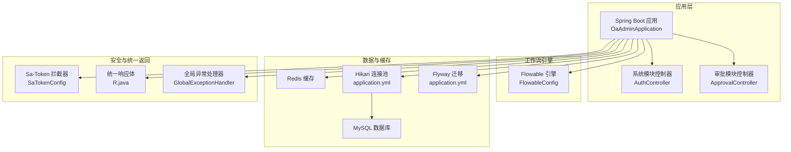
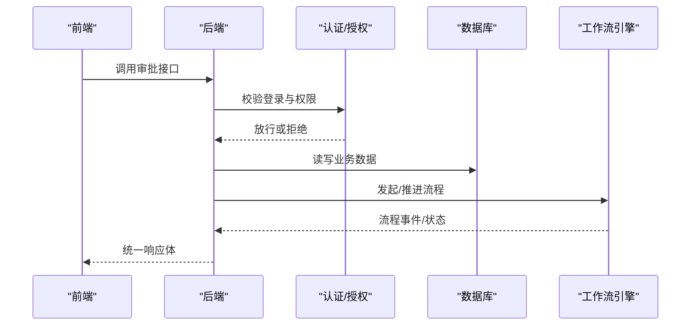
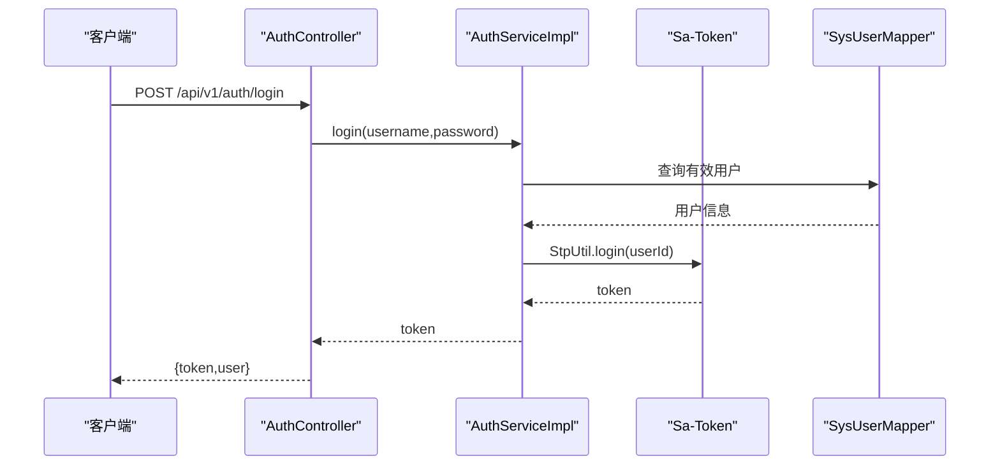
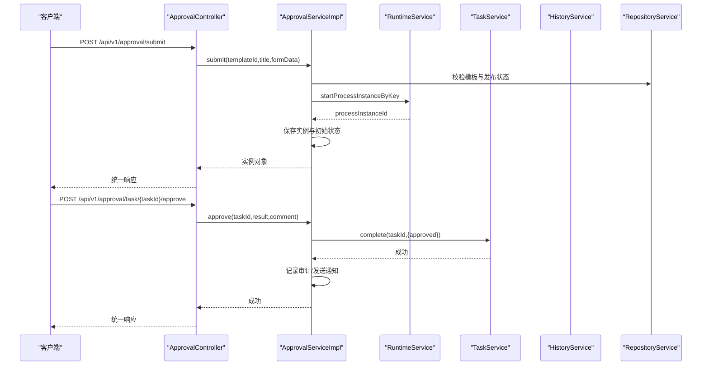
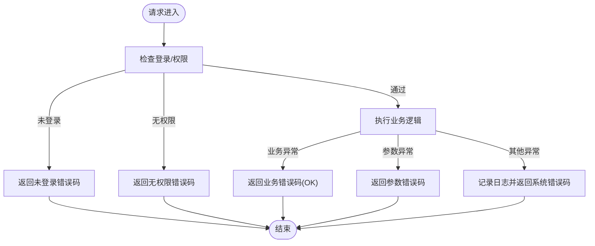
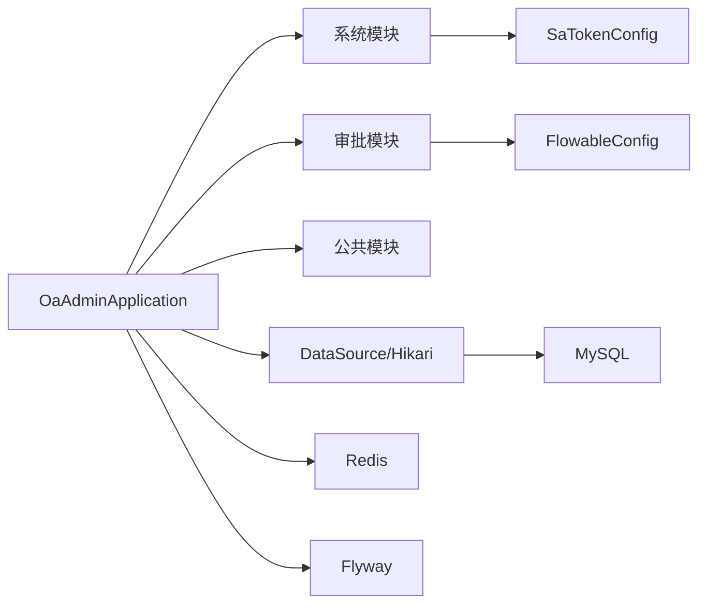

# 问题排查

<cite>
**本文引用的文件**
- [OaAdminApplication.java](file://oa-app/src/main/java/com/oa/admin/OaAdminApplication.java)
- [application.yml](file://oa-app/src/main/resources/application.yml)
- [docker-compose.yml](file://docker-compose.yml)
- [Dockerfile](file://Dockerfile)
- [init.sh](file://init.sh)
- [GlobalExceptionHandler.java](file://oa-common/src/main/java/com/oa/admin/common/exception/GlobalExceptionHandler.java)
- [R.java](file://oa-common/src/main/java/com/oa/admin/common/result/R.java)
- [ErrorCode.java](file://oa-common/src/main/java/com/oa/admin/common/result/ErrorCode.java)
- [BusinessException.java](file://oa-common/src/main/java/com/oa/admin/common/exception/BusinessException.java)
- [SaTokenConfig.java](file://oa-system/src/main/java/com/oa/admin/system/config/SaTokenConfig.java)
- [AuthController.java](file://oa-system/src/main/java/com/oa/admin/system/controller/AuthController.java)
- [AuthServiceImpl.java](file://oa-system/src/main/java/com/oa/admin/system/service/impl/AuthServiceImpl.java)
- [FlowableConfig.java](file://oa-approval/src/main/java/com/oa/admin/approval/config/FlowableConfig.java)
- [ApprovalController.java](file://oa-approval/src/main/java/com/oa/admin/approval/controller/ApprovalController.java)
- [ApprovalServiceImpl.java](file://oa-approval/src/main/java/com/oa/admin/approval/service/impl/ApprovalServiceImpl.java)
</cite>

## 目录
1. [简介](#简介)
2. [项目结构](#项目结构)
3. [核心组件](#核心组件)
4. [架构总览](#架构总览)
5. [详细组件分析](#详细组件分析)
6. [依赖分析](#依赖分析)
7. [性能考虑](#性能考虑)
8. [故障排查指南](#故障排查指南)
9. [结论](#结论)
10. [附录](#附录)

## 简介
本指南面向OA审批管理系统运维与开发人员，聚焦于系统运行中常见的启动失败、连接异常、权限错误、工作流异常等问题的诊断与解决路径，并提供日志分析方法、调试技巧、数据库问题排查、系统监控与告警配置建议，以及开发与生产环境差异的排查要点与最佳实践。

## 项目结构
系统采用多模块Maven工程，后端基于Spring Boot，使用Flowable作为工作流引擎，MyBatis-Plus进行数据访问，HikariCP连接池，Flyway做数据库迁移，Redis缓存，前端使用Vue生态。容器化通过Docker Compose编排MySQL、Redis与后端服务。

图表来源
- [OaAdminApplication.java:1-19](file://oa-app/src/main/java/com/oa/admin/OaAdminApplication.java#L1-L19)
- [application.yml:1-59](file://oa-app/src/main/resources/application.yml#L1-L59)
- [docker-compose.yml:1-66](file://docker-compose.yml#L1-L66)
- [Dockerfile:1-22](file://Dockerfile#L1-L22)
- [SaTokenConfig.java:1-25](file://oa-system/src/main/java/com/oa/admin/system/config/SaTokenConfig.java#L1-L25)
- [GlobalExceptionHandler.java:1-74](file://oa-common/src/main/java/com/oa/admin/common/exception/GlobalExceptionHandler.java#L1-L74)
- [R.java:1-44](file://oa-common/src/main/java/com/oa/admin/common/result/R.java#L1-L44)
- [FlowableConfig.java:1-31](file://oa-approval/src/main/java/com/oa/admin/approval/config/FlowableConfig.java#L1-L31)
- [AuthController.java:1-38](file://oa-system/src/main/java/com/oa/admin/system/controller/AuthController.java#L1-L38)
- [ApprovalController.java:1-252](file://oa-approval/src/main/java/com/oa/admin/approval/controller/ApprovalController.java#L1-L252)

章节来源
- [OaAdminApplication.java:1-19](file://oa-app/src/main/java/com/oa/admin/OaAdminApplication.java#L1-L19)
- [application.yml:1-59](file://oa-app/src/main/resources/application.yml#L1-L59)
- [docker-compose.yml:1-66](file://docker-compose.yml#L1-L66)
- [Dockerfile:1-22](file://Dockerfile#L1-L22)

## 核心组件
- 启动入口与扫描：Spring Boot启动类负责包扫描与事务管理，确保系统模块的Mapper与Service正确注册。
- 安全与鉴权：基于Sa-Token的拦截器对受保护接口进行登录态与权限校验。
- 统一响应与异常：统一响应体封装与全局异常处理器，规范错误码与消息输出。
- 工作流引擎：Flowable配置注入事件监听器，支撑审批流程的生命周期管理。
- 数据访问与连接池：MyBatis-Plus + HikariCP，Flyway自动迁移。
- 缓存：Redis用于会话与缓存场景（如令牌、会话共享）。

章节来源
- [OaAdminApplication.java:1-19](file://oa-app/src/main/java/com/oa/admin/OaAdminApplication.java#L1-L19)
- [SaTokenConfig.java:1-25](file://oa-system/src/main/java/com/oa/admin/system/config/SaTokenConfig.java#L1-L25)
- [R.java:1-44](file://oa-common/src/main/java/com/oa/admin/common/result/R.java#L1-L44)
- [GlobalExceptionHandler.java:1-74](file://oa-common/src/main/java/com/oa/admin/common/exception/GlobalExceptionHandler.java#L1-L74)
- [FlowableConfig.java:1-31](file://oa-approval/src/main/java/com/oa/admin/approval/config/FlowableConfig.java#L1-L31)
- [application.yml:1-59](file://oa-app/src/main/resources/application.yml#L1-L59)

## 架构总览
系统采用前后端分离，后端通过REST接口提供审批、系统管理、通知等功能；工作流引擎独立运行在后端进程中；数据库与缓存由Compose编排，便于本地与CI环境快速复现。

图表来源
- [AuthController.java:1-38](file://oa-system/src/main/java/com/oa/admin/system/controller/AuthController.java#L1-L38)
- [ApprovalController.java:1-252](file://oa-approval/src/main/java/com/oa/admin/approval/controller/ApprovalController.java#L1-L252)
- [FlowableConfig.java:1-31](file://oa-approval/src/main/java/com/oa/admin/approval/config/FlowableConfig.java#L1-L31)
- [application.yml:1-59](file://oa-app/src/main/resources/application.yml#L1-L59)

## 详细组件分析

### 认证与授权组件
- 登录流程：接收用户名/密码，校验账户状态与哈希密码，成功后生成登录态令牌。
- 权限拦截：对/api/v1/**路径启用Sa-Token拦截器，默认放行登录/注册接口。
- 全局异常：针对未登录、无权限、参数校验失败等进行统一处理。

图表来源
- [AuthController.java:1-38](file://oa-system/src/main/java/com/oa/admin/system/controller/AuthController.java#L1-L38)
- [AuthServiceImpl.java:1-53](file://oa-system/src/main/java/com/oa/admin/system/service/impl/AuthServiceImpl.java#L1-L53)
- [SaTokenConfig.java:1-25](file://oa-system/src/main/java/com/oa/admin/system/config/SaTokenConfig.java#L1-L25)

章节来源
- [AuthController.java:1-38](file://oa-system/src/main/java/com/oa/admin/system/controller/AuthController.java#L1-L38)
- [AuthServiceImpl.java:1-53](file://oa-system/src/main/java/com/oa/admin/system/service/impl/AuthServiceImpl.java#L1-L53)
- [SaTokenConfig.java:1-25](file://oa-system/src/main/java/com/oa/admin/system/config/SaTokenConfig.java#L1-L25)
- [GlobalExceptionHandler.java:1-74](file://oa-common/src/main/java/com/oa/admin/common/exception/GlobalExceptionHandler.java#L1-L74)

### 审批流程组件
- 提交审批：校验模板与发布状态，构造流程变量，启动流程实例并落库。
- 审批操作：校验任务归属与结果参数，更新任务与流程变量，完成后记录审计与发送通知。
- 终止/撤回：管理员可终止未完成实例，发起人仅可在特定状态下撤回。
- 图形展示：根据历史与活动任务生成流程图节点高亮。

图表来源
- [ApprovalController.java:1-252](file://oa-approval/src/main/java/com/oa/admin/approval/controller/ApprovalController.java#L1-L252)
- [ApprovalServiceImpl.java:1-792](file://oa-approval/src/main/java/com/oa/admin/approval/service/impl/ApprovalServiceImpl.java#L1-L792)
- [FlowableConfig.java:1-31](file://oa-approval/src/main/java/com/oa/admin/approval/config/FlowableConfig.java#L1-L31)

章节来源
- [ApprovalController.java:1-252](file://oa-approval/src/main/java/com/oa/admin/approval/controller/ApprovalController.java#L1-L252)
- [ApprovalServiceImpl.java:1-792](file://oa-approval/src/main/java/com/oa/admin/approval/service/impl/ApprovalServiceImpl.java#L1-L792)
- [FlowableConfig.java:1-31](file://oa-approval/src/main/java/com/oa/admin/approval/config/FlowableConfig.java#L1-L31)

### 统一响应与异常处理
- 统一响应体：包含code/msg/data/timestamp，便于前端一致处理。
- 全局异常：覆盖未登录、无权限、业务异常、参数校验异常与通用异常，保证HTTP状态与业务码一致。

图表来源
- [GlobalExceptionHandler.java:1-74](file://oa-common/src/main/java/com/oa/admin/common/exception/GlobalExceptionHandler.java#L1-L74)
- [R.java:1-44](file://oa-common/src/main/java/com/oa/admin/common/result/R.java#L1-L44)
- [ErrorCode.java:1-45](file://oa-common/src/main/java/com/oa/admin/common/result/ErrorCode.java#L1-L45)

章节来源
- [GlobalExceptionHandler.java:1-74](file://oa-common/src/main/java/com/oa/admin/common/exception/GlobalExceptionHandler.java#L1-L74)
- [R.java:1-44](file://oa-common/src/main/java/com/oa/admin/common/result/R.java#L1-L44)
- [ErrorCode.java:1-45](file://oa-common/src/main/java/com/oa/admin/common/result/ErrorCode.java#L1-L45)

## 依赖分析
- Spring Boot启动类负责扫描系统与审批模块的Mapper与Service，确保事务与持久层正常初始化。
- Sa-Token拦截器依赖StpUtil进行登录态校验，需确保Redis可用以支持会话共享。
- Flowable配置注入事件监听器，避免重复添加，保证流程事件一致性。
- 数据源与连接池参数来自application.yml，Flyway迁移开启，确保数据库schema与版本一致。

图表来源
- [OaAdminApplication.java:1-19](file://oa-app/src/main/java/com/oa/admin/OaAdminApplication.java#L1-L19)
- [SaTokenConfig.java:1-25](file://oa-system/src/main/java/com/oa/admin/system/config/SaTokenConfig.java#L1-L25)
- [FlowableConfig.java:1-31](file://oa-approval/src/main/java/com/oa/admin/approval/config/FlowableConfig.java#L1-L31)
- [application.yml:1-59](file://oa-app/src/main/resources/application.yml#L1-L59)

章节来源
- [OaAdminApplication.java:1-19](file://oa-app/src/main/java/com/oa/admin/OaAdminApplication.java#L1-L19)
- [application.yml:1-59](file://oa-app/src/main/resources/application.yml#L1-L59)

## 性能考虑
- 连接池参数：最大池大小、空闲超时、最大存活时间、泄漏检测阈值等，需结合QPS与并发峰值调优。
- SQL优化：MyBatis-Plus分页查询与条件构造器使用，避免N+1与全表扫描；Flyway迁移脚本需包含索引与约束。
- 缓存策略：Redis用于会话共享与热点数据缓存，注意键空间淘汰与序列化开销。
- 工作流：流程复杂度与任务数量影响引擎性能，建议拆分长流程、减少分支与网关数量。

## 故障排查指南

### 启动失败
- 症状：容器启动后立即退出或健康检查失败。
- 排查步骤：
  - 查看容器日志与Compose日志，确认MySQL/Redis是否健康。
  - 检查环境变量与端口映射，确保数据库URL、用户名、密码正确。
  - 验证JAR构建与入口命令，确认端口暴露与进程启动参数。
- 关联文件：
  - [docker-compose.yml:1-66](file://docker-compose.yml#L1-L66)
  - [Dockerfile:1-22](file://Dockerfile#L1-L22)
  - [application.yml:1-59](file://oa-app/src/main/resources/application.yml#L1-L59)

章节来源
- [docker-compose.yml:1-66](file://docker-compose.yml#L1-L66)
- [Dockerfile:1-22](file://Dockerfile#L1-L22)
- [application.yml:1-59](file://oa-app/src/main/resources/application.yml#L1-L59)

### 连接异常（数据库/Redis）
- 症状：应用启动时报连接超时、连接池耗尽、认证失败。
- 排查步骤：
  - 核对数据库URL、凭据与网络连通性，确认容器间网络与服务名解析。
  - 检查Hikari连接池参数，适当增大最大池大小与连接超时。
  - 使用健康检查确认MySQL/Redis状态，必要时查看其日志。
- 关联文件：
  - [application.yml:1-59](file://oa-app/src/main/resources/application.yml#L1-L59)
  - [docker-compose.yml:1-66](file://docker-compose.yml#L1-L66)

章节来源
- [application.yml:1-59](file://oa-app/src/main/resources/application.yml#L1-L59)
- [docker-compose.yml:1-66](file://docker-compose.yml#L1-L66)

### 权限错误（未登录/无权限/参数错误）
- 症状：返回未登录、无权限或参数错误。
- 排查步骤：
  - 确认请求头携带正确的令牌，检查拦截器路径匹配与放行列表。
  - 核对业务接口的权限注解与用户角色/权限是否匹配。
  - 参数校验失败时，关注字段名与类型，修正请求体。
- 关联文件：
  - [SaTokenConfig.java:1-25](file://oa-system/src/main/java/com/oa/admin/system/config/SaTokenConfig.java#L1-L25)
  - [GlobalExceptionHandler.java:1-74](file://oa-common/src/main/java/com/oa/admin/common/exception/GlobalExceptionHandler.java#L1-L74)
  - [ErrorCode.java:1-45](file://oa-common/src/main/java/com/oa/admin/common/result/ErrorCode.java#L1-L45)

章节来源
- [SaTokenConfig.java:1-25](file://oa-system/src/main/java/com/oa/admin/system/config/SaTokenConfig.java#L1-L25)
- [GlobalExceptionHandler.java:1-74](file://oa-common/src/main/java/com/oa/admin/common/exception/GlobalExceptionHandler.java#L1-L74)
- [ErrorCode.java:1-45](file://oa-common/src/main/java/com/oa/admin/common/result/ErrorCode.java#L1-L45)

### 工作流异常（流程启动/推进失败、事件未触发）
- 症状：流程无法启动、任务无法推进、事件监听未生效。
- 排查步骤：
  - 校验流程模板是否已发布，模板Key与流程定义一致。
  - 检查Flowable事件监听器是否正确注入，避免重复添加。
  - 查看流程变量传递与任务归属，确认任务完成接口调用顺序。
- 关联文件：
  - [FlowableConfig.java:1-31](file://oa-approval/src/main/java/com/oa/admin/approval/config/FlowableConfig.java#L1-L31)
  - [ApprovalServiceImpl.java:1-792](file://oa-approval/src/main/java/com/oa/admin/approval/service/impl/ApprovalServiceImpl.java#L1-L792)

章节来源
- [FlowableConfig.java:1-31](file://oa-approval/src/main/java/com/oa/admin/approval/config/FlowableConfig.java#L1-L31)
- [ApprovalServiceImpl.java:1-792](file://oa-approval/src/main/java/com/oa/admin/approval/service/impl/ApprovalServiceImpl.java#L1-L792)

### 日志分析方法
- 日志级别：默认使用SLF4J与logback，可通过配置调整根日志级别与包级别。
- 关键日志定位：
  - 全局异常处理器记录未捕获异常堆栈，便于快速定位。
  - 审批服务在流程变量解析、任务推进、CC触发等关键路径打印警告日志。
- 错误堆栈分析：
  - 结合业务错误码与HTTP状态，先定位到具体控制器/服务，再深入到工作流引擎或数据访问层。
- 关联文件：
  - [GlobalExceptionHandler.java:1-74](file://oa-common/src/main/java/com/oa/admin/common/exception/GlobalExceptionHandler.java#L1-L74)
  - [ApprovalServiceImpl.java:1-792](file://oa-approval/src/main/java/com/oa/admin/approval/service/impl/ApprovalServiceImpl.java#L1-L792)

章节来源
- [GlobalExceptionHandler.java:1-74](file://oa-common/src/main/java/com/oa/admin/common/exception/GlobalExceptionHandler.java#L1-L74)
- [ApprovalServiceImpl.java:1-792](file://oa-approval/src/main/java/com/oa/admin/approval/service/impl/ApprovalServiceImpl.java#L1-L792)

### 调试技巧
- 断点调试：在控制器与服务层设置断点，观察入参、业务状态与返回值。
- 远程调试：通过JVM参数开启远程调试端口，配合IDE附加进程。
- 性能分析：结合慢查询日志、连接池指标与工作流引擎统计，定位瓶颈。
- 关联文件：
  - [application.yml:1-59](file://oa-app/src/main/resources/application.yml#L1-L59)

章节来源
- [application.yml:1-59](file://oa-app/src/main/resources/application.yml#L1-L59)

### 数据库问题排查
- 连接池问题：检查最大池大小、连接超时、空闲超时与泄漏检测阈值；观察连接池指标与慢SQL。
- SQL优化：Flyway迁移脚本应包含必要的索引与约束；避免全表扫描与不必要的JOIN。
- 死锁分析：在MySQL中启用死锁日志，结合业务事务边界与锁等待时间定位。
- 关联文件：
  - [application.yml:1-59](file://oa-app/src/main/resources/application.yml#L1-L59)
  - [docker-compose.yml:1-66](file://docker-compose.yml#L1-L66)

章节来源
- [application.yml:1-59](file://oa-app/src/main/resources/application.yml#L1-L59)
- [docker-compose.yml:1-66](file://docker-compose.yml#L1-L66)

### 系统监控与告警配置
- 建议指标：
  - 应用：CPU、内存、线程数、GC次数与耗时、请求QPS/延迟、错误率。
  - 数据库：连接池活跃/空闲连接数、慢查询数、锁等待、缓冲池命中率。
  - 缓存：Redis命中率、内存使用、连接数。
  - 工作流：流程实例数、任务积压、事件处理延迟。
- 告警规则示例：
  - 错误率超过阈值持续一段时间；
  - 数据库连接池空闲连接低于阈值；
  - Redis内存使用率超过阈值；
  - 工作流任务积压超过阈值。
- 关联文件：
  - [application.yml:1-59](file://oa-app/src/main/resources/application.yml#L1-L59)

章节来源
- [application.yml:1-59](file://oa-app/src/main/resources/application.yml#L1-L59)

### 开发环境与生产环境差异排查要点
- 端口与服务名：开发环境使用本地服务，生产环境使用容器内服务名与外部端口映射。
- 数据库与缓存：开发环境可直连本地实例，生产环境通过Compose或云服务，注意网络策略与安全组。
- 配置覆盖：生产环境通过环境变量覆盖application.yml中的敏感配置，避免硬编码。
- 初始化脚本：init.sh用于替换包名、端口、数据库名与密码，确保一键复用。
- 关联文件：
  - [docker-compose.yml:1-66](file://docker-compose.yml#L1-L66)
  - [application.yml:1-59](file://oa-app/src/main/resources/application.yml#L1-L59)
  - [init.sh:1-238](file://init.sh#L1-L238)

章节来源
- [docker-compose.yml:1-66](file://docker-compose.yml#L1-L66)
- [application.yml:1-59](file://oa-app/src/main/resources/application.yml#L1-L59)
- [init.sh:1-238](file://init.sh#L1-L238)

### 问题反馈与解决最佳实践
- 信息收集：提供系统版本、环境配置、复现步骤、关键日志片段与错误码。
- 分层定位：先从接口层（控制器/拦截器）到服务层再到数据层与工作流引擎，逐步缩小范围。
- 变更追踪：结合Git提交与Flyway版本，定位最近变更引发的问题。
- 回归验证：修复后在测试环境验证，确保不影响其他流程与接口。
- 关联文件：
  - [R.java:1-44](file://oa-common/src/main/java/com/oa/admin/common/result/R.java#L1-L44)
  - [ErrorCode.java:1-45](file://oa-common/src/main/java/com/oa/admin/common/result/ErrorCode.java#L1-L45)
  - [BusinessException.java:1-23](file://oa-common/src/main/java/com/oa/admin/common/exception/BusinessException.java#L1-L23)

章节来源
- [R.java:1-44](file://oa-common/src/main/java/com/oa/admin/common/result/R.java#L1-L44)
- [ErrorCode.java:1-45](file://oa-common/src/main/java/com/oa/admin/common/result/ErrorCode.java#L1-L45)
- [BusinessException.java:1-23](file://oa-common/src/main/java/com/oa/admin/common/exception/BusinessException.java#L1-L23)

## 结论
通过明确的启动与配置检查、统一的异常与响应机制、清晰的权限与工作流流程，以及完善的日志与监控体系，可以高效定位并解决OA审批管理系统在开发与生产环境中的各类问题。建议在日常运维中建立标准化的巡检清单与应急预案，持续优化连接池、SQL与工作流设计，保障系统稳定与高性能。

## 附录
- 快速检查清单：
  - 容器健康：MySQL/Redis/后端均健康且可互相访问。
  - 配置正确：数据库URL/凭据、Redis地址、端口映射、环境变量。
  - 权限正确：登录令牌有效、接口权限与角色匹配。
  - 工作流正确：模板已发布、流程变量与任务归属正确。
  - 日志与监控：关键路径有日志、指标与告警配置到位。