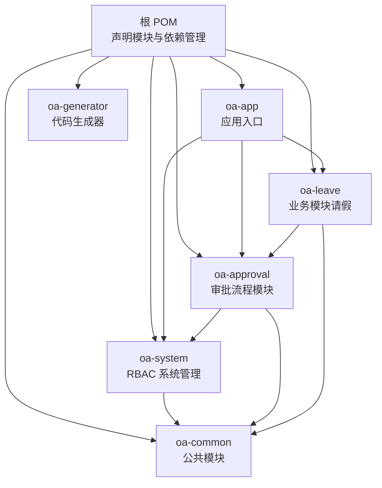
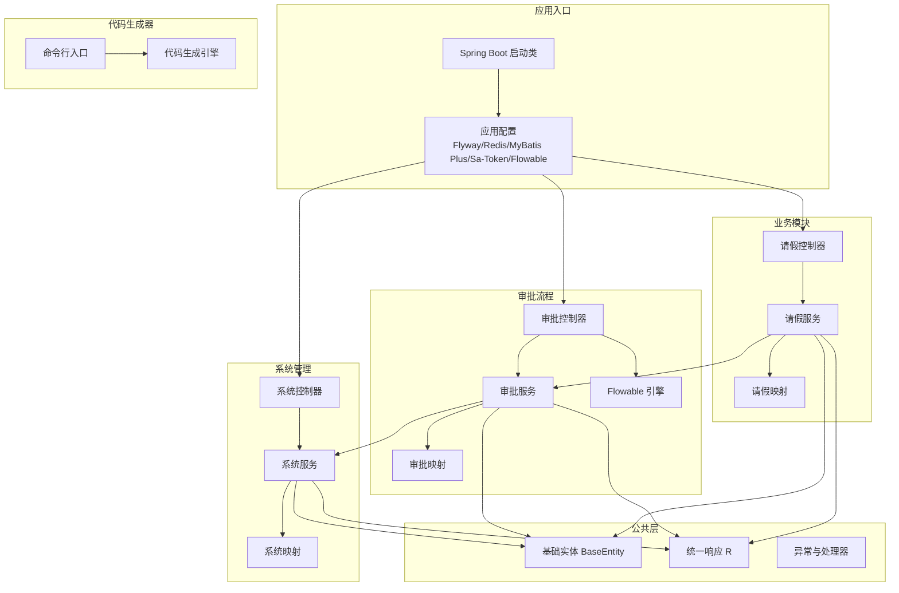
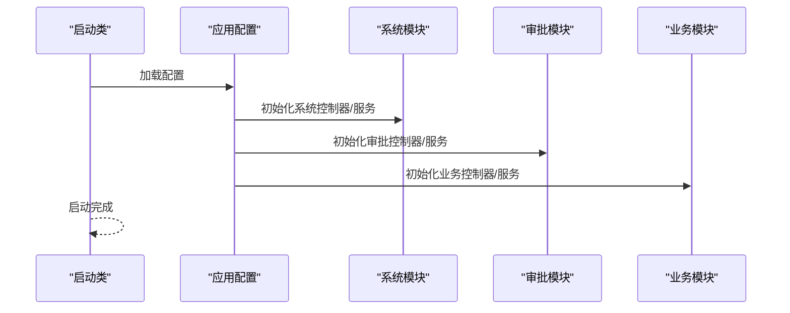
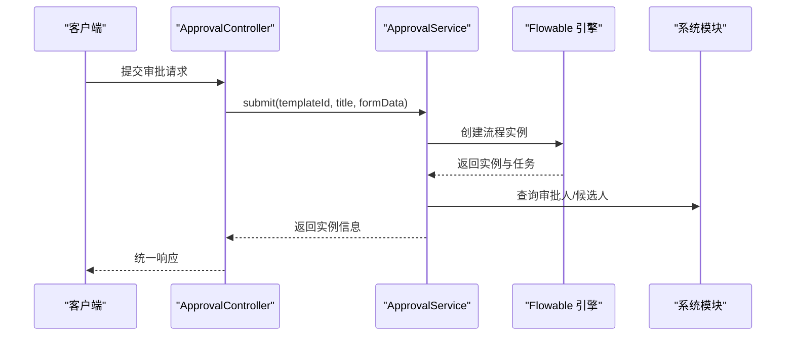
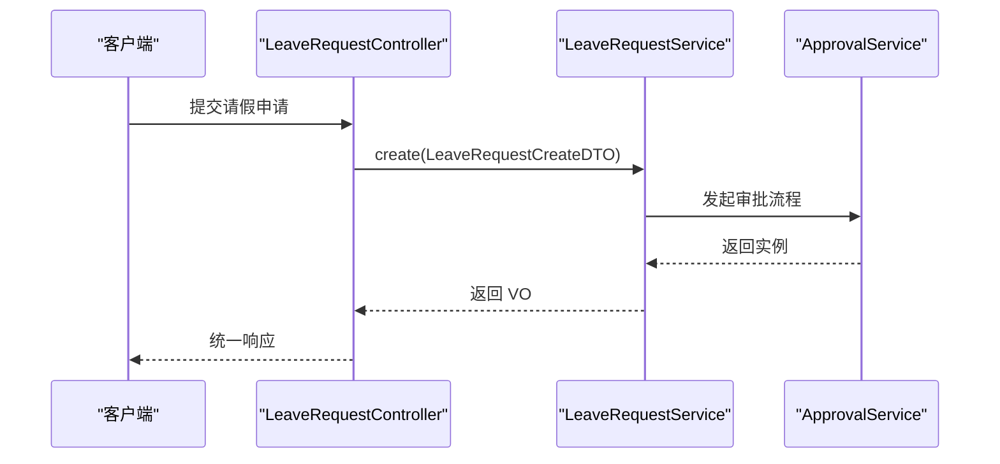
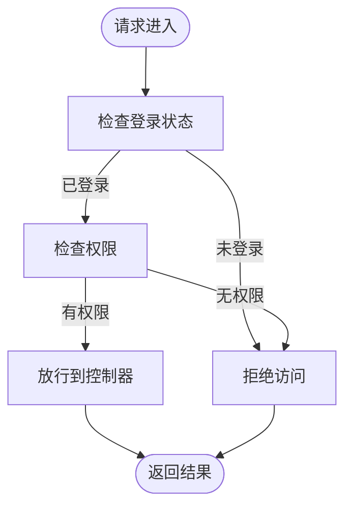
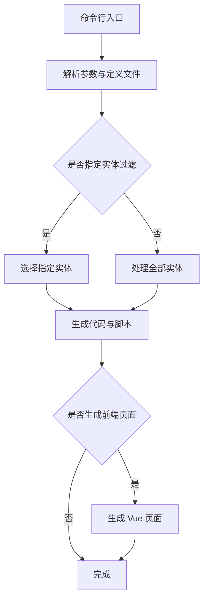
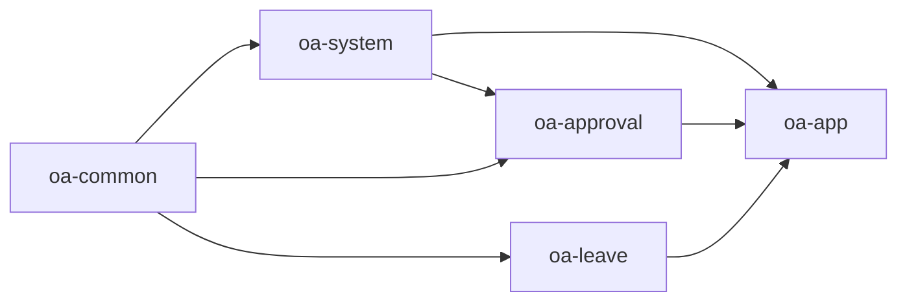

# 项目结构说明

<cite>
**本文档引用的文件**
- [pom.xml](file://pom.xml)
- [OaAdminApplication.java](file://oa-app/src/main/java/com/oa/admin/OaAdminApplication.java)
- [application.yml](file://oa-app/src/main/resources/application.yml)
- [BaseEntity.java](file://oa-common/src/main/java/com/oa/admin/common/entity/BaseEntity.java)
- [R.java](file://oa-common/src/main/java/com/oa/admin/common/result/R.java)
- [SysUserController.java](file://oa-system/src/main/java/com/oa/admin/system/controller/SysUserController.java)
- [SaTokenConfig.java](file://oa-system/src/main/java/com/oa/admin/system/config/SaTokenConfig.java)
- [ApprovalController.java](file://oa-approval/src/main/java/com/oa/admin/approval/controller/ApprovalController.java)
- [FlowableConfig.java](file://oa-approval/src/main/java/com/oa/admin/approval/config/FlowableConfig.java)
- [LeaveRequestController.java](file://oa-leave/src/main/java/com/oa/admin/leave/controller/LeaveRequestController.java)
- [OaGeneratorCli.java](file://oa-generator/src/main/java/com/oa/admin/generator/OaGeneratorCli.java)
- [oa-common/pom.xml](file://oa-common/pom.xml)
- [oa-system/pom.xml](file://oa-system/pom.xml)
- [oa-approval/pom.xml](file://oa-approval/pom.xml)
- [oa-leave/pom.xml](file://oa-leave/pom.xml)
- [oa-app/pom.xml](file://oa-app/pom.xml)
- [oa-generator/pom.xml](file://oa-generator/pom.xml)
</cite>

## 目录
1. [引言](#引言)
2. [项目结构](#项目结构)
3. [核心组件](#核心组件)
4. [架构总览](#架构总览)
5. [详细组件分析](#详细组件分析)
6. [依赖分析](#依赖分析)
7. [性能考虑](#性能考虑)
8. [故障排除指南](#故障排除指南)
9. [结论](#结论)
10. [附录](#附录)

## 引言
本项目是一个基于 Spring Boot 的 OA 审批管理系统，采用 Maven 多模块架构设计，包含公共基础模块、系统管理模块、审批流程模块、业务模块（如请假）、应用入口模块以及代码生成器模块。该架构通过清晰的模块边界与依赖关系，实现了高内聚、低耦合的分层设计，便于团队协作、测试与维护。

## 项目结构
项目采用聚合工程（Aggregator POM）组织，顶层 POM 声明了所有子模块，并在 dependencyManagement 中统一管理版本与依赖范围。各模块职责明确，遵循“公共能力下沉、业务能力上浮”的原则。

**图表来源**
- [pom.xml:21-28](file://pom.xml#L21-L28)
- [oa-app/pom.xml:14-26](file://oa-app/pom.xml#L14-L26)
- [oa-system/pom.xml:14-18](file://oa-system/pom.xml#L14-L18)
- [oa-approval/pom.xml:14-18](file://oa-approval/pom.xml#L14-L18)
- [oa-leave/pom.xml:14-18](file://oa-leave/pom.xml#L14-L18)

**章节来源**
- [pom.xml:1-131](file://pom.xml#L1-L131)
- [oa-app/pom.xml:1-76](file://oa-app/pom.xml#L1-L76)
- [oa-common/pom.xml:1-54](file://oa-common/pom.xml#L1-L54)
- [oa-system/pom.xml:1-39](file://oa-system/pom.xml#L1-L39)
- [oa-approval/pom.xml:1-49](file://oa-approval/pom.xml#L1-L49)
- [oa-leave/pom.xml:1-34](file://oa-leave/pom.xml#L1-L34)
- [oa-generator/pom.xml:1-93](file://oa-generator/pom.xml#L1-L93)

## 核心组件
- 公共模块（oa-common）
  - 职责：提供通用实体基类、统一响应封装、异常处理、工具类等横切能力。
  - 关键点：统一的 BaseEntity 提供创建/更新时间与逻辑删除字段；统一响应包装 R<T> 简化接口返回。
- 系统管理模块（oa-system）
  - 职责：RBAC 权限体系，用户、角色、部门、权限等管理。
  - 关键点：基于 Sa-Token 的全局拦截器配置，统一鉴权；控制器示例展示分页查询与权限注解。
- 审批流程模块（oa-approval）
  - 职责：基于 Flowable 的工作流引擎，提供流程模板、实例、任务、抄送、审计日志等功能。
  - 关键点：Flowable 配置注入事件监听器；控制器提供提交、审批、待办、已办、仪表盘统计等接口。
- 业务模块（oa-leave）
  - 职责：具体的业务场景（如请假），与审批模块集成，支持业务数据提交与重新提交。
  - 关键点：控制器提供列表、详情、增删改、提交审批、重新提交等接口。
- 应用入口模块（oa-app）
  - 职责：Spring Boot 启动类与应用配置，聚合其他模块并暴露运行时配置。
  - 关键点：启动类启用事务与 Mapper 扫描；配置 Flyway、Redis、MyBatis Plus、Sa-Token、Flowable 等。
- 代码生成器模块（oa-generator）
  - 职责：从 YAML 定义生成后端 CRUD 代码与 Flyway 迁移脚本，可选生成前端页面。
  - 关键点：命令行入口 OaGeneratorCli 支持多种参数控制生成行为。

**章节来源**
- [BaseEntity.java:1-26](file://oa-common/src/main/java/com/oa/admin/common/entity/BaseEntity.java#L1-L26)
- [R.java:1-44](file://oa-common/src/main/java/com/oa/admin/common/result/R.java#L1-L44)
- [SysUserController.java:1-85](file://oa-system/src/main/java/com/oa/admin/system/controller/SysUserController.java#L1-L85)
- [SaTokenConfig.java:1-25](file://oa-system/src/main/java/com/oa/admin/system/config/SaTokenConfig.java#L1-L25)
- [ApprovalController.java:1-252](file://oa-approval/src/main/java/com/oa/admin/approval/controller/ApprovalController.java#L1-L252)
- [FlowableConfig.java:1-31](file://oa-approval/src/main/java/com/oa/admin/approval/config/FlowableConfig.java#L1-L31)
- [LeaveRequestController.java:1-68](file://oa-leave/src/main/java/com/oa/admin/leave/controller/LeaveRequestController.java#L1-L68)
- [OaAdminApplication.java:1-19](file://oa-app/src/main/java/com/oa/admin/OaAdminApplication.java#L1-L19)
- [application.yml:1-59](file://oa-app/src/main/resources/application.yml#L1-L59)
- [OaGeneratorCli.java:1-76](file://oa-generator/src/main/java/com/oa/admin/generator/OaGeneratorCli.java#L1-L76)

## 架构总览
系统采用“公共能力下沉 + 业务能力上浮”的分层架构，公共模块提供基础设施，业务模块通过依赖关系向上扩展，应用入口负责装配与运行时配置。

**图表来源**
- [OaAdminApplication.java:11-18](file://oa-app/src/main/java/com/oa/admin/OaAdminApplication.java#L11-L18)
- [application.yml:4-59](file://oa-app/src/main/resources/application.yml#L4-L59)
- [BaseEntity.java:14-25](file://oa-common/src/main/java/com/oa/admin/common/entity/BaseEntity.java#L14-L25)
- [R.java:11-43](file://oa-common/src/main/java/com/oa/admin/common/result/R.java#L11-L43)
- [SysUserController.java:17-31](file://oa-system/src/main/java/com/oa/admin/system/controller/SysUserController.java#L17-L31)
- [ApprovalController.java:29-44](file://oa-approval/src/main/java/com/oa/admin/approval/controller/ApprovalController.java#L29-L44)
- [FlowableConfig.java:15-30](file://oa-approval/src/main/java/com/oa/admin/approval/config/FlowableConfig.java#L15-L30)
- [LeaveRequestController.java:18-41](file://oa-leave/src/main/java/com/oa/admin/leave/controller/LeaveRequestController.java#L18-L41)
- [OaGeneratorCli.java:12-75](file://oa-generator/src/main/java/com/oa/admin/generator/OaGeneratorCli.java#L12-L75)

## 详细组件分析

### 包命名规范与代码组织原则
- controller：面向 HTTP 接口的控制器层，负责请求接收、参数校验、权限控制与结果封装。
- service：业务逻辑层，定义接口与实现，协调领域对象与数据访问。
- mapper：MyBatis 映射层，负责 SQL 与实体的映射。
- entity：领域模型，承载业务实体与注解（如自动填充、逻辑删除）。
- dto：数据传输对象，用于接口间的数据传递与参数封装。
- vo：视图对象，用于对外输出的结构化数据。
- enums：枚举类型，统一状态、类型等常量定义。
- config：Spring 配置类，如 Sa-Token 拦截器、Flowable 引擎配置。
- listener：事件监听器，如审批任务创建监听、流程结束事件监听。
- resolver：流程变量解析器，如审批人/候选人的解析策略。
- util：工具类与辅助方法。

上述包结构在系统管理、审批流程、业务模块中均有体现，确保职责清晰、层次分明。

**章节来源**
- [SysUserController.java:1-85](file://oa-system/src/main/java/com/oa/admin/system/controller/SysUserController.java#L1-L85)
- [ApprovalController.java:1-252](file://oa-approval/src/main/java/com/oa/admin/approval/controller/ApprovalController.java#L1-L252)
- [LeaveRequestController.java:1-68](file://oa-leave/src/main/java/com/oa/admin/leave/controller/LeaveRequestController.java#L1-L68)
- [FlowableConfig.java:1-31](file://oa-approval/src/main/java/com/oa/admin/approval/config/FlowableConfig.java#L1-L31)

### 应用入口模块（oa-app）
- 启动类：启用事务与多模块 Mapper 扫描，整合系统、审批、业务模块。
- 运行时配置：数据源、Flyway、Redis、MyBatis Plus、Sa-Token、Flowable 等。
- 依赖关系：聚合系统、审批、业务模块，引入 MySQL 驱动、Redis、Flyway 等运行时依赖。

**图表来源**
- [OaAdminApplication.java:11-18](file://oa-app/src/main/java/com/oa/admin/OaAdminApplication.java#L11-L18)
- [application.yml:4-59](file://oa-app/src/main/resources/application.yml#L4-L59)

**章节来源**
- [OaAdminApplication.java:1-19](file://oa-app/src/main/java/com/oa/admin/OaAdminApplication.java#L1-L19)
- [application.yml:1-59](file://oa-app/src/main/resources/application.yml#L1-L59)
- [oa-app/pom.xml:14-57](file://oa-app/pom.xml#L14-L57)

### 审批流程模块（oa-approval）
- 控制器：提供提交、审批、待办、已办、仪表盘统计、模板管理、抄送管理等接口。
- 服务：封装审批流程操作、模板发布与节点配置、通知与审计日志。
- 集成：依赖系统模块（权限与用户信息）、公共模块（统一响应与实体基类）。
- 流程引擎：通过 Flowable 配置注入事件监听器，扩展流程生命周期事件处理。

**图表来源**
- [ApprovalController.java:37-44](file://oa-approval/src/main/java/com/oa/admin/approval/controller/ApprovalController.java#L37-L44)
- [FlowableConfig.java:15-30](file://oa-approval/src/main/java/com/oa/admin/approval/config/FlowableConfig.java#L15-L30)

**章节来源**
- [ApprovalController.java:1-252](file://oa-approval/src/main/java/com/oa/admin/approval/controller/ApprovalController.java#L1-L252)
- [FlowableConfig.java:1-31](file://oa-approval/src/main/java/com/oa/admin/approval/config/FlowableConfig.java#L1-L31)
- [oa-approval/pom.xml:14-41](file://oa-approval/pom.xml#L14-L41)

### 业务模块（oa-leave）
- 控制器：提供请假申请的列表、详情、增删改、提交审批、重新提交等接口。
- 服务：封装业务逻辑，调用审批服务发起流程或更新流程数据。
- 集成：依赖公共模块与审批模块，形成“业务数据 + 流程驱动”的闭环。

**图表来源**
- [LeaveRequestController.java:37-41](file://oa-leave/src/main/java/com/oa/admin/leave/controller/LeaveRequestController.java#L37-L41)
- [ApprovalController.java:37-44](file://oa-approval/src/main/java/com/oa/admin/approval/controller/ApprovalController.java#L37-L44)

**章节来源**
- [LeaveRequestController.java:1-68](file://oa-leave/src/main/java/com/oa/admin/leave/controller/LeaveRequestController.java#L1-L68)
- [oa-leave/pom.xml:14-22](file://oa-leave/pom.xml#L14-L22)

### 系统管理模块（oa-system）
- 控制器：提供用户、角色、部门、权限等管理接口，使用 Sa-Token 注解进行权限控制。
- 配置：全局拦截器配置，统一登录校验与放行路径。
- 集成：依赖公共模块，为审批模块提供用户与权限数据支撑。

**图表来源**
- [SaTokenConfig.java:15-23](file://oa-system/src/main/java/com/oa/admin/system/config/SaTokenConfig.java#L15-L23)
- [SysUserController.java:23-31](file://oa-system/src/main/java/com/oa/admin/system/controller/SysUserController.java#L23-L31)

**章节来源**
- [SysUserController.java:1-85](file://oa-system/src/main/java/com/oa/admin/system/controller/SysUserController.java#L1-L85)
- [SaTokenConfig.java:1-25](file://oa-system/src/main/java/com/oa/admin/system/config/SaTokenConfig.java#L1-L25)
- [oa-system/pom.xml:14-26](file://oa-system/pom.xml#L14-L26)

### 代码生成器模块（oa-generator）
- 命令行入口：支持定义文件路径、项目根目录、目标模块、Dry Run、仅生成 Flyway、生成前端页面、实体过滤等参数。
- 功能：从 YAML 定义生成后端 CRUD 代码与 Flyway 迁移脚本，可选生成 Vue 前端页面。
- 适用场景：快速生成标准 CRUD 与迁移脚本，提升开发效率。

**图表来源**
- [OaGeneratorCli.java:12-75](file://oa-generator/src/main/java/com/oa/admin/generator/OaGeneratorCli.java#L12-L75)

**章节来源**
- [OaGeneratorCli.java:1-76](file://oa-generator/src/main/java/com/oa/admin/generator/OaGeneratorCli.java#L1-L76)
- [oa-generator/pom.xml:1-93](file://oa-generator/pom.xml#L1-L93)

## 依赖分析
模块间依赖遵循“上层模块依赖下层模块”的原则，避免反向依赖与循环依赖。

**图表来源**
- [pom.xml:21-28](file://pom.xml#L21-L28)
- [oa-system/pom.xml:14-18](file://oa-system/pom.xml#L14-L18)
- [oa-approval/pom.xml:14-22](file://oa-approval/pom.xml#L14-L22)
- [oa-leave/pom.xml:14-22](file://oa-leave/pom.xml#L14-L22)
- [oa-app/pom.xml:14-26](file://oa-app/pom.xml#L14-L26)

**章节来源**
- [pom.xml:1-131](file://pom.xml#L1-L131)
- [oa-system/pom.xml:1-39](file://oa-system/pom.xml#L1-L39)
- [oa-approval/pom.xml:1-49](file://oa-approval/pom.xml#L1-L49)
- [oa-leave/pom.xml:1-34](file://oa-leave/pom.xml#L1-L34)
- [oa-app/pom.xml:1-76](file://oa-app/pom.xml#L1-L76)

## 性能考虑
- 数据库连接池：HikariCP 参数可按环境调整，建议根据并发与 QPS 调优最大连接数、空闲超时等。
- 缓存：结合 Redis 使用，建议对热点数据与会话进行缓存，降低数据库压力。
- ORM：MyBatis Plus 分页查询与逻辑删除减少不必要的全表扫描。
- 工作流：Flowable 异步执行器按需开启，避免过多异步任务造成资源竞争。
- 日志与序列化：Sa-Token 使用 JSON 序列化以规避安全问题，同时注意序列化开销。

## 故障排除指南
- 启动失败
  - 检查数据源连接参数与数据库连通性。
  - 确认 Flyway 迁移脚本位置与权限。
- 权限相关
  - 确认 Sa-Token 拦截器是否正确配置放行路径。
  - 检查用户角色与权限是否正确绑定。
- 审批流程
  - 检查 Flowable 配置与事件监听器注册。
  - 确认流程模板 XML 是否有效且已发布。
- 代码生成
  - 确认 YAML 定义文件格式正确，实体过滤参数合法。
  - 检查目标模块路径与写入权限。

**章节来源**
- [application.yml:4-59](file://oa-app/src/main/resources/application.yml#L4-L59)
- [SaTokenConfig.java:15-23](file://oa-system/src/main/java/com/oa/admin/system/config/SaTokenConfig.java#L15-L23)
- [FlowableConfig.java:15-30](file://oa-approval/src/main/java/com/oa/admin/approval/config/FlowableConfig.java#L15-L30)
- [OaGeneratorCli.java:51-70](file://oa-generator/src/main/java/com/oa/admin/generator/OaGeneratorCli.java#L51-L70)

## 结论
本项目通过 Maven 多模块架构实现了公共能力共享与业务能力扩展，模块职责清晰、依赖关系明确。配合统一的响应封装、权限控制与流程引擎，能够高效支撑 OA 审批管理场景。建议在后续迭代中持续完善测试覆盖、监控告警与文档建设，以提升整体质量与可维护性。

## 附录
- 包命名规范与职责分工已在“详细组件分析”中说明。
- 最佳实践与注意事项已在“性能考虑”和“故障排除指南”中给出。