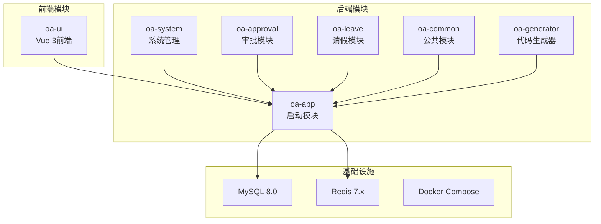
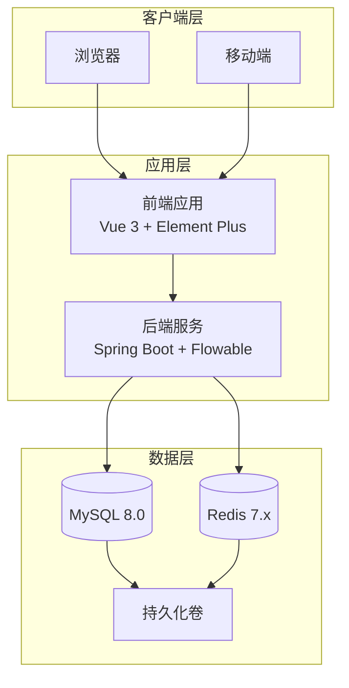
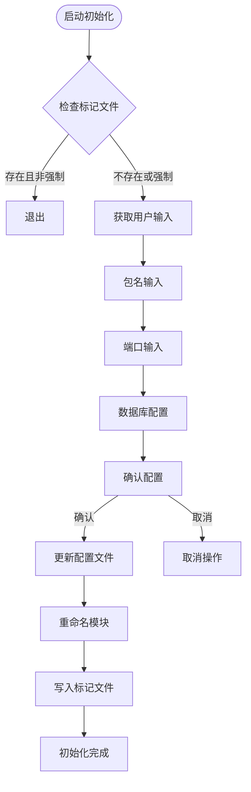
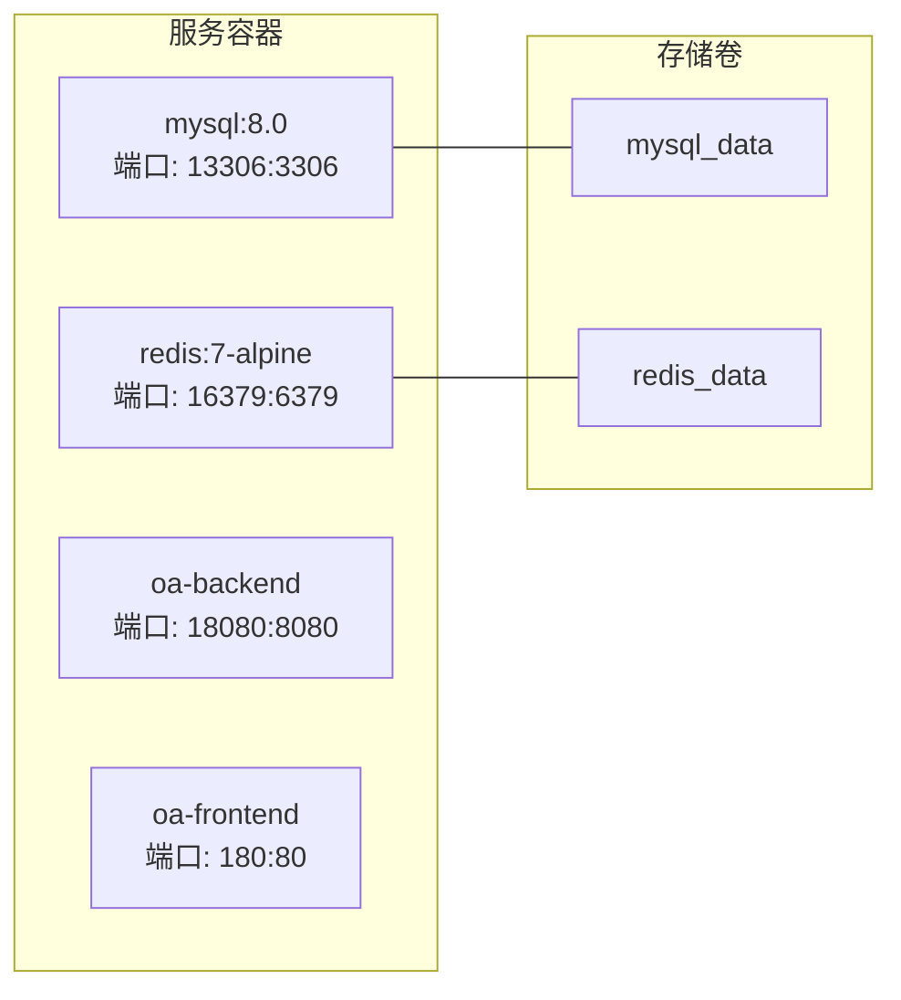
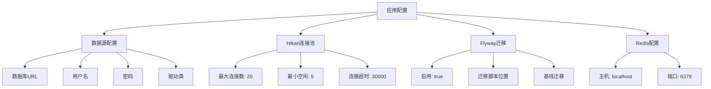
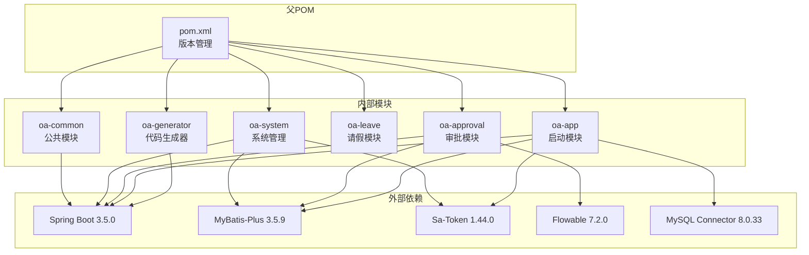
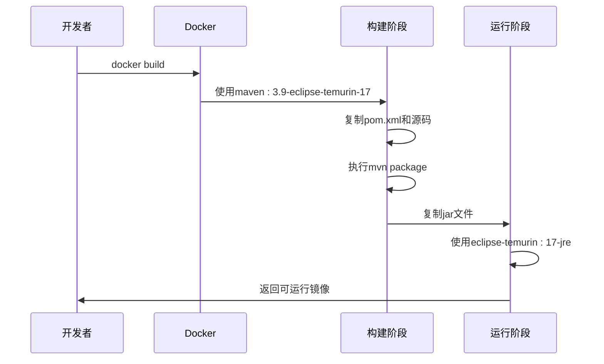

# 快速开始

<cite>
**本文档引用的文件**
- [README.md](file://README.md)
- [init.sh](file://init.sh)
- [docker-compose.yml](file://docker-compose.yml)
- [Dockerfile](file://Dockerfile)
- [pom.xml](file://pom.xml)
- [application.yml](file://oa-app/src/main/resources/application.yml)
- [package.json](file://oa-ui/package.json)
- [vite.config.ts](file://oa-ui/vite.config.ts)
- [V3__seed_data.sql](file://oa-app/src/main/resources/db/migration/V3__seed_data.sql)
</cite>

## 目录
1. [简介](#简介)
2. [项目结构](#项目结构)
3. [核心组件](#核心组件)
4. [架构概览](#架构概览)
5. [详细组件分析](#详细组件分析)
6. [依赖关系分析](#依赖关系分析)
7. [性能考虑](#性能考虑)
8. [故障排除指南](#故障排除指南)
9. [结论](#结论)
10. [附录](#附录)

## 简介

OA审批管理系统是一个基于RBAC权限管理和审批流引擎的后台管理平台模板。该项目提供了完整的权限管理体系（用户、角色、权限、部门）和审批流功能，支持可视化流程设计器和条件分支等高级特性。

**章节来源**
- [README.md:1-226](file://README.md#L1-L226)

## 项目结构

该系统采用多模块Maven架构，包含以下主要模块：



**图表来源**
- [pom.xml:21-27](file://pom.xml#L21-L27)
- [docker-compose.yml:1-66](file://docker-compose.yml#L1-L66)

**章节来源**
- [README.md:48-61](file://README.md#L48-L61)
- [pom.xml:14-28](file://pom.xml#L14-L28)

## 核心组件

### 技术栈概览

系统采用现代化技术栈构建：

| 层次 | 技术 | 版本 |
|------|------|------|
| 后端 | Java + Spring Boot | 21 + 3.5.x |
| ORM | MyBatis-Plus | 3.5.x |
| 权限 | Sa-Token | 1.44.0 |
| 审批引擎 | Flowable | 7.2.0 OSS |
| 数据库迁移 | Flyway | latest |
| 数据库 | MySQL | 8.x |
| 缓存 | Redis | 7.x |
| 前端 | Vue 3 + TypeScript + Vite | 6.x |
| UI | Element Plus | latest |
| 状态管理 | Pinia | 3.x |

### 主要功能模块

1. **RBAC权限管理**：用户管理、角色管理、权限管理、部门管理、数据权限
2. **审批流引擎**：模板管理、发起审批、待办处理、已办查询、抄送管理
3. **安全机制**：单设备登录、接口级权限校验、角色级权限校验、BCrypt密码加密
4. **可视化设计**：bpmn-js定制的流程设计器

**章节来源**
- [README.md:5-19](file://README.md#L5-L19)
- [README.md:63-86](file://README.md#L63-L86)

## 架构概览

系统采用微服务架构，通过Docker容器化部署：



**图表来源**
- [docker-compose.yml:1-66](file://docker-compose.yml#L1-L66)
- [application.yml:4-35](file://oa-app/src/main/resources/application.yml#L4-L35)

## 详细组件分析

### 初始化脚本 init.sh

init.sh是项目的核心自动化工具，提供交互式配置和环境初始化功能：

#### 主要功能特性

1. **包名重命名**：将默认包名 `com.oa.admin` 替换为用户自定义包名
2. **端口配置**：支持自定义前后端端口号
3. **数据库配置**：设置数据库名称、密码、端口
4. **模块重命名**：根据artifactId重命名模块目录
5. **配置更新**：自动更新所有配置文件中的占位符

#### 交互式配置流程



**图表来源**
- [init.sh:43-94](file://init.sh#L43-L94)

#### 配置参数说明

| 参数 | 默认值 | 说明 |
|------|--------|------|
| Group ID | com.example | Maven分组ID |
| Artifact ID | oa-admin | Maven构件ID |
| Package Name | com.example | Java包名 |
| Backend Port | 8080 | 后端服务端口 |
| Frontend Port | 80 | 前端服务端口 |
| Database Name | oa_admin | 数据库名称 |
| Database Password | changeme | 数据库密码 |
| MySQL Port | 3306 | MySQL端口 |
| Redis Port | 6379 | Redis端口 |

**章节来源**
- [init.sh:49-75](file://init.sh#L49-L75)
- [init.sh:147-157](file://init.sh#L147-L157)

### Docker Compose 配置

docker-compose.yml定义了完整的微服务架构：

#### 服务配置



**图表来源**
- [docker-compose.yml:1-66](file://docker-compose.yml#L1-L66)

#### 环境变量配置

| 变量 | 说明 | 默认值 |
|------|------|--------|
| SPRING_DATASOURCE_URL | 数据库连接URL | jdbc:mysql://mysql:3306/oa_admin |
| SPRING_DATASOURCE_USERNAME | 数据库用户名 | root |
| SPRING_DATASOURCE_PASSWORD | 数据库密码 | ${SPRING_DATASOURCE_PASSWORD} |
| SPRING_DATA_REDIS_HOST | Redis主机 | redis |
| SPRING_DATA_REDIS_PORT | Redis端口 | 6379 |

**章节来源**
- [docker-compose.yml:42-48](file://docker-compose.yml#L42-L48)
- [README.md:120-129](file://README.md#L120-L129)

### 后端配置

application.yml定义了Spring Boot应用的核心配置：

#### 数据源配置



**图表来源**
- [application.yml:4-59](file://oa-app/src/main/resources/application.yml#L4-L59)

#### 安全配置

| 配置项 | 值 | 说明 |
|--------|-----|------|
| token-name | satoken | Token名称 |
| timeout | 86400 | Token过期时间(秒) |
| active-timeout | 1800 | 活跃超时时间(秒) |
| token-style | uuid | Token样式 |
| token-serialization | json | 序列化方式 |

**章节来源**
- [application.yml:45-54](file://oa-app/src/main/resources/application.yml#L45-L54)

### 前端配置

#### 开发服务器配置

vite.config.ts提供了开发环境的代理配置：

| 配置项 | 值 | 说明 |
|--------|-----|------|
| 服务器端口 | 5173 | 开发服务器端口 |
| API代理目标 | http://localhost:8080 | 后端API地址 |
| 代理路径 | /api | API请求前缀 |

**章节来源**
- [vite.config.ts:30-38](file://oa-ui/vite.config.ts#L30-L38)

## 依赖关系分析

### Maven依赖层次



**图表来源**
- [pom.xml:14-112](file://pom.xml#L14-L112)

### Docker镜像构建

Dockerfile定义了多阶段构建过程：



**图表来源**
- [Dockerfile:1-22](file://Dockerfile#L1-L22)

**章节来源**
- [pom.xml:30-42](file://pom.xml#L30-L42)
- [Dockerfile:3-21](file://Dockerfile#L3-L21)

## 性能考虑

### 连接池配置

系统使用HikariCP作为数据库连接池，优化了以下参数：

- **最大连接数**: 20个连接
- **最小空闲连接**: 5个连接  
- **连接超时时间**: 30秒
- **连接最大生存时间**: 30分钟
- **空闲超时时间**: 10分钟

### 缓存策略

- **Redis缓存**: 用户会话和临时数据
- **连接池复用**: 减少数据库连接开销
- **异步执行**: 审批任务异步处理

### 前端性能优化

- **Vite构建**: 快速开发服务器和生产构建
- **按需加载**: Element Plus组件按需导入
- **代理配置**: 开发环境API代理避免跨域问题

## 故障排除指南

### 常见启动问题

#### 1. 数据库连接失败

**症状**: 后端启动时报数据库连接错误

**解决方案**:
1. 检查MySQL服务状态
2. 验证数据库凭据配置
3. 确认网络连通性

**章节来源**
- [docker-compose.yml:16-20](file://docker-compose.yml#L16-L20)

#### 2. 端口冲突

**症状**: Docker启动时端口被占用

**解决方案**:
1. 修改docker-compose.yml中的端口映射
2. 使用 `docker ps` 查看占用端口的服务
3. 停止冲突的服务或更改端口

#### 3. Java版本不兼容

**症状**: Maven编译失败，提示Java版本错误

**解决方案**:
1. 确认系统安装了Java 21
2. 设置正确的JAVA_HOME环境变量
3. 验证 `java -version` 输出

**章节来源**
- [README.md:25](file://README.md#L25)

#### 4. 前端代理配置问题

**症状**: 前端无法访问后端API

**解决方案**:
1. 检查vite.config.ts中的代理配置
2. 确认后端服务已在8080端口运行
3. 验证CORS配置

**章节来源**
- [vite.config.ts:32-36](file://oa-ui/vite.config.ts#L32-L36)

### 安全配置建议

#### 首次登录安全

1. **立即修改默认密码**: 使用系统提供的修改密码功能
2. **启用双因素认证**: 如有需要可扩展实现
3. **定期轮换密码**: 建议3个月轮换一次

#### 生产环境安全加固

1. **HTTPS配置**: 使用反向代理启用TLS
2. **防火墙规则**: 限制不必要的端口暴露
3. **日志监控**: 启用详细的审计日志
4. **数据库备份**: 定期备份重要数据

**章节来源**
- [README.md:45](file://README.md#L45)

## 结论

OA审批管理系统提供了完整的权限管理和审批流解决方案。通过init.sh脚本和Docker Compose，新用户可以在几分钟内完成环境搭建和项目启动。

### 关键优势

1. **快速部署**: 一键启动所有服务
2. **模块化设计**: 清晰的模块分离便于维护
3. **完整功能**: 包含RBAC权限和审批流两大核心功能
4. **技术先进**: 采用最新的Spring Boot和Vue 3技术栈

### 后续步骤

1. 访问 `http://localhost` 进行系统登录
2. 使用默认账号 `admin/admin123` 登录
3. 立即修改默认密码
4. 配置系统参数和用户权限
5. 设计业务审批流程模板

## 附录

### 环境要求清单

| 组件 | 版本要求 | 安装方式 |
|------|----------|----------|
| Java | 21+ | 官方JDK |
| Node.js | 18+ | 官方安装包 |
| Docker | 最新稳定版 | Docker Desktop |
| Docker Compose | 最新版本 | Docker Desktop内置 |

### 默认端口映射

| 服务 | 本地端口 | 容器端口 | 用途 |
|------|----------|----------|------|
| 前端 | 80 | 80 | Vue.js应用 |
| 后端 | 8080 | 8080 | Spring Boot API |
| MySQL | 13306 | 3306 | 数据库服务 |
| Redis | 16379 | 6379 | 缓存服务 |

### 快速启动命令

```bash
# 1. Fork并克隆仓库
git clone https://github.com/YOUR_USERNAME/oa-check-admin.git
cd oa-check-admin

# 2. 运行初始化脚本
./init.sh

# 3. 启动所有服务
docker compose up -d

# 4. 访问系统
# 前端: http://localhost
# 后端: http://localhost:8080
```

**章节来源**
- [README.md:29-46](file://README.md#L29-L46)