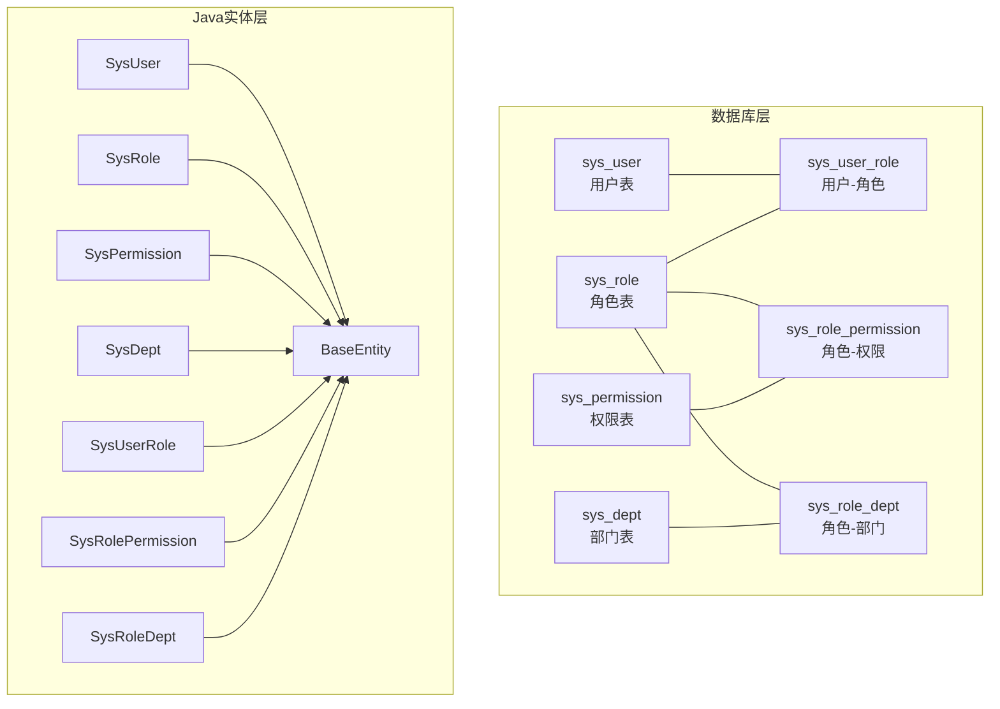
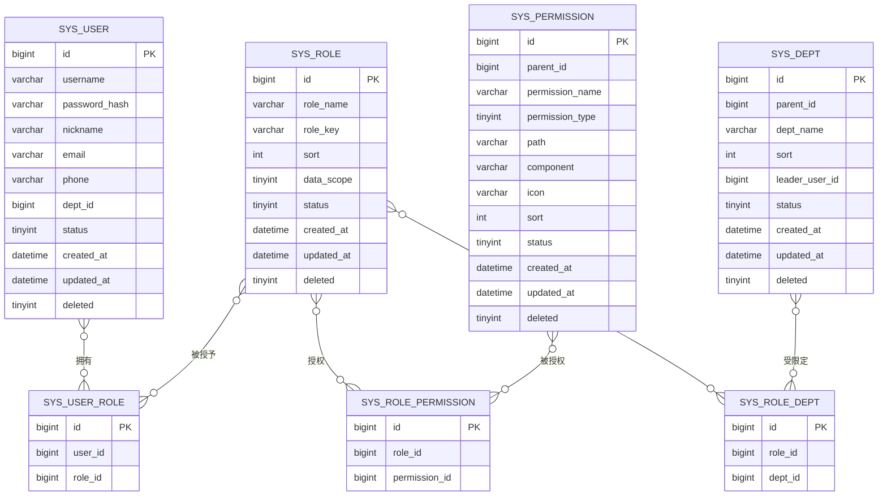
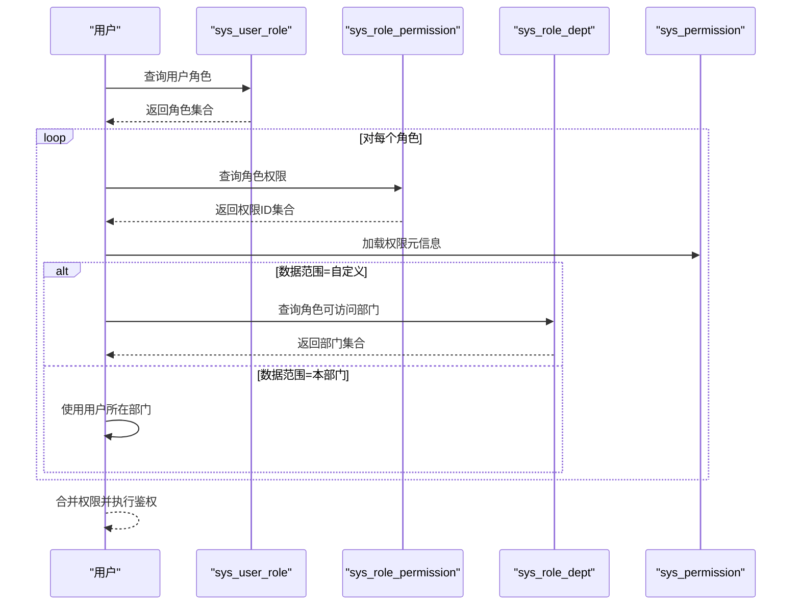
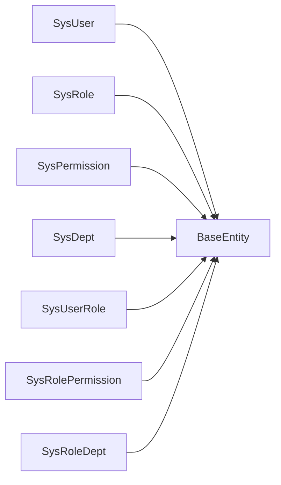

# RBAC权限表设计

<cite>
**本文引用的文件**
- [V1__init_sys_tables.sql](file://oa-app/src/main/resources/db/migration/V1__init_sys_tables.sql)
- [V3__seed_data.sql](file://oa-app/src/main/resources/db/migration/V3__seed_data.sql)
- [BaseEntity.java](file://oa-common/src/main/java/com/oa/admin/common/entity/BaseEntity.java)
- [SysUser.java](file://oa-system/src/main/java/com/oa/admin/system/entity/SysUser.java)
- [SysRole.java](file://oa-system/src/main/java/com/oa/admin/system/entity/SysRole.java)
- [SysPermission.java](file://oa-system/src/main/java/com/oa/admin/system/entity/SysPermission.java)
- [SysDept.java](file://oa-system/src/main/java/com/oa/admin/system/entity/SysDept.java)
- [SysUserRole.java](file://oa-system/src/main/java/com/oa/admin/system/entity/SysUserRole.java)
- [SysRolePermission.java](file://oa-system/src/main/java/com/oa/admin/system/entity/SysRolePermission.java)
- [SysRoleDept.java](file://oa-system/src/main/java/com/oa/admin/system/entity/SysRoleDept.java)
- [DataScope.java](file://oa-system/src/main/java/com/oa/admin/system/enums/DataScope.java)
- [PermissionType.java](file://oa-system/src/main/java/com/oa/admin/system/enums/PermissionType.java)
- [SysUserMapper.java](file://oa-system/src/main/java/com/oa/admin/system/mapper/SysUserMapper.java)
- [SysRoleMapper.java](file://oa-system/src/main/java/com/oa/admin/system/mapper/SysRoleMapper.java)
- [SysPermissionMapper.java](file://oa-system/src/main/java/com/oa/admin/system/mapper/SysPermissionMapper.java)
- [SysDeptMapper.java](file://oa-system/src/main/java/com/oa/admin/system/mapper/SysDeptMapper.java)
</cite>

## 目录
1. [简介](#简介)
2. [项目结构](#项目结构)
3. [核心组件](#核心组件)
4. [架构总览](#架构总览)
5. [详细组件分析](#详细组件分析)
6. [依赖分析](#依赖分析)
7. [性能考量](#性能考量)
8. [故障排查指南](#故障排查指南)
9. [结论](#结论)
10. [附录](#附录)

## 简介
本文件系统化梳理 OA 系统中基于 RBAC 的权限表设计与实现，覆盖用户、角色、权限、部门及多对多关联表的结构、字段、约束与索引，并解释数据范围控制（data_scope）、逻辑删除策略、权限继承与验证的数据结构支撑。文档同时提供 ER 关系图与表结构对比，帮助开发者与运维人员快速理解并正确使用该权限模型。

## 项目结构
RBAC 权限相关的核心对象由两部分组成：
- 数据库层：Flyway 迁移脚本定义了系统表与关联表的结构
- Java 实体层：MyBatis-Plus 实体类映射系统表，配合通用基类实现自动填充与逻辑删除

图表来源
- [V1__init_sys_tables.sql:1-84](file://oa-app/src/main/resources/db/migration/V1__init_sys_tables.sql#L1-L84)
- [SysUser.java:1-27](file://oa-system/src/main/java/com/oa/admin/system/entity/SysUser.java#L1-L27)
- [SysRole.java:1-26](file://oa-system/src/main/java/com/oa/admin/system/entity/SysRole.java#L1-L26)
- [SysPermission.java:1-35](file://oa-system/src/main/java/com/oa/admin/system/entity/SysPermission.java#L1-L35)
- [SysDept.java:1-31](file://oa-system/src/main/java/com/oa/admin/system/entity/SysDept.java#L1-L31)
- [SysUserRole.java:1-19](file://oa-system/src/main/java/com/oa/admin/system/entity/SysUserRole.java#L1-L19)
- [SysRolePermission.java:1-19](file://oa-system/src/main/java/com/oa/admin/system/entity/SysRolePermission.java#L1-L19)
- [SysRoleDept.java:1-19](file://oa-system/src/main/java/com/oa/admin/system/entity/SysRoleDept.java#L1-L19)
- [BaseEntity.java:1-26](file://oa-common/src/main/java/com/oa/admin/common/entity/BaseEntity.java#L1-L26)

章节来源
- [V1__init_sys_tables.sql:1-84](file://oa-app/src/main/resources/db/migration/V1__init_sys_tables.sql#L1-L84)
- [BaseEntity.java:1-26](file://oa-common/src/main/java/com/oa/admin/common/entity/BaseEntity.java#L1-L26)

## 核心组件
- 用户表（sys_user）
  - 字段要点：用户名唯一性（结合逻辑删除）、密码哈希、昵称、邮箱、电话、所属部门、状态、时间戳与逻辑删除
  - 约束与索引：唯一索引（username, deleted）、部门索引（dept_id）
- 角色表（sys_role）
  - 字段要点：角色名、角色键（role_key）、排序、数据范围（data_scope）、状态、时间戳与逻辑删除
  - 约束与索引：唯一索引（role_key, deleted）
- 权限表（sys_permission）
  - 字段要点：父子级关系（parent_id）、权限名称、权限类型（菜单/按钮/API）、前端路由与组件、图标、排序、状态、时间戳与逻辑删除
  - 约束与索引：父节点索引（parent_id）
- 部门表（sys_dept）
  - 字段要点：父子级关系（parent_id）、部门名称、排序、负责人、状态、时间戳与逻辑删除
  - 约束与索引：父节点索引（parent_id）
- 关联表
  - sys_user_role：用户-角色（唯一索引：user_id, role_id；角色索引：role_id）
  - sys_role_permission：角色-权限（唯一索引：role_id, permission_id）
  - sys_role_dept：角色-部门（唯一索引：role_id, dept_id）

章节来源
- [V1__init_sys_tables.sql:5-84](file://oa-app/src/main/resources/db/migration/V1__init_sys_tables.sql#L5-L84)
- [SysUser.java:16-26](file://oa-system/src/main/java/com/oa/admin/system/entity/SysUser.java#L16-L26)
- [SysRole.java:15-25](file://oa-system/src/main/java/com/oa/admin/system/entity/SysRole.java#L15-L25)
- [SysPermission.java:18-34](file://oa-system/src/main/java/com/oa/admin/system/entity/SysPermission.java#L18-L34)
- [SysDept.java:18-30](file://oa-system/src/main/java/com/oa/admin/system/entity/SysDept.java#L18-L30)
- [SysUserRole.java:12-18](file://oa-system/src/main/java/com/oa/admin/system/entity/SysUserRole.java#L12-L18)
- [SysRolePermission.java:12-18](file://oa-system/src/main/java/com/oa/admin/system/entity/SysRolePermission.java#L12-L18)
- [SysRoleDept.java:12-18](file://oa-system/src/main/java/com/oa/admin/system/entity/SysRoleDept.java#L12-L18)

## 架构总览
下图展示 RBAC 四大主表与其关联表之间的 ER 关系，体现多对多与树形层级特性：

图表来源
- [V1__init_sys_tables.sql:5-84](file://oa-app/src/main/resources/db/migration/V1__init_sys_tables.sql#L5-L84)

## 详细组件分析

### 用户表（sys_user）与实体映射
- 表结构要点
  - 主键自增 id
  - 唯一索引（username, deleted）：保证同一逻辑删除状态下的用户名唯一
  - 外键 dept_id 指向 sys_dept.id
  - 状态与逻辑删除字段
  - 时间戳自动填充
- 实体映射
  - 继承 BaseEntity，自动填充创建/更新时间与逻辑删除
  - 字段映射到 username、passwordHash、nickname、email、phone、deptId、status
- 使用建议
  - 登录时按 username 查询并校验密码哈希
  - 通过 sys_user_role 获取用户角色集合

章节来源
- [V1__init_sys_tables.sql:18-32](file://oa-app/src/main/resources/db/migration/V1__init_sys_tables.sql#L18-L32)
- [SysUser.java:16-26](file://oa-system/src/main/java/com/oa/admin/system/entity/SysUser.java#L16-L26)
- [BaseEntity.java:14-25](file://oa-common/src/main/java/com/oa/admin/common/entity/BaseEntity.java#L14-L25)

### 角色表（sys_role）与实体映射
- 表结构要点
  - 主键自增 id
  - 唯一索引（role_key, deleted）：保证同一逻辑删除状态下的角色键唯一
  - data_scope 字段用于数据范围控制（全部/本部门/自定义）
  - 状态与逻辑删除字段
  - 时间戳自动填充
- 实体映射
  - 继承 BaseEntity
  - 字段映射到 roleName、roleKey、sort、dataScope、status
- 数据范围控制
  - 通过枚举 DataScope 提供类型安全的取值与转换
  - 与 sys_role_dept 联合实现“自定义数据范围”下的部门集

章节来源
- [V1__init_sys_tables.sql:34-45](file://oa-app/src/main/resources/db/migration/V1__init_sys_tables.sql#L34-L45)
- [SysRole.java:15-25](file://oa-system/src/main/java/com/oa/admin/system/entity/SysRole.java#L15-L25)
- [DataScope.java:11-26](file://oa-system/src/main/java/com/oa/admin/system/enums/DataScope.java#L11-L26)
- [BaseEntity.java:14-25](file://oa-common/src/main/java/com/oa/admin/common/entity/BaseEntity.java#L14-L25)

### 权限表（sys_permission）与实体映射
- 表结构要点
  - 树形结构：parent_id 指向父级权限
  - 权限类型：菜单、按钮、API，通过枚举 PermissionType 管理
  - 前端集成字段：path、component、icon
  - 排序与状态、逻辑删除、时间戳
- 实体映射
  - 继承 BaseEntity
  - 字段映射到 parentId、permissionName、permissionType、path、component、icon、sort、status
  - children 字段为树形渲染保留（非持久化）
- 权限验证
  - 通过 sys_role_permission 获取角色拥有的权限集合
  - 结合用户可访问的资源路径与操作类型进行鉴权

章节来源
- [V1__init_sys_tables.sql:47-61](file://oa-app/src/main/resources/db/migration/V1__init_sys_tables.sql#L47-L61)
- [SysPermission.java:18-34](file://oa-system/src/main/java/com/oa/admin/system/entity/SysPermission.java#L18-L34)
- [PermissionType.java:11-26](file://oa-system/src/main/java/com/oa/admin/system/enums/PermissionType.java#L11-L26)
- [BaseEntity.java:14-25](file://oa-common/src/main/java/com/oa/admin/common/entity/BaseEntity.java#L14-L25)

### 部门表（sys_dept）与实体映射
- 表结构要点
  - 树形结构：parent_id 指向父级部门
  - leader_user_id 可选指向部门负责人
  - 状态、排序、逻辑删除、时间戳
- 实体映射
  - 继承 BaseEntity
  - 字段映射到 parentId、deptName、sort、leaderUserId、status
  - children 字段为树形渲染保留（非持久化）
- 数据范围联动
  - 与 sys_role_dept 协作，实现“本部门/自定义”数据范围

章节来源
- [V1__init_sys_tables.sql:5-16](file://oa-app/src/main/resources/db/migration/V1__init_sys_tables.sql#L5-L16)
- [SysDept.java:18-30](file://oa-system/src/main/java/com/oa/admin/system/entity/SysDept.java#L18-L30)
- [BaseEntity.java:14-25](file://oa-common/src/main/java/com/oa/admin/common/entity/BaseEntity.java#L14-L25)

### 关联表与权限继承
- sys_user_role：用户-角色
  - 唯一索引（user_id, role_id），避免重复授权
  - 角色索引（role_id）便于按角色查询用户
- sys_role_permission：角色-权限
  - 唯一索引（role_id, permission_id），确保权限去重
- sys_role_dept：角色-部门（自定义数据范围）
  - 唯一索引（role_id, dept_id），记录角色可访问的部门集合

图表来源
- [V1__init_sys_tables.sql:63-83](file://oa-app/src/main/resources/db/migration/V1__init_sys_tables.sql#L63-L83)
- [SysUserRole.java:12-18](file://oa-system/src/main/java/com/oa/admin/system/entity/SysUserRole.java#L12-L18)
- [SysRolePermission.java:12-18](file://oa-system/src/main/java/com/oa/admin/system/entity/SysRolePermission.java#L12-L18)
- [SysRoleDept.java:12-18](file://oa-system/src/main/java/com/oa/admin/system/entity/SysRoleDept.java#L12-L18)

章节来源
- [V1__init_sys_tables.sql:63-83](file://oa-app/src/main/resources/db/migration/V1__init_sys_tables.sql#L63-L83)
- [SysUserRole.java:12-18](file://oa-system/src/main/java/com/oa/admin/system/entity/SysUserRole.java#L12-L18)
- [SysRolePermission.java:12-18](file://oa-system/src/main/java/com/oa/admin/system/entity/SysRolePermission.java#L12-L18)
- [SysRoleDept.java:12-18](file://oa-system/src/main/java/com/oa/admin/system/entity/SysRoleDept.java#L12-L18)

### 数据范围控制机制（data_scope）
- 取值与含义
  - 全部数据：1
  - 本部门：2
  - 自定义：3
- 实现方式
  - 角色表保存 data_scope
  - 当 data_scope=2 时，使用用户所在部门作为数据边界
  - 当 data_scope=3 时，通过 sys_role_dept 获取允许访问的部门集合
- 与业务的衔接
  - 在查询数据时，将用户可访问的部门集合注入到 SQL 查询条件中，实现最小权限可见

章节来源
- [V1__init_sys_tables.sql:39](file://oa-app/src/main/resources/db/migration/V1__init_sys_tables.sql#L39)
- [SysRole.java:22-23](file://oa-system/src/main/java/com/oa/admin/system/entity/SysRole.java#L22-L23)
- [DataScope.java:11-26](file://oa-system/src/main/java/com/oa/admin/system/enums/DataScope.java#L11-L26)
- [V3__seed_data.sql:22](file://oa-app/src/main/resources/db/migration/V3__seed_data.sql#L22)

### 逻辑删除策略
- 设计原则
  - 所有实体均继承 BaseEntity，统一使用 @TableLogic 标注 deleted 字段
  - 查询默认隐藏 deleted=1 的记录，确保数据安全与审计可追溯
- 迁移与实体映射
  - 数据库层在各表增加 deleted 字段
  - Java 层通过 BaseEntity 统一处理创建/更新时间与逻辑删除

章节来源
- [BaseEntity.java:23-24](file://oa-common/src/main/java/com/oa/admin/common/entity/BaseEntity.java#L23-L24)
- [V1__init_sys_tables.sql:14](file://oa-app/src/main/resources/db/migration/V1__init_sys_tables.sql#L14)
- [V1__init_sys_tables.sql:29](file://oa-app/src/main/resources/db/migration/V1__init_sys_tables.sql#L29)
- [V1__init_sys_tables.sql:43](file://oa-app/src/main/resources/db/migration/V1__init_sys_tables.sql#L43)
- [V1__init_sys_tables.sql:59](file://oa-app/src/main/resources/db/migration/V1__init_sys_tables.sql#L59)

### 权限类型与继承验证的数据结构支持
- 权限类型
  - 菜单（1）、按钮（2）、API（3），通过 PermissionType 枚举管理
- 权限继承
  - 通过树形权限（parent_id）表达层级关系
  - 通过 sys_role_permission 将角色与权限建立多对多关系
- 验证流程
  - 用户登录后获取角色集合
  - 依据角色集合查询权限 ID 列表
  - 根据 data_scope 计算可访问数据范围
  - 将权限与请求路径/方法进行匹配完成鉴权

章节来源
- [SysPermission.java:24-25](file://oa-system/src/main/java/com/oa/admin/system/entity/SysPermission.java#L24-L25)
- [PermissionType.java:11-26](file://oa-system/src/main/java/com/oa/admin/system/enums/PermissionType.java#L11-L26)
- [V1__init_sys_tables.sql:63-76](file://oa-app/src/main/resources/db/migration/V1__init_sys_tables.sql#L63-L76)

## 依赖分析
- 表间依赖
  - sys_user.dept_id → sys_dept.id
  - sys_user_role.user_id → sys_user.id
  - sys_user_role.role_id → sys_role.id
  - sys_role_permission.role_id → sys_role.id
  - sys_role_permission.permission_id → sys_permission.id
  - sys_role_dept.role_id → sys_role.id
  - sys_role_dept.dept_id → sys_dept.id
- 实体依赖
  - 所有实体继承 BaseEntity，共享逻辑删除与时间戳能力
  - 枚举类（DataScope、PermissionType）为表字段提供类型安全

图表来源
- [BaseEntity.java:14-25](file://oa-common/src/main/java/com/oa/admin/common/entity/BaseEntity.java#L14-L25)
- [SysUser.java:16](file://oa-system/src/main/java/com/oa/admin/system/entity/SysUser.java#L16)
- [SysRole.java:15](file://oa-system/src/main/java/com/oa/admin/system/entity/SysRole.java#L15)
- [SysPermission.java:18](file://oa-system/src/main/java/com/oa/admin/system/entity/SysPermission.java#L18)
- [SysDept.java:18](file://oa-system/src/main/java/com/oa/admin/system/entity/SysDept.java#L18)
- [SysUserRole.java:12](file://oa-system/src/main/java/com/oa/admin/system/entity/SysUserRole.java#L12)
- [SysRolePermission.java:12](file://oa-system/src/main/java/com/oa/admin/system/entity/SysRolePermission.java#L12)
- [SysRoleDept.java:12](file://oa-system/src/main/java/com/oa/admin/system/entity/SysRoleDept.java#L12)

章节来源
- [V1__init_sys_tables.sql:5-84](file://oa-app/src/main/resources/db/migration/V1__init_sys_tables.sql#L5-L84)
- [BaseEntity.java:14-25](file://oa-common/src/main/java/com/oa/admin/common/entity/BaseEntity.java#L14-L25)

## 性能考量
- 索引设计
  - sys_user：唯一索引（username, deleted）、dept_id 索引，满足登录与部门过滤
  - sys_role：唯一索引（role_key, deleted），满足角色键快速定位
  - sys_permission/sys_dept：parent_id 索引，支持树形查询与层级遍历
  - 关联表：唯一索引（user_id, role_id）、（role_id, permission_id）、（role_id, dept_id），避免重复并加速查找
- 查询优化
  - 登录与权限加载尽量走联合索引，减少回表
  - 树形查询采用子查询或临时表缓存中间结果
  - 数据范围计算优先使用角色-部门集合，避免逐条用户扫描
- 写入优化
  - 批量插入权限与角色-权限映射，减少事务开销
  - 逻辑删除避免物理删除，降低维护成本

## 故障排查指南
- 常见问题
  - 用户无法登录：检查 sys_user 中是否存在（username, deleted）组合且状态正常
  - 权限不生效：确认 sys_role_permission 是否存在对应（role_id, permission_id）
  - 数据范围异常：核对 sys_role.data_scope 与 sys_role_dept 的配置是否一致
- 排查步骤
  - 核对 BaseEntity 的逻辑删除字段是否正确应用
  - 检查关联表唯一索引是否被破坏
  - 验证权限类型枚举与数据库枚举值一致性
- 相关文件定位
  - 表结构与索引：[V1__init_sys_tables.sql:5-84](file://oa-app/src/main/resources/db/migration/V1__init_sys_tables.sql#L5-L84)
  - 实体与基类：[BaseEntity.java:14-25](file://oa-common/src/main/java/com/oa/admin/common/entity/BaseEntity.java#L14-L25)
  - 枚举与类型：[DataScope.java:11-26](file://oa-system/src/main/java/com/oa/admin/system/enums/DataScope.java#L11-L26)、[PermissionType.java:11-26](file://oa-system/src/main/java/com/oa/admin/system/enums/PermissionType.java#L11-L26)

章节来源
- [V1__init_sys_tables.sql:5-84](file://oa-app/src/main/resources/db/migration/V1__init_sys_tables.sql#L5-L84)
- [BaseEntity.java:14-25](file://oa-common/src/main/java/com/oa/admin/common/entity/BaseEntity.java#L14-L25)
- [DataScope.java:11-26](file://oa-system/src/main/java/com/oa/admin/system/enums/DataScope.java#L11-L26)
- [PermissionType.java:11-26](file://oa-system/src/main/java/com/oa/admin/system/enums/PermissionType.java#L11-L26)

## 结论
本 RBAC 权限体系通过清晰的四表结构与三张关联表，实现了用户-角色-权限-部门的灵活授权与数据范围控制。借助逻辑删除与统一基类，系统在保障安全性的同时提升了可维护性。配合权限类型枚举与数据范围枚举，权限继承与验证具备良好的扩展性与可读性。建议在生产环境中严格遵循索引与唯一约束，配合批量写入与树形查询优化，确保高并发场景下的稳定性与性能。

## 附录
- 表结构对比（字段、类型、约束、索引）
  - sys_user：主键、用户名唯一（含deleted）、部门外键、状态、时间戳、逻辑删除；索引：dept_id
  - sys_role：主键、角色键唯一（含deleted）、数据范围、状态、时间戳、逻辑删除
  - sys_permission：主键、parent_id、权限类型、路径/组件/图标、排序、状态、时间戳、逻辑删除；索引：parent_id
  - sys_dept：主键、parent_id、负责人、状态、排序、时间戳、逻辑删除；索引：parent_id
  - sys_user_role：主键、user_id、role_id；唯一索引：（user_id, role_id）；索引：role_id
  - sys_role_permission：主键、role_id、permission_id；唯一索引：（role_id, permission_id）
  - sys_role_dept：主键、role_id、dept_id；唯一索引：（role_id, dept_id）

章节来源
- [V1__init_sys_tables.sql:5-84](file://oa-app/src/main/resources/db/migration/V1__init_sys_tables.sql#L5-L84)