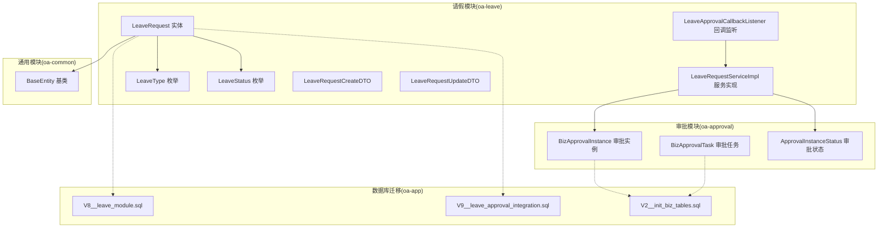
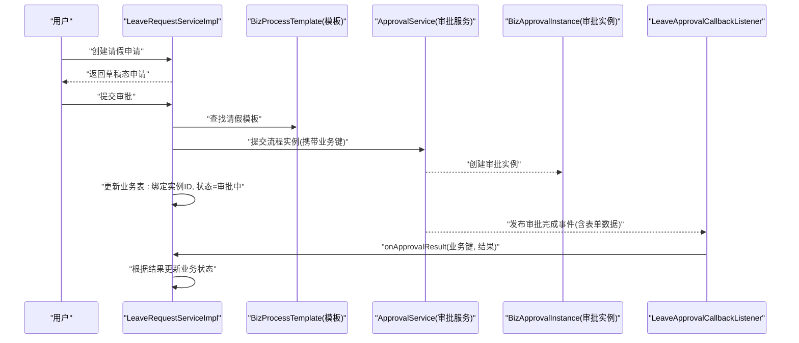
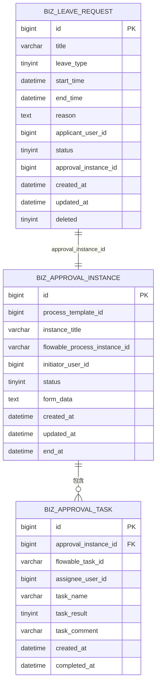
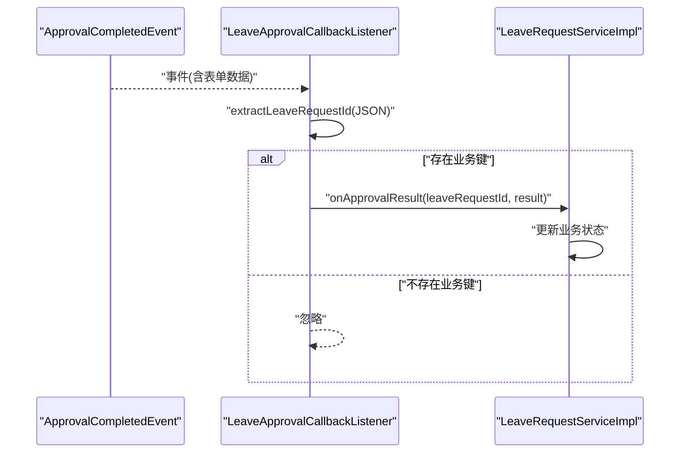
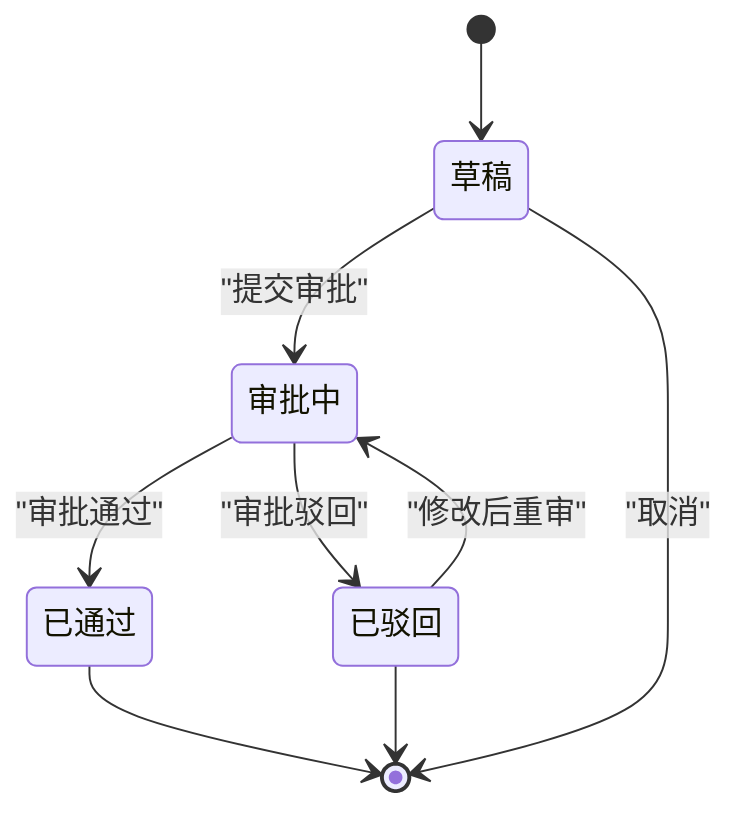
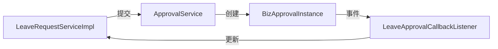

# 业务数据模型

<cite>
**本文引用的文件**
- [LeaveRequest.java](file://oa-leave/src/main/java/com/oa/admin/leave/entity/LeaveRequest.java)
- [LeaveType.java](file://oa-leave/src/main/java/com/oa/admin/leave/enums/LeaveType.java)
- [LeaveStatus.java](file://oa-leave/src/main/java/com/oa/admin/leave/enums/LeaveStatus.java)
- [LeaveRequestServiceImpl.java](file://oa-leave/src/main/java/com/oa/admin/leave/service/impl/LeaveRequestServiceImpl.java)
- [LeaveApprovalCallbackListener.java](file://oa-leave/src/main/java/com/oa/admin/leave/listener/LeaveApprovalCallbackListener.java)
- [BizApprovalInstance.java](file://oa-approval/src/main/java/com/oa/admin/approval/entity/BizApprovalInstance.java)
- [BizApprovalTask.java](file://oa-approval/src/main/java/com/oa/admin/approval/entity/BizApprovalTask.java)
- [ApprovalInstanceStatus.java](file://oa-approval/src/main/java/com/oa/admin/approval/enums/ApprovalInstanceStatus.java)
- [BaseEntity.java](file://oa-common/src/main/java/com/oa/admin/common/entity/BaseEntity.java)
- [V8__leave_module.sql](file://oa-app/src/main/resources/db/migration/V8__leave_module.sql)
- [V9__leave_approval_integration.sql](file://oa-app/src/main/resources/db/migration/V9__leave_approval_integration.sql)
- [V2__init_biz_tables.sql](file://oa-app/src/main/resources/db/migration/V2__init_biz_tables.sql)
- [LeaveRequestCreateDTO.java](file://oa-leave/src/main/java/com/oa/admin/leave/dto/LeaveRequestCreateDTO.java)
- [LeaveRequestUpdateDTO.java](file://oa-leave/src/main/java/com/oa/admin/leave/dto/LeaveRequestUpdateDTO.java)
</cite>

## 目录
1. [简介](#简介)
2. [项目结构](#项目结构)
3. [核心组件](#核心组件)
4. [架构总览](#架构总览)
5. [详细组件分析](#详细组件分析)
6. [依赖分析](#依赖分析)
7. [性能考虑](#性能考虑)
8. [故障排查指南](#故障排查指南)
9. [结论](#结论)
10. [附录](#附录)

## 简介
本文件围绕请假模块的数据模型与审批流程集成进行系统化设计说明，重点覆盖以下方面：
- 请假申请表 biz_leave_request 的字段设计与业务含义（请假类型、起止时间、状态等）
- 业务数据与审批实例的绑定机制（业务键与流程实例ID）
- 审批回调机制对业务数据的支撑（审批结果同步、状态更新、业务逻辑触发）
- 业务数据生命周期管理（创建、修改、提交审批、审批完成后的状态转换）
- 查询统计与索引设计建议
- 业务规则校验与数据完整性约束

## 项目结构
请假模块位于独立子模块中，采用分层架构：实体层、服务层、监听器、DTO、枚举与数据库迁移脚本共同构成完整的业务闭环。

图示来源
- [LeaveRequest.java:1-48](file://oa-leave/src/main/java/com/oa/admin/leave/entity/LeaveRequest.java#L1-L48)
- [LeaveRequestServiceImpl.java:1-185](file://oa-leave/src/main/java/com/oa/admin/leave/service/impl/LeaveRequestServiceImpl.java#L1-L185)
- [LeaveApprovalCallbackListener.java:1-49](file://oa-leave/src/main/java/com/oa/admin/leave/listener/LeaveApprovalCallbackListener.java#L1-L49)
- [BizApprovalInstance.java:1-33](file://oa-approval/src/main/java/com/oa/admin/approval/entity/BizApprovalInstance.java#L1-L33)
- [BizApprovalTask.java:1-35](file://oa-approval/src/main/java/com/oa/admin/approval/entity/BizApprovalTask.java#L1-L35)
- [ApprovalInstanceStatus.java:1-29](file://oa-approval/src/main/java/com/oa/admin/approval/enums/ApprovalInstanceStatus.java#L1-L29)
- [BaseEntity.java:1-26](file://oa-common/src/main/java/com/oa/admin/common/entity/BaseEntity.java#L1-L26)
- [V8__leave_module.sql:1-20](file://oa-app/src/main/resources/db/migration/V8__leave_module.sql#L1-L20)
- [V9__leave_approval_integration.sql:1-5](file://oa-app/src/main/resources/db/migration/V9__leave_approval_integration.sql#L1-L5)
- [V2__init_biz_tables.sql:1-74](file://oa-app/src/main/resources/db/migration/V2__init_biz_tables.sql#L1-L74)

章节来源
- [LeaveRequest.java:1-48](file://oa-leave/src/main/java/com/oa/admin/leave/entity/LeaveRequest.java#L1-L48)
- [LeaveRequestServiceImpl.java:1-185](file://oa-leave/src/main/java/com/oa/admin/leave/service/impl/LeaveRequestServiceImpl.java#L1-L185)
- [BizApprovalInstance.java:1-33](file://oa-approval/src/main/java/com/oa/admin/approval/entity/BizApprovalInstance.java#L1-L33)
- [BizApprovalTask.java:1-35](file://oa-approval/src/main/java/com/oa/admin/approval/entity/BizApprovalTask.java#L1-L35)
- [V8__leave_module.sql:1-20](file://oa-app/src/main/resources/db/migration/V8__leave_module.sql#L1-L20)
- [V9__leave_approval_integration.sql:1-5](file://oa-app/src/main/resources/db/migration/V9__leave_approval_integration.sql#L1-L5)
- [V2__init_biz_tables.sql:1-74](file://oa-app/src/main/resources/db/migration/V2__init_biz_tables.sql#L1-L74)

## 核心组件
- 请假实体 LeaveRequest：承载请假申请的核心业务字段，继承通用基类以获得统一的时间戳与软删除能力。
- 请假状态与类型枚举：标准化请假类型与状态，便于前端展示与后端逻辑处理。
- 请假服务实现 LeaveRequestServiceImpl：负责请假申请的创建、修改、提交审批、重审以及审批结果回调处理。
- 审批实例 BizApprovalInstance：存储流程实例元信息，包含流程实例ID、发起人、状态、表单数据等。
- 审批任务 BizApprovalTask：记录每个审批节点的执行情况。
- 回调监听器 LeaveApprovalCallbackListener：监听审批完成事件，解析业务键并驱动业务状态更新。
- 数据库迁移脚本：定义 biz_leave_request 与审批相关表的结构及索引。

章节来源
- [LeaveRequest.java:1-48](file://oa-leave/src/main/java/com/oa/admin/leave/entity/LeaveRequest.java#L1-L48)
- [LeaveType.java:1-40](file://oa-leave/src/main/java/com/oa/admin/leave/enums/LeaveType.java#L1-L40)
- [LeaveStatus.java:1-42](file://oa-leave/src/main/java/com/oa/admin/leave/enums/LeaveStatus.java#L1-L42)
- [LeaveRequestServiceImpl.java:1-185](file://oa-leave/src/main/java/com/oa/admin/leave/service/impl/LeaveRequestServiceImpl.java#L1-L185)
- [BizApprovalInstance.java:1-33](file://oa-approval/src/main/java/com/oa/admin/approval/entity/BizApprovalInstance.java#L1-L33)
- [BizApprovalTask.java:1-35](file://oa-approval/src/main/java/com/oa/admin/approval/entity/BizApprovalTask.java#L1-L35)
- [LeaveApprovalCallbackListener.java:1-49](file://oa-leave/src/main/java/com/oa/admin/leave/listener/LeaveApprovalCallbackListener.java#L1-L49)
- [V8__leave_module.sql:1-20](file://oa-app/src/main/resources/db/migration/V8__leave_module.sql#L1-L20)
- [V9__leave_approval_integration.sql:1-5](file://oa-app/src/main/resources/db/migration/V9__leave_approval_integration.sql#L1-L5)
- [V2__init_biz_tables.sql:1-74](file://oa-app/src/main/resources/db/migration/V2__init_biz_tables.sql#L1-L74)

## 架构总览
请假模块与审批模块通过“业务键 + 流程实例ID”的方式实现松耦合绑定。业务侧在提交审批时将业务主键封装到表单数据中，审批完成后通过回调监听器解析并驱动业务状态变更。

图示来源
- [LeaveRequestServiceImpl.java:96-115](file://oa-leave/src/main/java/com/oa/admin/leave/service/impl/LeaveRequestServiceImpl.java#L96-L115)
- [LeaveApprovalCallbackListener.java:24-33](file://oa-leave/src/main/java/com/oa/admin/leave/listener/LeaveApprovalCallbackListener.java#L24-L33)
- [BizApprovalInstance.java:18-32](file://oa-approval/src/main/java/com/oa/admin/approval/entity/BizApprovalInstance.java#L18-L32)

## 详细组件分析

### 业务数据模型：biz_leave_request 字段设计
- 主键与基础字段
  - id：自增主键
  - created_at/updated_at：继承 BaseEntity，自动填充
  - deleted：软删除标记
- 业务关键字段
  - title：申请标题
  - leave_type：请假类型（整型编码，对应枚举）
  - start_time/end_time：开始/结束时间
  - reason：请假原因
  - applicant_user_id：申请人ID
  - status：业务状态（整型编码，对应枚举）
  - approval_instance_id：关联审批实例ID（外键，允许为空）

字段设计要点
- 使用整型编码存储枚举值，便于跨模块传输与持久化
- 时间字段使用 DATETIME，保证时区与精度一致性
- 为 applicant_user_id、status、approval_instance_id 建立索引，支持高频查询

章节来源
- [LeaveRequest.java:18-47](file://oa-leave/src/main/java/com/oa/admin/leave/entity/LeaveRequest.java#L18-L47)
- [BaseEntity.java:14-25](file://oa-common/src/main/java/com/oa/admin/common/entity/BaseEntity.java#L14-L25)
- [V8__leave_module.sql:3-15](file://oa-app/src/main/resources/db/migration/V8__leave_module.sql#L3-L15)
- [V9__leave_approval_integration.sql:1-5](file://oa-app/src/main/resources/db/migration/V9__leave_approval_integration.sql#L1-L5)

### 请假类型与状态枚举
- 请假类型：年假、病假、事假（整型编码 + 中文标签）
- 业务状态：草稿、审批中、已通过、已驳回、已取消（整型编码 + 中文标签）

设计优势
- 枚举统一了前后端交互的语义
- 编码便于数据库存储与排序
- 提供 JSON 序列化/反序列化支持，便于接口传输

章节来源
- [LeaveType.java:11-39](file://oa-leave/src/main/java/com/oa/admin/leave/enums/LeaveType.java#L11-L39)
- [LeaveStatus.java:11-41](file://oa-leave/src/main/java/com/oa/admin/leave/enums/LeaveStatus.java#L11-L41)

### 业务与审批实例的绑定机制
- 业务键：在提交审批时将业务主键封装到表单数据（JSON）中
- 流程实例ID：审批服务创建 BizApprovalInstance 后，业务侧将其回填至 biz_leave_request.approval_instance_id
- 关系映射：一个业务申请对应一个审批实例；一个审批实例可包含多个审批任务

图示来源
- [V8__leave_module.sql:3-15](file://oa-app/src/main/resources/db/migration/V8__leave_module.sql#L3-L15)
- [V9__leave_approval_integration.sql:1-5](file://oa-app/src/main/resources/db/migration/V9__leave_approval_integration.sql#L1-L5)
- [V2__init_biz_tables.sql:19-47](file://oa-app/src/main/resources/db/migration/V2__init_biz_tables.sql#L19-L47)
- [BizApprovalInstance.java:18-32](file://oa-approval/src/main/java/com/oa/admin/approval/entity/BizApprovalInstance.java#L18-L32)
- [BizApprovalTask.java:18-34](file://oa-approval/src/main/java/com/oa/admin/approval/entity/BizApprovalTask.java#L18-L34)

### 审批回调机制的数据支撑
- 事件监听：LeaveApprovalCallbackListener 监听 ApprovalCompletedEvent
- 业务键提取：从表单数据 JSON 中解析业务主键
- 结果同步：根据审批结果更新业务状态（通过/驳回），并持久化

图示来源
- [LeaveApprovalCallbackListener.java:24-47](file://oa-leave/src/main/java/com/oa/admin/leave/listener/LeaveApprovalCallbackListener.java#L24-L47)
- [LeaveRequestServiceImpl.java:140-151](file://oa-leave/src/main/java/com/oa/admin/leave/service/impl/LeaveRequestServiceImpl.java#L140-L151)

### 业务数据生命周期管理
- 创建：保存草稿态，设置初始状态与申请人
- 修改：仅允许在草稿态修改
- 提交审批：校验状态为草稿，查找已发布模板，提交流程实例并绑定实例ID，状态置为审批中
- 重审：仅当上次结果为驳回时允许修改并重新提交
- 审批完成：回调监听器根据审批结果更新业务状态为通过或驳回
- 归档：当前模型未显式归档字段，可通过软删除或扩展状态位实现

图示来源
- [LeaveStatus.java:12-17](file://oa-leave/src/main/java/com/oa/admin/leave/enums/LeaveStatus.java#L12-L17)
- [LeaveRequestServiceImpl.java:96-136](file://oa-leave/src/main/java/com/oa/admin/leave/service/impl/LeaveRequestServiceImpl.java#L96-L136)

### 查询统计与索引设计
- 业务查询维度
  - 按申请人 applicant_user_id 查询个人请假记录
  - 按状态 status 进行筛选与统计
  - 按审批实例ID approval_instance_id 关联审批详情
- 现有索引
  - biz_leave_request: idx_applicant、idx_status、idx_approval_instance
  - biz_approval_instance: idx_template_id、idx_initiator、idx_status
  - biz_approval_task: idx_instance_id、idx_assignee
- 建议补充
  - biz_leave_request: 可增加 start_time/end_time 范围查询索引，支持按时间段统计
  - biz_approval_instance: 可考虑按 end_at 建立索引，便于统计已完成实例

章节来源
- [V8__leave_module.sql:17-18](file://oa-app/src/main/resources/db/migration/V8__leave_module.sql#L17-L18)
- [V9__leave_approval_integration.sql](file://oa-app/src/main/resources/db/migration/V9__leave_approval_integration.sql#L4)
- [V2__init_biz_tables.sql:30-47](file://oa-app/src/main/resources/db/migration/V2__init_biz_tables.sql#L30-L47)

### 业务规则验证与数据完整性约束
- 状态流转控制：仅草稿态可提交；仅已驳回可重审
- 模板可用性：必须存在已发布的请假模板
- 表单数据契约：业务键需嵌入表单数据 JSON，确保回调可解析
- 数据完整性：使用整型编码存储枚举，配合枚举工厂方法进行安全反序列化

章节来源
- [LeaveRequestServiceImpl.java:96-136](file://oa-leave/src/main/java/com/oa/admin/leave/service/impl/LeaveRequestServiceImpl.java#L96-L136)
- [LeaveType.java:30-38](file://oa-leave/src/main/java/com/oa/admin/leave/enums/LeaveType.java#L30-L38)
- [LeaveStatus.java:32-40](file://oa-leave/src/main/java/com/oa/admin/leave/enums/LeaveStatus.java#L32-L40)

## 依赖分析
- 低耦合：业务模块通过事件与审批服务解耦，避免直接依赖具体流程引擎
- 显式契约：业务键通过 JSON 表单传递，确保跨模块通信的一致性
- 可扩展性：新增业务类型时，只需扩展枚举与模板配置，无需改动核心流程

图示来源
- [LeaveRequestServiceImpl.java:96-115](file://oa-leave/src/main/java/com/oa/admin/leave/service/impl/LeaveRequestServiceImpl.java#L96-L115)
- [LeaveApprovalCallbackListener.java:24-33](file://oa-leave/src/main/java/com/oa/admin/leave/listener/LeaveApprovalCallbackListener.java#L24-L33)
- [BizApprovalInstance.java:18-32](file://oa-approval/src/main/java/com/oa/admin/approval/entity/BizApprovalInstance.java#L18-L32)

## 性能考虑
- 索引优化：为高频查询字段建立合适索引，避免全表扫描
- 批量查询：分页查询与条件过滤结合，减少单次查询数据量
- 事务边界：审批提交与状态更新在同一事务内，保证一致性
- 异步回调：审批完成事件异步处理，降低主流程阻塞风险

## 故障排查指南
- 审批未生效
  - 检查 BizProcessTemplate 是否已发布且模板键正确
  - 核对表单数据是否包含业务键
- 状态不同步
  - 查看 ApprovalCompletedEvent 是否被监听器接收
  - 检查回调解析逻辑是否成功提取业务键
- 查询异常
  - 确认索引是否存在且有效
  - 检查查询条件与字段类型匹配

章节来源
- [LeaveRequestServiceImpl.java:153-164](file://oa-leave/src/main/java/com/oa/admin/leave/service/impl/LeaveRequestServiceImpl.java#L153-L164)
- [LeaveApprovalCallbackListener.java:35-47](file://oa-leave/src/main/java/com/oa/admin/leave/listener/LeaveApprovalCallbackListener.java#L35-L47)
- [V2__init_biz_tables.sql:30-47](file://oa-app/src/main/resources/db/migration/V2__init_biz_tables.sql#L30-L47)

## 结论
请假模块通过简洁的业务模型与清晰的审批集成路径，实现了从草稿到审批完成的完整生命周期管理。依托事件驱动的回调机制与标准化的枚举编码，系统具备良好的扩展性与可维护性。建议后续在统计分析与报表场景中进一步完善索引策略，并考虑引入更丰富的状态与归档能力。

## 附录
- 业务DTO
  - 创建请求：LeaveRequestCreateDTO
  - 更新请求：LeaveRequestUpdateDTO
- 基础实体：BaseEntity（createdAt/updatedAt/deleted）
- 数据库迁移：V8/V9/V2 对应业务表与审批表结构

章节来源
- [LeaveRequestCreateDTO.java:1-29](file://oa-leave/src/main/java/com/oa/admin/leave/dto/LeaveRequestCreateDTO.java#L1-L29)
- [LeaveRequestUpdateDTO.java:1-29](file://oa-leave/src/main/java/com/oa/admin/leave/dto/LeaveRequestUpdateDTO.java#L1-L29)
- [BaseEntity.java:14-25](file://oa-common/src/main/java/com/oa/admin/common/entity/BaseEntity.java#L14-L25)
- [V8__leave_module.sql:1-20](file://oa-app/src/main/resources/db/migration/V8__leave_module.sql#L1-L20)
- [V9__leave_approval_integration.sql:1-5](file://oa-app/src/main/resources/db/migration/V9__leave_approval_integration.sql#L1-L5)
- [V2__init_biz_tables.sql:1-74](file://oa-app/src/main/resources/db/migration/V2__init_biz_tables.sql#L1-L74)