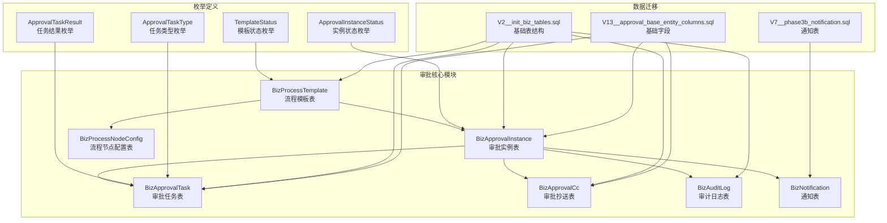
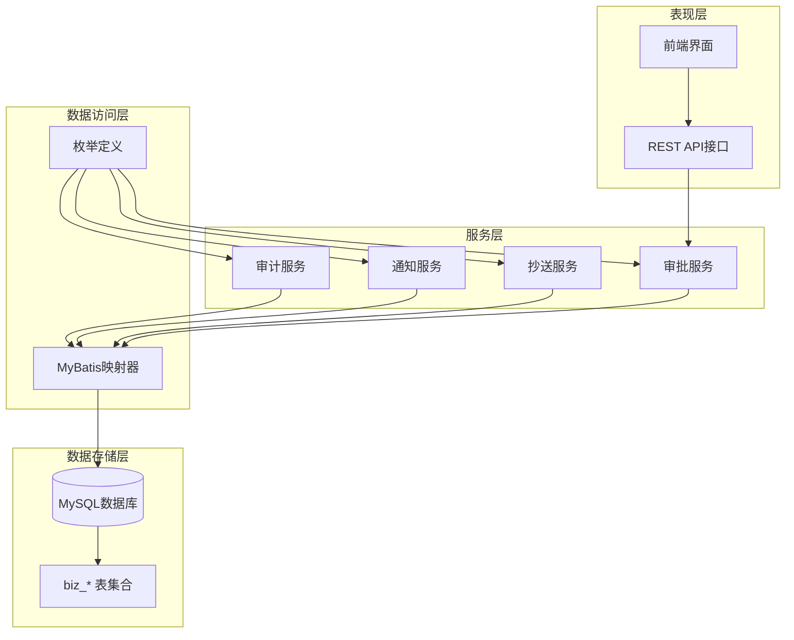
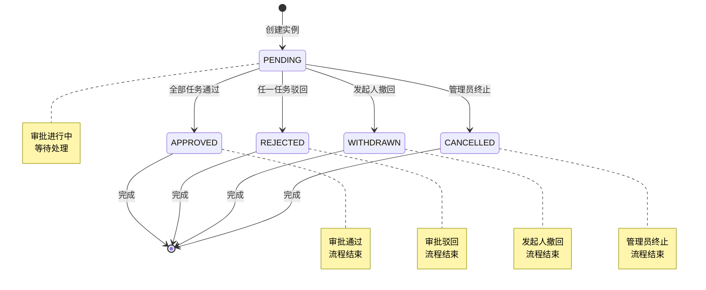
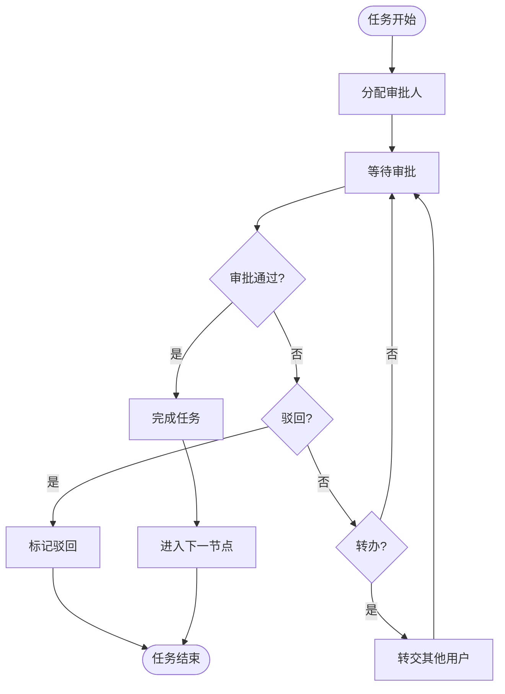
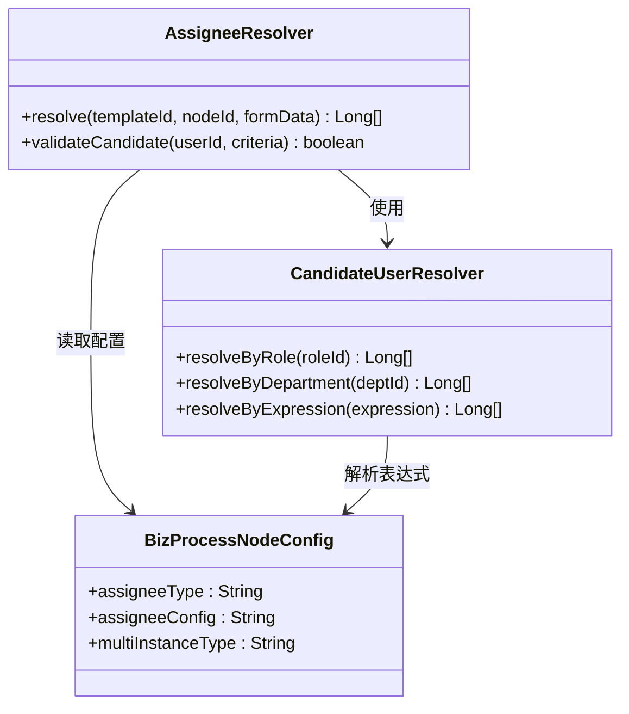
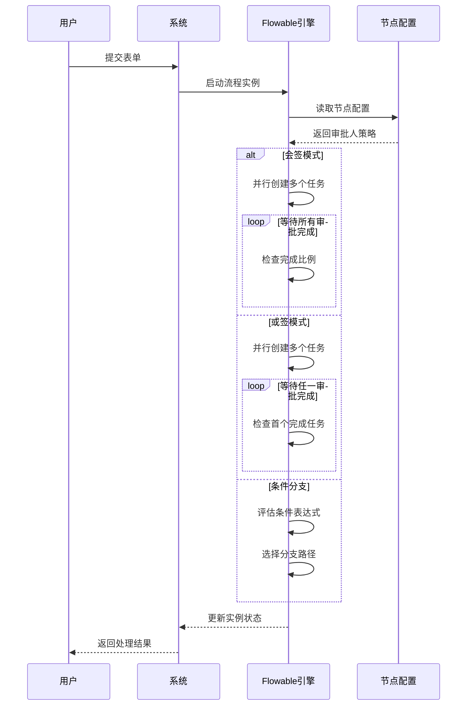
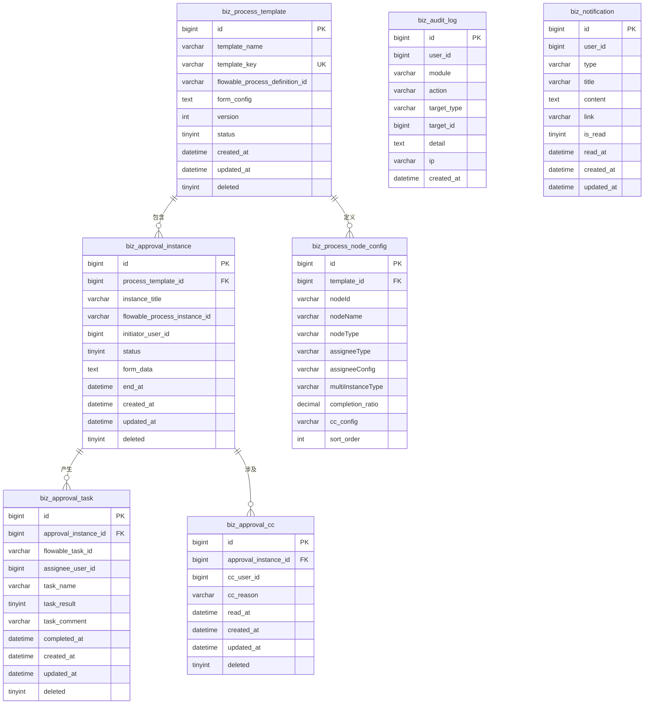
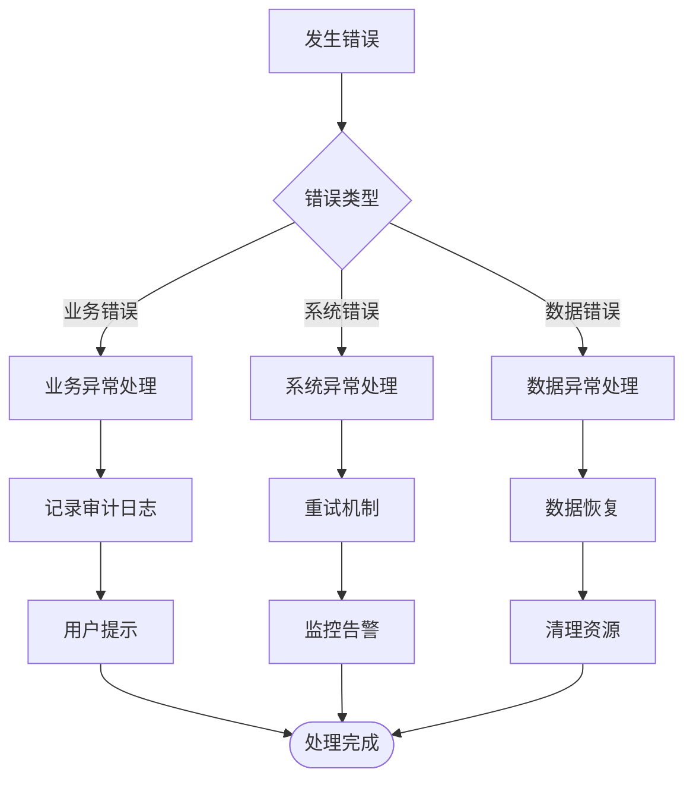

# 审批流程表设计

<cite>
**本文档引用的文件**
- [BizProcessTemplate.java](file://oa-approval/src/main/java/com/oa/admin/approval/entity/BizProcessTemplate.java)
- [BizApprovalInstance.java](file://oa-approval/src/main/java/com/oa/admin/approval/entity/BizApprovalInstance.java)
- [BizApprovalTask.java](file://oa-approval/src/main/java/com/oa/admin/approval/entity/BizApprovalTask.java)
- [BizApprovalCc.java](file://oa-approval/src/main/java/com/oa/admin/approval/entity/BizApprovalCc.java)
- [BizAuditLog.java](file://oa-approval/src/main/java/com/oa/admin/approval/entity/BizAuditLog.java)
- [BizNotification.java](file://oa-approval/src/main/java/com/oa/admin/approval/entity/BizNotification.java)
- [BizProcessNodeConfig.java](file://oa-approval/src/main/java/com/oa/admin/approval/entity/BizProcessNodeConfig.java)
- [V2__init_biz_tables.sql](file://oa-app/src/main/resources/db/migration/V2__init_biz_tables.sql)
- [V7__phase3b_notification.sql](file://oa-app/src/main/resources/db/migration/V7__phase3b_notification.sql)
- [V13__approval_base_entity_columns.sql](file://oa-app/src/main/resources/db/migration/V13__approval_base_entity_columns.sql)
- [ApprovalInstanceStatus.java](file://oa-approval/src/main/java/com/oa/admin/approval/enums/ApprovalInstanceStatus.java)
- [ApprovalTaskResult.java](file://oa-approval/src/main/java/com/oa/admin/approval/enums/ApprovalTaskResult.java)
- [ApprovalTaskType.java](file://oa-approval/src/main/java/com/oa/admin/approval/enums/ApprovalTaskType.java)
- [TemplateStatus.java](file://oa-approval/src/main/java/com/oa/admin/approval/enums/TemplateStatus.java)
</cite>

## 目录
1. [简介](#简介)
2. [项目结构](#项目结构)
3. [核心组件](#核心组件)
4. [架构概览](#架构概览)
5. [详细组件分析](#详细组件分析)
6. [依赖分析](#依赖分析)
7. [性能考虑](#性能考虑)
8. [故障排除指南](#故障排除指南)
9. [结论](#结论)

## 简介

本文件详细描述了审批工作流系统的数据库表设计，包括流程模板表、审批实例表、审批任务表、审批抄送表、审计日志表和通知表的设计原理。系统基于Flowable BPMN引擎构建，采用分层架构设计，通过实体类映射和数据库迁移脚本实现完整的审批流程管理。

## 项目结构

审批工作流系统采用模块化架构，主要包含以下核心模块：

**图表来源**
- [BizProcessTemplate.java:1-29](file://oa-approval/src/main/java/com/oa/admin/approval/entity/BizProcessTemplate.java#L1-L29)
- [BizApprovalInstance.java:1-33](file://oa-approval/src/main/java/com/oa/admin/approval/entity/BizApprovalInstance.java#L1-L33)
- [BizApprovalTask.java:1-35](file://oa-approval/src/main/java/com/oa/admin/approval/entity/BizApprovalTask.java#L1-L35)
- [BizApprovalCc.java:1-29](file://oa-approval/src/main/java/com/oa/admin/approval/entity/BizApprovalCc.java#L1-L29)
- [BizAuditLog.java:1-28](file://oa-approval/src/main/java/com/oa/admin/approval/entity/BizAuditLog.java#L1-L28)
- [BizNotification.java:1-32](file://oa-approval/src/main/java/com/oa/admin/approval/entity/BizNotification.java#L1-L32)
- [BizProcessNodeConfig.java:1-37](file://oa-approval/src/main/java/com/oa/admin/approval/entity/BizProcessNodeConfig.java#L1-L37)

**章节来源**
- [V2__init_biz_tables.sql:1-74](file://oa-app/src/main/resources/db/migration/V2__init_biz_tables.sql#L1-L74)
- [V7__phase3b_notification.sql:1-16](file://oa-app/src/main/resources/db/migration/V7__phase3b_notification.sql#L1-L16)
- [V13__approval_base_entity_columns.sql:1-13](file://oa-app/src/main/resources/db/migration/V13__approval_base_entity_columns.sql#L1-L13)

## 核心组件

### 流程模板表 (biz_process_template)

流程模板表是整个审批系统的核心基础表，用于存储流程定义和配置信息。

**表结构特点：**
- 主键自增ID，确保唯一性标识
- 模板名称和模板Key用于流程识别
- 集成Flowable引擎，支持BPMN 2.0标准
- 版本管理和状态控制（草稿/发布）
- JSON格式的表单配置和BPMN XML存储

**关键字段设计：**
- `template_key`: 唯一标识符，确保流程模板的可识别性
- `version`: 版本控制机制，支持流程迭代更新
- `status`: 模板状态管理，区分草稿和发布状态
- `form_config`: 动态表单配置，支持复杂业务场景
- `bpmn_xml`: BPMN流程定义，标准化流程描述

### 审批实例表 (biz_approval_instance)

审批实例表记录具体的审批业务实例，是流程执行的实际载体。

**业务特性：**
- 关联到具体的流程模板，继承模板定义
- 记录发起人信息，支持审批追踪
- 实例状态管理，反映审批整体进度
- 表单数据持久化，保存业务相关信息
- 结束时间记录，支持审批时效统计

**状态流转：**
- PENDING: 审批进行中
- APPROVED: 审批通过
- REJECTED: 审批驳回
- WITHDRAWN: 审批撤回
- CANCELLED: 审批终止

### 审批任务表 (biz_approval_task)

审批任务表跟踪每个审批节点的具体执行情况。

**任务维度：**
- 多实例任务支持：会签、或签等复杂审批模式
- 任务结果记录：审批通过、驳回、转办等
- 执行人绑定：明确的审批责任人
- 时间戳管理：开始时间和完成时间记录

**任务类型：**
- NORMAL: 普通审批任务
- COUNTERSIGN: 会签任务
- OR_SIGN: 或签任务

### 审批抄送表 (biz_approval_cc)

抄送功能确保相关用户能够及时了解审批动态。

**抄送管理：**
- 抄送用户列表维护
- 抄送原因记录
- 已读状态跟踪
- 时间戳管理

### 审计日志表 (biz_audit_log)

审计日志表提供完整的合规性记录和追踪能力。

**审计范围：**
- 用户操作记录
- 系统事件追踪
- 数据变更历史
- IP地址记录

### 通知表 (biz_notification)

通知表管理系统的消息推送和提醒功能。

**通知特性：**
- 用户级通知管理
- 多种通知类型支持
- 已读状态跟踪
- 链接跳转支持

### 流程节点配置表 (biz_process_node_config)

流程节点配置表提供细粒度的流程节点控制能力。

**节点配置：**
- 节点类型识别：UserTask、网关等
- 审批人解析策略：固定、部门领导、角色等
- 多实例配置：会签、或签规则
- 抄送配置：节点完成时的抄送设置
- 排序控制：节点执行顺序

**章节来源**
- [BizProcessTemplate.java:13-28](file://oa-approval/src/main/java/com/oa/admin/approval/entity/BizProcessTemplate.java#L13-L28)
- [BizApprovalInstance.java:16-32](file://oa-approval/src/main/java/com/oa/admin/approval/entity/BizApprovalInstance.java#L16-L32)
- [BizApprovalTask.java:16-34](file://oa-approval/src/main/java/com/oa/admin/approval/entity/BizApprovalTask.java#L16-L34)
- [BizApprovalCc.java:16-28](file://oa-approval/src/main/java/com/oa/admin/approval/entity/BizApprovalCc.java#L16-L28)
- [BizAuditLog.java:14-27](file://oa-approval/src/main/java/com/oa/admin/approval/entity/BizAuditLog.java#L14-L27)
- [BizNotification.java:16-31](file://oa-approval/src/main/java/com/oa/admin/approval/entity/BizNotification.java#L16-L31)
- [BizProcessNodeConfig.java:15-36](file://oa-approval/src/main/java/com/oa/admin/approval/entity/BizProcessNodeConfig.java#L15-L36)

## 架构概览

审批系统采用分层架构设计，通过实体类映射实现业务逻辑与数据存储的分离。

**图表来源**
- [BizProcessTemplate.java:1-29](file://oa-approval/src/main/java/com/oa/admin/approval/entity/BizProcessTemplate.java#L1-L29)
- [BizApprovalInstance.java:1-33](file://oa-approval/src/main/java/com/oa/admin/approval/entity/BizApprovalInstance.java#L1-L33)
- [BizApprovalTask.java:1-35](file://oa-approval/src/main/java/com/oa/admin/approval/entity/BizApprovalTask.java#L1-L35)

## 详细组件分析

### 审批状态流转数据模型

系统通过标准化的状态枚举实现严格的审批状态管理：

**图表来源**
- [ApprovalInstanceStatus.java:11-16](file://oa-approval/src/main/java/com/oa/admin/approval/enums/ApprovalInstanceStatus.java#L11-L16)

### 任务状态与结果模型

任务层面的状态管理更加细化，支持复杂的审批场景：

**图表来源**
- [ApprovalTaskResult.java:11-15](file://oa-approval/src/main/java/com/oa/admin/approval/enums/ApprovalTaskResult.java#L11-L15)
- [ApprovalTaskType.java:11-14](file://oa-approval/src/main/java/com/oa/admin/approval/enums/ApprovalTaskType.java#L11-L14)

### 审批人解析与候选人选择

系统支持多种审批人解析策略，满足不同组织架构需求：

**图表来源**
- [BizProcessNodeConfig.java:24-34](file://oa-approval/src/main/java/com/oa/admin/approval/entity/BizProcessNodeConfig.java#L24-L34)

### 条件分支与多实例处理

系统支持复杂的流程控制逻辑：

**图表来源**
- [BizProcessNodeConfig.java:30-35](file://oa-approval/src/main/java/com/oa/admin/approval/entity/BizProcessNodeConfig.java#L30-L35)

**章节来源**
- [ApprovalInstanceStatus.java:1-29](file://oa-approval/src/main/java/com/oa/admin/approval/enums/ApprovalInstanceStatus.java#L1-L29)
- [ApprovalTaskResult.java:1-28](file://oa-approval/src/main/java/com/oa/admin/approval/enums/ApprovalTaskResult.java#L1-L28)
- [ApprovalTaskType.java:1-27](file://oa-approval/src/main/java/com/oa/admin/approval/enums/ApprovalTaskType.java#L1-L27)
- [TemplateStatus.java:1-26](file://oa-approval/src/main/java/com/oa/admin/approval/enums/TemplateStatus.java#L1-L26)

## 依赖分析

### 表关系图

**图表来源**
- [V2__init_biz_tables.sql:5-73](file://oa-app/src/main/resources/db/migration/V2__init_biz_tables.sql#L5-L73)
- [V7__phase3b_notification.sql:2-15](file://oa-app/src/main/resources/db/migration/V7__phase3b_notification.sql#L2-L15)

### 依赖关系分析

系统通过外键约束和索引设计确保数据完整性：

**核心依赖链：**
1. 流程模板 → 审批实例：模板驱动实例创建
2. 审批实例 → 审批任务：实例包含多个任务节点
3. 审批实例 → 抄送记录：实例相关的抄送信息
4. 流程模板 → 节点配置：模板定义具体节点规则

**索引优化：**
- 审批实例：按模板ID、发起人、状态建立复合索引
- 审批任务：按实例ID、审批人、结果建立复合索引
- 抄送记录：按抄送用户、已读状态建立复合索引
- 审计日志：按用户、模块、时间建立复合索引

**章节来源**
- [V2__init_biz_tables.sql:30-58](file://oa-app/src/main/resources/db/migration/V2__init_biz_tables.sql#L30-L58)
- [V13__approval_base_entity_columns.sql:3-12](file://oa-app/src/main/resources/db/migration/V13__approval_base_entity_columns.sql#L3-L12)

## 性能考虑

### 查询性能优化

**索引策略：**
- 审批实例查询：按状态和发起人过滤，支持快速检索个人待办
- 任务查询：按审批人和结果过滤，支持批量处理
- 抄送查询：按用户和已读状态过滤，支持消息中心功能
- 审计查询：按用户和时间范围过滤，支持合规审计

**缓存策略：**
- 流程模板缓存：减少重复解析BPMN定义
- 审批人解析缓存：避免重复计算候选用户
- 统计数据缓存：定期更新关键指标

### 并发控制与一致性

**事务管理：**
- 审批状态更新：使用乐观锁防止并发冲突
- 任务完成：原子性更新任务和实例状态
- 抄送处理：批量插入确保数据一致性

**数据一致性保证：**
- 外键约束：强制引用完整性
- 状态机验证：防止非法状态转换
- 业务规则检查：在DAO层实施业务约束

## 故障排除指南

### 常见问题诊断

**审批流程异常：**
1. 检查流程模板是否正确发布
2. 验证节点配置是否完整
3. 确认审批人解析是否成功
4. 查看Flowable引擎日志

**数据不一致问题：**
1. 检查事务边界是否正确
2. 验证状态转换逻辑
3. 确认索引是否完整
4. 查看数据库约束错误

**性能问题排查：**
1. 分析慢查询日志
2. 检查索引使用情况
3. 监控数据库连接池
4. 评估缓存命中率

### 错误处理机制

系统通过枚举类型和异常处理确保错误的可追踪性：

**章节来源**
- [BizAuditLog.java:14-27](file://oa-approval/src/main/java/com/oa/admin/approval/entity/BizAuditLog.java#L14-L27)

## 结论

本审批工作流数据库表设计通过标准化的实体模型、严格的枚举定义和完善的索引策略，实现了高效、可靠的审批流程管理。系统支持复杂的业务场景，包括多实例审批、条件分支、动态表单等高级功能。通过合理的并发控制和数据一致性保证机制，确保了系统的稳定性和可靠性。

设计特点总结：
- **模块化设计**：清晰的职责分离和依赖关系
- **扩展性强**：支持新的审批类型和业务场景
- **性能优化**：合理的索引设计和缓存策略
- **合规保障**：完整的审计日志和状态追踪
- **用户体验**：及时的通知和直观的操作界面