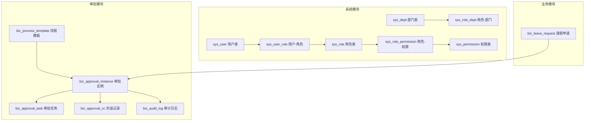
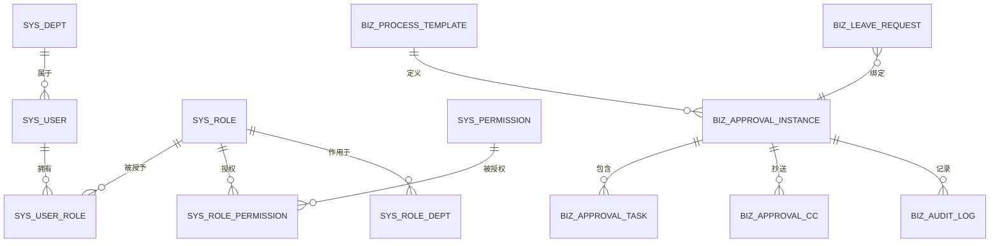
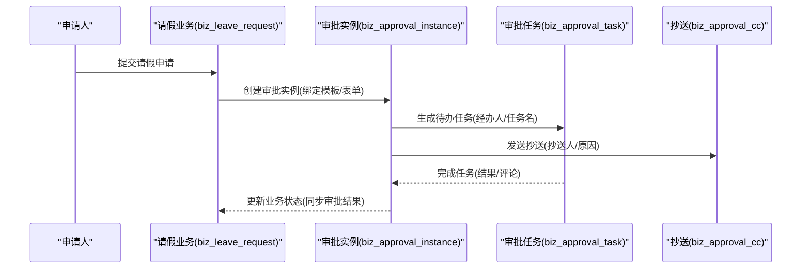

# 数据库设计

<cite>
**本文引用的文件**
- [V1__init_sys_tables.sql](file://oa-app/src/main/resources/db/migration/V1__init_sys_tables.sql)
- [V2__init_biz_tables.sql](file://oa-app/src/main/resources/db/migration/V2__init_biz_tables.sql)
- [V3__seed_data.sql](file://oa-app/src/main/resources/db/migration/V3__seed_data.sql)
- [V8__leave_module.sql](file://oa-app/src/main/resources/db/migration/V8__leave_module.sql)
- [V9__leave_approval_integration.sql](file://oa-app/src/main/resources/db/migration/V9__leave_approval_integration.sql)
- [SysUser.java](file://oa-system/src/main/java/com/oa/admin/system/entity/SysUser.java)
- [SysRole.java](file://oa-system/src/main/java/com/oa/admin/system/entity/SysRole.java)
- [SysPermission.java](file://oa-system/src/main/java/com/oa/admin/system/entity/SysPermission.java)
- [SysDept.java](file://oa-system/src/main/java/com/oa/admin/system/entity/SysDept.java)
- [SysUserRole.java](file://oa-system/src/main/java/com/oa/admin/system/entity/SysUserRole.java)
- [BizProcessTemplate.java](file://oa-approval/src/main/java/com/oa/admin/approval/entity/BizProcessTemplate.java)
- [BizApprovalInstance.java](file://oa-approval/src/main/java/com/oa/admin/approval/entity/BizApprovalInstance.java)
- [BizApprovalTask.java](file://oa-approval/src/main/java/com/oa/admin/approval/entity/BizApprovalTask.java)
- [BizApprovalCc.java](file://oa-approval/src/main/java/com/oa/admin/approval/entity/BizApprovalCc.java)
- [BizAuditLog.java](file://oa-approval/src/main/java/com/oa/admin/approval/entity/BizAuditLog.java)
- [LeaveRequest.java](file://oa-leave/src/main/java/com/oa/admin/leave/entity/LeaveRequest.java)
</cite>

## 目录
1. [简介](#简介)
2. [项目结构](#项目结构)
3. [核心组件](#核心组件)
4. [架构总览](#架构总览)
5. [详细组件分析](#详细组件分析)
6. [依赖分析](#依赖分析)
7. [性能考虑](#性能考虑)
8. [故障排查指南](#故障排查指南)
9. [结论](#结论)
10. [附录](#附录)

## 简介
本设计文档面向OA审批管理系统，围绕RBAC权限体系与审批工作流两大核心主题，系统化梳理数据库表结构、实体映射、表关系、索引与约束、性能优化、迁移与版本管理（Flyway）、以及数据安全与备份恢复策略。文档同时以请假模块为例，说明业务数据与审批流程的绑定与联动。

## 项目结构
系统采用多模块分层：系统模块负责RBAC（用户、角色、权限、部门）；审批模块负责流程模板、实例、任务、抄送、审计日志；业务模块（如请假）承载具体业务数据，并与审批实例进行关联。数据库迁移脚本位于oa-app模块的Flyway目录下，按版本号顺序演进。

图表来源
- [V1__init_sys_tables.sql:5-84](file://oa-app/src/main/resources/db/migration/V1__init_sys_tables.sql#L5-L84)
- [V2__init_biz_tables.sql:5-74](file://oa-app/src/main/resources/db/migration/V2__init_biz_tables.sql#L5-L74)
- [V8__leave_module.sql:3-20](file://oa-app/src/main/resources/db/migration/V8__leave_module.sql#L3-L20)
- [V9__leave_approval_integration.sql:1-5](file://oa-app/src/main/resources/db/migration/V9__leave_approval_integration.sql#L1-L5)

章节来源
- [V1__init_sys_tables.sql:1-84](file://oa-app/src/main/resources/db/migration/V1__init_sys_tables.sql#L1-L84)
- [V2__init_biz_tables.sql:1-74](file://oa-app/src/main/resources/db/migration/V2__init_biz_tables.sql#L1-L74)
- [V3__seed_data.sql:1-90](file://oa-app/src/main/resources/db/migration/V3__seed_data.sql#L1-L90)
- [V8__leave_module.sql:1-20](file://oa-app/src/main/resources/db/migration/V8__leave_module.sql#L1-L20)
- [V9__leave_approval_integration.sql:1-5](file://oa-app/src/main/resources/db/migration/V9__leave_approval_integration.sql#L1-L5)

## 核心组件
本节聚焦RBAC与审批工作流的核心表及其实体映射，明确主键、外键、索引、约束与典型字段语义。

- 系统RBAC表
  - sys_user：用户基本信息、所属部门、状态与时间戳
  - sys_role：角色标识、排序、数据范围（全部/本部门/自定义）
  - sys_permission：菜单/按钮/API三类权限，父子层级、排序、状态
  - sys_dept：组织架构树、排序、负责人、状态
  - sys_user_role：用户-角色多对多
  - sys_role_permission：角色-权限多对多
  - sys_role_dept：角色-部门（用于自定义数据范围）

- 审批工作流表
  - biz_process_template：流程模板、模板键、版本、状态、表单配置、BPMN部署信息
  - biz_approval_instance：实例标题、发起人、状态、表单数据、结束时间
  - biz_approval_task：任务归属、任务名、结果、评论、完成时间
  - biz_approval_cc：抄送人、抄送原因、已读时间
  - biz_audit_log：模块、动作、目标类型/ID、详情、IP、时间

- 业务模块表
  - biz_leave_request：标题、类型、起止时间、原因、申请人、状态、关联审批实例ID

章节来源
- [V1__init_sys_tables.sql:5-84](file://oa-app/src/main/resources/db/migration/V1__init_sys_tables.sql#L5-L84)
- [V2__init_biz_tables.sql:5-74](file://oa-app/src/main/resources/db/migration/V2__init_biz_tables.sql#L5-L74)
- [V8__leave_module.sql:3-20](file://oa-app/src/main/resources/db/migration/V8__leave_module.sql#L3-L20)
- [V9__leave_approval_integration.sql:1-5](file://oa-app/src/main/resources/db/migration/V9__leave_approval_integration.sql#L1-L5)
- [SysUser.java:16-26](file://oa-system/src/main/java/com/oa/admin/system/entity/SysUser.java#L16-L26)
- [SysRole.java:16-25](file://oa-system/src/main/java/com/oa/admin/system/entity/SysRole.java#L16-L25)
- [SysPermission.java:18-34](file://oa-system/src/main/java/com/oa/admin/system/entity/SysPermission.java#L18-L34)
- [SysDept.java:18-30](file://oa-system/src/main/java/com/oa/admin/system/entity/SysDept.java#L18-L30)
- [SysUserRole.java:12-18](file://oa-system/src/main/java/com/oa/admin/system/entity/SysUserRole.java#L12-L18)
- [BizProcessTemplate.java:15-28](file://oa-approval/src/main/java/com/oa/admin/approval/entity/BizProcessTemplate.java#L15-L28)
- [BizApprovalInstance.java:18-32](file://oa-approval/src/main/java/com/oa/admin/approval/entity/BizApprovalInstance.java#L18-L32)
- [BizApprovalTask.java:18-34](file://oa-approval/src/main/java/com/oa/admin/approval/entity/BizApprovalTask.java#L18-L34)
- [BizApprovalCc.java:18-28](file://oa-approval/src/main/java/com/oa/admin/approval/entity/BizApprovalCc.java#L18-L28)
- [BizAuditLog.java:16-27](file://oa-approval/src/main/java/com/oa/admin/approval/entity/BizAuditLog.java#L16-L27)
- [LeaveRequest.java:17-47](file://oa-leave/src/main/java/com/oa/admin/leave/entity/LeaveRequest.java#L17-L47)

## 架构总览
下图展示从RBAC到审批再到业务的端到端数据流：用户通过角色与权限获得访问控制；发起业务后生成审批实例，实例驱动任务流转，最终与业务数据建立绑定关系。

图表来源
- [V1__init_sys_tables.sql:5-84](file://oa-app/src/main/resources/db/migration/V1__init_sys_tables.sql#L5-L84)
- [V2__init_biz_tables.sql:5-74](file://oa-app/src/main/resources/db/migration/V2__init_biz_tables.sql#L5-L74)
- [V8__leave_module.sql:3-20](file://oa-app/src/main/resources/db/migration/V8__leave_module.sql#L3-L20)
- [V9__leave_approval_integration.sql:1-5](file://oa-app/src/main/resources/db/migration/V9__leave_approval_integration.sql#L1-L5)

## 详细组件分析

### RBAC权限体系表设计
- 表结构要点
  - 用户表：用户名唯一性（结合逻辑删除），部门外键，状态与时间戳
  - 角色表：角色键唯一性（结合逻辑删除），数据范围枚举（全部/本部门/自定义）
  - 权限表：父子层级索引，类型区分菜单/按钮/API
  - 关联表：用户-角色、角色-权限、角色-部门均使用联合唯一索引，确保不重复授权
- 实体映射
  - 系统模块实体类与数据库字段一一对应，便于MyBatis-Plus自动填充与查询

章节来源
- [V1__init_sys_tables.sql:5-84](file://oa-app/src/main/resources/db/migration/V1__init_sys_tables.sql#L5-L84)
- [SysUser.java:16-26](file://oa-system/src/main/java/com/oa/admin/system/entity/SysUser.java#L16-L26)
- [SysRole.java:16-25](file://oa-system/src/main/java/com/oa/admin/system/entity/SysRole.java#L16-L25)
- [SysPermission.java:18-34](file://oa-system/src/main/java/com/oa/admin/system/entity/SysPermission.java#L18-L34)
- [SysDept.java:18-30](file://oa-system/src/main/java/com/oa/admin/system/entity/SysDept.java#L18-L30)
- [SysUserRole.java:12-18](file://oa-system/src/main/java/com/oa/admin/system/entity/SysUserRole.java#L12-L18)

### 审批工作流表设计
- 流程模板
  - 模板键唯一（结合逻辑删除），版本与状态字段支持灰度与发布管理
  - 存储表单配置与BPMN部署信息，支撑前端表单渲染与流程引擎执行
- 审批实例
  - 关联模板与发起人，状态机覆盖审批中/通过/驳回/撤回/终止
  - 记录表单数据与结束时间，便于统计与归档
- 审批任务
  - 绑定实例与经办人，记录任务名、结果与评论，完成时间用于时效分析
- 抄送记录
  - 记录抄送人、原因与已读时间，支撑信息透明与合规追溯
- 审计日志
  - 记录模块、动作、目标与详情，支持操作追踪与安全审计

章节来源
- [V2__init_biz_tables.sql:5-74](file://oa-app/src/main/resources/db/migration/V2__init_biz_tables.sql#L5-L74)
- [BizProcessTemplate.java:15-28](file://oa-approval/src/main/java/com/oa/admin/approval/entity/BizProcessTemplate.java#L15-L28)
- [BizApprovalInstance.java:18-32](file://oa-approval/src/main/java/com/oa/admin/approval/entity/BizApprovalInstance.java#L18-L32)
- [BizApprovalTask.java:18-34](file://oa-approval/src/main/java/com/oa/admin/approval/entity/BizApprovalTask.java#L18-L34)
- [BizApprovalCc.java:18-28](file://oa-approval/src/main/java/com/oa/admin/approval/entity/BizApprovalCc.java#L18-L28)
- [BizAuditLog.java:16-27](file://oa-approval/src/main/java/com/oa/admin/approval/entity/BizAuditLog.java#L16-L27)

### 业务模块数据模型（以请假为例）
- 业务表biz_leave_request
  - 字段覆盖标题、类型、起止时间、原因、申请人、状态
  - 新增approval_instance_id并建立索引，实现与审批实例的强绑定
- 绑定机制
  - 业务申请提交后创建审批实例，实例ID回填至业务表，形成闭环
  - 后续审批任务与抄送均围绕该实例展开，业务状态与审批状态保持一致

章节来源
- [V8__leave_module.sql:3-20](file://oa-app/src/main/resources/db/migration/V8__leave_module.sql#L3-L20)
- [V9__leave_approval_integration.sql:1-5](file://oa-app/src/main/resources/db/migration/V9__leave_approval_integration.sql#L1-L5)
- [LeaveRequest.java:17-47](file://oa-leave/src/main/java/com/oa/admin/leave/entity/LeaveRequest.java#L17-L47)

### 审批流程调用序列（概念示意）
以下序列图展示“发起请假→创建审批实例→生成待办任务→抄送→完成审批”的关键步骤，体现各表之间的交互关系。

（本图为概念流程示意，无需图表来源）

## 依赖分析
- 外键与约束
  - sys_user.dept_id → sys_dept.id
  - sys_user_role.user_id → sys_user.id
  - sys_user_role.role_id → sys_role.id
  - sys_role_permission.role_id → sys_role.id
  - sys_role_permission.permission_id → sys_permission.id
  - sys_role_dept.role_id → sys_role.id
  - sys_role_dept.dept_id → sys_dept.id
  - biz_approval_instance.process_template_id → biz_process_template.id
  - biz_approval_task.approval_instance_id → biz_approval_instance.id
  - biz_approval_cc.approval_instance_id → biz_approval_instance.id
  - biz_leave_request.approval_instance_id → biz_approval_instance.id
- 联合唯一与索引
  - sys_user_role、sys_role_permission、sys_role_dept使用联合唯一索引避免重复
  - 审批相关表广泛使用复合索引（实例ID、经办人、状态、创建时间等）提升查询效率

章节来源
- [V1__init_sys_tables.sql:5-84](file://oa-app/src/main/resources/db/migration/V1__init_sys_tables.sql#L5-L84)
- [V2__init_biz_tables.sql:5-74](file://oa-app/src/main/resources/db/migration/V2__init_biz_tables.sql#L5-L74)
- [V8__leave_module.sql:3-20](file://oa-app/src/main/resources/db/migration/V8__leave_module.sql#L3-L20)
- [V9__leave_approval_integration.sql:1-5](file://oa-app/src/main/resources/db/migration/V9__leave_approval_integration.sql#L1-L5)

## 性能考虑
- 索引设计
  - sys_user(username, deleted)、sys_role(role_key, deleted)、biz_process_template(template_key, deleted)：保证唯一性与查询稳定性
  - biz_approval_instance(status)、biz_approval_task(assignee_user_id, task_result)、biz_approval_cc(cc_user_id, read_at)：加速状态筛选与待办/抄送查询
  - biz_leave_request(applicant_user_id, status, approval_instance_id)：支撑业务查询与关联定位
- 查询优化
  - 使用复合索引覆盖常用过滤条件（如按发起人、状态、时间范围）
  - 审计日志按时间倒序查询时，利用idx_created_at减少回表
- 写入优化
  - 批量插入权限与模板数据，减少事务开销
  - 审批任务完成后及时更新实例状态与结束时间，缩短长事务窗口

（本节为通用性能建议，无需章节来源）

## 故障排查指南
- 常见问题定位
  - 权限不足：检查sys_role_permission是否正确授权，或角色数据范围设置是否限制
  - 业务无法查询：确认biz_leave_request.applicant_user_id或approval_instance_id索引是否生效
  - 审批任务缺失：核对biz_approval_instance是否存在，任务是否在正确的节点生成
- 日志审计
  - 通过biz_audit_log的module/action/target定位异常操作，结合ip与时间点复盘
- 回滚与修复
  - 使用Flyway回滚到上一稳定版本，再重新应用修复脚本
  - 对于索引缺失导致慢查询，补充相应索引并验证执行计划

章节来源
- [BizAuditLog.java:16-27](file://oa-approval/src/main/java/com/oa/admin/approval/entity/BizAuditLog.java#L16-L27)
- [V3__seed_data.sql:77-80](file://oa-app/src/main/resources/db/migration/V3__seed_data.sql#L77-L80)

## 结论
本设计以清晰的RBAC与审批工作流为核心，配合业务模块的强绑定关系，实现了从权限控制到流程编排再到业务落地的完整闭环。通过Flyway版本化管理、完善的索引与约束、以及审计日志体系，系统具备良好的可维护性与可追溯性。后续可在高并发场景下进一步引入分库分表、缓存与异步通知等手段优化整体性能。

## 附录

### 数据库迁移策略与版本管理（Flyway）
- 版本命名规范
  - 采用VX__描述.sql，X为递增整数，描述语义化表达功能点
- 迁移策略
  - 新增表：在独立版本中创建，避免跨版本耦合
  - 修改表：优先添加列并补全默认值，再创建索引，最后启用约束
  - 示例：请假模块先建表，再增加approval_instance_id并建索引
- 回滚与升级
  - 升级：按版本顺序执行，确保前置依赖存在
  - 回滚：谨慎使用，必要时配合修复脚本与数据校验

章节来源
- [V1__init_sys_tables.sql:1-3](file://oa-app/src/main/resources/db/migration/V1__init_sys_tables.sql#L1-L3)
- [V2__init_biz_tables.sql:1-3](file://oa-app/src/main/resources/db/migration/V2__init_biz_tables.sql#L1-L3)
- [V3__seed_data.sql:1-3](file://oa-app/src/main/resources/db/migration/V3__seed_data.sql#L1-L3)
- [V8__leave_module.sql:1-3](file://oa-app/src/main/resources/db/migration/V8__leave_module.sql#L1-L3)
- [V9__leave_approval_integration.sql:1-3](file://oa-app/src/main/resources/db/migration/V9__leave_approval_integration.sql#L1-L3)

### 索引设计与约束定义
- 唯一性约束
  - 用户名、角色键、模板键均需唯一（结合deleted逻辑删除）
- 复合索引
  - 审批实例：模板ID、发起人、状态
  - 审批任务：实例ID、经办人+结果
  - 抄送：实例ID、抄送人+已读
  - 业务：申请人、状态、审批实例ID
- 时间维度
  - 审计日志按创建时间建立索引，支持分页与趋势分析

章节来源
- [V1__init_sys_tables.sql:30-31](file://oa-app/src/main/resources/db/migration/V1__init_sys_tables.sql#L30-L31)
- [V1__init_sys_tables.sql:44-44](file://oa-app/src/main/resources/db/migration/V1__init_sys_tables.sql#L44-L44)
- [V1__init_sys_tables.sql:15-16](file://oa-app/src/main/resources/db/migration/V1__init_sys_tables.sql#L15-L16)
- [V2__init_biz_tables.sql:30-33](file://oa-app/src/main/resources/db/migration/V2__init_biz_tables.sql#L30-L33)
- [V2__init_biz_tables.sql:45-47](file://oa-app/src/main/resources/db/migration/V2__init_biz_tables.sql#L45-L47)
- [V2__init_biz_tables.sql:56-58](file://oa-app/src/main/resources/db/migration/V2__init_biz_tables.sql#L56-L58)
- [V2__init_biz_tables.sql:70-73](file://oa-app/src/main/resources/db/migration/V2__init_biz_tables.sql#L70-L73)
- [V8__leave_module.sql:17-18](file://oa-app/src/main/resources/db/migration/V8__leave_module.sql#L17-L18)
- [V9__leave_approval_integration.sql:4-4](file://oa-app/src/main/resources/db/migration/V9__leave_approval_integration.sql#L4-L4)

### 数据安全与备份恢复策略
- 数据安全
  - 密码采用哈希存储，用户状态与逻辑删除字段防止误删
  - 审计日志记录关键操作，便于事后追溯
- 备份与恢复
  - 建议采用增量+全量备份策略，定期校验恢复流程
  - 迁移与升级前先做快照，失败时可快速回滚
  - 对敏感字段（如密码）在备份中脱敏或单独加密

（本节为通用安全建议，无需章节来源）