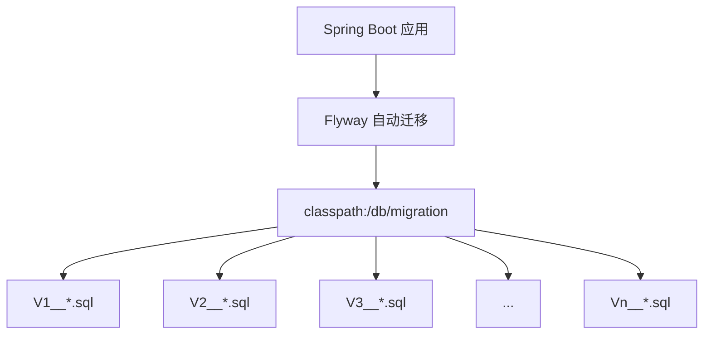
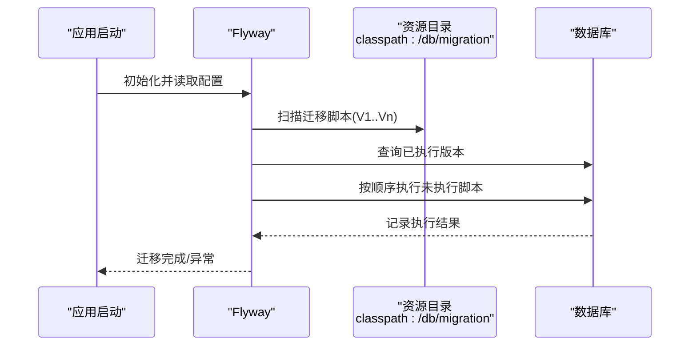
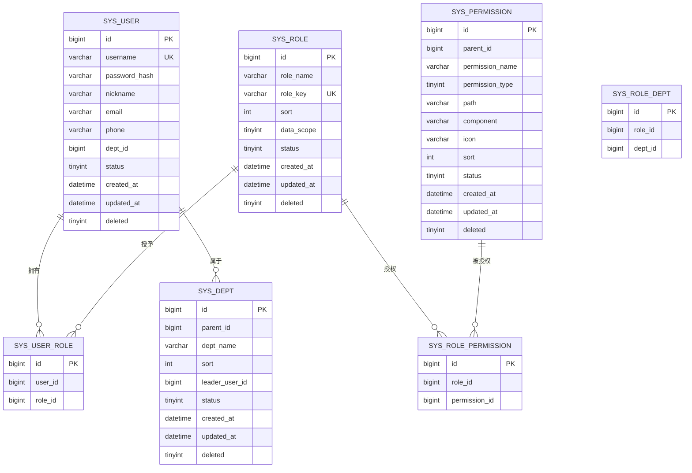
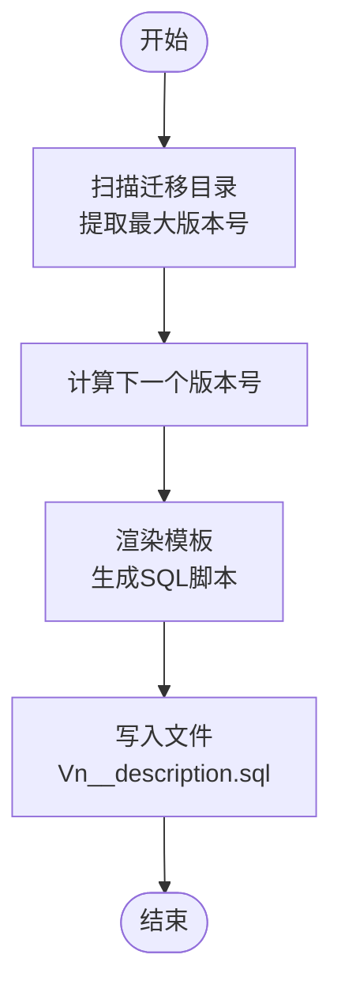
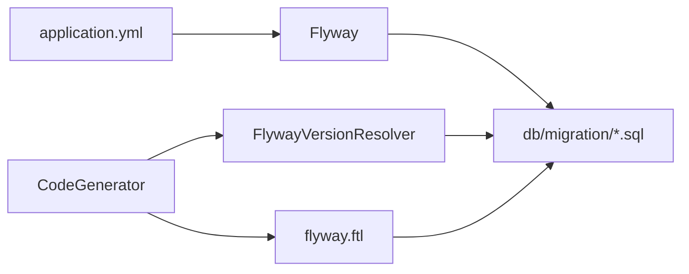

# 数据库迁移策略

<cite>
**本文引用的文件**
- [application.yml](file://oa-app/src/main/resources/application.yml)
- [V1__init_sys_tables.sql](file://oa-app/src/main/resources/db/migration/V1__init_sys_tables.sql)
- [V2__init_biz_tables.sql](file://oa-app/src/main/resources/db/migration/V2__init_biz_tables.sql)
- [V3__seed_data.sql](file://oa-app/src/main/resources/db/migration/V3__seed_data.sql)
- [V4__phase2_flow_design.sql](file://oa-app/src/main/resources/db/migration/V4__phase2_flow_design.sql)
- [V5__phase3a_instance_enhancement.sql](file://oa-app/src/main/resources/db/migration/V5__phase3a_instance_enhancement.sql)
- [V6__phase3b_bug_fixes.sql](file://oa-app/src/main/resources/db/migration/V6__phase3b_bug_fixes.sql)
- [V7__phase3b_notification.sql](file://oa-app/src/main/resources/db/migration/V7__phase3b_notification.sql)
- [V8__leave_module.sql](file://oa-app/src/main/resources/db/migration/V8__leave_module.sql)
- [V9__leave_approval_integration.sql](file://oa-app/src/main/resources/db/migration/V9__leave_approval_integration.sql)
- [V10__leave_template_seed.sql](file://oa-app/src/main/resources/db/migration/V10__leave_template_seed.sql)
- [V11__system_management_permissions.sql](file://oa-app/src/main/resources/db/migration/V11__system_management_permissions.sql)
- [V12__leave_template_bpmn_diagram.sql](file://oa-app/src/main/resources/db/migration/V12__leave_template_bpmn_diagram.sql)
- [V13__approval_base_entity_columns.sql](file://oa-app/src/main/resources/db/migration/V13__approval_base_entity_columns.sql)
- [FlywayVersionResolver.java](file://oa-generator/src/main/java/com/oa/admin/generator/engine/FlywayVersionResolver.java)
- [CodeGenerator.java](file://oa-generator/src/main/java/com/oa/admin/generator/engine/CodeGenerator.java)
- [flyway.ftl](file://oa-generator/src/main/resources/templates/flyway.ftl)
</cite>

## 目录
1. 引言
2. 项目结构
3. 核心组件
4. 架构总览
5. 详细组件分析
6. 依赖关系分析
7. 性能考虑
8. 故障排查指南
9. 结论
10. 附录

## 引言
本文件系统化梳理本项目的数据库迁移策略与版本管理实践，围绕 Flyway 迁移框架在本项目中的落地方式展开，覆盖迁移脚本命名规范、版本号设计、执行顺序、增量迁移设计原则（向后兼容、数据迁移与结构变更）、不同阶段的演进策略、编写规范与测试方法、生产风险控制与回滚策略、数据备份与验证监控机制，以及环境一致性与自动化部署流程。

## 项目结构
本项目采用 Spring Boot + Flyway 的标准迁移目录组织：所有迁移脚本位于 classpath:db/migration 下，按版本号顺序执行。Flyway 在应用启动时自动扫描并执行未执行过的迁移脚本，确保数据库结构与应用一致。

图表来源
- [application.yml:25-29](file://oa-app/src/main/resources/application.yml#L25-L29)
- [V1__init_sys_tables.sql:1-84](file://oa-app/src/main/resources/db/migration/V1__init_sys_tables.sql#L1-L84)

章节来源
- [application.yml:25-29](file://oa-app/src/main/resources/application.yml#L25-L29)

## 核心组件
- 迁移脚本集合：按版本号顺序存放于资源目录，每个脚本描述一次性的结构或数据变更。
- 版本解析器：用于生成下一个迁移版本号，避免冲突并保持顺序。
- 代码生成器：基于模板生成 Flyway 脚本，统一表结构与索引风格。
- 应用配置：启用 Flyway 并指定迁移目录，支持基线迁移等策略。

章节来源
- [FlywayVersionResolver.java:15-34](file://oa-generator/src/main/java/com/oa/admin/generator/engine/FlywayVersionResolver.java#L15-L34)
- [CodeGenerator.java:116-133](file://oa-generator/src/main/java/com/oa/admin/generator/engine/CodeGenerator.java#L116-L133)
- [flyway.ftl:1-21](file://oa-generator/src/main/resources/templates/flyway.ftl#L1-L21)
- [application.yml:25-29](file://oa-app/src/main/resources/application.yml#L25-L29)

## 架构总览
下图展示 Flyway 在应用启动时的迁移执行流程，以及与业务模块的关系。

图表来源
- [application.yml:25-29](file://oa-app/src/main/resources/application.yml#L25-L29)
- [V1__init_sys_tables.sql:1-84](file://oa-app/src/main/resources/db/migration/V1__init_sys_tables.sql#L1-L84)
- [V2__init_biz_tables.sql:1-74](file://oa-app/src/main/resources/db/migration/V2__init_biz_tables.sql#L1-L74)

## 详细组件分析

### 迁移脚本命名规范与版本号设计
- 命名格式：V{版本号}__{简要描述}.sql
  - 示例：V1__init_sys_tables.sql、V10__leave_template_seed.sql
- 版本号设计：
  - 使用连续整数递增，确保执行顺序稳定
  - 通过版本解析器自动推导下一个版本号，避免冲突
- 描述建议：简明扼要地概括本次迁移的目的与范围，便于追溯与审查

章节来源
- [FlywayVersionResolver.java:15-34](file://oa-generator/src/main/java/com/oa/admin/generator/engine/FlywayVersionResolver.java#L15-L34)
- [CodeGenerator.java:116-133](file://oa-generator/src/main/java/com/oa/admin/generator/engine/CodeGenerator.java#L116-L133)

### 执行顺序与基线策略
- 执行顺序：严格依据文件名中的版本号升序执行
- 基线策略：开启基线迁移，允许在空库上直接执行迁移，避免历史缺失导致的失败
- 占位符替换：关闭占位符替换，减少迁移脚本复杂度与运行期不确定性

章节来源
- [application.yml:25-29](file://oa-app/src/main/resources/application.yml#L25-L29)

### 初始表结构与种子数据（V1–V3）
- V1：系统 RBAC 表（用户、部门、角色、权限及关联表），含基础索引与逻辑删除字段
- V2：业务审批相关表（流程模板、审批实例、审批任务、抄送、审计日志）
- V3：种子数据（管理员账户、默认部门、角色与权限初始化；为各模块分配权限；插入示例审批模板）

图表来源
- [V1__init_sys_tables.sql:5-84](file://oa-app/src/main/resources/db/migration/V1__init_sys_tables.sql#L5-L84)
- [V2__init_biz_tables.sql:5-74](file://oa-app/src/main/resources/db/migration/V2__init_biz_tables.sql#L5-L74)
- [V3__seed_data.sql:6-89](file://oa-app/src/main/resources/db/migration/V3__seed_data.sql#L6-L89)

章节来源
- [V1__init_sys_tables.sql:1-84](file://oa-app/src/main/resources/db/migration/V1__init_sys_tables.sql#L1-L84)
- [V2__init_biz_tables.sql:1-74](file://oa-app/src/main/resources/db/migration/V2__init_biz_tables.sql#L1-L74)
- [V3__seed_data.sql:1-90](file://oa-app/src/main/resources/db/migration/V3__seed_data.sql#L1-L90)

### 流程设计与节点配置（V4）
- 新增流程模板的 BPMN XML 存储字段与部署跟踪字段
- 扩展审批任务类型，支持会签/或签
- 新增流程节点配置表，将设计器配置与 BPMN XML 解耦，便于可视化与维护

章节来源
- [V4__phase2_flow_design.sql:1-32](file://oa-app/src/main/resources/db/migration/V4__phase2_flow_design.sql#L1-L32)

### 实例增强与缺陷修复（V5–V6）
- V5：为“我的申请”场景添加复合索引，优化查询性能
- V6：为节点配置增加抄送配置字段，完善通知链路

章节来源
- [V5__phase3a_instance_enhancement.sql:1-4](file://oa-app/src/main/resources/db/migration/V5__phase3a_instance_enhancement.sql#L1-L4)
- [V6__phase3b_bug_fixes.sql:1-4](file://oa-app/src/main/resources/db/migration/V6__phase3b_bug_fixes.sql#L1-L4)

### 通知系统（V7）
- 新增通知表，支持用户消息提醒与状态管理，并建立必要的索引

章节来源
- [V7__phase3b_notification.sql:1-16](file://oa-app/src/main/resources/db/migration/V7__phase3b_notification.sql#L1-L16)

### 请假模块与集成（V8–V9）
- V8：生成请假申请表，包含基础字段与索引
- V9：将请假申请与审批实例进行关联，打通业务闭环

章节来源
- [V8__leave_module.sql:1-20](file://oa-app/src/main/resources/db/migration/V8__leave_module.sql#L1-L20)
- [V9__leave_approval_integration.sql:1-5](file://oa-app/src/main/resources/db/migration/V9__leave_approval_integration.sql#L1-L5)

### 种子模板与 BPMN 图形信息（V10–V12）
- V10：为请假模板插入 BPMN XML 及已发布版本的 XML
- V11：补充系统管理模块的 API 权限并授权给管理员角色
- V12：为 BPMN XML 注入图形信息，使前端可视化渲染可用

章节来源
- [V10__leave_template_seed.sql:1-77](file://oa-app/src/main/resources/db/migration/V10__leave_template_seed.sql#L1-L77)
- [V11__system_management_permissions.sql:1-47](file://oa-app/src/main/resources/db/migration/V11__system_management_permissions.sql#L1-L47)
- [V12__leave_template_bpmn_diagram.sql:1-108](file://oa-app/src/main/resources/db/migration/V12__leave_template_bpmn_diagram.sql#L1-L108)

### 审批实体对齐（V13）
- 对齐审批相关表与通用实体字段，统一逻辑删除与更新时间字段，提升 ORM 一致性

章节来源
- [V13__approval_base_entity_columns.sql:1-13](file://oa-app/src/main/resources/db/migration/V13__approval_base_entity_columns.sql#L1-L13)

### 代码生成与模板化迁移（oa-generator）
- 版本解析：扫描现有迁移目录，提取最大版本号并生成下一个版本号
- 代码生成：基于模板批量生成 Flyway 脚本，统一表结构、索引与注释风格
- 模板内容：包含表定义、字段、索引、逻辑删除字段等通用模式

图表来源
- [FlywayVersionResolver.java:17-34](file://oa-generator/src/main/java/com/oa/admin/generator/engine/FlywayVersionResolver.java#L17-L34)
- [CodeGenerator.java:116-133](file://oa-generator/src/main/java/com/oa/admin/generator/engine/CodeGenerator.java#L116-L133)
- [flyway.ftl:1-21](file://oa-generator/src/main/resources/templates/flyway.ftl#L1-L21)

章节来源
- [FlywayVersionResolver.java:1-36](file://oa-generator/src/main/java/com/oa/admin/generator/engine/FlywayVersionResolver.java#L1-L36)
- [CodeGenerator.java:116-144](file://oa-generator/src/main/java/com/oa/admin/generator/engine/CodeGenerator.java#L116-L144)
- [flyway.ftl:1-21](file://oa-generator/src/main/resources/templates/flyway.ftl#L1-L21)

## 依赖关系分析
- 应用层依赖 Flyway 配置（application.yml）进行迁移
- 迁移脚本之间存在隐式依赖：V1/V2/V3 为基础，后续脚本在其之上扩展
- 代码生成器依赖版本解析器与模板引擎，输出标准化的迁移脚本

图表来源
- [application.yml:25-29](file://oa-app/src/main/resources/application.yml#L25-L29)
- [FlywayVersionResolver.java:15-34](file://oa-generator/src/main/java/com/oa/admin/generator/engine/FlywayVersionResolver.java#L15-L34)
- [CodeGenerator.java:116-133](file://oa-generator/src/main/java/com/oa/admin/generator/engine/CodeGenerator.java#L116-L133)
- [flyway.ftl:1-21](file://oa-generator/src/main/resources/templates/flyway.ftl#L1-L21)

章节来源
- [application.yml:25-29](file://oa-app/src/main/resources/application.yml#L25-L29)
- [FlywayVersionResolver.java:1-36](file://oa-generator/src/main/java/com/oa/admin/generator/engine/FlywayVersionResolver.java#L1-L36)
- [CodeGenerator.java:116-144](file://oa-generator/src/main/java/com/oa/admin/generator/engine/CodeGenerator.java#L116-L144)
- [flyway.ftl:1-21](file://oa-generator/src/main/resources/templates/flyway.ftl#L1-L21)

## 性能考虑
- 索引设计：针对高频查询（如审批实例的发起人+状态、请假申请的申请人/状态）建立复合或单列索引，提升查询效率
- 字段一致性：统一逻辑删除与更新时间字段，降低 ORM 层差异带来的性能损耗
- 批量写入：在种子数据中采用批量 INSERT/ON DUPLICATE KEY UPDATE，减少往返次数

章节来源
- [V5__phase3a_instance_enhancement.sql:1-4](file://oa-app/src/main/resources/db/migration/V5__phase3a_instance_enhancement.sql#L1-L4)
- [V8__leave_module.sql:17-18](file://oa-app/src/main/resources/db/migration/V8__leave_module.sql#L17-L18)
- [V13__approval_base_entity_columns.sql:1-13](file://oa-app/src/main/resources/db/migration/V13__approval_base_entity_columns.sql#L1-L13)
- [V3__seed_data.sql:77-89](file://oa-app/src/main/resources/db/migration/V3__seed_data.sql#L77-L89)

## 故障排查指南
- 迁移失败
  - 检查迁移脚本是否符合命名规范与版本号连续性
  - 确认 Flyway 配置正确（启用、位置、基线策略）
  - 查看数据库中 Flyway 元数据表记录，定位具体失败点
- 冲突与重复
  - 使用版本解析器生成新版本号，避免重复
  - 若需重排版本，应谨慎评估影响并做好回滚准备
- 生产风险控制
  - 采用“只增不改”的结构变更策略，必要修改使用安全 ALTER
  - 大规模数据迁移前先做小样本验证
  - 保留回滚脚本与备份，严格执行变更窗口与审批流程

章节来源
- [application.yml:25-29](file://oa-app/src/main/resources/application.yml#L25-L29)
- [FlywayVersionResolver.java:17-34](file://oa-generator/src/main/java/com/oa/admin/generator/engine/FlywayVersionResolver.java#L17-L34)

## 结论
本项目通过 Flyway 将数据库迁移纳入标准化流程，结合严格的命名规范、版本号设计与分阶段演进策略，实现了从系统基础表到业务功能增强的平滑演进。配合代码生成器与模板化脚本，提升了开发效率与一致性。建议在生产环境中坚持“只增不改”、充分测试与回滚准备，确保迁移过程可控、可追溯、可恢复。

## 附录

### 迁移脚本编写规范
- 命名：V{版本号}__{简要描述}.sql
- 结构：先建表再建索引，统一逻辑删除与更新时间字段
- 数据：优先使用 INSERT/ON DUPLICATE KEY UPDATE，避免破坏性更新
- 注释：为关键表与字段添加中文注释，便于维护

章节来源
- [flyway.ftl:1-21](file://oa-generator/src/main/resources/templates/flyway.ftl#L1-L21)
- [V1__init_sys_tables.sql:1-84](file://oa-app/src/main/resources/db/migration/V1__init_sys_tables.sql#L1-L84)
- [V3__seed_data.sql:77-89](file://oa-app/src/main/resources/db/migration/V3__seed_data.sql#L77-L89)

### 测试方法
- 单元测试：针对迁移脚本的幂等性与数据一致性进行验证
- 集成测试：在隔离数据库中执行完整迁移序列，验证表结构与索引
- 回归测试：在迁移前后对比关键查询与统计结果

### 生产环境迁移与回滚
- 风险控制：变更窗口、审批流程、灰度发布
- 回滚策略：保留逆向脚本与全量备份，按版本逐步回退
- 监控与告警：迁移前后检查数据库连接池、慢查询与锁等待

### 环境一致性与自动化
- 环境一致性：统一 Flyway 配置与迁移脚本版本
- 自动化部署：CI/CD 中集成 Flyway 执行步骤，确保每次构建都验证数据库一致性

章节来源
- [application.yml:25-29](file://oa-app/src/main/resources/application.yml#L25-L29)