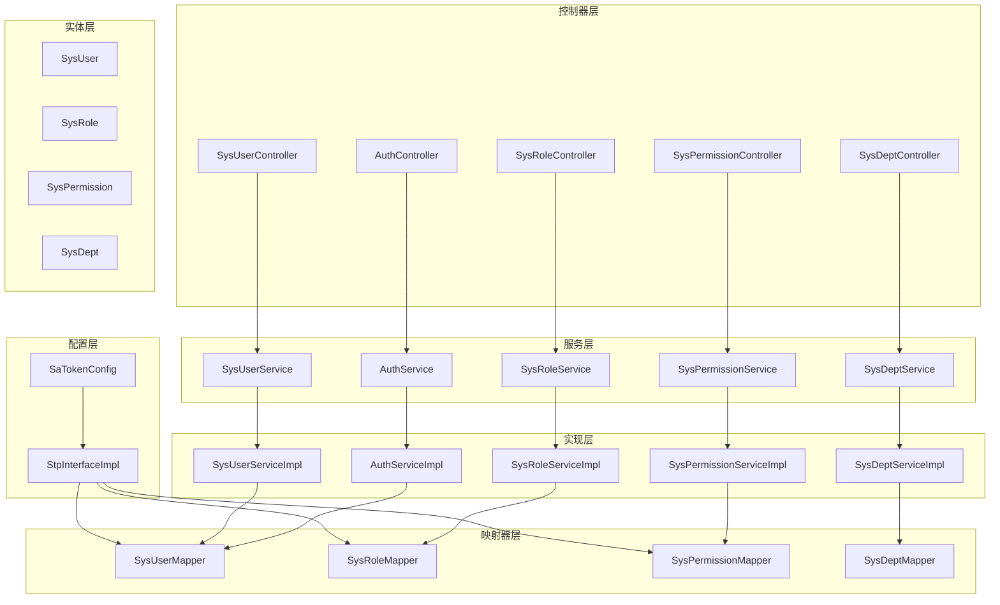
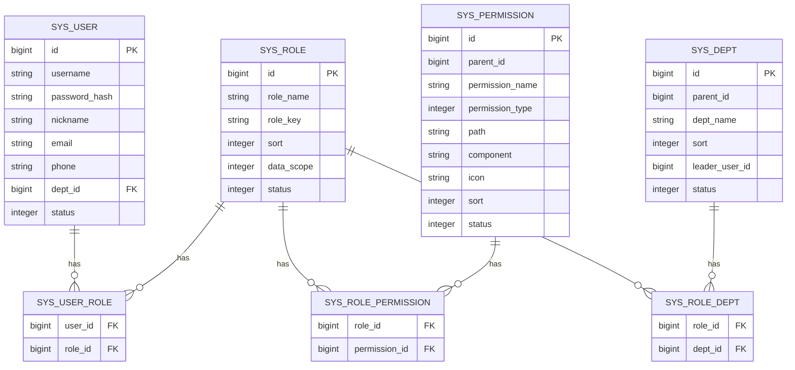
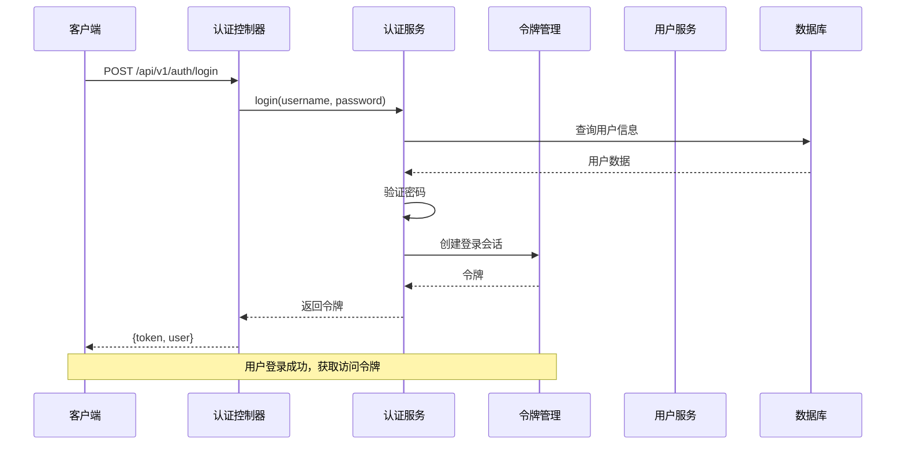
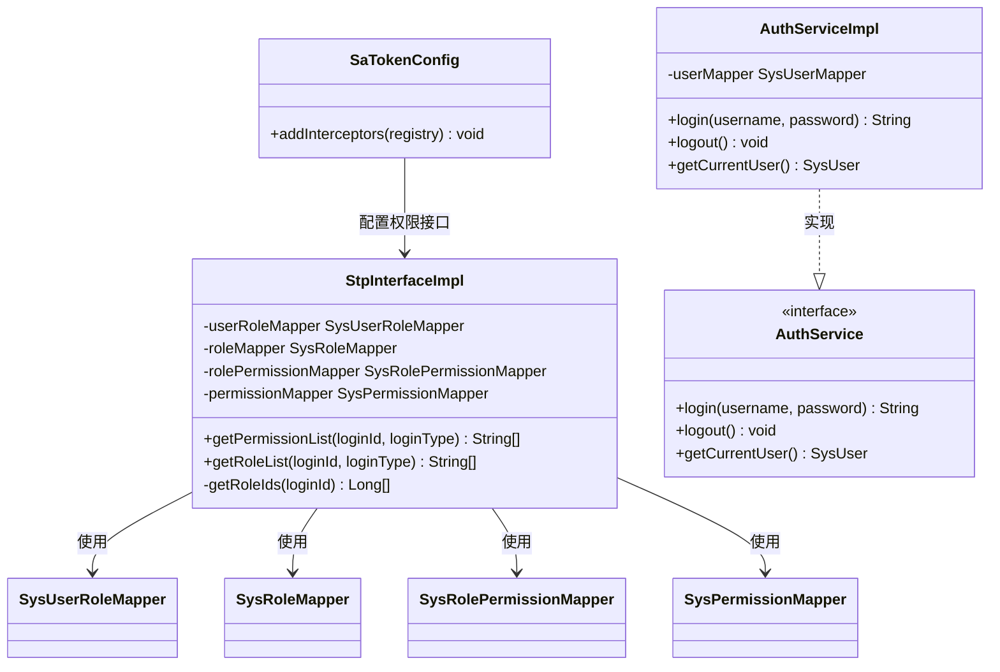
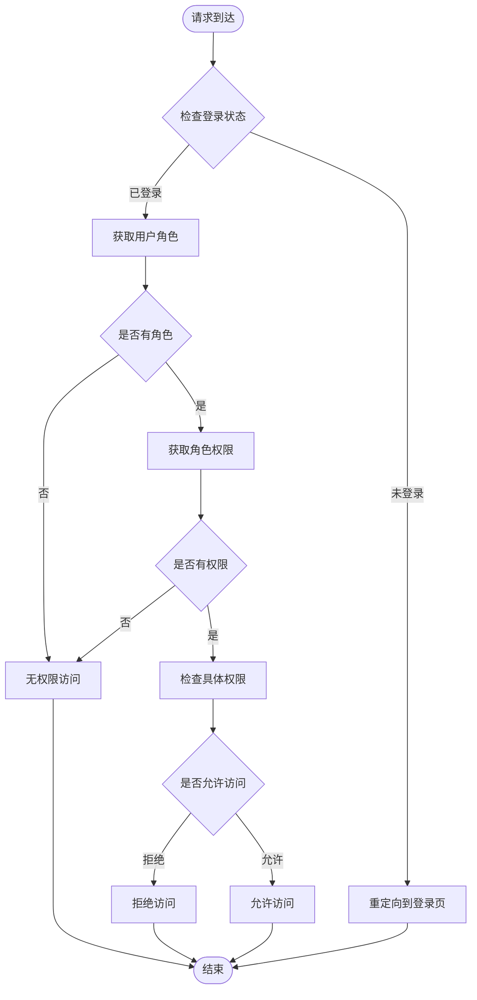
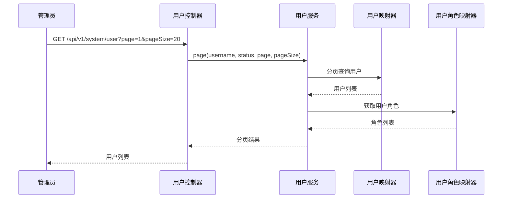
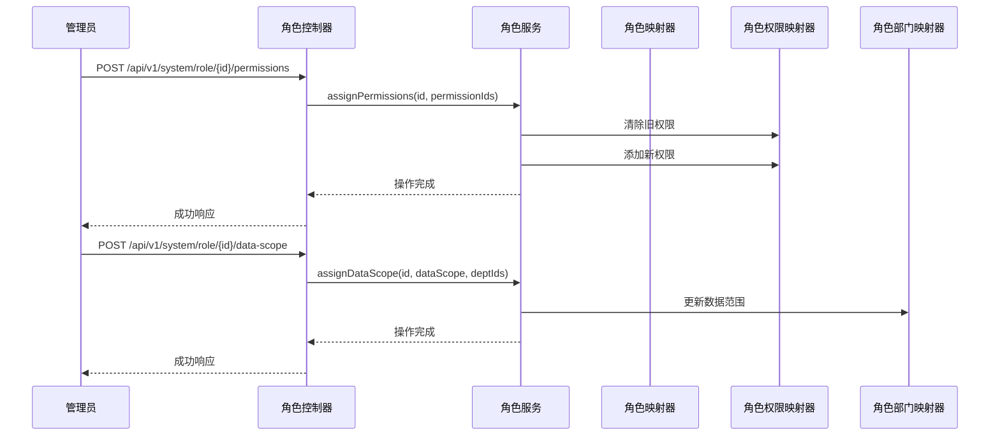
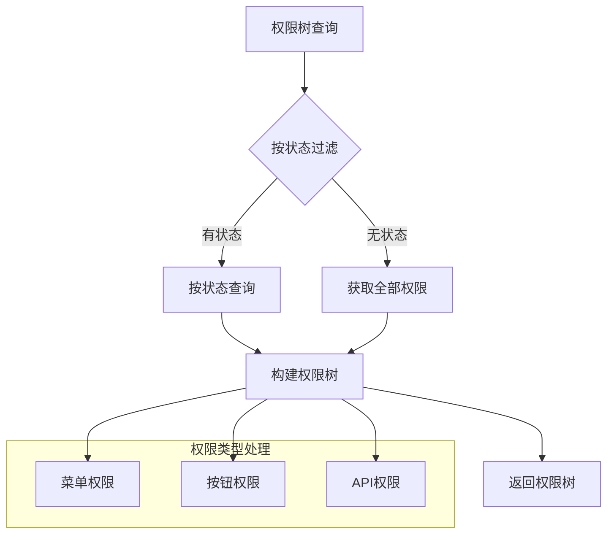
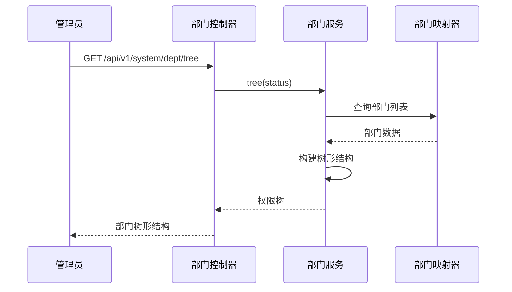
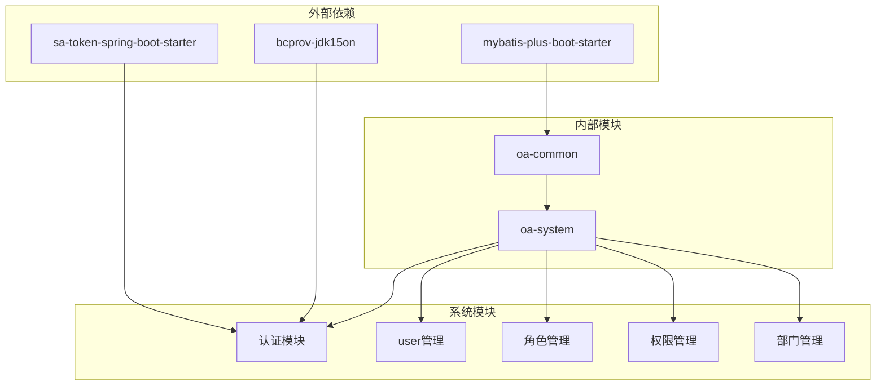

# RBAC权限管理模块

<cite>
**本文档引用的文件**
- [SaTokenConfig.java](file://oa-system/src/main/java/com/oa/admin/system/config/SaTokenConfig.java)
- [StpInterfaceImpl.java](file://oa-system/src/main/java/com/oa/admin/system/config/StpInterfaceImpl.java)
- [AuthController.java](file://oa-system/src/main/java/com/oa/admin/system/controller/AuthController.java)
- [SysUserController.java](file://oa-system/src/main/java/com/oa/admin/system/controller/SysUserController.java)
- [SysRoleController.java](file://oa-system/src/main/java/com/oa/admin/system/controller/SysRoleController.java)
- [SysPermissionController.java](file://oa-system/src/main/java/com/oa/admin/system/controller/SysPermissionController.java)
- [SysDeptController.java](file://oa-system/src/main/java/com/oa/admin/system/controller/SysDeptController.java)
- [AuthService.java](file://oa-system/src/main/java/com/oa/admin/system/service/AuthService.java)
- [AuthServiceImpl.java](file://oa-system/src/main/java/com/oa/admin/system/service/impl/AuthServiceImpl.java)
- [SysUser.java](file://oa-system/src/main/java/com/oa/admin/system/entity/SysUser.java)
- [SysRole.java](file://oa-system/src/main/java/com/oa/admin/system/entity/SysRole.java)
- [SysPermission.java](file://oa-system/src/main/java/com/oa/admin/system/entity/SysPermission.java)
- [SysDept.java](file://oa-system/src/main/java/com/oa/admin/system/entity/SysDept.java)
- [DataScope.java](file://oa-system/src/main/java/com/oa/admin/system/enums/DataScope.java)
- [PermissionType.java](file://oa-system/src/main/java/com/oa/admin/system/enums/PermissionType.java)
- [SysUserMapper.java](file://oa-system/src/main/java/com/oa/admin/system/mapper/SysUserMapper.java)
- [SysRoleMapper.java](file://oa-system/src/main/java/com/oa/admin/system/mapper/SysRoleMapper.java)
- [SysPermissionMapper.java](file://oa-system/src/main/java/com/oa/admin/system/mapper/SysPermissionMapper.java)
- [SysDeptMapper.java](file://oa-system/src/main/java/com/oa/admin/system/mapper/SysDeptMapper.java)
</cite>

## 目录
1. [简介](#简介)
2. [项目结构](#项目结构)
3. [核心组件](#核心组件)
4. [架构概览](#架构概览)
5. [详细组件分析](#详细组件分析)
6. [依赖分析](#依赖分析)
7. [性能考虑](#性能考虑)
8. [故障排除指南](#故障排除指南)
9. [结论](#结论)
10. [附录](#附录)

## 简介

本项目是一个基于Spring Boot和Sa-Token框架构建的RBAC（基于角色的访问控制）权限管理模块。该模块实现了完整的用户、角色、权限、部门四层关系模型，提供了从认证到授权的全栈解决方案。

RBAC模型通过用户与角色的多对多关系、角色与权限的多对多关系，以及用户与部门的一对多关系，构建了灵活而强大的权限管理体系。系统支持菜单权限、按钮权限和API权限的细粒度控制，同时提供了数据范围权限控制功能。

## 项目结构

RBAC权限管理模块位于oa-system子模块中，采用标准的分层架构设计：

**图表来源**
- [SaTokenConfig.java:12-24](file://oa-system/src/main/java/com/oa/admin/system/config/SaTokenConfig.java#L12-L24)
- [StpInterfaceImpl.java:24-75](file://oa-system/src/main/java/com/oa/admin/system/config/StpInterfaceImpl.java#L24-L75)

**章节来源**
- [SaTokenConfig.java:1-25](file://oa-system/src/main/java/com/oa/admin/system/config/SaTokenConfig.java#L1-L25)
- [StpInterfaceImpl.java:1-75](file://oa-system/src/main/java/com/oa/admin/system/config/StpInterfaceImpl.java#L1-L75)

## 核心组件

### 数据模型设计

系统采用四层关系模型，通过关联表实现多对多关系：

**图表来源**
- [SysUser.java:16-26](file://oa-system/src/main/java/com/oa/admin/system/entity/SysUser.java#L16-L26)
- [SysRole.java:17-25](file://oa-system/src/main/java/com/oa/admin/system/entity/SysRole.java#L17-L25)
- [SysPermission.java:20-34](file://oa-system/src/main/java/com/oa/admin/system/entity/SysPermission.java#L20-L34)
- [SysDept.java:20-30](file://oa-system/src/main/java/com/oa/admin/system/entity/SysDept.java#L20-L30)

### 权限类型枚举

系统支持三种类型的权限：

| 类型 | 编码 | 描述 |
|------|------|------|
| 菜单权限 | 1 | 用户界面菜单项权限 |
| 按钮权限 | 2 | 页面按钮操作权限 |
| API权限 | 3 | 接口访问权限 |

### 数据范围枚举

角色数据范围控制支持三种模式：

| 模式 | 编码 | 描述 |
|------|------|------|
| 全部数据 | 1 | 可访问所有数据 |
| 部门数据 | 2 | 仅可访问所属部门数据 |
| 自定义数据 | 3 | 可访问指定部门集合数据 |

**章节来源**
- [SysPermission.java:24-30](file://oa-system/src/main/java/com/oa/admin/system/entity/SysPermission.java#L24-L30)
- [SysRole.java:22-24](file://oa-system/src/main/java/com/oa/admin/system/entity/SysRole.java#L22-L24)
- [PermissionType.java:11-26](file://oa-system/src/main/java/com/oa/admin/system/enums/PermissionType.java#L11-L26)
- [DataScope.java:11-26](file://oa-system/src/main/java/com/oa/admin/system/enums/DataScope.java#L11-L26)

## 架构概览

系统采用前后端分离架构，后端通过RESTful API提供服务，前端通过Vue.js进行交互。

**图表来源**
- [AuthController.java:20-25](file://oa-system/src/main/java/com/oa/admin/system/controller/AuthController.java#L20-L25)
- [AuthServiceImpl.java:24-35](file://oa-system/src/main/java/com/oa/admin/system/service/impl/AuthServiceImpl.java#L24-L35)

**章节来源**
- [AuthController.java:1-38](file://oa-system/src/main/java/com/oa/admin/system/controller/AuthController.java#L1-L38)
- [AuthServiceImpl.java:1-53](file://oa-system/src/main/java/com/oa/admin/system/service/impl/AuthServiceImpl.java#L1-L53)

## 详细组件分析

### 认证授权组件

#### Sa-Token配置

系统通过Sa-Token框架实现统一的认证授权机制：

**图表来源**
- [SaTokenConfig.java:13-23](file://oa-system/src/main/java/com/oa/admin/system/config/SaTokenConfig.java#L13-L23)
- [StpInterfaceImpl.java:26-75](file://oa-system/src/main/java/com/oa/admin/system/config/StpInterfaceImpl.java#L26-L75)
- [AuthService.java:8-15](file://oa-system/src/main/java/com/oa/admin/system/service/AuthService.java#L8-L15)
- [AuthServiceImpl.java:20-53](file://oa-system/src/main/java/com/oa/admin/system/service/impl/AuthServiceImpl.java#L20-L53)

#### 权限解析流程

**图表来源**
- [StpInterfaceImpl.java:33-65](file://oa-system/src/main/java/com/oa/admin/system/config/StpInterfaceImpl.java#L33-L65)

**章节来源**
- [SaTokenConfig.java:15-23](file://oa-system/src/main/java/com/oa/admin/system/config/SaTokenConfig.java#L15-L23)
- [StpInterfaceImpl.java:33-73](file://oa-system/src/main/java/com/oa/admin/system/config/StpInterfaceImpl.java#L33-L73)

### 系统管理功能

#### 用户管理模块

用户管理模块提供完整的用户生命周期管理：

**图表来源**
- [SysUserController.java:23-31](file://oa-system/src/main/java/com/oa/admin/system/controller/SysUserController.java#L23-L31)
- [SysUserController.java:41-57](file://oa-system/src/main/java/com/oa/admin/system/controller/SysUserController.java#L41-L57)

##### 核心业务逻辑

用户管理支持以下核心功能：
- 用户列表查询（支持分页、筛选）
- 用户详情查看
- 用户创建（支持批量分配角色）
- 用户更新（支持更新角色关系）
- 用户删除（级联清理角色关系）

**章节来源**
- [SysUserController.java:1-85](file://oa-system/src/main/java/com/oa/admin/system/controller/SysUserController.java#L1-L85)

#### 角色管理模块

角色管理模块提供角色的全生命周期管理：

**图表来源**
- [SysRoleController.java:61-76](file://oa-system/src/main/java/com/oa/admin/system/controller/SysRoleController.java#L61-L76)
- [SysRoleController.java:68-76](file://oa-system/src/main/java/com/oa/admin/system/controller/SysRoleController.java#L68-L76)

##### 核心业务逻辑

角色管理支持以下功能：
- 角色列表查询（支持分页、筛选）
- 角色详情查看
- 角色创建/更新
- 角色删除
- 角色权限分配
- 角色数据范围设置

**章节来源**
- [SysRoleController.java:1-78](file://oa-system/src/main/java/com/oa/admin/system/controller/SysRoleController.java#L1-L78)

#### 权限管理模块

权限管理模块提供灵活的权限树形结构管理：

**图表来源**
- [SysPermissionController.java:21-26](file://oa-system/src/main/java/com/oa/admin/system/controller/SysPermissionController.java#L21-L26)
- [SysPermissionController.java:28-33](file://oa-system/src/main/java/com/oa/admin/system/controller/SysPermissionController.java#L28-L33)

##### 核心业务逻辑

权限管理支持以下功能：
- 权限树形结构查询
- 权限列表查询（支持状态筛选）
- 权限详情查看
- 权限创建/更新
- 权限删除

**章节来源**
- [SysPermissionController.java:1-63](file://oa-system/src/main/java/com/oa/admin/system/controller/SysPermissionController.java#L1-L63)

#### 部门管理模块

部门管理模块提供组织架构的层级化管理：

**图表来源**
- [SysDeptController.java:22-27](file://oa-system/src/main/java/com/oa/admin/system/controller/SysDeptController.java#L22-L27)

##### 核心业务逻辑

部门管理支持以下功能：
- 部门树形结构查询
- 部门列表查询（支持状态筛选）
- 部门详情查看
- 部门创建/更新
- 部门删除

**章节来源**
- [SysDeptController.java:1-70](file://oa-system/src/main/java/com/oa/admin/system/controller/SysDeptController.java#L1-L70)

### API接口文档

#### 认证接口

| 接口 | 方法 | 路径 | 权限要求 | 功能描述 |
|------|------|------|----------|----------|
| 用户登录 | POST | /api/v1/auth/login | 无 | 用户身份验证，返回访问令牌 |
| 用户登出 | POST | /api/v1/auth/logout | 已登录 | 注销当前会话 |
| 获取当前用户 | GET | /api/v1/auth/me | 已登录 | 获取当前登录用户信息 |

#### 用户管理接口

| 接口 | 方法 | 路径 | 权限要求 | 功能描述 |
|------|------|------|----------|----------|
| 用户列表查询 | GET | /api/v1/system/user | system:user:list | 分页查询用户列表 |
| 用户详情查询 | GET | /api/v1/system/user/{id} | system:user:query | 获取用户详细信息 |
| 用户创建 | POST | /api/v1/system/user | system:user:add | 创建新用户 |
| 用户更新 | PUT | /api/v1/system/user/{id} | system:user:edit | 更新用户信息 |
| 用户删除 | DELETE | /api/v1/system/user/{id} | system:user:remove | 删除用户 |

#### 角色管理接口

| 接口 | 方法 | 路径 | 权限要求 | 功能描述 |
|------|------|------|----------|----------|
| 角色列表查询 | GET | /api/v1/system/role | system:role:list | 分页查询角色列表 |
| 角色详情查询 | GET | /api/v1/system/role/{id} | system:role:query | 获取角色详细信息 |
| 角色创建 | POST | /api/v1/system/role | system:role:add | 创建新角色 |
| 角色更新 | PUT | /api/v1/system/role/{id} | system:role:edit | 更新角色信息 |
| 角色删除 | DELETE | /api/v1/system/role/{id} | system:role:remove | 删除角色 |
| 角色权限分配 | POST | /api/v1/system/role/{id}/permissions | system:role:edit | 为角色分配权限 |
| 角色数据范围设置 | POST | /api/v1/system/role/{id}/data-scope | system:role:edit | 设置角色数据范围 |

#### 权限管理接口

| 接口 | 方法 | 路径 | 权限要求 | 功能描述 |
|------|------|------|----------|----------|
| 权限树查询 | GET | /api/v1/system/permission/tree | system:permission:list | 获取权限树形结构 |
| 权限列表查询 | GET | /api/v1/system/permission | system:permission:list | 获取权限列表 |
| 权限详情查询 | GET | /api/v1/system/permission/{id} | system:permission:query | 获取权限详细信息 |
| 权限创建 | POST | /api/v1/system/permission | system:permission:add | 创建新权限 |
| 权限更新 | PUT | /api/v1/system/permission/{id} | system:permission:edit | 更新权限信息 |
| 权限删除 | DELETE | /api/v1/system/permission/{id} | system:permission:remove | 删除权限 |

#### 部门管理接口

| 接口 | 方法 | 路径 | 权限要求 | 功能描述 |
|------|------|------|----------|----------|
| 部门树查询 | GET | /api/v1/system/dept/tree | system:dept:list | 获取部门树形结构 |
| 部门列表查询 | GET | /api/v1/system/dept | system:dept:list | 获取部门列表 |
| 部门详情查询 | GET | /api/v1/system/dept/{id} | system:dept:query | 获取部门详细信息 |
| 部门创建 | POST | /api/v1/system/dept | system:dept:add | 创建新部门 |
| 部门更新 | PUT | /api/v1/system/dept/{id} | system:dept:edit | 更新部门信息 |
| 部门删除 | DELETE | /api/v1/system/dept/{id} | system:dept:remove | 删除部门 |

**章节来源**
- [AuthController.java:20-36](file://oa-system/src/main/java/com/oa/admin/system/controller/AuthController.java#L20-L36)
- [SysUserController.java:23-83](file://oa-system/src/main/java/com/oa/admin/system/controller/SysUserController.java#L23-L83)
- [SysRoleController.java:23-76](file://oa-system/src/main/java/com/oa/admin/system/controller/SysRoleController.java#L23-L76)
- [SysPermissionController.java:21-61](file://oa-system/src/main/java/com/oa/admin/system/controller/SysPermissionController.java#L21-L61)
- [SysDeptController.java:22-68](file://oa-system/src/main/java/com/oa/admin/system/controller/SysDeptController.java#L22-L68)

## 依赖分析

系统采用模块化设计，各组件间依赖关系清晰：

**图表来源**
- [AuthServiceImpl.java:3-4](file://oa-system/src/main/java/com/oa/admin/system/service/impl/AuthServiceImpl.java#L3-L4)
- [AuthServiceImpl.java:4](file://oa-system/src/main/java/com/oa/admin/system/service/impl/AuthServiceImpl.java#L4)

### 关键依赖关系

1. **Sa-Token集成**：通过SaTokenConfig配置全局拦截器，实现统一认证
2. **MyBatis-Plus**：提供ORM支持和分页查询能力
3. **BCrypt加密**：确保用户密码安全存储
4. **权限注解**：通过@SaCheckPermission实现方法级权限控制

**章节来源**
- [SaTokenConfig.java:17-22](file://oa-system/src/main/java/com/oa/admin/system/config/SaTokenConfig.java#L17-L22)
- [AuthServiceImpl.java:3-4](file://oa-system/src/main/java/com/oa/admin/system/service/impl/AuthServiceImpl.java#L3-L4)

## 性能考虑

### 缓存策略

系统建议在以下场景使用缓存：
- 用户权限列表缓存（降低数据库查询压力）
- 角色数据范围缓存（减少部门树查询开销）
- 部门树结构缓存（避免重复构建树形结构）

### 查询优化

1. **索引优化**：在用户表的username字段、角色表的roleKey字段建立唯一索引
2. **分页查询**：所有列表查询都应使用分页参数，避免全量查询
3. **批量操作**：权限分配和角色更新支持批量操作，减少数据库往返

### 并发控制

系统通过Sa-Token的线程安全机制保证并发环境下的安全性，同时建议：
- 在高并发场景下使用Redis作为分布式缓存
- 对热点数据实施合理的缓存失效策略

## 故障排除指南

### 常见问题及解决方案

#### 登录失败
**问题现象**：用户无法登录系统
**可能原因**：
- 用户名或密码错误
- 用户状态异常（非激活状态）
- 密码加密不匹配

**解决步骤**：
1. 检查用户状态是否为激活状态
2. 验证密码加密算法一致性
3. 确认用户是否存在

#### 权限不足
**问题现象**：用户访问受限资源时被拒绝
**可能原因**：
- 用户未分配相应角色
- 角色未分配相应权限
- 权限路径配置错误

**解决步骤**：
1. 检查用户的角色分配
2. 验证角色的权限列表
3. 确认权限路径配置正确性

#### 会话过期
**问题现象**：用户登录后一段时间无法访问受保护资源
**可能原因**：
- 令牌过期时间设置过短
- 服务器重启导致会话丢失

**解决步骤**：
1. 检查Sa-Token的超时配置
2. 配置Redis作为会话存储
3. 实现自动刷新机制

**章节来源**
- [AuthServiceImpl.java:30-32](file://oa-system/src/main/java/com/oa/admin/system/service/impl/AuthServiceImpl.java#L30-L32)
- [StpInterfaceImpl.java:34-51](file://oa-system/src/main/java/com/oa/admin/system/config/StpInterfaceImpl.java#L34-L51)

## 结论

本RBAC权限管理模块通过Sa-Token框架实现了企业级的认证授权需求。模块设计遵循了清晰的分层架构，提供了完整的用户、角色、权限、部门管理功能。通过权限注解和自定义权限解析器，系统实现了灵活的权限控制机制。

模块的主要优势包括：
- 完整的RBAC模型实现
- 细粒度的权限控制
- 灵活的数据范围管理
- 易于扩展的权限体系
- 良好的性能表现

建议在生产环境中结合Redis实现分布式缓存，进一步提升系统性能和可用性。

## 附录

### 最佳实践指导

#### 权限设计原则
1. **最小权限原则**：用户只应拥有完成工作所需的最小权限
2. **职责分离**：关键操作应由多人协作完成
3. **定期审计**：定期审查用户权限分配的合理性

#### 扩展开发建议
1. **自定义权限解析器**：可根据业务需求扩展权限判断逻辑
2. **动态权限配置**：支持运行时调整权限配置
3. **权限继承机制**：支持角色间的权限继承关系

#### 安全加固措施
1. **密码策略**：强制复杂密码规则和定期更换
2. **会话安全**：启用HTTPS和安全的Cookie配置
3. **日志审计**：记录所有权限相关的操作日志