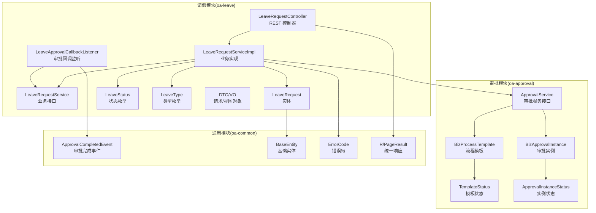
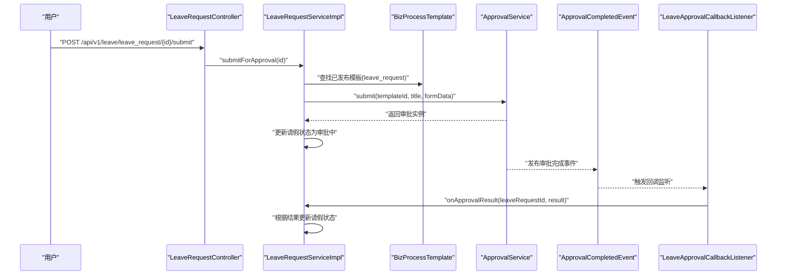
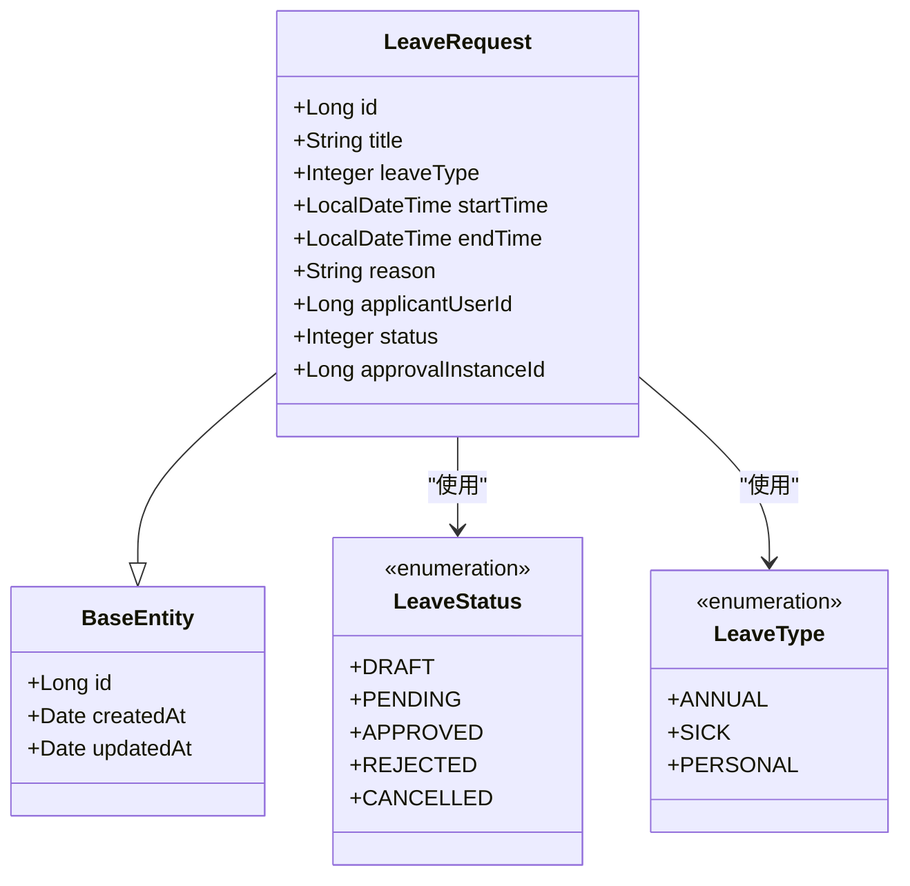
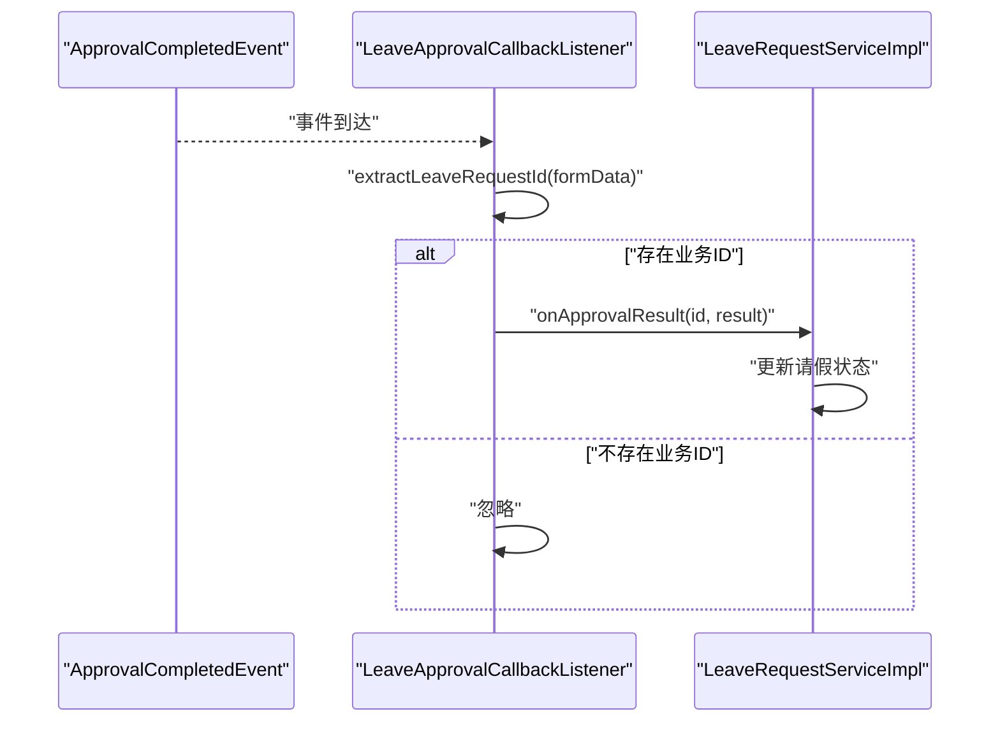
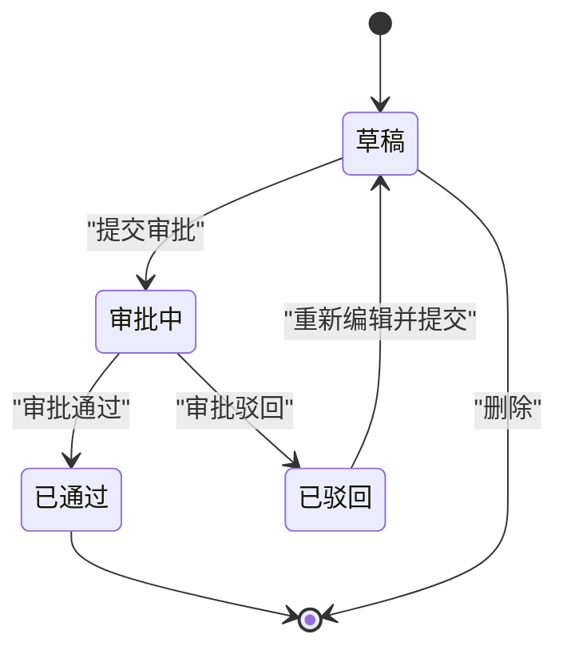
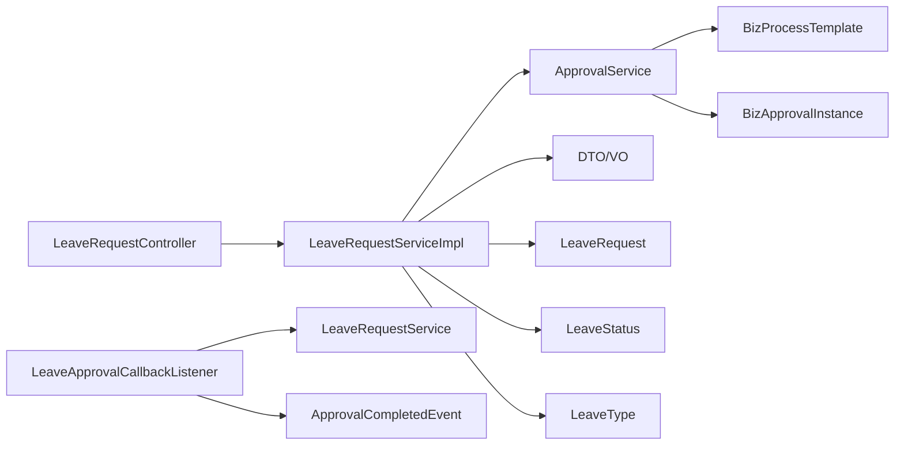

# 业务模块

<cite>
**本文引用的文件**
- [LeaveRequestController.java](file://oa-leave/src/main/java/com/oa/admin/leave/controller/LeaveRequestController.java)
- [LeaveRequestService.java](file://oa-leave/src/main/java/com/oa/admin/leave/service/LeaveRequestService.java)
- [LeaveRequestServiceImpl.java](file://oa-leave/src/main/java/com/oa/admin/leave/service/impl/LeaveRequestServiceImpl.java)
- [LeaveRequest.java](file://oa-leave/src/main/java/com/oa/admin/leave/entity/LeaveRequest.java)
- [LeaveStatus.java](file://oa-leave/src/main/java/com/oa/admin/leave/enums/LeaveStatus.java)
- [LeaveType.java](file://oa-leave/src/main/java/com/oa/admin/leave/enums/LeaveType.java)
- [LeaveRequestCreateDTO.java](file://oa-leave/src/main/java/com/oa/admin/leave/dto/LeaveRequestCreateDTO.java)
- [LeaveRequestUpdateDTO.java](file://oa-leave/src/main/java/com/oa/admin/leave/dto/LeaveRequestUpdateDTO.java)
- [LeaveRequestQueryDTO.java](file://oa-leave/src/main/java/com/oa/admin/leave/dto/LeaveRequestQueryDTO.java)
- [LeaveApprovalCallbackListener.java](file://oa-leave/src/main/java/com/oa/admin/leave/listener/LeaveApprovalCallbackListener.java)
- [BizProcessTemplate.java](file://oa-approval/src/main/java/com/oa/admin/approval/entity/BizProcessTemplate.java)
- [TemplateStatus.java](file://oa-approval/src/main/java/com/oa/admin/approval/enums/TemplateStatus.java)
- [ApprovalService.java](file://oa-approval/src/main/java/com/oa/admin/approval/service/ApprovalService.java)
- [BizApprovalInstance.java](file://oa-approval/src/main/java/com/oa/admin/approval/entity/BizApprovalInstance.java)
- [ApprovalInstanceStatus.java](file://oa-approval/src/main/java/com/oa/admin/approval/enums/ApprovalInstanceStatus.java)
- [ApprovalCompletedEvent.java](file://oa-common/src/main/java/com/oa/admin/common/event/ApprovalCompletedEvent.java)
- [BaseEntity.java](file://oa-common/src/main/java/com/oa/admin/common/entity/BaseEntity.java)
- [ErrorCode.java](file://oa-common/src/main/java/com/oa/admin/common/result/ErrorCode.java)
- [R.java](file://oa-common/src/main/java/com/oa/admin/common/result/R.java)
- [PageResult.java](file://oa-common/src/main/java/com/oa/admin/common/result/PageResult.java)
- [application.yml](file://oa-app/src/main/resources/application.yml)
- [V8__leave_module.sql](file://oa-app/src/main/resources/db/migration/V8__leave_module.sql)
- [V9__leave_approval_integration.sql](file://oa-app/src/main/resources/db/migration/V9__leave_approval_integration.sql)
- [leave_request.bpmn20.xml](file://oa-app/src/main/resources/processes/leave_request.bpmn20.xml)
- [leave_request_v2.bpmn20.xml](file://oa-app/src/main/resources/processes/leave_request_v2.bpmn20.xml)
</cite>

## 目录
1. [简介](#简介)
2. [项目结构](#项目结构)
3. [核心组件](#核心组件)
4. [架构总览](#架构总览)
5. [详细组件分析](#详细组件分析)
6. [依赖分析](#依赖分析)
7. [性能考虑](#性能考虑)
8. [故障排查指南](#故障排查指南)
9. [结论](#结论)
10. [附录](#附录)

## 简介
本技术文档聚焦于请假业务模块的完整实现，涵盖领域模型设计、业务逻辑封装、与审批流程的集成方式、请假申请全生命周期的状态管理、数据模型与约束、业务API接口定义、审批回调机制以及业务规则配置与扩展点。文档旨在帮助开发者快速理解并扩展该模块，同时提供新业务模块开发的模板与最佳实践。

## 项目结构
请假业务模块位于独立子工程中，采用分层架构：控制器层（Controller）、服务层（Service）、数据访问层（Mapper/Entity）与事件监听层（Listener）。与审批模块通过事件总线进行松耦合集成，审批流程由独立的审批引擎驱动并通过模板化配置实现可演进的业务流程。



图表来源
- [LeaveRequestController.java:1-68](file://oa-leave/src/main/java/com/oa/admin/leave/controller/LeaveRequestController.java#L1-L68)
- [LeaveRequestServiceImpl.java:1-185](file://oa-leave/src/main/java/com/oa/admin/leave/service/impl/LeaveRequestServiceImpl.java#L1-L185)
- [LeaveRequestService.java:1-42](file://oa-leave/src/main/java/com/oa/admin/leave/service/LeaveRequestService.java#L1-L42)
- [LeaveRequest.java:1-48](file://oa-leave/src/main/java/com/oa/admin/leave/entity/LeaveRequest.java#L1-L48)
- [LeaveStatus.java:1-42](file://oa-leave/src/main/java/com/oa/admin/leave/enums/LeaveStatus.java#L1-L42)
- [LeaveType.java:1-40](file://oa-leave/src/main/java/com/oa/admin/leave/enums/LeaveType.java#L1-L40)
- [LeaveApprovalCallbackListener.java:1-49](file://oa-leave/src/main/java/com/oa/admin/leave/listener/LeaveApprovalCallbackListener.java#L1-L49)
- [ApprovalService.java:1-57](file://oa-approval/src/main/java/com/oa/admin/approval/service/ApprovalService.java#L1-L57)
- [BizProcessTemplate.java:1-29](file://oa-approval/src/main/java/com/oa/admin/approval/entity/BizProcessTemplate.java#L1-L29)
- [TemplateStatus.java:1-26](file://oa-approval/src/main/java/com/oa/admin/approval/enums/TemplateStatus.java#L1-L26)
- [BizApprovalInstance.java:1-33](file://oa-approval/src/main/java/com/oa/admin/approval/entity/BizApprovalInstance.java#L1-L33)
- [ApprovalInstanceStatus.java:1-29](file://oa-approval/src/main/java/com/oa/admin/approval/enums/ApprovalInstanceStatus.java#L1-L29)
- [ApprovalCompletedEvent.java](file://oa-common/src/main/java/com/oa/admin/common/event/ApprovalCompletedEvent.java)

章节来源
- [LeaveRequestController.java:1-68](file://oa-leave/src/main/java/com/oa/admin/leave/controller/LeaveRequestController.java#L1-L68)
- [LeaveRequestServiceImpl.java:1-185](file://oa-leave/src/main/java/com/oa/admin/leave/service/impl/LeaveRequestServiceImpl.java#L1-L185)
- [LeaveRequestService.java:1-42](file://oa-leave/src/main/java/com/oa/admin/leave/service/LeaveRequestService.java#L1-L42)
- [LeaveRequest.java:1-48](file://oa-leave/src/main/java/com/oa/admin/leave/entity/LeaveRequest.java#L1-L48)
- [LeaveStatus.java:1-42](file://oa-leave/src/main/java/com/oa/admin/leave/enums/LeaveStatus.java#L1-L42)
- [LeaveType.java:1-40](file://oa-leave/src/main/java/com/oa/admin/leave/enums/LeaveType.java#L1-L40)
- [LeaveApprovalCallbackListener.java:1-49](file://oa-leave/src/main/java/com/oa/admin/leave/listener/LeaveApprovalCallbackListener.java#L1-L49)
- [ApprovalService.java:1-57](file://oa-approval/src/main/java/com/oa/admin/approval/service/ApprovalService.java#L1-L57)
- [BizProcessTemplate.java:1-29](file://oa-approval/src/main/java/com/oa/admin/approval/entity/BizProcessTemplate.java#L1-L29)
- [TemplateStatus.java:1-26](file://oa-approval/src/main/java/com/oa/admin/approval/enums/TemplateStatus.java#L1-L26)
- [BizApprovalInstance.java:1-33](file://oa-approval/src/main/java/com/oa/admin/approval/entity/BizApprovalInstance.java#L1-L33)
- [ApprovalInstanceStatus.java:1-29](file://oa-approval/src/main/java/com/oa/admin/approval/enums/ApprovalInstanceStatus.java#L1-L29)
- [ApprovalCompletedEvent.java](file://oa-common/src/main/java/com/oa/admin/common/event/ApprovalCompletedEvent.java)

## 核心组件
- 控制器层：提供请假申请的CRUD、提交审批、重新提交等REST接口，使用权限注解控制访问。
- 服务层：封装业务规则与流程编排，负责与审批服务交互、状态转换与数据转换。
- 实体与枚举：定义请假申请的数据结构、状态与类型，确保前后端一致的语义表达。
- 回调监听：基于Spring事件机制接收审批完成事件，异步更新请假状态。
- 审批集成：通过流程模板与实例抽象，将业务数据与流程引擎解耦。

章节来源
- [LeaveRequestController.java:1-68](file://oa-leave/src/main/java/com/oa/admin/leave/controller/LeaveRequestController.java#L1-L68)
- [LeaveRequestService.java:1-42](file://oa-leave/src/main/java/com/oa/admin/leave/service/LeaveRequestService.java#L1-L42)
- [LeaveRequestServiceImpl.java:1-185](file://oa-leave/src/main/java/com/oa/admin/leave/service/impl/LeaveRequestServiceImpl.java#L1-L185)
- [LeaveRequest.java:1-48](file://oa-leave/src/main/java/com/oa/admin/leave/entity/LeaveRequest.java#L1-L48)
- [LeaveStatus.java:1-42](file://oa-leave/src/main/java/com/oa/admin/leave/enums/LeaveStatus.java#L1-L42)
- [LeaveType.java:1-40](file://oa-leave/src/main/java/com/oa/admin/leave/enums/LeaveType.java#L1-L40)
- [LeaveApprovalCallbackListener.java:1-49](file://oa-leave/src/main/java/com/oa/admin/leave/listener/LeaveApprovalCallbackListener.java#L1-L49)

## 架构总览
请假业务模块与审批模块通过事件总线进行解耦集成。当用户提交请假申请时，系统根据预置的流程模板启动审批实例；审批完成后，审批引擎发布“审批完成”事件，业务侧监听器解析表单数据中的业务主键并更新请假状态。



图表来源
- [LeaveRequestController.java:56-60](file://oa-leave/src/main/java/com/oa/admin/leave/controller/LeaveRequestController.java#L56-L60)
- [LeaveRequestServiceImpl.java:96-115](file://oa-leave/src/main/java/com/oa/admin/leave/service/impl/LeaveRequestServiceImpl.java#L96-L115)
- [BizProcessTemplate.java:1-29](file://oa-approval/src/main/java/com/oa/admin/approval/entity/BizProcessTemplate.java#L1-L29)
- [ApprovalService.java](file://oa-approval/src/main/java/com/oa/admin/approval/service/ApprovalService.java#L20)
- [ApprovalCompletedEvent.java](file://oa-common/src/main/java/com/oa/admin/common/event/ApprovalCompletedEvent.java)
- [LeaveApprovalCallbackListener.java:24-33](file://oa-leave/src/main/java/com/oa/admin/leave/listener/LeaveApprovalCallbackListener.java#L24-L33)

## 详细组件分析

### 数据模型与状态管理
- 实体字段：包含标题、类型、起止时间、申请人、状态、关联审批实例ID等，继承基础实体以获得审计字段。
- 状态枚举：草稿、审批中、已通过、已驳回、已取消，支持JSON序列化/反序列化与校验。
- 类型枚举：年假、病假、事假，便于前端展示与筛选。
- 约束规则：提交审批仅允许草稿态；驳回后允许重新编辑并再次提交；未找到或状态不合法时抛出业务异常。



图表来源
- [LeaveRequest.java:1-48](file://oa-leave/src/main/java/com/oa/admin/leave/entity/LeaveRequest.java#L1-L48)
- [BaseEntity.java](file://oa-common/src/main/java/com/oa/admin/common/entity/BaseEntity.java)
- [LeaveStatus.java:1-42](file://oa-leave/src/main/java/com/oa/admin/leave/enums/LeaveStatus.java#L1-L42)
- [LeaveType.java:1-40](file://oa-leave/src/main/java/com/oa/admin/leave/enums/LeaveType.java#L1-L40)

章节来源
- [LeaveRequest.java:1-48](file://oa-leave/src/main/java/com/oa/admin/leave/entity/LeaveRequest.java#L1-L48)
- [LeaveStatus.java:1-42](file://oa-leave/src/main/java/com/oa/admin/leave/enums/LeaveStatus.java#L1-L42)
- [LeaveType.java:1-40](file://oa-leave/src/main/java/com/oa/admin/leave/enums/LeaveType.java#L1-L40)
- [BaseEntity.java](file://oa-common/src/main/java/com/oa/admin/common/entity/BaseEntity.java)

### 业务API接口
- 列表查询：支持按标题、类型、申请人、状态分页查询。
- 明细查看：按ID获取详情。
- 创建：保存草稿，默认状态为草稿。
- 更新：在非审批中状态下更新。
- 删除：直接删除。
- 提交审批：仅草稿态可提交，生成流程实例并关联。
- 重新提交：仅驳回态可编辑并重新提交。
- 统一响应：使用统一结果包装与分页封装。

```mermaid
flowchart TD
Start(["请求进入"]) --> Route{"路由匹配"}
Route --> |GET /list| Page["分页查询"]
Route --> |GET /{id}| Detail["获取明细"]
Route --> |POST /| Create["创建草稿"]
Route --> |PUT /{id}| Update["更新"]
Route --> |DELETE /{id}| Delete["删除"]
Route --> |POST /{id}/submit| Submit["提交审批"]
Route --> |POST /{id}/resubmit| Resubmit["驳回后重新提交"]
Page --> Resp["返回分页结果"]
Detail --> Resp
Create --> Resp
Update --> Resp
Delete --> Resp
Submit --> Resp
Resubmit --> Resp
```

图表来源
- [LeaveRequestController.java:25-66](file://oa-leave/src/main/java/com/oa/admin/leave/controller/LeaveRequestController.java#L25-L66)
- [LeaveRequestServiceImpl.java:44-94](file://oa-leave/src/main/java/com/oa/admin/leave/service/impl/LeaveRequestServiceImpl.java#L44-L94)
- [R.java](file://oa-common/src/main/java/com/oa/admin/common/result/R.java)
- [PageResult.java](file://oa-common/src/main/java/com/oa/admin/common/result/PageResult.java)

章节来源
- [LeaveRequestController.java:1-68](file://oa-leave/src/main/java/com/oa/admin/leave/controller/LeaveRequestController.java#L1-L68)
- [LeaveRequestServiceImpl.java:44-136](file://oa-leave/src/main/java/com/oa/admin/leave/service/impl/LeaveRequestServiceImpl.java#L44-L136)
- [R.java](file://oa-common/src/main/java/com/oa/admin/common/result/R.java)
- [PageResult.java](file://oa-common/src/main/java/com/oa/admin/common/result/PageResult.java)

### 审批回调机制
- 事件监听：监听“审批完成”事件，解析表单数据提取业务主键。
- 状态同步：根据审批结果将请假状态更新为已通过或已驳回。
- 事务性处理：回调方法声明为事务，保证状态一致性。



图表来源
- [LeaveApprovalCallbackListener.java:24-47](file://oa-leave/src/main/java/com/oa/admin/leave/listener/LeaveApprovalCallbackListener.java#L24-L47)
- [LeaveRequestServiceImpl.java:140-151](file://oa-leave/src/main/java/com/oa/admin/leave/service/impl/LeaveRequestServiceImpl.java#L140-L151)
- [ApprovalCompletedEvent.java](file://oa-common/src/main/java/com/oa/admin/common/event/ApprovalCompletedEvent.java)

章节来源
- [LeaveApprovalCallbackListener.java:1-49](file://oa-leave/src/main/java/com/oa/admin/leave/listener/LeaveApprovalCallbackListener.java#L1-L49)
- [LeaveRequestServiceImpl.java:140-151](file://oa-leave/src/main/java/com/oa/admin/leave/service/impl/LeaveRequestServiceImpl.java#L140-L151)
- [ApprovalCompletedEvent.java](file://oa-common/src/main/java/com/oa/admin/common/event/ApprovalCompletedEvent.java)

### 请假申请生命周期
- 草稿态：创建时默认草稿，可编辑修改。
- 审批中：提交审批后进入审批中，关联流程实例。
- 已通过/已驳回：审批完成后由回调同步至对应状态。
- 已取消：可通过其他流程或接口标记取消（如需要）。



图表来源
- [LeaveStatus.java:12-17](file://oa-leave/src/main/java/com/oa/admin/leave/enums/LeaveStatus.java#L12-L17)
- [LeaveRequestServiceImpl.java:96-115](file://oa-leave/src/main/java/com/oa/admin/leave/service/impl/LeaveRequestServiceImpl.java#L96-L115)
- [LeaveRequestServiceImpl.java:117-136](file://oa-leave/src/main/java/com/oa/admin/leave/service/impl/LeaveRequestServiceImpl.java#L117-L136)

章节来源
- [LeaveStatus.java:1-42](file://oa-leave/src/main/java/com/oa/admin/leave/enums/LeaveStatus.java#L1-L42)
- [LeaveRequestServiceImpl.java:96-136](file://oa-leave/src/main/java/com/oa/admin/leave/service/impl/LeaveRequestServiceImpl.java#L96-L136)

### 业务规则与配置
- 流程模板：通过模板Key“leave_request”定位流程模板，要求状态为已发布且取最新版本。
- 表单数据：提交时将业务主键写入表单数据，回调时解析提取。
- 错误码：针对未找到、不可撤回、模板未发布等场景定义明确错误码。
- 权限控制：接口使用权限注解保护，避免越权访问。

章节来源
- [LeaveRequestServiceImpl.java:153-164](file://oa-leave/src/main/java/com/oa/admin/leave/service/impl/LeaveRequestServiceImpl.java#L153-L164)
- [BizProcessTemplate.java:1-29](file://oa-approval/src/main/java/com/oa/admin/approval/entity/BizProcessTemplate.java#L1-L29)
- [TemplateStatus.java:1-26](file://oa-approval/src/main/java/com/oa/admin/approval/enums/TemplateStatus.java#L1-L26)
- [ErrorCode.java](file://oa-common/src/main/java/com/oa/admin/common/result/ErrorCode.java)

## 依赖分析
- 模块内聚：请假模块内部职责清晰，控制器仅做参数绑定与权限校验，业务逻辑集中在服务实现类。
- 外部依赖：与审批模块通过服务接口与事件解耦；与通用模块共享实体基类、统一响应与错误码。
- 循环依赖规避：服务实现通过ObjectProvider延迟获取自身代理，避免自调用循环依赖问题。



图表来源
- [LeaveRequestController.java:1-68](file://oa-leave/src/main/java/com/oa/admin/leave/controller/LeaveRequestController.java#L1-L68)
- [LeaveRequestServiceImpl.java:1-185](file://oa-leave/src/main/java/com/oa/admin/leave/service/impl/LeaveRequestServiceImpl.java#L1-L185)
- [LeaveApprovalCallbackListener.java:1-49](file://oa-leave/src/main/java/com/oa/admin/leave/listener/LeaveApprovalCallbackListener.java#L1-L49)
- [ApprovalService.java:1-57](file://oa-approval/src/main/java/com/oa/admin/approval/service/ApprovalService.java#L1-L57)
- [BizProcessTemplate.java:1-29](file://oa-approval/src/main/java/com/oa/admin/approval/entity/BizProcessTemplate.java#L1-L29)
- [BizApprovalInstance.java:1-33](file://oa-approval/src/main/java/com/oa/admin/approval/entity/BizApprovalInstance.java#L1-L33)

章节来源
- [LeaveRequestServiceImpl.java:36-42](file://oa-leave/src/main/java/com/oa/admin/leave/service/impl/LeaveRequestServiceImpl.java#L36-L42)
- [LeaveRequestController.java:1-68](file://oa-leave/src/main/java/com/oa/admin/leave/controller/LeaveRequestController.java#L1-L68)
- [LeaveApprovalCallbackListener.java:1-49](file://oa-leave/src/main/java/com/oa/admin/leave/listener/LeaveApprovalCallbackListener.java#L1-L49)

## 性能考虑
- 分页查询：列表接口使用分页查询，避免一次性加载大量数据。
- 延迟代理：通过ObjectProvider延迟获取自身代理，减少初始化成本与循环依赖风险。
- 事务边界：审批提交与状态更新在事务中执行，保证一致性但需关注长事务影响。
- 缓存建议：对于常用枚举值与模板信息可引入缓存以降低数据库压力（扩展点）。

## 故障排查指南
- 未找到资源：创建/更新/提交审批时若资源不存在，将抛出未找到错误码。
- 不可撤回状态：非草稿态无法提交，非驳回态无法重新提交，需检查当前状态。
- 模板未发布：找不到已发布的流程模板时抛出模板未发布错误码。
- 回调失败：审批完成事件解析失败或业务ID缺失时会记录告警并忽略该事件。

章节来源
- [LeaveRequestServiceImpl.java:96-115](file://oa-leave/src/main/java/com/oa/admin/leave/service/impl/LeaveRequestServiceImpl.java#L96-L115)
- [LeaveRequestServiceImpl.java:117-136](file://oa-leave/src/main/java/com/oa/admin/leave/service/impl/LeaveRequestServiceImpl.java#L117-L136)
- [LeaveRequestServiceImpl.java:153-164](file://oa-leave/src/main/java/com/oa/admin/leave/service/impl/LeaveRequestServiceImpl.java#L153-L164)
- [LeaveApprovalCallbackListener.java:35-47](file://oa-leave/src/main/java/com/oa/admin/leave/listener/LeaveApprovalCallbackListener.java#L35-L47)
- [ErrorCode.java](file://oa-common/src/main/java/com/oa/admin/common/result/ErrorCode.java)

## 结论
请假业务模块通过清晰的分层设计与事件驱动的审批集成，实现了从草稿到审批完成的完整生命周期管理。模块具备良好的扩展性与可维护性，适合在此基础上扩展更多业务类型与流程配置。

## 附录

### 数据库迁移与流程配置
- 初始化与业务表：包含请假模块与审批集成相关表结构。
- BPMN流程：提供请假流程的XML定义，支持v1与v2版本演进。

章节来源
- [V8__leave_module.sql](file://oa-app/src/main/resources/db/migration/V8__leave_module.sql)
- [V9__leave_approval_integration.sql](file://oa-app/src/main/resources/db/migration/V9__leave_approval_integration.sql)
- [leave_request.bpmn20.xml](file://oa-app/src/main/resources/processes/leave_request.bpmn20.xml)
- [leave_request_v2.bpmn20.xml](file://oa-app/src/main/resources/processes/leave_request_v2.bpmn20.xml)

### 应用配置示例
- 应用配置文件中包含数据库连接、日志级别、模块开关等基础配置项，建议结合实际环境调整。

章节来源
- [application.yml](file://oa-app/src/main/resources/application.yml)