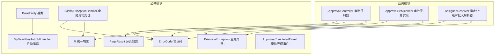
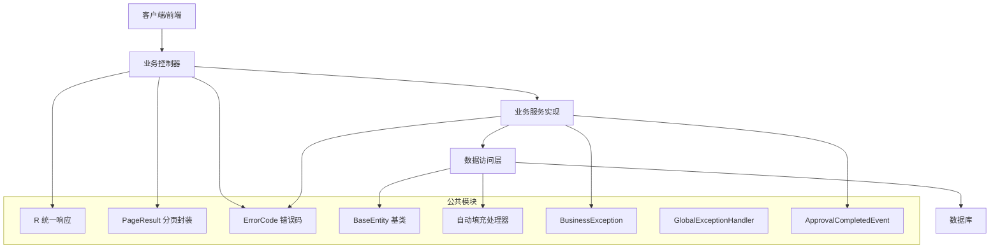
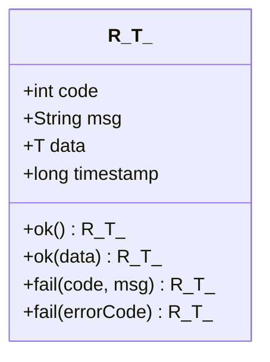
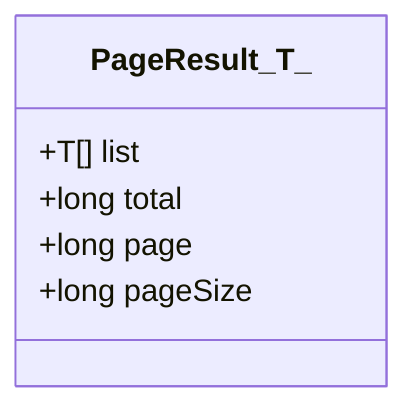
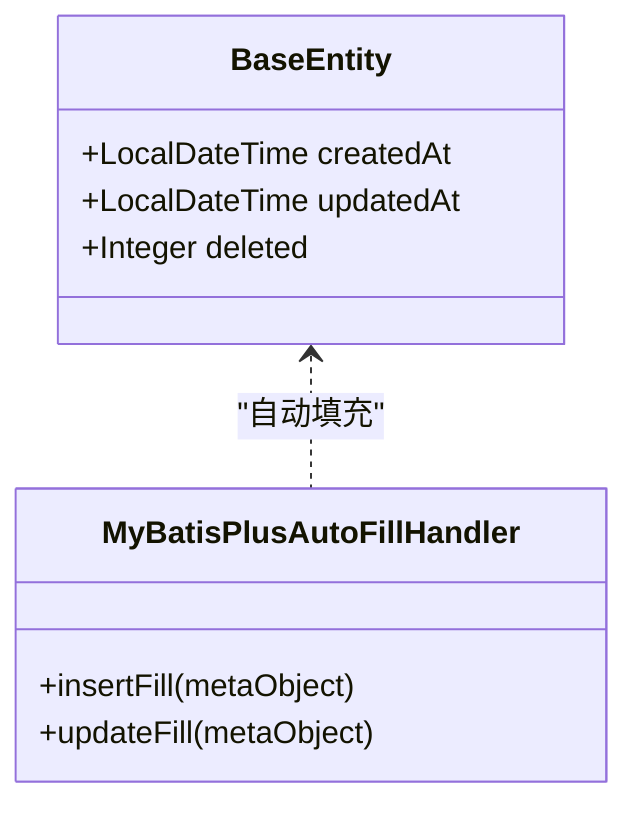
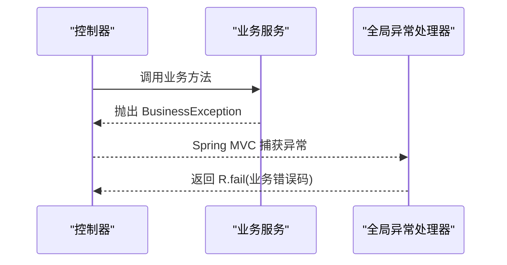
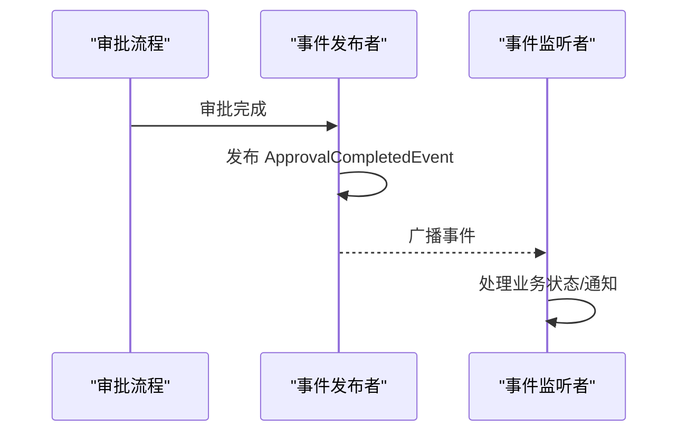
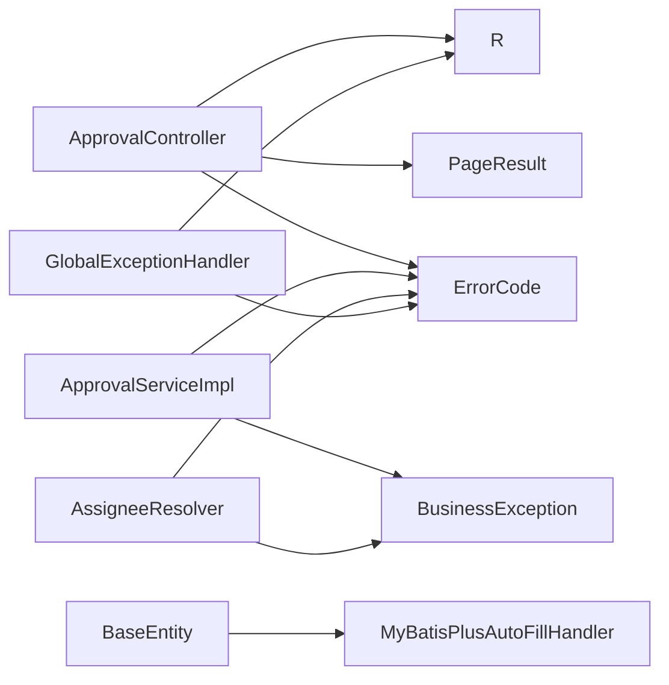

# 公共模块

<cite>
**本文引用的文件**
- [R.java](file://oa-common/src/main/java/com/oa/admin/common/result/R.java)
- [PageResult.java](file://oa-common/src/main/java/com/oa/admin/common/result/PageResult.java)
- [ErrorCode.java](file://oa-common/src/main/java/com/oa/admin/common/result/ErrorCode.java)
- [BaseEntity.java](file://oa-common/src/main/java/com/oa/admin/common/entity/BaseEntity.java)
- [MyBatisPlusAutoFillHandler.java](file://oa-common/src/main/java/com/oa/admin/common/config/MyBatisPlusAutoFillHandler.java)
- [BusinessException.java](file://oa-common/src/main/java/com/oa/admin/common/exception/BusinessException.java)
- [GlobalExceptionHandler.java](file://oa-common/src/main/java/com/oa/admin/common/exception/GlobalExceptionHandler.java)
- [ApprovalCompletedEvent.java](file://oa-common/src/main/java/com/oa/admin/common/event/ApprovalCompletedEvent.java)
- [RTest.java](file://oa-common/src/test/java/com/oa/admin/common/result/RTest.java)
- [PageResultTest.java](file://oa-common/src/test/java/com/oa/admin/common/result/PageResultTest.java)
- [BusinessExceptionTest.java](file://oa-common/src/test/java/com/oa/admin/common/exception/BusinessExceptionTest.java)
- [GlobalExceptionHandlerTest.java](file://oa-common/src/test/java/com/oa/admin/common/exception/GlobalExceptionHandlerTest.java)
- [ApprovalController.java](file://oa-approval/src/main/java/com/oa/admin/approval/controller/ApprovalController.java)
- [AssigneeResolver.java](file://oa-approval/src/main/java/com/oa/admin/approval/resolver/AssigneeResolver.java)
- [ApprovalServiceImpl.java](file://oa-approval/src/main/java/com/oa/admin/approval/service/impl/ApprovalServiceImpl.java)
</cite>

## 目录
1. [简介](#简介)
2. [项目结构](#项目结构)
3. [核心组件](#核心组件)
4. [架构总览](#架构总览)
5. [详细组件分析](#详细组件分析)
6. [依赖分析](#依赖分析)
7. [性能考虑](#性能考虑)
8. [故障排查指南](#故障排查指南)
9. [结论](#结论)
10. [附录：使用与扩展指南](#附录使用与扩展指南)

## 简介
公共模块是整个系统的基础设施，提供统一的响应封装、错误码体系、全局异常处理、基础实体与自动填充、事件驱动等能力，确保各业务模块在一致的契约下协作。其设计目标是：
- 统一对外响应格式，简化前端对接与调试
- 规范错误码与异常处理，提升可观测性与一致性
- 提供可复用的实体基类与数据填充机制，降低重复代码
- 建立事件发布订阅通道，支持跨模块解耦联动

## 项目结构
公共模块位于 oa-common，包含以下关键包：
- result：统一响应与分页封装、错误码枚举
- entity：基础实体基类（含审计字段与逻辑删除）
- config：MyBatis-Plus 自动填充处理器
- exception：业务异常与全局异常处理
- event：事件模型（如审批完成事件）

图表来源
- [R.java:11-43](file://oa-common/src/main/java/com/oa/admin/common/result/R.java#L11-L43)
- [PageResult.java:10-21](file://oa-common/src/main/java/com/oa/admin/common/result/PageResult.java#L10-L21)
- [ErrorCode.java:11-40](file://oa-common/src/main/java/com/oa/admin/common/result/ErrorCode.java#L11-L40)
- [BaseEntity.java:14-25](file://oa-common/src/main/java/com/oa/admin/common/entity/BaseEntity.java#L14-L25)
- [MyBatisPlusAutoFillHandler.java:12-24](file://oa-common/src/main/java/com/oa/admin/common/config/MyBatisPlusAutoFillHandler.java#L12-L24)
- [BusinessException.java:10-22](file://oa-common/src/main/java/com/oa/admin/common/exception/BusinessException.java#L10-L22)
- [GlobalExceptionHandler.java:21-73](file://oa-common/src/main/java/com/oa/admin/common/exception/GlobalExceptionHandler.java#L21-L73)
- [ApprovalCompletedEvent.java:10-34](file://oa-common/src/main/java/com/oa/admin/common/event/ApprovalCompletedEvent.java#L10-L34)
- [ApprovalController.java:13-190](file://oa-approval/src/main/java/com/oa/admin/approval/controller/ApprovalController.java#L13-L190)
- [ApprovalServiceImpl.java:31-276](file://oa-approval/src/main/java/com/oa/admin/approval/service/impl/ApprovalServiceImpl.java#L31-L276)
- [AssigneeResolver.java:26-56](file://oa-approval/src/main/java/com/oa/admin/approval/resolver/AssigneeResolver.java#L26-L56)

章节来源
- [R.java:1-44](file://oa-common/src/main/java/com/oa/admin/common/result/R.java#L1-L44)
- [PageResult.java:1-23](file://oa-common/src/main/java/com/oa/admin/common/result/PageResult.java#L1-L23)
- [ErrorCode.java:1-45](file://oa-common/src/main/java/com/oa/admin/common/result/ErrorCode.java#L1-L45)
- [BaseEntity.java:1-26](file://oa-common/src/main/java/com/oa/admin/common/entity/BaseEntity.java#L1-L26)
- [MyBatisPlusAutoFillHandler.java:1-25](file://oa-common/src/main/java/com/oa/admin/common/config/MyBatisPlusAutoFillHandler.java#L1-L25)
- [BusinessException.java:1-23](file://oa-common/src/main/java/com/oa/admin/common/exception/BusinessException.java#L1-L23)
- [GlobalExceptionHandler.java:1-74](file://oa-common/src/main/java/com/oa/admin/common/exception/GlobalExceptionHandler.java#L1-L74)
- [ApprovalCompletedEvent.java:1-35](file://oa-common/src/main/java/com/oa/admin/common/event/ApprovalCompletedEvent.java#L1-L35)

## 核心组件
- 统一响应 R<T>：提供成功/失败两种构造方法，内置时间戳，便于前后端约定统一返回结构。
- 分页封装 PageResult<T>：承载列表、总数、页码、页大小，便于分页查询统一返回。
- 错误码体系 ErrorCode：按域划分（系统/认证/审批），统一错误标识与消息。
- 基础实体 BaseEntity：统一 createdAt、updatedAt、deleted 字段，配合自动填充与逻辑删除。
- 自动填充处理器 MyBatisPlusAutoFillHandler：在插入/更新时自动写入时间字段。
- 业务异常 BusinessException：继承 RuntimeException，携带业务错误码。
- 全局异常处理 GlobalExceptionHandler：集中捕获认证、参数校验、业务异常与未知异常，统一返回 R<T>。
- 审批完成事件 ApprovalCompletedEvent：用于审批流程完成后跨模块通知。

章节来源
- [R.java:11-43](file://oa-common/src/main/java/com/oa/admin/common/result/R.java#L11-L43)
- [PageResult.java:10-21](file://oa-common/src/main/java/com/oa/admin/common/result/PageResult.java#L10-L21)
- [ErrorCode.java:11-40](file://oa-common/src/main/java/com/oa/admin/common/result/ErrorCode.java#L11-L40)
- [BaseEntity.java:14-25](file://oa-common/src/main/java/com/oa/admin/common/entity/BaseEntity.java#L14-L25)
- [MyBatisPlusAutoFillHandler.java:12-24](file://oa-common/src/main/java/com/oa/admin/common/config/MyBatisPlusAutoFillHandler.java#L12-L24)
- [BusinessException.java:10-22](file://oa-common/src/main/java/com/oa/admin/common/exception/BusinessException.java#L10-L22)
- [GlobalExceptionHandler.java:21-73](file://oa-common/src/main/java/com/oa/admin/common/exception/GlobalExceptionHandler.java#L21-L73)
- [ApprovalCompletedEvent.java:10-34](file://oa-common/src/main/java/com/oa/admin/common/event/ApprovalCompletedEvent.java#L10-L34)

## 架构总览
公共模块通过“统一响应 + 错误码 + 异常处理 + 基础实体 + 自动填充 + 事件”形成横切能力，业务模块仅需关注领域逻辑并通过统一出口输出结果与错误信息。

图表来源
- [R.java:11-43](file://oa-common/src/main/java/com/oa/admin/common/result/R.java#L11-L43)
- [PageResult.java:10-21](file://oa-common/src/main/java/com/oa/admin/common/result/PageResult.java#L10-L21)
- [ErrorCode.java:11-40](file://oa-common/src/main/java/com/oa/admin/common/result/ErrorCode.java#L11-L40)
- [BaseEntity.java:14-25](file://oa-common/src/main/java/com/oa/admin/common/entity/BaseEntity.java#L14-L25)
- [MyBatisPlusAutoFillHandler.java:12-24](file://oa-common/src/main/java/com/oa/admin/common/config/MyBatisPlusAutoFillHandler.java#L12-L24)
- [BusinessException.java:10-22](file://oa-common/src/main/java/com/oa/admin/common/exception/BusinessException.java#L10-L22)
- [GlobalExceptionHandler.java:21-73](file://oa-common/src/main/java/com/oa/admin/common/exception/GlobalExceptionHandler.java#L21-L73)
- [ApprovalCompletedEvent.java:10-34](file://oa-common/src/main/java/com/oa/admin/common/event/ApprovalCompletedEvent.java#L10-L34)
- [ApprovalController.java:13-190](file://oa-approval/src/main/java/com/oa/admin/approval/controller/ApprovalController.java#L13-L190)
- [ApprovalServiceImpl.java:31-276](file://oa-approval/src/main/java/com/oa/admin/approval/service/impl/ApprovalServiceImpl.java#L31-L276)

## 详细组件分析

### 统一响应封装 R<T>
- 设计要点
  - 成功：默认 code=200，msg="success"，可携带泛型数据
  - 失败：支持传入 code/msg 或直接传入 ErrorCode 枚举
  - 时间戳：构造时记录 Unix 秒级时间，便于日志与监控
  - JSON 序列化：非空字段参与序列化，避免冗余字段
- 使用建议
  - 控制器层统一以 R.ok()/R.fail(...) 返回
  - 复杂查询使用 PageResult 包装后由 R.ok(PageResult) 返回
- 测试验证
  - 成功/失败路径、时间戳范围、复杂对象嵌套

图表来源
- [R.java:11-43](file://oa-common/src/main/java/com/oa/admin/common/result/R.java#L11-L43)

章节来源
- [R.java:11-43](file://oa-common/src/main/java/com/oa/admin/common/result/R.java#L11-L43)
- [RTest.java:12-72](file://oa-common/src/test/java/com/oa/admin/common/result/RTest.java#L12-L72)

### 分页封装 PageResult
- 设计要点
  - 承载 list、total、page、pageSize 四要素
  - 构造函数显式赋值，保证不可变性
- 使用建议
  - 查询接口返回 PageResult，再由 R.ok(PageResult) 输出
  - 支持空列表与 null 列表场景

图表来源
- [PageResult.java:10-21](file://oa-common/src/main/java/com/oa/admin/common/result/PageResult.java#L10-L21)

章节来源
- [PageResult.java:10-21](file://oa-common/src/main/java/com/oa/admin/common/result/PageResult.java#L10-L21)
- [PageResultTest.java:16-38](file://oa-common/src/test/java/com/oa/admin/common/result/PageResultTest.java#L16-L38)

### 错误码体系 ErrorCode
- 设计要点
  - 按域划分：系统(10xx)、认证(20xx)、审批(30xx)
  - 统一 code/msg，便于前端与日志识别
- 使用建议
  - 控制器/服务层优先使用 ErrorCode 枚举
  - BusinessException 可直接传入 ErrorCode

章节来源
- [ErrorCode.java:11-40](file://oa-common/src/main/java/com/oa/admin/common/result/ErrorCode.java#L11-L40)

### 基础实体 BaseEntity 与自动填充
- 设计要点
  - createdAt、updatedAt、deleted 三字段标准化
  - 使用 MyBatis-Plus 注解标注自动填充与逻辑删除
- 自动填充处理器
  - 插入时填充 createdAt、updatedAt
  - 更新时仅填充 updatedAt
- 使用建议
  - 业务实体继承 BaseEntity 即可获得审计字段
  - 遵循 deleted=0 未删除、非 0 已删除的约定

图表来源
- [BaseEntity.java:14-25](file://oa-common/src/main/java/com/oa/admin/common/entity/BaseEntity.java#L14-L25)
- [MyBatisPlusAutoFillHandler.java:12-24](file://oa-common/src/main/java/com/oa/admin/common/config/MyBatisPlusAutoFillHandler.java#L12-L24)

章节来源
- [BaseEntity.java:14-25](file://oa-common/src/main/java/com/oa/admin/common/entity/BaseEntity.java#L14-L25)
- [MyBatisPlusAutoFillHandler.java:12-24](file://oa-common/src/main/java/com/oa/admin/common/config/MyBatisPlusAutoFillHandler.java#L12-L24)

### 业务异常 BusinessException 与全局异常处理 GlobalExceptionHandler
- BusinessException
  - 继承 RuntimeException，携带业务错误码
  - 支持直接传入 ErrorCode 枚举
- GlobalExceptionHandler
  - 集中处理：未登录、权限不足、角色不足、参数校验失败、业务异常、其他异常
  - 统一返回 R.fail(...)，HTTP 状态按场景映射
- 使用建议
  - 业务断言失败时抛出 BusinessException
  - 控制器无需手动 try/catch，交由全局处理

图表来源
- [BusinessException.java:10-22](file://oa-common/src/main/java/com/oa/admin/common/exception/BusinessException.java#L10-L22)
- [GlobalExceptionHandler.java:41-45](file://oa-common/src/main/java/com/oa/admin/common/exception/GlobalExceptionHandler.java#L41-L45)
- [ApprovalController.java:190-247](file://oa-approval/src/main/java/com/oa/admin/approval/controller/ApprovalController.java#L190-L247)

章节来源
- [BusinessException.java:10-22](file://oa-common/src/main/java/com/oa/admin/common/exception/BusinessException.java#L10-L22)
- [BusinessExceptionTest.java:14-45](file://oa-common/src/test/java/com/oa/admin/common/exception/BusinessExceptionTest.java#L14-L45)
- [GlobalExceptionHandler.java:21-73](file://oa-common/src/main/java/com/oa/admin/common/exception/GlobalExceptionHandler.java#L21-L73)
- [GlobalExceptionHandlerTest.java:25-67](file://oa-common/src/test/java/com/oa/admin/common/exception/GlobalExceptionHandlerTest.java#L25-L67)

### 事件驱动：ApprovalCompletedEvent
- 设计要点
  - 继承 ApplicationEvent，包含审批实例 ID、表单数据、结果（同意/拒绝）
  - 业务模块可在审批完成后发布此事件
- 使用建议
  - 订阅者监听事件，执行后续状态同步或通知
  - 事件发布应保证幂等与最终一致性

图表来源
- [ApprovalCompletedEvent.java:10-34](file://oa-common/src/main/java/com/oa/admin/common/event/ApprovalCompletedEvent.java#L10-L34)

章节来源
- [ApprovalCompletedEvent.java:10-34](file://oa-common/src/main/java/com/oa/admin/common/event/ApprovalCompletedEvent.java#L10-L34)

## 依赖分析
- 控制器到公共模块
  - 审批控制器广泛使用 R.ok()/R.fail() 与 PageResult 封装
- 服务层到公共模块
  - 业务服务在断言失败时抛出 BusinessException，并使用 ErrorCode
  - 指定/上级审批人解析器同样使用 BusinessException 与 ErrorCode
- 数据层到公共模块
  - 实体继承 BaseEntity，自动填充由 MyBatisPlusAutoFillHandler 管理
- 异常处理到公共模块
  - 全局异常处理器统一拦截并返回 R.fail()

图表来源
- [ApprovalController.java:13-190](file://oa-approval/src/main/java/com/oa/admin/approval/controller/ApprovalController.java#L13-L190)
- [ApprovalServiceImpl.java:31-276](file://oa-approval/src/main/java/com/oa/admin/approval/service/impl/ApprovalServiceImpl.java#L31-L276)
- [AssigneeResolver.java:26-56](file://oa-approval/src/main/java/com/oa/admin/approval/resolver/AssigneeResolver.java#L26-L56)
- [BaseEntity.java:14-25](file://oa-common/src/main/java/com/oa/admin/common/entity/BaseEntity.java#L14-L25)
- [MyBatisPlusAutoFillHandler.java:12-24](file://oa-common/src/main/java/com/oa/admin/common/config/MyBatisPlusAutoFillHandler.java#L12-L24)
- [BusinessException.java:10-22](file://oa-common/src/main/java/com/oa/admin/common/exception/BusinessException.java#L10-L22)
- [GlobalExceptionHandler.java:21-73](file://oa-common/src/main/java/com/oa/admin/common/exception/GlobalExceptionHandler.java#L21-L73)

章节来源
- [ApprovalController.java:13-190](file://oa-approval/src/main/java/com/oa/admin/approval/controller/ApprovalController.java#L13-L190)
- [ApprovalServiceImpl.java:31-276](file://oa-approval/src/main/java/com/oa/admin/approval/service/impl/ApprovalServiceImpl.java#L31-L276)
- [AssigneeResolver.java:26-56](file://oa-approval/src/main/java/com/oa/admin/approval/resolver/AssigneeResolver.java#L26-L56)

## 性能考虑
- 统一响应与错误码
  - R<T> 与 ErrorCode 的简单结构有利于序列化与传输开销控制
- 自动填充
  - 在插入/更新时进行严格填充，避免重复逻辑与遗漏
- 分页封装
  - PageResult 仅承载必要字段，减少额外序列化负担
- 全局异常处理
  - 对常见异常进行快速映射，减少分支判断成本

## 故障排查指南
- 参数校验失败
  - 现象：返回 400，消息来自字段校验第一条
  - 排查：检查 DTO 字段注解与校验提示
- 未登录/权限不足
  - 现象：返回 401/403，消息对应令牌过期或无权限
  - 排查：确认鉴权中间件与权限配置
- 业务异常
  - 现象：返回 200，code 为业务错误码，msg 为错误描述
  - 排查：定位抛出 BusinessException 的位置，核对 ErrorCode
- 未知异常
  - 现象：返回 500，系统异常
  - 排查：查看日志堆栈，确认异常是否被全局处理器捕获

章节来源
- [GlobalExceptionHandler.java:23-72](file://oa-common/src/main/java/com/oa/admin/common/exception/GlobalExceptionHandler.java#L23-L72)
- [GlobalExceptionHandlerTest.java:25-67](file://oa-common/src/test/java/com/oa/admin/common/exception/GlobalExceptionHandlerTest.java#L25-L67)

## 结论
公共模块通过统一响应、错误码、异常处理、基础实体与自动填充、事件机制，构建了清晰、一致且可扩展的基础能力层。业务模块只需遵循统一契约，即可快速实现功能并保持系统整体的一致性与可维护性。

## 附录：使用与扩展指南

### 统一响应与分页
- 控制器返回
  - 成功：R.ok(data)
  - 成功（无数据）：R.ok()
  - 失败：R.fail(ErrorCode.XXX) 或 R.fail(code, msg)
- 分页查询
  - 将查询结果封装为 PageResult，再由 R.ok(PageResult) 返回

章节来源
- [R.java:21-42](file://oa-common/src/main/java/com/oa/admin/common/result/R.java#L21-L42)
- [PageResult.java:16-21](file://oa-common/src/main/java/com/oa/admin/common/result/PageResult.java#L16-L21)
- [ApprovalController.java:13-190](file://oa-approval/src/main/java/com/oa/admin/approval/controller/ApprovalController.java#L13-L190)

### 错误码使用规范
- 优先使用 ErrorCode 枚举，避免魔法数
- 新增错误码时按域划分并在注释中标注范围
- 业务异常统一抛出 BusinessException，便于全局处理

章节来源
- [ErrorCode.java:11-40](file://oa-common/src/main/java/com/oa/admin/common/result/ErrorCode.java#L11-L40)
- [BusinessException.java:10-22](file://oa-common/src/main/java/com/oa/admin/common/exception/BusinessException.java#L10-L22)

### 全局异常处理策略
- 不要手动 try/catch 业务异常；让 GlobalExceptionHandler 统一处理
- 自定义异常可通过继承 RuntimeException 并在处理器中注册映射

章节来源
- [GlobalExceptionHandler.java:21-73](file://oa-common/src/main/java/com/oa/admin/common/exception/GlobalExceptionHandler.java#L21-L73)

### 基础实体与自动填充
- 实体继承 BaseEntity 即可获得审计字段
- 自动填充由 MyBatisPlusAutoFillHandler 管理，无需手写 set 语句
- 如需扩展字段，建议在 BaseEntity 中增加并补充处理器

章节来源
- [BaseEntity.java:14-25](file://oa-common/src/main/java/com/oa/admin/common/entity/BaseEntity.java#L14-L25)
- [MyBatisPlusAutoFillHandler.java:12-24](file://oa-common/src/main/java/com/oa/admin/common/config/MyBatisPlusAutoFillHandler.java#L12-L24)

### 事件驱动扩展
- 审批完成后发布 ApprovalCompletedEvent
- 订阅者实现 ApplicationListener<ApprovalCompletedEvent> 进行处理
- 注意幂等性与重试策略

章节来源
- [ApprovalCompletedEvent.java:10-34](file://oa-common/src/main/java/com/oa/admin/common/event/ApprovalCompletedEvent.java#L10-L34)

### 业务断言与异常抛出
- 参数校验失败：抛出 BusinessException(ErrorCode.PARAM_ERROR)
- 资源不存在：抛出 BusinessException(ErrorCode.NOT_FOUND)
- 权限不足：抛出 BusinessException(ErrorCode.FORBIDDEN)
- 审批相关：根据具体场景选择审批域错误码

章节来源
- [ApprovalController.java:190-247](file://oa-approval/src/main/java/com/oa/admin/approval/controller/ApprovalController.java#L190-L247)
- [AssigneeResolver.java:26-56](file://oa-approval/src/main/java/com/oa/admin/approval/resolver/AssigneeResolver.java#L26-L56)
- [ApprovalServiceImpl.java:126-276](file://oa-approval/src/main/java/com/oa/admin/approval/service/impl/ApprovalServiceImpl.java#L126-L276)