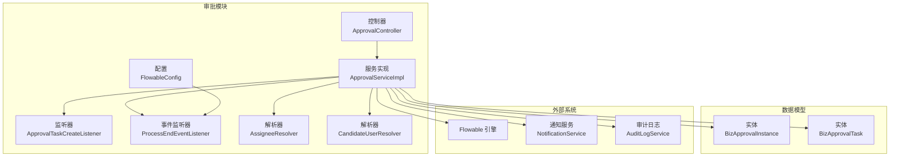
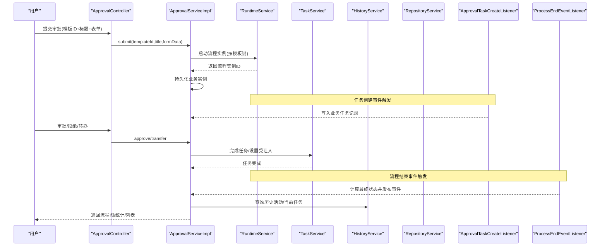
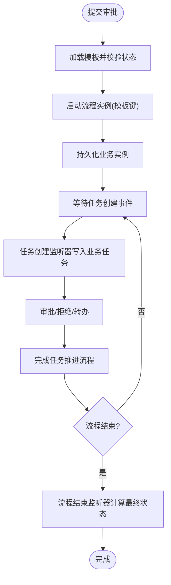
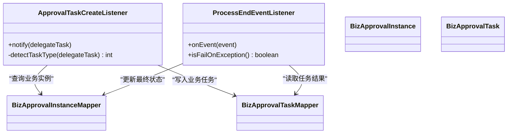
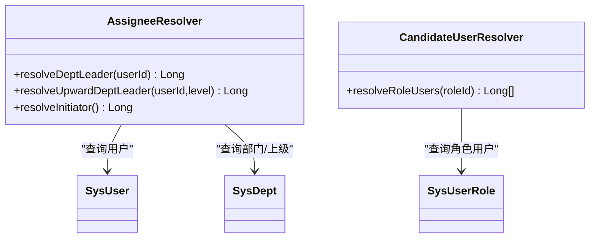
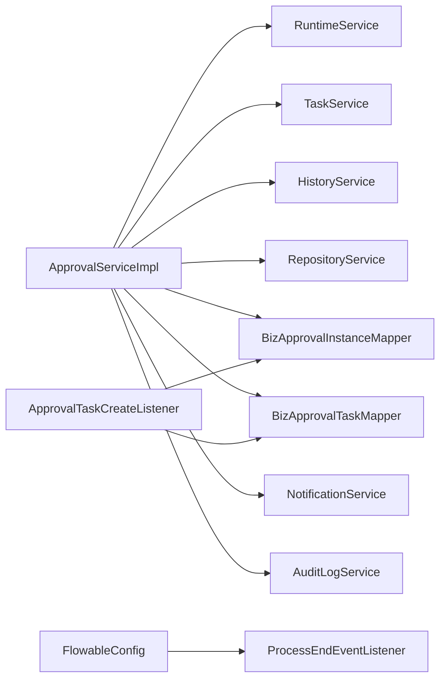
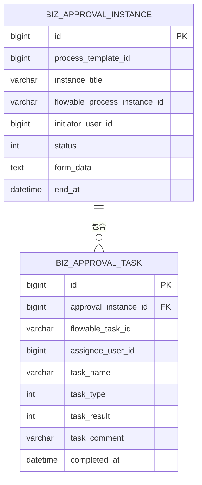

# 审批工作流模块

<cite>
**本文引用的文件**
- [FlowableConfig.java](file://oa-approval/src/main/java/com/oa/admin/approval/config/FlowableConfig.java)
- [ApprovalController.java](file://oa-approval/src/main/java/com/oa/admin/approval/controller/ApprovalController.java)
- [ApprovalTaskCreateListener.java](file://oa-approval/src/main/java/com/oa/admin/approval/listener/ApprovalTaskCreateListener.java)
- [ProcessEndEventListener.java](file://oa-approval/src/main/java/com/oa/admin/approval/listener/ProcessEndEventListener.java)
- [AssigneeResolver.java](file://oa-approval/src/main/java/com/oa/admin/approval/resolver/AssigneeResolver.java)
- [CandidateUserResolver.java](file://oa-approval/src/main/java/com/oa/admin/approval/resolver/CandidateUserResolver.java)
- [ApprovalServiceImpl.java](file://oa-approval/src/main/java/com/oa/admin/approval/service/impl/ApprovalServiceImpl.java)
- [BizApprovalInstance.java](file://oa-approval/src/main/java/com/oa/admin/approval/entity/BizApprovalInstance.java)
- [BizApprovalTask.java](file://oa-approval/src/main/java/com/oa/admin/approval/entity/BizApprovalTask.java)
- [ApprovalInstanceStatus.java](file://oa-approval/src/main/java/com/oa/admin/approval/enums/ApprovalInstanceStatus.java)
- [ApprovalTaskResult.java](file://oa-approval/src/main/java/com/oa/admin/approval/enums/ApprovalTaskResult.java)
- [leave_request.bpmn20.xml](file://oa-app/src/main/resources/processes/leave_request.bpmn20.xml)
- [ApprovalTemplateService.java](file://oa-approval/src/main/java/com/oa/admin/approval/service/ApprovalTemplateService.java)
- [NotificationService.java](file://oa-approval/src/main/java/com/oa/admin/approval/service/NotificationService.java)
- [AuditLogService.java](file://oa-approval/src/main/java/com/oa/admin/approval/service/AuditLogService.java)
</cite>

## 目录
1. [简介](#简介)
2. [项目结构](#项目结构)
3. [核心组件](#核心组件)
4. [架构总览](#架构总览)
5. [详细组件分析](#详细组件分析)
6. [依赖分析](#依赖分析)
7. [性能考虑](#性能考虑)
8. [故障排查指南](#故障排查指南)
9. [结论](#结论)
10. [附录](#附录)

## 简介
本文件面向开发者与运维人员，系统性阐述基于 Flowable 工作流引擎的审批工作流模块。内容覆盖流程生命周期（定义、部署、实例创建、任务分配、状态流转）、工作流监听器机制（任务创建监听器、流程结束监听器）、动态审批人解析策略（候选人解析器、审批人解析器）、审批 API 接口、审批模板设计与配置（JSON 表单与 BPMN 流程）、通知系统集成与审计日志记录，并提供扩展与定制化开发指南。

## 项目结构
审批模块采用分层架构：控制器层负责对外 API；服务层封装业务逻辑；持久层映射实体；Flowable 配置与监听器注入；BPMN 模板与 UEL 解析器在流程中使用。

图表来源
- [ApprovalController.java:1-252](file://oa-approval/src/main/java/com/oa/admin/approval/controller/ApprovalController.java#L1-L252)
- [ApprovalServiceImpl.java:1-792](file://oa-approval/src/main/java/com/oa/admin/approval/service/impl/ApprovalServiceImpl.java#L1-L792)
- [ApprovalTaskCreateListener.java:1-89](file://oa-approval/src/main/java/com/oa/admin/approval/listener/ApprovalTaskCreateListener.java#L1-L89)
- [ProcessEndEventListener.java:1-80](file://oa-approval/src/main/java/com/oa/admin/approval/listener/ProcessEndEventListener.java#L1-L80)
- [AssigneeResolver.java:1-62](file://oa-approval/src/main/java/com/oa/admin/approval/resolver/AssigneeResolver.java#L1-L62)
- [CandidateUserResolver.java:1-31](file://oa-approval/src/main/java/com/oa/admin/approval/resolver/CandidateUserResolver.java#L1-L31)
- [FlowableConfig.java:1-31](file://oa-approval/src/main/java/com/oa/admin/approval/config/FlowableConfig.java#L1-L31)
- [BizApprovalInstance.java:1-33](file://oa-approval/src/main/java/com/oa/admin/approval/entity/BizApprovalInstance.java#L1-L33)
- [BizApprovalTask.java:1-35](file://oa-approval/src/main/java/com/oa/admin/approval/entity/BizApprovalTask.java#L1-L35)

章节来源
- [ApprovalController.java:1-252](file://oa-approval/src/main/java/com/oa/admin/approval/controller/ApprovalController.java#L1-L252)
- [ApprovalServiceImpl.java:1-792](file://oa-approval/src/main/java/com/oa/admin/approval/service/impl/ApprovalServiceImpl.java#L1-L792)

## 核心组件
- 控制器层：提供审批提交、任务处理、任务转办、撤回、实例查询、仪表盘统计、模板管理、抄送管理等接口。
- 服务层：封装流程启动、任务审批、转办、撤回、终止、统计与指标计算、流程图渲染、CC 触发等。
- 监听器：任务创建时持久化业务任务；流程结束时计算最终状态并发布完成事件。
- 解析器：动态解析审批人与候选人集合，支持部门领导、逐级上级、发起人等策略。
- 数据模型：业务实例与任务实体，承载审批状态、结果、表单数据等。
- 外部集成：通知服务用于推送消息；审计日志记录关键操作轨迹。

章节来源
- [ApprovalController.java:37-251](file://oa-approval/src/main/java/com/oa/admin/approval/controller/ApprovalController.java#L37-L251)
- [ApprovalServiceImpl.java:122-790](file://oa-approval/src/main/java/com/oa/admin/approval/service/impl/ApprovalServiceImpl.java#L122-L790)
- [ApprovalTaskCreateListener.java:21-88](file://oa-approval/src/main/java/com/oa/admin/approval/listener/ApprovalTaskCreateListener.java#L21-L88)
- [ProcessEndEventListener.java:29-79](file://oa-approval/src/main/java/com/oa/admin/approval/listener/ProcessEndEventListener.java#L29-L79)
- [AssigneeResolver.java:19-61](file://oa-approval/src/main/java/com/oa/admin/approval/resolver/AssigneeResolver.java#L19-L61)
- [CandidateUserResolver.java:17-30](file://oa-approval/src/main/java/com/oa/admin/approval/resolver/CandidateUserResolver.java#L17-L30)
- [BizApprovalInstance.java:16-32](file://oa-approval/src/main/java/com/oa/admin/approval/entity/BizApprovalInstance.java#L16-L32)
- [BizApprovalTask.java:16-34](file://oa-approval/src/main/java/com/oa/admin/approval/entity/BizApprovalTask.java#L16-L34)

## 架构总览
审批系统以 Flowable 为核心，结合 Spring Boot 与 MyBatis-Plus 实现业务编排与数据持久化。流程模板通过 BPMN 定义，运行时变量驱动业务表单数据与动态审批人。监听器与解析器在流程执行期参与决策与数据同步。

图表来源
- [ApprovalController.java:37-127](file://oa-approval/src/main/java/com/oa/admin/approval/controller/ApprovalController.java#L37-L127)
- [ApprovalServiceImpl.java:122-398](file://oa-approval/src/main/java/com/oa/admin/approval/service/impl/ApprovalServiceImpl.java#L122-L398)
- [ApprovalTaskCreateListener.java:25-64](file://oa-approval/src/main/java/com/oa/admin/approval/listener/ApprovalTaskCreateListener.java#L25-L64)
- [ProcessEndEventListener.java:34-62](file://oa-approval/src/main/java/com/oa/admin/approval/listener/ProcessEndEventListener.java#L34-L62)

## 详细组件分析

### 流程生命周期管理
- 流程定义与部署：模板以 BPMN XML 形式存储，支持在线编辑与版本管理。模板发布后可启动实例。
- 实例创建：服务层根据模板键启动流程实例，写入业务实例记录，携带发起人与表单变量。
- 任务分配：监听器在任务创建时将 Flowable 任务映射为业务任务，记录类型（普通/会签/或签）。
- 状态流转：审批动作更新任务结果，Flowable 完成任务推进到下一节点；流程结束时根据任务结果确定最终状态。

图表来源
- [ApprovalServiceImpl.java:122-168](file://oa-approval/src/main/java/com/oa/admin/approval/service/impl/ApprovalServiceImpl.java#L122-L168)
- [ApprovalTaskCreateListener.java:25-64](file://oa-approval/src/main/java/com/oa/admin/approval/listener/ApprovalTaskCreateListener.java#L25-L64)
- [ProcessEndEventListener.java:34-62](file://oa-approval/src/main/java/com/oa/admin/approval/listener/ProcessEndEventListener.java#L34-L62)

章节来源
- [ApprovalServiceImpl.java:122-398](file://oa-approval/src/main/java/com/oa/admin/approval/service/impl/ApprovalServiceImpl.java#L122-L398)
- [leave_request.bpmn20.xml:6-28](file://oa-app/src/main/resources/processes/leave_request.bpmn20.xml#L6-L28)

### 工作流监听器机制
- 任务创建监听器：在 Flowable 任务创建事件发生时，从运行上下文提取流程实例ID，定位业务实例，解析任务类型（普通/会签/或签），并将任务信息落库。
- 流程结束监听器：在流程结束事件发生时，查询该实例下的所有业务任务，依据任务结果判定最终状态（批准/驳回），更新业务实例并发布“审批完成”应用事件。

图表来源
- [ApprovalTaskCreateListener.java:21-88](file://oa-approval/src/main/java/com/oa/admin/approval/listener/ApprovalTaskCreateListener.java#L21-L88)
- [ProcessEndEventListener.java:29-79](file://oa-approval/src/main/java/com/oa/admin/approval/listener/ProcessEndEventListener.java#L29-L79)
- [BizApprovalInstance.java:16-32](file://oa-approval/src/main/java/com/oa/admin/approval/entity/BizApprovalInstance.java#L16-L32)
- [BizApprovalTask.java:16-34](file://oa-approval/src/main/java/com/oa/admin/approval/entity/BizApprovalTask.java#L16-L34)

章节来源
- [ApprovalTaskCreateListener.java:25-87](file://oa-approval/src/main/java/com/oa/admin/approval/listener/ApprovalTaskCreateListener.java#L25-L87)
- [ProcessEndEventListener.java:34-62](file://oa-approval/src/main/java/com/oa/admin/approval/listener/ProcessEndEventListener.java#L34-L62)

### 动态审批人解析策略
- 审批人解析器：支持从用户-部门树解析直接/逐级上级领导，以及获取流程发起人 ID，供 BPMN UEL 表达式调用。
- 候选人解析器：支持按角色ID解析候选用户集合，用于多实例（会签/或签）场景。

图表来源
- [AssigneeResolver.java:21-61](file://oa-approval/src/main/java/com/oa/admin/approval/resolver/AssigneeResolver.java#L21-L61)
- [CandidateUserResolver.java:19-30](file://oa-approval/src/main/java/com/oa/admin/approval/resolver/CandidateUserResolver.java#L19-L30)

章节来源
- [AssigneeResolver.java:26-60](file://oa-approval/src/main/java/com/oa/admin/approval/resolver/AssigneeResolver.java#L26-L60)
- [CandidateUserResolver.java:23-29](file://oa-approval/src/main/java/com/oa/admin/approval/resolver/CandidateUserResolver.java#L23-L29)

### 审批 API 接口文档
- 提交审批
  - 方法：POST
  - 路径：/api/v1/approval/submit
  - 权限：approval:submit
  - 请求体：templateId(模板ID), title(标题), formData(JSON字符串)
  - 返回：业务实例
- 任务审批
  - 方法：POST
  - 路径：/api/v1/approval/task/{taskId}/approve
  - 权限：approval:approve
  - 请求体：result(1=批准,2=驳回), comment(意见)
  - 返回：空
- 我的任务（待办）
  - 方法：GET
  - 路径：/api/v1/approval/my-todo
  - 权限：approval:todo
  - 返回：任务列表
- 我的任务（已办）
  - 方法：GET
  - 路径：/api/v1/approval/my-done
  - 权限：approval:done
  - 返回：任务列表
- 分页查询我的待办/已办
  - 方法：GET
  - 路径：/api/v1/approval/my-todo/paged 与 /api/v1/approval/my-done/paged
  - 权限：approval:todo / approval:done
  - 参数：title(可选), page, pageSize
  - 返回：分页结果
- 任务转办
  - 方法：POST
  - 路径：/api/v1/approval/task/{taskId}/transfer
  - 权限：approval:approve
  - 请求体：targetUserId(目标用户ID), reason(原因)
  - 返回：空
- 撤回实例
  - 方法：POST
  - 路径：/api/v1/approval/{instanceId}/withdraw
  - 权限：approval:withdraw
  - 返回：空
- 实例任务列表
  - 方法：GET
  - 路径：/api/v1/approval/instance/{instanceId}/tasks
  - 权限：approval:instance:view
  - 返回：任务列表
- 我的申请
  - 方法：GET
  - 路径：/api/v1/approval/my-applications
  - 权限：approval:instance:view
  - 参数：title(可选), status(可选), page, pageSize
  - 返回：分页结果
- 实例详情
  - 方法：GET
  - 路径：/api/v1/approval/instance/{instanceId}
  - 权限：approval:instance:view
  - 返回：实例详情
- 实例流程图
  - 方法：GET
  - 路径：/api/v1/approval/instance/{instanceId}/diagram
  - 权限：approval:instance:view
  - 返回：BPMN XML + 已完成/当前节点集合
- 仪表盘统计
  - 方法：GET
  - 路径：/api/v1/approval/dashboard/stats
  - 权限：approval:dashboard
  - 返回：待办/已办/模板数/未读抄送数/最近活动
- 模板管理
  - 列表：GET /api/v1/approval/template
  - 详情：GET /api/v1/approval/template/{id}
  - 新增：POST /api/v1/approval/template
  - 更新：PUT /api/v1/approval/template/{id}
  - 删除：DELETE /api/v1/approval/template/{id}
  - 发布：POST /api/v1/approval/template/{id}/publish
  - 获取XML：GET /api/v1/approval/template/{id}/xml
  - 保存XML：PUT /api/v1/approval/template/{id}/xml
  - 节点配置：GET/PUT /api/v1/approval/template/{id}/node-config
  - 新建版本：POST /api/v1/approval/template/{id}/new-version
- 抄送管理
  - 我的抄送：GET /api/v1/approval/cc
  - 标记已读：POST /api/v1/approval/cc/{ccId}/read

章节来源
- [ApprovalController.java:37-251](file://oa-approval/src/main/java/com/oa/admin/approval/controller/ApprovalController.java#L37-L251)

### 审批模板设计与配置
- JSON 表单配置：提交时将表单字段作为流程变量传入，便于在流程中使用与持久化。
- BPMN 流程定义：模板以 BPMN XML 存储，支持在线编辑与版本管理；流程节点可配置监听器与 UEL 表达式。
- 节点配置：每个模板可维护节点级别的配置（如抄送配置），在任务完成后触发抄送。

章节来源
- [ApprovalServiceImpl.java:122-168](file://oa-approval/src/main/java/com/oa/admin/approval/service/impl/ApprovalServiceImpl.java#L122-L168)
- [leave_request.bpmn20.xml:6-28](file://oa-app/src/main/resources/processes/leave_request.bpmn20.xml#L6-L28)
- [ApprovalTemplateService.java:13-32](file://oa-approval/src/main/java/com/oa/admin/approval/service/ApprovalTemplateService.java#L13-L32)

### 通知系统与审计日志
- 通知系统：审批通过/驳回、任务转办、实例终止等场景通过通知服务发送站内消息。
- 审计日志：对提交、审批、转办、撤回、终止等关键操作进行审计记录，支持按模块/动作/目标类型/时间范围查询。

章节来源
- [ApprovalServiceImpl.java:216-240](file://oa-approval/src/main/java/com/oa/admin/approval/service/impl/ApprovalServiceImpl.java#L216-L240)
- [AuditLogService.java:10-16](file://oa-approval/src/main/java/com/oa/admin/approval/service/AuditLogService.java#L10-L16)
- [NotificationService.java:10-23](file://oa-approval/src/main/java/com/oa/admin/approval/service/NotificationService.java#L10-L23)

## 依赖分析
- 组件耦合
  - 服务层依赖 Flowable 的 Runtime/Task/History/Repository 服务，用于流程控制与查询。
  - 服务层依赖 Mapper 进行业务数据持久化。
  - 服务层依赖通知与审计服务进行集成。
  - 监听器通过 Spring 注入依赖，避免与业务层强耦合。
- 外部依赖
  - Flowable 引擎与 Spring Boot Starter。
  - Sa-Token 用于权限校验。
  - MyBatis-Plus 用于数据访问。

图表来源
- [ApprovalServiceImpl.java:114-121](file://oa-approval/src/main/java/com/oa/admin/approval/service/impl/ApprovalServiceImpl.java#L114-L121)
- [FlowableConfig.java:18-29](file://oa-approval/src/main/java/com/oa/admin/approval/config/FlowableConfig.java#L18-L29)

章节来源
- [FlowableConfig.java:18-29](file://oa-approval/src/main/java/com/oa/admin/approval/config/FlowableConfig.java#L18-L29)
- [ApprovalServiceImpl.java:114-121](file://oa-approval/src/main/java/com/oa/admin/approval/service/impl/ApprovalServiceImpl.java#L114-L121)

## 性能考虑
- 批量查询与分页：待办/已办列表与实例列表均采用分页查询，避免一次性加载大量数据。
- 任务聚合：仪表盘统计通过聚合查询减少多次往返。
- 图形渲染优化：流程图渲染仅在需要时获取 BPMN XML 并追加显示所需片段，避免冗余处理。
- 事务边界：关键操作（提交、审批、转办、撤回、终止）置于事务中，保证一致性与原子性。

## 故障排查指南
- 参数错误：请求参数为空或格式不正确会抛出业务异常，检查请求体字段与类型。
- 权限不足：未登录或缺少相应权限码将被拦截，确认登录状态与权限配置。
- 任务状态异常：重复审批、非本人处理、目标用户无效等情况会被拒绝，检查任务归属与状态。
- 流程实例状态异常：非“进行中”状态不可撤回或终止，检查实例状态。
- 监听器异常：流程结束监听器配置为失败即抛，确保业务任务结果正确落库。

章节来源
- [ApprovalController.java:230-250](file://oa-approval/src/main/java/com/oa/admin/approval/controller/ApprovalController.java#L230-L250)
- [ApprovalServiceImpl.java:170-307](file://oa-approval/src/main/java/com/oa/admin/approval/service/impl/ApprovalServiceImpl.java#L170-L307)
- [ProcessEndEventListener.java:65-78](file://oa-approval/src/main/java/com/oa/admin/approval/listener/ProcessEndEventListener.java#L65-L78)

## 结论
本模块以 Flowable 为核心，结合监听器与解析器实现了灵活的审批流程编排与执行。通过清晰的 API 设计、完善的审计与通知集成、可演进的模板与节点配置，满足企业多样化的审批需求。建议在生产环境关注事务边界、批量查询与图形渲染性能，并持续完善模板与节点配置以提升可用性。

## 附录

### 数据模型

图表来源
- [BizApprovalInstance.java:16-32](file://oa-approval/src/main/java/com/oa/admin/approval/entity/BizApprovalInstance.java#L16-L32)
- [BizApprovalTask.java:16-34](file://oa-approval/src/main/java/com/oa/admin/approval/entity/BizApprovalTask.java#L16-L34)

### 状态枚举
- 实例状态：进行中、已批准、已驳回、已撤回、已取消
- 任务结果：批准、驳回、转办、取消

章节来源
- [ApprovalInstanceStatus.java:11-28](file://oa-approval/src/main/java/com/oa/admin/approval/enums/ApprovalInstanceStatus.java#L11-L28)
- [ApprovalTaskResult.java:11-27](file://oa-approval/src/main/java/com/oa/admin/approval/enums/ApprovalTaskResult.java#L11-L27)