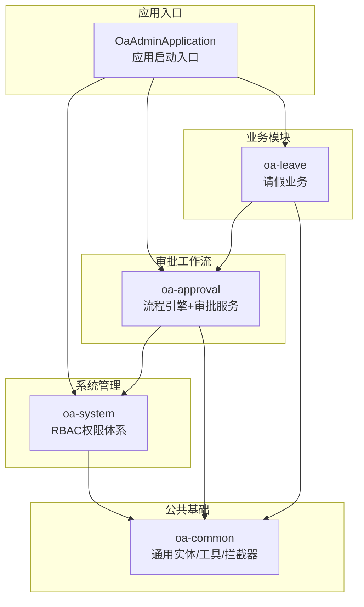
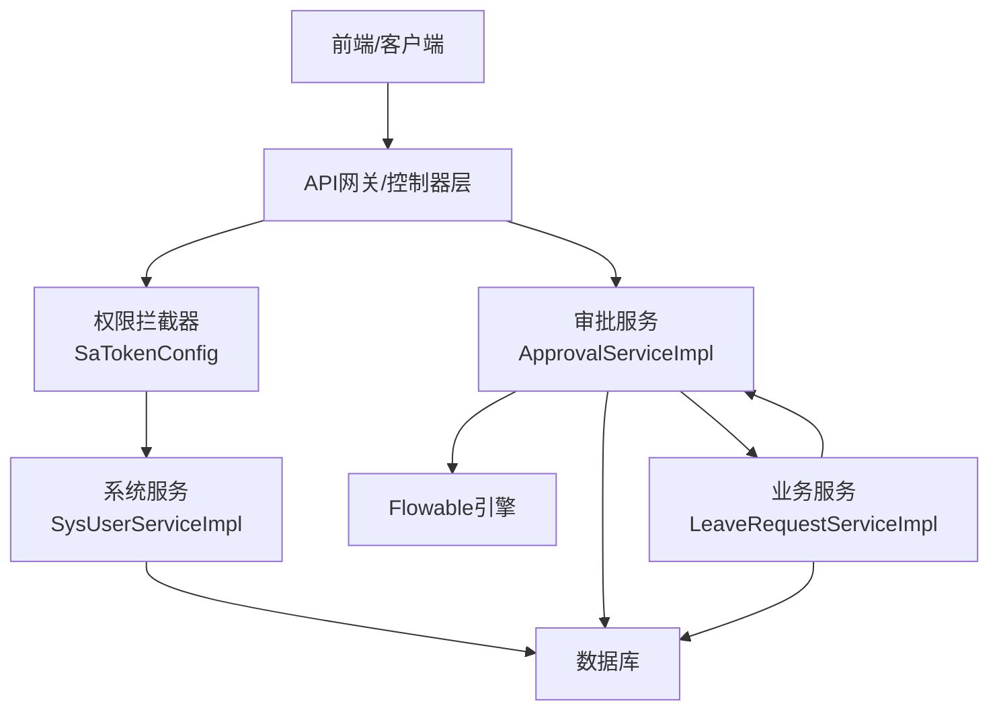
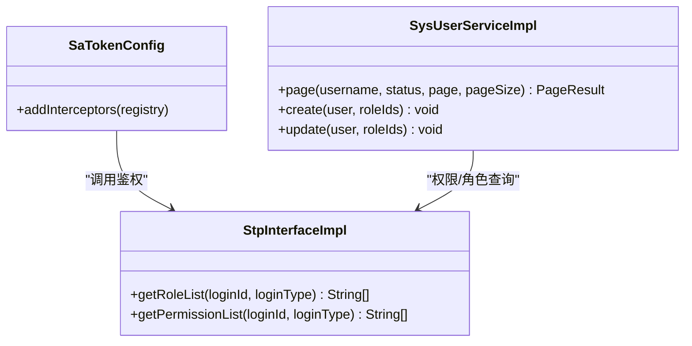
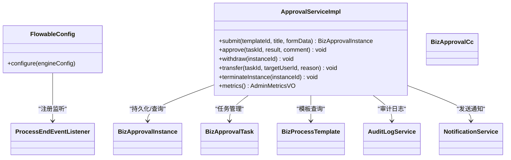
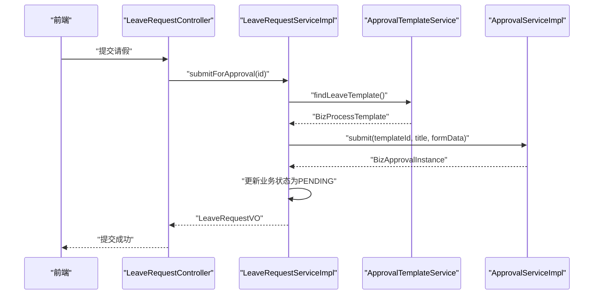
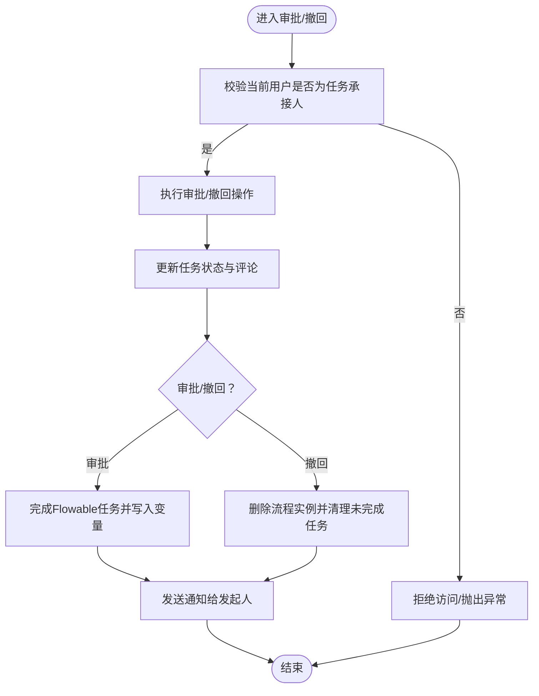
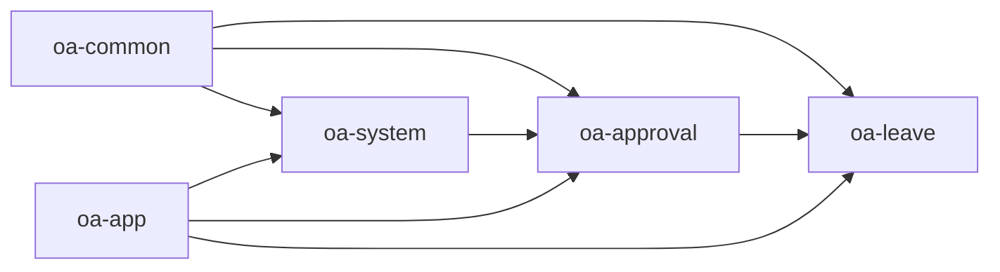

# 核心模块

<cite>
**本文引用的文件**
- [OaAdminApplication.java](file://oa-app/src/main/java/com/oa/admin/OaAdminApplication.java)
- [FlowableConfig.java](file://oa-approval/src/main/java/com/oa/admin/approval/config/FlowableConfig.java)
- [SaTokenConfig.java](file://oa-system/src/main/java/com/oa/admin/system/config/SaTokenConfig.java)
- [StpInterfaceImpl.java](file://oa-system/src/main/java/com/oa/admin/system/config/StpInterfaceImpl.java)
- [MyBatisPlusAutoFillHandler.java](file://oa-common/src/main/java/com/oa/admin/common/config/MyBatisPlusAutoFillHandler.java)
- [ApprovalServiceImpl.java](file://oa-approval/src/main/java/com/oa/admin/approval/service/impl/ApprovalServiceImpl.java)
- [SysUserServiceImpl.java](file://oa-system/src/main/java/com/oa/admin/system/service/impl/SysUserServiceImpl.java)
- [LeaveRequestServiceImpl.java](file://oa-leave/src/main/java/com/oa/admin/leave/service/impl/LeaveRequestServiceImpl.java)
- [BaseEntity.java](file://oa-common/src/main/java/com/oa/admin/common/entity/BaseEntity.java)
- [pom.xml（oa-approval）](file://oa-approval/pom.xml)
- [pom.xml（oa-system）](file://oa-system/pom.xml)
- [pom.xml（oa-leave）](file://oa-leave/pom.xml)
- [pom.xml（oa-common）](file://oa-common/pom.xml)
</cite>

## 目录
1. [引言](#引言)
2. [项目结构](#项目结构)
3. [核心组件](#核心组件)
4. [架构总览](#架构总览)
5. [详细组件分析](#详细组件分析)
6. [依赖分析](#依赖分析)
7. [性能考虑](#性能考虑)
8. [故障排查指南](#故障排查指南)
9. [结论](#结论)
10. [附录](#附录)

## 引言
本文件面向OA审批管理系统的核心模块，系统性梳理RBAC权限管理模块、审批工作流模块与业务模块（以请假为例）的设计理念、实现细节与协作关系。文档从模块职责边界、接口规范、数据交换协议、扩展点与定制化能力、生命周期与依赖注入机制等维度进行深入解析，并提供可操作的集成与二次开发指导。

## 项目结构
系统采用多模块分层架构：公共基础模块（oa-common）、系统管理模块（oa-system）、审批工作流模块（oa-approval）、业务模块（oa-leave），以及应用聚合入口（oa-app）。模块间通过Maven依赖与Spring Boot自动装配协同工作，形成清晰的职责边界与低耦合的协作关系。

图表来源
- [OaAdminApplication.java:11-18](file://oa-app/src/main/java/com/oa/admin/OaAdminApplication.java#L11-L18)
- [pom.xml（oa-system）:15-22](file://oa-system/pom.xml#L15-L22)
- [pom.xml（oa-approval）:15-26](file://oa-approval/pom.xml#L15-L26)
- [pom.xml（oa-leave）:15-22](file://oa-leave/pom.xml#L15-L22)

章节来源
- [OaAdminApplication.java:11-18](file://oa-app/src/main/java/com/oa/admin/OaAdminApplication.java#L11-L18)
- [pom.xml（oa-system）:15-22](file://oa-system/pom.xml#L15-L22)
- [pom.xml（oa-approval）:15-26](file://oa-approval/pom.xml#L15-L26)
- [pom.xml（oa-leave）:15-22](file://oa-leave/pom.xml#L15-L22)
- [pom.xml（oa-common）:17-25](file://oa-common/pom.xml#L17-L25)

## 核心组件
- 应用启动与扫描
  - 应用入口类负责开启事务管理与Mapper扫描，统一扫描系统、审批、业务模块的Mapper包路径，确保MyBatis-Plus与Spring容器正确加载。
- 公共基础设施
  - 自动填充处理器：统一处理创建与更新时间字段，减少重复代码。
  - 基类实体：统一字段与逻辑删除标记，便于审计与数据一致性。
- 权限控制
  - MVC拦截器：对受保护接口进行登录校验。
  - 认证接口实现：基于用户-角色-权限映射，动态返回角色与权限列表，支撑细粒度鉴权。
- 审批工作流
  - 流程引擎配置：注册流程结束事件监听器，驱动业务后置处理。
  - 审批服务：封装提交、审批、撤回、转办、终止、统计等核心能力，桥接Flowable引擎与业务数据。
- 业务模块
  - 请假业务：基于审批模板提交流程实例，流转完成后回调更新业务状态。

章节来源
- [OaAdminApplication.java:11-18](file://oa-app/src/main/java/com/oa/admin/OaAdminApplication.java#L11-L18)
- [MyBatisPlusAutoFillHandler.java:11-24](file://oa-common/src/main/java/com/oa/admin/common/config/MyBatisPlusAutoFillHandler.java#L11-L24)
- [BaseEntity.java:14-25](file://oa-common/src/main/java/com/oa/admin/common/entity/BaseEntity.java#L14-L25)
- [SaTokenConfig.java:13-24](file://oa-system/src/main/java/com/oa/admin/system/config/SaTokenConfig.java#L13-L24)
- [StpInterfaceImpl.java:24-74](file://oa-system/src/main/java/com/oa/admin/system/config/StpInterfaceImpl.java#L24-L74)
- [FlowableConfig.java:15-30](file://oa-approval/src/main/java/com/oa/admin/approval/config/FlowableConfig.java#L15-L30)
- [ApprovalServiceImpl.java:57-60](file://oa-approval/src/main/java/com/oa/admin/approval/service/impl/ApprovalServiceImpl.java#L57-L60)

## 架构总览
系统采用“公共基础层-系统管理层-审批工作流层-业务层”的分层设计，配合Spring Boot与Flowable实现模块化与可扩展性。

图表来源
- [SaTokenConfig.java:13-24](file://oa-system/src/main/java/com/oa/admin/system/config/SaTokenConfig.java#L13-L24)
- [StpInterfaceImpl.java:24-74](file://oa-system/src/main/java/com/oa/admin/system/config/StpInterfaceImpl.java#L24-L74)
- [ApprovalServiceImpl.java:110-121](file://oa-approval/src/main/java/com/oa/admin/approval/service/impl/ApprovalServiceImpl.java#L110-L121)
- [LeaveRequestServiceImpl.java:35-36](file://oa-leave/src/main/java/com/oa/admin/leave/service/impl/LeaveRequestServiceImpl.java#L35-L36)

## 详细组件分析

### RBAC权限管理模块
- 职责边界
  - 用户、角色、权限、部门等基础数据管理；基于用户-角色-权限映射实现动态授权。
- 关键实现
  - 拦截器：对/api/v1/**路径进行登录校验，排除登录/注册等开放接口。
  - 认证接口：根据用户查询其角色与权限集合，支持按状态过滤有效项。
  - 用户服务：提供分页、创建、更新与角色分配能力，密码使用BCrypt加密。
- 接口与数据交换
  - 控制器层接收请求，服务层执行业务规则，返回标准响应包装对象。
  - 权限列表来源于角色-权限映射表，结合权限状态字段进行筛选。
- 扩展点与定制化
  - 可替换认证接口实现，扩展更多登录类型或外部认证源。
  - 支持自定义权限表达式或资源树结构，适配复杂数据范围控制场景。

图表来源
- [SaTokenConfig.java:13-24](file://oa-system/src/main/java/com/oa/admin/system/config/SaTokenConfig.java#L13-L24)
- [StpInterfaceImpl.java:24-74](file://oa-system/src/main/java/com/oa/admin/system/config/StpInterfaceImpl.java#L24-L74)
- [SysUserServiceImpl.java:22-72](file://oa-system/src/main/java/com/oa/admin/system/service/impl/SysUserServiceImpl.java#L22-L72)

章节来源
- [SaTokenConfig.java:13-24](file://oa-system/src/main/java/com/oa/admin/system/config/SaTokenConfig.java#L13-L24)
- [StpInterfaceImpl.java:24-74](file://oa-system/src/main/java/com/oa/admin/system/config/StpInterfaceImpl.java#L24-L74)
- [SysUserServiceImpl.java:22-72](file://oa-system/src/main/java/com/oa/admin/system/service/impl/SysUserServiceImpl.java#L22-L72)

### 审批工作流模块
- 职责边界
  - 流程引擎配置与事件监听；审批实例与任务的全生命周期管理；仪表盘与指标统计；管理员运营能力。
- 关键实现
  - 流程引擎配置：注册流程结束事件监听器，保证流程结束后触发业务处理。
  - 审批服务：提交、审批、撤回、转办、终止、终止清理、统计与看板数据聚合。
  - 数据模型：实例、任务、抄送、模板、流程节点配置、审计日志、通知等。
- 接口与数据交换
  - 提交流程时，将表单数据作为变量传入Flowable；审批结果通过任务完成接口回写，并触发后续动作（如抄送、通知）。
  - 管理端接口支持按标题、状态、发起人、模板、时间范围查询实例，支持分页与导出。
- 扩展点与定制化
  - 事件监听器可扩展流程节点级回调；任务分配器与候选人解析器可按组织/规则定制。
  - 模板节点配置支持节点级抄送、条件分支、并行/会签等高级特性。

图表来源
- [FlowableConfig.java:15-30](file://oa-approval/src/main/java/com/oa/admin/approval/config/FlowableConfig.java#L15-L30)
- [ApprovalServiceImpl.java:110-121](file://oa-approval/src/main/java/com/oa/admin/approval/service/impl/ApprovalServiceImpl.java#L110-L121)

章节来源
- [FlowableConfig.java:15-30](file://oa-approval/src/main/java/com/oa/admin/approval/config/FlowableConfig.java#L15-L30)
- [ApprovalServiceImpl.java:110-121](file://oa-approval/src/main/java/com/oa/admin/approval/service/impl/ApprovalServiceImpl.java#L110-L121)

### 业务模块（以请假为例）
- 职责边界
  - 请假业务的CRUD与状态机；与审批工作流解耦，仅在提交时关联流程模板并传递业务数据。
- 关键实现
  - 请假服务：分页查询、详情、创建、更新、删除、提交审批、重新提交、审批结果回调。
  - 与审批服务交互：定位已发布模板，构造表单变量，提交流程实例，并将审批实例ID回写业务记录。
- 接口与数据交换
  - 业务DTO/VO与实体转换；提交时将业务主键放入流程变量，供流程节点与后置处理使用。
- 扩展点与定制化
  - 可新增其他业务模块复用相同模式：定义模板、构造变量、提交实例、回调更新状态。

图表来源
- [LeaveRequestServiceImpl.java:90-109](file://oa-leave/src/main/java/com/oa/admin/leave/service/impl/LeaveRequestServiceImpl.java#L90-L109)
- [ApprovalServiceImpl.java:122-168](file://oa-approval/src/main/java/com/oa/admin/approval/service/impl/ApprovalServiceImpl.java#L122-L168)

章节来源
- [LeaveRequestServiceImpl.java:33-179](file://oa-leave/src/main/java/com/oa/admin/leave/service/impl/LeaveRequestServiceImpl.java#L33-L179)

### 审批流程核心算法（审批与撤回）

图表来源
- [ApprovalServiceImpl.java:170-240](file://oa-approval/src/main/java/com/oa/admin/approval/service/impl/ApprovalServiceImpl.java#L170-L240)
- [ApprovalServiceImpl.java:264-307](file://oa-approval/src/main/java/com/oa/admin/approval/service/impl/ApprovalServiceImpl.java#L264-L307)

## 依赖分析
- 模块依赖
  - oa-system 依赖 oa-common，提供RBAC能力与安全拦截。
  - oa-approval 依赖 oa-common、oa-system，引入Flowable与权限能力。
  - oa-leave 依赖 oa-common、oa-approval，承接业务流程。
  - oa-app 聚合入口，扫描系统、审批、业务模块的Mapper包。
- 外部依赖
  - Flowable：流程引擎与任务管理。
  - Sa-Token：认证与权限拦截。
  - MyBatis-Plus：通用CRUD与自动填充。

图表来源
- [pom.xml（oa-system）:15-22](file://oa-system/pom.xml#L15-L22)
- [pom.xml（oa-approval）:15-26](file://oa-approval/pom.xml#L15-L26)
- [pom.xml（oa-leave）:15-22](file://oa-leave/pom.xml#L15-L22)
- [pom.xml（oa-common）:17-25](file://oa-common/pom.xml#L17-L25)

章节来源
- [pom.xml（oa-system）:15-22](file://oa-system/pom.xml#L15-L22)
- [pom.xml（oa-approval）:15-26](file://oa-approval/pom.xml#L15-L26)
- [pom.xml（oa-leave）:15-22](file://oa-leave/pom.xml#L15-L22)
- [pom.xml（oa-common）:17-25](file://oa-common/pom.xml#L17-L25)

## 性能考虑
- 数据访问层
  - 使用MyBatis-Plus通用Service与分页插件，避免手写SQL重复劳动；合理使用字段选择与排序索引。
  - 自动填充减少空值判断与重复赋值，提升写入效率。
- 流程引擎
  - 任务查询与历史查询需配合索引与分页，避免一次性拉取大量历史数据。
  - 事件监听器应轻量处理，耗时逻辑建议异步化。
- 权限拦截
  - 拦截器路径精确匹配，避免对静态资源与开放接口产生额外开销。
- 业务流程
  - 表单变量尽量精简，避免大对象序列化带来的网络与存储压力。

## 故障排查指南
- 权限相关
  - 登录拦截未生效：检查拦截器注册路径与排除路径配置。
  - 权限不足：确认用户角色-权限映射与状态字段是否正确。
- 流程相关
  - 任务无法完成：核对任务承接人、任务状态与流程变量。
  - 流程终止失败：查看实例状态与运行时实例ID是否一致。
- 业务相关
  - 请假提交失败：确认模板是否已发布且可用；检查表单变量构造是否正确。
- 通用
  - 审计日志缺失：确认审计服务是否正常记录；检查异常捕获与日志级别。

章节来源
- [SaTokenConfig.java:13-24](file://oa-system/src/main/java/com/oa/admin/system/config/SaTokenConfig.java#L13-L24)
- [StpInterfaceImpl.java:24-74](file://oa-system/src/main/java/com/oa/admin/system/config/StpInterfaceImpl.java#L24-L74)
- [ApprovalServiceImpl.java:122-168](file://oa-approval/src/main/java/com/oa/admin/approval/service/impl/ApprovalServiceImpl.java#L122-L168)
- [LeaveRequestServiceImpl.java:90-109](file://oa-leave/src/main/java/com/oa/admin/leave/service/impl/LeaveRequestServiceImpl.java#L90-L109)

## 结论
本系统通过清晰的模块划分与依赖注入机制，实现了RBAC权限、审批工作流与业务模块的高内聚低耦合。审批服务作为核心枢纽，连接流程引擎与业务数据；系统管理模块提供统一的认证与授权；公共模块沉淀通用能力，降低重复开发成本。模块化的架构便于扩展与定制，适合在企业级场景中快速迭代与规模化部署。

## 附录
- 生命周期与依赖注入
  - 应用启动：OaAdminApplication启用事务与Mapper扫描。
  - Bean装配：各模块通过Spring组件注解暴露服务，跨模块通过接口依赖。
  - 配置注入：Flowable配置类注入事件监听器；权限拦截器注册到WebMvcConfigurer。
- 开发者集成与二次开发指导
  - 新增业务模块：参照请假模块模式，定义模板、构造变量、提交实例、回调更新状态。
  - 扩展审批能力：新增事件监听器或任务分配策略；完善仪表盘与指标统计。
  - 权限扩展：在认证接口实现中增加新的角色/权限来源；完善数据范围控制。

章节来源
- [OaAdminApplication.java:11-18](file://oa-app/src/main/java/com/oa/admin/OaAdminApplication.java#L11-L18)
- [FlowableConfig.java:15-30](file://oa-approval/src/main/java/com/oa/admin/approval/config/FlowableConfig.java#L15-L30)
- [SaTokenConfig.java:13-24](file://oa-system/src/main/java/com/oa/admin/system/config/SaTokenConfig.java#L13-L24)
- [StpInterfaceImpl.java:24-74](file://oa-system/src/main/java/com/oa/admin/system/config/StpInterfaceImpl.java#L24-L74)
- [ApprovalServiceImpl.java:57-60](file://oa-approval/src/main/java/com/oa/admin/approval/service/impl/ApprovalServiceImpl.java#L57-L60)
- [LeaveRequestServiceImpl.java:33-179](file://oa-leave/src/main/java/com/oa/admin/leave/service/impl/LeaveRequestServiceImpl.java#L33-L179)