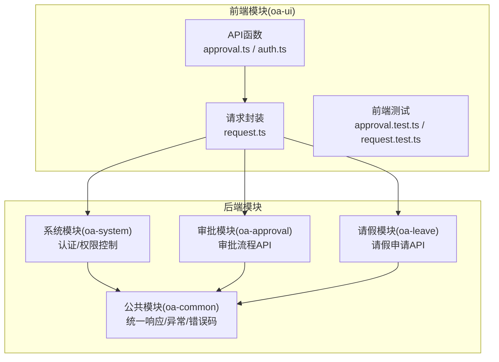
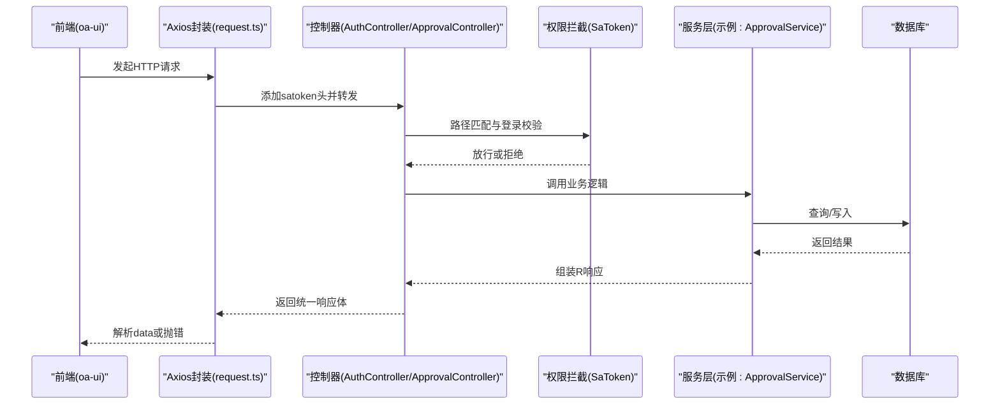
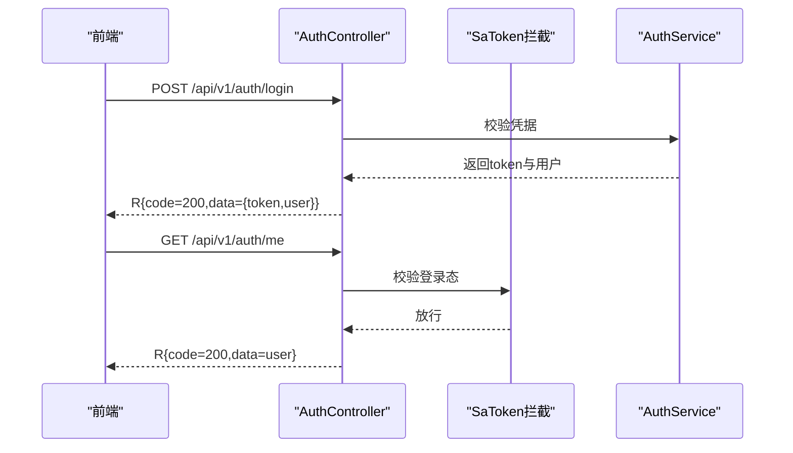
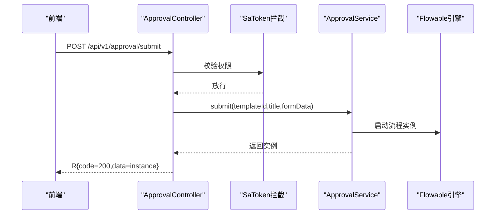
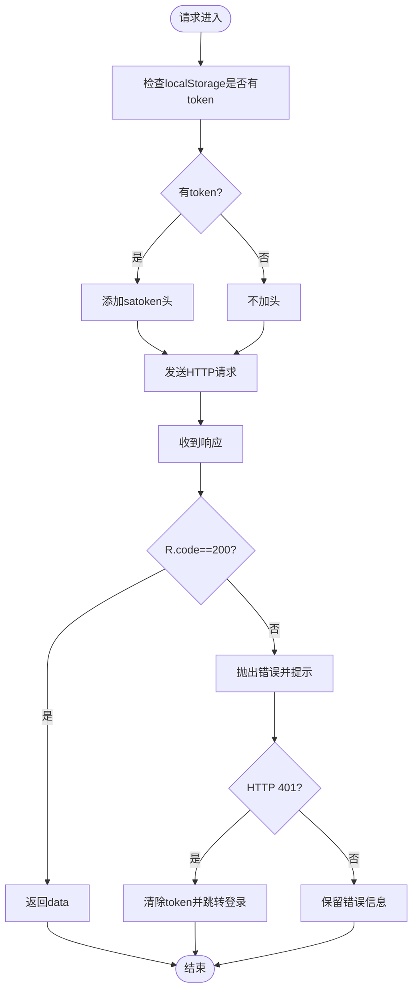
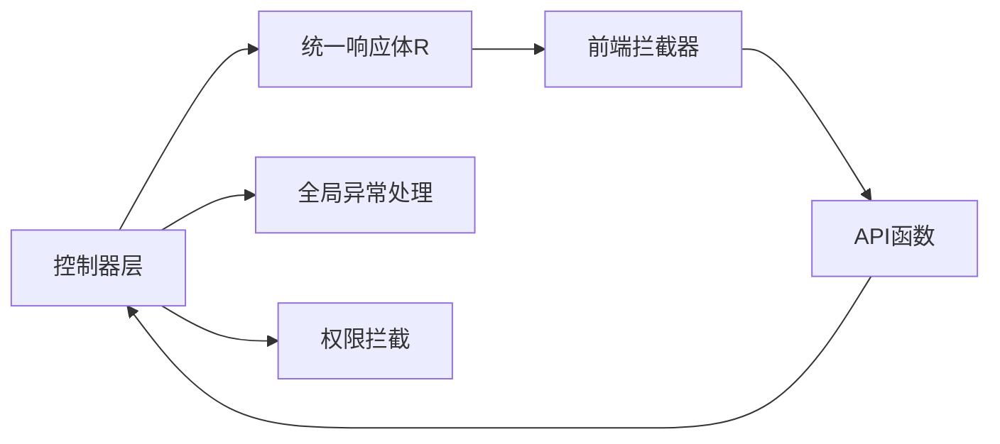

# API接口测试

<cite>
**本文引用的文件**
- [ApprovalController.java](file://oa-approval/src/main/java/com/oa/admin/approval/controller/ApprovalController.java)
- [AuthController.java](file://oa-system/src/main/java/com/oa/admin/system/controller/AuthController.java)
- [LeaveRequestController.java](file://oa-leave/src/main/java/com/oa/admin/leave/controller/LeaveRequestController.java)
- [R.java](file://oa-common/src/main/java/com/oa/admin/common/result/R.java)
- [GlobalExceptionHandler.java](file://oa-common/src/main/java/com/oa/admin/common/exception/GlobalExceptionHandler.java)
- [ErrorCode.java](file://oa-common/src/main/java/com/oa/admin/common/result/ErrorCode.java)
- [SaTokenConfig.java](file://oa-system/src/main/java/com/oa/admin/system/config/SaTokenConfig.java)
- [approval.ts](file://oa-ui/src/api/approval.ts)
- [auth.ts](file://oa-ui/src/api/auth.ts)
- [request.ts](file://oa-ui/src/utils/request.ts)
- [approval.test.ts](file://oa-ui/src/api/approval.test.ts)
- [request.test.ts](file://oa-ui/src/utils/request.test.ts)
- [AuthServiceTest.java](file://oa-system/src/test/java/com/oa/admin/system/service/AuthServiceTest.java)
- [ApprovalServiceTest.java](file://oa-approval/src/test/java/com/oa/admin/approval/service/ApprovalServiceTest.java)
- [pom.xml](file://pom.xml)
</cite>

## 目录
1. [简介](#简介)
2. [项目结构](#项目结构)
3. [核心组件](#核心组件)
4. [架构总览](#架构总览)
5. [详细组件分析](#详细组件分析)
6. [依赖分析](#依赖分析)
7. [性能考虑](#性能考虑)
8. [故障排查指南](#故障排查指南)
9. [结论](#结论)
10. [附录](#附录)

## 简介
本文件面向OA审批管理系统的API接口测试，提供从策略到落地的完整指导。内容覆盖：
- 手动测试（Postman、Insomnia）与自动化测试（Cypress、Playwright）的实施路径
- 请求构造、响应验证、状态码检查、数据格式验证等核心测试要素
- 针对认证授权、CRUD、分页查询、错误处理等场景的具体测试用例设计
- 断言策略与数据驱动测试的实现思路
- 持续集成中的测试自动化流水线搭建建议
- 前后端开发者在测试数据准备、Mock服务、测试环境配置等方面的最佳实践

## 项目结构
系统采用多模块Maven工程组织，API层主要分布在以下模块：
- 认证鉴权：oa-system（登录、登出、当前用户）
- 审批流程：oa-approval（提交、审批、任务、实例、模板、抄送、仪表盘）
- 请假模块：oa-leave（请假申请CRUD）
- 公共层：oa-common（统一响应体、全局异常、错误码）
- 前端：oa-ui（Axios封装、API函数、单元测试）

图表来源
- [pom.xml:21-28](file://pom.xml#L21-L28)
- [AuthController.java:14-37](file://oa-system/src/main/java/com/oa/admin/system/controller/AuthController.java#L14-L37)
- [ApprovalController.java:29-252](file://oa-approval/src/main/java/com/oa/admin/approval/controller/ApprovalController.java#L29-L252)
- [LeaveRequestController.java:18-68](file://oa-leave/src/main/java/com/oa/admin/leave/controller/LeaveRequestController.java#L18-L68)
- [R.java:9-44](file://oa-common/src/main/java/com/oa/admin/common/result/R.java#L9-L44)
- [GlobalExceptionHandler.java:19-74](file://oa-common/src/main/java/com/oa/admin/common/exception/GlobalExceptionHandler.java#L19-L74)

章节来源
- [pom.xml:21-28](file://pom.xml#L21-L28)

## 核心组件
- 统一响应体与错误码
  - 统一响应体R封装了业务返回结构，包含状态码、消息、数据与时间戳
  - 错误码ErrorCode定义了系统、认证、审批等领域的错误类型与含义
- 全局异常处理
  - GlobalExceptionHandler将未登录、权限不足、参数校验失败、业务异常等映射为统一响应
- 权限拦截
  - SaTokenConfig对/api/v1/**路径启用登录拦截，开放登录/注册端点
- 控制器层
  - 审批API：提交、审批、任务列表、实例详情、模板CRUD、抄送等
  - 认证API：登录、登出、当前用户
  - 请假API：列表、详情、新增、更新、删除、提交审批、重审

章节来源
- [R.java:9-44](file://oa-common/src/main/java/com/oa/admin/common/result/R.java#L9-L44)
- [ErrorCode.java:11-45](file://oa-common/src/main/java/com/oa/admin/common/result/ErrorCode.java#L11-L45)
- [GlobalExceptionHandler.java:19-74](file://oa-common/src/main/java/com/oa/admin/common/exception/GlobalExceptionHandler.java#L19-L74)
- [SaTokenConfig.java:13-25](file://oa-system/src/main/java/com/oa/admin/system/config/SaTokenConfig.java#L13-L25)
- [ApprovalController.java:29-252](file://oa-approval/src/main/java/com/oa/admin/approval/controller/ApprovalController.java#L29-L252)
- [AuthController.java:14-37](file://oa-system/src/main/java/com/oa/admin/system/controller/AuthController.java#L14-L37)
- [LeaveRequestController.java:18-68](file://oa-leave/src/main/java/com/oa/admin/leave/controller/LeaveRequestController.java#L18-L68)

## 架构总览
API测试需要覆盖从前端请求封装到后端控制器、权限拦截、服务层与数据库的全链路。

图表来源
- [request.ts:5-42](file://oa-ui/src/utils/request.ts#L5-L42)
- [AuthController.java:20-36](file://oa-system/src/main/java/com/oa/admin/system/controller/AuthController.java#L20-L36)
- [ApprovalController.java:37-133](file://oa-approval/src/main/java/com/oa/admin/approval/controller/ApprovalController.java#L37-L133)
- [SaTokenConfig.java:16-22](file://oa-system/src/main/java/com/oa/admin/system/config/SaTokenConfig.java#L16-L22)

## 详细组件分析

### 认证与授权测试
- 测试要点
  - 登录成功返回token与用户信息；失败场景返回相应错误码
  - 未登录访问受保护接口应被拦截并返回过期错误
  - 当前用户信息接口需脱敏返回
- 接口清单
  - POST /api/v1/auth/login
  - POST /api/v1/auth/logout
  - GET /api/v1/auth/me
- 断言策略
  - 成功：状态码200，响应体R.code=200，R.data包含token与用户
  - 失败：根据GlobalExceptionHandler映射具体错误码
- 数据驱动
  - 用户名/密码组合、预期错误码、是否需要token

图表来源
- [AuthController.java:20-36](file://oa-system/src/main/java/com/oa/admin/system/controller/AuthController.java#L20-L36)
- [AuthServiceTest.java:46-101](file://oa-system/src/test/java/com/oa/admin/system/service/AuthServiceTest.java#L46-L101)
- [GlobalExceptionHandler.java:23-39](file://oa-common/src/main/java/com/oa/admin/common/exception/GlobalExceptionHandler.java#L23-L39)

章节来源
- [AuthController.java:20-36](file://oa-system/src/main/java/com/oa/admin/system/controller/AuthController.java#L20-L36)
- [AuthServiceTest.java:46-101](file://oa-system/src/test/java/com/oa/admin/system/service/AuthServiceTest.java#L46-L101)
- [GlobalExceptionHandler.java:23-39](file://oa-common/src/main/java/com/oa/admin/common/exception/GlobalExceptionHandler.java#L23-L39)

### 审批流程API测试
- 测试要点
  - 提交审批：校验模板存在、表单数据解析、流程启动、实例创建
  - 审批任务：校验任务存在、处理人身份、重复审批、审批结果传递给流程引擎
  - 任务转办：校验原处理人、目标用户有效性、流程引擎指派
  - 撤回申请：校验申请人身份、实例状态、是否存在已处理任务
  - 分页查询：标题/状态过滤、分页参数、总数一致性
  - 实例详情与流程图：历史活动与当前任务聚合
  - 抄送管理：我的抄送列表、标记已读
  - 仪表盘统计：待办/已办/模板数/未读抄送/最近动态
- 接口清单
  - POST /api/v1/approval/submit
  - POST /api/v1/approval/task/{taskId}/approve
  - POST /api/v1/approval/task/{taskId}/transfer
  - POST /api/v1/approval/{instanceId}/withdraw
  - GET /api/v1/approval/my-todo
  - GET /api/v1/approval/my-done
  - GET /api/v1/approval/my-todo/paged
  - GET /api/v1/approval/my-done/paged
  - GET /api/v1/approval/my-applications
  - GET /api/v1/approval/instance/{instanceId}
  - GET /api/v1/approval/instance/{instanceId}/tasks
  - GET /api/v1/approval/instance/{instanceId}/diagram
  - GET /api/v1/approval/dashboard/stats
  - 模板CRUD与流程XML/节点配置
  - GET/POST /api/v1/approval/cc
  - POST /api/v1/approval/cc/{ccId}/read
- 断言策略
  - 成功：R.code=200，R.data符合模型结构
  - 参数错误：R.code=1002（参数校验失败）
  - 业务异常：按ErrorCode映射（如模板不存在、任务已处理、禁止访问等）
  - 权限不足：R.code=2002（无权限访问），或403
- 数据驱动
  - 模板ID、任务ID、实例ID、用户ID、表单数据、分页参数、过滤条件

图表来源
- [ApprovalController.java:37-44](file://oa-approval/src/main/java/com/oa/admin/approval/controller/ApprovalController.java#L37-L44)
- [ApprovalServiceTest.java:140-172](file://oa-approval/src/test/java/com/oa/admin/approval/service/ApprovalServiceTest.java#L140-L172)

章节来源
- [ApprovalController.java:37-228](file://oa-approval/src/main/java/com/oa/admin/approval/controller/ApprovalController.java#L37-L228)
- [ApprovalServiceTest.java:140-325](file://oa-approval/src/test/java/com/oa/admin/approval/service/ApprovalServiceTest.java#L140-L325)

### 请假申请API测试
- 测试要点
  - 列表分页：查询DTO参数绑定、分页结果
  - 详情：ID存在性校验
  - 新增/更新/删除：权限校验与业务约束
  - 提交审批/重审：流转到审批流程
- 接口清单
  - GET /api/v1/leave/leave_request
  - GET /api/v1/leave/leave_request/{id}
  - POST /api/v1/leave/leave_request
  - PUT /api/v1/leave/leave_request/{id}
  - DELETE /api/v1/leave/leave_request/{id}
  - POST /api/v1/leave/leave_request/{id}/submit
  - POST /api/v1/leave/leave_request/{id}/resubmit
- 断言策略
  - 成功：R.code=200，数据结构正确
  - 参数/权限/业务异常：对应错误码

章节来源
- [LeaveRequestController.java:25-66](file://oa-leave/src/main/java/com/oa/admin/leave/controller/LeaveRequestController.java#L25-L66)

### 前端API与拦截器测试
- 测试要点
  - API函数调用路径与参数透传
  - Axios拦截器：基础URL、超时、satoken头注入
  - 响应拦截：业务码200才返回data，否则抛错并处理401跳转
- 断言策略
  - GET/POST调用路径与params一致
  - 请求头包含satoken
  - 成功返回data，失败抛Promise.reject并触发消息提示

图表来源
- [request.ts:10-39](file://oa-ui/src/utils/request.ts#L10-L39)
- [request.test.ts:51-97](file://oa-ui/src/utils/request.test.ts#L51-L97)
- [approval.test.ts:18-152](file://oa-ui/src/api/approval.test.ts#L18-L152)

章节来源
- [request.ts:5-42](file://oa-ui/src/utils/request.ts#L5-L42)
- [request.test.ts:51-106](file://oa-ui/src/utils/request.test.ts#L51-L106)
- [approval.test.ts:18-152](file://oa-ui/src/api/approval.test.ts#L18-L152)

## 依赖分析
- 统一响应与异常
  - R作为所有控制器返回的载体，前端通过响应拦截器统一处理
  - GlobalExceptionHandler将各类异常映射为业务错误码，便于测试断言
- 权限控制
  - SaTokenConfig对/api/v1/**启用拦截，除登录/注册外均需登录
- 前后端契约
  - 前端API函数与后端控制器路径一一对应，便于手工与自动化测试对照

图表来源
- [R.java:21-42](file://oa-common/src/main/java/com/oa/admin/common/result/R.java#L21-L42)
- [GlobalExceptionHandler.java:41-72](file://oa-common/src/main/java/com/oa/admin/common/exception/GlobalExceptionHandler.java#L41-L72)
- [SaTokenConfig.java:16-22](file://oa-system/src/main/java/com/oa/admin/system/config/SaTokenConfig.java#L16-L22)
- [request.ts:18-39](file://oa-ui/src/utils/request.ts#L18-L39)

章节来源
- [R.java:21-42](file://oa-common/src/main/java/com/oa/admin/common/result/R.java#L21-L42)
- [GlobalExceptionHandler.java:41-72](file://oa-common/src/main/java/com/oa/admin/common/exception/GlobalExceptionHandler.java#L41-L72)
- [SaTokenConfig.java:16-22](file://oa-system/src/main/java/com/oa/admin/system/config/SaTokenConfig.java#L16-L22)
- [request.ts:18-39](file://oa-ui/src/utils/request.ts#L18-L39)

## 性能考虑
- 响应体压缩与缓存：后端可启用Gzip，前端避免重复请求相同数据
- 分页参数优化：合理设置page/pageSize，避免超大分页导致数据库压力
- 并发测试：对高频接口（如仪表盘、任务列表）进行并发压测，观察R.code与响应时间
- 日志与追踪：为关键接口增加traceId，便于定位慢请求

## 故障排查指南
- 401/403常见原因
  - 未登录或token过期：检查前端localStorage中token是否存在与有效
  - 权限不足：确认用户角色/权限点是否具备对应操作权限
- 参数校验失败
  - 字段缺失或类型不符：查看GlobalExceptionHandler对MethodArgumentNotValidException的映射
- 业务异常
  - 模板不存在、任务已处理、禁止访问等：依据ErrorCode枚举定位问题
- 前端拦截器
  - 未正确添加satoken头：检查localStorage与请求拦截器逻辑
  - 401自动跳转：确认路由与本地存储清理逻辑

章节来源
- [GlobalExceptionHandler.java:23-72](file://oa-common/src/main/java/com/oa/admin/common/exception/GlobalExceptionHandler.java#L23-L72)
- [ErrorCode.java:11-45](file://oa-common/src/main/java/com/oa/admin/common/result/ErrorCode.java#L11-L45)
- [request.ts:10-39](file://oa-ui/src/utils/request.ts#L10-L39)

## 结论
本测试文档提供了从策略到落地的全流程指导。通过结合手动与自动化测试、统一的断言与数据驱动方法、以及完善的异常与权限处理，能够有效保障OA审批管理系统的API质量与稳定性。建议在CI中集成自动化测试流水线，确保每次变更都能快速反馈风险。

## 附录

### API测试策略与方法
- 手动测试（Postman/Insomnia）
  - 使用集合与环境变量管理不同环境（开发/测试/预发）
  - 在Pre-request Script中生成/注入token，Tests中断言R.code与关键字段
  - 对分页接口使用不同page/pageSize组合验证边界
- 自动化测试（Cypress/Playwright）
  - 基于前端API函数与拦截器编写端到端用例
  - 使用Mock隔离外部依赖，聚焦业务逻辑验证
  - 将测试数据准备与清理封装为fixtures与beforeEach/afterEach钩子

### 断言策略与数据驱动
- 断言维度
  - 状态码：200、401、403、400、500
  - 响应体：R.code=200且R.data非空；错误场景R.code对应ErrorCode
  - 数据结构：字段存在性、类型、长度、范围
- 数据驱动
  - 使用CSV/JSON fixtures承载测试数据
  - 参数化测试用例，覆盖正常、边界、异常三类场景

### 持续集成配置建议
- 测试阶段
  - Maven测试：mvn test（后端）
  - Vitest/Cypress：npm run test（前端）
- 环境准备
  - 使用Docker Compose拉起数据库与Redis（如需）
  - 配置不同环境的application.yml与.env
- 报告与门禁
  - 生成测试报告（JUnit/Jest报告），在CI中作为门禁指标
  - 失败即阻断发布，确保质量门槛