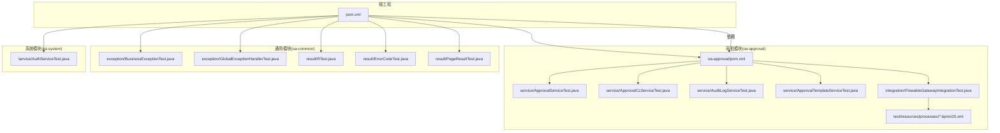
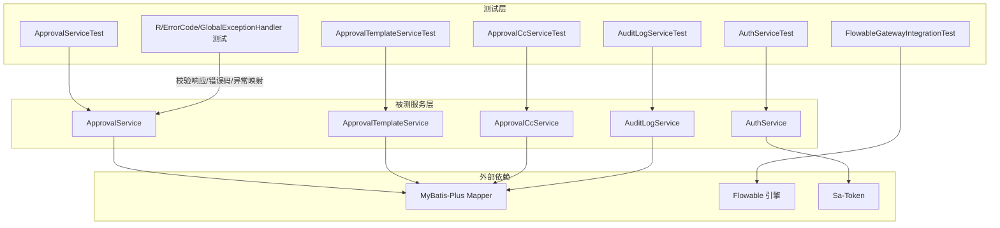
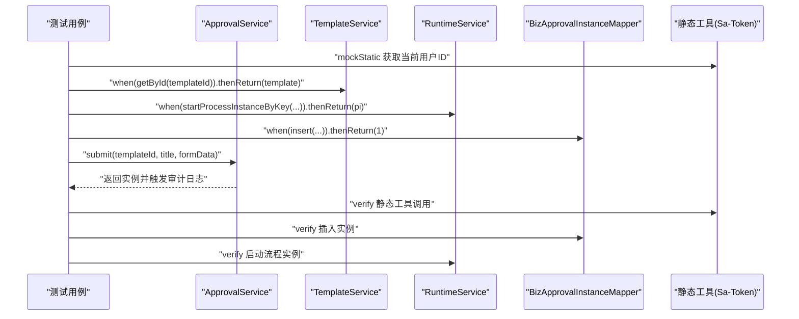
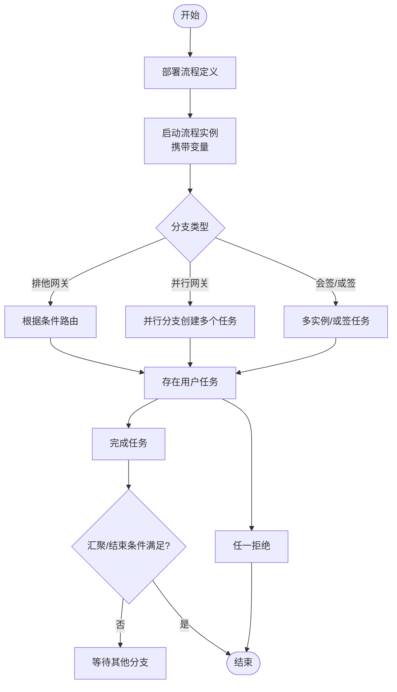
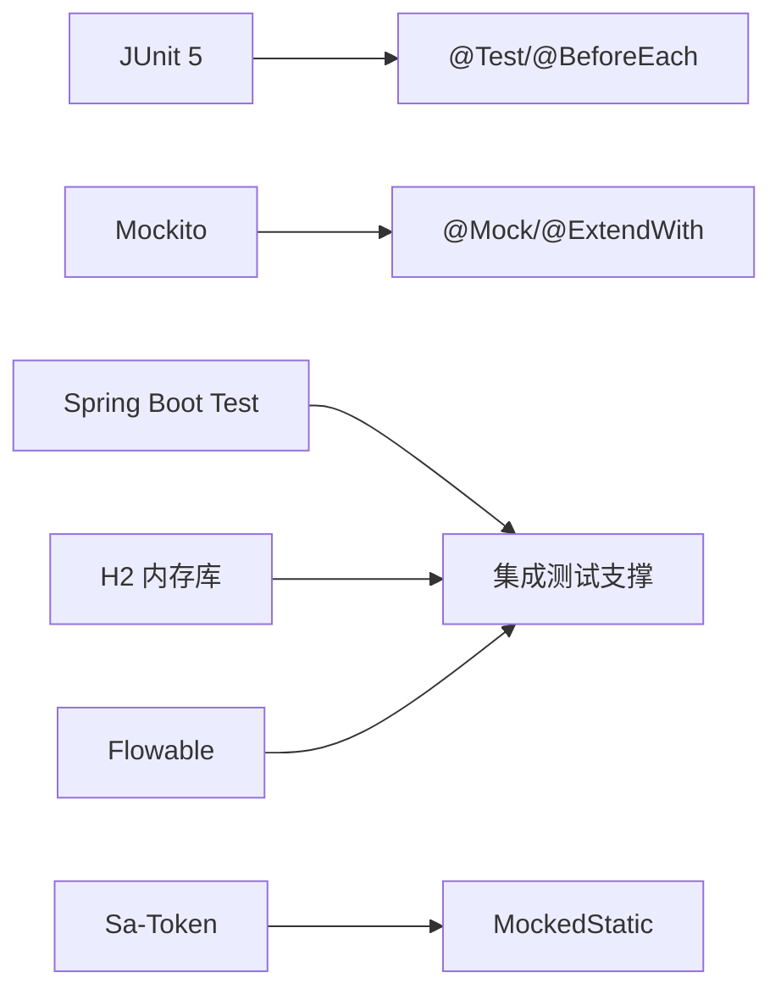

# 单元测试

<cite>
**本文引用的文件**
- [pom.xml](file://pom.xml)
- [oa-approval/pom.xml](file://oa-approval/pom.xml)
- [ApprovalServiceTest.java](file://oa-approval/src/test/java/com/oa/admin/approval/service/ApprovalServiceTest.java)
- [ApprovalCcServiceTest.java](file://oa-approval/src/test/java/com/oa/admin/approval/service/ApprovalCcServiceTest.java)
- [AuditLogServiceTest.java](file://oa-approval/src/test/java/com/oa/admin/approval/service/AuditLogServiceTest.java)
- [ApprovalTemplateServiceTest.java](file://oa-approval/src/test/java/com/oa/admin/approval/service/ApprovalTemplateServiceTest.java)
- [FlowableGatewayIntegrationTest.java](file://oa-approval/src/test/java/com/oa/admin/approval/integration/FlowableGatewayIntegrationTest.java)
- [leave_request.bpmn20.xml](file://oa-approval/src/test/resources/processes/leave_request.bpmn20.xml)
- [BusinessExceptionTest.java](file://oa-common/src/test/java/com/oa/admin/common/exception/BusinessExceptionTest.java)
- [GlobalExceptionHandlerTest.java](file://oa-common/src/test/java/com/oa/admin/common/exception/GlobalExceptionHandlerTest.java)
- [RTest.java](file://oa-common/src/test/java/com/oa/admin/common/result/RTest.java)
- [ErrorCodeTest.java](file://oa-common/src/test/java/com/oa/admin/common/result/ErrorCodeTest.java)
- [PageResultTest.java](file://oa-common/src/test/java/com/oa/admin/common/result/PageResultTest.java)
- [AuthServiceTest.java](file://oa-system/src/test/java/com/oa/admin/system/service/AuthServiceTest.java)
</cite>

## 目录
1. [引言](#引言)
2. [项目结构](#项目结构)
3. [核心组件](#核心组件)
4. [架构总览](#架构总览)
5. [详细组件分析](#详细组件分析)
6. [依赖分析](#依赖分析)
7. [性能考虑](#性能考虑)
8. [故障排查指南](#故障排查指南)
9. [结论](#结论)
10. [附录](#附录)

## 引言
本文件面向OA审批管理系统，系统性梳理单元测试的设计原则与最佳实践，结合仓库中已有的Junit 5与Mockito测试用例，总结测试金字塔中的单元测试策略，并给出Mock对象创建、行为验证、参数匹配、测试数据准备与清理、异常处理、边界条件、覆盖率测量与提升等实操建议。目标是帮助开发者编写高质量、可维护、可扩展的单元测试。

## 项目结构
本项目采用多模块Maven结构，单元测试主要分布在以下模块：
- oa-common：通用结果封装、异常与全局处理器的单元测试
- oa-system：认证授权服务的单元测试
- oa-approval：审批流程服务、模板、抄送、审计日志等服务的单元测试；以及基于嵌入式Flowable引擎的集成测试
- oa-app：种子数据与流程资源（用于测试）

图表来源
- [pom.xml:21-28](file://pom.xml#L21-L28)
- [oa-approval/pom.xml:14-47](file://oa-approval/pom.xml#L14-L47)
- [ApprovalServiceTest.java:1-802](file://oa-approval/src/test/java/com/oa/admin/approval/service/ApprovalServiceTest.java#L1-L802)
- [ApprovalCcServiceTest.java:1-166](file://oa-approval/src/test/java/com/oa/admin/approval/service/ApprovalCcServiceTest.java#L1-L166)
- [AuditLogServiceTest.java:1-77](file://oa-approval/src/test/java/com/oa/admin/approval/service/AuditLogServiceTest.java#L1-L77)
- [ApprovalTemplateServiceTest.java:1-167](file://oa-approval/src/test/java/com/oa/admin/approval/service/ApprovalTemplateServiceTest.java#L1-L167)
- [FlowableGatewayIntegrationTest.java:1-270](file://oa-approval/src/test/java/com/oa/admin/approval/integration/FlowableGatewayIntegrationTest.java#L1-L270)
- [leave_request.bpmn20.xml:1-30](file://oa-approval/src/test/resources/processes/leave_request.bpmn20.xml#L1-L30)
- [BusinessExceptionTest.java:1-47](file://oa-common/src/test/java/com/oa/admin/common/exception/BusinessExceptionTest.java#L1-L47)
- [GlobalExceptionHandlerTest.java:1-69](file://oa-common/src/test/java/com/oa/admin/common/exception/GlobalExceptionHandlerTest.java#L1-L69)
- [RTest.java:1-74](file://oa-common/src/test/java/com/oa/admin/common/result/RTest.java#L1-L74)
- [ErrorCodeTest.java:1-53](file://oa-common/src/test/java/com/oa/admin/common/result/ErrorCodeTest.java#L1-L53)
- [PageResultTest.java:1-40](file://oa-common/src/test/java/com/oa/admin/common/result/PageResultTest.java#L1-L40)
- [AuthServiceTest.java:1-103](file://oa-system/src/test/java/com/oa/admin/system/service/AuthServiceTest.java#L1-L103)

章节来源
- [pom.xml:21-28](file://pom.xml#L21-L28)
- [oa-approval/pom.xml:14-47](file://oa-approval/pom.xml#L14-L47)

## 核心组件
本节聚焦于单元测试中体现的核心组件与职责，以及测试覆盖到的关键领域：
- 审批服务：提交、审批、撤回、待办/已办、应用列表、实例详情、流程图、仪表盘统计、抄送、转办等
- 模板服务：草稿保存、发布、版本新建、节点配置读取、取消发布
- 抄送服务：我的抄送、标记已读、批量创建
- 审计日志服务：审计记录持久化
- 系统认证服务：登录、登出、当前用户查询
- 通用模块：统一响应体、错误码、全局异常处理

章节来源
- [ApprovalServiceTest.java:140-800](file://oa-approval/src/test/java/com/oa/admin/approval/service/ApprovalServiceTest.java#L140-L800)
- [ApprovalTemplateServiceTest.java:56-166](file://oa-approval/src/test/java/com/oa/admin/approval/service/ApprovalTemplateServiceTest.java#L56-L166)
- [ApprovalCcServiceTest.java:61-165](file://oa-approval/src/test/java/com/oa/admin/approval/service/ApprovalCcServiceTest.java#L61-L165)
- [AuditLogServiceTest.java:51-76](file://oa-approval/src/test/java/com/oa/admin/approval/service/AuditLogServiceTest.java#L51-L76)
- [AuthServiceTest.java:46-101](file://oa-system/src/test/java/com/oa/admin/system/service/AuthServiceTest.java#L46-L101)
- [RTest.java:12-73](file://oa-common/src/test/java/com/oa/admin/common/result/RTest.java#L12-L73)
- [ErrorCodeTest.java:12-52](file://oa-common/src/test/java/com/oa/admin/common/result/ErrorCodeTest.java#L12-L52)
- [GlobalExceptionHandlerTest.java:25-68](file://oa-common/src/test/java/com/oa/admin/common/exception/GlobalExceptionHandlerTest.java#L25-L68)

## 架构总览
下图展示了单元测试在系统中的位置与交互关系，突出Mockito对真实外部依赖（数据库、流程引擎、鉴权）的隔离作用，以及测试金字塔中“单元层”测试的定位。

图表来源
- [ApprovalServiceTest.java:64-98](file://oa-approval/src/test/java/com/oa/admin/approval/service/ApprovalServiceTest.java#L64-L98)
- [ApprovalTemplateServiceTest.java:29-38](file://oa-approval/src/test/java/com/oa/admin/approval/service/ApprovalTemplateServiceTest.java#L29-L38)
- [ApprovalCcServiceTest.java:32-43](file://oa-approval/src/test/java/com/oa/admin/approval/service/ApprovalCcServiceTest.java#L32-L43)
- [AuditLogServiceTest.java:25-34](file://oa-approval/src/test/java/com/oa/admin/approval/service/AuditLogServiceTest.java#L25-L34)
- [AuthServiceTest.java:28-35](file://oa-system/src/test/java/com/oa/admin/system/service/AuthServiceTest.java#L28-L35)
- [FlowableGatewayIntegrationTest.java:21-43](file://oa-approval/src/test/java/com/oa/admin/approval/integration/FlowableGatewayIntegrationTest.java#L21-L43)

## 详细组件分析

### 审批服务单元测试分析
- 设计原则
  - 使用Mockito隔离数据库与流程引擎，通过@ExtendWith(MockitoExtension.class)启用字段注入
  - 使用@Mock声明外部依赖，如模板服务、任务/实例Mapper、RuntimeService、TaskService、HistoryService、RepositoryService、审计日志服务、通知服务
  - 使用@BeforeEach初始化被测对象与“基类mapper”注入（通过反射设置baseMapper）
  - 使用MockedStatic模拟静态工具（如登录态），确保测试隔离
- 关键测试场景
  - 异常路径：模板不存在、任务不存在、重复审批、非当前处理人、实例不存在/不可撤回、转办权限不足等
  - 正向路径：提交成功、审批通过/拒绝、变量透传、撤回成功、待办/已办、分页查询、实例详情、流程图解析、仪表盘聚合、审计日志落库、转办重分配
  - 边界条件：空结果、空过滤条件、空表单、null细节
- 参数匹配与行为验证
  - 使用eq、any、anyString、anyMap、argThat进行精确匹配与复杂断言
  - 使用verify、never、times进行调用次数与参数验证
- 数据准备与清理
  - 构造测试实体（模板、任务、实例、流程定义等）
  - 使用Mock返回期望值，避免真实数据库写入
  - 使用try-with-resources清理静态Mock

图表来源
- [ApprovalServiceTest.java:140-172](file://oa-approval/src/test/java/com/oa/admin/approval/service/ApprovalServiceTest.java#L140-L172)
- [ApprovalServiceTest.java:684-706](file://oa-approval/src/test/java/com/oa/admin/approval/service/ApprovalServiceTest.java#L684-L706)

章节来源
- [ApprovalServiceTest.java:35-104](file://oa-approval/src/test/java/com/oa/admin/approval/service/ApprovalServiceTest.java#L35-L104)
- [ApprovalServiceTest.java:140-800](file://oa-approval/src/test/java/com/oa/admin/approval/service/ApprovalServiceTest.java#L140-L800)

### 模板服务单元测试分析
- 关键测试场景
  - 草稿保存：状态为草稿
  - 发布：部署流程定义、更新状态、版本号+1、持久化已发布BPMN
  - 已发布重复发布、无BPMN XML发布：抛出业务异常
  - 新建版本：克隆已发布模板为新草稿
  - 节点配置读取：按模板ID查询节点配置
  - 取消发布：回到草稿状态
- 参数匹配与行为验证
  - 使用any、eq、assertThat组合断言返回值字段
  - 使用verify断言部署与更新操作

章节来源
- [ApprovalTemplateServiceTest.java:56-166](file://oa-approval/src/test/java/com/oa/admin/approval/service/ApprovalTemplateServiceTest.java#L56-L166)

### 抄送服务单元测试分析
- 关键测试场景
  - 我的抄送：按当前用户查询
  - 标记已读：仅允许本人修改且未读时更新
  - 批量创建：对每个接收人创建抄送条目
- 参数匹配与行为验证
  - 使用LambdaQueryWrapper匹配条件
  - 使用times/never控制插入次数

章节来源
- [ApprovalCcServiceTest.java:61-165](file://oa-approval/src/test/java/com/oa/admin/approval/service/ApprovalCcServiceTest.java#L61-L165)

### 审计日志服务单元测试分析
- 关键测试场景
  - 日志持久化：无论详情是否为空均能入库
- 参数匹配与行为验证
  - 使用any匹配任意审计实体

章节来源
- [AuditLogServiceTest.java:51-76](file://oa-approval/src/test/java/com/oa/admin/approval/service/AuditLogServiceTest.java#L51-L76)

### 认证服务单元测试分析
- 关键测试场景
  - 登录：用户不存在/禁用抛出业务异常
  - 登出：调用静态工具logout
  - 当前用户：返回用户信息但不包含敏感字段
- 参数匹配与行为验证
  - 使用MockedStatic验证静态调用
  - 使用assertThrows断言异常类型与码值

章节来源
- [AuthServiceTest.java:46-101](file://oa-system/src/test/java/com/oa/admin/system/service/AuthServiceTest.java#L46-L101)

### 通用模块单元测试分析
- 统一响应体R：成功/失败、带数据/空数据、时间戳范围
- 错误码：范围校验、唯一性
- 全局异常处理器：不同异常映射到统一响应码

章节来源
- [RTest.java:12-73](file://oa-common/src/test/java/com/oa/admin/common/result/RTest.java#L12-L73)
- [ErrorCodeTest.java:12-52](file://oa-common/src/test/java/com/oa/admin/common/result/ErrorCodeTest.java#L12-L52)
- [GlobalExceptionHandlerTest.java:25-68](file://oa-common/src/test/java/com/oa/admin/common/exception/GlobalExceptionHandlerTest.java#L25-L68)

### 集成测试分析（Flowable网关）
- 目标：验证BPMN网关（排他/并行/会签/或签）与拒绝路径在嵌入式引擎中的行为
- 方法：使用H2内存数据库与StandaloneProcessEngineConfiguration，部署测试流程，启动流程实例，断言任务数量与流程生命周期
- 关键断言：分支并发、汇聚等待、任一审批早结束、全部审批完成、拒绝终止

图表来源
- [FlowableGatewayIntegrationTest.java:108-268](file://oa-approval/src/test/java/com/oa/admin/approval/integration/FlowableGatewayIntegrationTest.java#L108-L268)
- [leave_request.bpmn20.xml:6-28](file://oa-approval/src/test/resources/processes/leave_request.bpmn20.xml#L6-L28)

章节来源
- [FlowableGatewayIntegrationTest.java:26-86](file://oa-approval/src/test/java/com/oa/admin/approval/integration/FlowableGatewayIntegrationTest.java#L26-L86)
- [leave_request.bpmn20.xml:1-30](file://oa-approval/src/test/resources/processes/leave_request.bpmn20.xml#L1-L30)

## 依赖分析
- JUnit 5：所有测试类使用@Test、@BeforeEach、@ExtendWith等
- Mockito：@Mock、@InjectMocks替代方案（通过反射注入baseMapper）、when/verify/argument matchers
- Spring Boot Test：提供测试starter，便于集成测试与嵌入式引擎
- H2：集成测试使用内存数据库
- Sa-Token：静态工具Mock以隔离登录态
- Flowable：集成测试使用嵌入式引擎与流程资源

图表来源
- [pom.xml:44-113](file://pom.xml#L44-L113)
- [oa-approval/pom.xml:38-47](file://oa-approval/pom.xml#L38-L47)
- [ApprovalServiceTest.java:35-40](file://oa-approval/src/test/java/com/oa/admin/approval/service/ApprovalServiceTest.java#L35-L40)
- [FlowableGatewayIntegrationTest.java:26-43](file://oa-approval/src/test/java/com/oa/admin/approval/integration/FlowableGatewayIntegrationTest.java#L26-L43)

章节来源
- [pom.xml:44-113](file://pom.xml#L44-L113)
- [oa-approval/pom.xml:38-47](file://oa-approval/pom.xml#L38-L47)

## 性能考虑
- 单元测试应避免I/O与外部依赖，优先使用Mock与内存数据源
- 对于需要真实引擎的行为验证，采用集成测试模块，保持单元测试轻量
- 复用测试数据构造器，减少重复代码与对象创建开销
- 使用参数化测试（如需扩展）时，注意测试粒度与执行时间

## 故障排查指南
- 常见问题
  - baseMapper未注入导致空指针：通过反射注入baseMapper
  - 静态工具影响测试隔离：使用MockedStatic包裹
  - 参数匹配不准确：使用argThat进行复杂断言
  - 集成测试失败：检查流程资源路径与Bean注册
- 排查步骤
  - 缩小用例范围，逐步注释verify/assert
  - 打印关键入参与返回值（在允许范围内）
  - 校验when/verify配对，避免遗漏或多余断言

章节来源
- [ApprovalServiceTest.java:106-119](file://oa-approval/src/test/java/com/oa/admin/approval/service/ApprovalServiceTest.java#L106-L119)
- [AuthServiceTest.java:66-72](file://oa-system/src/test/java/com/oa/admin/system/service/AuthServiceTest.java#L66-L72)
- [FlowableGatewayIntegrationTest.java:88-93](file://oa-approval/src/test/java/com/oa/admin/approval/integration/FlowableGatewayIntegrationTest.java#L88-L93)

## 结论
本项目的单元测试遵循测试金字塔，以Mockito驱动的单元测试为核心，配合通用模块的契约测试与流程引擎的集成测试，形成从服务到流程的完整测试体系。通过规范的Mock策略、参数匹配与行为验证、静态工具隔离与测试数据构造，有效保障了业务逻辑的正确性与可维护性。

## 附录

### JUnit 5与Mockito使用要点
- 注解与生命周期
  - @ExtendWith(MockitoExtension.class)：启用字段注入
  - @BeforeEach：初始化被测对象与依赖
  - @Test：单测入口
- Mock对象与验证
  - @Mock：声明依赖
  - when(...).thenReturn(...)：行为定义
  - verify(...).xxx(...)：行为验证
  - ArgumentMatchers：eq、any、anyString、anyMap、argThat
- 静态工具隔离
  - MockedStatic：包装静态调用，如登录态工具

章节来源
- [ApprovalServiceTest.java:35-56](file://oa-approval/src/test/java/com/oa/admin/approval/service/ApprovalServiceTest.java#L35-L56)
- [AuthServiceTest.java:10-20](file://oa-system/src/test/java/com/oa/admin/system/service/AuthServiceTest.java#L10-L20)

### 测试数据准备与清理策略
- 准备
  - 构造实体对象（模板、任务、实例、流程定义）
  - 使用Mock返回期望值，避免真实数据库写入
- 清理
  - 使用try-with-resources清理静态Mock
  - 在@AfterEach中释放临时资源（如集成测试）

章节来源
- [ApprovalServiceTest.java:121-138](file://oa-approval/src/test/java/com/oa/admin/approval/service/ApprovalServiceTest.java#L121-L138)
- [AuthServiceTest.java:33-35](file://oa-system/src/test/java/com/oa/admin/system/service/AuthServiceTest.java#L33-L35)

### 异常处理测试与边界条件
- 异常处理
  - 断言BusinessException及其错误码
  - 全局异常处理器对不同异常的映射
- 边界条件
  - 空结果、空过滤、空表单、null细节
  - 分页边界、权限边界

章节来源
- [BusinessExceptionTest.java:13-45](file://oa-common/src/test/java/com/oa/admin/common/exception/BusinessExceptionTest.java#L13-L45)
- [GlobalExceptionHandlerTest.java:25-68](file://oa-common/src/test/java/com/oa/admin/common/exception/GlobalExceptionHandlerTest.java#L25-L68)
- [ApprovalServiceTest.java:280-344](file://oa-approval/src/test/java/com/oa/admin/approval/service/ApprovalServiceTest.java#L280-L344)
- [ApprovalCcServiceTest.java:113-141](file://oa-approval/src/test/java/com/oa/admin/approval/service/ApprovalCcServiceTest.java#L113-L141)

### 测试覆盖率与JaCoCo配置
- 覆盖率要求建议
  - 单元测试：核心业务逻辑行覆盖率≥80%，分支覆盖率≥60%
  - 集成测试：流程关键路径与异常路径全覆盖
- JaCoCo配置与报告
  - 在根工程pom中添加JaCoCo插件，配置includes/excludes与输出目录
  - mvn clean test jacoco:report 生成HTML报告
  - CI中设置覆盖率阈值，失败则阻断合并
- 实践建议
  - 将覆盖率作为质量门禁之一
  - 重点关注未覆盖的异常分支与边界条件

章节来源
- [pom.xml:115-129](file://pom.xml#L115-L129)