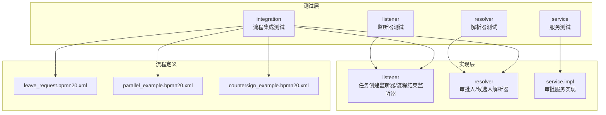
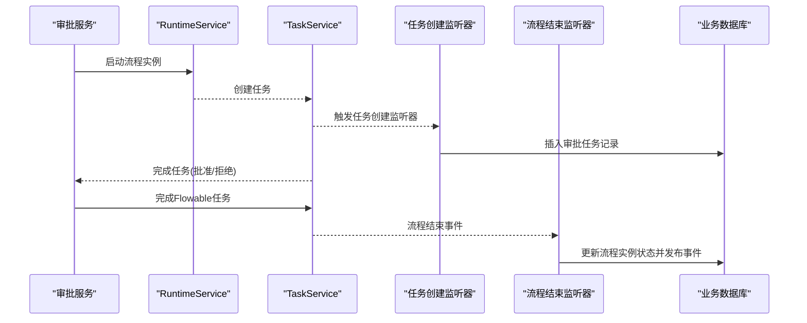
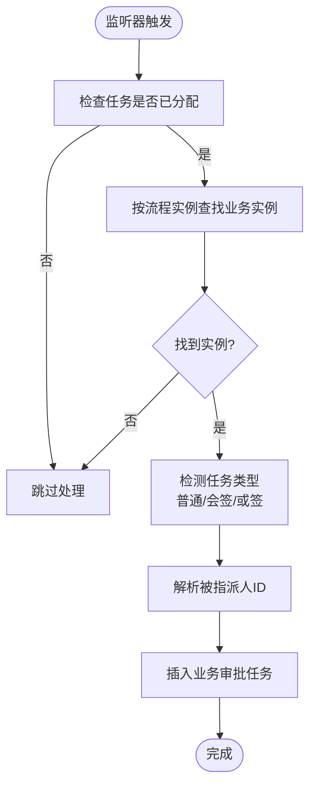
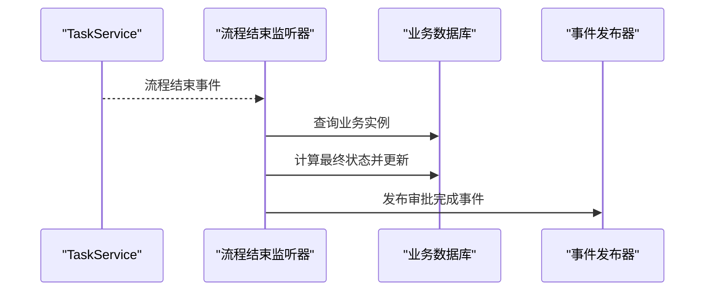
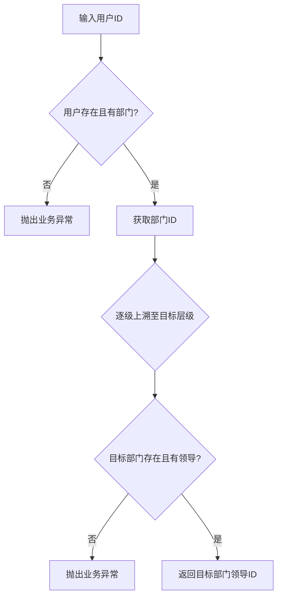
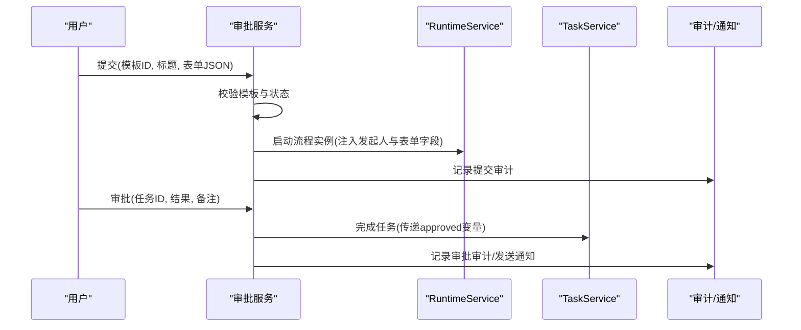
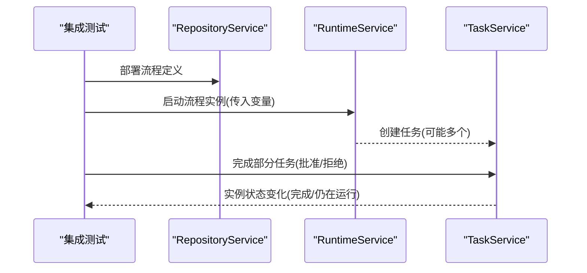
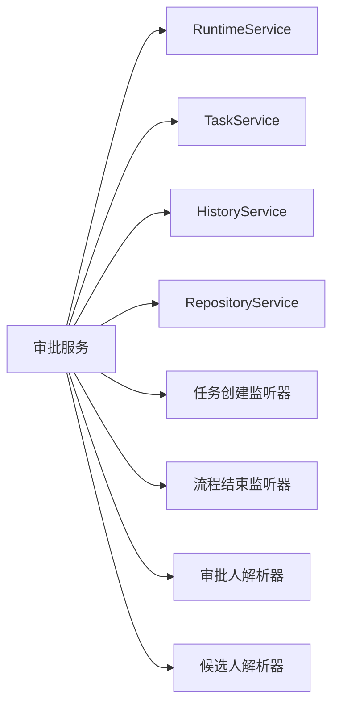

# 工作流测试

<cite>
**本文引用的文件**
- [ApprovalTaskCreateListenerTest.java](file://oa-approval/src/test/java/com/oa/admin/approval/listener/ApprovalTaskCreateListenerTest.java)
- [AssigneeResolverTest.java](file://oa-approval/src/test/java/com/oa/admin/approval/resolver/AssigneeResolverTest.java)
- [CandidateUserResolverTest.java](file://oa-approval/src/test/java/com/oa/admin/approval/resolver/CandidateUserResolverTest.java)
- [FlowableGatewayIntegrationTest.java](file://oa-approval/src/test/java/com/oa/admin/approval/integration/FlowableGatewayIntegrationTest.java)
- [ApprovalServiceTest.java](file://oa-approval/src/test/java/com/oa/admin/approval/service/ApprovalServiceTest.java)
- [ApprovalCcServiceTest.java](file://oa-approval/src/test/java/com/oa/admin/approval/service/ApprovalCcServiceTest.java)
- [ApprovalTemplateServiceTest.java](file://oa-approval/src/test/java/com/oa/admin/approval/service/ApprovalTemplateServiceTest.java)
- [ApprovalTaskCreateListener.java](file://oa-approval/src/main/java/com/oa/admin/approval/listener/ApprovalTaskCreateListener.java)
- [ProcessEndEventListener.java](file://oa-approval/src/main/java/com/oa/admin/approval/listener/ProcessEndEventListener.java)
- [AssigneeResolver.java](file://oa-approval/src/main/java/com/oa/admin/approval/resolver/AssigneeResolver.java)
- [CandidateUserResolver.java](file://oa-approval/src/main/java/com/oa/admin/approval/resolver/CandidateUserResolver.java)
- [ApprovalServiceImpl.java](file://oa-approval/src/main/java/com/oa/admin/approval/service/impl/ApprovalServiceImpl.java)
- [leave_request.bpmn20.xml](file://oa-approval/src/test/resources/processes/leave_request.bpmn20.xml)
- [parallel_example.bpmn20.xml](file://oa-approval/src/test/resources/processes/parallel_example.bpmn20.xml)
- [countersign_example.bpmn20.xml](file://oa-approval/src/test/resources/processes/countersign_example.bpmn20.xml)
</cite>

## 目录
1. [简介](#简介)
2. [项目结构](#项目结构)
3. [核心组件](#核心组件)
4. [架构总览](#架构总览)
5. [详细组件分析](#详细组件分析)
6. [依赖分析](#依赖分析)
7. [性能考虑](#性能考虑)
8. [故障排查指南](#故障排查指南)
9. [结论](#结论)
10. [附录](#附录)

## 简介
本文件面向OA审批管理系统的工作流测试，聚焦于流程工作测试的独特性与挑战，涵盖BPMN流程验证、任务分配策略测试、监听器行为测试、多实例与分支流程测试、候选人与审批人解析器测试、以及复杂流程场景（并行、串行、条件分支）的测试方法。同时提供监听器、解析器、服务层的测试策略与边界用例设计，帮助开发者与测试工程师构建完整的流程测试工具链与最佳实践。

## 项目结构
本项目采用模块化分层组织，工作流测试主要集中在 oa-approval 模块的 test 与 main 目录中：
- 测试层：listener、resolver、service、integration 子包，覆盖监听器、解析器、服务与集成测试。
- 实现层：listener、resolver、service.impl 包含监听器、解析器与业务服务实现。
- 流程定义：test/resources/processes 下包含用于测试的 BPMN 示例。

**图表来源**
- [ApprovalTaskCreateListenerTest.java:1-113](file://oa-approval/src/test/java/com/oa/admin/approval/listener/ApprovalTaskCreateListenerTest.java#L1-L113)
- [AssigneeResolverTest.java:1-99](file://oa-approval/src/test/java/com/oa/admin/approval/resolver/AssigneeResolverTest.java#L1-L99)
- [CandidateUserResolverTest.java:1-52](file://oa-approval/src/test/java/com/oa/admin/approval/resolver/CandidateUserResolverTest.java#L1-L52)
- [FlowableGatewayIntegrationTest.java:1-270](file://oa-approval/src/test/java/com/oa/admin/approval/integration/FlowableGatewayIntegrationTest.java#L1-L270)
- [ApprovalServiceImpl.java:1-792](file://oa-approval/src/main/java/com/oa/admin/approval/service/impl/ApprovalServiceImpl.java#L1-L792)
- [leave_request.bpmn20.xml:1-30](file://oa-approval/src/test/resources/processes/leave_request.bpmn20.xml#L1-L30)
- [parallel_example.bpmn20.xml:1-38](file://oa-approval/src/test/resources/processes/parallel_example.bpmn20.xml#L1-L38)
- [countersign_example.bpmn20.xml:1-32](file://oa-approval/src/test/resources/processes/countersign_example.bpmn20.xml#L1-L32)

**章节来源**
- [FlowableGatewayIntegrationTest.java:1-270](file://oa-approval/src/test/java/com/oa/admin/approval/integration/FlowableGatewayIntegrationTest.java#L1-L270)
- [ApprovalServiceImpl.java:1-792](file://oa-approval/src/main/java/com/oa/admin/approval/service/impl/ApprovalServiceImpl.java#L1-L792)

## 核心组件
- 任务创建监听器：在任务创建时写入业务审批任务表，区分普通、会签、或签等多实例类型。
- 流程结束监听器：根据任务结果汇总流程实例状态并发布完成事件。
- 审批人解析器：基于用户与部门关系解析直接领导、逐级上级领导、发起人等。
- 候选人解析器：基于角色解析候选用户集合，支持会签/或签多实例。
- 审批服务：提交、审批、撤回、转办、终止、查询等核心业务流程编排与校验。
- 集成测试：使用嵌入式 Flowable 引擎与 H2 内存库，验证网关、多实例、分支等复杂流程。

**章节来源**
- [ApprovalTaskCreateListener.java:1-89](file://oa-approval/src/main/java/com/oa/admin/approval/listener/ApprovalTaskCreateListener.java#L1-L89)
- [ProcessEndEventListener.java:1-80](file://oa-approval/src/main/java/com/oa/admin/approval/listener/ProcessEndEventListener.java#L1-L80)
- [AssigneeResolver.java:1-62](file://oa-approval/src/main/java/com/oa/admin/approval/resolver/AssigneeResolver.java#L1-L62)
- [CandidateUserResolver.java:1-31](file://oa-approval/src/main/java/com/oa/admin/approval/resolver/CandidateUserResolver.java#L1-L31)
- [ApprovalServiceImpl.java:1-792](file://oa-approval/src/main/java/com/oa/admin/approval/service/impl/ApprovalServiceImpl.java#L1-L792)

## 架构总览
下图展示从服务层到工作流引擎与监听器的关键交互路径，以及测试层对这些组件的覆盖方式。

**图表来源**
- [ApprovalServiceImpl.java:122-240](file://oa-approval/src/main/java/com/oa/admin/approval/service/impl/ApprovalServiceImpl.java#L122-L240)
- [ApprovalTaskCreateListener.java:25-64](file://oa-approval/src/main/java/com/oa/admin/approval/listener/ApprovalTaskCreateListener.java#L25-L64)
- [ProcessEndEventListener.java:34-62](file://oa-approval/src/main/java/com/oa/admin/approval/listener/ProcessEndEventListener.java#L34-L62)

## 详细组件分析

### 监听器测试：任务创建监听器
- 测试目标
  - 普通任务：检测任务类型为普通。
  - 多实例默认（会签）：检测任务类型为会签。
  - 或签多实例：检测任务类型为或签。
  - 变量作用域差异：本地变量与全局变量对任务类型的影响。
  - 无业务实例：跳过插入。
- 关键断言
  - 业务任务表插入成功且任务类型正确。
  - 未找到业务实例时不进行插入。
- 测试策略
  - 使用 Mockito 模拟 DelegateTask 与 Mapper。
  - 通过 getVariableLocal/getVariable 控制多实例变量。
  - 验证监听器对 Flowable 任务变量的识别逻辑。

**图表来源**
- [ApprovalTaskCreateListener.java:25-87](file://oa-approval/src/main/java/com/oa/admin/approval/listener/ApprovalTaskCreateListener.java#L25-L87)

**章节来源**
- [ApprovalTaskCreateListenerTest.java:1-113](file://oa-approval/src/test/java/com/oa/admin/approval/listener/ApprovalTaskCreateListenerTest.java#L1-L113)
- [ApprovalTaskCreateListener.java:1-89](file://oa-approval/src/main/java/com/oa/admin/approval/listener/ApprovalTaskCreateListener.java#L1-L89)

### 监听器测试：流程结束监听器
- 测试目标
  - 流程结束后根据任务结果汇总实例状态（通过/驳回）。
  - 发布审批完成事件。
- 关键断言
  - 实例状态更新为最终状态。
  - 事件发布成功。
- 测试策略
  - 使用集成测试模拟流程结束事件。
  - 验证监听器对 ExecutionEntity 的处理与事件发布。

**图表来源**
- [ProcessEndEventListener.java:34-62](file://oa-approval/src/main/java/com/oa/admin/approval/listener/ProcessEndEventListener.java#L34-L62)

**章节来源**
- [ProcessEndEventListener.java:1-80](file://oa-approval/src/main/java/com/oa/admin/approval/listener/ProcessEndEventListener.java#L1-L80)

### 解析器测试：审批人解析器
- 测试目标
  - 直接部门领导解析：用户存在且有部门与领导。
  - 逐级上级领导解析：逐级向上直到指定层级或到达根。
  - 发起人解析：当前登录用户。
- 边界与错误
  - 用户不存在或无部门：抛出业务异常。
  - 到达顶级仍可继续上溯：抛出业务异常。
- 测试策略
  - 使用 Mockito 注入用户、部门、用户角色映射器。
  - 覆盖正常路径与异常路径。

**图表来源**
- [AssigneeResolver.java:26-56](file://oa-approval/src/main/java/com/oa/admin/approval/resolver/AssigneeResolver.java#L26-L56)

**章节来源**
- [AssigneeResolverTest.java:1-99](file://oa-approval/src/test/java/com/oa/admin/approval/resolver/AssigneeResolverTest.java#L1-L99)
- [AssigneeResolver.java:1-62](file://oa-approval/src/main/java/com/oa/admin/approval/resolver/AssigneeResolver.java#L1-L62)

### 解析器测试：候选人解析器
- 测试目标
  - 根据角色ID解析所有关联用户ID列表。
- 边界与错误
  - 无用户关联该角色：返回空列表。
- 测试策略
  - 使用 LambdaQueryWrapper 查询用户角色映射。
  - 断言返回用户ID集合。

**章节来源**
- [CandidateUserResolverTest.java:1-52](file://oa-approval/src/test/java/com/oa/admin/approval/resolver/CandidateUserResolverTest.java#L1-L52)
- [CandidateUserResolver.java:1-31](file://oa-approval/src/main/java/com/oa/admin/approval/resolver/CandidateUserResolver.java#L1-L31)

### 服务层测试：审批服务
- 测试目标
  - 提交：模板不存在、模板未发布、参数校验、变量注入、实例创建、审计日志。
  - 审批：任务不存在、已审批、非当前指派人、批准/拒绝变量传递、通知发送、CC触发。
  - 撤回：实例不存在、非发起人、状态不符、已产生处理任务、调用引擎删除实例。
  - 转办：非当前指派人、重复审批、目标用户非法、更新任务、插入新任务、重分配、通知。
  - 终止：管理员操作、状态校验、删除实例、清理未完成任务、通知。
  - 图形化：历史活动、当前任务、流程定义资源读取与展示XML补全。
- 错误码与边界
  - 参数错误、权限不足、重复审批、不可撤回/终止等统一业务异常。
- 测试策略
  - 使用 Mockito 注入模板、任务、实例、运行时、历史、仓库、审计、通知等服务。
  - 使用静态桩替换登录上下文，确保测试可重复。

**图表来源**
- [ApprovalServiceImpl.java:122-240](file://oa-approval/src/main/java/com/oa/admin/approval/service/impl/ApprovalServiceImpl.java#L122-L240)

**章节来源**
- [ApprovalServiceTest.java:1-802](file://oa-approval/src/test/java/com/oa/admin/approval/service/ApprovalServiceTest.java#L1-L802)
- [ApprovalServiceImpl.java:1-792](file://oa-approval/src/main/java/com/oa/admin/approval/service/impl/ApprovalServiceImpl.java#L1-L792)

### 服务层测试：抄送服务
- 测试目标
  - 我的抄送：按当前用户查询未读抄送。
  - 标记已读：仅未读状态更新时间戳。
  - 创建抄送：批量为用户创建抄送条目。
- 错误与边界
  - 抄送不存在、非本人操作：抛出业务异常。
- 测试策略
  - 使用 LambdaQueryWrapper 查询与更新。
  - 断言更新次数与时效字段。

**章节来源**
- [ApprovalCcServiceTest.java:1-166](file://oa-approval/src/test/java/com/oa/admin/approval/service/ApprovalCcServiceTest.java#L1-L166)

### 服务层测试：模板服务
- 测试目标
  - 草稿保存：状态置为草稿。
  - 发布：校验BPMN XML有效性、部署流程定义、更新状态与版本。
  - 新建版本：克隆已发布模板为草稿。
  - 取消发布：状态回退为草稿。
- 错误与边界
  - 已发布模板再次发布、BPMN无效、模板不存在等。
- 测试策略
  - 使用模板映射器与部署服务桩，断言状态与版本变化。

**章节来源**
- [ApprovalTemplateServiceTest.java:1-167](file://oa-approval/src/test/java/com/oa/admin/approval/service/ApprovalTemplateServiceTest.java#L1-L167)

### 集成测试：BPMN流程验证与复杂场景
- 测试目标
  - 排他网关：条件分支路由（高/低天数）。
  - 并行网关：分叉并发任务、汇聚等待全部完成。
  - 会签：全部审批通过才结束。
  - 或签：任一审批通过/拒绝即结束。
  - 驳回：任务拒绝后流程终止。
- 测试策略
  - 使用嵌入式 Flowable 引擎与 H2 内存库。
  - 注册测试用解析器与监听器 Bean，避免真实依赖。
  - 通过任务查询与实例计数验证流程状态。

**图表来源**
- [FlowableGatewayIntegrationTest.java:95-268](file://oa-approval/src/test/java/com/oa/admin/approval/integration/FlowableGatewayIntegrationTest.java#L95-L268)

**章节来源**
- [FlowableGatewayIntegrationTest.java:1-270](file://oa-approval/src/test/java/com/oa/admin/approval/integration/FlowableGatewayIntegrationTest.java#L1-L270)
- [leave_request.bpmn20.xml:1-30](file://oa-approval/src/test/resources/processes/leave_request.bpmn20.xml#L1-L30)
- [parallel_example.bpmn20.xml:1-38](file://oa-approval/src/test/resources/processes/parallel_example.bpmn20.xml#L1-L38)
- [countersign_example.bpmn20.xml:1-32](file://oa-approval/src/test/resources/processes/countersign_example.bpmn20.xml#L1-L32)

## 依赖分析
- 组件内聚与耦合
  - 监听器与解析器作为 Flowable 扩展点，通过 Spring Bean 注入，降低与业务服务耦合。
  - 服务层通过 Flowable 服务接口与数据库映射器协作，职责清晰。
- 外部依赖
  - Flowable 引擎（RuntimeService、TaskService、HistoryService、RepositoryService）。
  - H2 内存数据库用于集成测试。
- 循环依赖
  - 当前结构未见循环依赖；监听器与解析器以只读方式访问数据层。

**图表来源**
- [ApprovalServiceImpl.java:110-121](file://oa-approval/src/main/java/com/oa/admin/approval/service/impl/ApprovalServiceImpl.java#L110-L121)
- [ApprovalTaskCreateListener.java:21-23](file://oa-approval/src/main/java/com/oa/admin/approval/listener/ApprovalTaskCreateListener.java#L21-L23)
- [ProcessEndEventListener.java:29-32](file://oa-approval/src/main/java/com/oa/admin/approval/listener/ProcessEndEventListener.java#L29-L32)
- [AssigneeResolver.java:19-20](file://oa-approval/src/main/java/com/oa/admin/approval/resolver/AssigneeResolver.java#L19-L20)
- [CandidateUserResolver.java:17-18](file://oa-approval/src/main/java/com/oa/admin/approval/resolver/CandidateUserResolver.java#L17-L18)

**章节来源**
- [ApprovalServiceImpl.java:1-792](file://oa-approval/src/main/java/com/oa/admin/approval/service/impl/ApprovalServiceImpl.java#L1-L792)

## 性能考虑
- 集成测试使用内存数据库，避免磁盘 IO，提升执行速度。
- 监听器与解析器尽量减少数据库查询次数，必要时合并查询。
- 服务层分页查询与条件过滤，避免一次性加载大量数据。
- 对历史与当前任务查询加限定条件，避免全表扫描。

## 故障排查指南
- 监听器未生效
  - 检查 BPMN 中是否配置了正确的任务监听器扩展元素。
  - 确认监听器 Bean 是否注册到 Flowable 引擎 Beans。
- 任务类型识别错误
  - 校验多实例变量命名与作用域（本地 vs 全局）。
  - 确认或签条件表达式格式。
- 解析器异常
  - 用户/部门/角色数据缺失导致异常，需准备前置数据或断言异常码。
- 流程无法推进
  - 检查网关条件表达式与变量传递。
  - 确认并行分支是否全部完成。
- 审批服务异常
  - 校验模板状态、任务状态、权限校验与参数合法性。
  - 关注审计日志与通知发送失败场景。

**章节来源**
- [ApprovalTaskCreateListenerTest.java:1-113](file://oa-approval/src/test/java/com/oa/admin/approval/listener/ApprovalTaskCreateListenerTest.java#L1-L113)
- [AssigneeResolverTest.java:1-99](file://oa-approval/src/test/java/com/oa/admin/approval/resolver/AssigneeResolverTest.java#L1-L99)
- [FlowableGatewayIntegrationTest.java:1-270](file://oa-approval/src/test/java/com/oa/admin/approval/integration/FlowableGatewayIntegrationTest.java#L1-L270)
- [ApprovalServiceTest.java:1-802](file://oa-approval/src/test/java/com/oa/admin/approval/service/ApprovalServiceTest.java#L1-L802)

## 结论
本测试体系通过单元测试、集成测试与流程示例，全面覆盖了工作流监听器、解析器、服务层与复杂流程场景。建议在持续集成中优先运行单元测试，再运行集成测试，确保流程稳定性与可维护性。针对边界与异常场景，应补充更多用例并结合日志与审计追踪进行问题定位。

## 附录
- 测试用例设计清单（建议）
  - 监听器：普通/会签/或签/无业务实例/变量作用域差异。
  - 解析器：部门领导、逐级上级领导、角色候选人、异常路径。
  - 服务：提交/审批/撤回/转办/终止/图形化查询。
  - 集成：排他网关、并行网关、会签/或签、驳回、异常中断。
- 最佳实践
  - 使用测试专用 Bean 替换真实依赖，保证测试隔离。
  - 对流程变量与状态转换进行显式断言。
  - 为关键事件（提交、审批、完成）添加审计日志断言。
  - 在 CI 中固定随机种子与时间戳，确保可重复性。