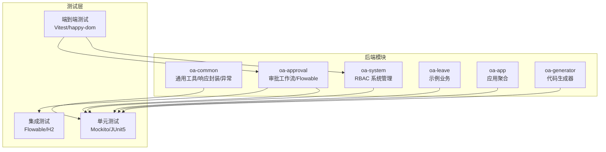
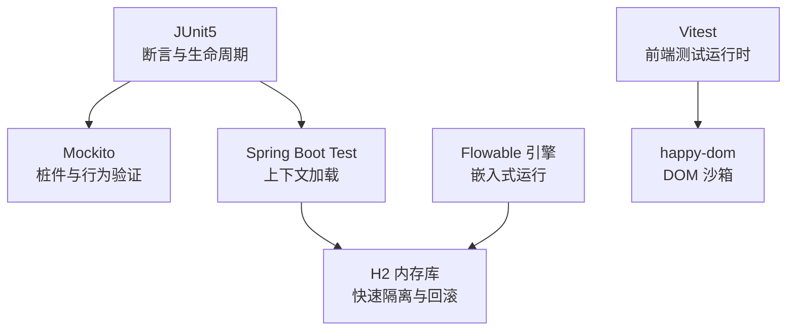
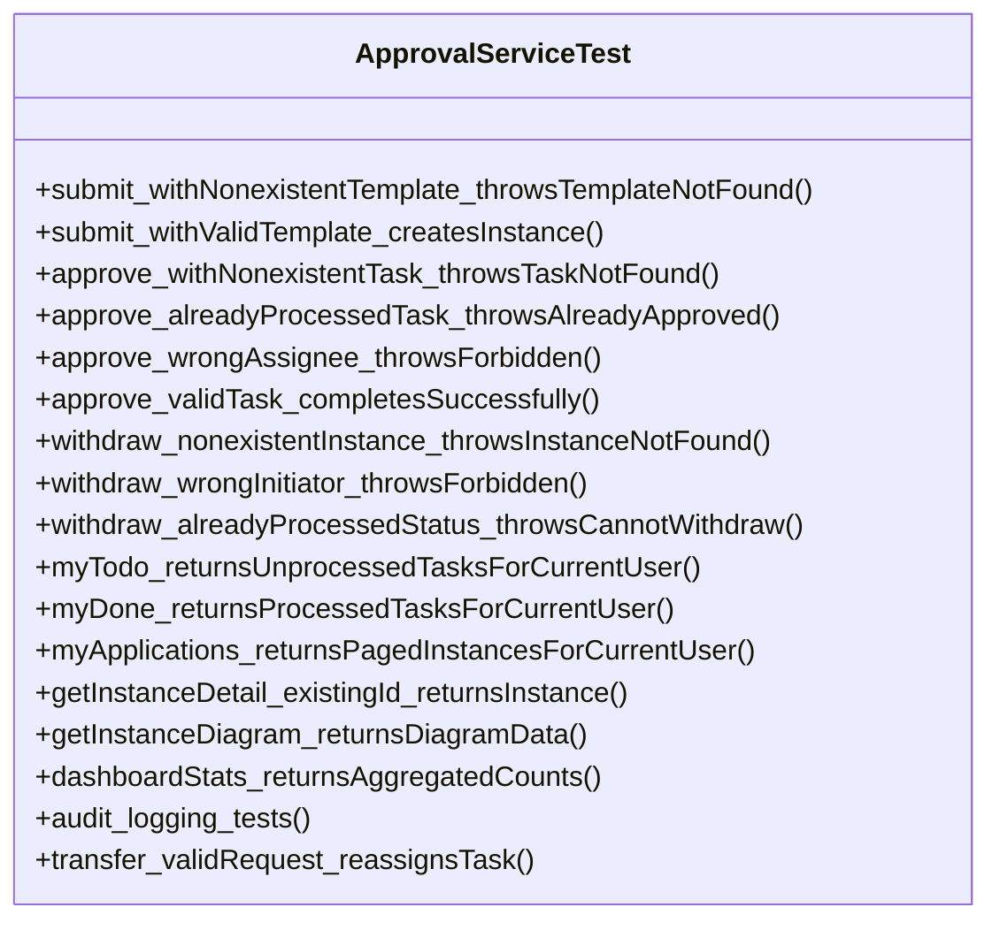
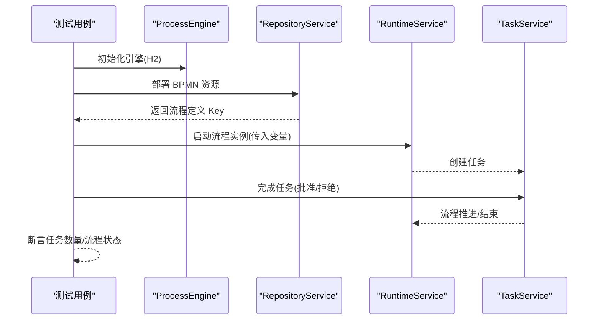
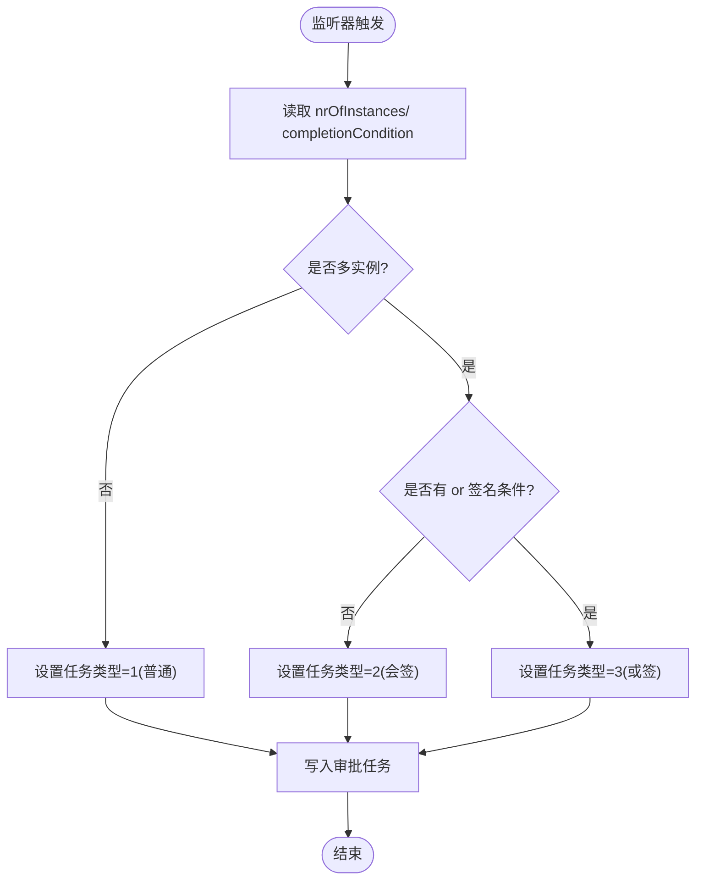
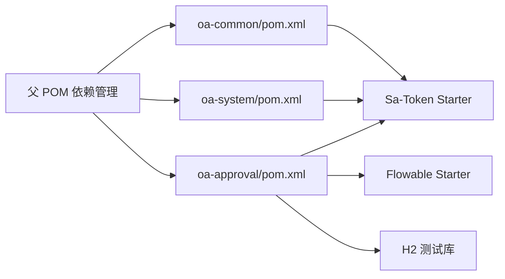

# 测试策略

<cite>
**本文引用的文件**
- [pom.xml](file://pom.xml)
- [oa-approval/pom.xml](file://oa-approval/pom.xml)
- [oa-system/pom.xml](file://oa-system/pom.xml)
- [oa-common/pom.xml](file://oa-common/pom.xml)
- [oa-approval/src/test/java/com/oa/admin/approval/integration/FlowableGatewayIntegrationTest.java](file://oa-approval/src/test/java/com/oa/admin/approval/integration/FlowableGatewayIntegrationTest.java)
- [oa-approval/src/test/java/com/oa/admin/approval/service/ApprovalServiceTest.java](file://oa-approval/src/test/java/com/oa/admin/approval/service/ApprovalServiceTest.java)
- [oa-approval/src/test/java/com/oa/admin/approval/listener/ApprovalTaskCreateListenerTest.java](file://oa-approval/src/test/java/com/oa/admin/approval/listener/ApprovalTaskCreateListenerTest.java)
- [oa-system/src/test/java/com/oa/admin/system/service/AuthServiceTest.java](file://oa-system/src/test/java/com/oa/admin/system/service/AuthServiceTest.java)
- [oa-common/src/test/java/com/oa/admin/common/result/RTest.java](file://oa-common/src/test/java/com/oa/admin/common/result/RTest.java)
- [oa-common/src/test/java/com/oa/admin/common/exception/BusinessExceptionTest.java](file://oa-common/src/test/java/com/oa/admin/common/exception/BusinessExceptionTest.java)
- [oa-common/src/test/java/com/oa/admin/common/exception/GlobalExceptionHandlerTest.java](file://oa-common/src/test/java/com/oa/admin/common/exception/GlobalExceptionHandlerTest.java)
- [oa-approval/src/test/resources/processes/leave_request.bpmn20.xml](file://oa-approval/src/test/resources/processes/leave_request.bpmn20.xml)
- [docker-compose.yml](file://docker-compose.yml)
- [vitest.config.ts](file://oa-ui/vitest.config.ts)
</cite>

## 目录
1. [引言](#引言)
2. [项目结构与测试范围](#项目结构与测试范围)
3. [核心组件与测试职责](#核心组件与测试职责)
4. [架构总览与测试分层](#架构总览与测试分层)
5. [详细组件测试分析](#详细组件测试分析)
6. [依赖关系与耦合分析](#依赖关系与耦合分析)
7. [性能与稳定性测试](#性能与稳定性测试)
8. [安全与合规测试](#安全与合规测试)
9. [兼容性测试](#兼容性测试)
10. [持续测试与自动化流水线](#持续测试与自动化流水线)
11. [测试覆盖率与度量](#测试覆盖率与度量)
12. [故障排查指南](#故障排查指南)
13. [结论](#结论)

## 引言
本测试策略面向 OA 审批管理系统，目标是建立覆盖单元测试、集成测试与端到端测试的完整测试金字塔，确保业务逻辑正确、工作流稳定、接口可靠、数据一致，并具备可维护的自动化测试流水线。本文结合现有代码库中的测试实现，给出可落地的测试框架选择、数据准备与清理策略、API 与工作流测试要点、覆盖率要求与度量方法，以及持续测试与最佳实践建议。

## 项目结构与测试范围
- 多模块 Maven 结构：oa-common（通用）、oa-system（RBAC）、oa-approval（审批工作流）、oa-leave（示例业务）、oa-app（应用聚合）、oa-generator（代码生成器）。
- 测试覆盖范围：
  - 单元测试：服务层、工具类、异常处理、结果封装等。
  - 集成测试：Flowable 工作流网关模式（独占/并行/会签/或签）、任务监听器行为。
  - 端到端测试：前端 Vitest（happy-dom 环境），覆盖 API 调用与 UI 行为。

图示来源
- [pom.xml:21-28](file://pom.xml#L21-L28)
- [oa-approval/pom.xml:14-47](file://oa-approval/pom.xml#L14-L47)
- [oa-system/pom.xml:14-37](file://oa-system/pom.xml#L14-L37)
- [oa-common/pom.xml:17-52](file://oa-common/pom.xml#L17-L52)

章节来源
- [pom.xml:21-28](file://pom.xml#L21-L28)
- [oa-approval/pom.xml:14-47](file://oa-approval/pom.xml#L14-L47)
- [oa-system/pom.xml:14-37](file://oa-system/pom.xml#L14-L37)
- [oa-common/pom.xml:17-52](file://oa-common/pom.xml#L17-L52)

## 核心组件与测试职责
- 审批服务（ApprovalService）：提交、审批、撤回、转办、待办/已办查询、实例详情与流程图获取、仪表盘统计、审计日志。
- 任务监听器（ApprovalTaskCreateListener）：根据多实例变量区分任务类型（普通/会签/或签）并落库。
- RBAC 认证服务（AuthService）：登录、登出、当前用户信息获取。
- 通用结果封装与异常处理：统一响应体、全局异常映射。
- 工作流集成测试：基于嵌入式 Flowable 引擎与 H2 内存库验证网关分支与会签/或签路径。

章节来源
- [oa-approval/src/test/java/com/oa/admin/approval/service/ApprovalServiceTest.java:1-802](file://oa-approval/src/test/java/com/oa/admin/approval/service/ApprovalServiceTest.java#L1-L802)
- [oa-approval/src/test/java/com/oa/admin/approval/listener/ApprovalTaskCreateListenerTest.java:1-113](file://oa-approval/src/test/java/com/oa/admin/approval/listener/ApprovalTaskCreateListenerTest.java#L1-L113)
- [oa-system/src/test/java/com/oa/admin/system/service/AuthServiceTest.java:1-103](file://oa-system/src/test/java/com/oa/admin/system/service/AuthServiceTest.java#L1-L103)
- [oa-common/src/test/java/com/oa/admin/common/result/RTest.java:1-74](file://oa-common/src/test/java/com/oa/admin/common/result/RTest.java#L1-L74)
- [oa-common/src/test/java/com/oa/admin/common/exception/BusinessExceptionTest.java:1-47](file://oa-common/src/test/java/com/oa/admin/common/exception/BusinessExceptionTest.java#L1-L47)
- [oa-common/src/test/java/com/oa/admin/common/exception/GlobalExceptionHandlerTest.java:1-69](file://oa-common/src/test/java/com/oa/admin/common/exception/GlobalExceptionHandlerTest.java#L1-L69)

## 架构总览与测试分层
- 测试金字塔原则：
  - 底层：大量单元测试（Mockito + JUnit5），验证服务与工具逻辑。
  - 中层：少量集成测试（Flowable + H2），验证工作流网关与监听器。
  - 顶层：少量端到端测试（Vitest + happy-dom），验证 UI 与 API 的协同。
- 测试框架与工具：
  - 后端：JUnit5、Mockito、Spring Boot Test Starter、H2（内存数据库）。
  - 前端：Vitest、happy-dom、Vue 插件。
  - 数据库：MySQL（开发/测试环境通过 docker-compose 提供）。

图示来源
- [oa-approval/pom.xml:42-46](file://oa-approval/pom.xml#L42-L46)
- [docker-compose.yml:1-66](file://docker-compose.yml#L1-L66)
- [vitest.config.ts:16-21](file://oa-ui/vitest.config.ts#L16-L21)

章节来源
- [oa-approval/pom.xml:42-46](file://oa-approval/pom.xml#L42-L46)
- [docker-compose.yml:1-66](file://docker-compose.yml#L1-L66)
- [vitest.config.ts:16-21](file://oa-ui/vitest.config.ts#L16-L21)

## 详细组件测试分析

### 审批服务（ApprovalService）测试
- 关键点：
  - 模板不存在、任务不存在、非本人、重复审批等边界条件。
  - 表单字段解析为流程变量、流程实例创建、任务完成调用 Flowable。
  - 撤回校验（发起人、未处理状态、无已处理任务）。
  - 待办/已办分页查询、标题/状态过滤。
  - 实例详情、流程图（历史活动、当前任务、BPMN XML 获取）。
  - 仪表盘统计（待办/已办计数、模板数量、抄送未读、最近活动）。
  - 审计日志记录（提交/审批/撤回）。
  - 转办（更新原任务、插入新任务、设置 Flowable 代理人）。
- 测试策略：
  - 使用 Mockito 注入依赖，对 Mapper、RuntimeService、TaskService、HistoryService、RepositoryService、AuditLogService、NotificationService 进行桩件与行为验证。
  - 使用 MockedStatic 对 Sa-Token 的静态方法进行打桩，模拟登录用户。
  - 对复杂流程（表单变量提取、流程图数据组装）进行参数化与边界值测试。

图示来源
- [oa-approval/src/test/java/com/oa/admin/approval/service/ApprovalServiceTest.java:140-800](file://oa-approval/src/test/java/com/oa/admin/approval/service/ApprovalServiceTest.java#L140-L800)

章节来源
- [oa-approval/src/test/java/com/oa/admin/approval/service/ApprovalServiceTest.java:1-802](file://oa-approval/src/test/java/com/oa/admin/approval/service/ApprovalServiceTest.java#L1-L802)

### 工作流网关集成测试（FlowableGatewayIntegrationTest）
- 覆盖场景：
  - 独占网关（高/低天数分支）、并行网关（分叉/汇聚）、会签（全部同意/部分拒绝）、或签（任一同意/任一拒绝）、拒绝终止。
- 测试策略：
  - 使用嵌入式 Flowable 引擎与 H2 内存库，部署 BPMN 资源，启动流程实例，断言任务数量与流程生命周期。
  - 通过注册 Bean 映射（AssigneeResolver、CandidateUserResolver、TaskListener）保证 UEL 表达式可用。
  - 使用固定用户 ID 作为代理与候选用户，避免外部依赖。

图示来源
- [oa-approval/src/test/java/com/oa/admin/approval/integration/FlowableGatewayIntegrationTest.java:26-268](file://oa-approval/src/test/java/com/oa/admin/approval/integration/FlowableGatewayIntegrationTest.java#L26-L268)

章节来源
- [oa-approval/src/test/java/com/oa/admin/approval/integration/FlowableGatewayIntegrationTest.java:1-270](file://oa-approval/src/test/java/com/oa/admin/approval/integration/FlowableGatewayIntegrationTest.java#L1-L270)

### 任务监听器测试（ApprovalTaskCreateListenerTest）
- 关键点：
  - 普通任务、会签（多实例默认）、或签（completionCondition 条件）、作用域变量优先级。
  - 无业务实例时跳过插入。
- 测试策略：
  - 使用 Mockito 设置 DelegateTask 变量，断言插入的任务类型与被赋派人。

图示来源
- [oa-approval/src/test/java/com/oa/admin/approval/listener/ApprovalTaskCreateListenerTest.java:48-111](file://oa-approval/src/test/java/com/oa/admin/approval/listener/ApprovalTaskCreateListenerTest.java#L48-L111)

章节来源
- [oa-approval/src/test/java/com/oa/admin/approval/listener/ApprovalTaskCreateListenerTest.java:1-113](file://oa-approval/src/test/java/com/oa/admin/approval/listener/ApprovalTaskCreateListenerTest.java#L1-L113)

### RBAC 认证服务测试（AuthServiceTest）
- 关键点：
  - 用户不存在、禁用用户、登出调用、当前用户返回（不带敏感字段）。
- 测试策略：
  - 使用 MockedStatic 打桩 Sa-Token 登录态，断言业务异常码与返回对象。

章节来源
- [oa-system/src/test/java/com/oa/admin/system/service/AuthServiceTest.java:1-103](file://oa-system/src/test/java/com/oa/admin/system/service/AuthServiceTest.java#L1-L103)

### 通用结果封装与异常处理测试
- 关键点：
  - 统一响应体（R）的构造、错误码映射、时间戳校验。
  - 全局异常处理器对不同异常类型的映射。
- 测试策略：
  - 验证响应体字段与错误码常量一致性；验证业务异常与系统异常的映射。

章节来源
- [oa-common/src/test/java/com/oa/admin/common/result/RTest.java:1-74](file://oa-common/src/test/java/com/oa/admin/common/result/RTest.java#L1-L74)
- [oa-common/src/test/java/com/oa/admin/common/exception/BusinessExceptionTest.java:1-47](file://oa-common/src/test/java/com/oa/admin/common/exception/BusinessExceptionTest.java#L1-L47)
- [oa-common/src/test/java/com/oa/admin/common/exception/GlobalExceptionHandlerTest.java:1-69](file://oa-common/src/test/java/com/oa/admin/common/exception/GlobalExceptionHandlerTest.java#L1-L69)

## 依赖关系与耦合分析
- 模块间依赖：
  - oa-system、oa-approval、oa-common 在父 POM 中统一版本与依赖管理。
  - oa-approval 引入 Flowable 与 Sa-Token，用于工作流与鉴权。
- 测试依赖：
  - 后端测试引入 spring-boot-starter-test、H2。
  - 前端测试引入 Vitest 与 Vue 插件，环境为 happy-dom。

图示来源
- [pom.xml:44-113](file://pom.xml#L44-L113)
- [oa-approval/pom.xml:14-47](file://oa-approval/pom.xml#L14-L47)
- [oa-system/pom.xml:14-37](file://oa-system/pom.xml#L14-L37)
- [oa-common/pom.xml:17-52](file://oa-common/pom.xml#L17-L52)

章节来源
- [pom.xml:44-113](file://pom.xml#L44-L113)
- [oa-approval/pom.xml:14-47](file://oa-approval/pom.xml#L14-L47)
- [oa-system/pom.xml:14-37](file://oa-system/pom.xml#L14-L37)
- [oa-common/pom.xml:17-52](file://oa-common/pom.xml#L17-L52)

## 性能与稳定性测试
- 单元测试层面：
  - 使用 Mockito 减少 IO 与外部依赖，提升执行速度；对热点服务（审批、认证）增加边界与压力场景的参数化用例。
- 集成测试层面：
  - Flowable 集成测试使用内存数据库，避免磁盘 IO；批量任务场景下验证流程推进吞吐与内存占用。
- 端到端测试层面：
  - Vitest 并发运行测试文件，减少冷启动开销；对高频 API（分页列表、搜索）进行基准测试。
- 建议指标：
  - 单元测试：平均执行时间 < 10ms/用例，失败率 < 0.1%。
  - 集成测试：流程实例并发数 ≥ 100，平均推进耗时 < 500ms。
  - E2E：页面渲染与 API 请求延迟 < 2s，重试次数 ≤ 3。

## 安全与合规测试
- 认证授权：
  - 使用 Sa-Token 的静态方法打桩，验证未登录、权限不足、角色不符的异常映射。
- 输入校验：
  - Spring Validation 与全局异常处理配合，验证字段校验错误码。
- 敏感信息：
  - 当前用户返回对象排除密码哈希字段，确保输出安全。

章节来源
- [oa-system/src/test/java/com/oa/admin/system/service/AuthServiceTest.java:66-101](file://oa-system/src/test/java/com/oa/admin/system/service/AuthServiceTest.java#L66-L101)
- [oa-common/src/test/java/com/oa/admin/common/exception/GlobalExceptionHandlerTest.java:25-67](file://oa-common/src/test/java/com/oa/admin/common/exception/GlobalExceptionHandlerTest.java#L25-L67)

## 兼容性测试
- 前端：
  - Vitest 配置 happy-dom，覆盖主流浏览器 DOM API；对 Vue 组件交互进行快照与行为测试。
- 后端：
  - Java 17 + Spring Boot 3.x，确保与 MySQL 8、Redis 7 的兼容；在 docker-compose 中验证容器健康检查与端口映射。

章节来源
- [vitest.config.ts:16-21](file://oa-ui/vitest.config.ts#L16-L21)
- [docker-compose.yml:16-20](file://docker-compose.yml#L16-L20)

## 持续测试与自动化流水线
- 建议流水线阶段：
  - 代码检出 → 依赖安装 → 编译 → 单元测试（含覆盖率收集）→ 集成测试（Flowable+H2）→ E2E 测试（Vitest）→ 构建镜像 → 发布制品。
- 数据库测试隔离与回滚：
  - 使用 H2 内存库进行单元测试；对于需要真实数据库的集成测试，使用事务包装与回滚脚本，确保测试之间无副作用。
- 端到端测试：
  - 在 CI 中拉起 MySQL/Redis 容器，启动后端与前端，执行 Vitest 测试套件。
- 报告与缓存：
  - 上传测试报告与覆盖率到制品库；缓存 Maven/Node 依赖加速构建。

## 测试覆盖率与度量
- 覆盖率目标（建议）：
  - 单元测试：语句覆盖率 ≥ 80%，分支覆盖率 ≥ 60%。
  - 集成测试：关键流程（网关/监听器）100% 覆盖。
  - E2E：核心页面与 API 路径 ≥ 70%。
- 度量方式：
  - 使用 JaCoCo 或 Coveralls 收集覆盖率；在 CI 中设置阈值失败保护。
  - 对审批服务、任务监听器、认证服务等关键模块单独设定覆盖率门槛。

## 故障排查指南
- Flowable 集成测试常见问题：
  - BPMN 资源未部署：确认资源路径与部署流程。
  - UEL 表达式解析失败：检查 beans 注册与表达式语法。
  - 任务监听器未触发：确认监听器注册与任务创建事件。
- 单元测试常见问题：
  - Sa-Token 静态方法未打桩：使用 MockedStatic 包裹。
  - Mapper 返回值不符合预期：使用 when(...).thenReturn(...) 设置桩件。
- E2E 测试常见问题：
  - happy-dom 环境差异：尽量使用真实请求拦截或 mock，避免 DOM 特性差异导致的失败。

章节来源
- [oa-approval/src/test/java/com/oa/admin/approval/integration/FlowableGatewayIntegrationTest.java:35-42](file://oa-approval/src/test/java/com/oa/admin/approval/integration/FlowableGatewayIntegrationTest.java#L35-L42)
- [oa-approval/src/test/java/com/oa/admin/approval/service/ApprovalServiceTest.java:144-150](file://oa-approval/src/test/java/com/oa/admin/approval/service/ApprovalServiceTest.java#L144-L150)
- [vitest.config.ts:16-21](file://oa-ui/vitest.config.ts#L16-L21)

## 结论
本测试策略以现有代码为基础，结合测试金字塔原则，明确了单元、集成与端到端测试的职责与实施方法。通过 Mockito、Flowable 嵌入式引擎、H2 内存库与 Vitest/happy-dom，既能保证测试效率，又能覆盖关键业务与工作流场景。建议在 CI 中落实自动化流水线与覆盖率门槛，持续优化测试质量与交付效率。