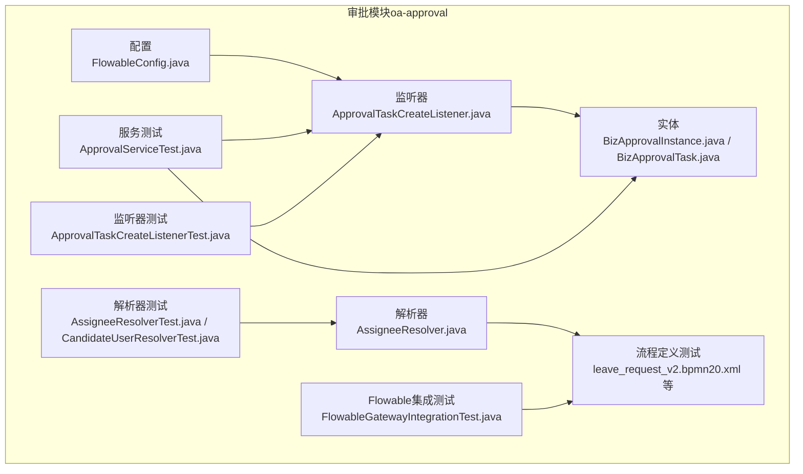
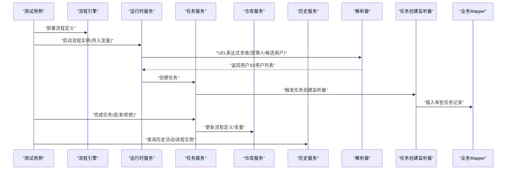
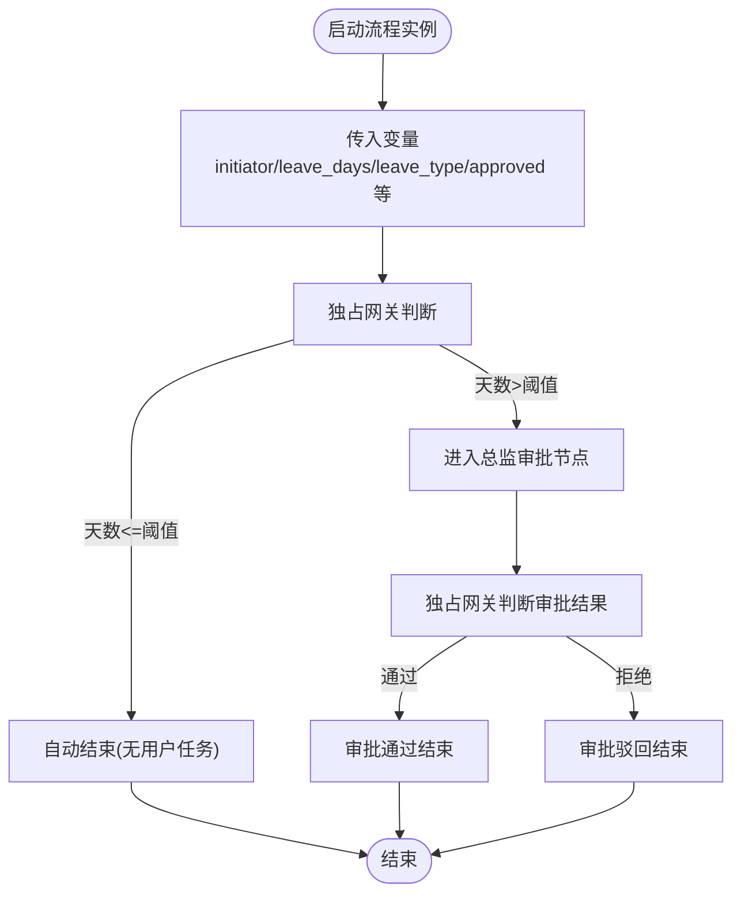
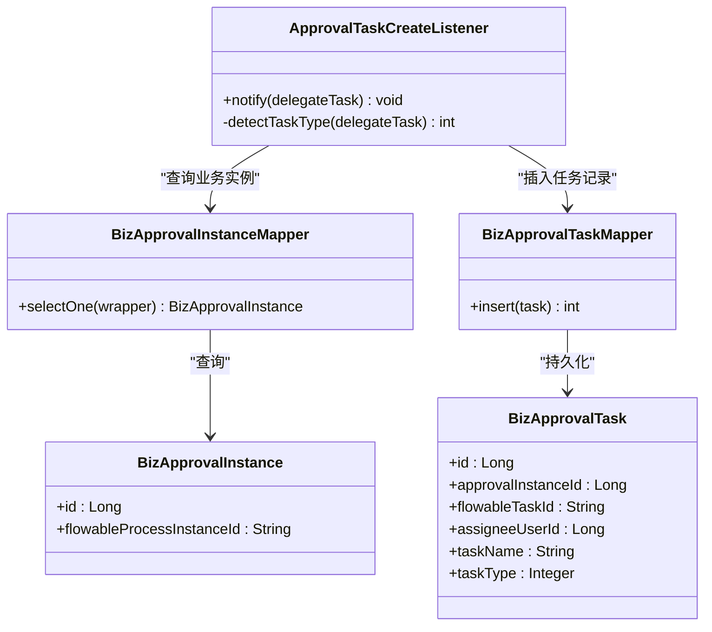
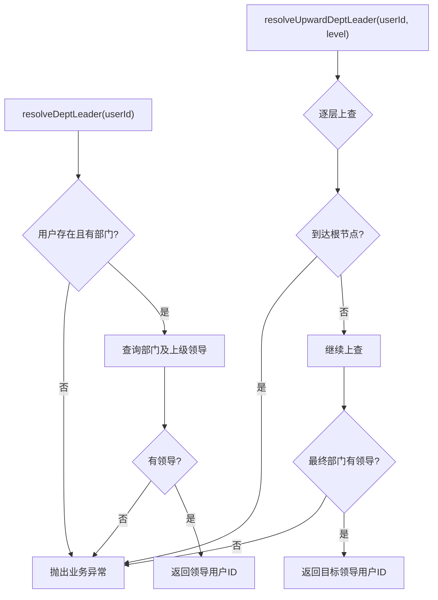
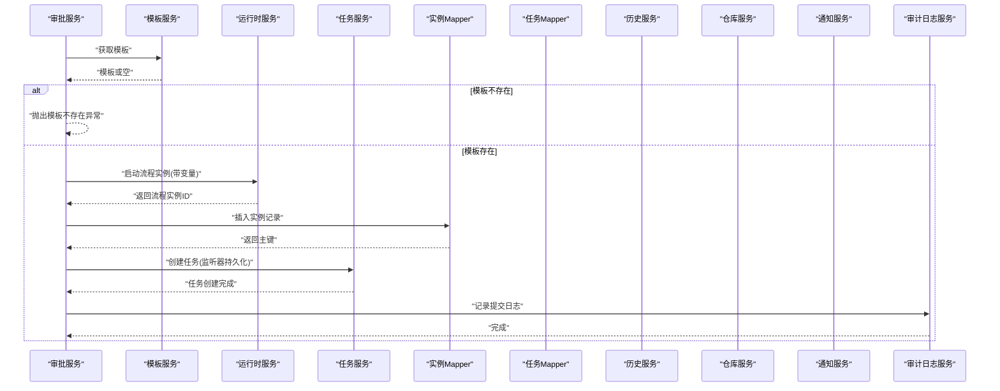
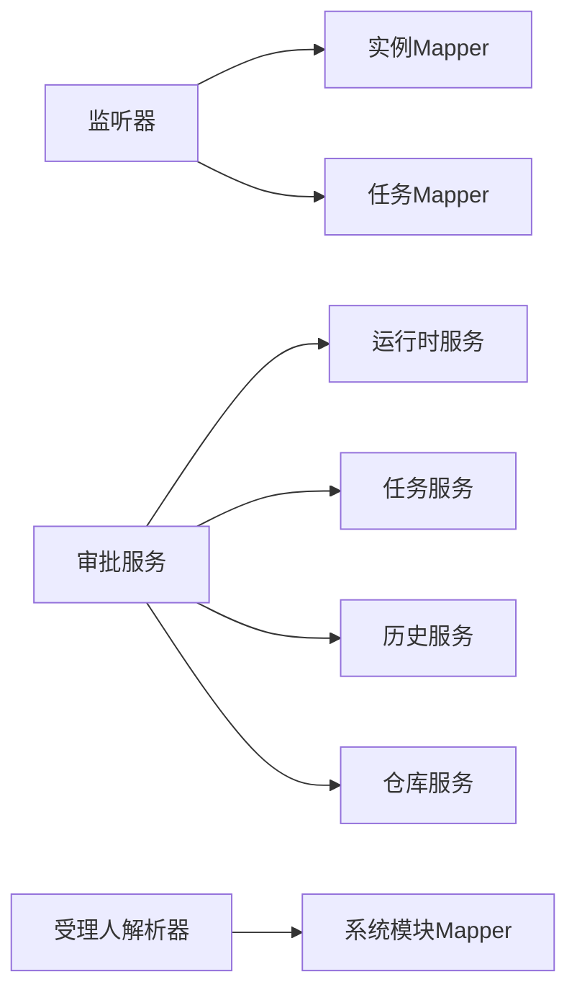

# 集成测试

<cite>
**本文引用的文件**
- [Flowable网关集成测试](file://oa-approval/src/test/java/com/oa/admin/approval/integration/FlowableGatewayIntegrationTest.java)
- [审批任务创建监听器测试](file://oa-approval/src/test/java/com/oa/admin/approval/listener/ApprovalTaskCreateListenerTest.java)
- [审批服务测试](file://oa-approval/src/test/java/com/oa/admin/approval/service/ApprovalServiceTest.java)
- [委派受理人解析器测试](file://oa-approval/src/test/java/com/oa/admin/approval/resolver/AssigneeResolverTest.java)
- [候选用户解析器测试](file://oa-approval/src/test/java/com/oa/admin/approval/resolver/CandidateUserResolverTest.java)
- [请假流程V2（测试用）](file://oa-approval/src/test/resources/processes/leave_request_v2.bpmn20.xml)
- [并行网关示例（测试用）](file://oa-approval/src/test/resources/processes/parallel_example.bpmn20.xml)
- [会签示例（测试用）](file://oa-approval/src/test/resources/processes/countersign_example.bpmn20.xml)
- [或签示例（测试用）](file://oa-approval/src/test/resources/processes/orsign_example.bpmn20.xml)
- [Flowable配置](file://oa-approval/src/main/java/com/oa/admin/approval/config/FlowableConfig.java)
- [审批任务创建监听器](file://oa-approval/src/main/java/com/oa/admin/approval/listener/ApprovalTaskCreateListener.java)
- [委派受理人解析器](file://oa-approval/src/main/java/com/oa/admin/approval/resolver/AssigneeResolver.java)
- [审批实例实体](file://oa-approval/src/main/java/com/oa/admin/approval/entity/BizApprovalInstance.java)
- [审批任务实体](file://oa-approval/src/main/java/com/oa/admin/approval/entity/BizApprovalTask.java)
</cite>

## 目录
1. [引言](#引言)
2. [项目结构](#项目结构)
3. [核心组件](#核心组件)
4. [架构总览](#架构总览)
5. [详细组件分析](#详细组件分析)
6. [依赖分析](#依赖分析)
7. [性能考虑](#性能考虑)
8. [故障排查指南](#故障排查指南)
9. [结论](#结论)
10. [附录](#附录)

## 引言
本文件面向OA审批管理系统的测试团队，提供一份系统化的集成测试指南。内容覆盖模块间接口测试、数据库集成测试、工作流引擎（Flowable）集成测试，并结合实际测试代码与流程图，帮助读者快速理解测试目标、范围与执行策略。同时给出数据库迁移脚本在测试环境中的使用建议、API集成测试方法、以及测试环境搭建与数据管理的最佳实践。

## 项目结构
本项目采用多模块结构，审批模块（oa-approval）包含业务逻辑、监听器、解析器、实体与大量测试用例；流程定义位于测试资源目录中，便于在集成测试中直接加载与验证。

图表来源
- [Flowable配置:1-31](file://oa-approval/src/main/java/com/oa/admin/approval/config/FlowableConfig.java#L1-L31)
- [审批任务创建监听器:1-89](file://oa-approval/src/main/java/com/oa/admin/approval/listener/ApprovalTaskCreateListener.java#L1-L89)
- [委派受理人解析器:1-62](file://oa-approval/src/main/java/com/oa/admin/approval/resolver/AssigneeResolver.java#L1-L62)
- [审批实例实体:1-33](file://oa-approval/src/main/java/com/oa/admin/approval/entity/BizApprovalInstance.java#L1-L33)
- [审批任务实体:1-35](file://oa-approval/src/main/java/com/oa/admin/approval/entity/BizApprovalTask.java#L1-L35)
- [审批服务测试:1-802](file://oa-approval/src/test/java/com/oa/admin/approval/service/ApprovalServiceTest.java#L1-L802)
- [审批任务创建监听器测试:1-113](file://oa-approval/src/test/java/com/oa/admin/approval/listener/ApprovalTaskCreateListenerTest.java#L1-L113)
- [委派受理人解析器测试:1-99](file://oa-approval/src/test/java/com/oa/admin/approval/resolver/AssigneeResolverTest.java#L1-L99)
- [候选用户解析器测试:1-52](file://oa-approval/src/test/java/com/oa/admin/approval/resolver/CandidateUserResolverTest.java#L1-L52)
- [请假流程V2（测试用）:1-78](file://oa-approval/src/test/resources/processes/leave_request_v2.bpmn20.xml#L1-L78)
- [并行网关示例（测试用）:1-38](file://oa-approval/src/test/resources/processes/parallel_example.bpmn20.xml#L1-L38)
- [会签示例（测试用）:1-32](file://oa-approval/src/test/resources/processes/countersign_example.bpmn20.xml#L1-L32)
- [或签示例（测试用）:1-32](file://oa-approval/src/test/resources/processes/orsign_example.bpmn20.xml#L1-L32)
- [Flowable网关集成测试:1-270](file://oa-approval/src/test/java/com/oa/admin/approval/integration/FlowableGatewayIntegrationTest.java#L1-L270)

章节来源
- [Flowable网关集成测试:1-270](file://oa-approval/src/test/java/com/oa/admin/approval/integration/FlowableGatewayIntegrationTest.java#L1-L270)
- [审批服务测试:1-802](file://oa-approval/src/test/java/com/oa/admin/approval/service/ApprovalServiceTest.java#L1-L802)

## 核心组件
- 工作流引擎集成测试：基于嵌入式Flowable引擎与内存数据库，验证流程定义、网关路由、多实例任务（会签/或签）、监听器行为等。
- 监听器测试：验证任务创建监听器在不同多实例变量下的任务类型识别与持久化行为。
- 解析器测试：验证委派受理人解析器与候选用户解析器在不同组织架构与角色映射下的正确性。
- 服务层集成测试：验证审批服务在提交、审批、撤回、转办等操作中对Flowable运行时与业务表的协同行为，以及审计日志记录。

章节来源
- [Flowable网关集成测试:14-86](file://oa-approval/src/test/java/com/oa/admin/approval/integration/FlowableGatewayIntegrationTest.java#L14-L86)
- [审批任务创建监听器测试:1-113](file://oa-approval/src/test/java/com/oa/admin/approval/listener/ApprovalTaskCreateListenerTest.java#L1-L113)
- [委派受理人解析器测试:1-99](file://oa-approval/src/test/java/com/oa/admin/approval/resolver/AssigneeResolverTest.java#L1-L99)
- [候选用户解析器测试:1-52](file://oa-approval/src/test/java/com/oa/admin/approval/resolver/CandidateUserResolverTest.java#L1-L52)
- [审批服务测试:1-802](file://oa-approval/src/test/java/com/oa/admin/approval/service/ApprovalServiceTest.java#L1-L802)

## 架构总览
下图展示了集成测试视角下的系统交互：测试驱动流程引擎，流程引擎调用解析器与监听器，监听器将任务写入业务表，服务层通过运行时与历史服务完成业务闭环。

图表来源
- [Flowable网关集成测试:95-104](file://oa-approval/src/test/java/com/oa/admin/approval/integration/FlowableGatewayIntegrationTest.java#L95-L104)
- [审批任务创建监听器:25-64](file://oa-approval/src/main/java/com/oa/admin/approval/listener/ApprovalTaskCreateListener.java#L25-L64)
- [委派受理人解析器:26-36](file://oa-approval/src/main/java/com/oa/admin/approval/resolver/AssigneeResolver.java#L26-L36)
- [审批服务测试:154-172](file://oa-approval/src/test/java/com/oa/admin/approval/service/ApprovalServiceTest.java#L154-L172)

## 详细组件分析

### Flowable工作流引擎集成测试策略
- 测试目标
  - 验证流程定义正确性与路由逻辑：独占网关、并行网关、会签、或签、拒绝路径。
  - 验证变量传递与UEL表达式求值：受理人解析、多实例集合与完成条件。
  - 验证监听器在任务创建阶段的行为：任务类型识别、业务记录落库。
- 测试范围
  - 使用测试资源中的流程定义文件进行部署与启动。
  - 基于嵌入式引擎与内存数据库，避免外部依赖。
  - 通过任务查询与流程实例查询验证执行状态。
- 关键测试点
  - 独占网关按条件分支：高/低请假天数分别进入不同审批节点或直接结束。
  - 并行网关并发分支与汇聚：完成一个分支不结束，全部完成后结束。
  - 会签/或签：会签需全部同意，或签任一同意即结束。
  - 拒绝路径：任一节点拒绝应终止流程。

图表来源
- [请假流程V2（测试用）:10-78](file://oa-approval/src/test/resources/processes/leave_request_v2.bpmn20.xml#L10-L78)
- [Flowable网关集成测试:108-134](file://oa-approval/src/test/java/com/oa/admin/approval/integration/FlowableGatewayIntegrationTest.java#L108-L134)

章节来源
- [Flowable网关集成测试:14-86](file://oa-approval/src/test/java/com/oa/admin/approval/integration/FlowableGatewayIntegrationTest.java#L14-L86)
- [请假流程V2（测试用）:1-78](file://oa-approval/src/test/resources/processes/leave_request_v2.bpmn20.xml#L1-L78)
- [并行网关示例（测试用）:1-38](file://oa-approval/src/test/resources/processes/parallel_example.bpmn20.xml#L1-L38)
- [会签示例（测试用）:1-32](file://oa-approval/src/test/resources/processes/countersign_example.bpmn20.xml#L1-L32)
- [或签示例（测试用）:1-32](file://oa-approval/src/test/resources/processes/orsign_example.bpmn20.xml#L1-L32)

### 监听器测试：任务创建监听器
- 测试目标
  - 验证监听器根据多实例变量识别任务类型（普通/会签/或签），并将任务持久化到业务表。
  - 验证无业务实例或无受理人时的保护逻辑。
- 关键断言
  - 普通任务：任务类型为普通。
  - 多实例默认：任务类型为会签。
  - 或签完成条件：任务类型为或签。
  - 作用域变量存在但非多实例：任务类型为会签。
  - 无业务实例：不插入任务记录。

图表来源
- [审批任务创建监听器:21-89](file://oa-approval/src/main/java/com/oa/admin/approval/listener/ApprovalTaskCreateListener.java#L21-L89)
- [审批任务创建监听器测试:36-111](file://oa-approval/src/test/java/com/oa/admin/approval/listener/ApprovalTaskCreateListenerTest.java#L36-L111)
- [审批任务实体:1-35](file://oa-approval/src/main/java/com/oa/admin/approval/entity/BizApprovalTask.java#L1-L35)
- [审批实例实体:1-33](file://oa-approval/src/main/java/com/oa/admin/approval/entity/BizApprovalInstance.java#L1-L33)

章节来源
- [审批任务创建监听器测试:1-113](file://oa-approval/src/test/java/com/oa/admin/approval/listener/ApprovalTaskCreateListenerTest.java#L1-L113)
- [审批任务创建监听器:1-89](file://oa-approval/src/main/java/com/oa/admin/approval/listener/ApprovalTaskCreateListener.java#L1-L89)

### 解析器测试：受理人与候选用户
- 委派受理人解析器
  - 场景：部门领导、向上级领导（按层级）、发起人。
  - 断言：用户不存在/无部门、已到达顶级部门等异常路径。
- 候选用户解析器
  - 场景：按角色ID查询所有关联用户。
  - 断言：空结果与正常结果。

图表来源
- [委派受理人解析器:26-56](file://oa-approval/src/main/java/com/oa/admin/approval/resolver/AssigneeResolver.java#L26-L56)
- [委派受理人解析器测试:47-97](file://oa-approval/src/test/java/com/oa/admin/approval/resolver/AssigneeResolverTest.java#L47-L97)

章节来源
- [委派受理人解析器测试:1-99](file://oa-approval/src/test/java/com/oa/admin/approval/resolver/AssigneeResolverTest.java#L1-L99)
- [候选用户解析器测试:1-52](file://oa-approval/src/test/java/com/oa/admin/approval/resolver/CandidateUserResolverTest.java#L1-L52)

### 服务层集成测试：审批服务
- 测试目标
  - 提交：模板不存在、模板未发布、成功提交后实例状态与流程实例ID正确。
  - 审批：任务不存在、非当前受理人、重复审批、正常审批与拒绝（变量传递）。
  - 撤回：不存在实例、非发起人、已处理状态或已有处理中任务时不可撤回。
  - 转办：非受理人、已处理、正常转办（更新原任务、插入新任务、设置受理人）。
  - 查询：我的待办/已办、我的申请（分页、标题模糊、状态精确）。
  - 图表：根据历史与运行时数据生成流程图信息。
  - 统计：待办/已办数量、模板数量、抄送未读数、最近活动。
  - 审计：提交/审批/撤回均产生审计日志。
- 关键断言
  - 变量提取：从表单JSON中提取字段作为流程变量。
  - Flowable交互：启动流程实例、完成任务、设置受理人。
  - 业务一致性：任务状态、实例状态、审计日志。

图表来源
- [审批服务测试:141-172](file://oa-approval/src/test/java/com/oa/admin/approval/service/ApprovalServiceTest.java#L141-L172)
- [审批任务创建监听器:25-64](file://oa-approval/src/main/java/com/oa/admin/approval/listener/ApprovalTaskCreateListener.java#L25-L64)

章节来源
- [审批服务测试:1-802](file://oa-approval/src/test/java/com/oa/admin/approval/service/ApprovalServiceTest.java#L1-L802)

## 依赖分析
- 组件耦合
  - 监听器依赖业务Mapper，确保任务创建时同步持久化。
  - 服务层依赖Flowable运行时/历史/仓库服务，实现业务闭环。
  - 解析器通过UELP表达式被流程引擎调用，实现动态受理人计算。
- 外部依赖
  - 流程引擎：测试中使用嵌入式引擎与内存数据库，减少外部依赖。
  - 数据访问：MyBatis Plus Mapper负责业务表读写。
- 循环依赖
  - 当前结构未见循环依赖；监听器与服务层通过接口与Spring容器装配解耦。

图表来源
- [审批任务创建监听器:21-23](file://oa-approval/src/main/java/com/oa/admin/approval/listener/ApprovalTaskCreateListener.java#L21-L23)
- [委派受理人解析器:23-24](file://oa-approval/src/main/java/com/oa/admin/approval/resolver/AssigneeResolver.java#L23-L24)
- [审批服务测试:64-95](file://oa-approval/src/test/java/com/oa/admin/approval/service/ApprovalServiceTest.java#L64-L95)

章节来源
- [Flowable配置:1-31](file://oa-approval/src/main/java/com/oa/admin/approval/config/FlowableConfig.java#L1-L31)
- [审批任务创建监听器:1-89](file://oa-approval/src/main/java/com/oa/admin/approval/listener/ApprovalTaskCreateListener.java#L1-L89)
- [委派受理人解析器:1-62](file://oa-approval/src/main/java/com/oa/admin/approval/resolver/AssigneeResolver.java#L1-L62)
- [审批服务测试:1-802](file://oa-approval/src/test/java/com/oa/admin/approval/service/ApprovalServiceTest.java#L1-L802)

## 性能考虑
- 内存数据库：测试使用内存数据库可显著提升执行速度，适合高频集成测试。
- 最小化外部依赖：仅在必要时引入真实外部服务，减少网络抖动对测试稳定性的影响。
- 合理拆分测试：将流程复杂度高的场景拆分为多个独立测试，便于定位问题与并行执行。
- 事务与清理：每个测试结束后清理流程实例与业务数据，避免跨测试污染。

## 故障排查指南
- 流程未按预期路由
  - 检查流程变量是否正确传入与命名一致。
  - 核对独占/并行网关的条件表达式与完成条件。
- 任务未创建或类型错误
  - 确认监听器是否被触发，检查多实例变量是否存在。
  - 核对受理人解析器返回值与UELP表达式。
- 审批失败或状态异常
  - 检查任务ID、受理人身份与任务状态。
  - 确认服务层对Flowable变量传递的准确性。
- 审计日志缺失
  - 确认审计服务在对应动作中被调用。

章节来源
- [审批服务测试:175-248](file://oa-approval/src/test/java/com/oa/admin/approval/service/ApprovalServiceTest.java#L175-L248)
- [审批任务创建监听器测试:48-111](file://oa-approval/src/test/java/com/oa/admin/approval/listener/ApprovalTaskCreateListenerTest.java#L48-L111)

## 结论
本集成测试体系以Flowable为核心，结合监听器、解析器与服务层测试，覆盖了流程定义、任务生命周期、多实例协作与业务数据一致性等关键路径。通过内存数据库与嵌入式引擎，测试具备高稳定性与可重复性；配合完善的断言与清理策略，能够有效保障审批流程的正确性与鲁棒性。

## 附录

### 集成测试环境搭建与执行
- 环境要求
  - JDK版本与Maven构建工具。
  - Maven Profile：确保测试模块依赖齐全。
- 执行方式
  - 单元测试：IDE或命令行执行测试类。
  - 聚合测试：在根目录执行集成测试目标（如存在）。
- 数据准备与清理
  - 使用内存数据库与嵌入式引擎，测试结束后由框架自动清理。
  - 如需真实数据库，请参考Flyway迁移脚本在测试环境中的应用（见下一节）。

### 数据库迁移与测试数据管理
- 迁移脚本位置
  - 审批模块资源目录包含流程定义与种子数据脚本，便于在测试环境中初始化。
- 测试环境Flyway使用建议
  - 在测试配置中启用Flyway迁移，确保测试数据库结构与版本一致。
  - 使用独立的测试数据库实例，避免与开发/生产数据冲突。
  - 在CI流水线中先执行迁移，再执行测试套件。

### API集成测试方法
- HTTP客户端测试
  - 使用REST客户端发送请求至审批API端点，验证响应状态码与JSON结构。
- 响应验证
  - 对关键字段（如流程实例ID、任务ID、状态码、消息体）进行断言。
- 错误场景测试
  - 模拟模板不存在、权限不足、重复审批、非法参数等边界情况。
- 与工作流联动
  - 通过提交接口启动流程，再通过审批接口推进任务，最后校验历史与当前状态。

### Testcontainers使用建议（概念性指导）
- MySQL/Redis等外部依赖
  - 在测试中通过容器启动所需外部服务，配置连接参数指向容器网络。
  - 使用固定端口映射或服务发现机制，确保测试稳定。
- 与Flyway集成
  - 在容器启动后执行迁移脚本，确保测试数据与结构就绪。
- 清理策略
  - 测试结束后停止并删除容器，释放资源。