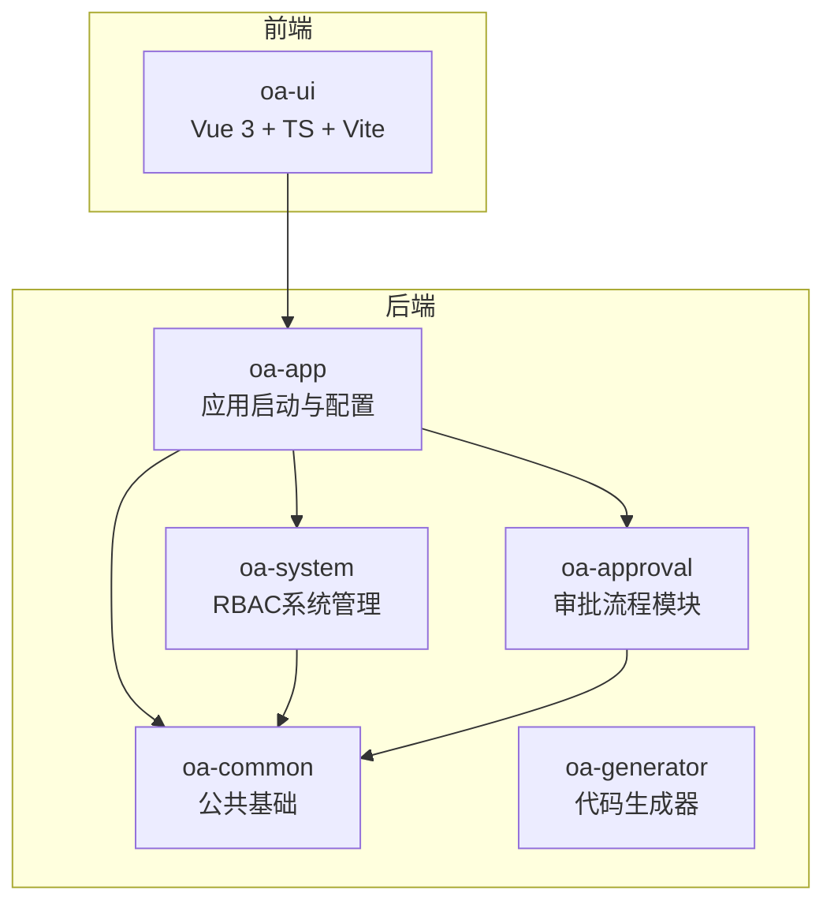
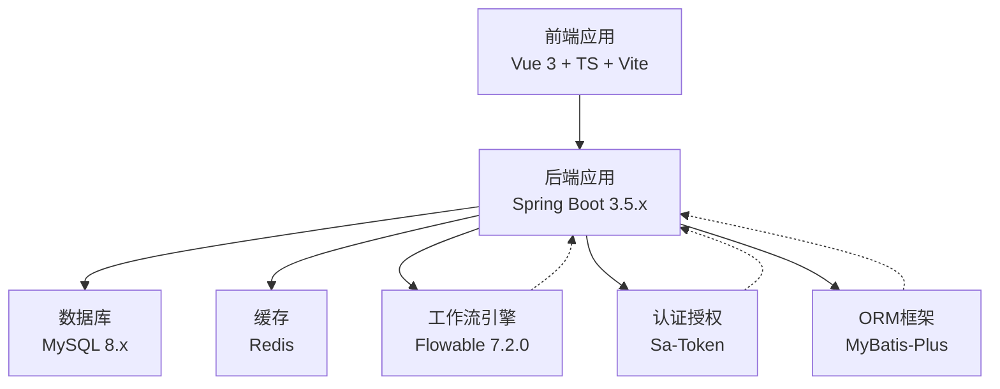
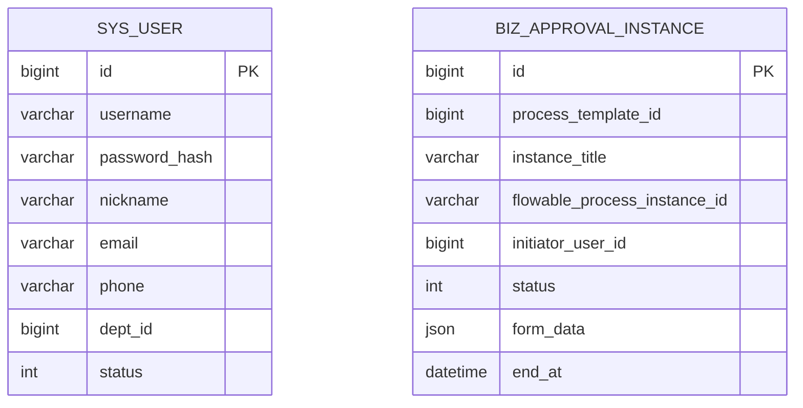
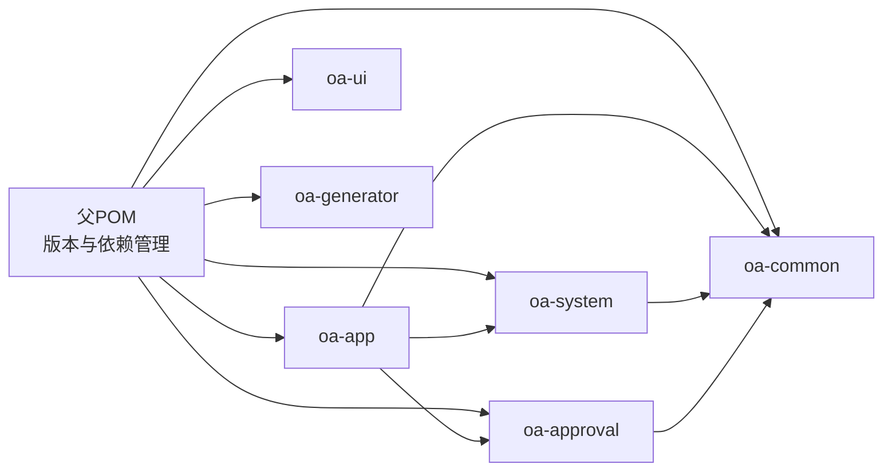

# 技术栈架构

<cite>
**本文引用的文件**
- [pom.xml](file://pom.xml)
- [application.yml](file://oa-app/src/main/resources/application.yml)
- [Dockerfile](file://Dockerfile)
- [docker-compose.yml](file://docker-compose.yml)
- [SaTokenConfig.java](file://oa-system/src/main/java/com/oa/admin/system/config/SaTokenConfig.java)
- [FlowableConfig.java](file://oa-approval/src/main/java/com/oa/admin/approval/config/FlowableConfig.java)
- [MyBatisPlusAutoFillHandler.java](file://oa-common/src/main/java/com/oa/admin/common/config/MyBatisPlusAutoFillHandler.java)
- [SysUser.java](file://oa-system/src/main/java/com/oa/admin/system/entity/SysUser.java)
- [BizApprovalInstance.java](file://oa-approval/src/main/java/com/oa/admin/approval/entity/BizApprovalInstance.java)
- [user.ts](file://oa-ui/src/stores/user.ts)
- [index.ts](file://oa-ui/src/router/index.ts)
- [package.json](file://oa-ui/package.json)
- [vite.config.ts](file://oa-ui/vite.config.ts)
- [tsconfig.json](file://oa-ui/tsconfig.json)
- [README.md](file://README.md)
</cite>

## 目录
1. [引言](#引言)
2. [项目结构](#项目结构)
3. [核心组件](#核心组件)
4. [架构总览](#架构总览)
5. [详细组件分析](#详细组件分析)
6. [依赖关系分析](#依赖关系分析)
7. [性能考虑](#性能考虑)
8. [故障排查指南](#故障排查指南)
9. [结论](#结论)
10. [附录](#附录)

## 引言
本技术栈架构文档面向OA审批管理系统，系统采用前后端分离架构：后端基于Spring Boot 3.5.x，集成MyBatis-Plus、Sa-Token与Flowable；前端采用Vue 3 + TypeScript + Vite，配合Element Plus与Pinia。数据库使用MySQL 8.x与Redis缓存，通过Docker与Docker Compose实现一键部署，并以Flyway进行数据库迁移。

## 项目结构
系统采用多模块Maven工程组织，核心模块包括公共基础模块、系统管理模块（RBAC）、审批模块（Flowable集成）、应用启动模块（配置与迁移）、前端模块与代码生成器模块。整体结构清晰，职责分离明确，便于扩展与维护。

图表来源
- [pom.xml](file://pom.xml)
- [README.md](file://README.md)

章节来源
- [pom.xml](file://pom.xml)
- [README.md](file://README.md)

## 核心组件
- Spring Boot 3.5.x：统一依赖管理与自动配置，提供微服务化的开发体验与生产就绪能力。
- MyBatis-Plus：增强ORM能力，提供自动填充、逻辑删除、分页查询等特性，降低样板代码。
- Sa-Token：轻量级认证授权框架，提供会话管理、接口拦截、权限校验与Redis集成。
- Flowable 7.2.0：开源工作流引擎，提供流程建模、执行与事件监听，支撑审批流场景。
- Vue 3 + TypeScript + Vite：现代化前端技术栈，组件化开发与类型安全，提升开发效率。
- Element Plus：企业级UI组件库，提供丰富的业务组件与主题定制。
- Pinia：轻量状态管理，API简洁，TypeScript友好，适合复杂前端状态管理。
- MySQL 8.x + Redis：高性能数据库与缓存，结合Flyway进行数据库版本治理。
- Docker + Docker Compose：容器化与服务编排，简化本地与生产部署。

章节来源
- [pom.xml](file://pom.xml)
- [application.yml](file://oa-app/src/main/resources/application.yml)
- [README.md](file://README.md)

## 架构总览
系统采用“前端-后端-数据层”的三层架构。前端通过HTTP API与后端交互，后端通过MyBatis-Plus访问MySQL，使用Redis缓存热点数据；审批流程由Flowable引擎驱动，Sa-Token负责认证授权拦截。

图表来源
- [application.yml](file://oa-app/src/main/resources/application.yml)
- [Dockerfile](file://Dockerfile)
- [docker-compose.yml](file://docker-compose.yml)

## 详细组件分析

### 后端技术栈

#### Spring Boot 3.5.x
- 作用：统一依赖版本、自动装配、健康检查、配置加载与打包。
- 特性：基于Java 17，启用编译器参数以兼容部分第三方库；通过父POM锁定版本，保证一致性。
- 部署：Docker镜像构建两阶段，先在Maven镜像中打包，再复制到最小JRE运行时。

章节来源
- [pom.xml](file://pom.xml)
- [Dockerfile](file://Dockerfile)

#### MyBatis-Plus ORM
- 设计优势：自动填充（创建/更新时间）、逻辑删除（软删字段）、驼峰映射、分页查询。
- 实现要点：全局配置开启下划线转驼峰；在公共模块中注入MetaObjectHandler实现自动填充。

章节来源
- [application.yml](file://oa-app/src/main/resources/application.yml)
- [MyBatisPlusAutoFillHandler.java](file://oa-common/src/main/java/com/oa/admin/common/config/MyBatisPlusAutoFillHandler.java)

#### Sa-Token 认证授权
- 架构特点：基于拦截器实现全局登录校验，排除登录/注册等开放接口；支持会话并发、共享、主动刷新与JSON序列化策略。
- 集成方式：在系统模块中注册拦截器，对/api/v1/**路径生效；默认token名称为satoken。

章节来源
- [application.yml](file://oa-app/src/main/resources/application.yml)
- [SaTokenConfig.java](file://oa-system/src/main/java/com/oa/admin/system/config/SaTokenConfig.java)

#### Flowable 工作流引擎
- 技术选型：选择Spring Boot Starter快速集成，启用数据库Schema自动更新；通过事件监听器扩展流程结束后的业务处理。
- 配置要点：在审批模块中实现EngineConfigurationConfigurer，注册自定义事件监听器。

章节来源
- [application.yml](file://oa-app/src/main/resources/application.yml)
- [FlowableConfig.java](file://oa-approval/src/main/java/com/oa/admin/approval/config/FlowableConfig.java)

#### 数据库与缓存
- MySQL 8.x：使用utf8mb4字符集与排序规则，Flyway迁移启用，支持占位符替换关闭以避免冲突。
- Redis：用于Sa-Token会话存储与可能的业务缓存，通过环境变量配置主机与端口。

章节来源
- [application.yml](file://oa-app/src/main/resources/application.yml)
- [docker-compose.yml](file://docker-compose.yml)

### 前端技术栈

#### Vue 3 + TypeScript + Vite
- 现代化架构：Vue 3 Composition API + TypeScript提供类型安全；Vite提供快速冷启动与热更新。
- 开发体验：自动导入Element Plus组件与API；路径别名@指向src；开发代理转发至后端8080端口。

章节来源
- [package.json](file://oa-ui/package.json)
- [vite.config.ts](file://oa-ui/vite.config.ts)
- [tsconfig.json](file://oa-ui/tsconfig.json)

#### Element Plus 组件库
- UI设计：提供表格、表单、对话框、导航等常用业务组件；与Vite插件自动按需引入，减少打包体积。

章节来源
- [package.json](file://oa-ui/package.json)
- [vite.config.ts](file://oa-ui/vite.config.ts)

#### Pinia 状态管理
- 状态模式：使用defineStore集中管理用户登录态与基本信息；持久化到localStorage；提供登录、登出与信息拉取方法。

章节来源
- [user.ts](file://oa-ui/src/stores/user.ts)

#### 路由与页面
- 路由设计：基于Vue Router 4，采用history模式与嵌套布局；全局前置守卫校验token，未登录跳转登录页。
- 页面组织：系统管理、审批流程、仪表盘、请假管理、通知中心等页面按模块划分。

章节来源
- [index.ts](file://oa-ui/src/router/index.ts)

### 数据模型与实体

图表来源
- [SysUser.java](file://oa-system/src/main/java/com/oa/admin/system/entity/SysUser.java)
- [BizApprovalInstance.java](file://oa-approval/src/main/java/com/oa/admin/approval/entity/BizApprovalInstance.java)

## 依赖关系分析

图表来源
- [pom.xml](file://pom.xml)

章节来源
- [pom.xml](file://pom.xml)

## 性能考虑
- 数据库连接池：HikariCP参数合理设置最大池大小、空闲超时与泄漏检测阈值，保障高并发下的稳定性。
- ORM优化：启用逻辑删除与自动填充，减少重复SQL；分页查询避免一次性加载大结果集。
- 缓存策略：Redis用于会话与热点数据缓存，建议结合LRU淘汰策略与过期时间控制内存占用。
- 前端性能：Vite按需加载与Tree Shaking；Element Plus自动导入减少无用组件；路由懒加载降低首屏体积。
- 容器化：多阶段构建减小镜像体积；JRE运行时精简基础镜像，缩短启动时间。

## 故障排查指南
- 启动失败（数据库不可达）：检查docker-compose中的MySQL健康检查与环境变量；确认端口映射与卷挂载。
- 认证异常：确认前端请求头携带satoken；后端拦截器是否正确排除开放接口；Redis连通性与序列化配置。
- 流程无法启动：检查Flowable数据库Schema更新策略与事件监听器注册；查看流程图XML是否正确部署。
- 前端跨域问题：确认Vite代理配置指向后端8080端口；浏览器Network面板检查CORS响应头。
- 数据迁移失败：Flyway启用且迁移路径正确；避免占位符替换导致SQL解析错误。

章节来源
- [docker-compose.yml](file://docker-compose.yml)
- [application.yml](file://oa-app/src/main/resources/application.yml)
- [README.md](file://README.md)

## 结论
该技术栈在企业级OA审批系统中具备良好的可扩展性与可维护性：后端以Spring Boot为核心，结合MyBatis-Plus、Sa-Token与Flowable形成稳定的技术组合；前端采用Vue 3 + TypeScript + Vite，配合Element Plus与Pinia，满足现代Web应用开发需求；数据库与缓存通过Docker Compose实现一键部署，DevOps落地清晰。整体架构兼顾性能、安全与开发效率，适合持续迭代与规模化扩展。

## 附录

### 技术栈选型理由与替代方案对比
- Spring Boot 3.5.x vs 其他框架：版本新、生态成熟、生产就绪；替代方案如Quarkus、Micronaut在特定场景有优势，但本项目更偏向传统企业级稳定路线。
- MyBatis-Plus vs MyBatis：前者提供代码生成、自动填充、逻辑删除等增强能力，显著降低开发成本；MyBatis更灵活但需要更多手写配置。
- Sa-Token vs Spring Security：Sa-Token上手快、注解丰富、与Redis集成简单；Spring Security功能强大但学习曲线较高，适合复杂安全场景。
- Flowable vs Activiti：Flowable社区活跃、文档完善、事件机制灵活；Activiti在某些企业环境中已有沉淀，但Flowable更契合本项目审批流需求。
- Vue 3 + TS + Vite vs React：Vue 3生态成熟、TypeScript支持良好、开发效率高；React在大型应用中也有优势，但本项目更倾向Vue的组件化与模板语法。
- Element Plus vs Ant Design Vue：Element Plus更贴合国内后台管理系统风格；Ant Design Vue在国际化方面更强，但本项目以中文为主。
- Pinia vs Vuex：Pinia API简洁、TypeScript友好、无需额外插件；Vuex功能全面但配置相对复杂。
- MySQL 8.x vs PostgreSQL：MySQL在中文支持与生态适配上更优；PostgreSQL在复杂查询与扩展性上更强，但本项目以事务与简单查询为主。
- Redis vs Memcached：Redis功能更丰富（列表、集合、有序集合），适合会话与缓存；Memcached在纯KV场景性能优异，但本项目需要更多Redis特性。

章节来源
- [README.md](file://README.md)