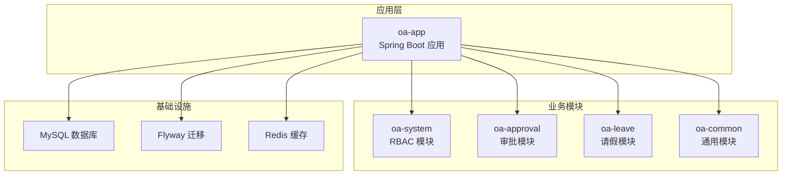
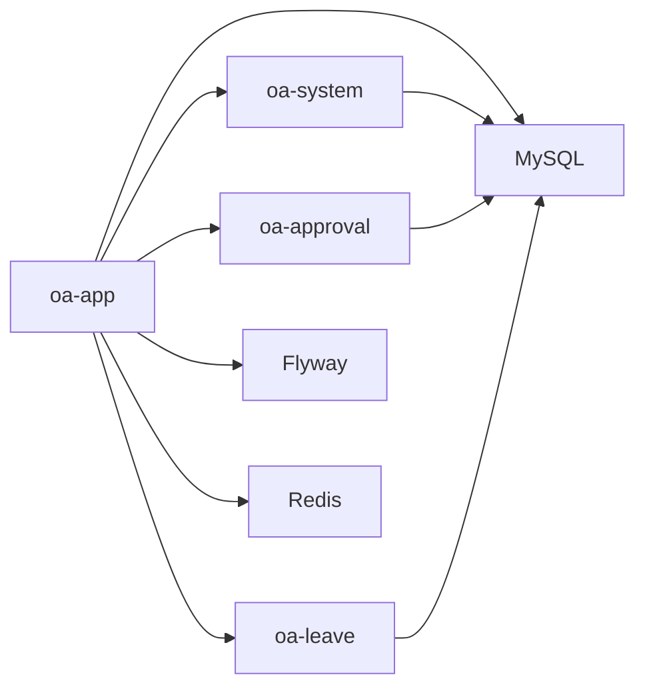

# 数据库设计原则

<cite>
**本文档引用的文件**
- [V1__init_sys_tables.sql](file://oa-app/src/main/resources/db/migration/V1__init_sys_tables.sql)
- [V2__init_biz_tables.sql](file://oa-app/src/main/resources/db/migration/V2__init_biz_tables.sql)
- [V3__seed_data.sql](file://oa-app/src/main/resources/db/migration/V3__seed_data.sql)
- [application.yml](file://oa-app/src/main/resources/application.yml)
- [BaseEntity.java](file://oa-common/src/main/java/com/oa/admin/common/entity/BaseEntity.java)
- [SysUser.java](file://oa-system/src/main/java/com/oa/admin/system/entity/SysUser.java)
- [SysRole.java](file://oa-system/src/main/java/com/oa/admin/system/entity/SysRole.java)
- [SysDept.java](file://oa-system/src/main/java/com/oa/admin/system/entity/SysDept.java)
- [BizApprovalInstance.java](file://oa-approval/src/main/java/com/oa/admin/approval/entity/BizApprovalInstance.java)
- [BizApprovalTask.java](file://oa-approval/src/main/java/com/oa/admin/approval/entity/BizApprovalTask.java)
- [BizProcessTemplate.java](file://oa-approval/src/main/java/com/oa/admin/approval/entity/BizProcessTemplate.java)
- [ApprovalInstanceStatus.java](file://oa-approval/src/main/java/com/oa/admin/approval/enums/ApprovalInstanceStatus.java)
- [ApprovalTaskResult.java](file://oa-approval/src/main/java/com/oa/admin/approval/enums/ApprovalTaskResult.java)
- [DataScope.java](file://oa-system/src/main/java/com/oa/admin/system/enums/DataScope.java)
</cite>

## 目录
1. [简介](#简介)
2. [项目结构](#项目结构)
3. [核心组件](#核心组件)
4. [架构总览](#架构总览)
5. [详细组件分析](#详细组件分析)
6. [依赖分析](#依赖分析)
7. [性能考虑](#性能考虑)
8. [故障排除指南](#故障排除指南)
9. [结论](#结论)

## 简介
本文件面向OA审批管理系统，系统性阐述关系型数据库设计的核心原则与最佳实践，结合代码库中的实际表结构与实体映射，给出范式化设计、数据完整性约束、外键关系设计、表结构规范、索引策略、一致性保障（ACID、事务隔离、并发控制）以及常见陷阱的规避方法。文中所有结论均以仓库中的数据库迁移脚本、实体类与配置文件为依据。

## 项目结构
系统采用多模块分层架构：应用入口模块负责Flyway迁移与数据源配置；系统模块提供RBAC基础能力；审批模块承载业务流程与实例；通用模块提供公共基类与工具。数据库层面通过Flyway版本化迁移管理，确保数据库演进可追踪、可回滚。



图表来源
- [application.yml:4-29](file://oa-app/src/main/resources/application.yml#L4-L29)
- [V1__init_sys_tables.sql:1-84](file://oa-app/src/main/resources/db/migration/V1__init_sys_tables.sql#L1-L84)
- [V2__init_biz_tables.sql:1-74](file://oa-app/src/main/resources/db/migration/V2__init_biz_tables.sql#L1-L74)

章节来源
- [application.yml:1-59](file://oa-app/src/main/resources/application.yml#L1-L59)
- [V1__init_sys_tables.sql:1-84](file://oa-app/src/main/resources/db/migration/V1__init_sys_tables.sql#L1-L84)
- [V2__init_biz_tables.sql:1-74](file://oa-app/src/main/resources/db/migration/V2__init_biz_tables.sql#L1-L74)

## 核心组件
- 基础设施与配置
  - 数据源与连接池：使用HikariCP，参数化配置最大池大小、空闲超时、连接超时等，确保高并发下的稳定性与资源利用率。
  - Flyway迁移：启用自动迁移，按版本脚本顺序执行，支持基线初始化与占位符替换关闭，保证数据库结构演进可控。
  - Redis集成：用于会话与缓存，提升系统整体响应性能。
- 实体与基类
  - BaseEntity统一提供创建时间、更新时间与逻辑删除字段，减少重复代码，保证审计与软删除的一致性。
  - 审批与系统模块的实体类映射到对应表，遵循驼峰转下划线的命名策略，便于MyBatis-Plus自动映射。

章节来源
- [application.yml:4-29](file://oa-app/src/main/resources/application.yml#L4-L29)
- [BaseEntity.java:1-26](file://oa-common/src/main/java/com/oa/admin/common/entity/BaseEntity.java#L1-L26)
- [SysUser.java:1-27](file://oa-system/src/main/java/com/oa/admin/system/entity/SysUser.java#L1-L27)
- [BizApprovalInstance.java:1-33](file://oa-approval/src/main/java/com/oa/admin/approval/entity/BizApprovalInstance.java#L1-L33)

## 架构总览
系统数据库层由两部分构成：系统RBAC表（用户、角色、权限、部门及其关联表）与业务审批表（流程模板、审批实例、审批任务、抄送、审计日志）。RBAC表之间通过联合唯一索引实现多对多关系，业务审批表围绕“模板-实例-任务”形成清晰的主从关系链。

```mermaid
erDiagram
SYS_USER {
bigint id PK
varchar username UK
varchar password_hash
varchar nickname
varchar email
varchar phone
bigint dept_id
tinyint status
datetime created_at
datetime updated_at
tinyint deleted
}
SYS_DEPT {
bigint id PK
bigint parent_id
varchar dept_name
int sort
bigint leader_user_id
tinyint status
datetime created_at
datetime updated_at
tinyint deleted
}
SYS_ROLE {
bigint id PK
varchar role_name
varchar role_key UK
int sort
tinyint data_scope
tinyint status
datetime created_at
datetime updated_at
tinyint deleted
}
SYS_PERMISSION {
bigint id PK
bigint parent_id
varchar permission_name
tinyint permission_type
varchar path
varchar component
varchar icon
int sort
tinyint status
datetime created_at
datetime updated_at
tinyint deleted
}
SYS_USER_ROLE {
bigint id PK
bigint user_id
bigint role_id
unique uk_user_role
}
SYS_ROLE_PERMISSION {
bigint id PK
bigint role_id
bigint permission_id
unique uk_role_perm
}
SYS_ROLE_DEPT {
bigint id PK
bigint role_id
bigint dept_id
unique uk_role_dept
}
SYS_USER }o--o{ SYS_USER_ROLE : "拥有"
SYS_ROLE }o--o{ SYS_USER_ROLE : "授予"
SYS_ROLE }o--o{ SYS_ROLE_PERMISSION : "授权"
SYS_PERMISSION }o--o{ SYS_ROLE_PERMISSION : "被授权"
SYS_ROLE }o--o{ SYS_ROLE_DEPT : "作用于"
SYS_DEPT }o--o{ SYS_ROLE_DEPT : "关联"
-- 业务审批表
BIZ_PROCESS_TEMPLATE {
bigint id PK
varchar template_name
varchar template_key UK
varchar flowable_process_definition_id
text form_config
int version
tinyint status
datetime created_at
datetime updated_at
tinyint deleted
}
BIZ_APPROVAL_INSTANCE {
bigint id PK
bigint process_template_id
varchar instance_title
varchar flowable_process_instance_id
bigint initiator_user_id
tinyint status
text form_data
datetime created_at
datetime updated_at
datetime end_at
}
BIZ_APPROVAL_TASK {
bigint id PK
bigint approval_instance_id
varchar flowable_task_id
bigint assignee_user_id
varchar task_name
tinyint task_result
varchar task_comment
datetime created_at
datetime completed_at
}
BIZ_APPROVAL_CC {
bigint id PK
bigint approval_instance_id
bigint cc_user_id
varchar cc_reason
datetime read_at
datetime created_at
}
BIZ_AUDIT_LOG {
bigint id PK
bigint user_id
varchar module
varchar action
varchar target_type
bigint target_id
text detail
varchar ip
datetime created_at
}
BIZ_PROCESS_TEMPLATE ||--o{ BIZ_APPROVAL_INSTANCE : "定义"
BIZ_APPROVAL_INSTANCE ||--o{ BIZ_APPROVAL_TASK : "包含"
BIZ_APPROVAL_INSTANCE ||--o{ BIZ_APPROVAL_CC : "抄送"
SYS_USER ||--o{ BIZ_APPROVAL_INSTANCE : "发起"
SYS_USER ||--o{ BIZ_APPROVAL_TASK : "处理"
SYS_USER ||--o{ BIZ_APPROVAL_CC : "被抄送"
SYS_USER ||--o{ BIZ_AUDIT_LOG : "产生"
```

图表来源
- [V1__init_sys_tables.sql:5-84](file://oa-app/src/main/resources/db/migration/V1__init_sys_tables.sql#L5-L84)
- [V2__init_biz_tables.sql:5-74](file://oa-app/src/main/resources/db/migration/V2__init_biz_tables.sql#L5-L74)

## 详细组件分析

### 表结构设计规范
- 字段命名约定
  - 使用下划线分隔的小写命名，如 `parent_id`、`dept_name`、`flowable_process_definition_id`，与MyBatis-Plus的下划线映射一致。
  - 外键字段统一以 `_id` 结尾，如 `user_id`、`role_id`、`dept_id`，增强可读性与一致性。
- 数据类型选择
  - 主键统一使用 `BIGINT AUTO_INCREMENT PRIMARY KEY`，满足大体量业务增长需求。
  - 时间戳使用 `DATETIME` 类型，配合 `CURRENT_TIMESTAMP` 默认值与自动更新。
  - 枚举值使用 `TINYINT` 存储代码值，配合Java枚举或注释说明含义，兼顾存储效率与可读性。
  - JSON配置与内容使用 `TEXT` 类型，如 `form_config`、`form_data`、`detail`。
- 长度限制与默认值
  - 名称类字段采用合理上限，如 `dept_name` 100字符、`username` 50字符、`email` 100字符，避免过度浪费空间。
  - 状态字段统一使用 `TINYINT` 并设置默认值（如 `status=1`），枚举值在应用层校验。
  - 逻辑删除字段 `deleted` 默认 0，配合全局逻辑删除配置实现软删除。
- 索引设计策略
  - 主键索引：所有表的主键均为聚簇索引，保证唯一性与快速定位。
  - 唯一索引：用户名与角色key加 `deleted` 组成唯一索引，防止重复与逻辑删除冲突。
  - 普通索引：针对高频查询字段建立索引，如 `sys_user(dept_id)`、`biz_approval_instance(template_id, initiator, status)`、`biz_approval_task(assignee_user_id, task_result)` 等。
- 外键关系设计
  - 采用逻辑外键与业务约束相结合的方式：通过应用层与数据库层共同维护参照完整性，避免复杂的级联删除带来的风险。
  - 关联表使用联合唯一索引（如 `uk_user_role`、`uk_role_perm`、`uk_role_dept`）替代外键，降低DDL复杂度与迁移成本。

章节来源
- [V1__init_sys_tables.sql:5-84](file://oa-app/src/main/resources/db/migration/V1__init_sys_tables.sql#L5-L84)
- [V2__init_biz_tables.sql:5-74](file://oa-app/src/main/resources/db/migration/V2__init_biz_tables.sql#L5-L74)
- [application.yml:36-44](file://oa-app/src/main/resources/application.yml#L36-L44)

### 实体类与数据库映射
- BaseEntity统一注入创建/更新时间与逻辑删除字段，实体类继承该基类即可获得一致的审计能力。
- 审批与系统模块的实体类通过 `@TableName` 映射到具体表，字段名遵循驼峰转下划线策略，确保与迁移脚本一致。

章节来源
- [BaseEntity.java:1-26](file://oa-common/src/main/java/com/oa/admin/common/entity/BaseEntity.java#L1-L26)
- [SysUser.java:1-27](file://oa-system/src/main/java/com/oa/admin/system/entity/SysUser.java#L1-L27)
- [BizApprovalInstance.java:1-33](file://oa-approval/src/main/java/com/oa/admin/approval/entity/BizApprovalInstance.java#L1-L33)
- [BizApprovalTask.java:1-35](file://oa-approval/src/main/java/com/oa/admin/approval/entity/BizApprovalTask.java#L1-L35)
- [BizProcessTemplate.java:1-29](file://oa-approval/src/main/java/com/oa/admin/approval/entity/BizProcessTemplate.java#L1-L29)

### 数据一致性与事务控制
- ACID特性
  - 原子性：通过Spring声明式事务与数据库事务保证单次业务操作的原子性。
  - 一致性：Flyway迁移确保数据库结构一致性；业务层通过枚举与状态机约束维持业务一致性。
  - 隔离性：根据业务场景选择合适的事务隔离级别，避免脏读、不可重复读与幻读。
  - 持久性：事务提交后数据持久化至磁盘，配合Binlog与备份策略保障恢复能力。
- 事务隔离级别与并发控制
  - 默认隔离级别：建议采用可重复读（Repeatable Read）以平衡性能与一致性。
  - 并发控制：对热点表采用乐观锁（版本号）或悲观锁（SELECT ... FOR UPDATE）；对只读查询使用只读事务。
  - 读写分离：对审计日志等只读场景可考虑读库分流，减轻主库压力。
- 并发场景示例
  - 抄送状态更新：使用条件更新（基于时间戳或版本号）避免覆盖最新状态。
  - 审批任务完成：先检查实例状态，再更新任务结果，最后判断是否推进流程，必要时使用分布式锁防止竞态。

章节来源
- [application.yml:4-29](file://oa-app/src/main/resources/application.yml#L4-L29)
- [BizApprovalTask.java:1-35](file://oa-approval/src/main/java/com/oa/admin/approval/entity/BizApprovalTask.java#L1-L35)
- [BizApprovalInstance.java:1-33](file://oa-approval/src/main/java/com/oa/admin/approval/entity/BizApprovalInstance.java#L1-L33)

### 索引设计策略与性能考量
- 主键索引
  - 所有表主键为聚簇索引，保证主键查找与插入性能最优。
- 唯一索引
  - 用户名与角色key加逻辑删除字段组成唯一索引，避免重复与逻辑删除冲突。
- 复合索引
  - 审批实例：`(process_template_id, status)`、`(initiator_user_id, status)` 支持模板维度与发起人维度的高效查询。
  - 审批任务：`(assignee_user_id, task_result)` 支持待办/已办统计与分页。
  - 审批抄送：`(cc_user_id, read_at)` 支持抄送列表与已读未读统计。
  - 审计日志：`(user_id, created_at)`、`(module, action)` 支持用户行为追踪与模块操作统计。
- 索引选择原则
  - 覆盖查询优先：尽量让查询走覆盖索引，减少回表。
  - 前缀匹配优化：对前缀过滤字段建立合适索引，避免全表扫描。
  - 避免冗余索引：定期清理未使用的索引，降低写入开销。
- 性能考虑
  - 写多读少场景：适度减少非必要索引，提高批量写入性能。
  - 读多写少场景：增加辅助索引，优化查询路径。
  - 分区与归档：对历史审计日志进行分区或归档，保持热数据区性能。

章节来源
- [V1__init_sys_tables.sql:15-83](file://oa-app/src/main/resources/db/migration/V1__init_sys_tables.sql#L15-L83)
- [V2__init_biz_tables.sql:30-73](file://oa-app/src/main/resources/db/migration/V2__init_biz_tables.sql#L30-L73)

### 具体SQL示例与最佳实践
- 创建用户并分配角色
  - 示例路径：[V3__seed_data.sql:6-26](file://oa-app/src/main/resources/db/migration/V3__seed_data.sql#L6-L26)
  - 最佳实践：使用事务包裹多表写入，确保用户与角色关系一致性。
- 插入审批模板与实例
  - 示例路径：[V3__seed_data.sql:82-89](file://oa-app/src/main/resources/db/migration/V3__seed_data.sql#L82-L89)
  - 最佳实践：模板发布后禁止修改结构，通过版本号与发布状态区分。
- 查询待办任务
  - 示例路径：[V2__init_biz_tables.sql:35-47](file://oa-app/src/main/resources/db/migration/V2__init_biz_tables.sql#L35-L47)
  - 最佳实践：使用复合索引 `(assignee_user_id, task_result)`，并限制返回字段与分页。
- 抄送状态更新
  - 示例路径：[V2__init_biz_tables.sql:49-58](file://oa-app/src/main/resources/db/migration/V2__init_biz_tables.sql#L49-L58)
  - 最佳实践：使用条件更新避免并发覆盖，记录更新时间用于排序与审计。
- 审计日志查询
  - 示例路径：[V2__init_biz_tables.sql:60-73](file://oa-app/src/main/resources/db/migration/V2__init_biz_tables.sql#L60-L73)
  - 最佳实践：按时间范围与模块/动作组合查询，避免无索引全表扫描。

章节来源
- [V3__seed_data.sql:1-90](file://oa-app/src/main/resources/db/migration/V3__seed_data.sql#L1-L90)
- [V2__init_biz_tables.sql:35-73](file://oa-app/src/main/resources/db/migration/V2__init_biz_tables.sql#L35-L73)

### 常见设计陷阱与规避
- 过度规范化导致查询复杂
  - 现象：频繁JOIN影响性能。
  - 规避：对热点查询建立物化视图或冗余字段，结合复合索引优化。
- 忽视逻辑删除与唯一索引冲突
  - 现象：同一用户名在不同逻辑删除状态下重复。
  - 规避：唯一索引加入 `deleted` 字段，应用层统一处理软删除。
- 外键缺失引发数据不一致
  - 现象：删除父记录后子记录悬挂。
  - 规避：采用逻辑外键与业务校验，必要时使用触发器或应用层约束。
- 索引过多导致写入性能下降
  - 现象：大量UPDATE/INSERT变慢。
  - 规避：定期评估索引使用率，合并冗余索引，按需增减。
- 枚举值散乱
  - 现象：状态码分散在各处，难以维护。
  - 规避：统一使用枚举类与常量，数据库仅存数值代码，应用层严格校验。

章节来源
- [application.yml:36-44](file://oa-app/src/main/resources/application.yml#L36-L44)
- [V1__init_sys_tables.sql:30-83](file://oa-app/src/main/resources/db/migration/V1__init_sys_tables.sql#L30-L83)
- [V2__init_biz_tables.sql:30-73](file://oa-app/src/main/resources/db/migration/V2__init_biz_tables.sql#L30-L73)

## 依赖分析
- 模块耦合
  - oa-app 依赖 oa-system、oa-approval、oa-leave，形成统一入口与多业务协同。
  - oa-system 与 oa-approval 通过实体与枚举共享通用基类与状态定义。
- 外部依赖
  - MySQL驱动、HikariCP连接池、Flyway迁移、MyBatis-Plus、Sa-Token、Redis等。
- 数据流
  - 应用启动时通过Flyway执行迁移脚本，初始化RBAC与审批表结构；随后通过MyBatis-Plus访问数据库，结合Redis缓存与会话管理。



图表来源
- [application.yml:14-29](file://oa-app/src/main/resources/application.yml#L14-L29)
- [V1__init_sys_tables.sql:1-84](file://oa-app/src/main/resources/db/migration/V1__init_sys_tables.sql#L1-L84)
- [V2__init_biz_tables.sql:1-74](file://oa-app/src/main/resources/db/migration/V2__init_biz_tables.sql#L1-L74)

章节来源
- [application.yml:1-59](file://oa-app/src/main/resources/application.yml#L1-L59)
- [V1__init_sys_tables.sql:1-84](file://oa-app/src/main/resources/db/migration/V1__init_sys_tables.sql#L1-L84)
- [V2__init_biz_tables.sql:1-74](file://oa-app/src/main/resources/db/migration/V2__init_biz_tables.sql#L1-L74)

## 性能考虑
- 连接池参数调优
  - 根据QPS与并发连接数调整最大池大小、最小空闲、连接超时与空闲超时，避免连接泄漏与抖动。
- SQL执行优化
  - 使用EXPLAIN分析慢查询，确保索引命中；避免SELECT *，仅取必要字段。
  - 对批量写入使用批处理与事务合并，减少网络往返。
- 缓存策略
  - 将热点字典（如状态枚举、权限树）放入Redis，降低数据库压力。
- 归档与分区
  - 审计日志按月/季度分区或归档，保持热数据区高效。

## 故障排除指南
- 迁移失败
  - 症状：Flyway执行中断或版本不匹配。
  - 排查：检查迁移脚本语法、依赖版本与数据库权限；必要时手动回滚到上一版本。
- 连接池异常
  - 症状：连接耗尽、超时或泄漏。
  - 排查：检查池参数、监控连接使用率与泄漏检测阈值；优化SQL与事务时长。
- 逻辑删除冲突
  - 症状：唯一索引重复或查询结果异常。
  - 排查：确认唯一索引包含 `deleted` 字段；应用层统一使用软删除。
- 审计日志性能问题
  - 症状：写入延迟高。
  - 排查：评估写入峰值，考虑异步写入或批量入库；对查询添加时间范围与索引优化。

章节来源
- [application.yml:10-24](file://oa-app/src/main/resources/application.yml#L10-L24)
- [application.yml:25-29](file://oa-app/src/main/resources/application.yml#L25-L29)
- [application.yml:36-44](file://oa-app/src/main/resources/application.yml#L36-L44)

## 结论
本系统在数据库设计上遵循范式化与实用性的平衡：通过Flyway版本化迁移确保结构演进可控，借助MyBatis-Plus与实体基类实现统一的审计与软删除；在索引设计上聚焦高频查询路径，结合业务场景选择合适的索引策略；在一致性保障上采用事务与枚举约束，辅以缓存与归档策略提升整体性能与可维护性。遵循本文档的原则与最佳实践，可在保证数据质量的同时，持续支撑业务扩展与性能优化。