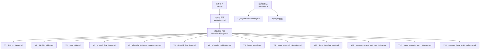
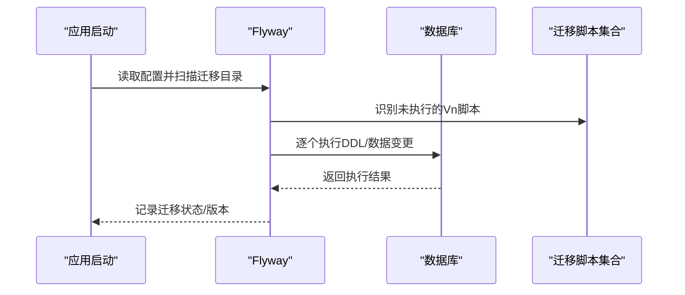
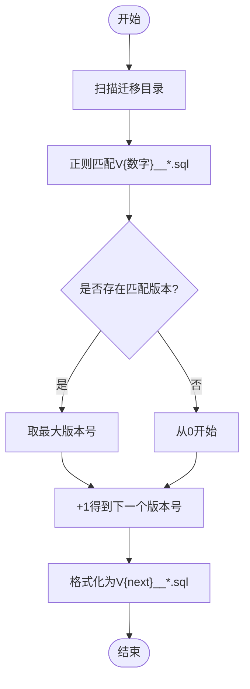
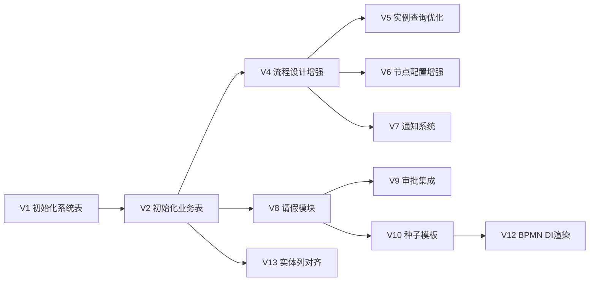
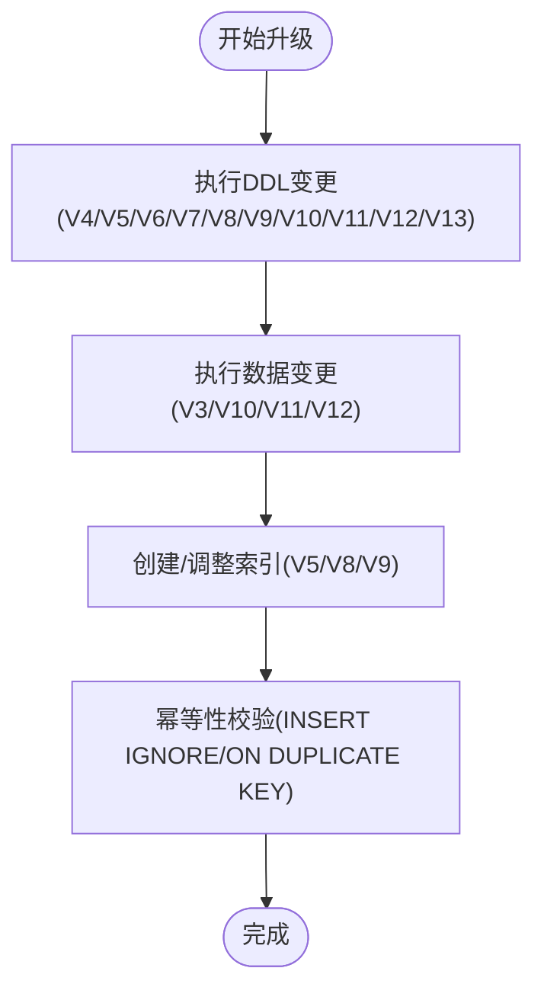
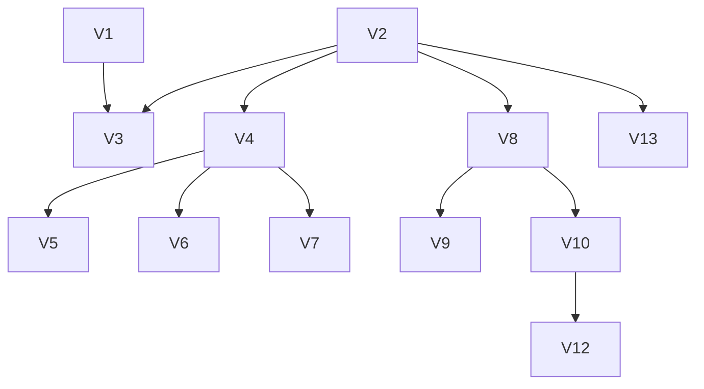

# 数据库迁移策略

<cite>
**本文引用的文件**
- [application.yml](file://oa-app/src/main/resources/application.yml)
- [V1__init_sys_tables.sql](file://oa-app/src/main/resources/db/migration/V1__init_sys_tables.sql)
- [V2__init_biz_tables.sql](file://oa-app/src/main/resources/db/migration/V2__init_biz_tables.sql)
- [V3__seed_data.sql](file://oa-app/src/main/resources/db/migration/V3__seed_data.sql)
- [V4__phase2_flow_design.sql](file://oa-app/src/main/resources/db/migration/V4__phase2_flow_design.sql)
- [V5__phase3a_instance_enhancement.sql](file://oa-app/src/main/resources/db/migration/V5__phase3a_instance_enhancement.sql)
- [V6__phase3b_bug_fixes.sql](file://oa-app/src/main/resources/db/migration/V6__phase3b_bug_fixes.sql)
- [V7__phase3b_notification.sql](file://oa-app/src/main/resources/db/migration/V7__phase3b_notification.sql)
- [V8__leave_module.sql](file://oa-app/src/main/resources/db/migration/V8__leave_module.sql)
- [V9__leave_approval_integration.sql](file://oa-app/src/main/resources/db/migration/V9__leave_approval_integration.sql)
- [V10__leave_template_seed.sql](file://oa-app/src/main/resources/db/migration/V10__leave_template_seed.sql)
- [V11__system_management_permissions.sql](file://oa-app/src/main/resources/db/migration/V11__system_management_permissions.sql)
- [V12__leave_template_bpmn_diagram.sql](file://oa-app/src/main/resources/db/migration/V12__leave_template_bpmn_diagram.sql)
- [V13__approval_base_entity_columns.sql](file://oa-app/src/main/resources/db/migration/V13__approval_base_entity_columns.sql)
- [FlywayVersionResolver.java](file://oa-generator/src/main/java/com/oa/admin/generator/engine/FlywayVersionResolver.java)
- [flyway.ftl](file://oa-generator/src/main/resources/templates/flyway.ftl)
</cite>

## 目录
1. [引言](#引言)
2. [项目结构](#项目结构)
3. [核心组件](#核心组件)
4. [架构总览](#架构总览)
5. [详细组件分析](#详细组件分析)
6. [依赖关系分析](#依赖关系分析)
7. [性能考量](#性能考量)
8. [故障排查指南](#故障排查指南)
9. [结论](#结论)
10. [附录](#附录)

## 引言
本文件面向OA审批管理系统，系统化阐述数据库迁移策略与Flyway版本控制实践。内容覆盖迁移脚本命名规范、版本号管理、回滚策略；数据库演进设计（向后兼容、数据迁移、升级流程）；迁移脚本编写规范（DDL组织、事务处理、错误处理）；生产环境迁移安全策略（备份恢复、灰度发布、影响评估）；以及迁移最佳实践（测试策略、监控告警、回滚预案）。文档以实际仓库中的迁移脚本与配置为依据，确保可落地、可验证。

## 项目结构
OA审批管理系统的数据库迁移脚本位于资源目录下，采用Flyway标准命名约定，按版本顺序递增。Spring Boot应用通过application.yml启用Flyway，并指定迁移脚本位置。生成器模块包含Flyway版本解析器与模板，用于自动化生成迁移脚本。

**图表来源**
- [application.yml:25-29](file://oa-app/src/main/resources/application.yml#L25-L29)
- [V1__init_sys_tables.sql:1-84](file://oa-app/src/main/resources/db/migration/V1__init_sys_tables.sql#L1-L84)
- [V2__init_biz_tables.sql:1-74](file://oa-app/src/main/resources/db/migration/V2__init_biz_tables.sql#L1-L74)
- [V3__seed_data.sql:1-90](file://oa-app/src/main/resources/db/migration/V3__seed_data.sql#L1-L90)
- [V4__phase2_flow_design.sql:1-32](file://oa-app/src/main/resources/db/migration/V4__phase2_flow_design.sql#L1-L32)
- [V5__phase3a_instance_enhancement.sql:1-4](file://oa-app/src/main/resources/db/migration/V5__phase3a_instance_enhancement.sql#L1-L4)
- [V6__phase3b_bug_fixes.sql:1-4](file://oa-app/src/main/resources/db/migration/V6__phase3b_bug_fixes.sql#L1-L4)
- [V7__phase3b_notification.sql:1-16](file://oa-app/src/main/resources/db/migration/V7__phase3b_notification.sql#L1-L16)
- [V8__leave_module.sql:1-20](file://oa-app/src/main/resources/db/migration/V8__leave_module.sql#L1-L20)
- [V9__leave_approval_integration.sql:1-5](file://oa-app/src/main/resources/db/migration/V9__leave_approval_integration.sql#L1-L5)
- [V10__leave_template_seed.sql:1-77](file://oa-app/src/main/resources/db/migration/V10__leave_template_seed.sql#L1-L77)
- [V11__system_management_permissions.sql:1-47](file://oa-app/src/main/resources/db/migration/V11__system_management_permissions.sql#L1-L47)
- [V12__leave_template_bpmn_diagram.sql:1-108](file://oa-app/src/main/resources/db/migration/V12__leave_template_bpmn_diagram.sql#L1-L108)
- [V13__approval_base_entity_columns.sql:1-13](file://oa-app/src/main/resources/db/migration/V13__approval_base_entity_columns.sql#L1-L13)
- [FlywayVersionResolver.java:1-36](file://oa-generator/src/main/java/com/oa/admin/generator/engine/FlywayVersionResolver.java#L1-L36)
- [flyway.ftl:1-21](file://oa-generator/src/main/resources/templates/flyway.ftl#L1-L21)

**章节来源**
- [application.yml:25-29](file://oa-app/src/main/resources/application.yml#L25-L29)

## 核心组件
- 迁移脚本集合：按版本顺序排列，涵盖系统表初始化、业务表初始化、种子数据、流程设计增强、通知系统、请假模块、模板与BPMN图、实体列对齐等。
- Flyway配置：在应用启动时自动执行迁移，支持基线迁移、禁用占位符替换等。
- 生成器与版本解析：提供版本号推导能力，模板用于批量生成标准迁移脚本。

**章节来源**
- [V1__init_sys_tables.sql:1-84](file://oa-app/src/main/resources/db/migration/V1__init_sys_tables.sql#L1-L84)
- [V2__init_biz_tables.sql:1-74](file://oa-app/src/main/resources/db/migration/V2__init_biz_tables.sql#L1-L74)
- [V3__seed_data.sql:1-90](file://oa-app/src/main/resources/db/migration/V3__seed_data.sql#L1-L90)
- [application.yml:25-29](file://oa-app/src/main/resources/application.yml#L25-L29)
- [FlywayVersionResolver.java:1-36](file://oa-generator/src/main/java/com/oa/admin/generator/engine/FlywayVersionResolver.java#L1-L36)
- [flyway.ftl:1-21](file://oa-generator/src/main/resources/templates/flyway.ftl#L1-L21)

## 架构总览
系统通过Flyway在应用启动阶段自动执行迁移脚本，确保数据库结构与应用版本一致。迁移脚本遵循命名规范与版本演进策略，结合生成器模板与版本解析器，形成从“设计—生成—部署”的闭环。

**图表来源**
- [application.yml:25-29](file://oa-app/src/main/resources/application.yml#L25-L29)

## 详细组件分析

### 迁移脚本命名规范与版本号管理
- 命名规范：V{版本号}__{简要描述}.sql，版本号严格递增，描述清晰表达变更目的。
- 版本解析：生成器提供版本解析器，扫描现有脚本目录，基于最大版本号+1生成新版本号，避免冲突。
- 模板生成：模板统一生成标准表结构、索引与通用列，减少手写错误。

**图表来源**
- [FlywayVersionResolver.java:17-34](file://oa-generator/src/main/java/com/oa/admin/generator/engine/FlywayVersionResolver.java#L17-L34)

**章节来源**
- [FlywayVersionResolver.java:1-36](file://oa-generator/src/main/java/com/oa/admin/generator/engine/FlywayVersionResolver.java#L1-L36)
- [flyway.ftl:1-21](file://oa-generator/src/main/resources/templates/flyway.ftl#L1-L21)

### 数据库演进设计与向后兼容
- 系统表与业务表分离：V1/V2分别初始化RBAC与审批业务表，确保模块边界清晰。
- 渐进式增强：V4引入流程设计支持与节点配置表；V5增加复合索引优化查询；V6补充抄送配置；V7引入通知表；V8-V9集成请假模块与审批绑定。
- 兼容性保障：V10-V12为请假模板注入BPMN与DI信息；V13对齐实体通用列，适配MyBatis-Plus逻辑删除与更新时间字段。

**图表来源**
- [V1__init_sys_tables.sql:1-84](file://oa-app/src/main/resources/db/migration/V1__init_sys_tables.sql#L1-L84)
- [V2__init_biz_tables.sql:1-74](file://oa-app/src/main/resources/db/migration/V2__init_biz_tables.sql#L1-L74)
- [V4__phase2_flow_design.sql:1-32](file://oa-app/src/main/resources/db/migration/V4__phase2_flow_design.sql#L1-L32)
- [V5__phase3a_instance_enhancement.sql:1-4](file://oa-app/src/main/resources/db/migration/V5__phase3a_instance_enhancement.sql#L1-L4)
- [V6__phase3b_bug_fixes.sql:1-4](file://oa-app/src/main/resources/db/migration/V6__phase3b_bug_fixes.sql#L1-L4)
- [V7__phase3b_notification.sql:1-16](file://oa-app/src/main/resources/db/migration/V7__phase3b_notification.sql#L1-L16)
- [V8__leave_module.sql:1-20](file://oa-app/src/main/resources/db/migration/V8__leave_module.sql#L1-L20)
- [V9__leave_approval_integration.sql:1-5](file://oa-app/src/main/resources/db/migration/V9__leave_approval_integration.sql#L1-L5)
- [V10__leave_template_seed.sql:1-77](file://oa-app/src/main/resources/db/migration/V10__leave_template_seed.sql#L1-L77)
- [V12__leave_template_bpmn_diagram.sql:1-108](file://oa-app/src/main/resources/db/migration/V12__leave_template_bpmn_diagram.sql#L1-L108)
- [V13__approval_base_entity_columns.sql:1-13](file://oa-app/src/main/resources/db/migration/V13__approval_base_entity_columns.sql#L1-L13)

**章节来源**
- [V1__init_sys_tables.sql:1-84](file://oa-app/src/main/resources/db/migration/V1__init_sys_tables.sql#L1-L84)
- [V2__init_biz_tables.sql:1-74](file://oa-app/src/main/resources/db/migration/V2__init_biz_tables.sql#L1-L74)
- [V10__leave_template_seed.sql:1-77](file://oa-app/src/main/resources/db/migration/V10__leave_template_seed.sql#L1-L77)
- [V12__leave_template_bpmn_diagram.sql:1-108](file://oa-app/src/main/resources/db/migration/V12__leave_template_bpmn_diagram.sql#L1-L108)
- [V13__approval_base_entity_columns.sql:1-13](file://oa-app/src/main/resources/db/migration/V13__approval_base_entity_columns.sql#L1-L13)

### 数据迁移方案与版本升级流程
- 数据迁移：V3种子数据初始化管理员、部门、角色与权限；V10种子模板插入请假流程定义；V11追加系统管理API权限并授权；V12为模板注入BPMN DI信息。
- 升级流程：先执行DDL结构变更，再执行数据变更；使用ON DUPLICATE KEY UPDATE与INSERT IGNORE等幂性写法降低风险；通过复合索引与列对齐提升查询与持久化一致性。

**图表来源**
- [V3__seed_data.sql:1-90](file://oa-app/src/main/resources/db/migration/V3__seed_data.sql#L1-L90)
- [V10__leave_template_seed.sql:1-77](file://oa-app/src/main/resources/db/migration/V10__leave_template_seed.sql#L1-L77)
- [V11__system_management_permissions.sql:1-47](file://oa-app/src/main/resources/db/migration/V11__system_management_permissions.sql#L1-L47)
- [V12__leave_template_bpmn_diagram.sql:1-108](file://oa-app/src/main/resources/db/migration/V12__leave_template_bpmn_diagram.sql#L1-L108)
- [V5__phase3a_instance_enhancement.sql:1-4](file://oa-app/src/main/resources/db/migration/V5__phase3a_instance_enhancement.sql#L1-L4)
- [V8__leave_module.sql:1-20](file://oa-app/src/main/resources/db/migration/V8__leave_module.sql#L1-L20)
- [V9__leave_approval_integration.sql:1-5](file://oa-app/src/main/resources/db/migration/V9__leave_approval_integration.sql#L1-L5)

**章节来源**
- [V3__seed_data.sql:1-90](file://oa-app/src/main/resources/db/migration/V3__seed_data.sql#L1-L90)
- [V10__leave_template_seed.sql:1-77](file://oa-app/src/main/resources/db/migration/V10__leave_template_seed.sql#L1-L77)
- [V11__system_management_permissions.sql:1-47](file://oa-app/src/main/resources/db/migration/V11__system_management_permissions.sql#L1-L47)
- [V12__leave_template_bpmn_diagram.sql:1-108](file://oa-app/src/main/resources/db/migration/V12__leave_template_bpmn_diagram.sql#L1-L108)

### 迁移脚本编写规范
- DDL组织：先建表（含主键、索引、注释），再做列变更（ADD COLUMN），最后补充索引；保持原子性与可回溯性。
- 事务处理：Flyway默认每个脚本在一个事务内执行，建议将大变更拆分为多个小脚本，便于失败回滚与重试。
- 错误处理：使用幂等写法（INSERT IGNORE/ON DUPLICATE KEY UPDATE）；对DDL变更进行前置检查（如索引存在性判断）；对数据变更设置条件约束，避免重复执行造成副作用。

**章节来源**
- [V4__phase2_flow_design.sql:1-32](file://oa-app/src/main/resources/db/migration/V4__phase2_flow_design.sql#L1-L32)
- [V11__system_management_permissions.sql:1-47](file://oa-app/src/main/resources/db/migration/V11__system_management_permissions.sql#L1-L47)
- [V12__leave_template_bpmn_diagram.sql:1-108](file://oa-app/src/main/resources/db/migration/V12__leave_template_bpmn_diagram.sql#L1-L108)

### 生产环境迁移安全策略
- 备份与恢复：迁移前对关键表（biz_process_template、sys_user等）进行全量备份；保留最近一次成功迁移的快照以便快速回滚。
- 灰度发布：分批迁移（先测试环境，再预生产，最后生产）；对大表变更采用分批处理与限速策略。
- 影响评估：评估DDL锁表时间、索引重建成本、数据量增长；对高并发场景选择低峰时段执行。

**章节来源**
- [application.yml:25-29](file://oa-app/src/main/resources/application.yml#L25-L29)

### 回滚策略
- 可逆性设计：优先使用ALTER TABLE添加列/索引，必要时通过Vn+1脚本撤销；对重要数据变更采用软删除或历史表。
- 手动回滚：当出现不可逆变更时，按相反顺序执行降级脚本（Vn→Vn-1），并配合备份恢复。
- 自动回滚：在CI/CD中加入迁移失败自动回滚步骤，确保系统回到上一个稳定版本。

**章节来源**
- [application.yml:25-29](file://oa-app/src/main/resources/application.yml#L25-L29)

## 依赖关系分析
迁移脚本之间存在显式依赖：V1/V2为基础表，V3在此基础上插入种子数据；V4引入流程设计与节点配置，V5/V6/V7在此基础上扩展；V8-V9引入请假模块并与审批实例关联；V10-V12为模板注入BPMN与DI；V13对齐实体列。生成器模块通过版本解析器与模板辅助脚本生成，降低手工维护成本。

**图表来源**
- [V1__init_sys_tables.sql:1-84](file://oa-app/src/main/resources/db/migration/V1__init_sys_tables.sql#L1-L84)
- [V2__init_biz_tables.sql:1-74](file://oa-app/src/main/resources/db/migration/V2__init_biz_tables.sql#L1-L74)
- [V3__seed_data.sql:1-90](file://oa-app/src/main/resources/db/migration/V3__seed_data.sql#L1-L90)
- [V4__phase2_flow_design.sql:1-32](file://oa-app/src/main/resources/db/migration/V4__phase2_flow_design.sql#L1-L32)
- [V5__phase3a_instance_enhancement.sql:1-4](file://oa-app/src/main/resources/db/migration/V5__phase3a_instance_enhancement.sql#L1-L4)
- [V6__phase3b_bug_fixes.sql:1-4](file://oa-app/src/main/resources/db/migration/V6__phase3b_bug_fixes.sql#L1-L4)
- [V7__phase3b_notification.sql:1-16](file://oa-app/src/main/resources/db/migration/V7__phase3b_notification.sql#L1-L16)
- [V8__leave_module.sql:1-20](file://oa-app/src/main/resources/db/migration/V8__leave_module.sql#L1-L20)
- [V9__leave_approval_integration.sql:1-5](file://oa-app/src/main/resources/db/migration/V9__leave_approval_integration.sql#L1-L5)
- [V10__leave_template_seed.sql:1-77](file://oa-app/src/main/resources/db/migration/V10__leave_template_seed.sql#L1-L77)
- [V12__leave_template_bpmn_diagram.sql:1-108](file://oa-app/src/main/resources/db/migration/V12__leave_template_bpmn_diagram.sql#L1-L108)
- [V13__approval_base_entity_columns.sql:1-13](file://oa-app/src/main/resources/db/migration/V13__approval_base_entity_columns.sql#L1-L13)

**章节来源**
- [V1__init_sys_tables.sql:1-84](file://oa-app/src/main/resources/db/migration/V1__init_sys_tables.sql#L1-L84)
- [V2__init_biz_tables.sql:1-74](file://oa-app/src/main/resources/db/migration/V2__init_biz_tables.sql#L1-L74)
- [V3__seed_data.sql:1-90](file://oa-app/src/main/resources/db/migration/V3__seed_data.sql#L1-L90)
- [V4__phase2_flow_design.sql:1-32](file://oa-app/src/main/resources/db/migration/V4__phase2_flow_design.sql#L1-L32)
- [V5__phase3a_instance_enhancement.sql:1-4](file://oa-app/src/main/resources/db/migration/V5__phase3a_instance_enhancement.sql#L1-L4)
- [V6__phase3b_bug_fixes.sql:1-4](file://oa-app/src/main/resources/db/migration/V6__phase3b_bug_fixes.sql#L1-L4)
- [V7__phase3b_notification.sql:1-16](file://oa-app/src/main/resources/db/migration/V7__phase3b_notification.sql#L1-L16)
- [V8__leave_module.sql:1-20](file://oa-app/src/main/resources/db/migration/V8__leave_module.sql#L1-L20)
- [V9__leave_approval_integration.sql:1-5](file://oa-app/src/main/resources/db/migration/V9__leave_approval_integration.sql#L1-L5)
- [V10__leave_template_seed.sql:1-77](file://oa-app/src/main/resources/db/migration/V10__leave_template_seed.sql#L1-L77)
- [V12__leave_template_bpmn_diagram.sql:1-108](file://oa-app/src/main/resources/db/migration/V12__leave_template_bpmn_diagram.sql#L1-L108)
- [V13__approval_base_entity_columns.sql:1-13](file://oa-app/src/main/resources/db/migration/V13__approval_base_entity_columns.sql#L1-L13)

## 性能考量
- 索引优化：V5为实例查询增加复合索引；V8/V9为请假模块建立常用查询索引，降低查询延迟。
- DDL锁表：对大表结构变更采用在线DDL或分批处理，避免长时间锁表。
- 查询性能：通过索引与列对齐（V13）提升查询效率与一致性。

**章节来源**
- [V5__phase3a_instance_enhancement.sql:1-4](file://oa-app/src/main/resources/db/migration/V5__phase3a_instance_enhancement.sql#L1-L4)
- [V8__leave_module.sql:1-20](file://oa-app/src/main/resources/db/migration/V8__leave_module.sql#L1-L20)
- [V9__leave_approval_integration.sql:1-5](file://oa-app/src/main/resources/db/migration/V9__leave_approval_integration.sql#L1-L5)
- [V13__approval_base_entity_columns.sql:1-13](file://oa-app/src/main/resources/db/migration/V13__approval_base_entity_columns.sql#L1-L13)

## 故障排查指南
- 迁移失败：检查应用日志与Flyway元数据表；确认脚本语法与依赖顺序；使用幂等写法修复重复执行问题。
- 数据不一致：核对种子数据与模板是否正确导入；检查ON DUPLICATE KEY UPDATE条件是否满足。
- 性能问题：分析慢查询日志，评估索引使用情况；对高频查询补充合适索引。

**章节来源**
- [application.yml:25-29](file://oa-app/src/main/resources/application.yml#L25-L29)

## 结论
本项目通过标准化的迁移脚本命名、严格的版本演进与幂等写法，结合生成器模板与版本解析器，实现了可追溯、可回滚、可灰度的数据库迁移体系。生产环境应坚持“先备份、后灰度、再回滚”的原则，确保系统稳定性与数据安全。

## 附录
- 迁移脚本清单（按版本）
  - V1：系统RBAC表初始化
  - V2：业务审批表初始化
  - V3：种子数据（管理员、部门、角色、权限）
  - V4：流程设计增强（BPMN存储、节点配置表）
  - V5：实例查询优化（复合索引）
  - V6：节点配置增强（抄送配置）
  - V7：通知系统
  - V8：请假模块
  - V9：请假与审批实例集成
  - V10：请假模板种子数据
  - V11：系统管理API权限与授权
  - V12：模板BPMN DI渲染
  - V13：实体列对齐（逻辑删除、更新时间）

**章节来源**
- [V1__init_sys_tables.sql:1-84](file://oa-app/src/main/resources/db/migration/V1__init_sys_tables.sql#L1-L84)
- [V2__init_biz_tables.sql:1-74](file://oa-app/src/main/resources/db/migration/V2__init_biz_tables.sql#L1-L74)
- [V3__seed_data.sql:1-90](file://oa-app/src/main/resources/db/migration/V3__seed_data.sql#L1-L90)
- [V4__phase2_flow_design.sql:1-32](file://oa-app/src/main/resources/db/migration/V4__phase2_flow_design.sql#L1-L32)
- [V5__phase3a_instance_enhancement.sql:1-4](file://oa-app/src/main/resources/db/migration/V5__phase3a_instance_enhancement.sql#L1-L4)
- [V6__phase3b_bug_fixes.sql:1-4](file://oa-app/src/main/resources/db/migration/V6__phase3b_bug_fixes.sql#L1-L4)
- [V7__phase3b_notification.sql:1-16](file://oa-app/src/main/resources/db/migration/V7__phase3b_notification.sql#L1-L16)
- [V8__leave_module.sql:1-20](file://oa-app/src/main/resources/db/migration/V8__leave_module.sql#L1-L20)
- [V9__leave_approval_integration.sql:1-5](file://oa-app/src/main/resources/db/migration/V9__leave_approval_integration.sql#L1-L5)
- [V10__leave_template_seed.sql:1-77](file://oa-app/src/main/resources/db/migration/V10__leave_template_seed.sql#L1-L77)
- [V11__system_management_permissions.sql:1-47](file://oa-app/src/main/resources/db/migration/V11__system_management_permissions.sql#L1-L47)
- [V12__leave_template_bpmn_diagram.sql:1-108](file://oa-app/src/main/resources/db/migration/V12__leave_template_bpmn_diagram.sql#L1-L108)
- [V13__approval_base_entity_columns.sql:1-13](file://oa-app/src/main/resources/db/migration/V13__approval_base_entity_columns.sql#L1-L13)