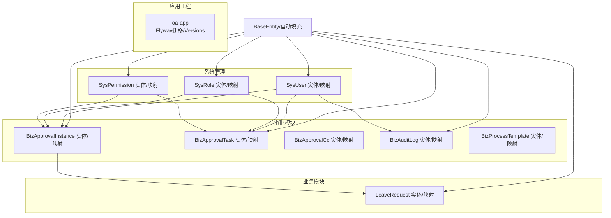
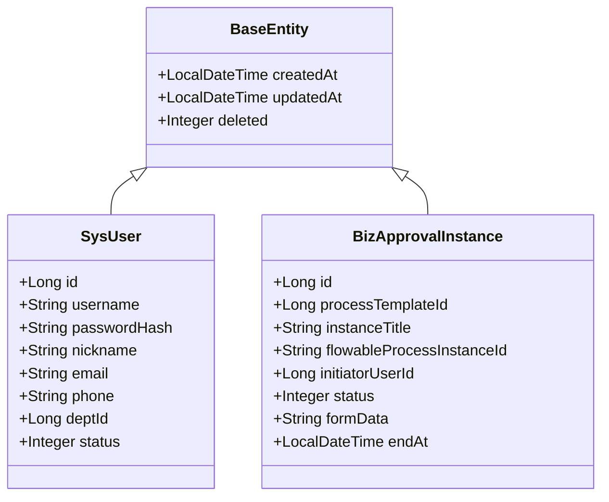
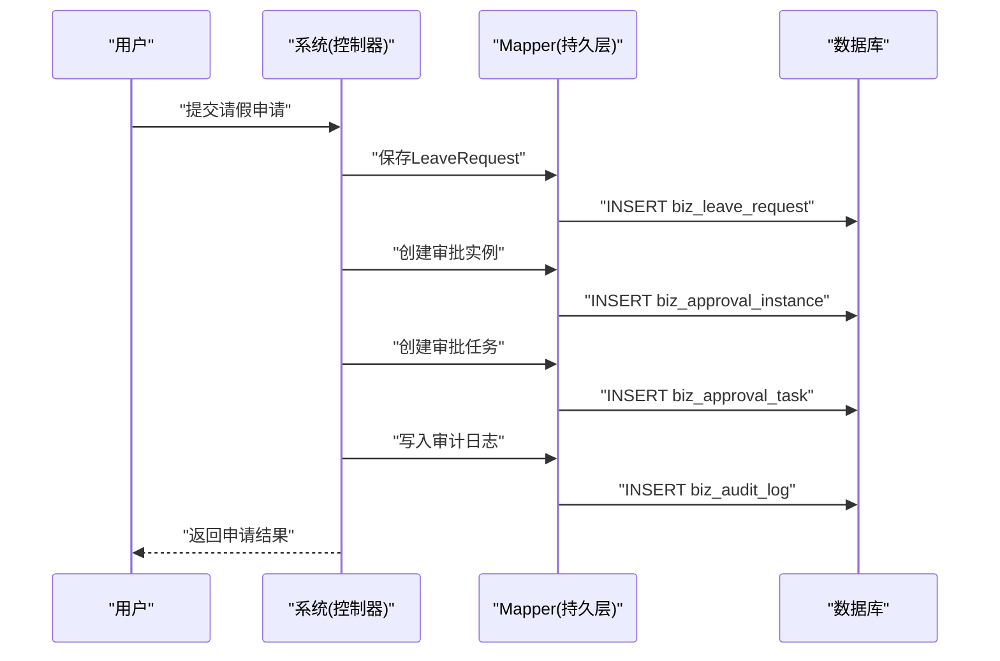
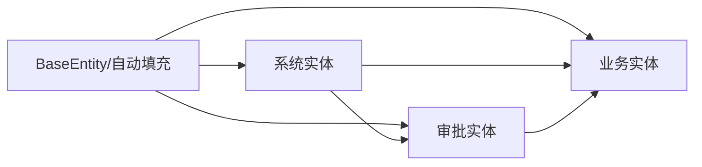

# 数据架构设计

<cite>
**本文引用的文件**
- [V1__init_sys_tables.sql](file://oa-app/src/main/resources/db/migration/V1__init_sys_tables.sql)
- [V2__init_biz_tables.sql](file://oa-app/src/main/resources/db/migration/V2__init_biz_tables.sql)
- [V3__seed_data.sql](file://oa-app/src/main/resources/db/migration/V3__seed_data.sql)
- [BaseEntity.java](file://oa-common/src/main/java/com/oa/admin/common/entity/BaseEntity.java)
- [MyBatisPlusAutoFillHandler.java](file://oa-common/src/main/java/com/oa/admin/common/config/MyBatisPlusAutoFillHandler.java)
- [SysUser.java](file://oa-system/src/main/java/com/oa/admin/system/entity/SysUser.java)
- [SysRole.java](file://oa-system/src/main/java/com/oa/admin/system/entity/SysRole.java)
- [SysPermission.java](file://oa-system/src/main/java/com/oa/admin/system/entity/SysPermission.java)
- [BizApprovalInstance.java](file://oa-approval/src/main/java/com/oa/admin/approval/entity/BizApprovalInstance.java)
- [BizApprovalTask.java](file://oa-approval/src/main/java/com/oa/admin/approval/entity/BizApprovalTask.java)
- [BizAuditLog.java](file://oa-approval/src/main/java/com/oa/admin/approval/entity/BizAuditLog.java)
- [LeaveRequest.java](file://oa-leave/src/main/java/com/oa/admin/leave/entity/LeaveRequest.java)
- [BizApprovalInstanceMapper.java](file://oa-approval/src/main/java/com/oa/admin/approval/mapper/BizApprovalInstanceMapper.java)
- [SysUserMapper.java](file://oa-system/src/main/java/com/oa/admin/system/mapper/SysUserMapper.java)
</cite>

## 目录
1. [简介](#简介)
2. [项目结构](#项目结构)
3. [核心组件](#核心组件)
4. [架构总览](#架构总览)
5. [详细组件分析](#详细组件分析)
6. [依赖分析](#依赖分析)
7. [性能考虑](#性能考虑)
8. [故障排查指南](#故障排查指南)
9. [结论](#结论)
10. [附录](#附录)

## 简介
本文件面向OA审批管理系统，提供系统级数据架构设计文档。内容涵盖数据库设计策略、表结构与索引规范、分层数据模型（基础数据层、业务数据层、审计数据层）、数据访问层设计模式（MyBatis-Plus CRUD、自动填充、分页优化）、一致性保障机制（事务、并发控制、校验规则），并给出ER图与数据流图，帮助开发者与运维人员理解数据在系统中的流转与存储策略。

## 项目结构
系统采用多模块分层组织：
- 基础设施与通用能力：oa-common（公共实体、自动填充、结果封装等）
- 系统管理模块：oa-system（RBAC用户、角色、权限、部门）
- 审批模块：oa-approval（流程模板、审批实例、任务、抄送、审计日志）
- 业务模块：oa-leave（请假申请，与审批实例关联）
- 应用工程：oa-app（Flyway迁移脚本、流程定义、应用配置）



图表来源
- [SysUser.java:1-27](file://oa-system/src/main/java/com/oa/admin/system/entity/SysUser.java#L1-L27)
- [SysRole.java:1-26](file://oa-system/src/main/java/com/oa/admin/system/entity/SysRole.java#L1-L26)
- [SysPermission.java:1-35](file://oa-system/src/main/java/com/oa/admin/system/entity/SysPermission.java#L1-L35)
- [BizApprovalInstance.java:1-33](file://oa-approval/src/main/java/com/oa/admin/approval/entity/BizApprovalInstance.java#L1-L33)
- [BizApprovalTask.java:1-35](file://oa-approval/src/main/java/com/oa/admin/approval/entity/BizApprovalTask.java#L1-L35)
- [BizAuditLog.java:1-28](file://oa-approval/src/main/java/com/oa/admin/approval/entity/BizAuditLog.java#L1-L28)
- [LeaveRequest.java:1-48](file://oa-leave/src/main/java/com/oa/admin/leave/entity/LeaveRequest.java#L1-L48)
- [BaseEntity.java:1-26](file://oa-common/src/main/java/com/oa/admin/common/entity/BaseEntity.java#L1-L26)

章节来源
- [V1__init_sys_tables.sql:1-84](file://oa-app/src/main/resources/db/migration/V1__init_sys_tables.sql#L1-L84)
- [V2__init_biz_tables.sql:1-74](file://oa-app/src/main/resources/db/migration/V2__init_biz_tables.sql#L1-L74)
- [V3__seed_data.sql:1-90](file://oa-app/src/main/resources/db/migration/V3__seed_data.sql#L1-L90)

## 核心组件
- 公共基类与自动填充
  - BaseEntity：统一createdAt、updatedAt、deleted字段，支持逻辑删除
  - MyBatisPlusAutoFillHandler：自动填充插入/更新时间
- 系统管理实体：SysUser、SysRole、SysPermission及其关联表
- 审批业务实体：BizApprovalInstance、BizApprovalTask、BizAuditLog、BizProcessTemplate、BizApprovalCc
- 业务实体：LeaveRequest（与审批实例关联）

章节来源
- [BaseEntity.java:1-26](file://oa-common/src/main/java/com/oa/admin/common/entity/BaseEntity.java#L1-L26)
- [MyBatisPlusAutoFillHandler.java:1-25](file://oa-common/src/main/java/com/oa/admin/common/config/MyBatisPlusAutoFillHandler.java#L1-L25)
- [SysUser.java:1-27](file://oa-system/src/main/java/com/oa/admin/system/entity/SysUser.java#L1-L27)
- [SysRole.java:1-26](file://oa-system/src/main/java/com/oa/admin/system/entity/SysRole.java#L1-L26)
- [SysPermission.java:1-35](file://oa-system/src/main/java/com/oa/admin/system/entity/SysPermission.java#L1-L35)
- [BizApprovalInstance.java:1-33](file://oa-approval/src/main/java/com/oa/admin/approval/entity/BizApprovalInstance.java#L1-L33)
- [BizApprovalTask.java:1-35](file://oa-approval/src/main/java/com/oa/admin/approval/entity/BizApprovalTask.java#L1-L35)
- [BizAuditLog.java:1-28](file://oa-approval/src/main/java/com/oa/admin/approval/entity/BizAuditLog.java#L1-L28)
- [LeaveRequest.java:1-48](file://oa-leave/src/main/java/com/oa/admin/leave/entity/LeaveRequest.java#L1-L48)

## 架构总览
系统采用“三层数据模型+数据访问层”的架构：
- 基础数据层：用户、角色、权限、部门，支撑系统身份与授权
- 业务数据层：流程模板、审批实例、审批任务、抄送、请假申请
- 审计数据层：操作日志，记录用户行为轨迹
- 数据访问层：基于MyBatis-Plus的Mapper接口与自动填充，统一CRUD与时间戳维护

```mermaid
erDiagram
SYS_USER {
bigint id PK
varchar username UK
varchar password_hash
varchar nickname
varchar email
varchar phone
bigint dept_id
tinyint status
datetime created_at
datetime updated_at
tinyint deleted
}
SYS_DEPT {
bigint id PK
bigint parent_id
varchar dept_name
int sort
bigint leader_user_id
tinyint status
datetime created_at
datetime updated_at
tinyint deleted
}
SYS_ROLE {
bigint id PK
varchar role_name
varchar role_key UK
int sort
tinyint data_scope
tinyint status
datetime created_at
datetime updated_at
tinyint deleted
}
SYS_PERMISSION {
bigint id PK
bigint parent_id
varchar permission_name
tinyint permission_type
varchar path
varchar component
varchar icon
int sort
tinyint status
datetime created_at
datetime updated_at
tinyint deleted
}
SYS_USER_ROLE {
bigint id PK
bigint user_id
bigint role_id
}
SYS_ROLE_PERMISSION {
bigint id PK
bigint role_id
bigint permission_id
}
SYS_ROLE_DEPT {
bigint id PK
bigint role_id
bigint dept_id
}
SYS_USER ||--o{ SYS_USER_ROLE : "拥有"
SYS_ROLE ||--o{ SYS_USER_ROLE : "授予"
SYS_ROLE ||--o{ SYS_ROLE_PERMISSION : "授权"
SYS_PERMISSION ||--o{ SYS_ROLE_PERMISSION : "被授权"
SYS_DEPT ||--o{ SYS_USER : "归属"
-- 审批相关
BIZ_PROCESS_TEMPLATE {
bigint id PK
varchar template_name
varchar template_key UK
varchar flowable_process_definition_id
text form_config
int version
tinyint status
datetime created_at
datetime updated_at
tinyint deleted
}
BIZ_APPROVAL_INSTANCE {
bigint id PK
bigint process_template_id
varchar instance_title
varchar flowable_process_instance_id
bigint initiator_user_id
tinyint status
text form_data
datetime created_at
datetime updated_at
datetime end_at
}
BIZ_APPROVAL_TASK {
bigint id PK
bigint approval_instance_id
varchar flowable_task_id
bigint assignee_user_id
varchar task_name
tinyint task_result
varchar task_comment
datetime created_at
datetime completed_at
}
BIZ_APPROVAL_CC {
bigint id PK
bigint approval_instance_id
bigint cc_user_id
varchar cc_reason
datetime read_at
datetime created_at
}
BIZ_AUDIT_LOG {
bigint id PK
bigint user_id
varchar module
varchar action
varchar target_type
bigint target_id
text detail
varchar ip
datetime created_at
}
BIZ_LEAVE_REQUEST {
bigint id PK
varchar title
int leave_type
datetime start_time
datetime end_time
varchar reason
bigint applicant_user_id
int status
bigint approval_instance_id
}
SYS_USER ||--o{ BIZ_APPROVAL_INSTANCE : "发起"
SYS_USER ||--o{ BIZ_APPROVAL_TASK : "指派/处理"
SYS_USER ||--o{ BIZ_APPROVAL_CC : "抄送"
SYS_USER ||--o{ BIZ_AUDIT_LOG : "产生"
BIZ_PROCESS_TEMPLATE ||--o{ BIZ_APPROVAL_INSTANCE : "定义"
BIZ_APPROVAL_INSTANCE ||--o{ BIZ_APPROVAL_TASK : "包含"
BIZ_APPROVAL_INSTANCE ||--o{ BIZ_APPROVAL_CC : "抄送"
BIZ_APPROVAL_INSTANCE ||--o{ BIZ_LEAVE_REQUEST : "关联"
```

图表来源
- [V1__init_sys_tables.sql:1-84](file://oa-app/src/main/resources/db/migration/V1__init_sys_tables.sql#L1-L84)
- [V2__init_biz_tables.sql:1-74](file://oa-app/src/main/resources/db/migration/V2__init_biz_tables.sql#L1-L74)
- [SysUser.java:1-27](file://oa-system/src/main/java/com/oa/admin/system/entity/SysUser.java#L1-L27)
- [SysRole.java:1-26](file://oa-system/src/main/java/com/oa/admin/system/entity/SysRole.java#L1-L26)
- [SysPermission.java:1-35](file://oa-system/src/main/java/com/oa/admin/system/entity/SysPermission.java#L1-L35)
- [BizApprovalInstance.java:1-33](file://oa-approval/src/main/java/com/oa/admin/approval/entity/BizApprovalInstance.java#L1-L33)
- [BizApprovalTask.java:1-35](file://oa-approval/src/main/java/com/oa/admin/approval/entity/BizApprovalTask.java#L1-L35)
- [BizAuditLog.java:1-28](file://oa-approval/src/main/java/com/oa/admin/approval/entity/BizAuditLog.java#L1-L28)
- [LeaveRequest.java:1-48](file://oa-leave/src/main/java/com/oa/admin/leave/entity/LeaveRequest.java#L1-L48)

## 详细组件分析

### 基础数据层（用户、角色、权限）
- 设计原则
  - 使用逻辑删除字段deleted统一软删除，避免物理删除造成数据不可追溯
  - 用户名、角色key、模板key建立唯一约束，确保标识唯一性
  - 权限类型区分菜单、按钮、API，便于前端与后端权限控制
- 表结构要点
  - sys_user：用户名唯一、关联部门、状态、时间戳
  - sys_role：角色key唯一、数据范围（全部/本部门/自定义）
  - sys_permission：父子关系、类型、排序、状态
  - 关联表：sys_user_role、sys_role_permission、sys_role_dept
- 索引策略
  - sys_user(dept_id)、sys_dept(parent_id)、sys_permission(parent_id)用于树形查询与层级导航
  - sys_user(username, deleted)、sys_role(role_key, deleted)、biz_process_template(template_key, deleted)用于唯一性检索

章节来源
- [V1__init_sys_tables.sql:5-84](file://oa-app/src/main/resources/db/migration/V1__init_sys_tables.sql#L5-L84)
- [SysUser.java:1-27](file://oa-system/src/main/java/com/oa/admin/system/entity/SysUser.java#L1-L27)
- [SysRole.java:1-26](file://oa-system/src/main/java/com/oa/admin/system/entity/SysRole.java#L1-L26)
- [SysPermission.java:1-35](file://oa-system/src/main/java/com/oa/admin/system/entity/SysPermission.java#L1-L35)

### 业务数据层（请假申请、审批记录）
- 设计原则
  - 审批实例与流程模板解耦，支持模板版本化与复用
  - 审批任务与实例强关联，支持并行/会签/或签等复杂流程
  - 抄送记录与读取状态分离，便于消息提醒与追踪
  - 请假申请与审批实例关联，形成业务闭环
- 表结构要点
  - biz_process_template：模板key唯一、版本号、状态、表单配置
  - biz_approval_instance：标题、发起人、状态、表单数据、结束时间
  - biz_approval_task：任务节点、处理人、结果、意见、完成时间
  - biz_approval_cc：抄送人、抄送原因、读取时间
  - biz_audit_log：模块、动作、目标类型与ID、详情、IP、时间
  - biz_leave_request：标题、类型、起止时间、原因、申请人、状态、关联审批实例
- 索引策略
  - biz_approval_instance(template_id, initiator_user_id, status)
  - biz_approval_task(instance_id, assignee_user_id, task_result)
  - biz_approval_cc(instance_id, cc_user_id, read_at)
  - biz_audit_log(user_id, module, action, created_at)

章节来源
- [V2__init_biz_tables.sql:5-74](file://oa-app/src/main/resources/db/migration/V2__init_biz_tables.sql#L5-L74)
- [BizApprovalInstance.java:1-33](file://oa-approval/src/main/java/com/oa/admin/approval/entity/BizApprovalInstance.java#L1-L33)
- [BizApprovalTask.java:1-35](file://oa-approval/src/main/java/com/oa/admin/approval/entity/BizApprovalTask.java#L1-L35)
- [BizAuditLog.java:1-28](file://oa-approval/src/main/java/com/oa/admin/approval/entity/BizAuditLog.java#L1-L28)
- [LeaveRequest.java:1-48](file://oa-leave/src/main/java/com/oa/admin/leave/entity/LeaveRequest.java#L1-L48)

### 审计数据层（操作日志、流程轨迹）
- 设计原则
  - 审计日志独立存储，便于合规与问题追溯
  - 日志字段包含模块、动作、目标类型与ID、详情（JSON）、IP、时间
  - 流程轨迹通过审批任务与抄送记录体现，审计日志补充关键操作
- 索引策略
  - 按用户、模块动作、时间维度建立复合索引，支持快速检索与报表

章节来源
- [V2__init_biz_tables.sql:60-74](file://oa-app/src/main/resources/db/migration/V2__init_biz_tables.sql#L60-L74)
- [BizAuditLog.java:1-28](file://oa-approval/src/main/java/com/oa/admin/approval/entity/BizAuditLog.java#L1-L28)

### 数据访问层设计模式（MyBatis-Plus）
- 统一基类与自动填充
  - BaseEntity：所有实体继承，统一createdAt、updatedAt、deleted
  - MyBatisPlusAutoFillHandler：自动填充插入/更新时间，减少重复代码
- Mapper接口
  - 各实体均实现BaseMapper，天然具备CRUD能力
  - 示例：SysUserMapper、BizApprovalInstanceMapper等
- 分页查询优化
  - 使用Page对象进行分页，结合业务表的常用过滤字段建立索引，提升分页性能



图表来源
- [BaseEntity.java:1-26](file://oa-common/src/main/java/com/oa/admin/common/entity/BaseEntity.java#L1-L26)
- [SysUser.java:1-27](file://oa-system/src/main/java/com/oa/admin/system/entity/SysUser.java#L1-L27)
- [BizApprovalInstance.java:1-33](file://oa-approval/src/main/java/com/oa/admin/approval/entity/BizApprovalInstance.java#L1-L33)

章节来源
- [BaseEntity.java:1-26](file://oa-common/src/main/java/com/oa/admin/common/entity/BaseEntity.java#L1-L26)
- [MyBatisPlusAutoFillHandler.java:1-25](file://oa-common/src/main/java/com/oa/admin/common/config/MyBatisPlusAutoFillHandler.java#L1-L25)
- [SysUserMapper.java:1-13](file://oa-system/src/main/java/com/oa/admin/system/mapper/SysUserMapper.java#L1-L13)
- [BizApprovalInstanceMapper.java:1-13](file://oa-approval/src/main/java/com/oa/admin/approval/mapper/BizApprovalInstanceMapper.java#L1-L13)

### 数据一致性保障机制
- 事务管理
  - 审批流程涉及多个表写入（实例、任务、抄送、日志），应使用Spring声明式事务或编程式事务确保原子性
- 并发控制
  - 使用数据库锁（排他锁）或乐观锁（版本号）控制并发更新
  - 对关键状态变更（如审批任务结果）进行条件更新，避免竞态
- 数据校验规则
  - 唯一性：用户名、角色key、模板key
  - 约束性：外键关联、非空字段、枚举值范围
  - 业务规则：请假开始时间<=结束时间、状态机转换合法性

章节来源
- [V1__init_sys_tables.sql:63-83](file://oa-app/src/main/resources/db/migration/V1__init_sys_tables.sql#L63-L83)
- [V2__init_biz_tables.sql:19-58](file://oa-app/src/main/resources/db/migration/V2__init_biz_tables.sql#L19-L58)

### 数据流图（审批流程）


图表来源
- [LeaveRequest.java:1-48](file://oa-leave/src/main/java/com/oa/admin/leave/entity/LeaveRequest.java#L1-L48)
- [BizApprovalInstance.java:1-33](file://oa-approval/src/main/java/com/oa/admin/approval/entity/BizApprovalInstance.java#L1-L33)
- [BizApprovalTask.java:1-35](file://oa-approval/src/main/java/com/oa/admin/approval/entity/BizApprovalTask.java#L1-L35)
- [BizAuditLog.java:1-28](file://oa-approval/src/main/java/com/oa/admin/approval/entity/BizAuditLog.java#L1-L28)

## 依赖分析
- 组件内聚与耦合
  - 所有实体均继承BaseEntity，降低重复代码，提高内聚
  - 审批模块与系统模块通过用户ID建立弱耦合关联，职责清晰
- 外部依赖
  - MyBatis-Plus：提供通用Mapper与自动填充
  - Flyway：版本化迁移，确保数据库演进一致
- 可能的循环依赖
  - 当前模块间无直接循环依赖；若未来扩展跨模块引用，需通过服务层解耦



图表来源
- [BaseEntity.java:1-26](file://oa-common/src/main/java/com/oa/admin/common/entity/BaseEntity.java#L1-L26)
- [SysUser.java:1-27](file://oa-system/src/main/java/com/oa/admin/system/entity/SysUser.java#L1-L27)
- [BizApprovalInstance.java:1-33](file://oa-approval/src/main/java/com/oa/admin/approval/entity/BizApprovalInstance.java#L1-L33)
- [LeaveRequest.java:1-48](file://oa-leave/src/main/java/com/oa/admin/leave/entity/LeaveRequest.java#L1-L48)

章节来源
- [MyBatisPlusAutoFillHandler.java:1-25](file://oa-common/src/main/java/com/oa/admin/common/config/MyBatisPlusAutoFillHandler.java#L1-L25)
- [SysUser.java:1-27](file://oa-system/src/main/java/com/oa/admin/system/entity/SysUser.java#L1-L27)
- [BizApprovalInstance.java:1-33](file://oa-approval/src/main/java/com/oa/admin/approval/entity/BizApprovalInstance.java#L1-L33)
- [LeaveRequest.java:1-48](file://oa-leave/src/main/java/com/oa/admin/leave/entity/LeaveRequest.java#L1-L48)

## 性能考虑
- 索引优化
  - 为高频查询字段建立单列或复合索引：用户ID、模板ID、发起人、状态、时间
  - 避免过度索引导致写入性能下降
- 分页与排序
  - 使用Page对象分页，结合合适的排序字段与覆盖索引
- 写入优化
  - 批量插入/更新时合并SQL，减少网络往返
- 读写分离
  - 审计日志与报表查询可下沉至只读副本
- 缓存策略
  - 角色权限与模板配置可缓存，结合失效策略

## 故障排查指南
- 常见问题
  - 逻辑删除导致查询不到数据：确认deleted字段与查询条件
  - 唯一约束冲突：检查用户名、角色key、模板key是否重复
  - 审批状态异常：核对状态机转换与任务完成时间
- 排查步骤
  - 查看biz_audit_log定位关键操作
  - 核对biz_approval_instance与biz_approval_task的状态一致性
  - 检查索引是否存在及是否被正确使用

章节来源
- [V3__seed_data.sql:1-90](file://oa-app/src/main/resources/db/migration/V3__seed_data.sql#L1-L90)
- [BizAuditLog.java:1-28](file://oa-approval/src/main/java/com/oa/admin/approval/entity/BizAuditLog.java#L1-L28)

## 结论
本数据架构以“统一基类+自动填充”为基础，通过清晰的三层数据模型与严格的索引策略，实现了RBAC、审批流程与业务数据的解耦与高内聚。配合MyBatis-Plus的CRUD与分页能力，以及Flyway的版本化管理，系统具备良好的可维护性与扩展性。建议在生产环境中进一步完善事务边界、并发控制与缓存策略，并持续监控索引使用情况与慢查询。

## 附录
- 初始化脚本与种子数据
  - V1/V2/V3版本脚本定义了系统与业务表结构，包含索引与种子数据
- 实体与映射
  - 各模块实体均继承BaseEntity，Mapper接口基于BaseMapper

章节来源
- [V1__init_sys_tables.sql:1-84](file://oa-app/src/main/resources/db/migration/V1__init_sys_tables.sql#L1-L84)
- [V2__init_biz_tables.sql:1-74](file://oa-app/src/main/resources/db/migration/V2__init_biz_tables.sql#L1-L74)
- [V3__seed_data.sql:1-90](file://oa-app/src/main/resources/db/migration/V3__seed_data.sql#L1-L90)
- [BaseEntity.java:1-26](file://oa-common/src/main/java/com/oa/admin/common/entity/BaseEntity.java#L1-L26)
- [SysUserMapper.java:1-13](file://oa-system/src/main/java/com/oa/admin/system/mapper/SysUserMapper.java#L1-L13)
- [BizApprovalInstanceMapper.java:1-13](file://oa-approval/src/main/java/com/oa/admin/approval/mapper/BizApprovalInstanceMapper.java#L1-L13)