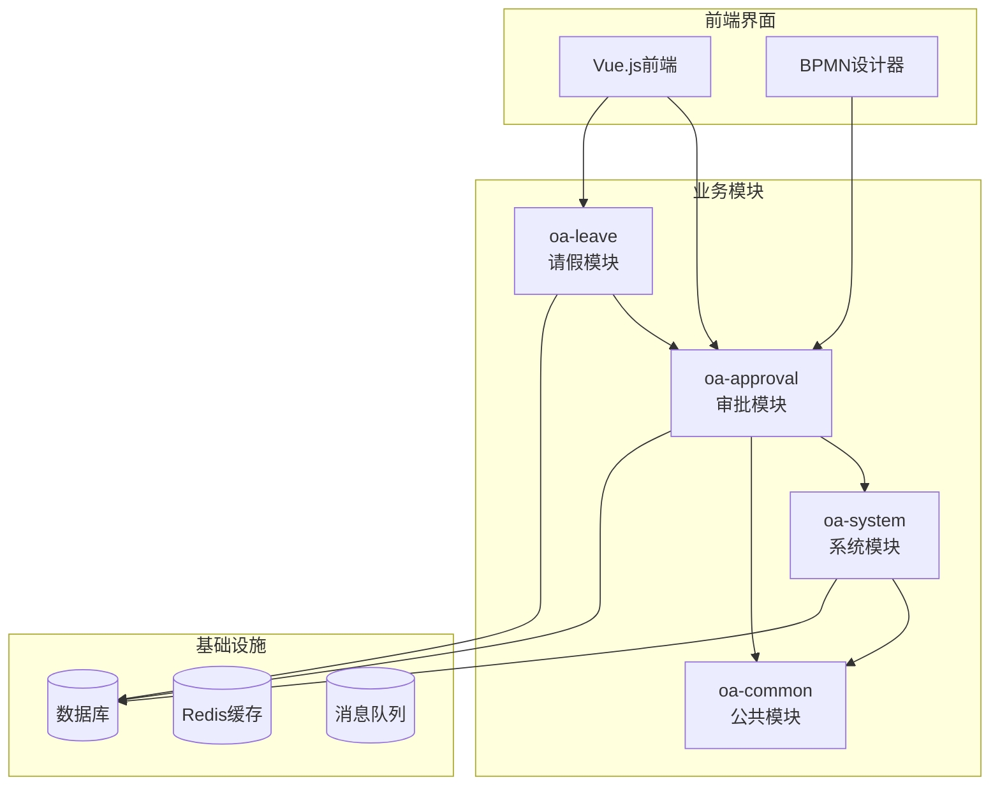
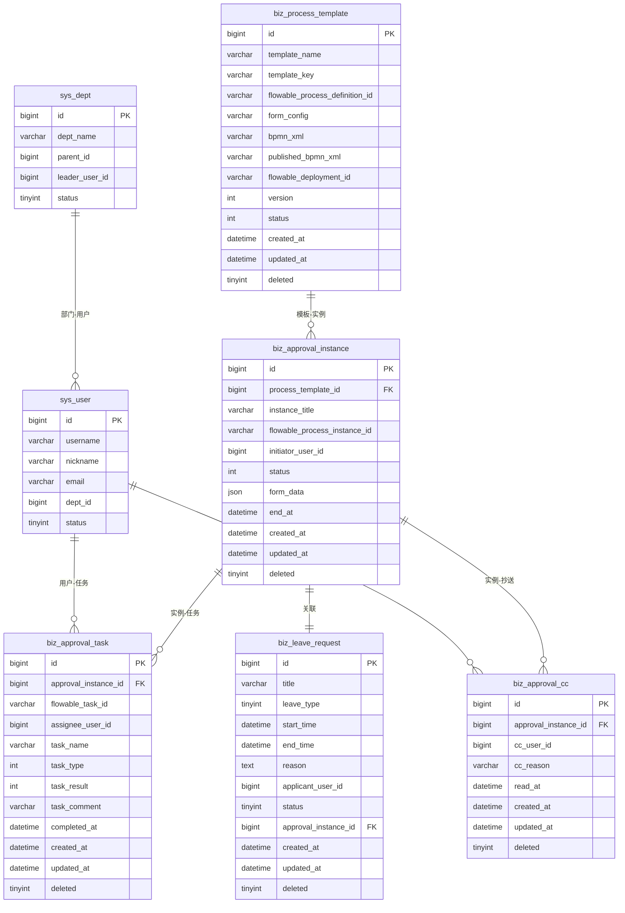
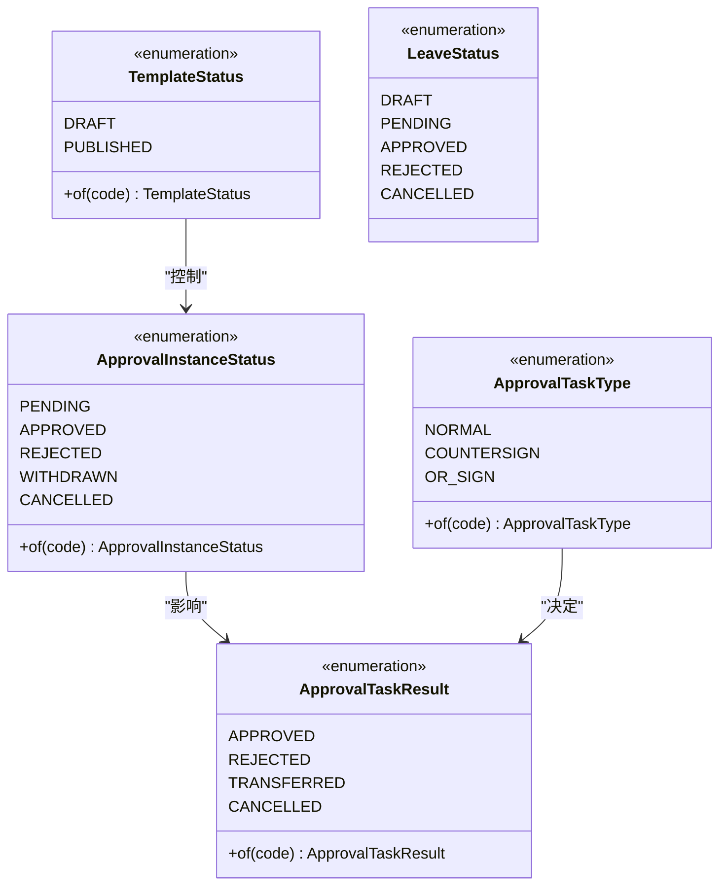
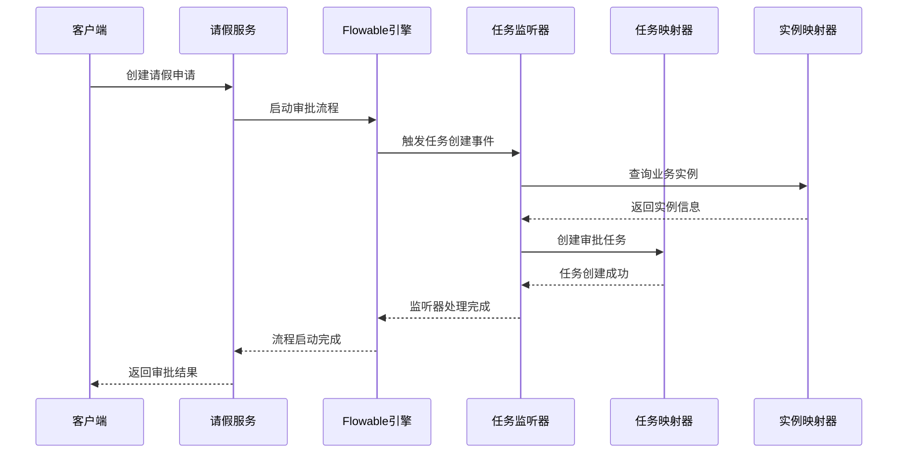
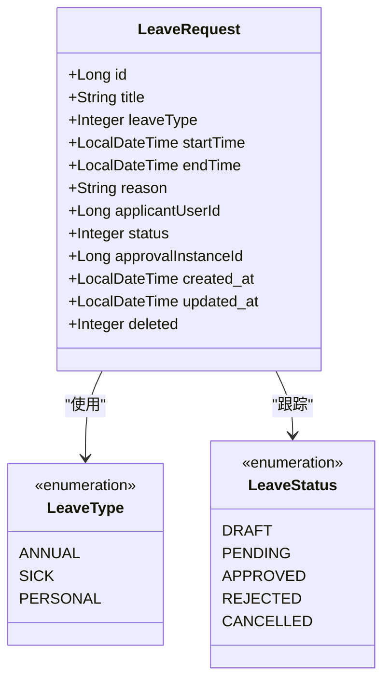
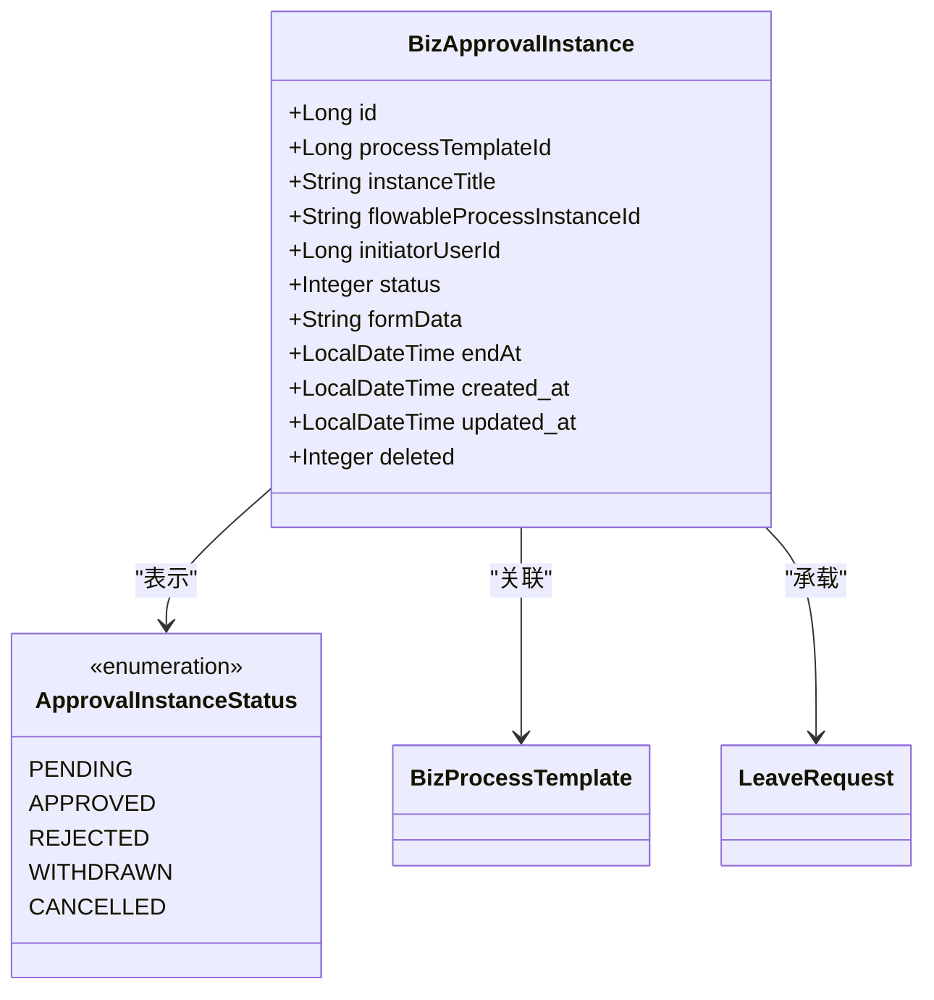
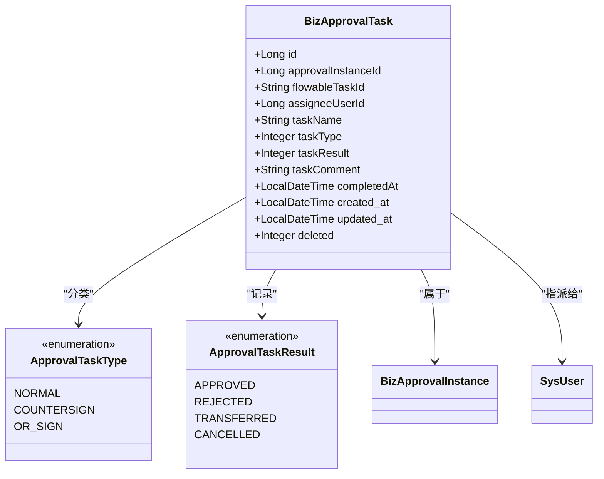
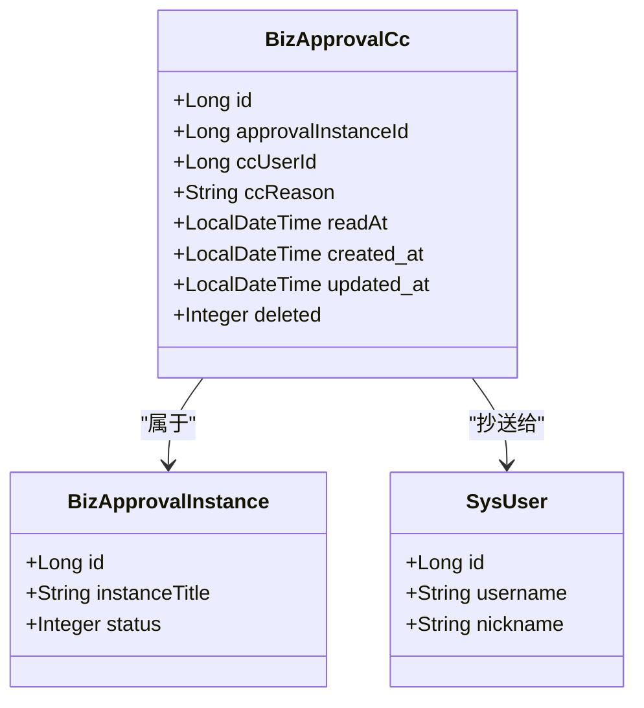
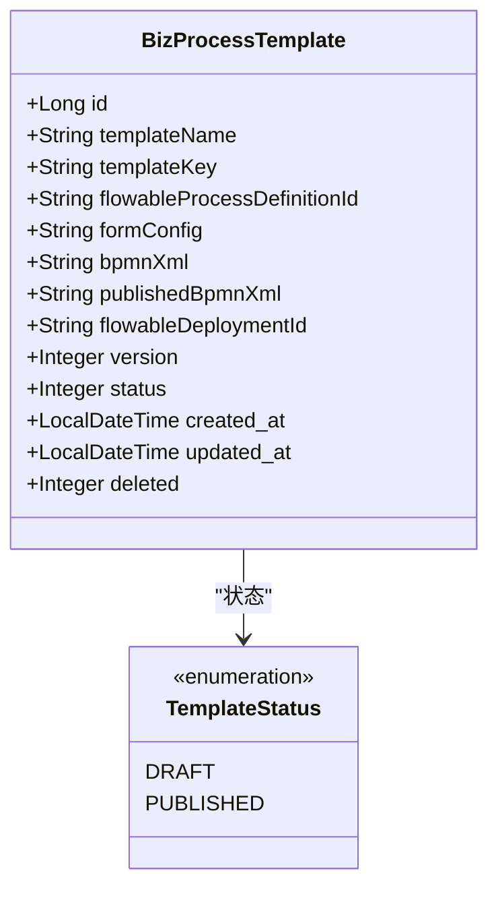
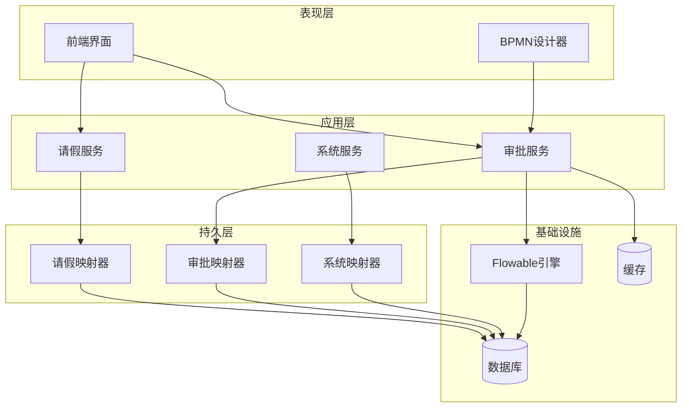

# 业务数据层设计

<cite>
**本文档引用的文件**
- [BizApprovalInstance.java](file://oa-approval/src/main/java/com/oa/admin/approval/entity/BizApprovalInstance.java)
- [BizApprovalTask.java](file://oa-approval/src/main/java/com/oa/admin/approval/entity/BizApprovalTask.java)
- [BizApprovalCc.java](file://oa-approval/src/main/java/com/oa/admin/approval/entity/BizApprovalCc.java)
- [BizProcessTemplate.java](file://oa-approval/src/main/java/com/oa/admin/approval/entity/BizProcessTemplate.java)
- [LeaveRequest.java](file://oa-leave/src/main/java/com/oa/admin/leave/entity/LeaveRequest.java)
- [ApprovalInstanceStatus.java](file://oa-approval/src/main/java/com/oa/admin/approval/enums/ApprovalInstanceStatus.java)
- [ApprovalTaskType.java](file://oa-approval/src/main/java/com/oa/admin/approval/enums/ApprovalTaskType.java)
- [ApprovalTaskResult.java](file://oa-approval/src/main/java/com/oa/admin/approval/enums/ApprovalTaskResult.java)
- [TemplateStatus.java](file://oa-approval/src/main/java/com/oa/admin/approval/enums/TemplateStatus.java)
- [LeaveStatus.java](file://oa-leave/src/main/java/com/oa/admin/leave/enums/LeaveStatus.java)
- [FlowableConfig.java](file://oa-approval/src/main/java/com/oa/admin/approval/config/FlowableConfig.java)
- [ApprovalTaskCreateListener.java](file://oa-approval/src/main/java/com/oa/admin/approval/listener/ApprovalTaskCreateListener.java)
- [AssigneeResolver.java](file://oa-approval/src/main/java/com/oa/admin/approval/resolver/AssigneeResolver.java)
- [V13__approval_base_entity_columns.sql](file://oa-app/src/main/resources/db/migration/V13__approval_base_entity_columns.sql)
- [leave-request.yaml](file://generators/leave-request.yaml)
</cite>

## 目录
1. [引言](#引言)
2. [项目结构](#项目结构)
3. [核心组件](#核心组件)
4. [架构概览](#架构概览)
5. [详细组件分析](#详细组件分析)
6. [依赖分析](#依赖分析)
7. [性能考虑](#性能考虑)
8. [故障排除指南](#故障排除指南)
9. [结论](#结论)
10. [附录](#附录)

## 引言

本设计文档针对OA审批管理系统中的业务数据层进行深入分析，重点阐述业务相关的数据模型结构，包括请假申请(LeaveRequest)、审批实例(BizApprovalInstance)、审批任务(BizApprovalTask)、抄送记录(BizApprovalCc)、流程模板(BizProcessTemplate)等核心实体。文档详细说明了业务数据与工作流引擎的集成设计，包括审批状态流转、任务分配、条件判断的数据支撑；阐述了业务数据的生命周期管理，包括状态枚举设计、业务规则验证、数据变更追踪；解释了业务数据与基础数据层的关联关系，包括外键约束、级联操作、数据同步机制；并提供了业务实体设计规范和实际应用场景示例。

该系统采用Spring Boot + MyBatis-Plus + Flowable工作流引擎的技术栈，实现了业务逻辑与工作流引擎的深度集成，确保审批流程的自动化执行和业务数据的完整一致性。

## 项目结构

系统采用模块化架构设计，主要包含以下核心模块：

**图表来源**
- [FlowableConfig.java:1-31](file://oa-approval/src/main/java/com/oa/admin/approval/config/FlowableConfig.java#L1-L31)
- [AssigneeResolver.java:1-62](file://oa-approval/src/main/java/com/oa/admin/approval/resolver/AssigneeResolver.java#L1-L62)

**章节来源**
- [FlowableConfig.java:1-31](file://oa-approval/src/main/java/com/oa/admin/approval/config/FlowableConfig.java#L1-L31)
- [AssigneeResolver.java:1-62](file://oa-approval/src/main/java/com/oa/admin/approval/resolver/AssigneeResolver.java#L1-L62)

## 核心组件

### 数据模型概述

系统的核心数据模型围绕业务审批流程构建，采用分层设计思想：

**图表来源**
- [BizProcessTemplate.java:1-29](file://oa-approval/src/main/java/com/oa/admin/approval/entity/BizProcessTemplate.java#L1-L29)
- [BizApprovalInstance.java:1-33](file://oa-approval/src/main/java/com/oa/admin/approval/entity/BizApprovalInstance.java#L1-L33)
- [BizApprovalTask.java:1-35](file://oa-approval/src/main/java/com/oa/admin/approval/entity/BizApprovalTask.java#L1-L35)
- [BizApprovalCc.java:1-29](file://oa-approval/src/main/java/com/oa/admin/approval/entity/BizApprovalCc.java#L1-L29)
- [LeaveRequest.java:1-48](file://oa-leave/src/main/java/com/oa/admin/leave/entity/LeaveRequest.java#L1-L48)

### 状态枚举体系

系统建立了完整的状态枚举体系，确保业务状态的一致性和可追溯性：

**图表来源**
- [ApprovalInstanceStatus.java:1-29](file://oa-approval/src/main/java/com/oa/admin/approval/enums/ApprovalInstanceStatus.java#L1-L29)
- [ApprovalTaskType.java:1-27](file://oa-approval/src/main/java/com/oa/admin/approval/enums/ApprovalTaskType.java#L1-L27)
- [ApprovalTaskResult.java:1-28](file://oa-approval/src/main/java/com/oa/admin/approval/enums/ApprovalTaskResult.java#L1-L28)
- [TemplateStatus.java:1-26](file://oa-approval/src/main/java/com/oa/admin/approval/enums/TemplateStatus.java#L1-L26)
- [LeaveStatus.java:1-42](file://oa-leave/src/main/java/com/oa/admin/leave/enums/LeaveStatus.java#L1-L42)

**章节来源**
- [ApprovalInstanceStatus.java:1-29](file://oa-approval/src/main/java/com/oa/admin/approval/enums/ApprovalInstanceStatus.java#L1-L29)
- [ApprovalTaskType.java:1-27](file://oa-approval/src/main/java/com/oa/admin/approval/enums/ApprovalTaskType.java#L1-L27)
- [ApprovalTaskResult.java:1-28](file://oa-approval/src/main/java/com/oa/admin/approval/enums/ApprovalTaskResult.java#L1-L28)
- [TemplateStatus.java:1-26](file://oa-approval/src/main/java/com/oa/admin/approval/enums/TemplateStatus.java#L1-L26)
- [LeaveStatus.java:1-42](file://oa-leave/src/main/java/com/oa/admin/leave/enums/LeaveStatus.java#L1-L42)

## 架构概览

系统采用事件驱动的架构模式，实现了业务数据与工作流引擎的深度集成：

**图表来源**
- [ApprovalTaskCreateListener.java:25-64](file://oa-approval/src/main/java/com/oa/admin/approval/listener/ApprovalTaskCreateListener.java#L25-L64)
- [FlowableConfig.java:20-29](file://oa-approval/src/main/java/com/oa/admin/approval/config/FlowableConfig.java#L20-L29)

### 工作流集成设计

系统通过多种机制实现业务数据与工作流引擎的无缝集成：

1. **事件监听机制**：通过自定义监听器捕获Flowable引擎的关键事件
2. **动态任务分配**：基于组织架构的动态用户解析
3. **状态同步机制**：确保业务状态与工作流状态保持一致
4. **数据一致性保障**：通过事务保证业务数据的完整性

**章节来源**
- [ApprovalTaskCreateListener.java:1-89](file://oa-approval/src/main/java/com/oa/admin/approval/listener/ApprovalTaskCreateListener.java#L1-L89)
- [AssigneeResolver.java:1-62](file://oa-approval/src/main/java/com/oa/admin/approval/resolver/AssigneeResolver.java#L1-L62)
- [FlowableConfig.java:1-31](file://oa-approval/src/main/java/com/oa/admin/approval/config/FlowableConfig.java#L1-L31)

## 详细组件分析

### 请假申请实体分析

请假申请(LeaveRequest)是业务数据层的核心实体之一，负责承载具体的业务请求信息：

**图表来源**
- [LeaveRequest.java:18-47](file://oa-leave/src/main/java/com/oa/admin/leave/entity/LeaveRequest.java#L18-L47)
- [leave-request.yaml:6-21](file://generators/leave-request.yaml#L6-L21)

请假申请实体的设计特点：

1. **字段完整性**：涵盖请假申请的所有必要信息
2. **类型安全**：使用强类型枚举确保数据一致性
3. **查询优化**：包含申请人和状态索引支持高效查询
4. **扩展性**：预留JSON格式的表单数据存储

**章节来源**
- [LeaveRequest.java:1-48](file://oa-leave/src/main/java/com/oa/admin/leave/entity/LeaveRequest.java#L1-L48)
- [leave-request.yaml:1-74](file://generators/leave-request.yaml#L1-L74)

### 审批实例实体分析

审批实例(BizApprovalInstance)作为工作流实例的业务包装，连接了具体业务数据与工作流引擎：

**图表来源**
- [BizApprovalInstance.java:19-32](file://oa-approval/src/main/java/com/oa/admin/approval/entity/BizApprovalInstance.java#L19-L32)
- [ApprovalInstanceStatus.java:11-16](file://oa-approval/src/main/java/com/oa/admin/approval/enums/ApprovalInstanceStatus.java#L11-L16)

审批实例实体的关键特性：

1. **流程绑定**：通过Flowable进程实例ID与工作流引擎关联
2. **状态管理**：统一管理整个审批流程的状态变化
3. **数据承载**：存储业务表单的原始数据
4. **生命周期**：完整记录审批流程的开始和结束时间

**章节来源**
- [BizApprovalInstance.java:1-33](file://oa-approval/src/main/java/com/oa/admin/approval/entity/BizApprovalInstance.java#L1-L33)

### 审批任务实体分析

审批任务(BizApprovalTask)负责跟踪每个审批节点的具体执行情况：

**图表来源**
- [BizApprovalTask.java:19-34](file://oa-approval/src/main/java/com/oa/admin/approval/entity/BizApprovalTask.java#L19-L34)
- [ApprovalTaskType.java:11-14](file://oa-approval/src/main/java/com/oa/admin/approval/enums/ApprovalTaskType.java#L11-L14)
- [ApprovalTaskResult.java:11-15](file://oa-approval/src/main/java/com/oa/admin/approval/enums/ApprovalTaskResult.java#L11-L15)

审批任务实体的设计要点：

1. **任务分类**：支持普通审批、会签、或签等多种任务类型
2. **结果记录**：完整记录任务的执行结果和评论
3. **时间追踪**：精确记录任务的完成时间
4. **用户关联**：建立与系统用户的关联关系

**章节来源**
- [BizApprovalTask.java:1-35](file://oa-approval/src/main/java/com/oa/admin/approval/entity/BizApprovalTask.java#L1-L35)

### 抄送记录实体分析

抄送记录(BizApprovalCc)用于跟踪审批流程中的抄送信息：

**图表来源**
- [BizApprovalCc.java:19-28](file://oa-approval/src/main/java/com/oa/admin/approval/entity/BizApprovalCc.java#L19-L28)

抄送记录实体的功能特性：

1. **阅读追踪**：记录抄送人员的阅读时间
2. **原因说明**：支持抄送原因的记录和查询
3. **关联管理**：与审批实例和用户建立清晰的关联关系

**章节来源**
- [BizApprovalCc.java:1-29](file://oa-approval/src/main/java/com/oa/admin/approval/entity/BizApprovalCc.java#L1-L29)

### 流程模板实体分析

流程模板(BizProcessTemplate)定义了可复用的审批流程规范：

**图表来源**
- [BizProcessTemplate.java:16-28](file://oa-approval/src/main/java/com/oa/admin/approval/entity/BizProcessTemplate.java#L16-L28)
- [TemplateStatus.java:11-13](file://oa-approval/src/main/java/com/oa/admin/approval/enums/TemplateStatus.java#L11-L13)

流程模板实体的设计考虑：

1. **版本管理**：支持流程模板的版本控制和演进
2. **发布管理**：区分草稿和已发布状态
3. **配置存储**：保存BPMN XML和表单配置
4. **部署标识**：与Flowable引擎的部署信息关联

**章节来源**
- [BizProcessTemplate.java:1-29](file://oa-approval/src/main/java/com/oa/admin/approval/entity/BizProcessTemplate.java#L1-L29)

## 依赖分析

系统各模块间的依赖关系体现了清晰的分层架构：

**图表来源**
- [FlowableConfig.java:15-30](file://oa-approval/src/main/java/com/oa/admin/approval/config/FlowableConfig.java#L15-L30)

### 外部依赖关系

系统对外部组件的依赖主要包括：

1. **Flowable工作流引擎**：提供流程编排和执行能力
2. **MyBatis-Plus**：简化数据访问层开发
3. **Spring Security**：提供安全认证和授权
4. **数据库**：存储业务数据和系统配置

**章节来源**
- [FlowableConfig.java:1-31](file://oa-approval/src/main/java/com/oa/admin/approval/config/FlowableConfig.java#L1-L31)

## 性能考虑

### 查询性能优化

系统在设计时充分考虑了查询性能的优化策略：

1. **索引设计**：为常用查询字段建立合适的索引
2. **分页查询**：对大量数据采用分页机制
3. **缓存策略**：对热点数据实施缓存机制
4. **批量操作**：支持批量数据处理以提高效率

### 并发控制

系统采用多层并发控制机制：

1. **数据库层面**：利用数据库的事务隔离级别
2. **应用层面**：使用乐观锁防止并发更新冲突
3. **工作流层面**：Flowable引擎内置的并发控制

## 故障排除指南

### 常见问题诊断

1. **任务创建失败**：检查工作流监听器配置和用户ID格式
2. **状态不一致**：验证业务状态与工作流状态的同步机制
3. **权限问题**：确认用户角色和部门层级的正确性
4. **流程异常**：检查BPMN配置和变量传递的正确性

### 调试技巧

1. **日志分析**：利用详细的日志信息定位问题
2. **数据库检查**：直接查询数据库验证数据状态
3. **流程图分析**：通过BPMN设计器可视化流程执行
4. **单元测试**：编写针对性的单元测试验证功能

**章节来源**
- [ApprovalTaskCreateListener.java:25-52](file://oa-approval/src/main/java/com/oa/admin/approval/listener/ApprovalTaskCreateListener.java#L25-L52)

## 结论

本业务数据层设计文档全面阐述了OA审批管理系统的核心数据模型和集成架构。系统通过精心设计的数据模型、完善的状态管理体系、深度的工作流集成以及严格的生命周期管理，实现了业务需求与技术实现的最佳结合。

关键设计亮点包括：

1. **模块化设计**：清晰的模块划分和职责分离
2. **状态一致性**：完整的状态枚举体系确保数据一致性
3. **工作流集成**：深度集成Flowable引擎实现流程自动化
4. **扩展性考虑**：预留足够的扩展点支持业务发展
5. **性能优化**：从多个维度考虑系统性能和可维护性

该设计为后续的功能扩展和系统演进奠定了坚实的基础，能够有效支撑企业级审批管理的需求。

## 附录

### 数据库迁移脚本

系统通过Flyway进行数据库版本管理，关键迁移脚本包括：

1. **基础表结构**：初始化业务表结构
2. **字段增强**：添加通用字段支持审计功能
3. **权限配置**：设置系统管理权限
4. **流程设计**：定义审批流程的结构

### 配置规范

系统配置遵循以下规范：

1. **命名规范**：采用下划线分隔的命名方式
2. **枚举设计**：统一的枚举值设计和使用
3. **注释规范**：详细的字段和方法注释
4. **异常处理**：标准化的异常处理机制

**章节来源**
- [V13__approval_base_entity_columns.sql:1-13](file://oa-app/src/main/resources/db/migration/V13__approval_base_entity_columns.sql#L1-L13)