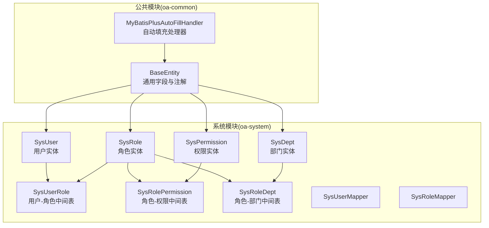
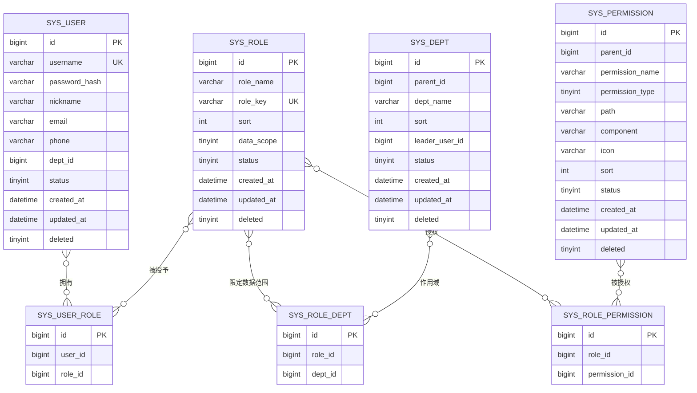
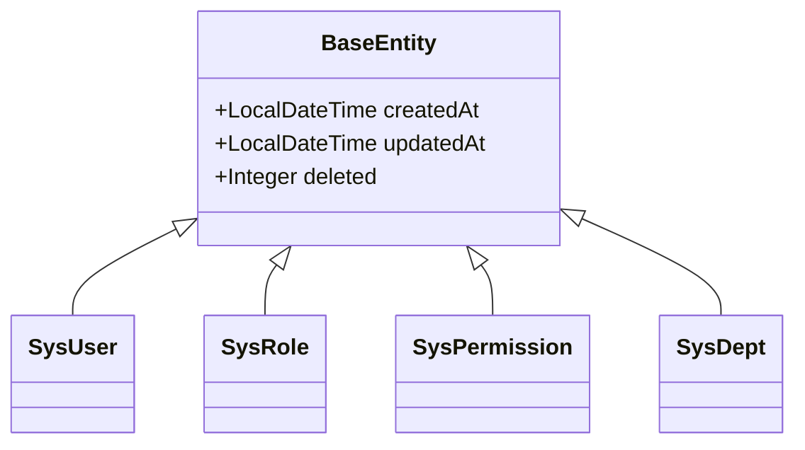
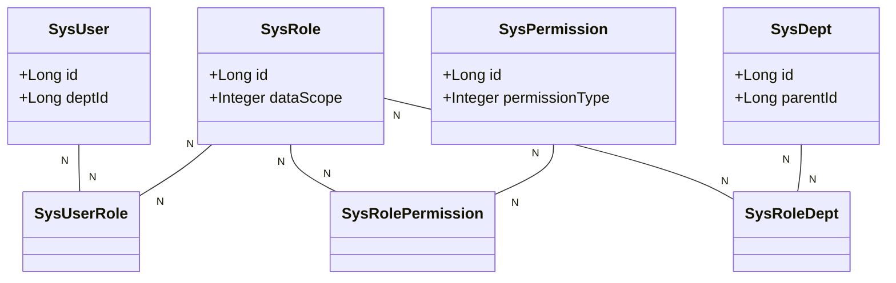
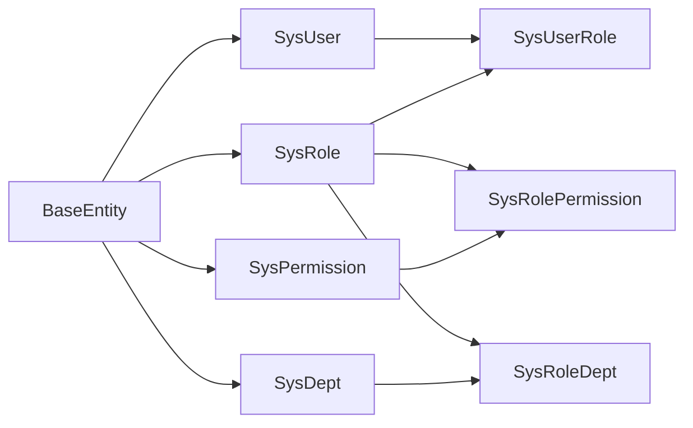

# 基础数据层设计

<cite>
**本文引用的文件**
- [BaseEntity.java](file://oa-common/src/main/java/com/oa/admin/common/entity/BaseEntity.java)
- [MyBatisPlusAutoFillHandler.java](file://oa-common/src/main/java/com/oa/admin/common/config/MyBatisPlusAutoFillHandler.java)
- [SysUser.java](file://oa-system/src/main/java/com/oa/admin/system/entity/SysUser.java)
- [SysRole.java](file://oa-system/src/main/java/com/oa/admin/system/entity/SysRole.java)
- [SysPermission.java](file://oa-system/src/main/java/com/oa/admin/system/entity/SysPermission.java)
- [SysDept.java](file://oa-system/src/main/java/com/oa/admin/system/entity/SysDept.java)
- [SysUserRole.java](file://oa-system/src/main/java/com/oa/admin/system/entity/SysUserRole.java)
- [SysRolePermission.java](file://oa-system/src/main/java/com/oa/admin/system/entity/SysRolePermission.java)
- [SysRoleDept.java](file://oa-system/src/main/java/com/oa/admin/system/entity/SysRoleDept.java)
- [SysUserMapper.java](file://oa-system/src/main/java/com/oa/admin/system/mapper/SysUserMapper.java)
- [SysRoleMapper.java](file://oa-system/src/main/java/com/oa/admin/system/mapper/SysRoleMapper.java)
- [DataScope.java](file://oa-system/src/main/java/com/oa/admin/system/enums/DataScope.java)
- [PermissionType.java](file://oa-system/src/main/java/com/oa/admin/system/enums/PermissionType.java)
- [CommonStatus.java](file://oa-common/src/main/java/com/oa/admin/common/enums/CommonStatus.java)
- [V1__init_sys_tables.sql](file://oa-app/src/main/resources/db/migration/V1__init_sys_tables.sql)
- [V13__approval_base_entity_columns.sql](file://oa-app/src/main/resources/db/migration/V13__approval_base_entity_columns.sql)
</cite>

## 目录
1. [简介](#简介)
2. [项目结构](#项目结构)
3. [核心组件](#核心组件)
4. [架构总览](#架构总览)
5. [详细组件分析](#详细组件分析)
6. [依赖分析](#依赖分析)
7. [性能考虑](#性能考虑)
8. [故障排查指南](#故障排查指南)
9. [结论](#结论)
10. [附录](#附录)

## 简介
本设计文档聚焦于OA审批管理系统的基础数据层，系统采用RBAC（基于角色的访问控制）权限模型，围绕用户、角色、权限与部门四大核心实体展开，并通过三张中间表实现多对多关联。同时，系统统一使用BaseEntity作为所有业务实体的基类，借助MyBatis-Plus自动填充机制实现创建时间、更新时间等通用字段的自动化维护，并通过逻辑删除字段支持软删除。本文将从数据结构、关联关系、索引与约束、查询优化策略以及实体设计规范等方面进行系统化阐述。

## 项目结构
基础数据层位于系统模块中，核心实体与映射器均在系统模块内定义，公共基类与自动填充配置位于公共模块。数据库初始化脚本位于应用模块的Flyway迁移目录中，确保表结构与实体定义保持一致。

图表来源
- [BaseEntity.java:1-26](file://oa-common/src/main/java/com/oa/admin/common/entity/BaseEntity.java#L1-L26)
- [MyBatisPlusAutoFillHandler.java:1-25](file://oa-common/src/main/java/com/oa/admin/common/config/MyBatisPlusAutoFillHandler.java#L1-L25)
- [SysUser.java:1-27](file://oa-system/src/main/java/com/oa/admin/system/entity/SysUser.java#L1-L27)
- [SysRole.java:1-26](file://oa-system/src/main/java/com/oa/admin/system/entity/SysRole.java#L1-L26)
- [SysPermission.java:1-35](file://oa-system/src/main/java/com/oa/admin/system/entity/SysPermission.java#L1-L35)
- [SysDept.java:1-31](file://oa-system/src/main/java/com/oa/admin/system/entity/SysDept.java#L1-L31)
- [SysUserRole.java:1-19](file://oa-system/src/main/java/com/oa/admin/system/entity/SysUserRole.java#L1-L19)
- [SysRolePermission.java:1-19](file://oa-system/src/main/java/com/oa/admin/system/entity/SysRolePermission.java#L1-L19)
- [SysRoleDept.java:1-19](file://oa-system/src/main/java/com/oa/admin/system/entity/SysRoleDept.java#L1-L19)
- [SysUserMapper.java:1-13](file://oa-system/src/main/java/com/oa/admin/system/mapper/SysUserMapper.java#L1-L13)
- [SysRoleMapper.java:1-13](file://oa-system/src/main/java/com/oa/admin/system/mapper/SysRoleMapper.java#L1-L13)

章节来源
- [V1__init_sys_tables.sql:1-84](file://oa-app/src/main/resources/db/migration/V1__init_sys_tables.sql#L1-L84)

## 核心组件
本节概述RBAC模型中的五大核心实体及三张中间表，说明其职责与关键字段，并结合数据库脚本验证表结构与约束。

- 用户表(SysUser)
  - 关键字段：用户名、密码哈希、昵称、邮箱、电话、所属部门、状态
  - 外键：dept_id 指向部门表主键
  - 约束：用户名唯一且与deleted联合唯一，dept_id建立索引
- 角色表(SysRole)
  - 关键字段：角色名、角色键(权限标识)、排序、数据范围、状态
  - 数据范围枚举：全部数据、本部门、自定义
  - 约束：role_key与deleted联合唯一
- 权限表(SysPermission)
  - 关键字段：父级ID、权限名称、权限类型(菜单/按钮/API)、路由路径、组件、图标、排序、状态
  - 支持树形结构(children字段用于前端渲染)
  - 约束：parent_id建立索引
- 部门表(SysDept)
  - 关键字段：父级ID、部门名称、排序、负责人、状态
  - 支持树形组织架构(children字段用于前端渲染)
  - 约束：parent_id建立索引
- 中间表
  - 用户-角色(SysUserRole)：user_id与role_id联合唯一
  - 角色-权限(SysRolePermission)：role_id与permission_id联合唯一
  - 角色-部门(SysRoleDept)：role_id与dept_id联合唯一

章节来源
- [SysUser.java:1-27](file://oa-system/src/main/java/com/oa/admin/system/entity/SysUser.java#L1-L27)
- [SysRole.java:1-26](file://oa-system/src/main/java/com/oa/admin/system/entity/SysRole.java#L1-L26)
- [SysPermission.java:1-35](file://oa-system/src/main/java/com/oa/admin/system/entity/SysPermission.java#L1-L35)
- [SysDept.java:1-31](file://oa-system/src/main/java/com/oa/admin/system/entity/SysDept.java#L1-L31)
- [SysUserRole.java:1-19](file://oa-system/src/main/java/com/oa/admin/system/entity/SysUserRole.java#L1-L19)
- [SysRolePermission.java:1-19](file://oa-system/src/main/java/com/oa/admin/system/entity/SysRolePermission.java#L1-L19)
- [SysRoleDept.java:1-19](file://oa-system/src/main/java/com/oa/admin/system/entity/SysRoleDept.java#L1-L19)
- [V1__init_sys_tables.sql:18-83](file://oa-app/src/main/resources/db/migration/V1__init_sys_tables.sql#L18-L83)

## 架构总览
下图展示RBAC模型的实体关系与关联路径，体现用户-角色-权限-部门的多对多关系及中间表的作用。

图表来源
- [V1__init_sys_tables.sql:5-83](file://oa-app/src/main/resources/db/migration/V1__init_sys_tables.sql#L5-L83)
- [SysUser.java:1-27](file://oa-system/src/main/java/com/oa/admin/system/entity/SysUser.java#L1-L27)
- [SysRole.java:1-26](file://oa-system/src/main/java/com/oa/admin/system/entity/SysRole.java#L1-L26)
- [SysPermission.java:1-35](file://oa-system/src/main/java/com/oa/admin/system/entity/SysPermission.java#L1-L35)
- [SysDept.java:1-31](file://oa-system/src/main/java/com/oa/admin/system/entity/SysDept.java#L1-L31)
- [SysUserRole.java:1-19](file://oa-system/src/main/java/com/oa/admin/system/entity/SysUserRole.java#L1-L19)
- [SysRolePermission.java:1-19](file://oa-system/src/main/java/com/oa/admin/system/entity/SysRolePermission.java#L1-L19)
- [SysRoleDept.java:1-19](file://oa-system/src/main/java/com/oa/admin/system/entity/SysRoleDept.java#L1-L19)

## 详细组件分析

### BaseEntity基类与通用字段
- 设计目标
  - 统一记录创建时间、更新时间与逻辑删除字段，减少重复代码
  - 通过MyBatis-Plus注解与自动填充处理器实现零样板代码
- 字段说明
  - 创建时间：由插入时自动填充
  - 更新时间：插入与更新时自动填充
  - 逻辑删除：使用整型标志位配合逻辑删除注解，支持软删除
- 实现机制
  - 注解驱动：字段标注填充时机与逻辑删除策略
  - 自动填充：MetaObjectHandler在插入与更新时写入时间戳
  - 序列化格式：统一JSON时间格式，便于前后端交互

图表来源
- [BaseEntity.java:1-26](file://oa-common/src/main/java/com/oa/admin/common/entity/BaseEntity.java#L1-L26)
- [SysUser.java:1-27](file://oa-system/src/main/java/com/oa/admin/system/entity/SysUser.java#L1-L27)
- [SysRole.java:1-26](file://oa-system/src/main/java/com/oa/admin/system/entity/SysRole.java#L1-L26)
- [SysPermission.java:1-35](file://oa-system/src/main/java/com/oa/admin/system/entity/SysPermission.java#L1-L35)
- [SysDept.java:1-31](file://oa-system/src/main/java/com/oa/admin/system/entity/SysDept.java#L1-L31)

章节来源
- [BaseEntity.java:1-26](file://oa-common/src/main/java/com/oa/admin/common/entity/BaseEntity.java#L1-L26)
- [MyBatisPlusAutoFillHandler.java:1-25](file://oa-common/src/main/java/com/oa/admin/common/config/MyBatisPlusAutoFillHandler.java#L1-L25)
- [V13__approval_base_entity_columns.sql:1-13](file://oa-app/src/main/resources/db/migration/V13__approval_base_entity_columns.sql#L1-L13)

### 用户-角色-权限-部门的多对多关联
- 关联关系
  - 用户与角色：多对多，通过SysUserRole连接
  - 角色与权限：多对多，通过SysRolePermission连接
  - 角色与部门：多对多，通过SysRoleDept连接，用于限制数据范围
- 关键点
  - 联合唯一约束保证关系不重复
  - 为role_id、user_id、permission_id等建立索引，提升查询效率
  - 部门树形结构支持层级筛选与数据隔离

图表来源
- [SysUser.java:1-27](file://oa-system/src/main/java/com/oa/admin/system/entity/SysUser.java#L1-L27)
- [SysRole.java:1-26](file://oa-system/src/main/java/com/oa/admin/system/entity/SysRole.java#L1-L26)
- [SysPermission.java:1-35](file://oa-system/src/main/java/com/oa/admin/system/entity/SysPermission.java#L1-L35)
- [SysDept.java:1-31](file://oa-system/src/main/java/com/oa/admin/system/entity/SysDept.java#L1-L31)
- [SysUserRole.java:1-19](file://oa-system/src/main/java/com/oa/admin/system/entity/SysUserRole.java#L1-L19)
- [SysRolePermission.java:1-19](file://oa-system/src/main/java/com/oa/admin/system/entity/SysRolePermission.java#L1-L19)
- [SysRoleDept.java:1-19](file://oa-system/src/main/java/com/oa/admin/system/entity/SysRoleDept.java#L1-L19)

章节来源
- [V1__init_sys_tables.sql:63-83](file://oa-app/src/main/resources/db/migration/V1__init_sys_tables.sql#L63-L83)
- [SysUserRole.java:1-19](file://oa-system/src/main/java/com/oa/admin/system/entity/SysUserRole.java#L1-L19)
- [SysRolePermission.java:1-19](file://oa-system/src/main/java/com/oa/admin/system/entity/SysRolePermission.java#L1-L19)
- [SysRoleDept.java:1-19](file://oa-system/src/main/java/com/oa/admin/system/entity/SysRoleDept.java#L1-L19)

### 数据完整性约束与索引设计
- 主键与外键
  - 所有实体主键均为自增BIGINT
  - 用户dept_id指向部门主键；角色data_scope用于数据范围控制；权限parent_id支持树形结构
- 唯一性约束
  - 用户名与逻辑删除字段联合唯一，避免软删除后重名冲突
  - 角色键与逻辑删除字段联合唯一，保证权限标识唯一性
  - 关系表三元组联合唯一，防止重复授权或重复绑定
- 索引设计
  - parent_id：部门与权限表的父子导航
  - dept_id：用户按部门过滤
  - role_id：关系表按角色快速定位
- 查询优化建议
  - 在高频过滤字段上建立合适索引
  - 使用联合唯一索引避免重复关系
  - 利用逻辑删除字段进行软删除，避免物理删除带来的维护成本

章节来源
- [V1__init_sys_tables.sql:5-83](file://oa-app/src/main/resources/db/migration/V1__init_sys_tables.sql#L5-L83)

### 实体类设计规范
- 继承与复用
  - 所有业务实体继承BaseEntity，统一时间与删除字段
- 映射与注解
  - 使用MyBatis-Plus注解声明表名、主键策略与字段填充
  - 对于非持久化字段使用exist=false标记
- 枚举与常量
  - 使用枚举表达固定取值集合，如权限类型、数据范围、状态等
  - 枚举提供of方法用于安全转换
- Mapper接口
  - 采用BaseMapper简化CRUD操作，减少XML配置

章节来源
- [SysUser.java:1-27](file://oa-system/src/main/java/com/oa/admin/system/entity/SysUser.java#L1-L27)
- [SysRole.java:1-26](file://oa-system/src/main/java/com/oa/admin/system/entity/SysRole.java#L1-L26)
- [SysPermission.java:1-35](file://oa-system/src/main/java/com/oa/admin/system/entity/SysPermission.java#L1-L35)
- [SysDept.java:1-31](file://oa-system/src/main/java/com/oa/admin/system/entity/SysDept.java#L1-L31)
- [SysUserMapper.java:1-13](file://oa-system/src/main/java/com/oa/admin/system/mapper/SysUserMapper.java#L1-L13)
- [SysRoleMapper.java:1-13](file://oa-system/src/main/java/com/oa/admin/system/mapper/SysRoleMapper.java#L1-L13)
- [DataScope.java:1-27](file://oa-system/src/main/java/com/oa/admin/system/enums/DataScope.java#L1-L27)
- [PermissionType.java:1-27](file://oa-system/src/main/java/com/oa/admin/system/enums/PermissionType.java#L1-L27)
- [CommonStatus.java:1-26](file://oa-common/src/main/java/com/oa/admin/common/enums/CommonStatus.java#L1-L26)

## 依赖分析
- 内聚与耦合
  - 实体层高度内聚，每个实体仅关注自身属性与业务语义
  - 关系通过中间表解耦，降低直接外键依赖
- 外部依赖
  - MyBatis-Plus注解与自动填充处理器
  - Flyway迁移脚本确保数据库结构一致性
- 循环依赖
  - 无循环依赖，实体之间通过中间表间接关联

图表来源
- [BaseEntity.java:1-26](file://oa-common/src/main/java/com/oa/admin/common/entity/BaseEntity.java#L1-L26)
- [SysUser.java:1-27](file://oa-system/src/main/java/com/oa/admin/system/entity/SysUser.java#L1-L27)
- [SysRole.java:1-26](file://oa-system/src/main/java/com/oa/admin/system/entity/SysRole.java#L1-L26)
- [SysPermission.java:1-35](file://oa-system/src/main/java/com/oa/admin/system/entity/SysPermission.java#L1-L35)
- [SysDept.java:1-31](file://oa-system/src/main/java/com/oa/admin/system/entity/SysDept.java#L1-L31)
- [SysUserRole.java:1-19](file://oa-system/src/main/java/com/oa/admin/system/entity/SysUserRole.java#L1-L19)
- [SysRolePermission.java:1-19](file://oa-system/src/main/java/com/oa/admin/system/entity/SysRolePermission.java#L1-L19)
- [SysRoleDept.java:1-19](file://oa-system/src/main/java/com/oa/admin/system/entity/SysRoleDept.java#L1-L19)

## 性能考虑
- 索引策略
  - 为高频过滤字段(parent_id、dept_id、role_id)建立索引
  - 联合唯一索引避免重复关系，减少冗余存储
- 查询优化
  - 使用逻辑删除字段进行软删除，避免物理删除带来的维护成本
  - 在权限校验与数据范围控制时，优先利用索引字段进行条件过滤
- 批处理与分页
  - 对于大量数据的授权与分配，采用批量插入与分页查询
- 缓存与一致性
  - 结合业务场景对热点数据进行缓存，注意与数据库的一致性

## 故障排查指南
- 常见问题
  - 重复授权/重复绑定：检查关系表联合唯一索引是否触发
  - 用户名冲突：确认用户名与deleted联合唯一约束是否生效
  - 数据范围异常：核对角色的data_scope字段与SysRoleDept绑定关系
- 排查步骤
  - 核对数据库表结构与迁移脚本一致性
  - 检查实体类注解与表字段映射是否匹配
  - 验证自动填充处理器是否生效
- 参考文件
  - 表结构与索引定义
  - 实体类注解与字段映射
  - 自动填充处理器实现

章节来源
- [V1__init_sys_tables.sql:5-83](file://oa-app/src/main/resources/db/migration/V1__init_sys_tables.sql#L5-L83)
- [SysUserRole.java:1-19](file://oa-system/src/main/java/com/oa/admin/system/entity/SysUserRole.java#L1-L19)
- [SysRolePermission.java:1-19](file://oa-system/src/main/java/com/oa/admin/system/entity/SysRolePermission.java#L1-L19)
- [SysRoleDept.java:1-19](file://oa-system/src/main/java/com/oa/admin/system/entity/SysRoleDept.java#L1-L19)
- [MyBatisPlusAutoFillHandler.java:1-25](file://oa-common/src/main/java/com/oa/admin/common/config/MyBatisPlusAutoFillHandler.java#L1-L25)

## 结论
本设计以RBAC为核心，通过统一的BaseEntity与MyBatis-Plus自动填充机制，实现了创建时间、更新时间与逻辑删除的零样板代码维护。五大核心实体与三张中间表清晰表达了用户-角色-权限-部门的多对多关系，并通过合理的索引与约束保障了数据完整性与查询性能。整体设计具备良好的扩展性与可维护性，适合在企业级审批系统中推广使用。

## 附录
- 实体类设计规范摘要
  - 继承BaseEntity，统一时间与删除字段
  - 使用MyBatis-Plus注解声明表名、主键策略与字段填充
  - 对非持久化字段使用exist=false标记
  - 使用枚举表达固定取值集合，提供安全转换方法
  - 采用BaseMapper简化CRUD操作
- 关键流程示意（概念）
  - 用户登录后，系统根据用户角色加载对应权限
  - 权限类型区分菜单、按钮与API，分别用于界面与接口控制
  - 数据范围控制通过角色与部门的绑定实现