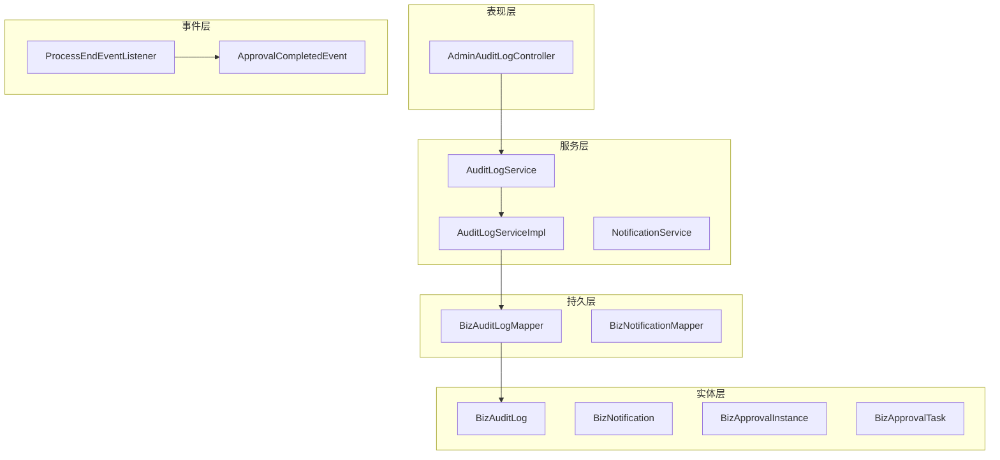
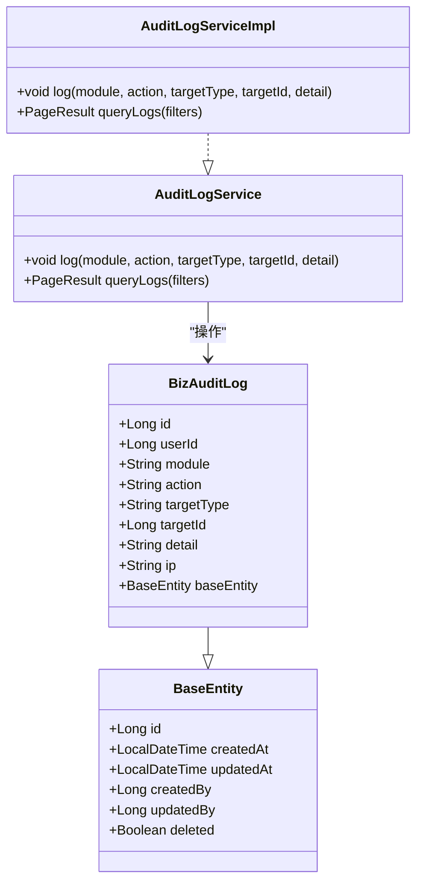
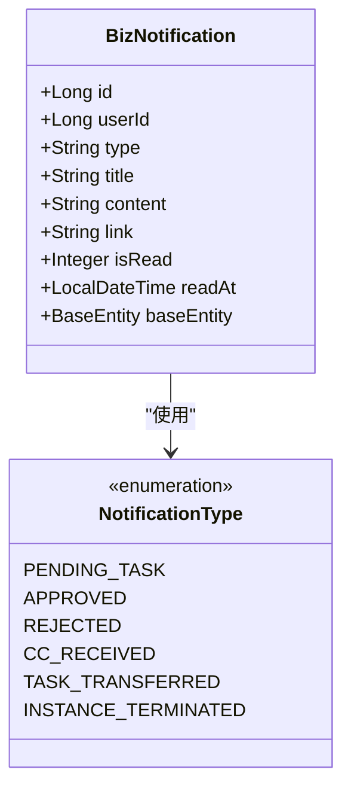
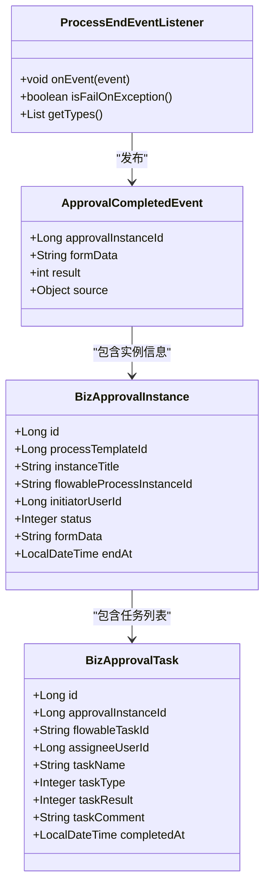
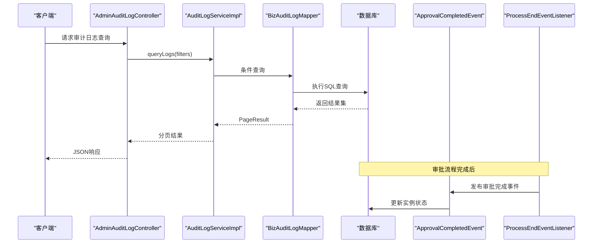
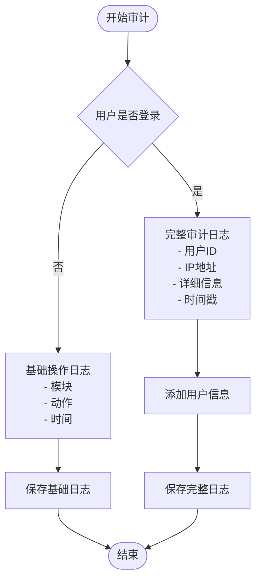
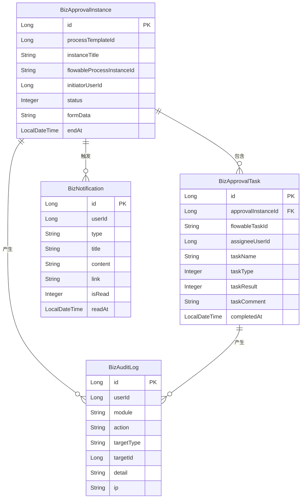
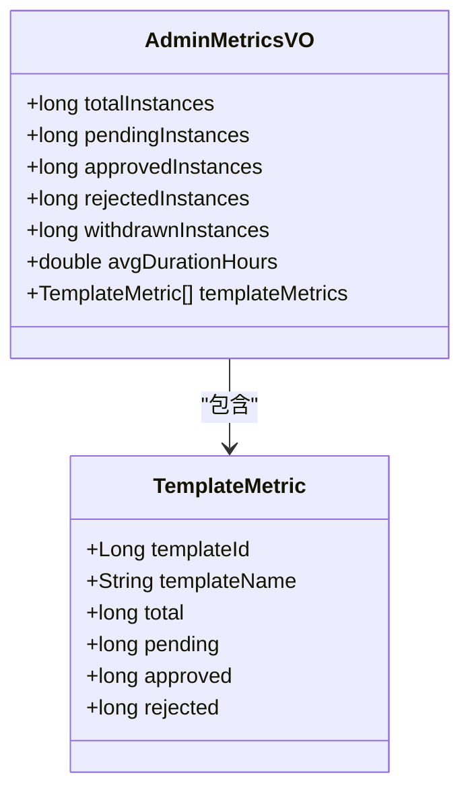
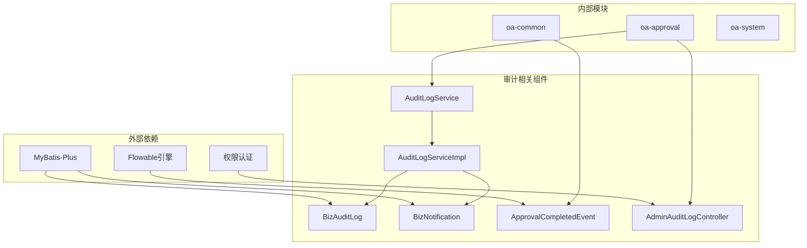

# 审计数据层设计

<cite>
**本文档引用的文件**
- [BizAuditLog.java](file://oa-approval/src/main/java/com/oa/admin/approval/entity/BizAuditLog.java)
- [BizNotification.java](file://oa-approval/src/main/java/com/oa/admin/approval/entity/BizNotification.java)
- [ApprovalCompletedEvent.java](file://oa-common/src/main/java/com/oa/admin/common/event/ApprovalCompletedEvent.java)
- [BizApprovalInstance.java](file://oa-approval/src/main/java/com/oa/admin/approval/entity/BizApprovalInstance.java)
- [BizApprovalTask.java](file://oa-approval/src/main/java/com/oa/admin/approval/entity/BizApprovalTask.java)
- [AuditLogService.java](file://oa-approval/src/main/java/com/oa/admin/approval/service/AuditLogService.java)
- [AuditLogServiceImpl.java](file://oa-approval/src/main/java/com/oa/admin/approval/service/impl/AuditLogServiceImpl.java)
- [AdminAuditLogController.java](file://oa-approval/src/main/java/com/oa/admin/approval/controller/AdminAuditLogController.java)
- [BizAuditLogMapper.java](file://oa-approval/src/main/java/com/oa/admin/approval/mapper/BizAuditLogMapper.java)
- [ApprovalTaskCreateListener.java](file://oa-approval/src/main/java/com/oa/admin/approval/listener/ApprovalTaskCreateListener.java)
- [ProcessEndEventListener.java](file://oa-approval/src/main/java/com/oa/admin/approval/listener/ProcessEndEventListener.java)
- [NotificationType.java](file://oa-approval/src/main/java/com/oa/admin/approval/enums/NotificationType.java)
- [ApprovalTaskResult.java](file://oa-approval/src/main/java/com/oa/admin/approval/enums/ApprovalTaskResult.java)
- [AdminMetricsVO.java](file://oa-approval/src/main/java/com/oa/admin/approval/dto/AdminMetricsVO.java)
</cite>

## 目录
1. [简介](#简介)
2. [项目结构](#项目结构)
3. [核心组件](#核心组件)
4. [架构概览](#架构概览)
5. [详细组件分析](#详细组件分析)
6. [依赖关系分析](#依赖关系分析)
7. [性能考虑](#性能考虑)
8. [故障排除指南](#故障排除指南)
9. [结论](#结论)

## 简介

本设计文档针对OA审批管理系统的审计数据层进行全面设计，重点涵盖操作日志(BizAuditLog)、通知消息(BizNotification)、审批事件(ApprovalCompletedEvent)等审计相关实体的设计与实现。系统通过标准化的日志记录机制、完善的审批流程追踪和实时的通知推送，构建了完整的审计数据体系，为合规性检查、问题追溯和业务分析提供可靠的数据支撑。

## 项目结构

审计数据层位于oa-approval模块中，采用分层架构设计，包含以下主要层次：

**图表来源**
- [AdminAuditLogController.java:1-35](file://oa-approval/src/main/java/com/oa/admin/approval/controller/AdminAuditLogController.java#L1-L35)
- [AuditLogService.java:1-17](file://oa-approval/src/main/java/com/oa/admin/approval/service/AuditLogService.java#L1-L17)
- [AuditLogServiceImpl.java:1-67](file://oa-approval/src/main/java/com/oa/admin/approval/service/impl/AuditLogServiceImpl.java#L1-L67)

**章节来源**
- [AdminAuditLogController.java:1-35](file://oa-approval/src/main/java/com/oa/admin/approval/controller/AdminAuditLogController.java#L1-L35)
- [AuditLogService.java:1-17](file://oa-approval/src/main/java/com/oa/admin/approval/service/AuditLogService.java#L1-L17)

## 核心组件

### 审计日志实体设计

审计日志系统采用统一的实体设计模式，确保所有操作行为都能被完整记录：

**图表来源**
- [BizAuditLog.java:1-28](file://oa-approval/src/main/java/com/oa/admin/approval/entity/BizAuditLog.java#L1-L28)
- [AuditLogService.java:1-17](file://oa-approval/src/main/java/com/oa/admin/approval/service/AuditLogService.java#L1-L17)
- [AuditLogServiceImpl.java:1-67](file://oa-approval/src/main/java/com/oa/admin/approval/service/impl/AuditLogServiceImpl.java#L1-L67)

### 通知消息系统

通知消息系统提供多类型的通知支持，确保审批流程中的关键节点能够及时通知相关人员：

**图表来源**
- [BizNotification.java:1-32](file://oa-approval/src/main/java/com/oa/admin/approval/entity/BizNotification.java#L1-L32)
- [NotificationType.java:1-21](file://oa-approval/src/main/java/com/oa/admin/approval/enums/NotificationType.java#L1-L21)

### 审批事件追踪

审批事件系统通过Spring ApplicationEvent机制实现，确保审批流程的关键状态变化能够被实时感知和处理：

**图表来源**
- [ApprovalCompletedEvent.java:1-35](file://oa-common/src/main/java/com/oa/admin/common/event/ApprovalCompletedEvent.java#L1-L35)
- [ProcessEndEventListener.java:1-95](file://oa-approval/src/main/java/com/oa/admin/approval/listener/ProcessEndEventListener.java#L1-L95)
- [BizApprovalInstance.java:1-33](file://oa-approval/src/main/java/com/oa/admin/approval/entity/BizApprovalInstance.java#L1-L33)
- [BizApprovalTask.java:1-35](file://oa-approval/src/main/java/com/oa/admin/approval/entity/BizApprovalTask.java#L1-L35)

**章节来源**
- [BizAuditLog.java:1-28](file://oa-approval/src/main/java/com/oa/admin/approval/entity/BizAuditLog.java#L1-L28)
- [BizNotification.java:1-32](file://oa-approval/src/main/java/com/oa/admin/approval/entity/BizNotification.java#L1-L32)
- [ApprovalCompletedEvent.java:1-35](file://oa-common/src/main/java/com/oa/admin/common/event/ApprovalCompletedEvent.java#L1-L35)

## 架构概览

审计数据层采用事件驱动的架构模式，实现了从数据采集到分析应用的完整闭环：

**图表来源**
- [AdminAuditLogController.java:1-35](file://oa-approval/src/main/java/com/oa/admin/approval/controller/AdminAuditLogController.java#L1-L35)
- [AuditLogServiceImpl.java:1-67](file://oa-approval/src/main/java/com/oa/admin/approval/service/impl/AuditLogServiceImpl.java#L1-L67)
- [ProcessEndEventListener.java:1-95](file://oa-approval/src/main/java/com/oa/admin/approval/listener/ProcessEndEventListener.java#L1-L95)

## 详细组件分析

### 审计日志收集策略

系统采用多层次的日志收集策略，确保操作行为的完整记录：

#### 操作行为记录
- **用户操作日志**：记录用户的登录、登出、数据修改等关键操作
- **系统操作日志**：记录系统级别的维护操作和配置变更
- **业务操作日志**：记录具体的业务操作，如审批流程的启动、暂停、终止等

#### 审批流程轨迹
- **任务创建追踪**：通过ApprovalTaskCreateListener自动记录每个审批任务的创建
- **任务状态变更**：记录审批任务的完成、转办、撤销等状态变化
- **流程结束事件**：通过ProcessEndEventListener捕获流程的最终结果

#### 系统事件追踪
- **异常事件记录**：自动捕获系统运行时的异常和错误
- **性能指标监控**：记录关键操作的执行时间和资源消耗
- **安全事件监控**：记录权限访问和安全相关的事件

### 数据存储设计

#### 日志级别分类
系统支持多级别的日志记录策略：

**图表来源**
- [AuditLogServiceImpl.java:22-32](file://oa-approval/src/main/java/com/oa/admin/approval/service/impl/AuditLogServiceImpl.java#L22-L32)

#### 保留期限管理
- **短期保留**：最近30天的操作日志用于日常审计和问题排查
- **中期归档**：30-365天的日志进行压缩归档，便于历史查询
- **长期保存**：超过1年的日志进行永久保存，满足合规要求

#### 性能优化考虑
- **异步写入**：使用队列机制异步处理日志写入，避免阻塞主线程
- **批量提交**：支持批量日志记录，减少数据库连接开销
- **索引优化**：在常用查询字段上建立合适的索引
- **分区策略**：按时间对日志表进行分区，提高查询效率

### 审计数据与业务流程关联

#### 审批操作完整记录
系统通过多种机制确保审批操作的完整记录：

**图表来源**
- [BizApprovalInstance.java:1-33](file://oa-approval/src/main/java/com/oa/admin/approval/entity/BizApprovalInstance.java#L1-L33)
- [BizApprovalTask.java:1-35](file://oa-approval/src/main/java/com/oa/admin/approval/entity/BizApprovalTask.java#L1-L35)
- [BizAuditLog.java:1-28](file://oa-approval/src/main/java/com/oa/admin/approval/entity/BizAuditLog.java#L1-L28)
- [BizNotification.java:1-32](file://oa-approval/src/main/java/com/oa/admin/approval/entity/BizNotification.java#L1-L32)

#### 通知推送历史追踪
通知系统与审计数据紧密集成，确保所有通知推送都有完整的记录：

- **通知发送记录**：记录每次通知的发送时间、接收人、通知类型
- **通知阅读追踪**：记录用户查看通知的时间和状态
- **通知失败重试**：记录通知发送失败的原因和重试情况

### 审计数据查询统计功能

#### 报表生成功能
系统提供多种维度的报表生成功能：

**图表来源**
- [AdminMetricsVO.java:1-33](file://oa-approval/src/main/java/com/oa/admin/approval/dto/AdminMetricsVO.java#L1-L33)

#### 趋势分析能力
- **时间序列分析**：分析审批流程的月度、季度趋势
- **类型分布统计**：统计不同类型审批申请的数量分布
- **处理时效分析**：分析不同类型的审批平均处理时间

#### 合规性检查
- **权限审计**：检查用户权限变更的历史记录
- **数据完整性**：验证关键业务数据的完整性
- **流程合规性**：检查审批流程是否符合公司规定

**章节来源**
- [AdminMetricsVO.java:1-33](file://oa-approval/src/main/java/com/oa/admin/approval/dto/AdminMetricsVO.java#L1-L33)

## 依赖关系分析

审计数据层的依赖关系清晰明确，遵循单一职责原则：

**图表来源**
- [BizAuditLog.java:1-28](file://oa-approval/src/main/java/com/oa/admin/approval/entity/BizAuditLog.java#L1-L28)
- [BizNotification.java:1-32](file://oa-approval/src/main/java/com/oa/admin/approval/entity/BizNotification.java#L1-L32)
- [ApprovalCompletedEvent.java:1-35](file://oa-common/src/main/java/com/oa/admin/common/event/ApprovalCompletedEvent.java#L1-L35)
- [AdminAuditLogController.java:1-35](file://oa-approval/src/main/java/com/oa/admin/approval/controller/AdminAuditLogController.java#L1-L35)

**章节来源**
- [BizAuditLog.java:1-28](file://oa-approval/src/main/java/com/oa/admin/approval/entity/BizAuditLog.java#L1-L28)
- [BizNotification.java:1-32](file://oa-approval/src/main/java/com/oa/admin/approval/entity/BizNotification.java#L1-L32)
- [ApprovalCompletedEvent.java:1-35](file://oa-common/src/main/java/com/oa/admin/common/event/ApprovalCompletedEvent.java#L1-L35)

## 性能考虑

### 查询性能优化
- **索引策略**：在userId、createdAt、module、action等常用查询字段上建立复合索引
- **分页查询**：默认使用分页机制，避免一次性加载大量数据
- **缓存机制**：对频繁查询的统计数据进行缓存，减少数据库压力

### 写入性能优化
- **批量插入**：支持批量日志记录，减少数据库往返次数
- **异步处理**：使用消息队列异步处理日志写入
- **连接池优化**：合理配置数据库连接池参数

### 存储空间优化
- **数据压缩**：对历史日志进行压缩存储
- **分区管理**：按月或按季度对日志表进行分区
- **归档策略**：自动清理过期日志，释放存储空间

## 故障排除指南

### 常见问题诊断

#### 审计日志缺失
- **检查权限配置**：确认用户具有审计日志查询权限
- **验证日志记录**：检查AuditLogServiceImpl.log方法是否正常调用
- **数据库连接**：确认数据库连接正常，无连接超时

#### 审批事件未触发
- **监听器注册**：确认ProcessEndEventListener已正确注册
- **Flowable配置**：检查Flowable引擎配置是否正确
- **事件发布**：验证ApprovalCompletedEvent是否正常发布

#### 通知推送失败
- **用户状态**：检查目标用户的状态是否正常
- **通知类型**：确认通知类型配置正确
- **系统配置**：验证通知系统的配置参数

### 性能问题排查
- **慢查询分析**：使用数据库慢查询日志分析性能瓶颈
- **内存使用**：监控应用内存使用情况，避免内存泄漏
- **线程池监控**：检查线程池使用情况，避免线程阻塞

**章节来源**
- [AuditLogServiceImpl.java:1-67](file://oa-approval/src/main/java/com/oa/admin/approval/service/impl/AuditLogServiceImpl.java#L1-L67)
- [ProcessEndEventListener.java:1-95](file://oa-approval/src/main/java/com/oa/admin/approval/listener/ProcessEndEventListener.java#L1-L95)

## 结论

OA审批管理系统的审计数据层设计充分考虑了现代企业对合规性和可追溯性的需求。通过标准化的日志记录机制、完善的审批流程追踪和实时的通知推送，系统构建了完整的审计数据体系。

该设计的主要优势包括：
- **完整性**：覆盖所有关键操作和流程节点
- **可追溯性**：提供完整的操作历史和流程轨迹
- **可扩展性**：模块化设计便于功能扩展和维护
- **高性能**：优化的查询和存储策略确保系统性能
- **合规性**：满足企业审计和监管要求

建议在实际部署中根据业务规模和性能要求调整相应的配置参数，并定期评估和优化审计数据层的性能表现。