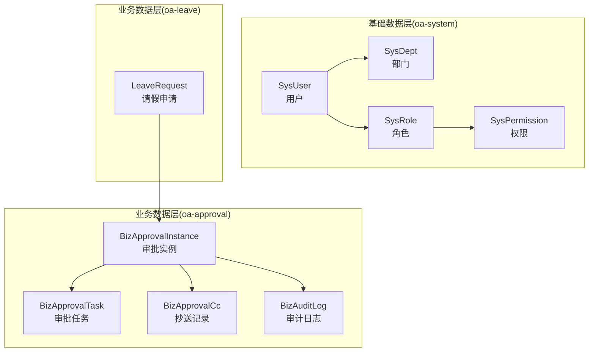
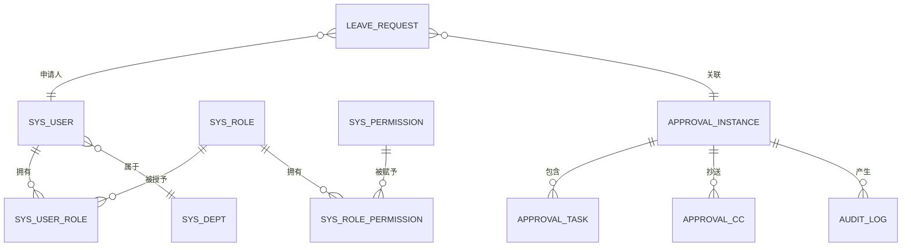
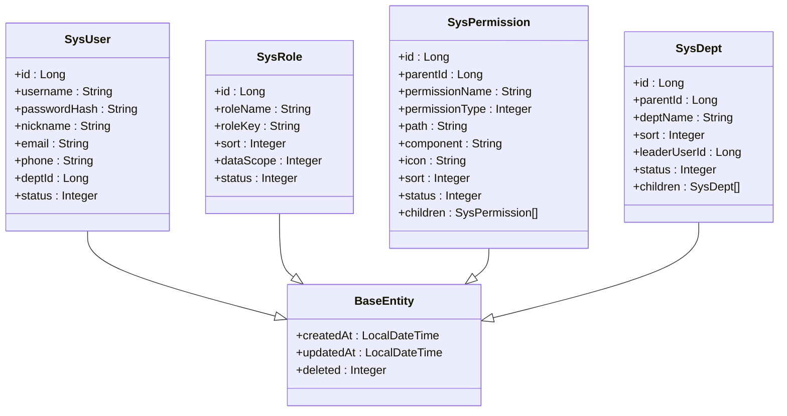
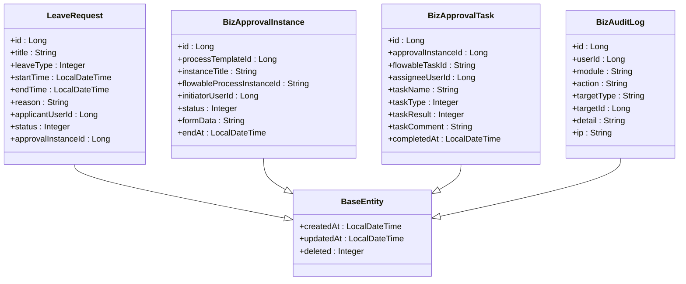
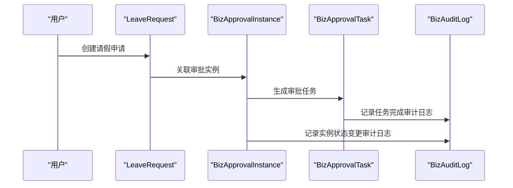
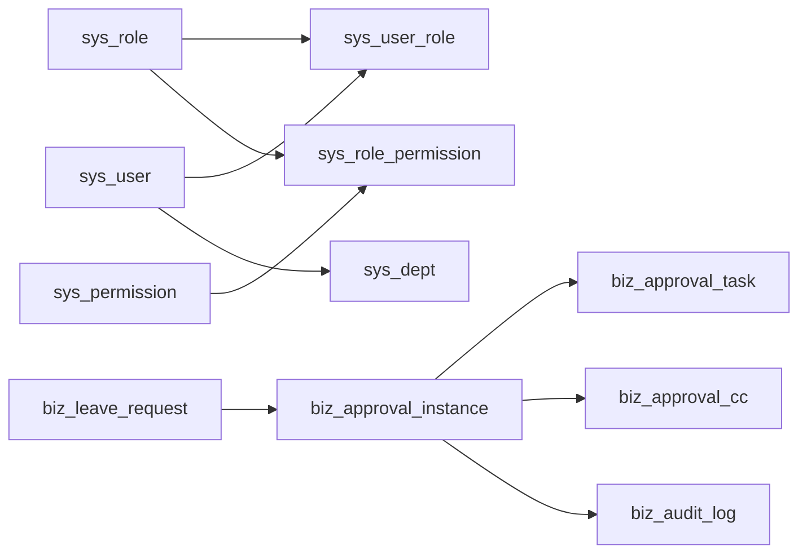

# 数据模型分层设计

<cite>
**本文引用的文件**
- [BaseEntity.java](file://oa-common/src/main/java/com/oa/admin/common/entity/BaseEntity.java)
- [SysUser.java](file://oa-system/src/main/java/com/oa/admin/system/entity/SysUser.java)
- [SysRole.java](file://oa-system/src/main/java/com/oa/admin/system/entity/SysRole.java)
- [SysPermission.java](file://oa-system/src/main/java/com/oa/admin/system/entity/SysPermission.java)
- [SysDept.java](file://oa-system/src/main/java/com/oa/admin/system/entity/SysDept.java)
- [BizApprovalInstance.java](file://oa-approval/src/main/java/com/oa/admin/approval/entity/BizApprovalInstance.java)
- [BizApprovalTask.java](file://oa-approval/src/main/java/com/oa/admin/approval/entity/BizApprovalTask.java)
- [BizAuditLog.java](file://oa-approval/src/main/java/com/oa/admin/approval/entity/BizAuditLog.java)
- [LeaveRequest.java](file://oa-leave/src/main/java/com/oa/admin/leave/entity/LeaveRequest.java)
- [V1__init_sys_tables.sql](file://oa-app/src/main/resources/db/migration/V1__init_sys_tables.sql)
- [V2__init_biz_tables.sql](file://oa-app/src/main/resources/db/migration/V2__init_biz_tables.sql)
- [V13__approval_base_entity_columns.sql](file://oa-app/src/main/resources/db/migration/V13__approval_base_entity_columns.sql)
- [CommonStatus.java](file://oa-common/src/main/java/com/oa/admin/common/enums/CommonStatus.java)
- [ApprovalInstanceStatus.java](file://oa-approval/src/main/java/com/oa/admin/approval/enums/ApprovalInstanceStatus.java)
- [leave-request.yaml](file://generators/leave-request.yaml)
</cite>

## 目录
1. [引言](#引言)
2. [项目结构](#项目结构)
3. [核心组件](#核心组件)
4. [架构总览](#架构总览)
5. [详细组件分析](#详细组件分析)
6. [依赖分析](#依赖分析)
7. [性能考虑](#性能考虑)
8. [故障排查指南](#故障排查指南)
9. [结论](#结论)
10. [附录](#附录)

## 引言
本设计文档面向OA审批管理系统，提出三层数据模型分层架构：基础数据层（RBAC用户、角色、权限、部门）、业务数据层（请假申请、审批实例、审批任务）、审计数据层（操作日志、流程轨迹）。文档从实体关系映射、继承体系设计、字段抽象化、生命周期管理（创建、更新、软删除、归档）以及跨层数据关联（外键约束、级联操作、数据同步）等方面进行系统性阐述，并给出实体类设计规范与参考路径。

## 项目结构
系统采用多模块划分，分别承载不同层次的数据模型与业务能力：
- 基础数据层：oa-system 模块，负责RBAC用户、角色、权限、部门等基础数据。
- 业务数据层：oa-approval 负责审批流程相关（实例、任务、抄送、模板），oa-leave 负责具体业务实体（如请假申请）。
- 公共层：oa-common 提供通用基类与枚举，统一字段与行为。
- 数据库迁移：oa-app/resources/db/migration 下的版本化SQL脚本，定义各层表结构与索引。

图表来源
- [SysUser.java:1-27](file://oa-system/src/main/java/com/oa/admin/system/entity/SysUser.java#L1-L27)
- [SysRole.java:1-26](file://oa-system/src/main/java/com/oa/admin/system/entity/SysRole.java#L1-L26)
- [SysPermission.java:1-35](file://oa-system/src/main/java/com/oa/admin/system/entity/SysPermission.java#L1-L35)
- [SysDept.java:1-31](file://oa-system/src/main/java/com/oa/admin/system/entity/SysDept.java#L1-L31)
- [BizApprovalInstance.java:1-33](file://oa-approval/src/main/java/com/oa/admin/approval/entity/BizApprovalInstance.java#L1-L33)
- [BizApprovalTask.java:1-35](file://oa-approval/src/main/java/com/oa/admin/approval/entity/BizApprovalTask.java#L1-L35)
- [BizAuditLog.java:1-28](file://oa-approval/src/main/java/com/oa/admin/approval/entity/BizAuditLog.java#L1-L28)
- [LeaveRequest.java:1-48](file://oa-leave/src/main/java/com/oa/admin/leave/entity/LeaveRequest.java#L1-L48)

章节来源
- [V1__init_sys_tables.sql:1-84](file://oa-app/src/main/resources/db/migration/V1__init_sys_tables.sql#L1-L84)
- [V2__init_biz_tables.sql:1-74](file://oa-app/src/main/resources/db/migration/V2__init_biz_tables.sql#L1-L74)

## 核心组件
- 继承体系与字段抽象：所有实体均继承公共基类，统一包含创建时间、更新时间与软删除字段，确保跨模块一致的生命周期管理。
- 枚举与状态：公共状态与业务状态通过枚举统一表达，便于跨模块一致性校验与查询优化。
- 实体设计规范：主键、表名、注释、索引、可搜索字段等遵循统一约定，提升可维护性与可扩展性。

章节来源
- [BaseEntity.java:1-26](file://oa-common/src/main/java/com/oa/admin/common/entity/BaseEntity.java#L1-L26)
- [CommonStatus.java:1-26](file://oa-common/src/main/java/com/oa/admin/common/enums/CommonStatus.java#L1-L26)
- [ApprovalInstanceStatus.java:1-29](file://oa-approval/src/main/java/com/oa/admin/approval/enums/ApprovalInstanceStatus.java#L1-L29)

## 架构总览
三层数据模型的职责边界与交互关系如下：
- 基础数据层：提供身份认证与授权所需的基础数据，支撑业务层的用户识别、角色授权与数据范围控制。
- 业务数据层：承载具体的业务流程与业务实体，审批流程贯穿请假等具体业务场景。
- 审计数据层：记录系统关键操作与流程轨迹，保障合规与可追溯。

图表来源
- [V1__init_sys_tables.sql:63-83](file://oa-app/src/main/resources/db/migration/V1__init_sys_tables.sql#L63-L83)
- [V2__init_biz_tables.sql:19-58](file://oa-app/src/main/resources/db/migration/V2__init_biz_tables.sql#L19-L58)
- [SysUser.java:1-27](file://oa-system/src/main/java/com/oa/admin/system/entity/SysUser.java#L1-L27)
- [SysRole.java:1-26](file://oa-system/src/main/java/com/oa/admin/system/entity/SysRole.java#L1-L26)
- [SysPermission.java:1-35](file://oa-system/src/main/java/com/oa/admin/system/entity/SysPermission.java#L1-L35)
- [SysDept.java:1-31](file://oa-system/src/main/java/com/oa/admin/system/entity/SysDept.java#L1-L31)
- [LeaveRequest.java:1-48](file://oa-leave/src/main/java/com/oa/admin/leave/entity/LeaveRequest.java#L1-L48)
- [BizApprovalInstance.java:1-33](file://oa-approval/src/main/java/com/oa/admin/approval/entity/BizApprovalInstance.java#L1-L33)
- [BizApprovalTask.java:1-35](file://oa-approval/src/main/java/com/oa/admin/approval/entity/BizApprovalTask.java#L1-L35)
- [BizAuditLog.java:1-28](file://oa-approval/src/main/java/com/oa/admin/approval/entity/BizAuditLog.java#L1-L28)

## 详细组件分析

### 基础数据层（RBAC）
- 用户（SysUser）：承载登录凭据、基本信息与所属部门；支持唯一约束用户名+软删除组合，避免重复。
- 角色（SysRole）：角色标识、排序、数据范围（全部/本部门/自定义）与状态。
- 权限（SysPermission）：菜单/按钮/API三类权限，支持树形父子关系与排序。
- 部门（SysDept）：树形组织架构，支持领导与状态。
- 关联关系：用户-角色多对多、角色-权限多对多、角色-部门多对多，形成完整的授权闭环。

图表来源
- [BaseEntity.java:1-26](file://oa-common/src/main/java/com/oa/admin/common/entity/BaseEntity.java#L1-L26)
- [SysUser.java:1-27](file://oa-system/src/main/java/com/oa/admin/system/entity/SysUser.java#L1-L27)
- [SysRole.java:1-26](file://oa-system/src/main/java/com/oa/admin/system/entity/SysRole.java#L1-L26)
- [SysPermission.java:1-35](file://oa-system/src/main/java/com/oa/admin/system/entity/SysPermission.java#L1-L35)
- [SysDept.java:1-31](file://oa-system/src/main/java/com/oa/admin/system/entity/SysDept.java#L1-L31)

章节来源
- [V1__init_sys_tables.sql:5-83](file://oa-app/src/main/resources/db/migration/V1__init_sys_tables.sql#L5-L83)
- [SysUser.java:1-27](file://oa-system/src/main/java/com/oa/admin/system/entity/SysUser.java#L1-L27)
- [SysRole.java:1-26](file://oa-system/src/main/java/com/oa/admin/system/entity/SysRole.java#L1-L26)
- [SysPermission.java:1-35](file://oa-system/src/main/java/com/oa/admin/system/entity/SysPermission.java#L1-L35)
- [SysDept.java:1-31](file://oa-system/src/main/java/com/oa/admin/system/entity/SysDept.java#L1-L31)

### 业务数据层（请假与审批）
- 请假申请（LeaveRequest）：标题、类型、起止时间、原因、申请人、状态、关联审批实例ID。
- 审批实例（BizApprovalInstance）：模板ID、标题、发起人、状态、表单数据、结束时间。
- 审批任务（BizApprovalTask）：实例ID、处理人、任务类型、结果、评论、完成时间。
- 抄送记录（BizApprovalCc）：实例ID、抄送人、原因、阅读时间。
- 审计日志（BizAuditLog）：用户、模块、动作、目标类型与ID、详情、IP。

图表来源
- [BaseEntity.java:1-26](file://oa-common/src/main/java/com/oa/admin/common/entity/BaseEntity.java#L1-L26)
- [LeaveRequest.java:1-48](file://oa-leave/src/main/java/com/oa/admin/leave/entity/LeaveRequest.java#L1-L48)
- [BizApprovalInstance.java:1-33](file://oa-approval/src/main/java/com/oa/admin/approval/entity/BizApprovalInstance.java#L1-L33)
- [BizApprovalTask.java:1-35](file://oa-approval/src/main/java/com/oa/admin/approval/entity/BizApprovalTask.java#L1-L35)
- [BizAuditLog.java:1-28](file://oa-approval/src/main/java/com/oa/admin/approval/entity/BizAuditLog.java#L1-L28)

章节来源
- [V2__init_biz_tables.sql:5-73](file://oa-app/src/main/resources/db/migration/V2__init_biz_tables.sql#L5-L73)
- [LeaveRequest.java:1-48](file://oa-leave/src/main/java/com/oa/admin/leave/entity/LeaveRequest.java#L1-L48)
- [BizApprovalInstance.java:1-33](file://oa-approval/src/main/java/com/oa/admin/approval/entity/BizApprovalInstance.java#L1-L33)
- [BizApprovalTask.java:1-35](file://oa-approval/src/main/java/com/oa/admin/approval/entity/BizApprovalTask.java#L1-L35)
- [BizAuditLog.java:1-28](file://oa-approval/src/main/java/com/oa/admin/approval/entity/BizAuditLog.java#L1-L28)

### 审计数据层（操作日志与流程轨迹）
- 审计日志（BizAuditLog）：记录用户在系统中的关键操作，支持按用户、模块、动作与时间维度检索。
- 流程轨迹：审批实例与任务构成流程执行轨迹，结合模板与表单数据实现完整可追溯性。

图表来源
- [LeaveRequest.java:44-45](file://oa-leave/src/main/java/com/oa/admin/leave/entity/LeaveRequest.java#L44-L45)
- [BizApprovalInstance.java:22-28](file://oa-approval/src/main/java/com/oa/admin/approval/entity/BizApprovalInstance.java#L22-L28)
- [BizApprovalTask.java:22-30](file://oa-approval/src/main/java/com/oa/admin/approval/entity/BizApprovalTask.java#L22-L30)
- [BizAuditLog.java:20-27](file://oa-approval/src/main/java/com/oa/admin/approval/entity/BizAuditLog.java#L20-L27)

章节来源
- [V2__init_biz_tables.sql:60-73](file://oa-app/src/main/resources/db/migration/V2__init_biz_tables.sql#L60-L73)
- [BizAuditLog.java:1-28](file://oa-approval/src/main/java/com/oa/admin/approval/entity/BizAuditLog.java#L1-L28)

## 依赖分析
- 外键与索引：基础层表之间通过唯一约束与索引保证数据完整性；业务层通过外键与索引连接到基础层与自身。
- 级联与同步：业务层不直接定义外键约束，通过应用层服务保证一致性；审计日志作为旁路数据，不参与强一致性约束。
- 版本演进：审批层在历史版本中逐步补充软删除与更新时间字段，保持与公共基类一致。

图表来源
- [V1__init_sys_tables.sql:63-83](file://oa-app/src/main/resources/db/migration/V1__init_sys_tables.sql#L63-L83)
- [V2__init_biz_tables.sql:19-58](file://oa-app/src/main/resources/db/migration/V2__init_biz_tables.sql#L19-L58)

章节来源
- [V13__approval_base_entity_columns.sql:1-13](file://oa-app/src/main/resources/db/migration/V13__approval_base_entity_columns.sql#L1-L13)

## 性能考虑
- 索引策略：基础层按父节点与状态建立索引；业务层按模板ID、发起人、状态、处理人等高频查询字段建立索引，降低扫描成本。
- 软删除：统一使用软删除字段，避免物理删除带来的连带影响与数据丢失风险。
- 字段抽象：通过公共基类统一时间与删除字段，减少重复定义与维护成本。
- 归档策略：建议对历史实例与任务定期归档至离线存储，保留审计日志与模板元数据以满足合规要求。

## 故障排查指南
- 状态枚举校验：若出现未知状态码，需检查枚举定义与数据库字典是否一致。
- 软删除与可见性：确认查询接口是否正确过滤deleted字段，避免脏数据污染。
- 关联一致性：请假申请与审批实例的关联字段应保持一致，防止流程中断或数据错配。
- 审计日志缺失：检查审计事件触发点与异步写入队列，确保关键操作均有记录。

章节来源
- [CommonStatus.java:17-24](file://oa-common/src/main/java/com/oa/admin/common/enums/CommonStatus.java#L17-L24)
- [ApprovalInstanceStatus.java:20-27](file://oa-approval/src/main/java/com/oa/admin/approval/enums/ApprovalInstanceStatus.java#L20-L27)
- [BaseEntity.java:23-24](file://oa-common/src/main/java/com/oa/admin/common/entity/BaseEntity.java#L23-L24)

## 结论
本分层设计以公共基类与枚举为纽带，将RBAC基础数据、业务流程与审计日志有机整合，既满足当前请假审批场景，又为未来扩展其他业务流程提供清晰的建模范式。通过软删除、索引与归档策略，兼顾了数据安全、性能与可维护性。

## 附录

### 生命周期管理（创建、更新、软删除、归档）
- 创建：由MyBatis-Plus自动填充创建时间字段。
- 更新：由MyBatis-Plus自动填充更新时间字段。
- 软删除：统一使用软删除字段，查询时默认过滤已删除记录。
- 归档：对历史实例与任务进行周期性归档，保留必要审计信息。

章节来源
- [BaseEntity.java:15-24](file://oa-common/src/main/java/com/oa/admin/common/entity/BaseEntity.java#L15-L24)
- [V13__approval_base_entity_columns.sql:3-12](file://oa-app/src/main/resources/db/migration/V13__approval_base_entity_columns.sql#L3-L12)

### 实体类设计规范与示例路径
- 统一继承：所有实体继承公共基类，确保字段一致性。
- 表名与注解：使用标准注解标注主键、表名与字段含义。
- 参考路径：
  - [SysUser.java:1-27](file://oa-system/src/main/java/com/oa/admin/system/entity/SysUser.java#L1-L27)
  - [SysRole.java:1-26](file://oa-system/src/main/java/com/oa/admin/system/entity/SysRole.java#L1-L26)
  - [SysPermission.java:1-35](file://oa-system/src/main/java/com/oa/admin/system/entity/SysPermission.java#L1-L35)
  - [SysDept.java:1-31](file://oa-system/src/main/java/com/oa/admin/system/entity/SysDept.java#L1-L31)
  - [LeaveRequest.java:1-48](file://oa-leave/src/main/java/com/oa/admin/leave/entity/LeaveRequest.java#L1-L48)
  - [BizApprovalInstance.java:1-33](file://oa-approval/src/main/java/com/oa/admin/approval/entity/BizApprovalInstance.java#L1-L33)
  - [BizApprovalTask.java:1-35](file://oa-approval/src/main/java/com/oa/admin/approval/entity/BizApprovalTask.java#L1-L35)
  - [BizAuditLog.java:1-28](file://oa-approval/src/main/java/com/oa/admin/approval/entity/BizAuditLog.java#L1-L28)

### 字段抽象化与枚举化
- 字段抽象：通过公共基类统一时间与删除字段，减少重复定义。
- 枚举化：公共状态与业务状态以枚举形式表达，便于跨模块一致性校验。
- 参考路径：
  - [CommonStatus.java:1-26](file://oa-common/src/main/java/com/oa/admin/common/enums/CommonStatus.java#L1-L26)
  - [ApprovalInstanceStatus.java:1-29](file://oa-approval/src/main/java/com/oa/admin/approval/enums/ApprovalInstanceStatus.java#L1-L29)
  - [leave-request.yaml:6-21](file://generators/leave-request.yaml#L6-L21)