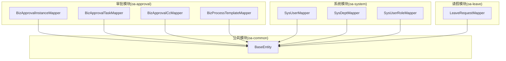
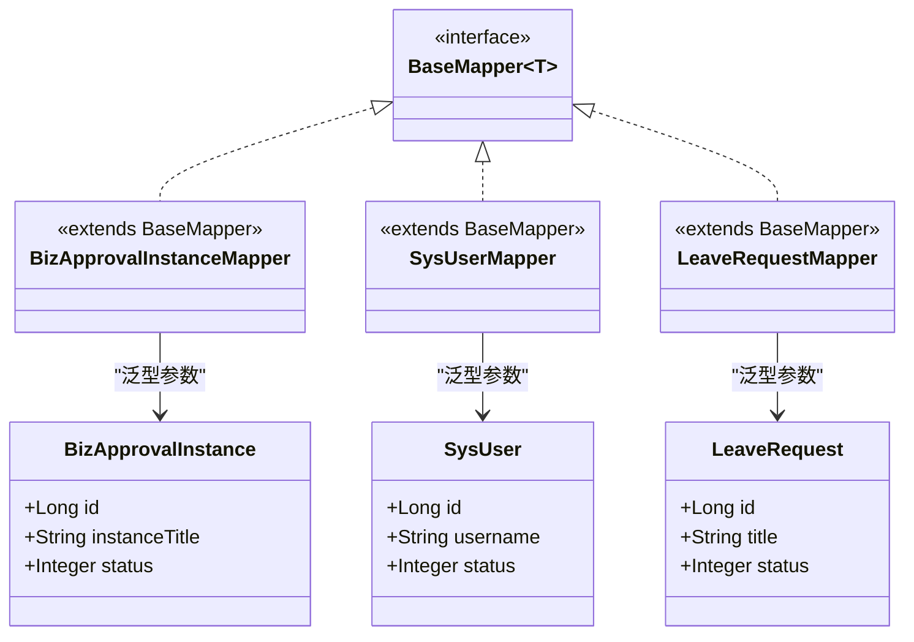
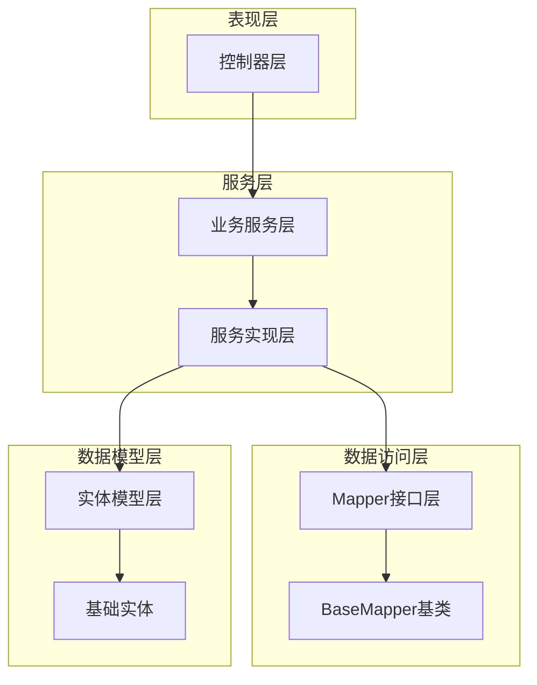
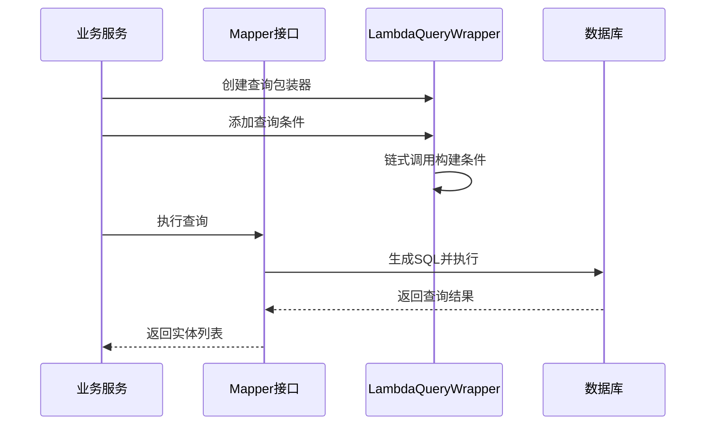
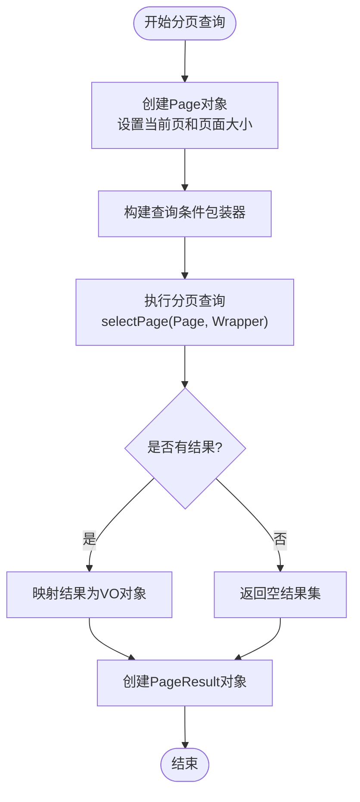
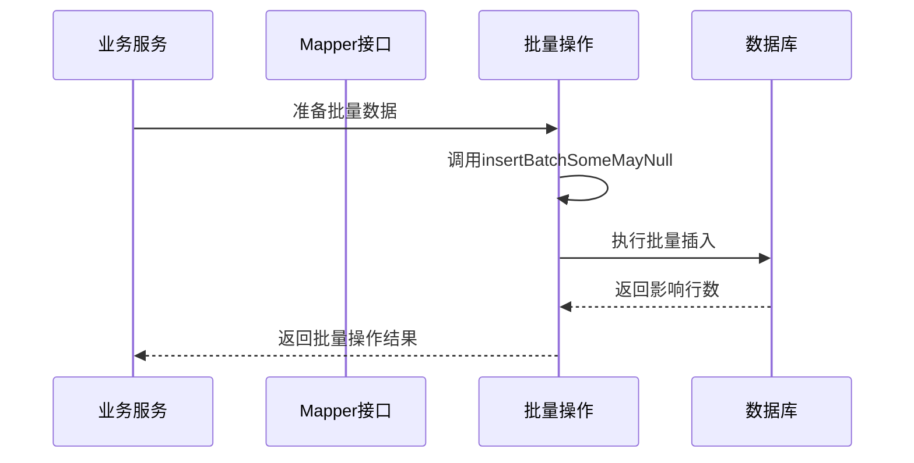
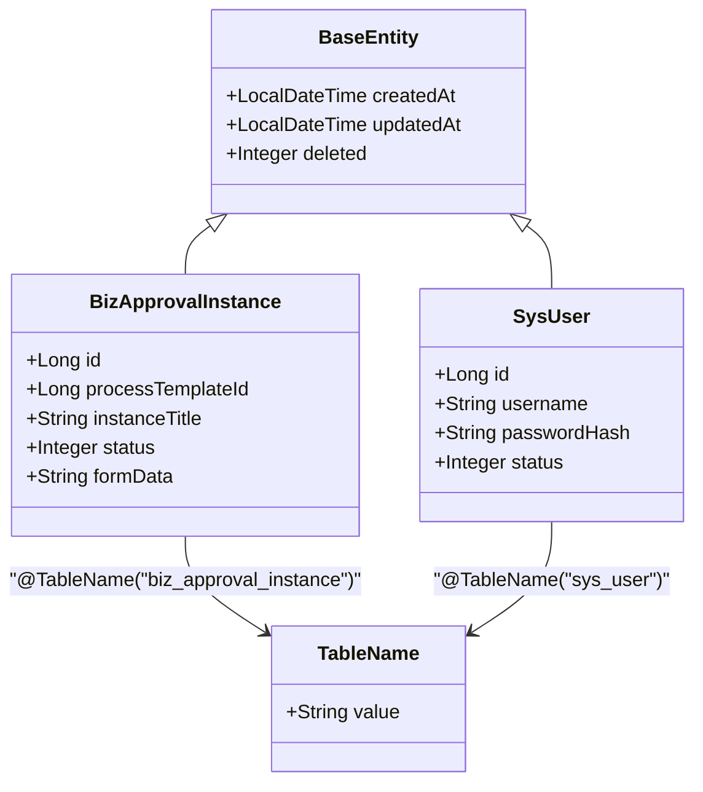
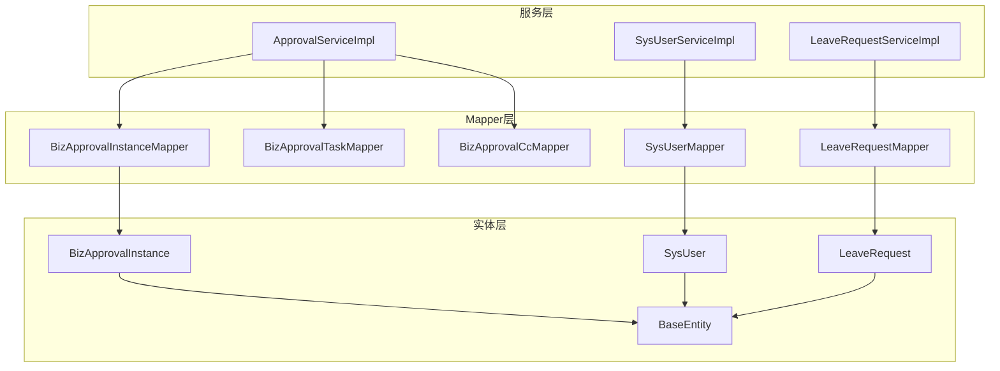

# Mapper接口设计

<cite>
**本文档引用的文件**
- [BizApprovalInstanceMapper.java](file://oa-approval/src/main/java/com/oa/admin/approval/mapper/BizApprovalInstanceMapper.java)
- [BizApprovalTaskMapper.java](file://oa-approval/src/main/java/com/oa/admin/approval/mapper/BizApprovalTaskMapper.java)
- [BizApprovalCcMapper.java](file://oa-approval/src/main/java/com/oa/admin/approval/mapper/BizApprovalCcMapper.java)
- [SysUserMapper.java](file://oa-system/src/main/java/com/oa/admin/system/mapper/SysUserMapper.java)
- [SysDeptMapper.java](file://oa-system/src/main/java/com/oa/admin/system/mapper/SysDeptMapper.java)
- [LeaveRequestMapper.java](file://oa-leave/src/main/java/com/oa/admin/leave/mapper/LeaveRequestMapper.java)
- [SysUserRoleMapper.java](file://oa-system/src/main/java/com/oa/admin/system/mapper/SysUserRoleMapper.java)
- [BizProcessTemplateMapper.java](file://oa-approval/src/main/java/com/oa/admin/approval/mapper/BizProcessTemplateMapper.java)
- [ApprovalServiceImpl.java](file://oa-approval/src/main/java/com/oa/admin/approval/service/impl/ApprovalServiceImpl.java)
- [SysUserServiceImpl.java](file://oa-system/src/main/java/com/oa/admin/system/service/impl/SysUserServiceImpl.java)
- [LeaveRequestServiceImpl.java](file://oa-leave/src/main/java/com/oa/admin/leave/service/impl/LeaveRequestServiceImpl.java)
- [BaseEntity.java](file://oa-common/src/main/java/com/oa/admin/common/entity/BaseEntity.java)
- [BizApprovalInstance.java](file://oa-approval/src/main/java/com/oa/admin/approval/entity/BizApprovalInstance.java)
- [SysUser.java](file://oa-system/src/main/java/com/oa/admin/system/entity/SysUser.java)
</cite>

## 目录
1. [简介](#简介)
2. [项目结构](#项目结构)
3. [核心组件](#核心组件)
4. [架构概览](#架构概览)
5. [详细组件分析](#详细组件分析)
6. [依赖分析](#依赖分析)
7. [性能考虑](#性能考虑)
8. [故障排除指南](#故障排除指南)
9. [结论](#结论)

## 简介

本文件为OA审批管理系统的Mapper接口设计文档，系统性阐述了基于MyBatis-Plus的Mapper接口设计规范与最佳实践。文档涵盖以下关键主题：

- Mapper接口命名规范与继承关系：统一采用BaseMapper并结合领域模型进行接口定义
- 泛型参数设置：明确实体类型与Mapper接口的对应关系
- 条件构造器的使用：QueryWrapper、UpdateWrapper、LambdaQueryWrapper的组合应用
- 批量操作实现：insertBatchSomeMayNull、updateBatchById等方法的使用场景
- 动态表名处理与分页查询技巧
- Mapper接口设计的最佳实践与性能优化建议

## 项目结构

OA审批管理系统采用多模块架构，各模块均包含独立的Mapper层，遵循统一的命名规范与设计模式。

**图表来源**
- [BizApprovalInstanceMapper.java:1-13](file://oa-approval/src/main/java/com/oa/admin/approval/mapper/BizApprovalInstanceMapper.java#L1-L13)
- [SysUserMapper.java:1-13](file://oa-system/src/main/java/com/oa/admin/system/mapper/SysUserMapper.java#L1-L13)
- [LeaveRequestMapper.java:1-14](file://oa-leave/src/main/java/com/oa/admin/leave/mapper/LeaveRequestMapper.java#L1-L14)
- [BaseEntity.java:1-26](file://oa-common/src/main/java/com/oa/admin/common/entity/BaseEntity.java#L1-L26)

**章节来源**
- [BizApprovalInstanceMapper.java:1-13](file://oa-approval/src/main/java/com/oa/admin/approval/mapper/BizApprovalInstanceMapper.java#L1-L13)
- [SysUserMapper.java:1-13](file://oa-system/src/main/java/com/oa/admin/system/mapper/SysUserMapper.java#L1-L13)
- [LeaveRequestMapper.java:1-14](file://oa-leave/src/main/java/com/oa/admin/leave/mapper/LeaveRequestMapper.java#L1-L14)
- [BaseEntity.java:1-26](file://oa-common/src/main/java/com/oa/admin/common/entity/BaseEntity.java#L1-L26)

## 核心组件

### Mapper接口命名规范

系统采用统一的命名约定，确保接口设计的一致性和可维护性：

- **命名模式**：`领域模型名称 + Mapper`
- **包结构**：`com.oa.admin.{模块}.mapper`
- **继承关系**：所有Mapper接口统一继承BaseMapper<实体类>

**示例接口对比**：
- 审批模块：BizApprovalInstanceMapper、BizApprovalTaskMapper、BizApprovalCcMapper
- 系统模块：SysUserMapper、SysDeptMapper、SysUserRoleMapper
- 请假模块：LeaveRequestMapper

### 泛型参数设置

每个Mapper接口都明确指定泛型参数，确保类型安全：

**图表来源**
- [BizApprovalInstanceMapper.java:3-12](file://oa-approval/src/main/java/com/oa/admin/approval/mapper/BizApprovalInstanceMapper.java#L3-L12)
- [SysUserMapper.java:3-12](file://oa-system/src/main/java/com/oa/admin/system/mapper/SysUserMapper.java#L3-L12)
- [LeaveRequestMapper.java:3-13](file://oa-leave/src/main/java/com/oa/admin/leave/mapper/LeaveRequestMapper.java#L3-L13)

### 继承关系设计

所有Mapper接口均继承BaseMapper，获得完整的CRUD能力：

- **基础CRUD**：save、updateById、removeById、list、page等
- **条件查询**：selectList、selectPage、selectCount等
- **批量操作**：insertBatchSomeMayNull、updateBatchById等（在ServiceImpl中使用）

**章节来源**
- [BizApprovalInstanceMapper.java:10-12](file://oa-approval/src/main/java/com/oa/admin/approval/mapper/BizApprovalInstanceMapper.java#L10-L12)
- [SysUserMapper.java:10-12](file://oa-system/src/main/java/com/oa/admin/system/mapper/SysUserMapper.java#L10-L12)
- [LeaveRequestMapper.java:11-13](file://oa-leave/src/main/java/com/oa/admin/leave/mapper/LeaveRequestMapper.java#L11-L13)

## 架构概览

系统采用分层架构，Mapper层位于数据访问层，向上提供数据持久化服务。

**图表来源**
- [ApprovalServiceImpl.java:57-60](file://oa-approval/src/main/java/com/oa/admin/approval/service/impl/ApprovalServiceImpl.java#L57-L60)
- [SysUserServiceImpl.java:22-24](file://oa-system/src/main/java/com/oa/admin/system/service/impl/SysUserServiceImpl.java#L22-L24)
- [LeaveRequestServiceImpl.java:32-34](file://oa-leave/src/main/java/com/oa/admin/leave/service/impl/LeaveRequestServiceImpl.java#L32-L34)

## 详细组件分析

### 条件构造器使用模式

系统广泛使用LambdaQueryWrapper进行条件查询，提供类型安全的链式调用。

#### 基础查询模式

**图表来源**
- [ApprovalServiceImpl.java:236-242](file://oa-approval/src/main/java/com/oa/admin/approval/service/impl/ApprovalServiceImpl.java#L236-L242)
- [SysUserServiceImpl.java:28-36](file://oa-system/src/main/java/com/oa/admin/system/service/impl/SysUserServiceImpl.java#L28-L36)

#### 复杂条件组合

系统支持多种条件组合方式：

1. **简单条件**：eq、ne、gt、ge、lt、le
2. **范围查询**：between、notBetween
3. **模糊匹配**：like、notLike
4. **集合查询**：in、notIn
5. **空值判断**：isNull、isNotNull
6. **排序**：orderByAsc、orderByDesc

**章节来源**
- [ApprovalServiceImpl.java:313-326](file://oa-approval/src/main/java/com/oa/admin/approval/service/impl/ApprovalServiceImpl.java#L313-L326)
- [SysUserServiceImpl.java:28-36](file://oa-system/src/main/java/com/oa/admin/system/service/impl/SysUserServiceImpl.java#L28-L36)
- [LeaveRequestServiceImpl.java:44-55](file://oa-leave/src/main/java/com/oa/admin/leave/service/impl/LeaveRequestServiceImpl.java#L44-L55)

### 分页查询实现

系统采用MyBatis-Plus的Page类实现分页查询，提供高效的分页能力。

**图表来源**
- [ApprovalServiceImpl.java:451-478](file://oa-approval/src/main/java/com/oa/admin/approval/service/impl/ApprovalServiceImpl.java#L451-L478)
- [SysUserServiceImpl.java:28-36](file://oa-system/src/main/java/com/oa/admin/system/service/impl/SysUserServiceImpl.java#L28-L36)

**章节来源**
- [ApprovalServiceImpl.java:451-508](file://oa-approval/src/main/java/com/oa/admin/approval/service/impl/ApprovalServiceImpl.java#L451-L508)
- [SysUserServiceImpl.java:28-36](file://oa-system/src/main/java/com/oa/admin/system/service/impl/SysUserServiceImpl.java#L28-L36)

### 批量操作实现

虽然Mapper接口继承BaseMapper提供了批量操作方法，但系统主要在ServiceImpl中使用这些方法来实现批量处理。

#### 批量插入

**图表来源**
- [SysUserServiceImpl.java:60-71](file://oa-system/src/main/java/com/oa/admin/system/service/impl/SysUserServiceImpl.java#L60-L71)

#### 批量更新

系统在业务逻辑中使用批量更新来处理角色分配等场景。

**章节来源**
- [SysUserServiceImpl.java:60-71](file://oa-system/src/main/java/com/oa/admin/system/service/impl/SysUserServiceImpl.java#L60-L71)

### 动态表名处理

系统通过实体类注解实现动态表名映射：

**图表来源**
- [BizApprovalInstance.java:18-32](file://oa-approval/src/main/java/com/oa/admin/approval/entity/BizApprovalInstance.java#L18-L32)
- [SysUser.java:15-26](file://oa-system/src/main/java/com/oa/admin/system/entity/SysUser.java#L15-L26)

**章节来源**
- [BizApprovalInstance.java:18-32](file://oa-approval/src/main/java/com/oa/admin/approval/entity/BizApprovalInstance.java#L18-L32)
- [SysUser.java:15-26](file://oa-system/src/main/java/com/oa/admin/system/entity/SysUser.java#L15-L26)

## 依赖分析

系统中Mapper接口与实体类、服务层存在明确的依赖关系。

**图表来源**
- [ApprovalServiceImpl.java:17-20](file://oa-approval/src/main/java/com/oa/admin/approval/service/impl/ApprovalServiceImpl.java#L17-L20)
- [SysUserServiceImpl.java:10-11](file://oa-system/src/main/java/com/oa/admin/system/service/impl/SysUserServiceImpl.java#L10-L11)
- [LeaveRequestServiceImpl.java:20-21](file://oa-leave/src/main/java/com/oa/admin/leave/service/impl/LeaveRequestServiceImpl.java#L20-L21)

**章节来源**
- [ApprovalServiceImpl.java:17-20](file://oa-approval/src/main/java/com/oa/admin/approval/service/impl/ApprovalServiceImpl.java#L17-L20)
- [SysUserServiceImpl.java:10-11](file://oa-system/src/main/java/com/oa/admin/system/service/impl/SysUserServiceImpl.java#L10-L11)
- [LeaveRequestServiceImpl.java:20-21](file://oa-leave/src/main/java/com/oa/admin/leave/service/impl/LeaveRequestServiceImpl.java#L20-L21)

## 性能考虑

### 查询优化策略

1. **选择性字段查询**：使用select方法只查询必要字段
2. **索引利用**：在高频查询字段上建立数据库索引
3. **分页查询**：避免一次性加载大量数据
4. **条件优化**：合理使用where条件，避免全表扫描

### 批量操作优化

1. **批量大小控制**：合理设置批量操作的数据量
2. **事务管理**：将批量操作放入单个事务中
3. **内存管理**：避免一次性加载过多数据到内存

### 缓存策略

1. **查询缓存**：对频繁查询且不经常变化的数据启用缓存
2. **结果映射缓存**：缓存复杂查询的结果映射

## 故障排除指南

### 常见问题及解决方案

#### 条件查询问题

**问题**：LambdaQueryWrapper条件不生效
**解决方案**：
- 检查实体类字段是否正确映射
- 确认条件值不为空或null
- 验证数据库字段类型匹配

#### 分页查询问题

**问题**：分页查询结果不准确
**解决方案**：
- 确认Page对象参数设置正确
- 检查排序字段是否存在
- 验证总记录数统计准确性

#### 批量操作问题

**问题**：批量插入失败
**解决方案**：
- 检查实体类主键设置
- 验证数据库连接状态
- 确认事务配置正确

**章节来源**
- [ApprovalServiceImpl.java:115-159](file://oa-approval/src/main/java/com/oa/admin/approval/service/impl/ApprovalServiceImpl.java#L115-L159)
- [SysUserServiceImpl.java:38-58](file://oa-system/src/main/java/com/oa/admin/system/service/impl/SysUserServiceImpl.java#L38-L58)

## 结论

OA审批管理系统的Mapper接口设计体现了以下特点：

1. **标准化设计**：统一的命名规范和继承关系，确保代码一致性
2. **类型安全**：通过泛型参数确保编译时类型检查
3. **功能完整**：充分利用BaseMapper提供的CRUD能力
4. **查询灵活**：LambdaQueryWrapper提供强大的条件查询能力
5. **性能优化**：合理的分页查询和批量操作策略

该设计模式为后续功能扩展提供了良好的基础，建议在新功能开发中继续遵循相同的规范和最佳实践。