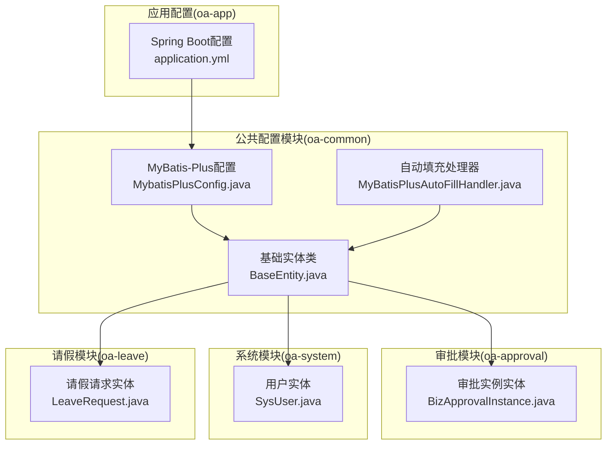
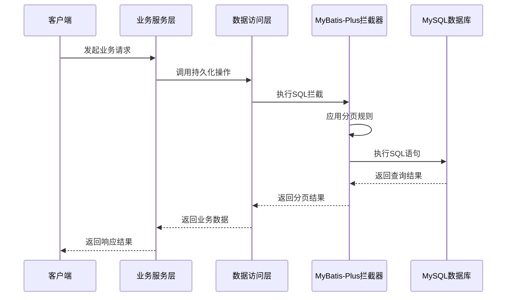
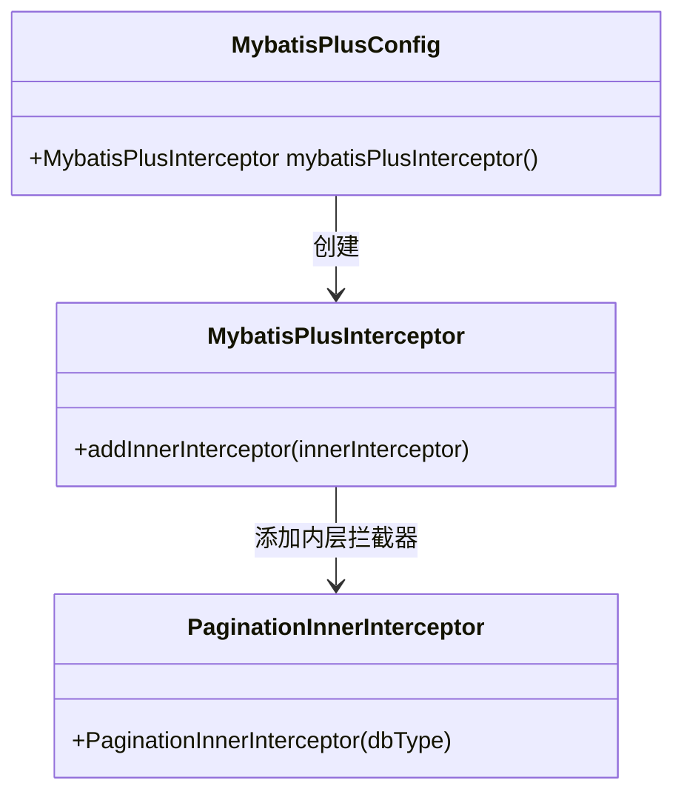
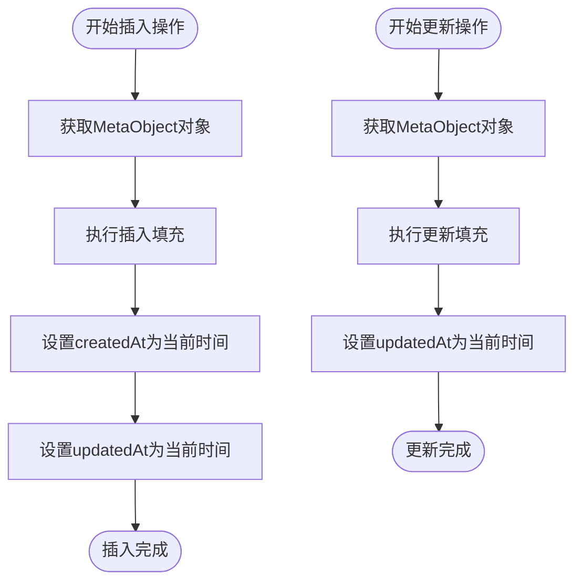
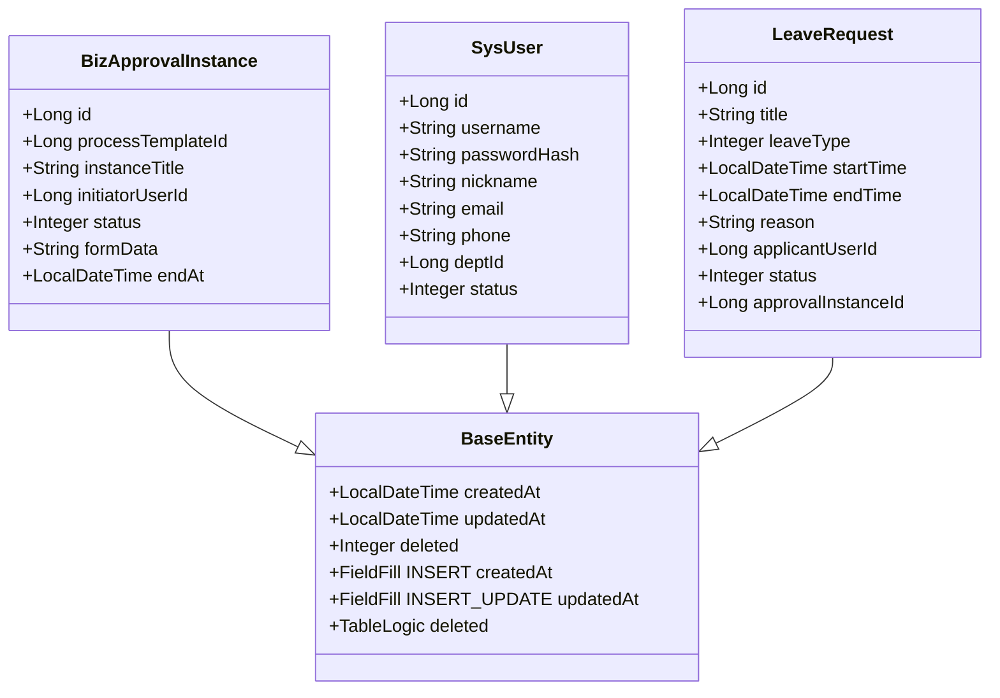
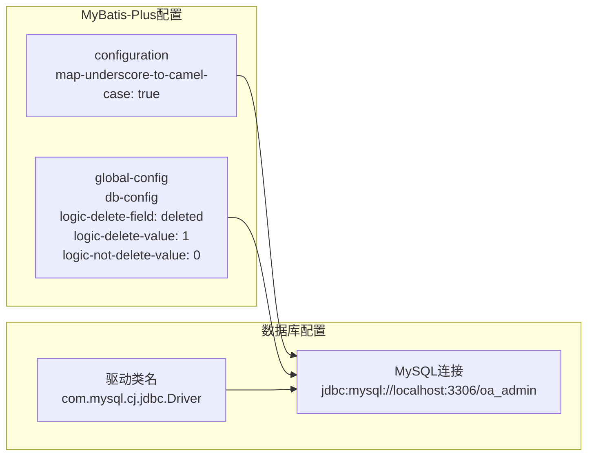
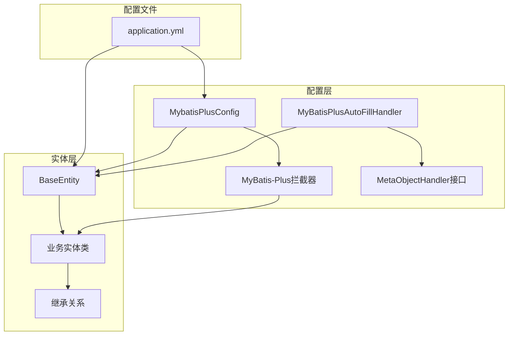

# MyBatis-Plus配置

<cite>
**本文档引用的文件**
- [MybatisPlusConfig.java](file://oa-common/src/main/java/com/oa/admin/common/config/MybatisPlusConfig.java)
- [MyBatisPlusAutoFillHandler.java](file://oa-common/src/main/java/com/oa/admin/common/config/MyBatisPlusAutoFillHandler.java)
- [BaseEntity.java](file://oa-common/src/main/java/com/oa/admin/common/entity/BaseEntity.java)
- [BizApprovalInstance.java](file://oa-approval/src/main/java/com/oa/admin/approval/entity/BizApprovalInstance.java)
- [SysUser.java](file://oa-system/src/main/java/com/oa/admin/system/entity/SysUser.java)
- [LeaveRequest.java](file://oa-leave/src/main/java/com/oa/admin/leave/entity/LeaveRequest.java)
- [application.yml](file://oa-app/src/main/resources/application.yml)
</cite>

## 目录
1. [简介](#简介)
2. [项目结构](#项目结构)
3. [核心组件](#核心组件)
4. [架构概览](#架构概览)
5. [详细组件分析](#详细组件分析)
6. [依赖关系分析](#依赖关系分析)
7. [性能考虑](#性能考虑)
8. [故障排除指南](#故障排除指南)
9. [结论](#结论)

## 简介

本文件为OA审批管理系统的MyBatis-Plus配置文档，详细说明了系统中MyBatis-Plus的拦截器配置、全局配置项以及自动填充机制。文档重点涵盖以下方面：

- MyBatis-Plus拦截器配置：分页插件设置（MySQL数据库类型）
- 全局配置项：数据库类型设置、下划线转驼峰映射、逻辑删除配置
- 自动填充机制：创建时间和更新时间的自动设置
- 最佳实践与常见问题解决方案

## 项目结构

OA审批管理系统采用多模块架构，MyBatis-Plus配置主要集中在公共模块（oa-common）中，各业务模块通过继承基础实体类来使用统一的配置。

**图表来源**
- [MybatisPlusConfig.java:1-23](file://oa-common/src/main/java/com/oa/admin/common/config/MybatisPlusConfig.java#L1-L23)
- [MyBatisPlusAutoFillHandler.java:1-25](file://oa-common/src/main/java/com/oa/admin/common/config/MyBatisPlusAutoFillHandler.java#L1-L25)
- [BaseEntity.java:1-26](file://oa-common/src/main/java/com/oa/admin/common/entity/BaseEntity.java#L1-L26)

**章节来源**
- [MybatisPlusConfig.java:1-23](file://oa-common/src/main/java/com/oa/admin/common/config/MybatisPlusConfig.java#L1-L23)
- [MyBatisPlusAutoFillHandler.java:1-25](file://oa-common/src/main/java/com/oa/admin/common/config/MyBatisPlusAutoFillHandler.java#L1-L25)
- [BaseEntity.java:1-26](file://oa-common/src/main/java/com/oa/admin/common/entity/BaseEntity.java#L1-L26)

## 核心组件

### MyBatis-Plus拦截器配置

系统使用MyBatis-Plus拦截器实现分页功能，配置位于公共配置类中：

- **拦截器类型**：MybatisPlusInterceptor
- **分页插件**：PaginationInnerInterceptor
- **数据库类型**：DbType.MYSQL
- **配置位置**：MybatisPlusConfig类中的@Bean方法

### 自动填充处理器

系统实现了统一的自动填充处理器，用于处理创建时间和更新时间的自动设置：

- **处理器类**：MyBatisPlusAutoFillHandler
- **实现接口**：MetaObjectHandler
- **填充字段**：createdAt、updatedAt
- **填充时机**：插入时和更新时

### 基础实体类

所有业务实体类继承自BaseEntity，获得统一的字段定义和注解配置：

- **创建时间**：createdAt（插入时自动填充）
- **更新时间**：updatedAt（插入和更新时自动填充）
- **逻辑删除**：deleted（逻辑删除字段）

**章节来源**
- [MybatisPlusConfig.java:14-22](file://oa-common/src/main/java/com/oa/admin/common/config/MybatisPlusConfig.java#L14-L22)
- [MyBatisPlusAutoFillHandler.java:11-24](file://oa-common/src/main/java/com/oa/admin/common/config/MyBatisPlusAutoFillHandler.java#L11-L24)
- [BaseEntity.java:14-25](file://oa-common/src/main/java/com/oa/admin/common/entity/BaseEntity.java#L14-L25)

## 架构概览

系统采用分层架构设计，MyBatis-Plus配置贯穿整个数据访问层：

**图表来源**
- [MybatisPlusConfig.java:16-21](file://oa-common/src/main/java/com/oa/admin/common/config/MybatisPlusConfig.java#L16-L21)

## 详细组件分析

### MyBatis-Plus配置类分析

MyBatis-Plus配置类负责定义拦截器和全局配置：

**图表来源**
- [MybatisPlusConfig.java:14-22](file://oa-common/src/main/java/com/oa/admin/common/config/MybatisPlusConfig.java#L14-L22)

配置特点：
- 使用MySQL数据库类型进行分页优化
- 拦截器在SQL执行前生效
- 支持多种数据库类型的分页策略

**章节来源**
- [MybatisPlusConfig.java:1-23](file://oa-common/src/main/java/com/oa/admin/common/config/MybatisPlusConfig.java#L1-L23)

### 自动填充处理器实现

自动填充处理器确保所有实体的创建和更新时间得到正确设置：

**图表来源**
- [MyBatisPlusAutoFillHandler.java:14-23](file://oa-common/src/main/java/com/oa/admin/common/config/MyBatisPlusAutoFillHandler.java#L14-L23)

实现原理：
- 插入时自动设置创建时间和更新时间为当前时间
- 更新时仅更新更新时间为当前时间
- 使用strictInsertFill和strictUpdateFill确保类型安全

**章节来源**
- [MyBatisPlusAutoFillHandler.java:1-25](file://oa-common/src/main/java/com/oa/admin/common/config/MyBatisPlusAutoFillHandler.java#L1-L25)

### 基础实体类设计

BaseEntity为所有业务实体提供统一的基础字段和行为：

**图表来源**
- [BaseEntity.java:14-25](file://oa-common/src/main/java/com/oa/admin/common/entity/BaseEntity.java#L14-L25)
- [BizApprovalInstance.java:19](file://oa-approval/src/main/java/com/oa/admin/approval/entity/BizApprovalInstance.java#L19)
- [SysUser.java:16](file://oa-system/src/main/java/com/oa/admin/system/entity/SysUser.java#L16)
- [LeaveRequest.java:18](file://oa-leave/src/main/java/com/oa/admin/leave/entity/LeaveRequest.java#L18)

设计特点：
- 统一的时间戳字段定义
- 逻辑删除字段支持软删除
- 字段填充注解确保自动填充生效

**章节来源**
- [BaseEntity.java:1-26](file://oa-common/src/main/java/com/oa/admin/common/entity/BaseEntity.java#L1-L26)
- [BizApprovalInstance.java:1-33](file://oa-approval/src/main/java/com/oa/admin/approval/entity/BizApprovalInstance.java#L1-L33)
- [SysUser.java:1-27](file://oa-system/src/main/java/com/oa/admin/system/entity/SysUser.java#L1-L27)
- [LeaveRequest.java:1-48](file://oa-leave/src/main/java/com/oa/admin/leave/entity/LeaveRequest.java#L1-L48)

### 全局配置项详解

系统通过application.yml配置MyBatis-Plus的全局行为：

**图表来源**
- [application.yml:36-44](file://oa-app/src/main/resources/application.yml#L36-L44)

配置项说明：
- **下划线转驼峰映射**：启用后自动将数据库下划线字段映射到Java驼峰命名属性
- **逻辑删除配置**：deleted字段值为1表示已删除，0表示未删除
- **数据库类型设置**：分页插件针对MySQL进行优化

**章节来源**
- [application.yml:1-59](file://oa-app/src/main/resources/application.yml#L1-L59)

## 依赖关系分析

系统中各组件之间的依赖关系如下：

**图表来源**
- [MybatisPlusConfig.java:14-22](file://oa-common/src/main/java/com/oa/admin/common/config/MybatisPlusConfig.java#L14-L22)
- [MyBatisPlusAutoFillHandler.java:11-12](file://oa-common/src/main/java/com/oa/admin/common/config/MyBatisPlusAutoFillHandler.java#L11-L12)
- [BaseEntity.java:14-25](file://oa-common/src/main/java/com/oa/admin/common/entity/BaseEntity.java#L14-L25)

依赖特点：
- 配置类依赖于MyBatis-Plus的核心接口
- 实体类依赖于BaseEntity提供的统一字段定义
- 自动填充处理器实现MetaObjectHandler接口
- 所有配置通过application.yml集中管理

**章节来源**
- [MybatisPlusConfig.java:1-23](file://oa-common/src/main/java/com/oa/admin/common/config/MybatisPlusConfig.java#L1-L23)
- [MyBatisPlusAutoFillHandler.java:1-25](file://oa-common/src/main/java/com/oa/admin/common/config/MyBatisPlusAutoFillHandler.java#L1-L25)
- [BaseEntity.java:1-26](file://oa-common/src/main/java/com/oa/admin/common/entity/BaseEntity.java#L1-L26)

## 性能考虑

基于系统现有配置，以下是性能相关的考虑因素：

### 分页性能优化
- **数据库类型优化**：针对MySQL的分页插件配置提供了特定的SQL优化
- **查询效率**：分页插件只对查询语句生效，不影响插入和更新操作
- **内存使用**：合理设置分页大小避免大量数据加载到内存

### 自动填充性能
- **反射开销**：MetaObjectHandler的反射调用会有一定性能开销
- **批量操作**：在批量插入时，自动填充机制会逐条执行
- **缓存策略**：时间戳计算是轻量级操作，性能影响可忽略

### 配置建议
- **分页大小控制**：根据业务需求设置合理的每页记录数
- **索引优化**：确保常用查询字段建立适当的数据库索引
- **连接池配置**：结合HikariCP配置优化数据库连接性能

## 故障排除指南

### 常见问题及解决方案

#### 1. 分页功能异常
**问题症状**：分页查询返回全部数据而非指定页
**可能原因**：
- MyBatis-Plus拦截器未正确注册
- 数据库类型配置不匹配
- SQL语句中包含不支持的分页语法

**解决步骤**：
1. 检查MybatisPlusConfig类是否被Spring容器扫描
2. 确认数据库连接URL中的数据库类型
3. 验证Mapper接口中的分页方法签名

#### 2. 自动填充时间不正确
**问题症状**：createdAt或updatedAt字段为空或显示错误时间
**可能原因**：
- MetaObjectHandler未正确实现
- 实体类字段注解配置错误
- 数据库时区设置问题

**解决步骤**：
1. 确认MyBatisPlusAutoFillHandler类正确实现
2. 检查BaseEntity中字段注解配置
3. 验证数据库服务器时区设置

#### 3. 逻辑删除功能失效
**问题症状**：删除操作实际删除数据而非标记删除
**可能原因**：
- 逻辑删除字段配置错误
- 查询时未使用MyBatis-Plus的查询方法
- 数据库中deleted字段类型不正确

**解决步骤**：
1. 检查application.yml中的逻辑删除配置
2. 确保使用selectList等MyBatis-Plus查询方法
3. 验证数据库表结构中deleted字段定义

#### 4. 下划线转驼峰映射失败
**问题症状**：数据库字段名与Java属性名映射不正确
**可能原因**：
- map-underscore-to-camel-case配置未启用
- 字段命名不符合约定
- 实体类属性注解冲突

**解决步骤**：
1. 确认application.yml中已启用下划线转驼峰映射
2. 检查字段命名是否符合下划线命名规范
3. 移除可能冲突的属性注解

**章节来源**
- [MybatisPlusConfig.java:16-21](file://oa-common/src/main/java/com/oa/admin/common/config/MybatisPlusConfig.java#L16-L21)
- [MyBatisPlusAutoFillHandler.java:14-23](file://oa-common/src/main/java/com/oa/admin/common/config/MyBatisPlusAutoFillHandler.java#L14-L23)
- [application.yml:37-43](file://oa-app/src/main/resources/application.yml#L37-L43)

## 结论

OA审批管理系统的MyBatis-Plus配置体现了良好的架构设计和最佳实践：

### 主要优势
1. **统一配置管理**：通过公共配置类集中管理MyBatis-Plus设置
2. **自动化的数据维护**：自动填充机制确保时间戳的一致性
3. **灵活的分页支持**：针对MySQL优化的分页插件
4. **清晰的实体设计**：BaseEntity提供统一的字段定义

### 配置要点
- 分页插件必须与实际数据库类型匹配
- 自动填充处理器需要正确实现MetaObjectHandler接口
- 逻辑删除配置需要数据库和代码两端配合
- 下划线转驼峰映射提升开发体验

### 后续改进建议
1. 考虑添加乐观锁支持以增强并发安全性
2. 实现更完善的日志记录机制
3. 添加配置验证和监控告警
4. 优化批量操作的性能表现

该配置方案为OA审批管理系统提供了稳定可靠的数据访问层基础，支持系统的持续发展和扩展。