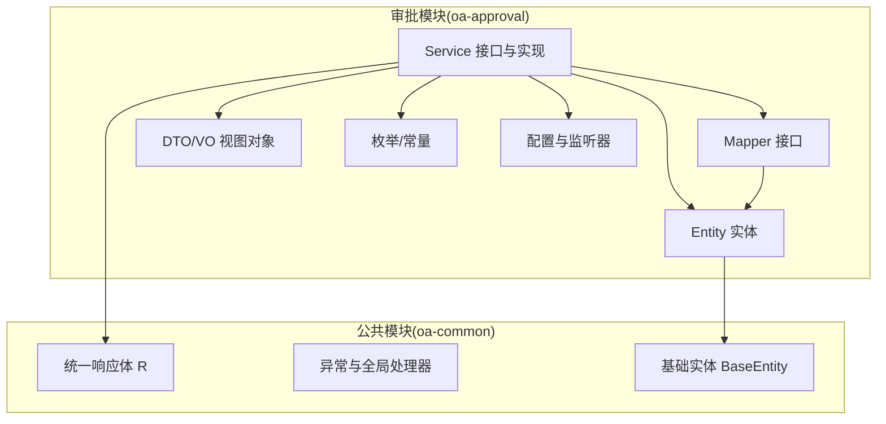
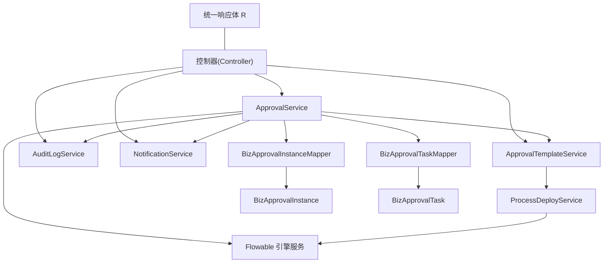
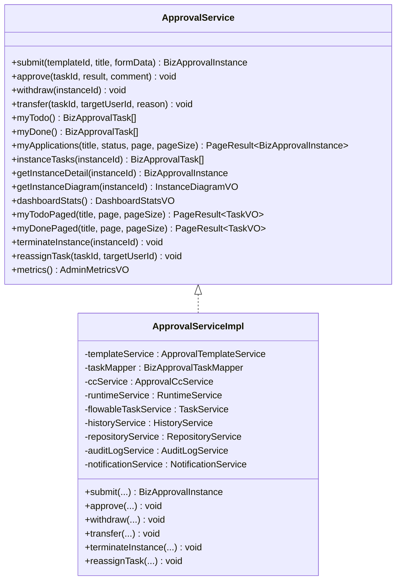
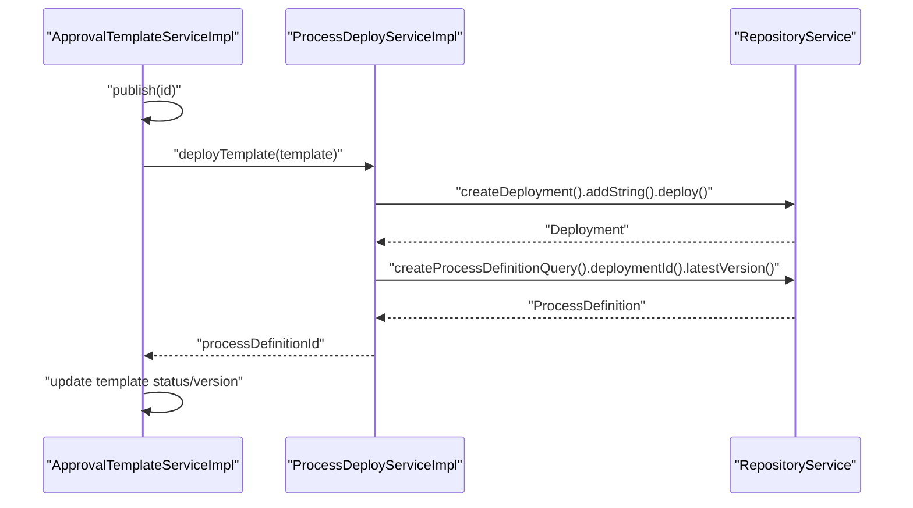
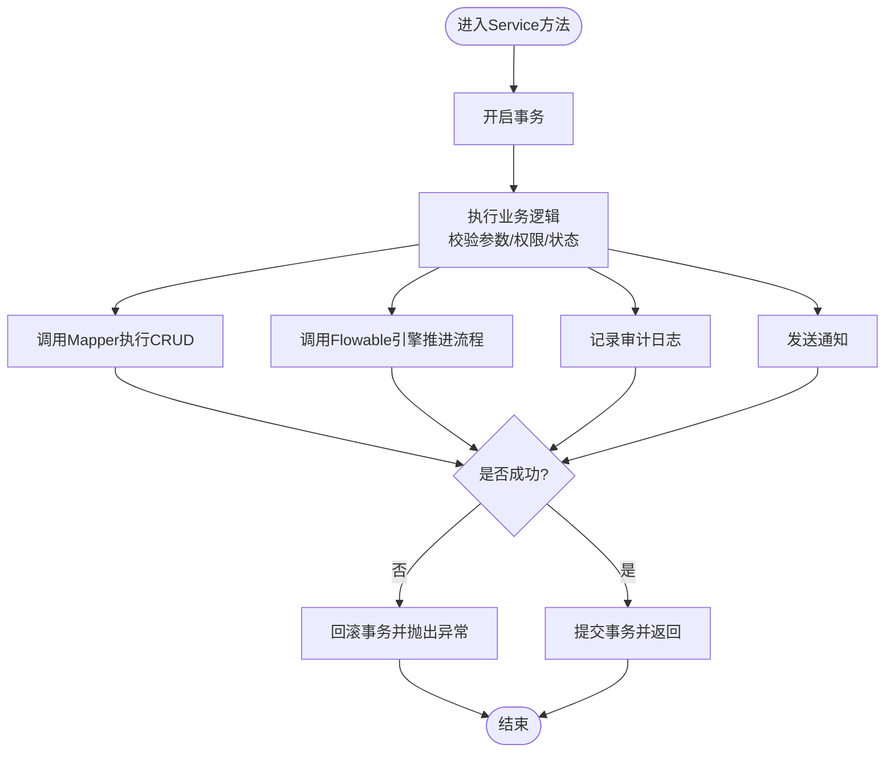
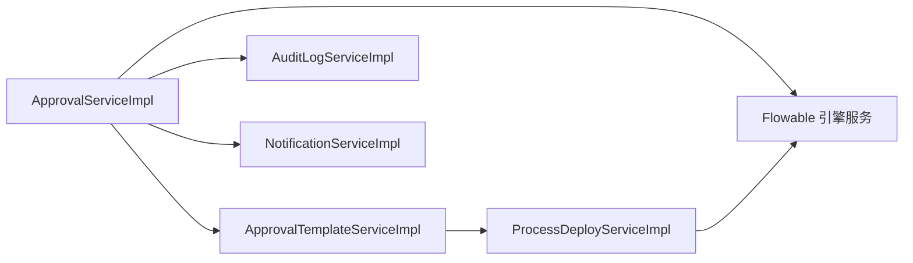

# Service层集成模式

<cite>
**本文引用的文件**
- [ApprovalServiceImpl.java](file://oa-approval/src/main/java/com/oa/admin/approval/service/impl/ApprovalServiceImpl.java)
- [ApprovalTemplateServiceImpl.java](file://oa-approval/src/main/java/com/oa/admin/approval/service/impl/ApprovalTemplateServiceImpl.java)
- [AuditLogServiceImpl.java](file://oa-approval/src/main/java/com/oa/admin/approval/service/impl/AuditLogServiceImpl.java)
- [NotificationServiceImpl.java](file://oa-approval/src/main/java/com/oa/admin/approval/service/impl/NotificationServiceImpl.java)
- [ProcessDeployServiceImpl.java](file://oa-approval/src/main/java/com/oa/admin/approval/service/impl/ProcessDeployServiceImpl.java)
- [ApprovalService.java](file://oa-approval/src/main/java/com/oa/admin/approval/service/ApprovalService.java)
- [ApprovalTemplateService.java](file://oa-approval/src/main/java/com/oa/admin/approval/service/ApprovalTemplateService.java)
- [AuditLogService.java](file://oa-approval/src/main/java/com/oa/admin/approval/service/AuditLogService.java)
- [NotificationService.java](file://oa-approval/src/main/java/com/oa/admin/approval/service/NotificationService.java)
- [ProcessDeployService.java](file://oa-approval/src/main/java/com/oa/admin/approval/service/ProcessDeployService.java)
- [BizApprovalInstanceMapper.java](file://oa-approval/src/main/java/com/oa/admin/approval/mapper/BizApprovalInstanceMapper.java)
- [BizApprovalTaskMapper.java](file://oa-approval/src/main/java/com/oa/admin/approval/mapper/BizApprovalTaskMapper.java)
- [BizApprovalInstance.java](file://oa-approval/src/main/java/com/oa/admin/approval/entity/BizApprovalInstance.java)
- [BizApprovalTask.java](file://oa-approval/src/main/java/com/oa/admin/approval/entity/BizApprovalTask.java)
- [R.java](file://oa-common/src/main/java/com/oa/admin/common/result/R.java)
</cite>

## 目录
1. [引言](#引言)
2. [项目结构](#项目结构)
3. [核心组件](#核心组件)
4. [架构总览](#架构总览)
5. [详细组件分析](#详细组件分析)
6. [依赖分析](#依赖分析)
7. [性能考虑](#性能考虑)
8. [故障排查指南](#故障排查指南)
9. [结论](#结论)
10. [附录](#附录)

## 引言
本文件面向OA审批管理系统，系统化梳理Service层的集成模式与最佳实践，重点覆盖以下主题：
- 通用Service封装：基于IService接口的设计、自定义Service接口的职责边界、业务逻辑的统一封装方式
- Service与Mapper协作：事务管理、异常处理、数据转换与视图对象映射
- 复杂业务场景：流程引擎集成、分布式事务与一致性、幂等性与并发控制
- 测试策略：单元测试、Mock对象、集成测试设计
- 架构原则与性能优化：可维护性、可扩展性、性能与可靠性

## 项目结构
本项目采用多模块分层架构，审批模块（oa-approval）包含Service、Mapper、Entity、DTO、枚举、常量与配置等子包；公共模块（oa-common）提供统一响应体、异常与通用工具。

**图表来源**
- [ApprovalServiceImpl.java:1-783](file://oa-approval/src/main/java/com/oa/admin/approval/service/impl/ApprovalServiceImpl.java#L1-L783)
- [BizApprovalInstance.java:1-33](file://oa-approval/src/main/java/com/oa/admin/approval/entity/BizApprovalInstance.java#L1-L33)
- [BizApprovalTask.java:1-35](file://oa-approval/src/main/java/com/oa/admin/approval/entity/BizApprovalTask.java#L1-L35)
- [R.java:1-44](file://oa-common/src/main/java/com/oa/admin/common/result/R.java#L1-L44)

**章节来源**
- [ApprovalServiceImpl.java:1-783](file://oa-approval/src/main/java/com/oa/admin/approval/service/impl/ApprovalServiceImpl.java#L1-L783)
- [ApprovalService.java:1-57](file://oa-approval/src/main/java/com/oa/admin/approval/service/ApprovalService.java#L1-L57)

## 核心组件
- 通用Service接口与实现
  - 基于IService的通用能力：分页查询、条件构造器、批量操作等
  - 自定义Service接口：按领域划分职责，如审批实例、模板、审计日志、通知、流程部署
- 领域Service实现
  - 审批服务：提交、审批、撤回、转办、统计、仪表盘、管理员操作
  - 模板服务：草稿保存、发布、版本管理、节点配置
  - 审计日志服务：统一记录用户行为
  - 通知服务：站内信发送与状态管理
  - 流程部署服务：BPMN部署与XML读取
- Mapper与实体
  - Mapper接口继承MyBatis-Plus的BaseMapper，提供CRUD与条件查询
  - 实体类映射数据库表，承载业务字段与JSON格式化注解

**章节来源**
- [ApprovalService.java:1-57](file://oa-approval/src/main/java/com/oa/admin/approval/service/ApprovalService.java#L1-L57)
- [ApprovalTemplateService.java:1-33](file://oa-approval/src/main/java/com/oa/admin/approval/service/ApprovalTemplateService.java#L1-L33)
- [AuditLogService.java:1-17](file://oa-approval/src/main/java/com/oa/admin/approval/service/AuditLogService.java#L1-L17)
- [NotificationService.java:1-24](file://oa-approval/src/main/java/com/oa/admin/approval/service/NotificationService.java#L1-L24)
- [ProcessDeployService.java:1-14](file://oa-approval/src/main/java/com/oa/admin/approval/service/ProcessDeployService.java#L1-L14)
- [BizApprovalInstanceMapper.java:1-13](file://oa-approval/src/main/java/com/oa/admin/approval/mapper/BizApprovalInstanceMapper.java#L1-L13)
- [BizApprovalTaskMapper.java:1-13](file://oa-approval/src/main/java/com/oa/admin/approval/mapper/BizApprovalTaskMapper.java#L1-L13)
- [BizApprovalInstance.java:1-33](file://oa-approval/src/main/java/com/oa/admin/approval/entity/BizApprovalInstance.java#L1-L33)
- [BizApprovalTask.java:1-35](file://oa-approval/src/main/java/com/oa/admin/approval/entity/BizApprovalTask.java#L1-L35)

## 架构总览
Service层围绕“领域服务+流程引擎+数据访问”协同工作，统一通过事务管理保障一致性，通过异常码与统一响应体对外输出。

**图表来源**
- [ApprovalServiceImpl.java:101-111](file://oa-approval/src/main/java/com/oa/admin/approval/service/impl/ApprovalServiceImpl.java#L101-L111)
- [ApprovalTemplateServiceImpl.java:29-30](file://oa-approval/src/main/java/com/oa/admin/approval/service/impl/ApprovalTemplateServiceImpl.java#L29-L30)
- [ProcessDeployServiceImpl.java:26-27](file://oa-approval/src/main/java/com/oa/admin/approval/service/impl/ProcessDeployServiceImpl.java#L26-L27)
- [BizApprovalInstanceMapper.java:10-12](file://oa-approval/src/main/java/com/oa/admin/approval/mapper/BizApprovalInstanceMapper.java#L10-L12)
- [BizApprovalTaskMapper.java:10-12](file://oa-approval/src/main/java/com/oa/admin/approval/mapper/BizApprovalTaskMapper.java#L10-L12)
- [R.java:9-44](file://oa-common/src/main/java/com/oa/admin/common/result/R.java#L9-L44)

## 详细组件分析

### 审批服务（ApprovalService）与实现
- 职责边界
  - 提交：校验模板状态、构建流程变量、启动流程实例、持久化审批实例、记录审计日志
  - 审批：校验任务存在与权限、设置结果与评论、推进流程、触发抄送、发送通知
  - 撤回：仅未处理的待审实例可撤回，清理流程与挂起任务
  - 转办/重分配：变更任务归属并同步至流程引擎
  - 统计与仪表盘：待办/已办数量、模板数、未读抄送、最近活动
  - 管理员操作：全量实例查询、终止实例、重新指派任务、指标统计
- 事务与一致性
  - 使用@Transactional确保数据库更新与流程推进在同一个事务中
  - 对外通过统一响应体返回，内部抛出业务异常码
- 数据转换
  - 将实体列表转换为VO，补充实例标题、发起人、状态与摘要信息
- 流程引擎集成
  - 通过RuntimeService、TaskService、HistoryService、RepositoryService协调流程生命周期

**图表来源**
- [ApprovalService.java:18-56](file://oa-approval/src/main/java/com/oa/admin/approval/service/ApprovalService.java#L18-L56)
- [ApprovalServiceImpl.java:60-111](file://oa-approval/src/main/java/com/oa/admin/approval/service/impl/ApprovalServiceImpl.java#L60-L111)

**章节来源**
- [ApprovalServiceImpl.java:113-231](file://oa-approval/src/main/java/com/oa/admin/approval/service/impl/ApprovalServiceImpl.java#L113-L231)
- [ApprovalServiceImpl.java:255-298](file://oa-approval/src/main/java/com/oa/admin/approval/service/impl/ApprovalServiceImpl.java#L255-L298)
- [ApprovalServiceImpl.java:547-593](file://oa-approval/src/main/java/com/oa/admin/approval/service/impl/ApprovalServiceImpl.java#L547-L593)
- [ApprovalServiceImpl.java:654-696](file://oa-approval/src/main/java/com/oa/admin/approval/service/impl/ApprovalServiceImpl.java#L654-L696)
- [ApprovalServiceImpl.java:698-721](file://oa-approval/src/main/java/com/oa/admin/approval/service/impl/ApprovalServiceImpl.java#L698-L721)

### 模板服务（ApprovalTemplateService）与实现
- 职责边界
  - 草稿保存：若原记录已发布则禁止修改
  - 发布：校验BPMN XML有效性，部署到流程引擎，生成流程定义ID并递增版本
  - 新建版本：复制已发布模板为新草稿
  - 取消发布：退回为草稿
  - 节点配置：保存/读取流程节点的抄送与规则配置
- 事务与一致性
  - 发布与草稿保存均使用事务，确保模板状态与流程定义一致

**图表来源**
- [ApprovalTemplateServiceImpl.java:58-81](file://oa-approval/src/main/java/com/oa/admin/approval/service/impl/ApprovalTemplateServiceImpl.java#L58-L81)
- [ProcessDeployServiceImpl.java:28-58](file://oa-approval/src/main/java/com/oa/admin/approval/service/impl/ProcessDeployServiceImpl.java#L28-L58)

**章节来源**
- [ApprovalTemplateServiceImpl.java:41-81](file://oa-approval/src/main/java/com/oa/admin/approval/service/impl/ApprovalTemplateServiceImpl.java#L41-L81)
- [ApprovalTemplateServiceImpl.java:116-141](file://oa-approval/src/main/java/com/oa/admin/approval/service/impl/ApprovalTemplateServiceImpl.java#L116-L141)

### 审计日志服务（AuditLogService）与实现
- 职责边界
  - 记录模块、动作、目标类型与ID、详情与时间
  - 支持按模块、动作、目标、用户、时间范围查询
- 事务与异常
  - 写入日志不参与业务主事务，避免阻塞主流程

**章节来源**
- [AuditLogServiceImpl.java:22-65](file://oa-approval/src/main/java/com/oa/admin/approval/service/impl/AuditLogServiceImpl.java#L22-L65)

### 通知服务（NotificationService）与实现
- 职责边界
  - 单发/批量发送通知
  - 查询我的通知、未读数统计、标记已读/全部已读
- 并发与幂等
  - 标记已读时进行存在性校验，避免重复处理

**章节来源**
- [NotificationServiceImpl.java:27-92](file://oa-approval/src/main/java/com/oa/admin/approval/service/impl/NotificationServiceImpl.java#L27-L92)

### 流程部署服务（ProcessDeployService）与实现
- 职责边界
  - 将模板XML部署为流程定义，返回最新版本的定义ID
  - 从部署中读取XML资源
- 错误处理
  - 部署失败或找不到定义时抛出业务异常

**章节来源**
- [ProcessDeployServiceImpl.java:28-58](file://oa-approval/src/main/java/com/oa/admin/approval/service/impl/ProcessDeployServiceImpl.java#L28-L58)

### Service与Mapper协作关系
- 依赖注入
  - Service实现通过构造器注入Mapper与第三方服务（如Flowable）
- 事务管理
  - 业务方法标注@Transactional，确保数据库与流程引擎操作原子性
- 异常处理
  - 业务异常统一抛出，由全局异常处理器转换为统一响应体
- 数据转换
  - Service层负责将实体转换为DTO/VO，减少控制器负担

**图表来源**
- [ApprovalServiceImpl.java:113-159](file://oa-approval/src/main/java/com/oa/admin/approval/service/impl/ApprovalServiceImpl.java#L113-L159)
- [ApprovalServiceImpl.java:161-231](file://oa-approval/src/main/java/com/oa/admin/approval/service/impl/ApprovalServiceImpl.java#L161-L231)
- [AuditLogServiceImpl.java:22-32](file://oa-approval/src/main/java/com/oa/admin/approval/service/impl/AuditLogServiceImpl.java#L22-L32)
- [NotificationServiceImpl.java:27-44](file://oa-approval/src/main/java/com/oa/admin/approval/service/impl/NotificationServiceImpl.java#L27-L44)

## 依赖分析
- 组件耦合
  - ApprovalServiceImpl高度内聚于审批领域，依赖模板、任务、审计、通知、流程引擎服务
  - 模板服务依赖流程部署服务，形成清晰的领域边界
- 外部依赖
  - Flowable引擎：流程定义、运行时、历史与任务管理
  - MyBatis-Plus：通用Mapper与分页查询
  - Sa-Token：登录用户上下文
- 循环依赖
  - 当前模块未见循环依赖，Service间通过接口解耦

**图表来源**
- [ApprovalServiceImpl.java:101-111](file://oa-approval/src/main/java/com/oa/admin/approval/service/impl/ApprovalServiceImpl.java#L101-L111)
- [ApprovalTemplateServiceImpl.java:29-30](file://oa-approval/src/main/java/com/oa/admin/approval/service/impl/ApprovalTemplateServiceImpl.java#L29-L30)
- [ProcessDeployServiceImpl.java:26-27](file://oa-approval/src/main/java/com/oa/admin/approval/service/impl/ProcessDeployServiceImpl.java#L26-L27)

**章节来源**
- [ApprovalServiceImpl.java:101-111](file://oa-approval/src/main/java/com/oa/admin/approval/service/impl/ApprovalServiceImpl.java#L101-L111)
- [ApprovalTemplateServiceImpl.java:29-30](file://oa-approval/src/main/java/com/oa/admin/approval/service/impl/ApprovalTemplateServiceImpl.java#L29-L30)

## 性能考虑
- 批量与分页
  - 使用MyBatis-Plus分页Page，避免一次性加载大量数据
- N+1查询
  - 在任务列表增强时，先收集实例ID集合，再批量查询实例以减少多次查询
- 缓存与异步
  - 审计日志与通知写入可异步化，降低主流程延迟
- 事务粒度
  - 将非关键路径（如日志、通知）移出核心事务，提升吞吐
- 序列化开销
  - 表单数据JSON解析仅在必要时进行，避免无效序列化

**章节来源**
- [ApprovalServiceImpl.java:510-545](file://oa-approval/src/main/java/com/oa/admin/approval/service/impl/ApprovalServiceImpl.java#L510-L545)

## 故障排查指南
- 常见错误码定位
  - 模板未找到/未发布、任务不存在、已审批、权限不足、不可撤回/终止、参数错误等
- 日志与审计
  - 审计日志记录模块、动作、目标与详情，便于回溯
- 通知核对
  - 未读数统计与标记已读接口可用于确认通知链路
- 流程问题
  - 通过流程实例ID查询历史活动与当前活动，结合流程图XML定位卡点

**章节来源**
- [ApprovalServiceImpl.java:115-122](file://oa-approval/src/main/java/com/oa/admin/approval/service/impl/ApprovalServiceImpl.java#L115-L122)
- [ApprovalServiceImpl.java:171-182](file://oa-approval/src/main/java/com/oa/admin/approval/service/impl/ApprovalServiceImpl.java#L171-L182)
- [AuditLogServiceImpl.java:22-32](file://oa-approval/src/main/java/com/oa/admin/approval/service/impl/AuditLogServiceImpl.java#L22-L32)
- [NotificationServiceImpl.java:66-92](file://oa-approval/src/main/java/com/oa/admin/approval/service/impl/NotificationServiceImpl.java#L66-L92)

## 结论
本项目的Service层通过“接口隔离+实现聚合+流程引擎集成”的模式，实现了审批领域的高内聚与低耦合。借助统一响应体与异常体系，系统在可维护性、可扩展性与可靠性方面具备良好基础。建议在后续演进中进一步引入异步通知、缓存与限流策略，以应对更大规模的并发与更复杂的业务场景。

## 附录

### Service层测试策略
- 单元测试
  - Mock外部依赖（如Flowable引擎、Mapper、其他Service），验证业务分支与异常路径
  - 验证DTO/VO转换逻辑与边界条件
- 集成测试
  - 启动最小化环境（内存数据库、嵌入式流程引擎），验证端到端流程
  - 覆盖事务回滚、幂等性与并发冲突场景
- 最佳实践
  - 使用参数化测试覆盖关键分支
  - 对关键流程绘制顺序图，确保测试用例与流程一致

[本节为通用指导，无需列出具体文件来源]